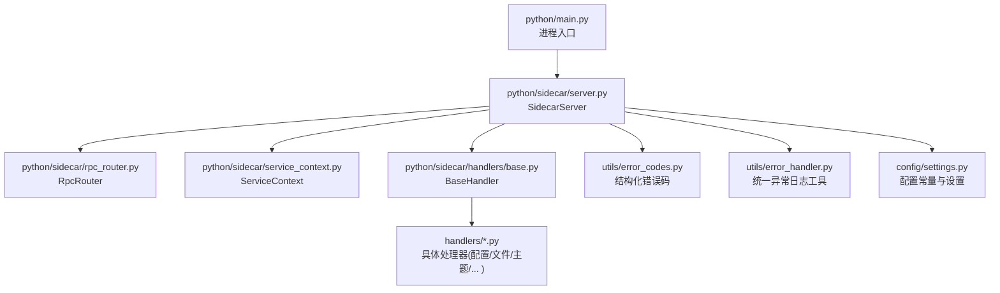
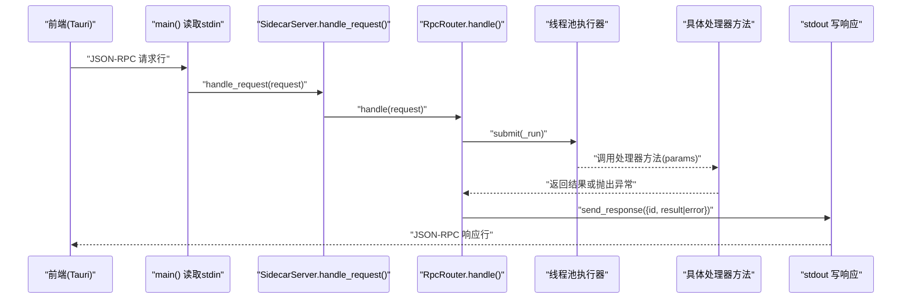
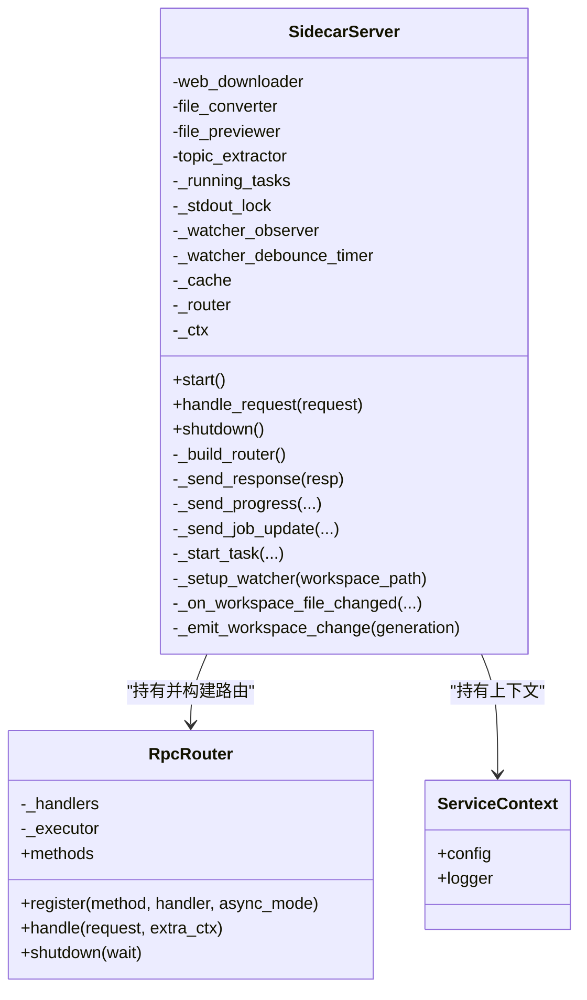
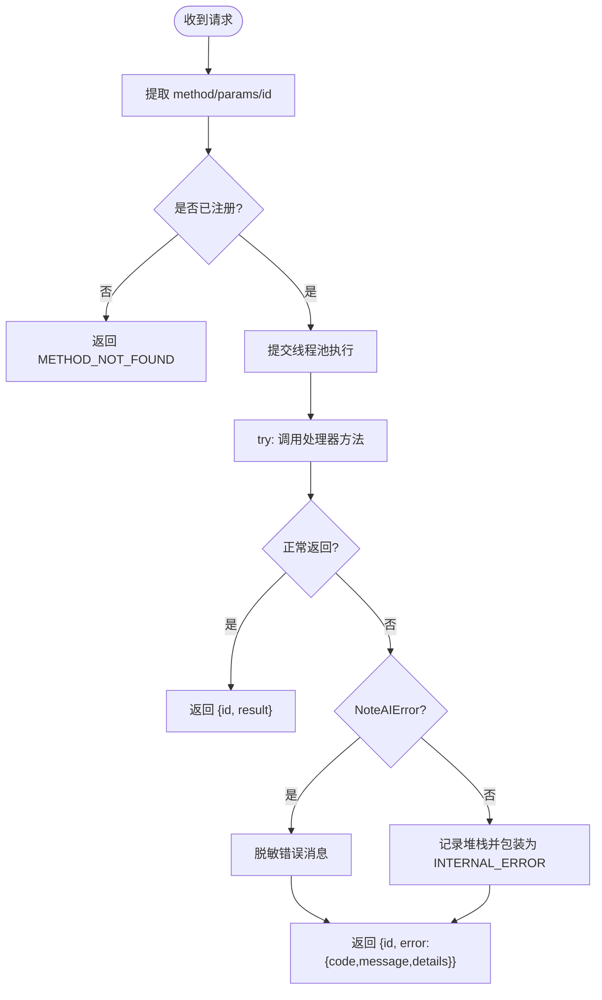
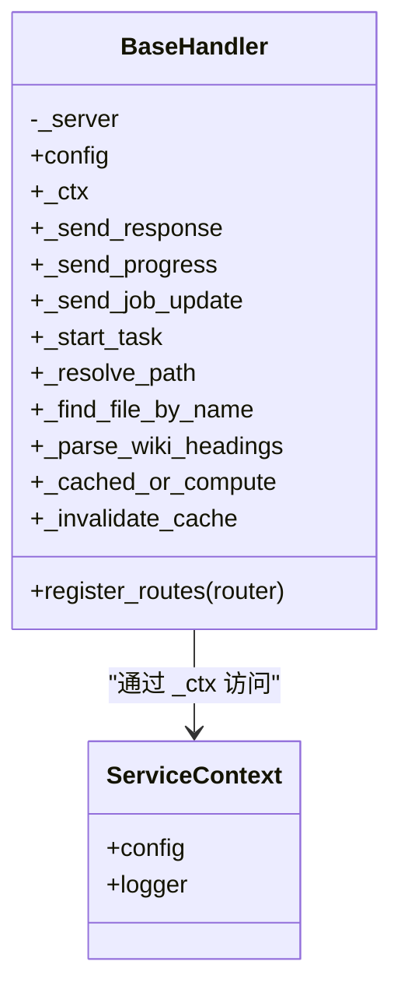
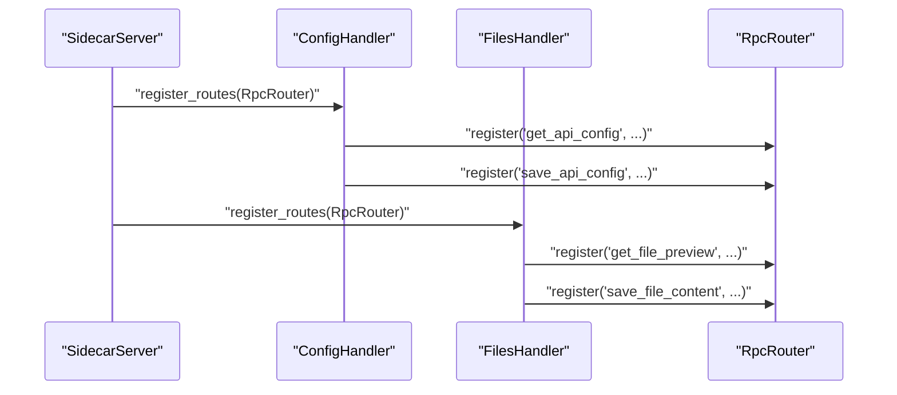
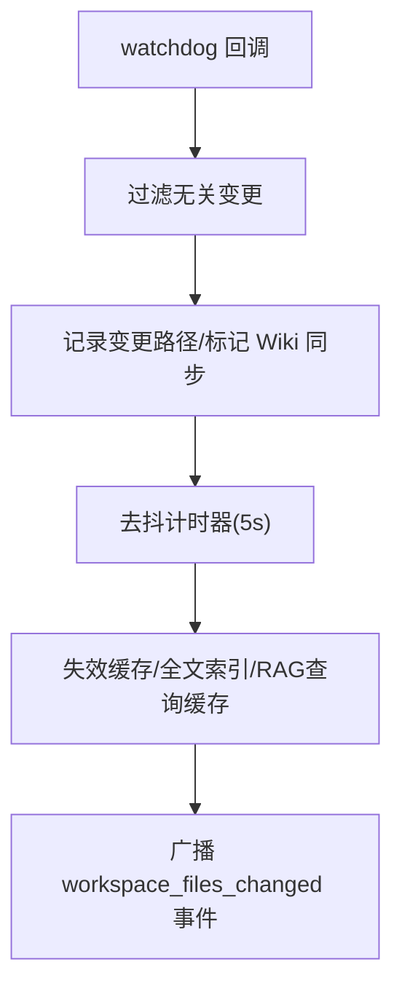
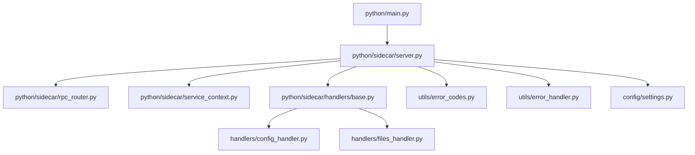

# Python Sidecar 服务

<cite>
**本文引用的文件**   
- [python/main.py](file://python/main.py)
- [python/sidecar/server.py](file://python/sidecar/server.py)
- [python/sidecar/rpc_router.py](file://python/sidecar/rpc_router.py)
- [python/sidecar/service_context.py](file://python/sidecar/service_context.py)
- [python/sidecar/handlers/base.py](file://python/sidecar/handlers/base.py)
- [python/sidecar/handlers/config_handler.py](file://python/sidecar/handlers/config_handler.py)
- [python/sidecar/handlers/files_handler.py](file://python/sidecar/handlers/files_handler.py)
- [utils/error_codes.py](file://utils/error_codes.py)
- [utils/error_handler.py](file://utils/error_handler.py)
- [config/settings.py](file://config/settings.py)
- [tests/unit/test_rpc_router.py](file://tests/unit/test_rpc_router.py)
- [tests/integration/test_sidecar_contracts.py](file://tests/integration/test_sidecar_contracts.py)
</cite>

## 目录
1. [简介](#简介)
2. [项目结构](#项目结构)
3. [核心组件](#核心组件)
4. [架构总览](#架构总览)
5. [详细组件分析](#详细组件分析)
6. [依赖关系分析](#依赖关系分析)
7. [性能与并发](#性能与并发)
8. [故障排查指南](#故障排查指南)
9. [结论](#结论)
10. [附录](#附录)

## 简介
本文件为 NoteAI 的 Python Sidecar 服务提供全面的架构文档。Sidecar 作为 Tauri 前端的后端进程，通过标准输入/输出传输 JSON-RPC 请求，负责工作区文件监听、配置管理、知识库索引、RAG 检索、云同步、CLI Agent 等能力。本文重点阐述：
- SidecarServer 核心服务类的设计与实现（启动、生命周期、资源清理）
- JSON-RPC 协议的具体实现（路由、响应、错误处理）
- ServiceContext 服务上下文的管理（依赖注入、配置、状态）
- 处理器注册机制（动态注册、模块发现、插件扩展）
- 异步处理模型、线程安全与并发控制策略
- 配套架构图、RPC 调用流程图与错误处理流程图

## 项目结构
Python Sidecar 的核心位于 python/sidecar 目录，入口在 python/main.py，主服务类在 server.py，JSON-RPC 路由在 rpc_router.py，服务上下文在 service_context.py，各业务处理器在 handlers 子包中。

图表来源
- [python/main.py:1-21](file://python/main.py#L1-L21)
- [python/sidecar/server.py:54-125](file://python/sidecar/server.py#L54-L125)
- [python/sidecar/rpc_router.py:43-106](file://python/sidecar/rpc_router.py#L43-L106)
- [python/sidecar/service_context.py:6-19](file://python/sidecar/service_context.py#L6-L19)
- [python/sidecar/handlers/base.py:4-106](file://python/sidecar/handlers/base.py#L4-L106)
- [utils/error_codes.py:14-120](file://utils/error_codes.py#L14-L120)
- [utils/error_handler.py:24-120](file://utils/error_handler.py#L24-L120)
- [config/settings.py:1-41](file://config/settings.py#L1-L41)

章节来源
- [python/main.py:1-21](file://python/main.py#L1-L21)
- [python/sidecar/server.py:54-125](file://python/sidecar/server.py#L54-L125)

## 核心组件
- SidecarServer：进程级服务，负责初始化依赖、构建 RPC 路由、启动工作区文件监听、后台任务调度、响应发送与优雅关闭。
- RpcRouter：轻量 JSON-RPC 路由器，支持同步/异步处理器，基于线程池执行，统一错误格式化与消息脱敏。
- ServiceContext：显式依赖注入容器，向处理器提供 config 与 logger，避免全局耦合。
- BaseHandler：处理器基类，暴露统一的上下文访问、路径解析、缓存失效、进度与任务管理等能力。
- 具体处理器：按功能域划分（配置、文件、主题、标签、RAG、云同步、CLI Agent、MCP 配置等），各自注册方法到 RpcRouter。

章节来源
- [python/sidecar/server.py:54-125](file://python/sidecar/server.py#L54-L125)
- [python/sidecar/rpc_router.py:43-106](file://python/sidecar/rpc_router.py#L43-L106)
- [python/sidecar/service_context.py:6-19](file://python/sidecar/service_context.py#L6-L19)
- [python/sidecar/handlers/base.py:4-106](file://python/sidecar/handlers/base.py#L4-L106)

## 架构总览
整体采用“单进程 + 多处理器”的架构：Tauri 前端通过 stdin/stdout 与 Python Sidecar 进行 JSON-RPC 通信；Sidecar 内部使用线程池并行处理请求，并通过 watchdog 监听工作区变更，触发增量更新与缓存失效。

图表来源
- [python/main.py:17-21](file://python/main.py#L17-L21)
- [python/sidecar/server.py:541-543](file://python/sidecar/server.py#L541-L543)
- [python/sidecar/rpc_router.py:54-83](file://python/sidecar/rpc_router.py#L54-L83)
- [python/sidecar/server.py:126-130](file://python/sidecar/server.py#L126-L130)

## 详细组件分析

### SidecarServer 设计与实现
- 构造阶段：创建外部依赖实例（WebDownloader、FileConverterManager、FilePreviewer、TopicExtractor）、初始化运行任务集合与锁、stdout 锁、watchdog 观察者、去抖计时器、自动转换并发控制锁、链接发现锁、TTL 缓存、RpcRouter 与 ServiceContext，并构建路由表。
- 启动阶段：start() 启动工作区文件监听与启动期同步任务（合并规则、同步主题、修复断链、WIKI 同步、启动巡检、按需重建 RAG 索引）。
- 请求处理：handle_request() 委托给 RpcRouter.handle()。
- 响应与事件：_send_response() 序列化写入 stdout；_send_progress/_send_job_update 封装任务进度与状态事件。
- 后台任务：_start_task() 以守护线程执行，统一记录任务开始/完成/失败，并维护 _running_tasks 防止重复。
- 文件监听：_setup_watcher() 基于 watchdog 递归监听工作区，过滤隐藏/忽略目录与 wiki 目录，仅对受控后缀敏感；_on_workspace_file_changed() 聚合变更、触发自动处理（Markdown 自动分配主题、非 Markdown 自动转换）、标记 WIKI 同步需求，并使用定时器去抖后批量失效缓存并广播 workspace_files_changed 事件。
- 生命周期：shutdown() 停止 watcher、关闭路由线程池、关闭 LLM 与检索执行器、清理 RAG 集合缓存。

图表来源
- [python/sidecar/server.py:54-125](file://python/sidecar/server.py#L54-L125)
- [python/sidecar/server.py:184-214](file://python/sidecar/server.py#L184-L214)
- [python/sidecar/server.py:298-339](file://python/sidecar/server.py#L298-L339)
- [python/sidecar/server.py:416-539](file://python/sidecar/server.py#L416-L539)
- [python/sidecar/server.py:544-568](file://python/sidecar/server.py#L544-L568)
- [python/sidecar/rpc_router.py:43-106](file://python/sidecar/rpc_router.py#L43-L106)
- [python/sidecar/service_context.py:6-19](file://python/sidecar/service_context.py#L6-L19)

章节来源
- [python/sidecar/server.py:54-125](file://python/sidecar/server.py#L54-L125)
- [python/sidecar/server.py:184-214](file://python/sidecar/server.py#L184-L214)
- [python/sidecar/server.py:298-339](file://python/sidecar/server.py#L298-L339)
- [python/sidecar/server.py:416-539](file://python/sidecar/server.py#L416-L539)
- [python/sidecar/server.py:544-568](file://python/sidecar/server.py#L544-L568)

### JSON-RPC 协议实现（路由、响应、错误处理）
- 路由注册：各处理器在 register_routes(router) 中调用 router.register("method_name", handler_fn[, async_mode]) 完成方法绑定。
- 请求分发：RpcRouter.handle() 从请求中提取 method/params/id，查找处理器；未找到则返回 METHOD_NOT_FOUND。
- 执行模型：所有处理器均提交至 ThreadPoolExecutor 执行，避免阻塞 stdin 读循环；async_mode 参数用于语义标注（当前实现仍走线程池）。
- 响应格式：成功返回 {"id": req_id, "result": ...}；异常返回 {"id": req_id, "error": {...}}。
- 错误处理：
  - 领域异常 NoteAIError：携带 ErrorCode、message、details，由 make_error 生成结构化错误体。
  - 通用异常：记录堆栈并转换为 INTERNAL_ERROR。
  - 消息脱敏：_sanitize_error_message 替换工作区与 home 绝对路径，避免泄露敏感信息。

图表来源
- [python/sidecar/rpc_router.py:54-83](file://python/sidecar/rpc_router.py#L54-L83)
- [python/sidecar/rpc_router.py:14-32](file://python/sidecar/rpc_router.py#L14-L32)
- [utils/error_codes.py:82-120](file://utils/error_codes.py#L82-L120)

章节来源
- [python/sidecar/rpc_router.py:43-106](file://python/sidecar/rpc_router.py#L43-L106)
- [utils/error_codes.py:14-120](file://utils/error_codes.py#L14-L120)
- [tests/unit/test_rpc_router.py:34-122](file://tests/unit/test_rpc_router.py#L34-L122)

### ServiceContext 服务上下文
- 设计目标：替代全局 from config import config 和 from utils.logger import logger 模式，通过显式依赖注入将配置与日志对象传递给处理器。
- 字段：config、logger，供处理器通过 BaseHandler 属性代理访问。
- 使用方式：SidecarServer 构造时传入 config 与 logger 实例化 ServiceContext，处理器通过 self._ctx.config/self._ctx.logger 获取。

图表来源
- [python/sidecar/service_context.py:6-19](file://python/sidecar/service_context.py#L6-L19)
- [python/sidecar/handlers/base.py:4-106](file://python/sidecar/handlers/base.py#L4-L106)

章节来源
- [python/sidecar/service_context.py:6-19](file://python/sidecar/service_context.py#L6-L19)
- [python/sidecar/handlers/base.py:4-106](file://python/sidecar/handlers/base.py#L4-L106)

### 处理器注册机制与扩展点
- 注册流程：每个处理器继承 BaseHandler，实现 register_routes(router)，在构造函数中接收 server 引用，从而访问 _ctx、_send_response、_start_task 等能力。
- 动态加载：SidecarServer._build_router() 集中调用各处理器 register_routes，新增处理器只需在此处添加一行注册即可接入。
- 模块发现：当前为显式导入与注册，便于测试与可控性；如需热插拔可扩展扫描特定包下符合命名约定的处理器类并反射注册。
- 示例：ConfigHandler 注册 get_api_config/save_api_config/get_ui_config/save_ui_config/test_api_connection 等方法；FilesHandler 注册预览、保存、删除、移动、创建笔记等方法。

图表来源
- [python/sidecar/server.py:107-125](file://python/sidecar/server.py#L107-L125)
- [python/sidecar/handlers/config_handler.py:17-30](file://python/sidecar/handlers/config_handler.py#L17-L30)
- [python/sidecar/handlers/files_handler.py:414-425](file://python/sidecar/handlers/files_handler.py#L414-L425)

章节来源
- [python/sidecar/server.py:107-125](file://python/sidecar/server.py#L107-L125)
- [python/sidecar/handlers/config_handler.py:17-30](file://python/sidecar/handlers/config_handler.py#L17-L30)
- [python/sidecar/handlers/files_handler.py:414-425](file://python/sidecar/handlers/files_handler.py#L414-L425)

### 异步处理模型、线程安全与并发控制
- 请求并发：RpcRouter 使用固定大小线程池（默认 8 个 worker）执行处理器，确保 stdin 读循环不被阻塞。
- 任务并发：SidecarServer._start_task() 使用守护线程执行耗时任务，并通过 _running_tasks 集合与锁避免重复启动同名任务。
- 文件系统监听并发：watchdog 回调可能高频触发，使用 _watcher_debounce_lock 保护变更集合与生成号，Timer 去抖合并事件，减少频繁 I/O 与缓存失效。
- 自动转换并发：_auto_convert_inflight 集合与 _auto_convert_lock 保证同一源文件只触发一次转换。
- 输出安全：_stdout_lock 保证 JSON 响应串行写入 stdout，避免交错。
- 资源清理：shutdown() 顺序停止 watcher、关闭路由线程池、关闭 LLM 与检索执行器、清理 RAG 集合缓存。

图表来源
- [python/sidecar/server.py:416-539](file://python/sidecar/server.py#L416-L539)
- [python/sidecar/server.py:184-214](file://python/sidecar/server.py#L184-L214)
- [python/sidecar/server.py:126-130](file://python/sidecar/server.py#L126-L130)

章节来源
- [python/sidecar/server.py:184-214](file://python/sidecar/server.py#L184-L214)
- [python/sidecar/server.py:416-539](file://python/sidecar/server.py#L416-L539)
- [python/sidecar/server.py:126-130](file://python/sidecar/server.py#L126-L130)

### 关键处理器行为示例
- 配置处理器（ConfigHandler）：提供 API 配置、UI 配置、主题偏好、项目与工作区规则读写、连接测试等接口；保存操作在配置锁内原子更新并持久化。
- 文件处理器（FilesHandler）：提供文件预览（大文件分片 raw_slices 或语义 HTML）、保存内容（含大小限制与保护目录校验）、删除（回收站）、移动（跨目录且防逃逸）、创建笔记（自动生成 frontmatter 与变更记录）等接口。

章节来源
- [python/sidecar/handlers/config_handler.py:17-30](file://python/sidecar/handlers/config_handler.py#L17-L30)
- [python/sidecar/handlers/config_handler.py:50-78](file://python/sidecar/handlers/config_handler.py#L50-L78)
- [python/sidecar/handlers/files_handler.py:42-67](file://python/sidecar/handlers/files_handler.py#L42-L67)
- [python/sidecar/handlers/files_handler.py:117-149](file://python/sidecar/handlers/files_handler.py#L117-L149)
- [python/sidecar/handlers/files_handler.py:219-280](file://python/sidecar/handlers/files_handler.py#L219-L280)
- [python/sidecar/handlers/files_handler.py:282-323](file://python/sidecar/handlers/files_handler.py#L282-L323)
- [python/sidecar/handlers/files_handler.py:363-412](file://python/sidecar/handlers/files_handler.py#L363-L412)

## 依赖关系分析
- 进程入口：python/main.py 设置环境变量并调用 sidecar.server.main。
- 服务层：server.py 组合多个模块（watchdog、file converter、preview、topic extractor、job_status、fulltext_index、ttl_cache、rag 预热等），并通过 RpcRouter 暴露能力。
- 错误体系：utils.error_codes 定义 ErrorCode 与 make_error/NoteAIError；utils.error_handler 提供 log_exception/swallow/log_and_reraise 等工具。
- 配置：config.settings 导出 AppConfig、workspace 常量与工具函数。

图表来源
- [python/main.py:17-21](file://python/main.py#L17-L21)
- [python/sidecar/server.py:54-125](file://python/sidecar/server.py#L54-L125)
- [python/sidecar/rpc_router.py:43-106](file://python/sidecar/rpc_router.py#L43-L106)
- [python/sidecar/service_context.py:6-19](file://python/sidecar/service_context.py#L6-L19)
- [python/sidecar/handlers/base.py:4-106](file://python/sidecar/handlers/base.py#L4-L106)
- [python/sidecar/handlers/config_handler.py:17-30](file://python/sidecar/handlers/config_handler.py#L17-L30)
- [python/sidecar/handlers/files_handler.py:414-425](file://python/sidecar/handlers/files_handler.py#L414-L425)
- [utils/error_codes.py:14-120](file://utils/error_codes.py#L14-L120)
- [utils/error_handler.py:24-120](file://utils/error_handler.py#L24-L120)
- [config/settings.py:1-41](file://config/settings.py#L1-L41)

章节来源
- [python/main.py:17-21](file://python/main.py#L17-L21)
- [python/sidecar/server.py:54-125](file://python/sidecar/server.py#L54-L125)
- [utils/error_codes.py:14-120](file://utils/error_codes.py#L14-L120)
- [utils/error_handler.py:24-120](file://utils/error_handler.py#L24-L120)
- [config/settings.py:1-41](file://config/settings.py#L1-L41)

## 性能与并发
- 线程池大小：RpcRouter 默认最大 8 个工作线程，适合 CPU 密集与 I/O 混合场景；可根据部署环境调整。
- 去抖策略：文件变更事件 5 秒去抖，降低频繁 I/O 与缓存失效开销。
- 缓存策略：TTLCache 配合 fulltext_index 与 RAG 查询缓存失效，提升热点数据读取性能。
- 输出串行化：stdout 写入加锁，避免 JSON 交错导致前端解析失败。
- 建议：
  - 高并发场景可考虑增大线程池上限或拆分处理器为独立进程。
  - 大文件预览优先使用 raw_slices 传输，减少内存占用。
  - 对长时间运行的任务使用 job_status 上报进度，便于前端展示与取消。

[本节为通用指导，不直接分析具体文件]

## 故障排查指南
- 未知方法错误：检查处理器是否正确注册对应方法名；确认 RpcRouter 已包含该处理器 register_routes 调用。
- 路径越界/非法字符：文件处理器对路径进行工作区边界校验与非法字符过滤，若报错请检查传入路径与工作区设置。
- 错误消息脱敏：若消息中包含 <workspace>/<home> 占位符，说明已做脱敏；定位问题时可在服务端日志查看原始堆栈。
- 任务未完成：通过 job_status 查询任务状态；若卡住，检查 _running_tasks 与线程池是否耗尽。
- 文件监听无效：确认工作区路径存在且未被忽略；检查 WATCHED_WORKSPACE_SUFFIXES 与 is_ignored_dir 规则。

章节来源
- [python/sidecar/rpc_router.py:54-83](file://python/sidecar/rpc_router.py#L54-L83)
- [python/sidecar/handlers/files_handler.py:117-149](file://python/sidecar/handlers/files_handler.py#L117-L149)
- [python/sidecar/server.py:416-539](file://python/sidecar/server.py#L416-L539)
- [utils/error_codes.py:82-120](file://utils/error_codes.py#L82-L120)
- [utils/error_handler.py:24-120](file://utils/error_handler.py#L24-L120)

## 结论
Python Sidecar 服务以 SidecarServer 为核心，结合 RpcRouter 与 ServiceContext，实现了清晰的职责分层与显式依赖注入；通过 watchdog 与去抖策略高效响应工作区变更；借助线程池与任务状态机保障并发与可观测性；统一的错误码与消息脱敏提升了健壮性与安全性。未来可按需引入更灵活的处理器发现机制与可配置的线程池规模，以适应更大规模的集成场景。

[本节为总结性内容，不直接分析具体文件]

## 附录
- 端到端测试参考：
  - RPC 路由行为与错误脱敏：tests/unit/test_rpc_router.py
  - 工作区树、预览契约、标签与主题联动、Schema 与 Ingest 行为：tests/integration/test_sidecar_contracts.py

章节来源
- [tests/unit/test_rpc_router.py:34-122](file://tests/unit/test_rpc_router.py#L34-L122)
- [tests/integration/test_sidecar_contracts.py:52-639](file://tests/integration/test_sidecar_contracts.py#L52-L639)