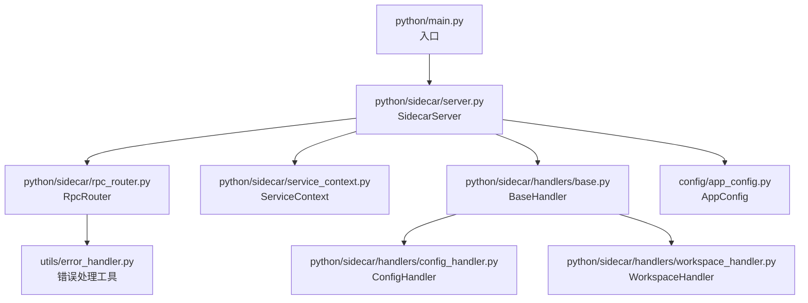
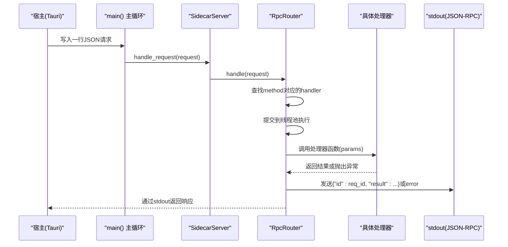
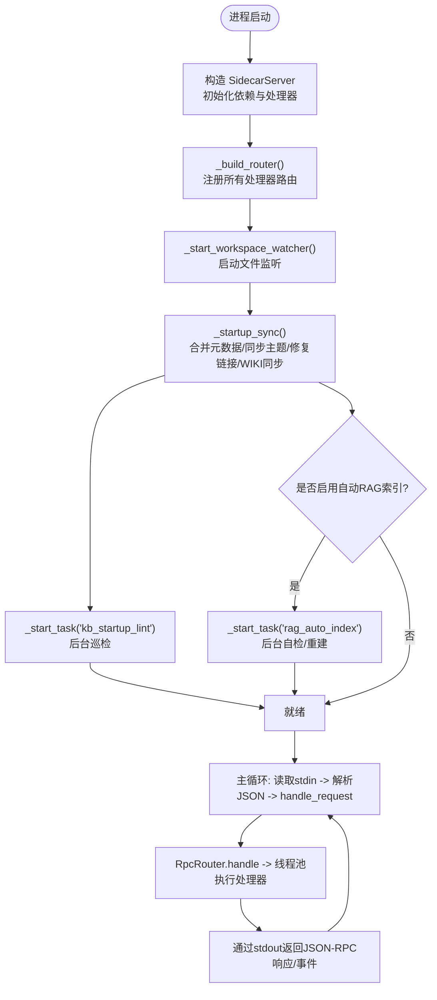
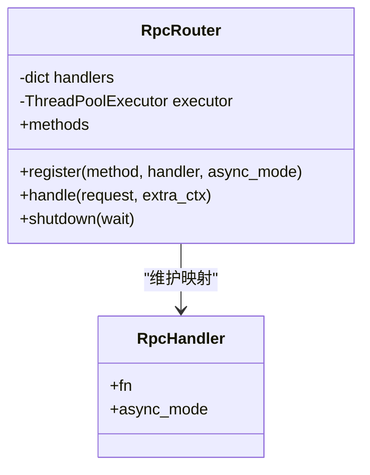
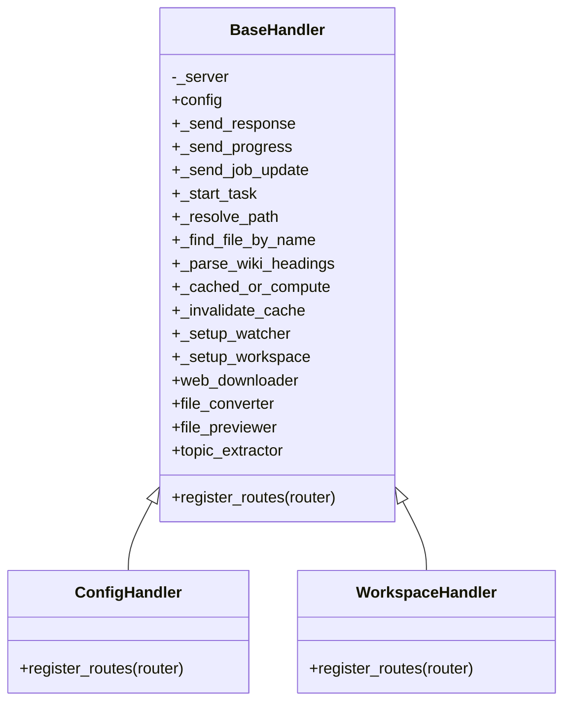
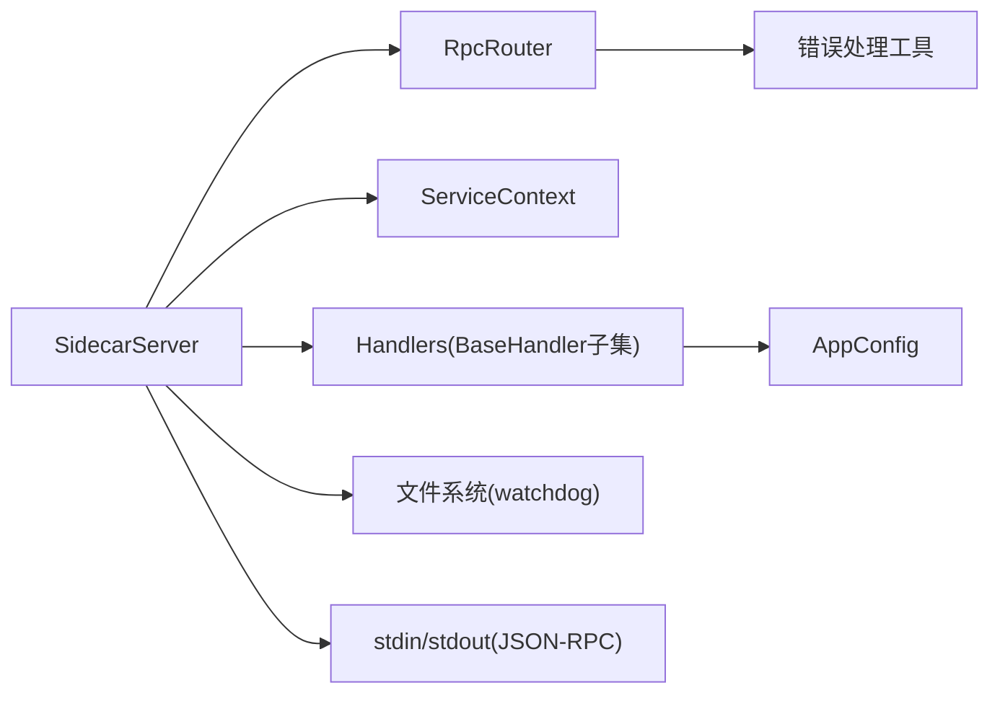

# SidecarServer 核心服务

<cite>
**本文引用的文件**   
- [python/sidecar/server.py](file://python/sidecar/server.py)
- [python/main.py](file://python/main.py)
- [python/sidecar/rpc_router.py](file://python/sidecar/rpc_router.py)
- [python/sidecar/service_context.py](file://python/sidecar/service_context.py)
- [python/sidecar/handlers/base.py](file://python/sidecar/handlers/base.py)
- [python/sidecar/handlers/config_handler.py](file://python/sidecar/handlers/config_handler.py)
- [python/sidecar/handlers/workspace_handler.py](file://python/sidecar/handlers/workspace_handler.py)
- [config/app_config.py](file://config/app_config.py)
- [utils/error_handler.py](file://utils/error_handler.py)
</cite>

## 目录
1. [简介](#简介)
2. [项目结构](#项目结构)
3. [核心组件](#核心组件)
4. [架构总览](#架构总览)
5. [详细组件分析](#详细组件分析)
6. [依赖关系分析](#依赖关系分析)
7. [性能考量](#性能考量)
8. [故障排查指南](#故障排查指南)
9. [结论](#结论)
10. [附录：扩展与自定义示例](#附录扩展与自定义示例)

## 简介
SidecarServer 是 NoteAI 的 Python 侧车进程，负责通过标准输入/输出与宿主（Tauri）进行 JSON-RPC 通信，并提供工作区文件监听、自动转换、RAG 索引自检、任务进度上报等能力。其设计强调：
- 清晰的启动流程与生命周期管理
- 基于线程池的多线程处理模型
- 优雅关闭与资源释放
- 可扩展的处理器注册机制与依赖注入上下文

## 项目结构
- 入口与主循环
  - python/main.py：设置运行时环境变量并调用 sidecar.server.main 启动主循环
  - python/sidecar/server.py：定义 SidecarServer 类，包含路由构建、请求分发、后台任务、文件监听与优雅关闭
- RPC 路由与错误处理
  - python/sidecar/rpc_router.py：轻量级 JSON-RPC 路由器，支持同步/异步处理器，统一错误封装与线程池调度
  - utils/error_handler.py：统一的异常记录与装饰器工具
- 配置与上下文
  - config/app_config.py：AppConfig 数据类，负责加载/保存配置、工作区路径、API 密钥等
  - python/sidecar/service_context.py：ServiceContext 作为依赖注入容器，向处理器提供配置与日志
- 处理器基类与示例
  - python/sidecar/handlers/base.py：BaseHandler 为所有处理器提供统一的能力访问（配置、发送响应、任务启动、缓存失效等）
  - python/sidecar/handlers/config_handler.py：配置相关 API（API 配置、UI 配置、主题偏好、项目规则与工作区规则）
  - python/sidecar/handlers/workspace_handler.py：工作区状态、路径设置、树形浏览、健康检查等

图表来源
- [python/main.py:17-21](file://python/main.py#L17-L21)
- [python/sidecar/server.py:54-125](file://python/sidecar/server.py#L54-L125)
- [python/sidecar/rpc_router.py:43-106](file://python/sidecar/rpc_router.py#L43-L106)
- [python/sidecar/service_context.py:6-19](file://python/sidecar/service_context.py#L6-L19)
- [python/sidecar/handlers/base.py:4-106](file://python/sidecar/handlers/base.py#L4-L106)
- [python/sidecar/handlers/config_handler.py:16-30](file://python/sidecar/handlers/config_handler.py#L16-L30)
- [python/sidecar/handlers/workspace_handler.py:34-44](file://python/sidecar/handlers/workspace_handler.py#L34-L44)
- [config/app_config.py:28-100](file://config/app_config.py#L28-L100)
- [utils/error_handler.py:24-51](file://utils/error_handler.py#L24-L51)

章节来源
- [python/main.py:1-21](file://python/main.py#L1-L21)
- [python/sidecar/server.py:54-125](file://python/sidecar/server.py#L54-L125)
- [python/sidecar/rpc_router.py:43-106](file://python/sidecar/rpc_router.py#L43-L106)
- [python/sidecar/service_context.py:6-19](file://python/sidecar/service_context.py#L6-L19)
- [python/sidecar/handlers/base.py:4-106](file://python/sidecar/handlers/base.py#L4-L106)
- [python/sidecar/handlers/config_handler.py:16-30](file://python/sidecar/handlers/config_handler.py#L16-L30)
- [python/sidecar/handlers/workspace_handler.py:34-44](file://python/sidecar/handlers/workspace_handler.py#L34-L44)
- [config/app_config.py:28-100](file://config/app_config.py#L28-L100)
- [utils/error_handler.py:24-51](file://utils/error_handler.py#L24-L51)

## 核心组件
- SidecarServer
  - 职责：初始化依赖、构建路由、启动文件监听、启动后同步任务、处理请求、优雅关闭
  - 关键方法：__init__, start, _build_router, handle_request, shutdown
- RpcRouter
  - 职责：注册方法、分发请求、线程池执行、统一错误封装与返回
  - 关键属性/方法：register, handle, methods, shutdown
- ServiceContext
  - 职责：集中持有配置与日志对象，供处理器通过依赖注入访问
- BaseHandler
  - 职责：为各功能处理器提供统一能力访问（配置、发送响应、任务启动、缓存失效、工作区操作等）
- AppConfig
  - 职责：加载/保存配置、工作区路径、API 密钥、RAG 参数等；提供线程安全的读写与持久化

章节来源
- [python/sidecar/server.py:54-125](file://python/sidecar/server.py#L54-L125)
- [python/sidecar/rpc_router.py:43-106](file://python/sidecar/rpc_router.py#L43-L106)
- [python/sidecar/service_context.py:6-19](file://python/sidecar/service_context.py#L6-L19)
- [python/sidecar/handlers/base.py:4-106](file://python/sidecar/handlers/base.py#L4-L106)
- [config/app_config.py:28-100](file://config/app_config.py#L28-L100)

## 架构总览
SidecarServer 采用“单进程 + 多线程”的架构：
- 主线程：读取 stdin 行，解析 JSON-RPC 请求，交给 RpcRouter 处理
- 线程池：RpcRouter 内部使用 ThreadPoolExecutor 并行执行处理器逻辑，避免阻塞主循环
- 后台任务：SidecarServer 在启动时启动文件监听、知识库巡检、RAG 索引自检等后台任务
- 事件通道：通过 stdout 以 JSON 行协议向 Tauri 推送结果与事件（如进度、工作区变更）

图表来源
- [python/main.py:17-21](file://python/main.py#L17-L21)
- [python/sidecar/server.py:540-595](file://python/sidecar/server.py#L540-L595)
- [python/sidecar/rpc_router.py:54-83](file://python/sidecar/rpc_router.py#L54-L83)

## 详细组件分析

### SidecarServer 设计与实现
- 初始化与依赖注入
  - 创建 WebDownloader、FileConverterManager、FilePreviewer、TopicExtractor 等模块实例
  - 构建 ServiceContext(config, logger)，用于处理器访问配置与日志
  - 实例化各功能处理器（ConfigHandler、WorkspaceHandler、FilesHandler 等），并通过 _build_router 注册路由
- 启动流程
  - start()：启动工作区文件监听与启动后同步任务（合并元数据、同步文件夹主题、修复链接、WIKI 同步、知识库巡检、RAG 索引自检）
  - _startup_sync：根据配置决定是否触发 RAG 自动重建索引，并发送 workspace_files_changed 事件
- 运行模式
  - 单线程读取 stdin，多线程执行处理器（ThreadPoolExecutor，最大工作线程数由 RpcRouter._MAX_WORKERS 控制）
- 文件监听与去抖
  - 使用 watchdog Observer 监听工作区变化，过滤隐藏/忽略目录与 wiki 目录
  - 对 .md 文件自动分配主题与自动转换非 Markdown 文件（PDF/DOCX/PPTX/HTML/TXT 等）
  - 使用 Timer 去抖，批量失效缓存并触发 WIKI 同步
- 任务管理与进度上报
  - _start_task：防重入、启动 job_status、线程包装、异常捕获与完成/失败状态更新
  - _send_progress/_send_job_update：统一的任务进度与状态事件推送
- 优雅关闭
  - shutdown：停止文件监听、关闭 RpcRouter 线程池、关闭 LLM 执行器与检索执行器、清理 RAG 集合缓存

图表来源
- [python/sidecar/server.py:54-125](file://python/sidecar/server.py#L54-L125)
- [python/sidecar/server.py:216-255](file://python/sidecar/server.py#L216-L255)
- [python/sidecar/server.py:298-339](file://python/sidecar/server.py#L298-L339)
- [python/sidecar/server.py:416-540](file://python/sidecar/server.py#L416-L540)
- [python/sidecar/server.py:540-595](file://python/sidecar/server.py#L540-L595)

章节来源
- [python/sidecar/server.py:54-125](file://python/sidecar/server.py#L54-L125)
- [python/sidecar/server.py:216-255](file://python/sidecar/server.py#L216-L255)
- [python/sidecar/server.py:298-339](file://python/sidecar/server.py#L298-L339)
- [python/sidecar/server.py:416-540](file://python/sidecar/server.py#L416-L540)
- [python/sidecar/server.py:540-595](file://python/sidecar/server.py#L540-L595)

### RpcRouter 路由与错误恢复
- 路由注册与分发
  - register(method, handler, async_mode=False)：将方法名映射到处理器
  - handle(request)：提取 method/params/id，查找处理器，提交到线程池执行
- 错误恢复策略
  - 未知方法：返回 METHOD_NOT_FOUND
  - 业务异常：NoteAIError 转换为结构化错误
  - 未预期异常：INTERNAL_ERROR，并对消息进行脱敏（去除绝对路径与家目录提示）
- 线程池与关闭
  - 使用 ThreadPoolExecutor(max_workers=8) 执行处理器
  - shutdown(wait=False)：快速关闭线程池，不等待未完成任务

图表来源
- [python/sidecar/rpc_router.py:35-106](file://python/sidecar/rpc_router.py#L35-L106)

章节来源
- [python/sidecar/rpc_router.py:43-106](file://python/sidecar/rpc_router.py#L43-L106)
- [utils/error_handler.py:24-51](file://utils/error_handler.py#L24-L51)

### 处理器基类与示例
- BaseHandler
  - 提供对服务器能力的代理访问：配置、发送响应/进度/任务更新、路径解析、缓存失效、工作区设置、主题级联更新、批量自动分配主题、Web下载/文件转换/预览/主题提取器等
  - 要求子类实现 register_routes(router) 来注册方法
- ConfigHandler
  - 注册 API/UI/主题/项目规则/工作区规则等方法
  - 保存 UI 配置时对 RAG 相关键进行缓存清理
- WorkspaceHandler
  - 注册工作区状态查询、路径校验、清除已保存工作区、设置工作区路径、获取工作区树、文件选择、刷新日志、知识库健康检查等方法
  - 工作区树构建限制递归深度，忽略特定目录与 README.md

图表来源
- [python/sidecar/handlers/base.py:4-106](file://python/sidecar/handlers/base.py#L4-L106)
- [python/sidecar/handlers/config_handler.py:16-30](file://python/sidecar/handlers/config_handler.py#L16-L30)
- [python/sidecar/handlers/workspace_handler.py:34-44](file://python/sidecar/handlers/workspace_handler.py#L34-L44)

章节来源
- [python/sidecar/handlers/base.py:4-106](file://python/sidecar/handlers/base.py#L4-L106)
- [python/sidecar/handlers/config_handler.py:16-30](file://python/sidecar/handlers/config_handler.py#L16-L30)
- [python/sidecar/handlers/workspace_handler.py:34-44](file://python/sidecar/handlers/workspace_handler.py#L34-L44)

### 配置加载与依赖注入
- AppConfig
  - 从配置文件、系统目录 API 配置、环境变量、工作区状态文件加载配置
  - 线程安全读写（_lock），保存时将 API Key 优先存储到系统钥匙串，其余字段落盘
- ServiceContext
  - 聚合 config 与 logger，处理器通过 BaseHandler 间接访问，避免全局耦合

章节来源
- [config/app_config.py:212-396](file://config/app_config.py#L212-L396)
- [python/sidecar/service_context.py:6-19](file://python/sidecar/service_context.py#L6-L19)
- [python/sidecar/handlers/base.py:8-31](file://python/sidecar/handlers/base.py#L8-L31)

## 依赖关系分析
- 组件耦合
  - SidecarServer 强依赖 RpcRouter、ServiceContext、各处理器与外部模块（文件转换、预览、主题提取、RAG、云同步等）
  - 处理器通过 BaseHandler 弱耦合地访问服务器能力，便于测试与替换
- 直接/间接依赖
  - RpcRouter 依赖错误处理工具与日志
  - 处理器依赖配置与工作区状态管理器
- 外部集成点
  - 标准输入/输出（JSON-RPC）
  - 文件系统（watchdog 监听）
  - 系统目录与钥匙串（API Key 存储）

图表来源
- [python/sidecar/server.py:54-125](file://python/sidecar/server.py#L54-L125)
- [python/sidecar/rpc_router.py:43-106](file://python/sidecar/rpc_router.py#L43-L106)
- [python/sidecar/service_context.py:6-19](file://python/sidecar/service_context.py#L6-L19)
- [python/sidecar/handlers/base.py:4-106](file://python/sidecar/handlers/base.py#L4-L106)
- [config/app_config.py:28-100](file://config/app_config.py#L28-L100)

章节来源
- [python/sidecar/server.py:54-125](file://python/sidecar/server.py#L54-L125)
- [python/sidecar/rpc_router.py:43-106](file://python/sidecar/rpc_router.py#L43-L106)
- [python/sidecar/service_context.py:6-19](file://python/sidecar/service_context.py#L6-L19)
- [python/sidecar/handlers/base.py:4-106](file://python/sidecar/handlers/base.py#L4-L106)
- [config/app_config.py:28-100](file://config/app_config.py#L28-L100)

## 性能考量
- 并发模型
  - 主循环单线程读取 stdin，避免竞争；处理器通过线程池并行执行，提高吞吐
  - 线程池大小固定（默认 8），可根据负载调整 RpcRouter._MAX_WORKERS
- 缓存与去抖
  - TTLCache 按 key 缓存计算结果，文件变更时失效 RPC 与全文检索缓存
  - 文件监听使用 Timer 去抖，减少频繁事件导致的重复处理
- 资源释放
  - 优雅关闭时停止监听、关闭线程池与外部执行器，清理 RAG 集合缓存，避免句柄泄漏

[本节为通用指导，无需源码引用]

## 故障排查指南
- 常见错误类型
  - 未知方法：METHOD_NOT_FOUND，检查方法名是否正确注册
  - 业务异常：NoteAIError，查看错误码与消息
  - 内部异常：INTERNAL_ERROR，查看日志中的堆栈信息
- 定位步骤
  - 查看 stderr/stdout 日志输出，确认错误上下文
  - 检查 RpcRouter 的错误脱敏是否掩盖了必要信息（可临时关闭脱敏）
  - 验证工作区路径与权限，确保文件监听正常
- 恢复建议
  - 重启 SidecarServer 进程，观察启动后的自检与巡检任务
  - 清理 RAG 索引缓存并手动重建索引（若提示需要重建）

章节来源
- [python/sidecar/rpc_router.py:54-83](file://python/sidecar/rpc_router.py#L54-L83)
- [utils/error_handler.py:24-51](file://utils/error_handler.py#L24-L51)

## 结论
SidecarServer 通过清晰的分层与依赖注入，实现了高内聚、低耦合的服务架构。其单线程主循环与多线程处理器模型兼顾稳定性与性能，配合文件监听、任务管理与优雅关闭机制，提供了可靠的侧车服务能力。

[本节为总结性内容，无需源码引用]

## 附录：扩展与自定义示例
- 新增处理器
  - 继承 BaseHandler，实现 register_routes(router) 方法，使用 router.register("your_method", self._your_handler) 注册
  - 在 SidecarServer.__init__ 中实例化新处理器，并在 _build_router 中调用其 register_routes
- 自定义错误处理
  - 在处理器中抛出 NoteAIError，携带 code/message/details，由 RpcRouter 统一封装返回
  - 或使用 utils.error_handler.log_exception 记录上下文异常
- 扩展后台任务
  - 使用 _start_task 启动后台任务，利用 job_status 上报进度与状态
  - 在 shutdown 中补充必要的资源释放逻辑
- 配置扩展
  - 在 AppConfig 中添加新字段，并在 save/load 中处理持久化
  - 通过 ServiceContext 在处理器中访问新配置

章节来源
- [python/sidecar/handlers/base.py:4-106](file://python/sidecar/handlers/base.py#L4-L106)
- [python/sidecar/server.py:54-125](file://python/sidecar/server.py#L54-L125)
- [python/sidecar/rpc_router.py:54-83](file://python/sidecar/rpc_router.py#L54-L83)
- [config/app_config.py:212-396](file://config/app_config.py#L212-L396)