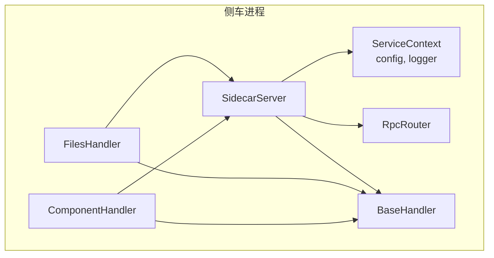
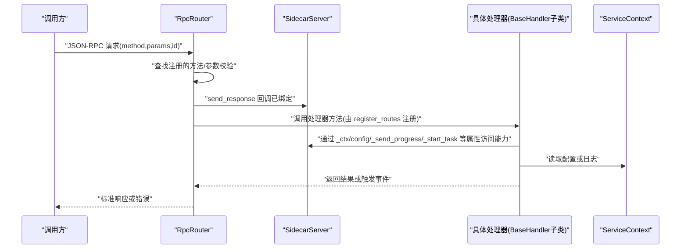
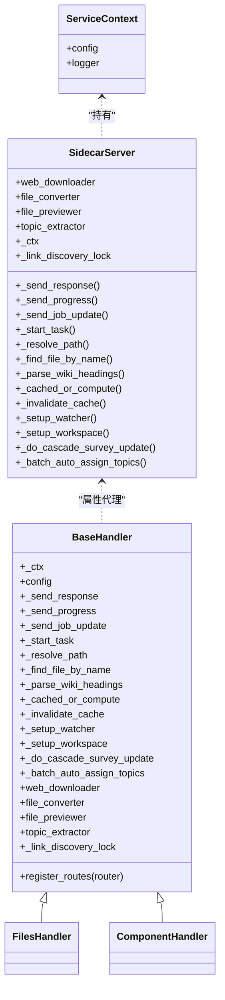
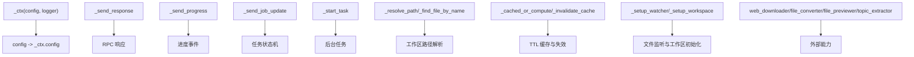
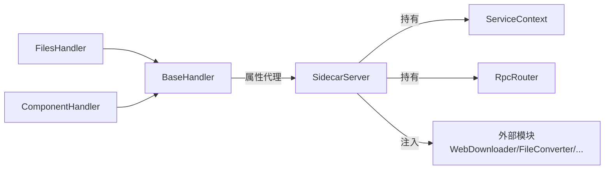

# 处理器基类设计

<cite>
**本文引用的文件**   
- [base.py](file://python/sidecar/handlers/base.py)
- [server.py](file://python/sidecar/server.py)
- [service_context.py](file://python/sidecar/service_context.py)
- [rpc_router.py](file://python/sidecar/rpc_router.py)
- [files_handler.py](file://python/sidecar/handlers/files_handler.py)
- [component_handler.py](file://python/sidecar/handlers/component_handler.py)
</cite>

## 目录
1. [简介](#简介)
2. [项目结构](#项目结构)
3. [核心组件](#核心组件)
4. [架构总览](#架构总览)
5. [详细组件分析](#详细组件分析)
6. [依赖关系分析](#依赖关系分析)
7. [性能考量](#性能考量)
8. [故障排查指南](#故障排查指南)
9. [结论](#结论)
10. [附录](#附录)

## 简介
本技术文档聚焦于处理器基类 BaseHandler 的设计与实现，系统阐述其服务上下文注入、属性代理模式与依赖管理机制；详细说明所有可用属性的用途与访问方式（如配置访问、响应发送、进度更新、任务管理等）；解释生命周期钩子的实现原理与使用场景；总结错误处理与日志记录的标准模式；并提供如何继承 BaseHandler 创建自定义处理器的实践指引。文末包含基类架构图与属性关系图，帮助读者快速建立整体认知。

## 项目结构
BaseHandler 位于 sidecar.handlers 包中，作为所有业务处理器的统一基类。SidecarServer 负责构造并持有 ServiceContext、RPC 路由与各 Handler 实例，并通过属性将能力以“受控代理”的方式暴露给处理器。处理器通过 BaseHandler 提供的属性访问服务器能力，避免直接耦合 SidecarServer 内部细节。

图表来源
- [server.py:54-95](file://python/sidecar/server.py#L54-L95)
- [service_context.py:6-19](file://python/sidecar/service_context.py#L6-L19)
- [base.py:4-106](file://python/sidecar/handlers/base.py#L4-L106)
- [files_handler.py:15-20](file://python/sidecar/handlers/files_handler.py#L15-L20)
- [component_handler.py:10-16](file://python/sidecar/handlers/component_handler.py#L10-L16)

章节来源
- [server.py:54-95](file://python/sidecar/server.py#L54-L95)
- [service_context.py:6-19](file://python/sidecar/service_context.py#L6-L19)
- [base.py:4-106](file://python/sidecar/handlers/base.py#L4-L106)

## 核心组件
- BaseHandler：处理器基类，提供统一的属性代理与通用工具方法，屏蔽底层 Server 细节。
- SidecarServer：承载运行时上下文、I/O 通道、任务调度、缓存、文件监听等能力，并将这些能力以属性形式暴露给处理器。
- ServiceContext：显式依赖注入容器，集中持有 config 与 logger，替代全局导入。
- RpcRouter：轻量 JSON-RPC 路由器，负责请求分发、线程池执行与错误标准化。

章节来源
- [base.py:4-106](file://python/sidecar/handlers/base.py#L4-L106)
- [server.py:54-125](file://python/sidecar/server.py#L54-L125)
- [service_context.py:6-19](file://python/sidecar/service_context.py#L6-L19)
- [rpc_router.py:35-106](file://python/sidecar/rpc_router.py#L35-L106)

## 架构总览
下图展示了从 RPC 请求到处理器执行的完整链路，以及 BaseHandler 在其中的角色。

图表来源
- [rpc_router.py:43-98](file://python/sidecar/rpc_router.py#L43-L98)
- [server.py:107-124](file://python/sidecar/server.py#L107-L124)
- [base.py:8-86](file://python/sidecar/handlers/base.py#L8-L86)
- [service_context.py:6-19](file://python/sidecar/service_context.py#L6-L19)

## 详细组件分析

### BaseHandler 设计理念
- 服务上下文注入：通过 _ctx 属性间接访问 ServiceContext，从而获得 config 与 logger，避免模块级全局依赖。
- 属性代理模式：将 SidecarServer 的 I/O、任务、缓存、路径解析、RAG、主题、工作区等能力以只读属性暴露，降低处理器与服务器实现的耦合度。
- 依赖管理：处理器仅依赖 BaseHandler 暴露的接口；SidecarServer 负责装配真实依赖（如 WebDownloader、FileConverterManager 等），并以同名属性透传。

章节来源
- [base.py:8-86](file://python/sidecar/handlers/base.py#L8-L86)
- [server.py:54-95](file://python/sidecar/server.py#L54-L95)
- [service_context.py:6-19](file://python/sidecar/service_context.py#L6-L19)

#### 属性清单与用途
- 配置访问
  - _ctx.config：通过 ServiceContext 获取配置对象。
  - config：便捷属性，等价于 _ctx.config。
- 响应与进度
  - _send_response：向调用方发送标准响应。
  - _send_progress：推送进度事件（封装为 event 类型消息）。
  - _send_job_update：统一的任务状态更新入口（含 start/update/complete/fail/cancel）。
- 任务管理
  - _start_task：启动后台任务，自动维护运行集合、任务状态与异常上报。
- 路径与文件
  - _resolve_path：将相对路径解析为工作区内绝对路径。
  - _find_file_by_name：按文件名在工作区中查找文件。
- Wiki 与索引
  - _parse_wiki_headings：解析 Wiki 标题。
  - _cached_or_compute：带 TTL 的通用缓存包装器。
  - _invalidate_cache：失效缓存（包括全文检索与 RAG 查询缓存）。
- 工作区与监听
  - _setup_watcher：设置文件系统监听。
  - _setup_workspace：初始化工作区文件夹。
- 主题与级联
  - _do_cascade_survey_update：触发级联调查更新。
  - _batch_auto_assign_topics：批量自动分配主题。
- 外部能力
  - web_downloader、file_converter、file_previewer、topic_extractor：对外部模块能力的透明引用。
- 并发控制
  - _link_discovery_lock：链接发现阶段的互斥锁。
- 通用工具
  - _parse_frontmatter：解析 Markdown frontmatter。
  - _load_pending_topics / _save_pending_topics：待处理主题的持久化辅助。
- 路由注册
  - register_routes(router)：子类必须实现，用于向 RpcRouter 注册方法。

章节来源
- [base.py:8-106](file://python/sidecar/handlers/base.py#L8-L106)
- [server.py:126-214](file://python/sidecar/server.py#L126-L214)
- [server.py:340-361](file://python/sidecar/server.py#L340-L361)

#### 生命周期钩子与扩展点
- register_routes：处理器在构造后由 SidecarServer 统一调用，完成方法注册。这是处理器接入 RPC 的唯一入口。
- 可选的后台任务：通过 _start_task 启动异步任务，配合 _send_job_update 进行状态同步。
- 文件监听联动：当工作区文件变化时，SidecarServer 会触发缓存失效与后续逻辑，处理器可通过 _invalidate_cache 主动参与。

章节来源
- [server.py:107-124](file://python/sidecar/server.py#L107-L124)
- [server.py:298-346](file://python/sidecar/server.py#L298-L346)
- [base.py:104-106](file://python/sidecar/handlers/base.py#L104-L106)

#### 错误处理与日志记录标准模式
- RPC 层错误
  - RpcRouter 捕获 NoteAIError 与通用 Exception，统一转换为标准错误格式，并对敏感信息进行脱敏。
- 任务层错误
  - _start_task 在执行目标函数时捕获异常，记录日志并标记任务失败；成功则标记完成。
- 处理器内错误
  - 建议对关键操作使用 try/except，结合 _send_response 返回结构化错误信息；必要时使用 _send_progress 反馈中间状态。
- 日志记录
  - 通过 _ctx.logger 或 utils.logger 输出结构化日志，便于问题定位。

章节来源
- [rpc_router.py:54-98](file://python/sidecar/rpc_router.py#L54-L98)
- [server.py:184-214](file://python/sidecar/server.py#L184-L214)
- [component_handler.py:64-76](file://python/sidecar/handlers/component_handler.py#L64-L76)

#### 继承 BaseHandler 创建自定义处理器示例（步骤）
- 定义处理器类并继承 BaseHandler。
- 实现 register_routes(router)，使用 router.register 注册方法名与处理函数。
- 在处理函数中通过 self._ctx.config 读取配置，使用 self._send_response 返回结果，使用 self._send_progress 推送进度，使用 self._start_task 启动后台任务。
- 需要文件操作时使用 self._resolve_path 与 self._find_file_by_name；需要缓存时使用 self._cached_or_compute 与 self._invalidate_cache。
- 对外部能力（下载、转换、预览、主题提取）通过 self.web_downloader、self.file_converter、self.file_previewer、self.topic_extractor 访问。

章节来源
- [base.py:8-106](file://python/sidecar/handlers/base.py#L8-L106)
- [files_handler.py:141-154](file://python/sidecar/handlers/files_handler.py#L141-L154)
- [component_handler.py:13-16](file://python/sidecar/handlers/component_handler.py#L13-L16)

#### 类关系图（代码级）

图表来源
- [service_context.py:6-19](file://python/sidecar/service_context.py#L6-L19)
- [server.py:54-95](file://python/sidecar/server.py#L54-L95)
- [server.py:126-214](file://python/sidecar/server.py#L126-L214)
- [base.py:8-106](file://python/sidecar/handlers/base.py#L8-L106)
- [files_handler.py:15-20](file://python/sidecar/handlers/files_handler.py#L15-L20)
- [component_handler.py:10-16](file://python/sidecar/handlers/component_handler.py#L10-L16)

#### 属性关系图（概念）

[此图为概念性关系图，不直接映射具体源码文件]

## 依赖关系分析
- 低耦合：处理器仅依赖 BaseHandler 暴露的属性；SidecarServer 负责装配真实依赖。
- 高内聚：BaseHandler 将所有与服务器交互的能力聚合为属性，提升可读性与可测试性。
- 外部依赖：WebDownloader、FileConverterManager、FilePreviewer、TopicExtractor 通过 SidecarServer 注入至处理器。
- 路由与线程：RpcRouter 使用线程池执行处理器方法，避免阻塞主循环。

图表来源
- [server.py:54-95](file://python/sidecar/server.py#L54-L95)
- [base.py:8-86](file://python/sidecar/handlers/base.py#L8-L86)
- [rpc_router.py:43-98](file://python/sidecar/rpc_router.py#L43-L98)

章节来源
- [server.py:54-95](file://python/sidecar/server.py#L54-L95)
- [base.py:8-86](file://python/sidecar/handlers/base.py#L8-L86)
- [rpc_router.py:43-98](file://python/sidecar/rpc_router.py#L43-L98)

## 性能考量
- 任务并发：_start_task 使用独立线程执行，避免阻塞主循环；同时维护运行集合防止重复启动。
- 进度推送：_send_progress 与 _send_job_update 组合使用，既能推进 UI 又能维护任务状态。
- 缓存策略：_cached_or_compute 提供 TTL 缓存，_invalidate_cache 在文件变更时失效相关缓存，减少重复计算。
- I/O 安全：_send_response 使用 stdout 锁保证序列化输出的原子性。

章节来源
- [server.py:184-214](file://python/sidecar/server.py#L184-L214)
- [server.py:126-143](file://python/sidecar/server.py#L126-L143)
- [server.py:340-355](file://python/sidecar/server.py#L340-L355)

## 故障排查指南
- RPC 错误
  - 检查 RpcRouter 的错误格式化与脱敏逻辑，确认错误码与消息是否符合预期。
- 任务失败
  - 查看 _start_task 的异常捕获与日志输出，确认是否触发了 fail_job 与 complete_job 的正确分支。
- 进度未更新
  - 确认处理器是否正确调用 _send_progress 与 _send_job_update，且 element_id/job_id 一致。
- 路径解析失败
  - 使用 _resolve_path 与 _find_file_by_name 联合验证路径有效性，注意工作区根限制。
- 缓存不一致
  - 在文件变更后调用 _invalidate_cache，确保全文检索与 RAG 查询缓存被清理。

章节来源
- [rpc_router.py:54-98](file://python/sidecar/rpc_router.py#L54-L98)
- [server.py:184-214](file://python/sidecar/server.py#L184-L214)
- [server.py:340-355](file://python/sidecar/server.py#L340-L355)

## 结论
BaseHandler 通过服务上下文注入与属性代理模式，为处理器提供了稳定、清晰、可扩展的能力边界。配合 SidecarServer 的生命周期管理与 RpcRouter 的并发模型，处理器可以专注于业务逻辑，而无需关心基础设施细节。遵循本文提供的错误处理与日志记录规范，可显著提升系统的可观测性与可维护性。

## 附录
- 最佳实践
  - 始终通过 BaseHandler 属性访问服务器能力，避免直接引用 SidecarServer。
  - 长耗时操作使用 _start_task 启动后台任务，并使用 _send_progress 与 _send_job_update 保持前端可见性。
  - 对可能抛出异常的 I/O 操作包裹 try/except，返回结构化错误信息。
  - 在文件变更后及时调用 _invalidate_cache，保证数据一致性。

[本节为通用指导，不直接分析具体文件]