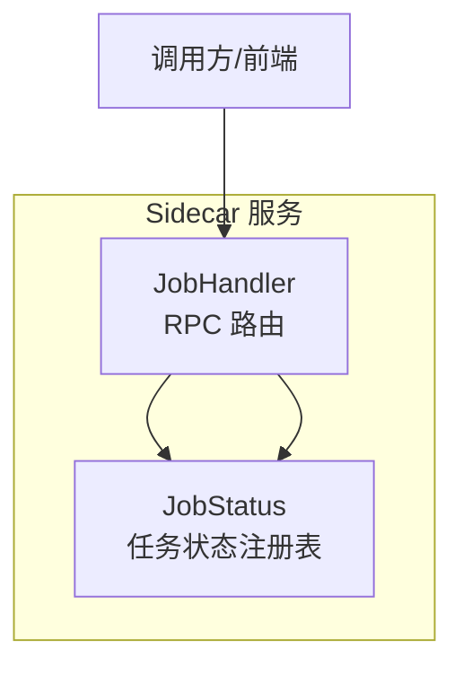
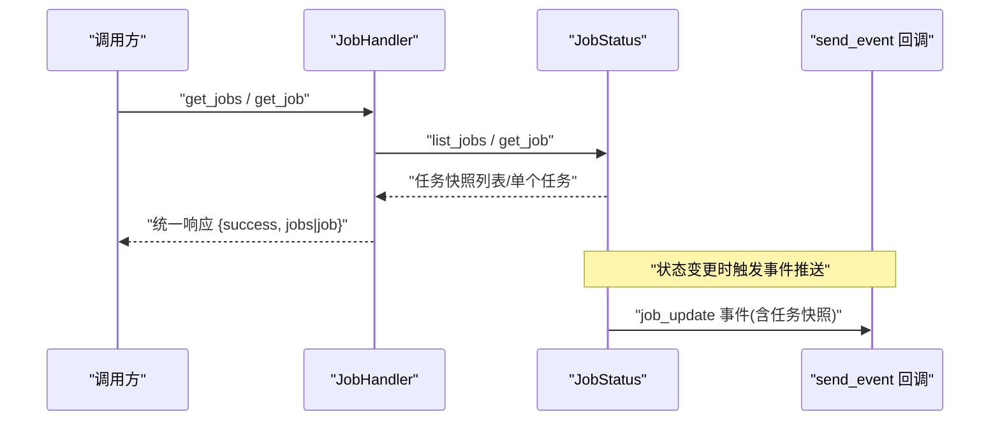
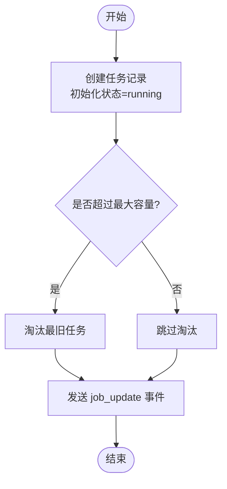
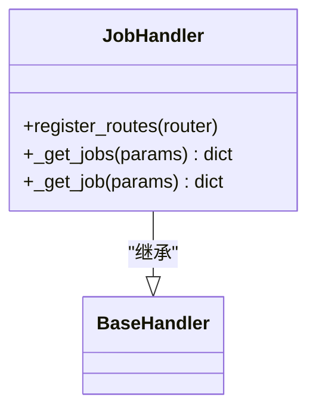
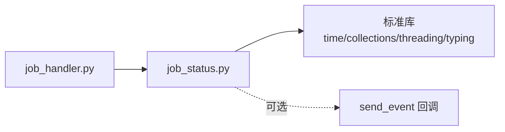

# 处理器执行模型

<cite>
**本文引用的文件**   
- [job_handler.py](file://python/sidecar/handlers/job_handler.py)
- [job_status.py](file://python/sidecar/job_status.py)
</cite>

## 目录
1. [简介](#简介)
2. [项目结构](#项目结构)
3. [核心组件](#核心组件)
4. [架构总览](#架构总览)
5. [详细组件分析](#详细组件分析)
6. [依赖关系分析](#依赖关系分析)
7. [性能考虑](#性能考虑)
8. [故障排查指南](#故障排查指南)
9. [结论](#结论)
10. [附录](#附录)

## 简介
本技术文档围绕“处理器执行模型”展开，聚焦于后台任务的并发执行、状态管理、上下文传递、错误恢复与监控等关键主题。基于仓库中现有的任务状态注册表与 RPC 处理器实现，本文给出可落地的架构说明、流程图与时序图，并提供优化建议与排障指引。需要特别说明的是：当前代码库未包含线程池调度器、优先级队列、超时控制与重试策略的具体实现；因此本节在“概念性概述”部分提供通用方案与建议，并在“依赖关系分析”中明确现有实现的边界。

## 项目结构
与处理器执行模型直接相关的核心文件如下：
- python/sidecar/handlers/job_handler.py：暴露查询任务的 RPC 路由（列出任务、获取单个任务）。
- python/sidecar/job_status.py：内存中的任务状态注册表，提供启动、更新、完成、失败、取消、查询等操作，并通过可选事件回调推送状态变更。

图表来源
- [job_handler.py:1-30](file://python/sidecar/handlers/job_handler.py#L1-L30)
- [job_status.py:1-189](file://python/sidecar/job_status.py#L1-L189)

章节来源
- [job_handler.py:1-30](file://python/sidecar/handlers/job_handler.py#L1-L30)
- [job_status.py:1-189](file://python/sidecar/job_status.py#L1-L189)

## 核心组件
- 任务状态注册表（job_status）
  - 职责：维护进程内任务状态集合，提供原子化的增删改查接口，支持进度、消息、元数据与时间戳的更新，并可选择通过 send_event 回调推送 job_update 事件。
  - 并发安全：使用全局锁保护共享有序字典，所有读写均在临界区内进行。
  - 容量控制：当任务数量超过上限时，按 FIFO 淘汰最旧的任务，避免内存无限增长。
  - 状态字段：id、kind、label、status、progress、message、metadata、created_at、updated_at、finished_at、error。
- 任务查询处理器（job_handler）
  - 职责：将外部请求映射到状态注册表的查询方法，负责参数校验与返回统一格式。
  - 输入参数：include_finished、limit、id/job_id。
  - 输出格式：success 标志位与 jobs/job 数据体。

章节来源
- [job_status.py:11-24](file://python/sidecar/job_status.py#L11-L24)
- [job_status.py:35-64](file://python/sidecar/job_status.py#L35-L64)
- [job_status.py:67-92](file://python/sidecar/job_status.py#L67-L92)
- [job_status.py:95-118](file://python/sidecar/job_status.py#L95-L118)
- [job_status.py:121-144](file://python/sidecar/job_status.py#L121-L144)
- [job_status.py:147-165](file://python/sidecar/job_status.py#L147-L165)
- [job_status.py:168-183](file://python/sidecar/job_status.py#L168-L183)
- [job_handler.py:5-29](file://python/sidecar/handlers/job_handler.py#L5-L29)

## 架构总览
下图展示了从调用方发起查询到状态注册的端到端流程。该流程体现了“处理器—状态注册表—事件回调”的解耦设计。

图表来源
- [job_handler.py:6-29](file://python/sidecar/handlers/job_handler.py#L6-L29)
- [job_status.py:174-183](file://python/sidecar/job_status.py#L174-L183)
- [job_status.py:168-171](file://python/sidecar/job_status.py#L168-L171)
- [job_status.py:26-33](file://python/sidecar/job_status.py#L26-L33)

## 详细组件分析

### 任务状态注册表（job_status）
- 数据结构与复杂度
  - 使用有序字典保存任务，键为 job_id，值为任务快照。
  - 常用操作：
    - 新增/更新/删除：O(1) 平均。
    - 列表查询：O(n) 复制快照并按需过滤与切片。
    - 裁剪：每次插入后可能触发多次 popitem(last=False)，均摊 O(1)。
- 并发与一致性
  - 全局互斥锁保证同一时刻仅一个线程修改或读取共享状态。
  - 对外返回的快照均为浅拷贝，避免外部持有引用导致竞态。
- 生命周期与状态机
  - 状态包括 running、complete、failed、cancelled。
  - 进度值被限制在 [0.0, 1.0] 区间。
  - 完成/失败/取消会设置 finished_at 时间戳。
- 事件机制
  - 可选 send_event 回调用于推送 job_update 事件，异常被吞掉以避免影响主流程。
- 资源隔离与容量控制
  - 通过 MAX_JOBS 限制最大任务数，超出则淘汰最早任务，防止内存泄漏。

图表来源
- [job_status.py:35-64](file://python/sidecar/job_status.py#L35-L64)
- [job_status.py:21-24](file://python/sidecar/job_status.py#L21-L24)
- [job_status.py:26-33](file://python/sidecar/job_status.py#L26-L33)

章节来源
- [job_status.py:11-24](file://python/sidecar/job_status.py#L11-L24)
- [job_status.py:35-64](file://python/sidecar/job_status.py#L35-L64)
- [job_status.py:67-92](file://python/sidecar/job_status.py#L67-L92)
- [job_status.py:95-118](file://python/sidecar/job_status.py#L95-L118)
- [job_status.py:121-144](file://python/sidecar/job_status.py#L121-L144)
- [job_status.py:147-165](file://python/sidecar/job_status.py#L147-L165)
- [job_status.py:168-183](file://python/sidecar/job_status.py#L168-L183)

### 任务查询处理器（job_handler）
- 路由注册
  - 注册 get_jobs 与 get_job 两个 RPC 方法。
- 参数处理
  - include_finished 默认 True，limit 默认 50，并对 limit 做类型转换与容错。
  - id/job_id 任一均可，空值时返回错误信息。
- 返回值
  - 统一 success 标志位与数据体（jobs 或 job），便于上层解析。

图表来源
- [job_handler.py:5-29](file://python/sidecar/handlers/job_handler.py#L5-L29)

章节来源
- [job_handler.py:5-29](file://python/sidecar/handlers/job_handler.py#L5-L29)

### 概念性概述：并发执行模型与调度
当前仓库未提供线程池与调度器的具体实现。以下给出通用参考模型，供后续扩展时参考：
- 线程池管理
  - 固定大小或自适应大小的工作线程池，绑定 CPU 密集型与 I/O 密集型任务。
  - 优雅关闭：等待队列消费完毕或超时后终止。
- 异步处理
  - 使用协程/回调/事件循环驱动长耗时任务，避免阻塞主循环。
- 资源隔离
  - 子进程隔离（如多进程 worker）、容器化隔离或沙箱执行，限制 CPU/内存/网络访问。
- 任务调度与优先级
  - 多级优先级队列（高/中/低），结合公平调度与抢占策略。
  - 延迟任务与定时任务支持。
- 超时与重试
  - 任务级与步骤级超时控制；指数退避重试与幂等保障。
- 状态管理与上下文传递
  - 以 job_id 为键的全局状态机；跨阶段传递 trace_id、用户上下文、配置快照等。
- 内存与垃圾回收
  - 对象池复用、大对象分块处理、显式释放引用；定期 GC 与内存水位告警。
- 错误恢复与故障转移
  - 死信队列、补偿事务、健康检查与自动重启。
- 监控与追踪
  - 指标采集（吞吐、延迟、队列长度、错误率）、分布式追踪与结构化日志。

[本节为概念性内容，不直接分析具体文件，故无章节来源]

## 依赖关系分析
- 模块耦合
  - job_handler 依赖 job_status 提供的查询接口，二者通过 RPC 层解耦。
  - job_status 内部仅依赖标准库（time、collections、threading、typing），无第三方依赖。
- 外部集成点
  - send_event 回调作为可选的外部集成点，用于事件推送（例如 WebSocket/SSE）。
- 潜在风险
  - 单锁串行化可能导致高并发下热点路径成为瓶颈。
  - 内存占用受 MAX_JOBS 限制，但单次 list_jobs 会复制全部快照，存在瞬时峰值。

图表来源
- [job_handler.py:1-30](file://python/sidecar/handlers/job_handler.py#L1-L30)
- [job_status.py:1-189](file://python/sidecar/job_status.py#L1-L189)

章节来源
- [job_handler.py:1-30](file://python/sidecar/handlers/job_handler.py#L1-L30)
- [job_status.py:1-189](file://python/sidecar/job_status.py#L1-L189)

## 性能考虑
- 锁粒度与热点路径
  - 当前采用全局锁，适合轻量级状态更新；在高 QPS 场景下可考虑分片锁或无锁结构（如每 job 独立锁或分段桶）。
- 快照复制成本
  - list_jobs 会复制全部任务快照，建议在客户端侧分页/增量拉取，服务端增加游标或时间戳过滤。
- 事件推送开销
  - send_event 异常被吞掉，避免阻塞主流程；但在高频推送时需关注序列化与网络 IO 成本。
- 内存与容量
  - MAX_JOBS 限制了常驻任务数；若业务需要更长历史，应引入持久化存储与归档策略。
- 监控与观测
  - 建议对任务创建/完成/失败速率、队列长度、事件推送延迟、锁竞争时长等指标进行采集。

[本节为通用性能建议，不直接分析具体文件，故无章节来源]

## 故障排查指南
- 常见问题定位
  - 任务不存在：get_job 返回失败且提示缺少 job id 或任务不存在。
  - 参数异常：limit 非数字将被回退为默认值。
  - 事件推送失败：send_event 抛出异常不会影响主流程，但需确认外部事件通道可用性。
- 诊断手段
  - 通过 get_jobs 查看最近任务列表，筛选 include_finished=false 仅看运行中任务。
  - 结合 send_event 的下游日志，核对 job_update 事件是否到达。
- 恢复建议
  - 对于失败任务，可在上层实现重试与补偿逻辑；必要时人工介入清理卡住的任务。

章节来源
- [job_handler.py:10-29](file://python/sidecar/handlers/job_handler.py#L10-L29)
- [job_status.py:26-33](file://python/sidecar/job_status.py#L26-L33)

## 结论
当前仓库提供了轻量级的任务状态注册表与查询处理器，具备基本的并发安全、容量控制与事件推送能力，适合作为执行模型的“状态面”。若要构建完整的“执行面”，建议在此基础上引入线程池/协程池、优先级队列、超时与重试、持久化与监控等能力，形成可扩展、可观测、可恢复的处理器执行模型。

[本节为总结性内容，不直接分析具体文件，故无章节来源]

## 附录
- 术语
  - 任务：一次后台处理的抽象单元，具有唯一 ID 与生命周期状态。
  - 快照：任务状态的不可变副本，用于对外返回与事件推送。
  - 事件：状态变更时由 send_event 回调触发的通知消息。
- 扩展建议
  - 将 job_status 抽象为接口，支持多种后端（内存/Redis/数据库）。
  - 引入调度器与 Worker 进程，实现真正的并发执行与资源隔离。
  - 增加链路追踪与指标上报，完善可观测性。

[本节为补充说明，不直接分析具体文件，故无章节来源]