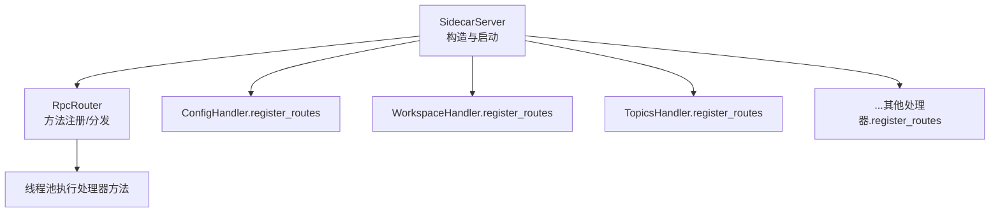
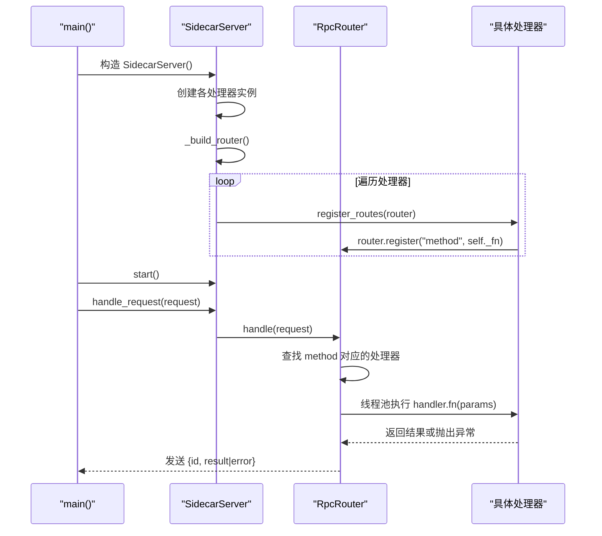
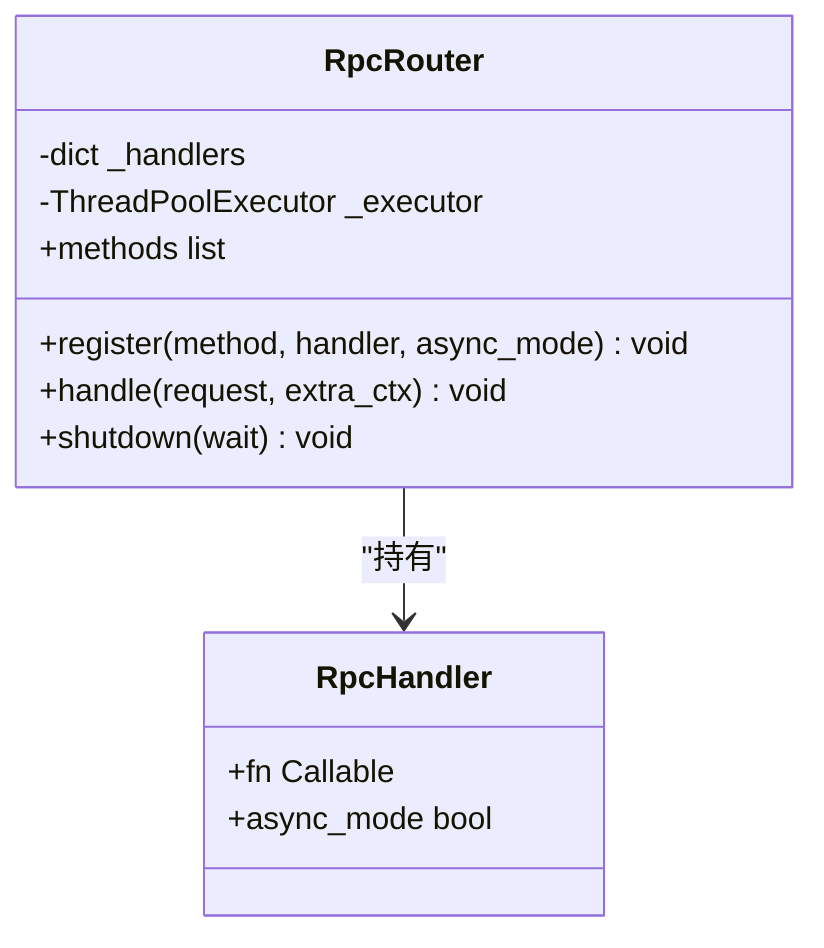
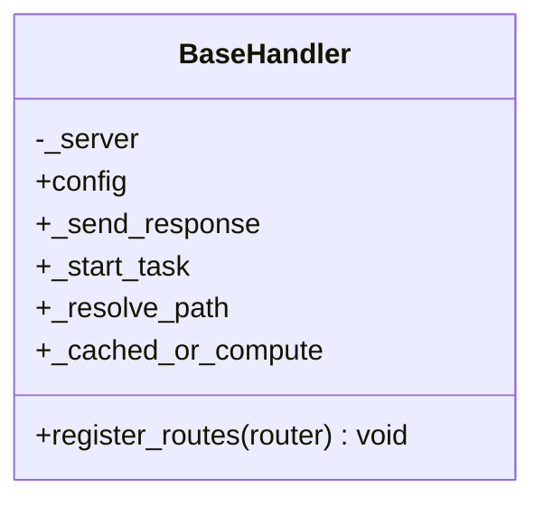
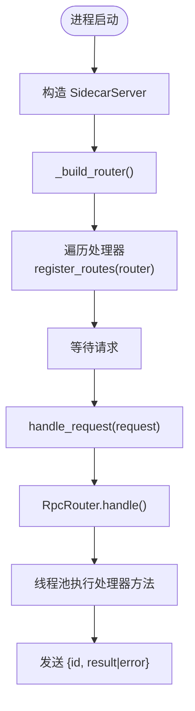
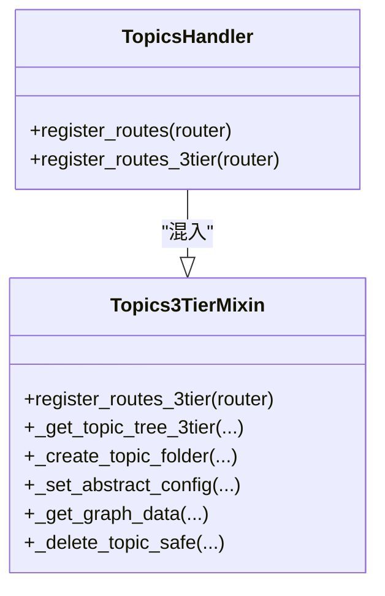
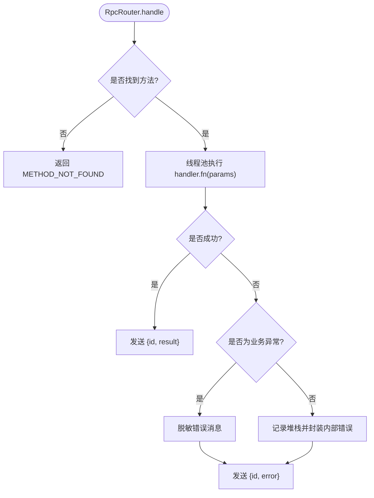
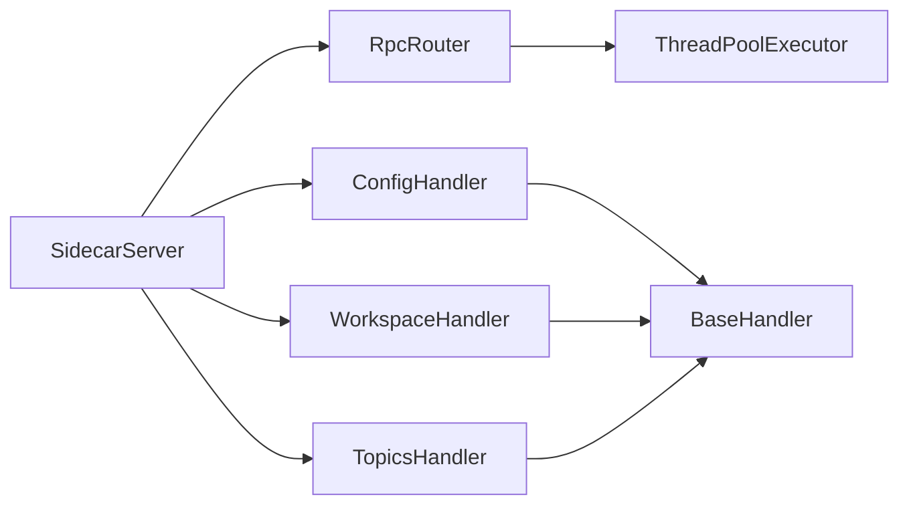

# 处理器注册机制

<cite>
**本文引用的文件**   
- [server.py](file://python/sidecar/server.py)
- [rpc_router.py](file://python/sidecar/rpc_router.py)
- [base.py](file://python/sidecar/handlers/base.py)
- [config_handler.py](file://python/sidecar/handlers/config_handler.py)
- [workspace_handler.py](file://python/sidecar/handlers/workspace_handler.py)
- [topics_handler.py](file://python/sidecar/handlers/topics_handler.py)
- [topics_3tier_mixin.py](file://python/sidecar/mixins/topics_3tier_mixin.py)
</cite>

## 目录
1. [简介](#简介)
2. [项目结构](#项目结构)
3. [核心组件](#核心组件)
4. [架构总览](#架构总览)
5. [详细组件分析](#详细组件分析)
6. [依赖关系分析](#依赖关系分析)
7. [性能考量](#性能考量)
8. [故障排查指南](#故障排查指南)
9. [结论](#结论)
10. [附录](#附录)

## 简介
本文件面向“处理器注册机制”的技术文档，聚焦以下目标：
- 处理器发现与管理的工作原理（装饰器模式、动态模块加载与路由映射）
- register_routes 方法的作用与调用时机
- 处理器与 RPC 路由器的集成方式（方法绑定、参数验证、响应格式化）
- 处理器的生命周期管理（初始化、启动、销毁）
- 错误处理与异常传播机制
- 处理器注册的完整流程与最佳实践
- 提供注册流程图与扩展开发示例

## 项目结构
本项目采用“服务-处理器-RPC路由器”的分层组织方式：
- SidecarServer 负责创建各处理器实例并统一构建路由表
- 每个处理器继承 BaseHandler，实现 register_routes(router) 将自身方法注册到 RpcRouter
- RpcRouter 维护 method -> handler 的映射，并在请求到来时分派执行

图表来源
- [server.py:107-124](file://python/sidecar/server.py#L107-L124)
- [rpc_router.py:43-52](file://python/sidecar/rpc_router.py#L43-L52)

章节来源
- [server.py:54-95](file://python/sidecar/server.py#L54-L95)
- [server.py:107-124](file://python/sidecar/server.py#L107-L124)

## 核心组件
- RpcRouter：轻量 JSON-RPC 路由器，维护方法名到处理函数的映射，支持同步/异步处理器，通过线程池执行，避免阻塞主循环。
- BaseHandler：处理器基类，提供对 Server 上下文、配置、缓存、任务调度等能力的属性代理，并定义 register_routes 抽象接口。
- 具体处理器：如 ConfigHandler、WorkspaceHandler、TopicsHandler 等，各自在 register_routes 中完成方法绑定。
- SidecarServer：集中创建处理器实例，调用 _build_router 统一注册所有处理器路由，并提供 handle_request/shutdown 等生命周期入口。

章节来源
- [rpc_router.py:35-106](file://python/sidecar/rpc_router.py#L35-L106)
- [base.py:4-106](file://python/sidecar/handlers/base.py#L4-L106)
- [server.py:54-95](file://python/sidecar/server.py#L54-L95)

## 架构总览
下图展示了从进程启动到请求处理的端到端路径，以及处理器注册的关键阶段。

图表来源
- [server.py:570-595](file://python/sidecar/server.py#L570-L595)
- [server.py:107-124](file://python/sidecar/server.py#L107-L124)
- [rpc_router.py:54-82](file://python/sidecar/rpc_router.py#L54-L82)

## 详细组件分析

### RpcRouter：方法绑定与分派
- 注册接口：register(method, handler, async_mode=False)，将字符串方法与可调用对象建立映射。
- 请求处理：handle(request) 解析 method/params/id，查表后在线程池中执行；成功时发送 {id, result}，失败时发送 {id, error}。
- 错误处理：捕获业务异常 NoteAIError 与通用 Exception，统一封装为错误响应，并对消息进行敏感信息脱敏。
- 生命周期：shutdown(wait) 关闭线程池，避免资源泄漏。

图表来源
- [rpc_router.py:35-106](file://python/sidecar/rpc_router.py#L35-L106)

章节来源
- [rpc_router.py:43-106](file://python/sidecar/rpc_router.py#L43-L106)

### BaseHandler：处理器能力代理与注册契约
- 属性代理：通过 _server 暴露 config、_send_response、_start_task、_resolve_path、_cached_or_compute 等能力，使处理器无需直接耦合 Server。
- 注册契约：定义 register_routes(router) 抽象方法，要求子类实现以完成路由注册。

图表来源
- [base.py:4-106](file://python/sidecar/handlers/base.py#L4-L106)

章节来源
- [base.py:4-106](file://python/sidecar/handlers/base.py#L4-L106)

### 处理器注册流程与调用时机
- 构造期：SidecarServer.__init__ 创建各处理器实例，并立即调用 _build_router。
- 注册期：_build_router 依次调用各处理器的 register_routes(self._router)。
- 运行期：main() 读取 stdin 行，解析为 JSON 请求，调用 server.handle_request(request)，最终进入 RpcRouter.handle。

图表来源
- [server.py:57-95](file://python/sidecar/server.py#L57-L95)
- [server.py:107-124](file://python/sidecar/server.py#L107-L124)
- [server.py:541-542](file://python/sidecar/server.py#L541-L542)
- [rpc_router.py:54-82](file://python/sidecar/rpc_router.py#L54-L82)

章节来源
- [server.py:57-95](file://python/sidecar/server.py#L57-L95)
- [server.py:107-124](file://python/sidecar/server.py#L107-L124)
- [server.py:541-542](file://python/sidecar/server.py#L541-L542)

### 处理器与 RPC 路由器的集成方式
- 方法绑定：处理器在 register_routes 中调用 router.register("method_name", self._method)，将字符串方法与实例方法绑定。
- 参数传递：RpcRouter.handle 将 request.params 作为唯一参数传入处理器方法。
- 响应格式：处理器返回任意可序列化对象，RpcRouter 将其包装为 {"id": req_id, "result": ...}；异常则包装为 {"id": req_id, "error": {...}}。
- 异步支持：若处理器耗时较长，可通过 _start_task 启动后台任务并通过 _send_progress/_send_job_update 推送进度事件。

章节来源
- [config_handler.py:16-29](file://python/sidecar/handlers/config_handler.py#L16-L29)
- [workspace_handler.py:34-44](file://python/sidecar/handlers/workspace_handler.py#L34-L44)
- [topics_handler.py:546-567](file://python/sidecar/handlers/topics_handler.py#L546-L567)
- [rpc_router.py:54-94](file://python/sidecar/rpc_router.py#L54-L94)

### 三层主题系统的扩展注册（Mixin 注入）
- TopicsHandler 通过继承 Topics3TierMixin 获得额外能力，并在 register_routes_3tier 中注册一组新路由。
- SidecarServer 在 _build_router 中显式调用 topics_handler.register_routes_3tier，完成二次注册。

图表来源
- [topics_handler.py:41-41](file://python/sidecar/handlers/topics_handler.py#L41-L41)
- [topics_3tier_mixin.py:317-324](file://python/sidecar/mixins/topics_3tier_mixin.py#L317-L324)
- [server.py:115](file://python/sidecar/server.py#L115)

章节来源
- [topics_handler.py:546-567](file://python/sidecar/handlers/topics_handler.py#L546-L567)
- [topics_3tier_mixin.py:317-324](file://python/sidecar/mixins/topics_3tier_mixin.py#L317-L324)
- [server.py:115](file://python/sidecar/server.py#L115)

### 错误处理与异常传播机制
- 业务异常：处理器抛出 NoteAIError 时，RpcRouter 捕获并转换为标准错误结构，同时清理敏感路径信息。
- 未知方法：当 method 未注册时，返回 METHOD_NOT_FOUND。
- 通用异常：任何未预期异常均被捕获，记录日志并返回 INTERNAL_ERROR。
- 顶层保护：main() 中对 JSON 解析异常与未捕获异常做兜底，确保进程稳定。

图表来源
- [rpc_router.py:54-94](file://python/sidecar/rpc_router.py#L54-L94)
- [rpc_router.py:14-32](file://python/sidecar/rpc_router.py#L14-L32)
- [server.py:570-595](file://python/sidecar/server.py#L570-L595)

章节来源
- [rpc_router.py:54-94](file://python/sidecar/rpc_router.py#L54-L94)
- [rpc_router.py:14-32](file://python/sidecar/rpc_router.py#L14-L32)
- [server.py:570-595](file://python/sidecar/server.py#L570-L595)

### 处理器生命周期管理
- 初始化：SidecarServer.__init__ 创建处理器实例，并立即构建路由表。
- 启动：SidecarServer.start 启动工作区监听与启动期同步任务。
- 运行：main() 持续从 stdin 读取请求并交由 handle_request 处理。
- 销毁：SidecarServer.shutdown 停止文件监听、关闭 RPC 线程池及外部资源。

章节来源
- [server.py:57-95](file://python/sidecar/server.py#L57-L95)
- [server.py:97-106](file://python/sidecar/server.py#L97-L106)
- [server.py:544-568](file://python/sidecar/server.py#L544-L568)
- [server.py:570-595](file://python/sidecar/server.py#L570-L595)

## 依赖关系分析
- SidecarServer 依赖 RpcRouter 与各处理器实例，负责装配与生命周期管理。
- 处理器通过 BaseHandler 间接依赖 Server 提供的能力（配置、缓存、任务、路径解析等）。
- RpcRouter 依赖线程池执行处理器方法，保证 I/O 不阻塞主循环。

图表来源
- [server.py:57-95](file://python/sidecar/server.py#L57-L95)
- [server.py:107-124](file://python/sidecar/server.py#L107-L124)
- [rpc_router.py:43-52](file://python/sidecar/rpc_router.py#L43-L52)

章节来源
- [server.py:57-95](file://python/sidecar/server.py#L57-L95)
- [server.py:107-124](file://python/sidecar/server.py#L107-L124)
- [rpc_router.py:43-52](file://python/sidecar/rpc_router.py#L43-L52)

## 性能考量
- 非阻塞执行：所有处理器方法均提交至线程池执行，避免阻塞 stdin 读取循环。
- 并发上限：默认最大工作线程数为固定值，可按需调整以避免资源争用。
- 任务进度：长耗时操作建议通过 _start_task 与 _send_progress/_send_job_update 上报进度，提升用户体验。
- 缓存失效：文件变更会触发缓存失效与 Wiki 同步，注意批量变更时的去抖策略。

[本节为通用指导，不涉及具体文件分析]

## 故障排查指南
- 未知方法错误：检查处理器是否正确实现 register_routes 且已在 _build_router 中调用。
- 方法执行异常：查看 RpcRouter 的错误日志与脱敏后的错误消息，定位业务逻辑问题。
- 线程池未释放：确认 shutdown 被调用，避免进程退出后残留线程。
- 配置保存失败：检查配置锁与持久化逻辑，关注返回值中的 success/message。

章节来源
- [rpc_router.py:54-94](file://python/sidecar/rpc_router.py#L54-L94)
- [server.py:544-568](file://python/sidecar/server.py#L544-L568)
- [config_handler.py:135-215](file://python/sidecar/handlers/config_handler.py#L135-L215)

## 结论
处理器注册机制通过“统一路由中心 + 处理器自注册”的模式，实现了高内聚、低耦合的可扩展架构。SidecarServer 负责装配与生命周期管理，BaseHandler 提供能力代理，RpcRouter 负责方法绑定与分派。该设计便于新增处理器与路由，同时保证了错误处理与并发执行的健壮性。

[本节为总结性内容，不涉及具体文件分析]

## 附录

### 处理器注册最佳实践
- 在 register_routes 中仅做方法绑定，避免复杂逻辑；复杂逻辑放入对应私有方法。
- 使用 BaseHandler 提供的属性访问 Server 能力，不要直接引用 Server 实例。
- 对可能抛出的业务异常，使用统一的错误类型以便 RpcRouter 正确转换。
- 长耗时操作使用 _start_task 异步执行，并通过 _send_progress 反馈进度。
- 如需扩展路由组，参考 Topics3TierMixin 的 mixin 模式，在 Server 中显式调用二次注册。

[本节为通用指导，不涉及具体文件分析]

### 扩展开发示例（步骤说明）
- 新建处理器类，继承 BaseHandler，实现若干业务方法。
- 在 register_routes(router) 中调用 router.register("your_method", self._your_method)。
- 在 SidecarServer._build_router 中添加一行 self._your_handler.register_routes(self._router)。
- 如需二次注册，参考 register_routes_3tier 的实现模式，在 Server 中追加一次调用。

章节来源
- [base.py:104-106](file://python/sidecar/handlers/base.py#L104-L106)
- [server.py:107-124](file://python/sidecar/server.py#L107-L124)
- [topics_3tier_mixin.py:317-324](file://python/sidecar/mixins/topics_3tier_mixin.py#L317-L324)