# 处理器系统架构

<cite>
**本文引用的文件**   
- [server.py](file://python/sidecar/server.py)
- [rpc_router.py](file://python/sidecar/rpc_router.py)
- [base.py](file://python/sidecar/handlers/base.py)
- [__init__.py](file://python/sidecar/handlers/__init__.py)
- [config_handler.py](file://python/sidecar/handlers/config_handler.py)
- [files_handler.py](file://python/sidecar/handlers/files_handler.py)
- [topics_handler.py](file://python/sidecar/handlers/topics_handler.py)
- [semantic_handler.py](file://python/sidecar/handlers/semantic_handler.py)
- [store.py](file://python/sidecar/semantic/store.py)
- [compiler.py](file://python/sidecar/semantic/compiler.py)
</cite>

## 更新摘要
**所做更改**   
- 新增语义处理器（SemanticHandler）集成章节，详细说明语义处理能力
- 更新处理器架构图，包含语义处理器组件
- 扩展处理器注册机制说明，涵盖语义处理器的路由注册
- 新增语义工作区、实体合并、质量审查等高级功能说明
- 更新依赖关系分析，包含语义模块的集成
- 新增语义处理器开发指南和示例

## 目录
1. [简介](#简介)
2. [项目结构](#项目结构)
3. [核心组件](#核心组件)
4. [架构总览](#架构总览)
5. [详细组件分析](#详细组件分析)
6. [语义处理器集成](#语义处理器集成)
7. [依赖关系分析](#依赖关系分析)
8. [性能考量](#性能考量)
9. [故障排查指南](#故障排查指南)
10. [结论](#结论)
11. [附录：扩展开发指南与示例](#附录扩展开发指南与示例)

## 简介
本技术文档围绕处理器系统架构展开，重点解释处理器基类 BaseHandler 的设计模式与抽象接口、处理器注册机制（基于显式路由注册）、执行模型（同步/异步与线程池调度）、错误处理与日志记录、处理器间通信（事件推送与状态共享）、配置管理（参数校验、默认值与运行时修改），并提供架构图、注册流程图以及扩展开发指南和具体示例路径。**最新更新**：新增了语义处理器（SemanticHandler）的完整集成，支持语义工作区查询、实体合并、质量审查、链接管理等高级语义处理能力。

## 项目结构
处理器子系统位于 python/sidecar 下，核心由以下部分组成：
- SidecarServer：进程入口与服务编排，负责初始化各处理器、构建路由、启动后台任务与文件监听、统一响应输出。
- RpcRouter：轻量 JSON-RPC 路由器，提供方法注册、请求分发、线程池执行与错误封装。
- BaseHandler：处理器基类，提供对服务器上下文、配置、日志、进度与任务调度的统一访问能力，并定义 register_routes 抽象接口。
- 各业务处理器：如 ConfigHandler、FilesHandler、TopicsHandler、**SemanticHandler** 等，实现各自领域的方法并通过 register_routes 向路由器注册。

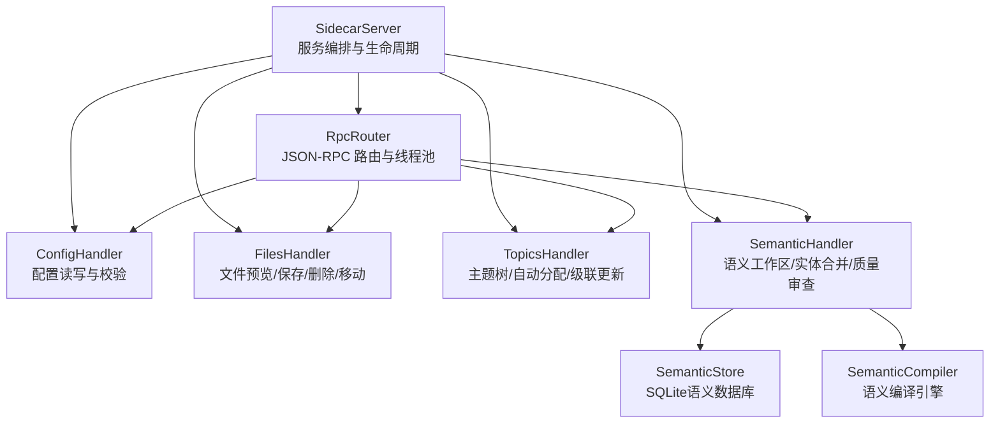

**图示来源**
- [server.py:54-124](file://python/sidecar/server.py#L54-L124)
- [rpc_router.py:43-106](file://python/sidecar/rpc_router.py#L43-L106)
- [config_handler.py:16-30](file://python/sidecar/handlers/config_handler.py#L16-L30)
- [files_handler.py:414-425](file://python/sidecar/handlers/files_handler.py#L414-L425)
- [topics_handler.py:546-568](file://python/sidecar/handlers/topics_handler.py#L546-L568)
- [semantic_handler.py:993-1012](file://python/sidecar/handlers/semantic_handler.py#L993-L1012)

章节来源
- [server.py:54-124](file://python/sidecar/server.py#L54-L124)
- [rpc_router.py:43-106](file://python/sidecar/rpc_router.py#L43-L106)

## 核心组件
- BaseHandler
  - 职责：为所有处理器提供统一的上下文访问（配置、日志、发送响应/进度/任务）、通用工具（路径解析、缓存失效、Wiki 解析）以及 register_routes 抽象接口。
  - 设计要点：通过属性代理将 Server 的能力暴露给处理器，避免直接耦合；强制子类实现 register_routes 以完成路由注册。
- RpcRouter
  - 职责：维护 method->handler 映射，接收 JSON-RPC 请求，分派到对应处理器方法；统一错误码与消息脱敏；使用线程池执行处理器逻辑，避免阻塞主循环。
  - 设计要点：支持同步处理器；通过 ThreadPoolExecutor 保证并发与隔离；错误类型区分业务异常与内部异常，并返回标准化错误对象。
- SidecarServer
  - 职责：实例化各处理器、调用其 register_routes 完成路由装配；提供 _start_task 进行后台任务调度；提供工作区文件监听与批量变更去抖；统一响应输出与进程关闭流程。
  - 设计要点：构造期仅做对象创建，I/O 与线程在 start() 中启动；通过 _send_response/_send_progress/_send_job_update 对外广播事件与作业状态。

章节来源
- [base.py:4-106](file://python/sidecar/handlers/base.py#L4-L106)
- [rpc_router.py:35-106](file://python/sidecar/rpc_router.py#L35-L106)
- [server.py:54-124](file://python/sidecar/server.py#L54-L124)

## 架构总览
下图展示从客户端发起 JSON-RPC 请求到处理器执行的完整链路，包括错误处理、进度上报与作业状态更新。

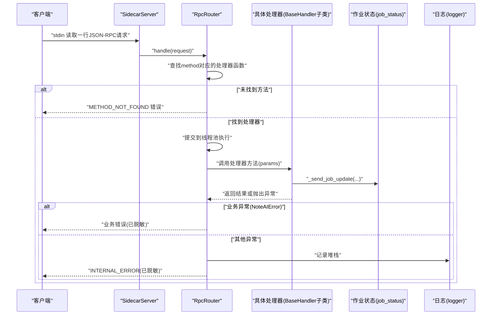

**图示来源**
- [server.py:570-594](file://python/sidecar/server.py#L570-L594)
- [rpc_router.py:54-82](file://python/sidecar/rpc_router.py#L54-L82)
- [server.py:145-182](file://python/sidecar/server.py#L145-L182)

## 详细组件分析

### BaseHandler 设计与抽象接口
- 生命周期钩子
  - 无内置钩子；处理器通过自身方法组织生命周期阶段（如初始化、处理、清理）。
  - 可通过 _start_task 触发异步阶段（如级联更新、索引重建）。
- 错误处理与日志
  - 处理器内部可捕获异常并返回结构化结果；全局错误由 RpcRouter 统一处理与脱敏。
  - 日志通过 self._ctx.logger 或 utils.logger 输出。
- 配置与上下文
  - 通过 self.config 访问配置对象；通过 self._send_response/_send_progress/_send_job_update 与前端交互。
- 抽象接口
  - register_routes(router): 必须实现，用于向 RpcRouter 注册当前处理器提供的 RPC 方法。

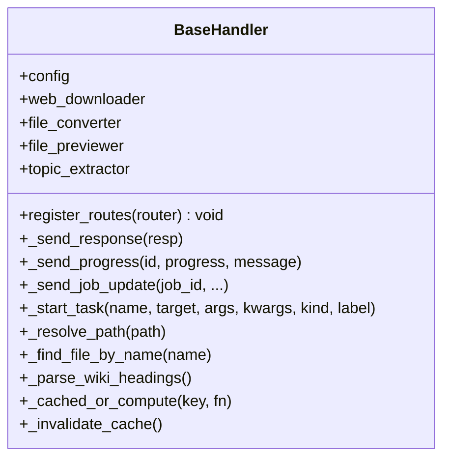

**图示来源**
- [base.py:4-106](file://python/sidecar/handlers/base.py#L4-L106)

章节来源
- [base.py:4-106](file://python/sidecar/handlers/base.py#L4-L106)

### 处理器注册机制
- 注册方式
  - 每个处理器实现 register_routes(router)，调用 router.register("method_name", handler_fn) 完成注册。
  - SidecarServer 在构造后调用各处理器的 register_routes 完成路由装配。
- 动态发现与自动加载
  - 当前实现为显式导入与手动注册，未见装饰器或扫描自动发现机制。
- 路由表与查询
  - RpcRouter 内部维护字典映射，methods 属性可列出已注册方法名。

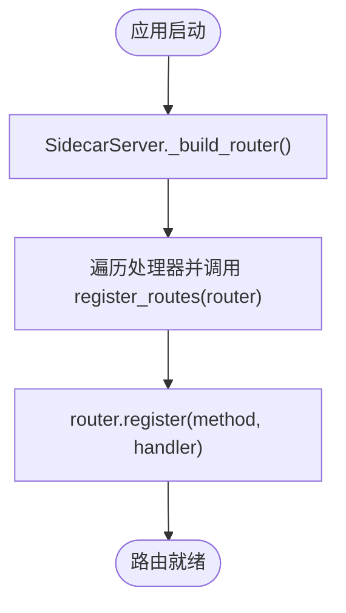

**图示来源**
- [server.py:107-124](file://python/sidecar/server.py#L107-L124)
- [config_handler.py:17-29](file://python/sidecar/handlers/config_handler.py#L17-L29)
- [files_handler.py:414-425](file://python/sidecar/handlers/files_handler.py#L414-L425)
- [topics_handler.py:546-568](file://python/sidecar/handlers/topics_handler.py#L546-L568)

章节来源
- [server.py:107-124](file://python/sidecar/server.py#L107-L124)
- [__init__.py:1-38](file://python/sidecar/handlers/__init__.py#L1-L38)

### 执行模型：同步/异步、任务调度与资源管理
- 同步处理器
  - 处理器方法签名通常为 handle(params)，由 RpcRouter 在线程池中执行，避免阻塞 stdin 读循环。
- 异步处理
  - 处理器通过 self._start_task 启动后台任务（daemon 线程），常用于耗时操作（如级联更新、索引重建）。
- 资源管理
  - 线程池大小固定（最大工作线程数），Shutdown 时关闭线程池与相关模块执行器。
  - 文件监听采用去抖策略，批量合并变更事件，减少重复计算。

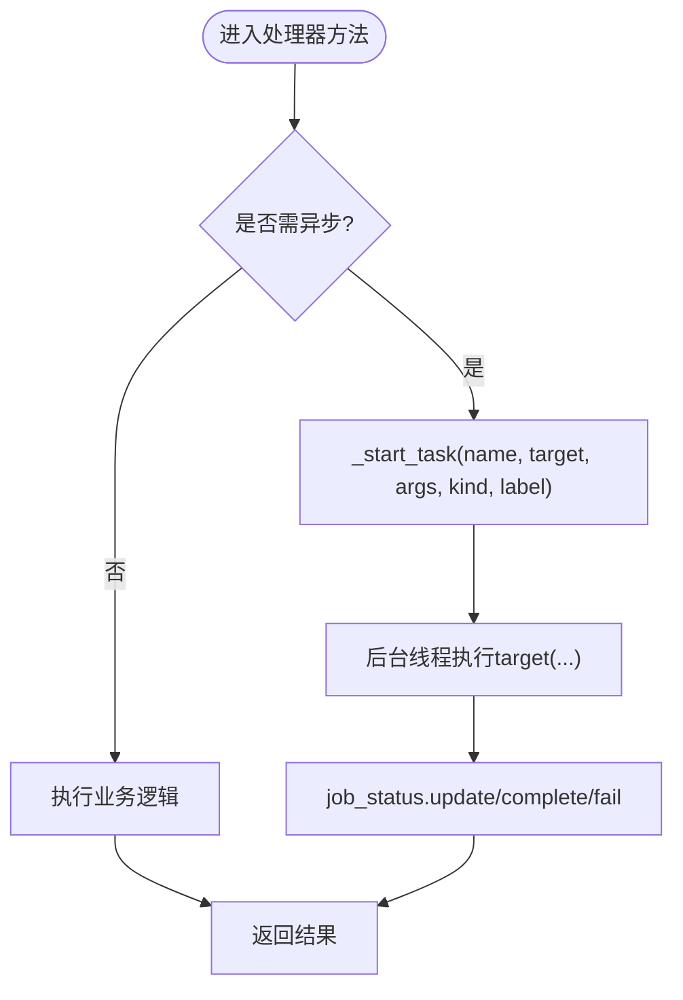

**图示来源**
- [rpc_router.py:54-82](file://python/sidecar/rpc_router.py#L54-L82)
- [server.py:184-214](file://python/sidecar/server.py#L184-L214)
- [server.py:544-568](file://python/sidecar/server.py#L544-L568)

章节来源
- [rpc_router.py:43-106](file://python/sidecar/rpc_router.py#L43-L106)
- [server.py:184-214](file://python/sidecar/server.py#L184-L214)

### 处理器间通信：事件发布订阅、消息传递与状态共享
- 事件发布
  - 处理器通过 self._send_response 发送事件（如 workspace_files_changed、auto_file_converted、progress 等）。
  - 作业状态通过 self._send_job_update 统一上报，便于前端跟踪长任务。
- 消息传递
  - 基于 JSON-RPC 的请求-响应模型；事件通过同一 stdout 通道推送。
- 状态共享
  - 通过 ServiceContext 注入的配置对象与 TTLCache 共享运行时状态；文件监听去抖集合与 Wiki 同步标记在 Server 层集中管理。

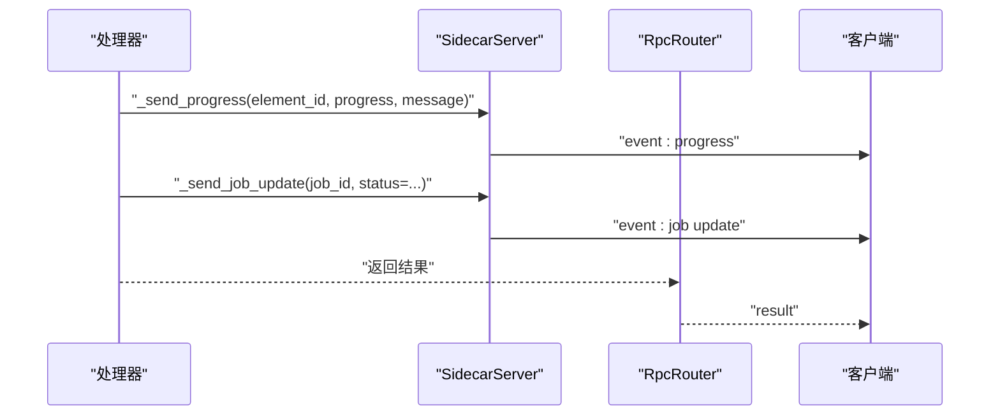

**图示来源**
- [server.py:131-182](file://python/sidecar/server.py#L131-L182)
- [server.py:126-143](file://python/sidecar/server.py#L126-L143)

章节来源
- [server.py:126-182](file://python/sidecar/server.py#L126-L182)

### 配置管理：参数验证、默认值设置与运行时修改
- 参数校验与默认值
  - 处理器内对输入进行类型转换与范围约束（如 UI 配置的布尔/浮点/整型 coerce 函数）。
  - 关键配置（如 API Key）在保存前进行连通性测试。
- 运行时修改
  - 配置更新在锁保护下进行，确保原子性与一致性；部分配置变更后主动清理相关缓存（如 RAG 查询缓存）。
- 持久化
  - 配置对象提供 save() 方法，处理器在修改后调用以落盘。

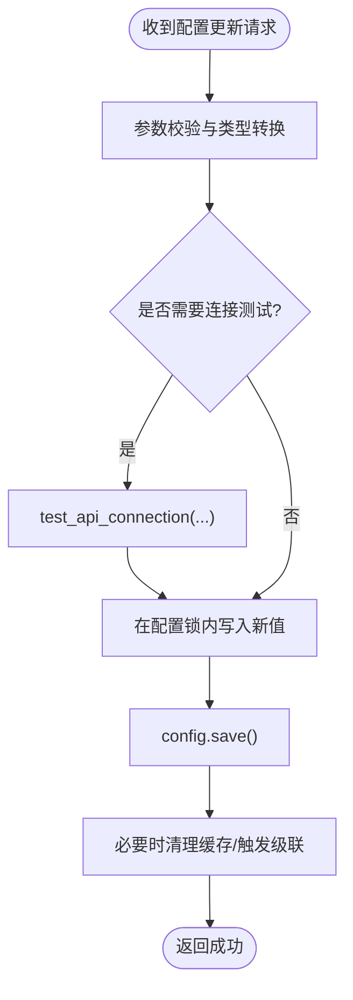

**图示来源**
- [config_handler.py:109-133](file://python/sidecar/handlers/config_handler.py#L109-L133)
- [config_handler.py:50-78](file://python/sidecar/handlers/config_handler.py#L50-L78)
- [config_handler.py:196-215](file://python/sidecar/handlers/config_handler.py#L196-L215)

章节来源
- [config_handler.py:50-78](file://python/sidecar/handlers/config_handler.py#L50-L78)
- [config_handler.py:109-133](file://python/sidecar/handlers/config_handler.py#L109-L133)
- [config_handler.py:196-215](file://python/sidecar/handlers/config_handler.py#L196-L215)

### 典型处理器示例

#### FilesHandler 文件处理流程
- 功能要点
  - 文件预览（大文件切片传输）、保存内容（含大小限制与受保护目录检查）、删除（回收站）、移动、创建笔记等。
  - 保存 .md 后异步建议链接；删除/移动后同步 Wiki 与级联更新。
- 错误处理
  - 路径合法性、权限与安全字符校验；外部命令失败回退为错误响应。

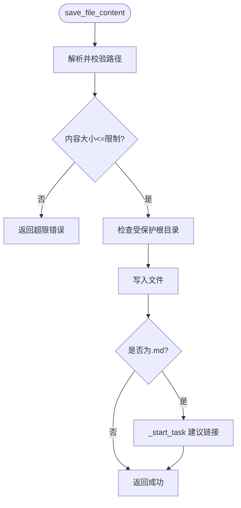

**图示来源**
- [files_handler.py:117-149](file://python/sidecar/handlers/files_handler.py#L117-L149)
- [files_handler.py:151-155](file://python/sidecar/handlers/files_handler.py#L151-L155)

章节来源
- [files_handler.py:117-149](file://python/sidecar/handlers/files_handler.py#L117-L149)
- [files_handler.py:414-425](file://python/sidecar/handlers/files_handler.py#L414-L425)

#### TopicsHandler 主题处理流程
- 功能要点
  - 主题树获取、自动分配、批量分配、移动到主题、创建/重命名/删除主题、级联更新、待办项收集等。
  - 大量操作后触发 Wiki 同步与级联调查更新。
- 错误处理
  - 主题格式校验、路径与工作区存在性检查、文件系统操作异常兜底。

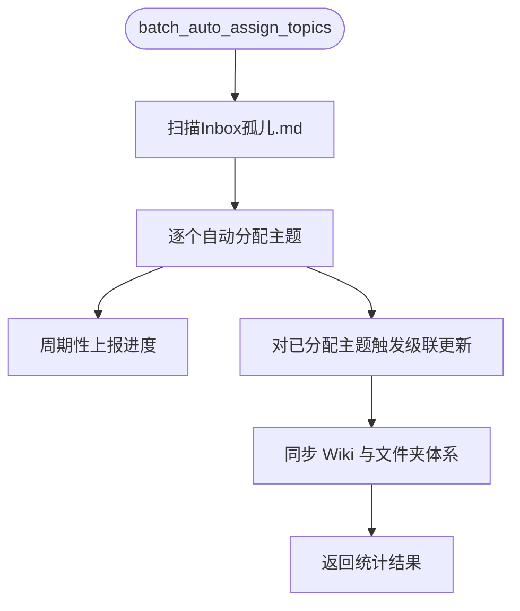

**图示来源**
- [topics_handler.py:96-149](file://python/sidecar/handlers/topics_handler.py#L96-L149)
- [topics_handler.py:546-568](file://python/sidecar/handlers/topics_handler.py#L546-L568)

章节来源
- [topics_handler.py:96-149](file://python/sidecar/handlers/topics_handler.py#L96-L149)
- [topics_handler.py:546-568](file://python/sidecar/handlers/topics_handler.py#L546-L568)

## 语义处理器集成

### SemanticHandler 概述
语义处理器（SemanticHandler）是处理器系统架构中的最新集成组件，提供了完整的语义处理能力。它基于 SQLite 存储的语义数据库，支持文档解析、实体提取、概念识别、声明抽取、证据关联、关系建模等高级语义分析功能。

### 核心功能特性
- **语义工作区管理**：提供概览、声明、概念、实体、质量、冲突、链接等多个视图
- **全库语义编译**：支持批量处理 Markdown 文档，提取语义信息并建立关联
- **实体合并与去重**：智能检测重复实体，支持预览影响范围和确认合并
- **质量审查系统**：自动检测实体质量问题，支持人工审核和修复
- **链接管理**：维护文档间的语义链接关系，支持双向链接检测
- **Wiki 页面生成**：自动生成实体聚合页、概念聚合页和主题 Wiki 页面

### 语义处理器架构

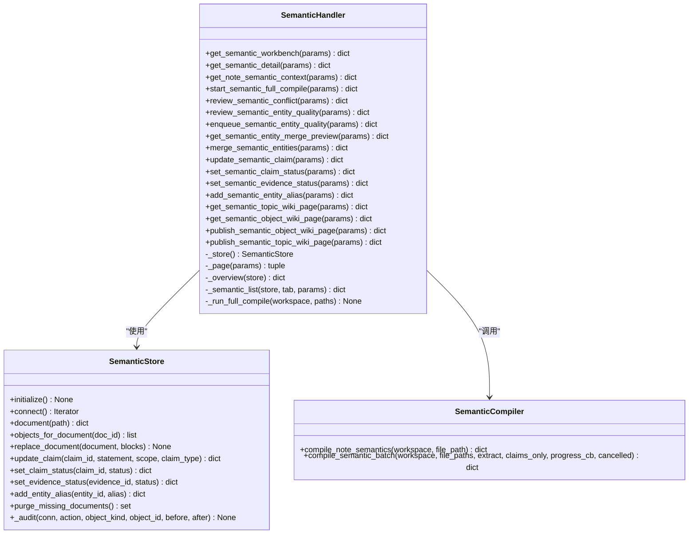

**图示来源**
- [semantic_handler.py:16-1012](file://python/sidecar/handlers/semantic_handler.py#L16-L1012)
- [store.py:154-200](file://python/sidecar/semantic/store.py#L154-L200)
- [compiler.py:54-200](file://python/sidecar/semantic/compiler.py#L54-L200)

### 语义工作区查询流程

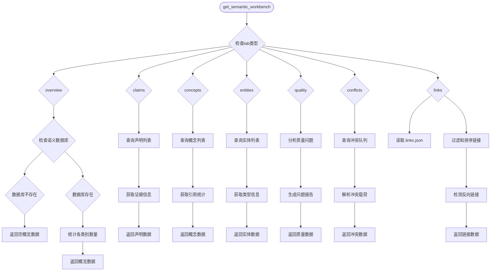

**图示来源**
- [semantic_handler.py:41-62](file://python/sidecar/handlers/semantic_handler.py#L41-62)
- [semantic_handler.py:83-134](file://python/sidecar/handlers/semantic_handler.py#L83-134)
- [semantic_handler.py:241-302](file://python/sidecar/handlers/semantic_handler.py#L241-302)

### 全库语义编译流程

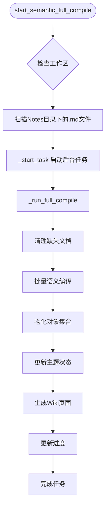

**图示来源**
- [semantic_handler.py:151-175](file://python/sidecar/handlers/semantic_handler.py#L151-175)
- [semantic_handler.py:177-232](file://python/sidecar/handlers/semantic_handler.py#L177-232)

### 实体合并与质量控制

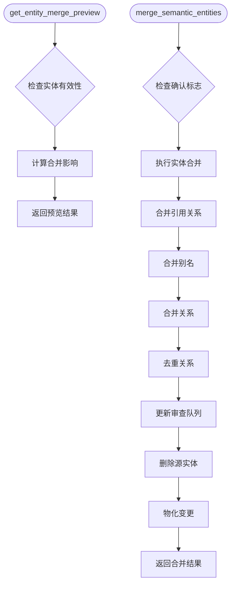

**图示来源**
- [semantic_handler.py:792-812](file://python/sidecar/handlers/semantic_handler.py#L792-812)
- [semantic_handler.py:814-946](file://python/sidecar/handlers/semantic_handler.py#L814-946)

章节来源
- [semantic_handler.py:16-1012](file://python/sidecar/handlers/semantic_handler.py#L16-L1012)
- [store.py:154-200](file://python/sidecar/semantic/store.py#L154-L200)
- [compiler.py:54-200](file://python/sidecar/semantic/compiler.py#L54-L200)

## 依赖关系分析
- 组件耦合
  - BaseHandler 与 SidecarServer 通过属性代理松耦合；处理器之间不直接互相引用，主要通过 Server 提供的公共能力与事件机制协作。
  - **新增**：SemanticHandler 依赖 SemanticStore 进行数据存储，依赖 SemanticCompiler 进行语义分析，形成独立的语义处理子系统。
- 外部依赖
  - 线程池（concurrent.futures）、日志（utils.logger）、作业状态（sidecar.job_status）、全文检索与缓存（utils.fulltext_index、TTLCache）。
  - **新增**：SQLite 数据库（sqlite3）、WAL 模式、事务管理、索引优化。
- 潜在循环依赖
  - 处理器通过 Server 访问共享能力，未见处理器间直接循环导入。
  - **新增**：语义模块内部通过 stable_id 和 content_hash 保持幂等性，避免循环依赖。

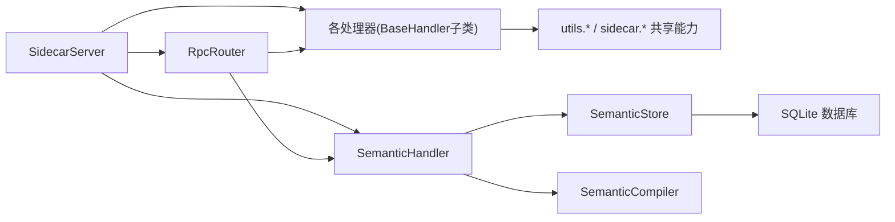

**图示来源**
- [server.py:54-124](file://python/sidecar/server.py#L54-L124)
- [rpc_router.py:43-106](file://python/sidecar/rpc_router.py#L43-L106)
- [semantic_handler.py:993-1012](file://python/sidecar/handlers/semantic_handler.py#L993-L1012)

章节来源
- [server.py:54-124](file://python/sidecar/server.py#L54-L124)
- [rpc_router.py:43-106](file://python/sidecar/rpc_router.py#L43-L106)

## 性能考量
- 并发与吞吐
  - RpcRouter 使用固定大小的线程池执行处理器方法，避免阻塞主循环；适合 I/O 密集型与中等 CPU 负载场景。
  - **新增**：语义编译器使用 ThreadPoolExecutor 并行处理多个文档，提高批处理效率。
- 缓存与去抖
  - 文件变更事件去抖聚合，减少重复的 Wiki 同步与索引重建；TTLCache 降低热点数据读取开销。
  - **新增**：语义数据库使用 WAL 模式和索引优化，提升查询性能。
- 资源释放
  - shutdown 阶段有序关闭线程池与模块级执行器，防止僵尸线程与句柄泄漏。
  - **新增**：语义数据库连接使用上下文管理器，确保资源正确释放。

## 故障排查指南
- 常见错误类型
  - METHOD_NOT_FOUND：请求的方法未注册，检查处理器 register_routes 是否正确调用。
  - INTERNAL_ERROR：处理器抛出未捕获异常，查看日志中的堆栈信息。
  - 业务错误：处理器抛出 NoteAIError，错误消息会被脱敏后返回。
  - **新增**：语义数据库错误：检查 SQLite 连接、权限和数据库完整性。
- 定位步骤
  - 确认路由是否注册：通过 RpcRouter.methods 或观察服务端日志。
  - 检查作业状态：通过 _send_job_update 上报的状态判断任务是否卡住或失败。
  - 审查日志：关注 [ERROR] 与 [task] 级别日志，定位异常来源。
  - **新增**：检查语义数据库状态：查看 semantic.db 文件和 schema 版本。

章节来源
- [rpc_router.py:54-82](file://python/sidecar/rpc_router.py#L54-L82)
- [server.py:184-214](file://python/sidecar/server.py#L184-L214)

## 结论
处理器系统以 BaseHandler 为抽象基础，结合 RpcRouter 的轻量路由与线程池执行，实现了高内聚、低耦合的可扩展架构。**最新更新**：语义处理器（SemanticHandler）的集成进一步增强了系统的语义处理能力，提供了完整的语义工作区管理、实体合并、质量审查等功能。通过统一的事件与作业状态上报机制，处理器间通信清晰可控；配置管理具备完善的校验与持久化能力。整体设计兼顾了易用性与可扩展性，适合持续演进的业务需求。

## 附录：扩展开发指南与示例

### 如何创建自定义处理器
- 步骤概览
  1. 新建处理器类继承 BaseHandler，实现 register_routes(router)。
  2. 在 register_routes 中调用 router.register("your_method", self._your_method)。
  3. 在 SidecarServer.__init__ 中实例化你的处理器，并在 _build_router 中调用其 register_routes。
  4. 如需后台任务，使用 self._start_task 启动异步处理。
  5. 通过 self._send_response/_send_progress/_send_job_update 与前端交互。
- 参考实现路径
  - 处理器基类与抽象接口：[base.py:4-106](file://python/sidecar/handlers/base.py#L4-L106)
  - 路由注册示例（配置处理器）：[config_handler.py:17-29](file://python/sidecar/handlers/config_handler.py#L17-L29)
  - 路由注册示例（文件处理器）：[files_handler.py:414-425](file://python/sidecar/handlers/files_handler.py#L414-L425)
  - 路由注册示例（主题处理器）：[topics_handler.py:546-568](file://python/sidecar/handlers/topics_handler.py#L546-L568)
  - **新增**：路由注册示例（语义处理器）：[semantic_handler.py:993-1012](file://python/sidecar/handlers/semantic_handler.py#L993-L1012)
  - 服务器装配处理器与路由：[server.py:107-124](file://python/sidecar/server.py#L107-L124)

### 处理器注册流程图（代码级）
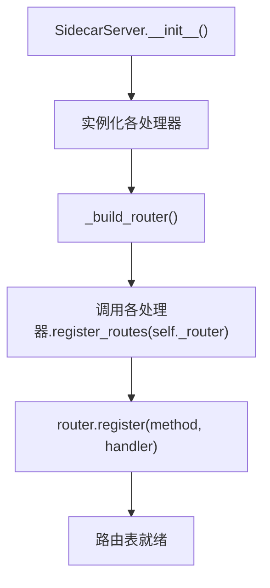

**图示来源**
- [server.py:107-124](file://python/sidecar/server.py#L107-L124)
- [config_handler.py:17-29](file://python/sidecar/handlers/config_handler.py#L17-L29)
- [files_handler.py:414-425](file://python/sidecar/handlers/files_handler.py#L414-L425)
- [topics_handler.py:546-568](file://python/sidecar/handlers/topics_handler.py#L546-L568)
- [semantic_handler.py:993-1012](file://python/sidecar/handlers/semantic_handler.py#L993-L1012)

### 处理器架构图（代码级）
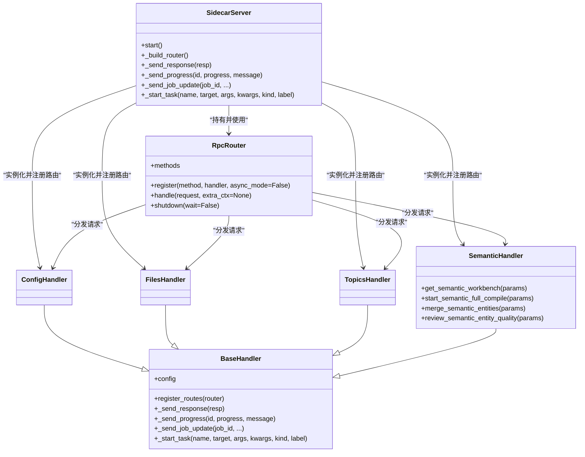

**图示来源**
- [server.py:54-124](file://python/sidecar/server.py#L54-L124)
- [rpc_router.py:43-106](file://python/sidecar/rpc_router.py#L43-L106)
- [base.py:4-106](file://python/sidecar/handlers/base.py#L4-L106)
- [config_handler.py:16-30](file://python/sidecar/handlers/config_handler.py#L16-L30)
- [files_handler.py:414-425](file://python/sidecar/handlers/files_handler.py#L414-L425)
- [topics_handler.py:546-568](file://python/sidecar/handlers/topics_handler.py#L546-L568)
- [semantic_handler.py:993-1012](file://python/sidecar/handlers/semantic_handler.py#L993-L1012)

### 语义处理器开发指南
- 语义处理器特点
  - 基于 SQLite 存储，支持复杂查询和事务操作
  - 提供完整的 CRUD 操作和批量处理能力
  - 支持异步任务处理和进度反馈
  - 集成 Wiki 页面生成和发布功能
- 开发步骤
  1. 继承 BaseHandler 创建新的语义处理器
  2. 实现 register_routes 方法注册所有语义 API
  3. 使用 SemanticStore 进行数据存储和查询
  4. 利用 _start_task 处理耗时的语义分析任务
  5. 通过 _send_job_update 提供实时进度反馈
- 最佳实践
  - 使用事务确保数据一致性
  - 实现适当的错误处理和日志记录
  - 提供清晰的 API 文档和参数验证
  - 考虑并发访问和数据竞争情况

章节来源
- [semantic_handler.py:16-1012](file://python/sidecar/handlers/semantic_handler.py#L16-L1012)
- [store.py:154-200](file://python/sidecar/semantic/store.py#L154-L200)
- [compiler.py:54-200](file://python/sidecar/semantic/compiler.py#L54-L200)