# 处理器间通信

<cite>
**本文引用的文件**   
- [server.py](file://python/sidecar/server.py)
- [rpc_router.py](file://python/sidecar/rpc_router.py)
- [service_context.py](file://python/sidecar/service_context.py)
- [handlers/base.py](file://python/sidecar/handlers/base.py)
- [handlers/ingest_handler.py](file://python/sidecar/handlers/ingest_handler.py)
- [handlers/topics_handler.py](file://python/sidecar/handlers/topics_handler.py)
- [handlers/links_handler.py](file://python/sidecar/handlers/links_handler.py)
- [handlers/kb_handler.py](file://python/sidecar/handlers/kb_handler.py)
- [handlers/job_handler.py](file://python/sidecar/handlers/job_handler.py)
- [ingest_pipeline.py](file://python/sidecar/ingest_pipeline.py)
- [cascade.py](file://python/sidecar/cascade.py)
- [cascade_runner.py](file://python/sidecar/cascade_runner.py)
- [job_status.py](file://python/sidecar/job_status.py)
- [pending_items.py](file://python/sidecar/pending_items.py)
- [mixins/path_helpers.py](file://python/sidecar/mixins/path_helpers.py)
</cite>

## 目录
1. [简介](#简介)
2. [项目结构](#项目结构)
3. [核心组件](#核心组件)
4. [架构总览](#架构总览)
5. [详细组件分析](#详细组件分析)
6. [依赖关系分析](#依赖关系分析)
7. [性能与并发特性](#性能与并发特性)
8. [故障排查指南](#故障排查指南)
9. [结论](#结论)
10. [附录：常见通信场景示例路径](#附录常见通信场景示例路径)

## 简介
本技术文档聚焦于处理器间通信机制，覆盖数据共享、消息传递、事件发布订阅、共享状态管理、缓存策略、服务上下文（全局配置、服务发现、依赖注入）、异步通信（线程池、回调、事件总线）、锁与并发控制、依赖管理与初始化顺序，并提供架构图与最佳实践。

## 项目结构
系统采用“进程内多处理器”的架构：一个主进程承载 RPC 路由与后台任务，多个 Handler 作为“处理器”暴露方法；通过统一的服务上下文进行依赖注入；通过 JSON-RPC 请求分发到具体处理器；处理器之间通过事件与共享状态协作。

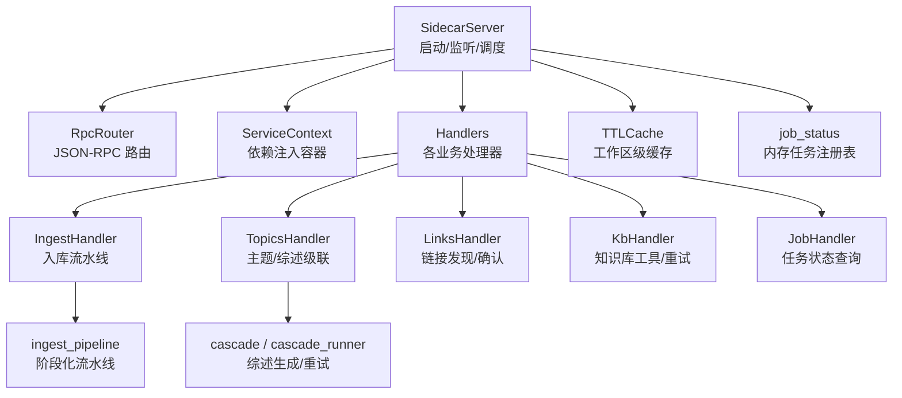

图表来源
- [server.py:54-125](file://python/sidecar/server.py#L54-L125)
- [rpc_router.py:43-106](file://python/sidecar/rpc_router.py#L43-L106)
- [service_context.py:6-19](file://python/sidecar/service_context.py#L6-L19)
- [handlers/base.py:4-106](file://python/sidecar/handlers/base.py#L4-L106)
- [handlers/ingest_handler.py:32-49](file://python/sidecar/handlers/ingest_handler.py#L32-L49)
- [handlers/topics_handler.py:41-67](file://python/sidecar/handlers/topics_handler.py#L41-L67)
- [handlers/links_handler.py:7-35](file://python/sidecar/handlers/links_handler.py#L7-L35)
- [handlers/kb_handler.py:16-32](file://python/sidecar/handlers/kb_handler.py#L16-L32)
- [handlers/job_handler.py:5-30](file://python/sidecar/handlers/job_handler.py#L5-L30)
- [ingest_pipeline.py:23-29](file://python/sidecar/ingest_pipeline.py#L23-L29)
- [cascade.py:11-12](file://python/sidecar/cascade.py#L11-L12)
- [cascade_runner.py:24-26](file://python/sidecar/cascade_runner.py#L24-L26)
- [job_status.py:11-14](file://python/sidecar/job_status.py#L11-L14)

章节来源
- [server.py:54-125](file://python/sidecar/server.py#L54-L125)
- [rpc_router.py:43-106](file://python/sidecar/rpc_router.py#L43-L106)
- [service_context.py:6-19](file://python/sidecar/service_context.py#L6-L19)

## 核心组件
- SidecarServer：进程入口，负责构建路由器、注册处理器、启动文件监听、发送响应、生命周期管理。
- RpcRouter：轻量 JSON-RPC 路由，支持同步/异步处理，统一错误处理与线程池执行。
- ServiceContext：依赖注入容器，提供 config 与 logger，替代模块级全局。
- BaseHandler：处理器基类，透传 server 能力（配置、发送器、任务、路径解析、缓存等）。
- 处理器族：IngestHandler、TopicsHandler、LinksHandler、KbHandler、JobHandler 等，按领域划分职责。
- ingest_pipeline：阶段化入库流水线，含取消、断点续跑、指纹检测、索引更新等。
- cascade / cascade_runner：综述生成与级联更新，带重试与失败持久化。
- job_status：内存任务状态注册表，统一进度与结果推送。
- TTLCache：工作区级缓存，配合失效策略。

章节来源
- [server.py:54-125](file://python/sidecar/server.py#L54-L125)
- [rpc_router.py:43-106](file://python/sidecar/rpc_router.py#L43-L106)
- [service_context.py:6-19](file://python/sidecar/service_context.py#L6-L19)
- [handlers/base.py:4-106](file://python/sidecar/handlers/base.py#L4-L106)
- [handlers/ingest_handler.py:32-49](file://python/sidecar/handlers/ingest_handler.py#L32-L49)
- [handlers/topics_handler.py:41-67](file://python/sidecar/handlers/topics_handler.py#L41-L67)
- [handlers/links_handler.py:7-35](file://python/sidecar/handlers/links_handler.py#L7-L35)
- [handlers/kb_handler.py:16-32](file://python/sidecar/handlers/kb_handler.py#L16-L32)
- [handlers/job_handler.py:5-30](file://python/sidecar/handlers/job_handler.py#L5-L30)
- [ingest_pipeline.py:23-29](file://python/sidecar/ingest_pipeline.py#L23-L29)
- [cascade.py:11-12](file://python/sidecar/cascade.py#L11-L12)
- [cascade_runner.py:24-26](file://python/sidecar/cascade_runner.py#L24-L26)
- [job_status.py:11-14](file://python/sidecar/job_status.py#L11-L14)

## 架构总览
下图展示从客户端到处理器再到事件回传的完整链路，以及共享状态与缓存的作用域。

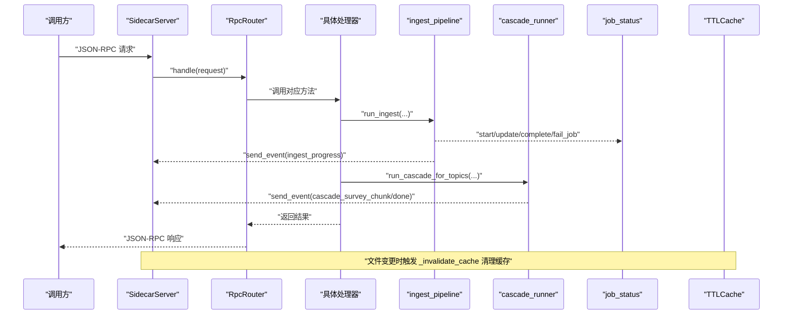

图表来源
- [server.py:126-182](file://python/sidecar/server.py#L126-L182)
- [rpc_router.py:54-82](file://python/sidecar/rpc_router.py#L54-L82)
- [handlers/ingest_handler.py:152-215](file://python/sidecar/handlers/ingest_handler.py#L152-L215)
- [ingest_pipeline.py:480-591](file://python/sidecar/ingest_pipeline.py#L480-L591)
- [handlers/ingest_handler.py:216-300](file://python/sidecar/handlers/ingest_handler.py#L216-L300)
- [cascade_runner.py:74-154](file://python/sidecar/cascade_runner.py#L74-L154)
- [job_status.py:35-144](file://python/sidecar/job_status.py#L35-L144)

## 详细组件分析

### 服务上下文与依赖注入
- ServiceContext 持有 config 与 logger，处理器通过 BaseHandler 间接访问，避免模块级全局耦合。
- 服务器构造时创建 ServiceContext，并注入到各处理器实例中。

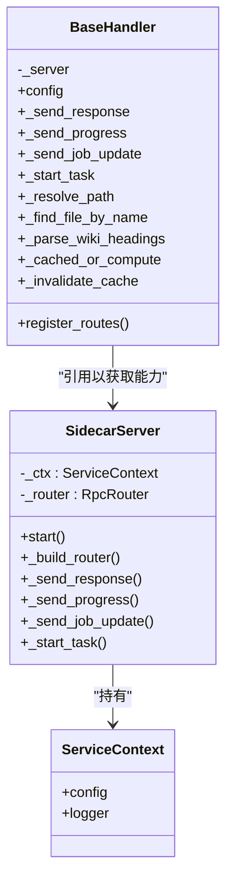

图表来源
- [service_context.py:6-19](file://python/sidecar/service_context.py#L6-L19)
- [handlers/base.py:4-106](file://python/sidecar/handlers/base.py#L4-L106)
- [server.py:77-95](file://python/sidecar/server.py#L77-L95)

章节来源
- [service_context.py:6-19](file://python/sidecar/service_context.py#L6-L19)
- [handlers/base.py:4-106](file://python/sidecar/handlers/base.py#L4-L106)
- [server.py:77-95](file://python/sidecar/server.py#L77-L95)

### RPC 路由与异步执行
- RpcRouter 维护方法到处理器的映射，所有请求提交至线程池执行，避免阻塞 stdin 读取循环。
- 统一错误处理，屏蔽敏感路径信息，返回结构化错误码。

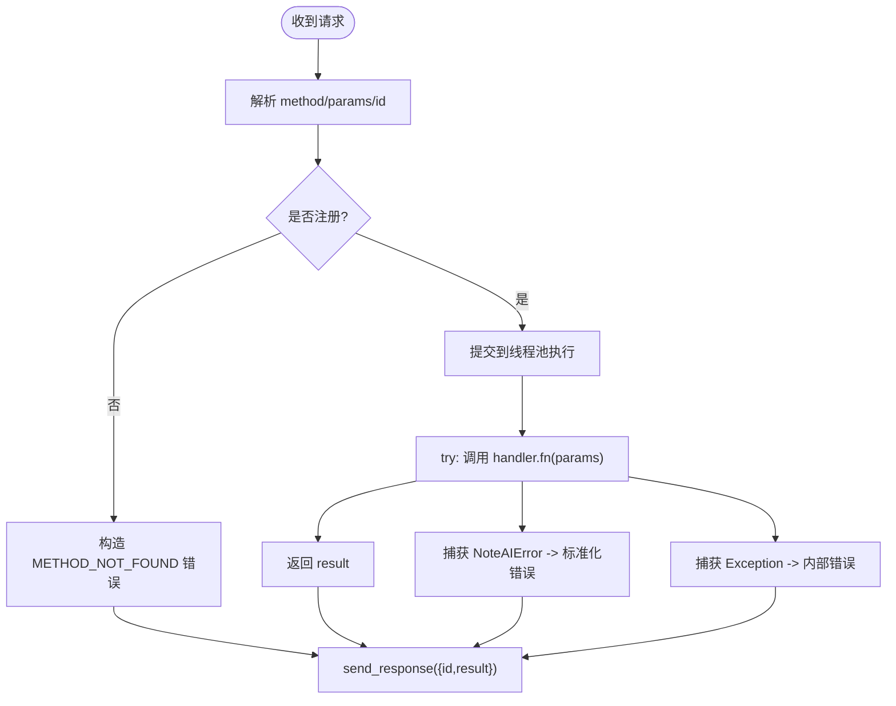

图表来源
- [rpc_router.py:43-106](file://python/sidecar/rpc_router.py#L43-L106)

章节来源
- [rpc_router.py:43-106](file://python/sidecar/rpc_router.py#L43-L106)

### 处理器职责与协作
- IngestHandler：封装入库流水线，负责阶段推进、进度上报、后台综述任务编排。
- TopicsHandler：主题树、自动分配、批量分配、移动/重命名/删除、级联综述更新。
- LinksHandler：链接发现（互斥锁保护）、反向链接、统计、确认/拒绝。
- KbHandler：知识库巡检、重复项合并、聊天归档、综述失败重试。
- JobHandler：任务列表与详情查询。

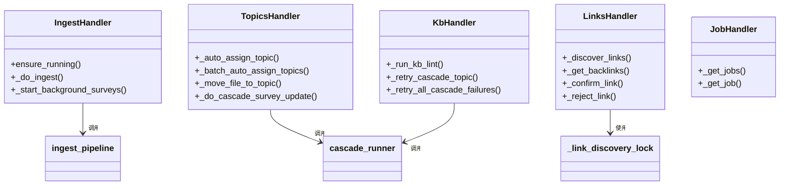

图表来源
- [handlers/ingest_handler.py:32-49](file://python/sidecar/handlers/ingest_handler.py#L32-L49)
- [handlers/topics_handler.py:41-67](file://python/sidecar/handlers/topics_handler.py#L41-L67)
- [handlers/links_handler.py:7-35](file://python/sidecar/handlers/links_handler.py#L7-L35)
- [handlers/kb_handler.py:16-32](file://python/sidecar/handlers/kb_handler.py#L16-L32)
- [handlers/job_handler.py:5-30](file://python/sidecar/handlers/job_handler.py#L5-L30)

章节来源
- [handlers/ingest_handler.py:32-49](file://python/sidecar/handlers/ingest_handler.py#L32-L49)
- [handlers/topics_handler.py:41-67](file://python/sidecar/handlers/topics_handler.py#L41-L67)
- [handlers/links_handler.py:7-35](file://python/sidecar/handlers/links_handler.py#L7-L35)
- [handlers/kb_handler.py:16-32](file://python/sidecar/handlers/kb_handler.py#L16-L32)
- [handlers/job_handler.py:5-30](file://python/sidecar/handlers/job_handler.py#L5-L30)

### 事件发布订阅与消息传递
- 事件通道：处理器通过统一的 send_response 发送事件，格式为 {"id":"event","result":{...}}。
- 典型事件类型：
  - ingest_progress：入库阶段进度
  - ingest_complete：入库完成或失败
  - ingest_cascade_started / ingest_cascade_complete：后台综述任务开始/结束
  - cascade_survey_chunk / cascade_done：综述流式片段与完成
  - workspace_files_changed：工作区文件变更
  - link_discovery_complete：链接发现完成
  - job_update：任务状态更新

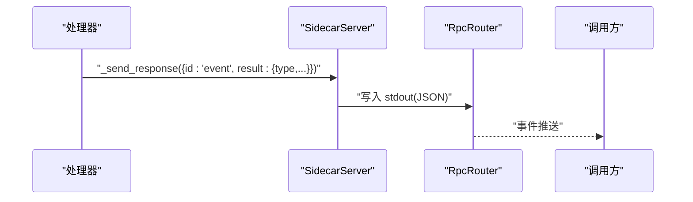

图表来源
- [server.py:126-143](file://python/sidecar/server.py#L126-L143)
- [handlers/ingest_handler.py:159-177](file://python/sidecar/handlers/ingest_handler.py#L159-L177)
- [handlers/ingest_handler.py:262-299](file://python/sidecar/handlers/ingest_handler.py#L262-L299)
- [cascade_runner.py:94-107](file://python/sidecar/cascade_runner.py#L94-L107)
- [server.py:531-539](file://python/sidecar/server.py#L531-L539)
- [handlers/links_handler.py:23-31](file://python/sidecar/handlers/links_handler.py#L23-L31)
- [job_status.py:26-33](file://python/sidecar/job_status.py#L26-L33)

章节来源
- [server.py:126-143](file://python/sidecar/server.py#L126-L143)
- [handlers/ingest_handler.py:159-177](file://python/sidecar/handlers/ingest_handler.py#L159-L177)
- [handlers/ingest_handler.py:262-299](file://python/sidecar/handlers/ingest_handler.py#L262-L299)
- [cascade_runner.py:94-107](file://python/sidecar/cascade_runner.py#L94-L107)
- [server.py:531-539](file://python/sidecar/server.py#L531-L539)
- [handlers/links_handler.py:23-31](file://python/sidecar/handlers/links_handler.py#L23-L31)
- [job_status.py:26-33](file://python/sidecar/job_status.py#L26-L33)

### 共享状态管理与缓存策略
- 任务状态：job_status 提供内存中的任务注册表，支持 start/update/complete/fail/cancel/list/get，并通过事件推送。
- 流水线状态：ingest_pipeline 将运行状态、阶段、进度、统计写入工作区应用文件夹下的 JSON 文件，支持断点续跑与中断恢复。
- 工作区缓存：TTLCache 基于键值缓存，配合 _invalidate_cache 在文件变更时清理；全文检索与 RAG 查询缓存也在此处失效。
- 失败记录：cascade_runner 将综述失败持久化为 JSON，支持重试与清理。

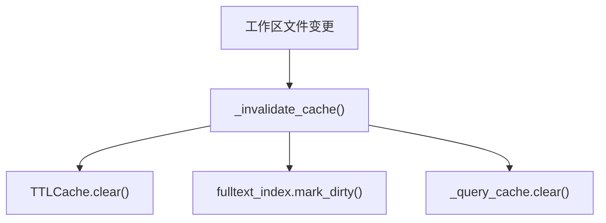

图表来源
- [server.py:340-346](file://python/sidecar/server.py#L340-L346)
- [server.py:348-355](file://python/sidecar/server.py#L348-L355)
- [ingest_pipeline.py:107-145](file://python/sidecar/ingest_pipeline.py#L107-L145)
- [cascade_runner.py:28-53](file://python/sidecar/cascade_runner.py#L28-L53)

章节来源
- [server.py:340-355](file://python/sidecar/server.py#L340-L355)
- [ingest_pipeline.py:107-145](file://python/sidecar/ingest_pipeline.py#L107-L145)
- [cascade_runner.py:28-53](file://python/sidecar/cascade_runner.py#L28-L53)

### 异步通信实现方式
- 线程池：RpcRouter 使用 ThreadPoolExecutor 执行处理器方法，避免阻塞主循环。
- 回调机制：处理器通过 send_progress/send_event 回调推送进度与事件。
- 事件总线：统一的事件格式由 SidecarServer 输出，消费者可订阅不同类型事件。
- 后台任务：SidecarServer._start_task 包装任务生命周期，自动上报 job_status 事件。

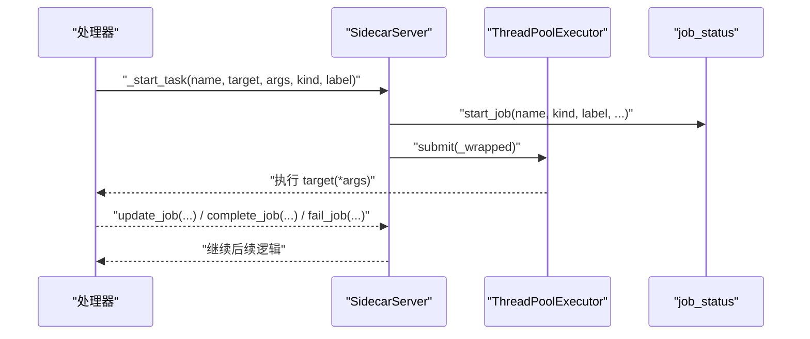

图表来源
- [rpc_router.py:43-82](file://python/sidecar/rpc_router.py#L43-L82)
- [server.py:184-214](file://python/sidecar/server.py#L184-L214)
- [job_status.py:35-144](file://python/sidecar/job_status.py#L35-L144)

章节来源
- [rpc_router.py:43-82](file://python/sidecar/rpc_router.py#L43-L82)
- [server.py:184-214](file://python/sidecar/server.py#L184-L214)
- [job_status.py:35-144](file://python/sidecar/job_status.py#L35-L144)

### 锁机制与并发控制
- 文件操作锁：cascade.append_changelog 使用模块级 _changelog_lock 保证日志追加原子性。
- 链接发现锁：LinksHandler._discover_links 使用非阻塞锁防止并发扫描。
- 自动转换并发：SidecarServer 使用 _auto_convert_lock 与 _auto_convert_inflight 去重。
- 工作区变更防抖：_watcher_debounce_lock 与 generation 计数确保只处理最新批次。
- 索引互斥：ingest_pipeline 使用 index_operation 上下文管理器确保同一时间仅一个索引更新任务。

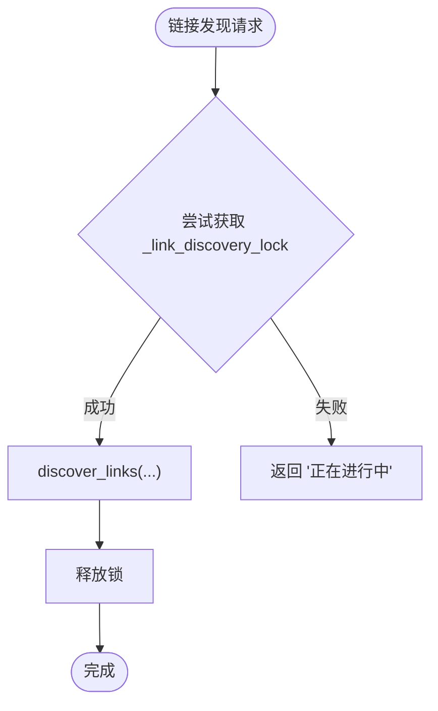

图表来源
- [cascade.py:11-12](file://python/sidecar/cascade.py#L11-L12)
- [handlers/links_handler.py:8-35](file://python/sidecar/handlers/links_handler.py#L8-L35)
- [server.py:470-511](file://python/sidecar/server.py#L470-L511)
- [server.py:416-458](file://python/sidecar/server.py#L416-L458)
- [ingest_pipeline.py:350-361](file://python/sidecar/ingest_pipeline.py#L350-L361)

章节来源
- [cascade.py:11-12](file://python/sidecar/cascade.py#L11-L12)
- [handlers/links_handler.py:8-35](file://python/sidecar/handlers/links_handler.py#L8-L35)
- [server.py:470-511](file://python/sidecar/server.py#L470-L511)
- [server.py:416-458](file://python/sidecar/server.py#L416-L458)
- [ingest_pipeline.py:350-361](file://python/sidecar/ingest_pipeline.py#L350-L361)

### 处理器间的依赖管理与初始化顺序
- 初始化顺序：
  1) 构造 SidecarServer，创建 ServiceContext、各处理器实例、RpcRouter。
  2) 调用 _build_router 注册所有处理器路由。
  3) start() 启动文件监听与启动同步任务。
- 依赖关系：
  - 处理器通过 BaseHandler 访问 server 提供的通用能力（配置、发送器、任务、路径解析、缓存）。
  - 处理器之间不直接互相引用，而是通过事件与共享状态（job_status、文件系统、工作区规则）协作。

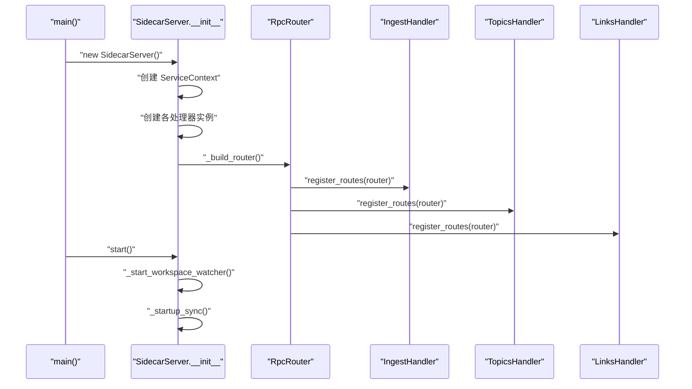

图表来源
- [server.py:57-95](file://python/sidecar/server.py#L57-L95)
- [server.py:97-125](file://python/sidecar/server.py#L97-L125)
- [handlers/ingest_handler.py:32-49](file://python/sidecar/handlers/ingest_handler.py#L32-L49)
- [handlers/topics_handler.py:546-567](file://python/sidecar/handlers/topics_handler.py#L546-L567)
- [handlers/links_handler.py:77-84](file://python/sidecar/handlers/links_handler.py#L77-L84)

章节来源
- [server.py:57-125](file://python/sidecar/server.py#L57-L125)
- [handlers/ingest_handler.py:32-49](file://python/sidecar/handlers/ingest_handler.py#L32-L49)
- [handlers/topics_handler.py:546-567](file://python/sidecar/handlers/topics_handler.py#L546-L567)
- [handlers/links_handler.py:77-84](file://python/sidecar/handlers/links_handler.py#L77-L84)

## 依赖关系分析
- 低耦合：处理器通过接口（BaseHandler）与事件交互，避免强依赖。
- 集中路由：RpcRouter 统一管理方法与处理器映射，便于扩展与维护。
- 外部依赖：文件监听（watchdog）、全文检索、RAG 索引、LLM 调用等通过模块导入按需加载，降低启动成本。

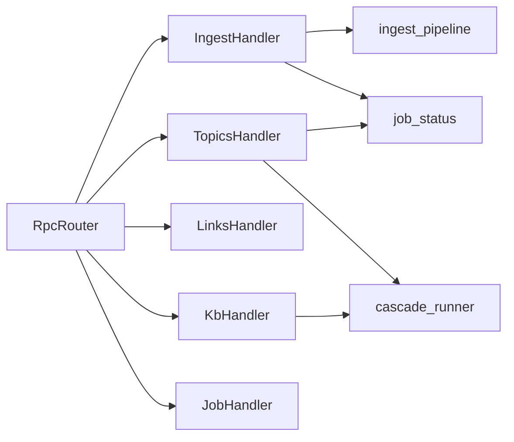

图表来源
- [server.py:107-124](file://python/sidecar/server.py#L107-L124)
- [handlers/ingest_handler.py:32-49](file://python/sidecar/handlers/ingest_handler.py#L32-L49)
- [handlers/topics_handler.py:546-567](file://python/sidecar/handlers/topics_handler.py#L546-L567)
- [handlers/links_handler.py:77-84](file://python/sidecar/handlers/links_handler.py#L77-L84)
- [handlers/kb_handler.py:16-32](file://python/sidecar/handlers/kb_handler.py#L16-L32)
- [handlers/job_handler.py:5-30](file://python/sidecar/handlers/job_handler.py#L5-L30)
- [ingest_pipeline.py:23-29](file://python/sidecar/ingest_pipeline.py#L23-L29)
- [cascade_runner.py:74-154](file://python/sidecar/cascade_runner.py#L74-L154)
- [job_status.py:11-14](file://python/sidecar/job_status.py#L11-L14)

章节来源
- [server.py:107-124](file://python/sidecar/server.py#L107-L124)
- [handlers/ingest_handler.py:32-49](file://python/sidecar/handlers/ingest_handler.py#L32-L49)
- [handlers/topics_handler.py:546-567](file://python/sidecar/handlers/topics_handler.py#L546-L567)
- [handlers/links_handler.py:77-84](file://python/sidecar/handlers/links_handler.py#L77-L84)
- [handlers/kb_handler.py:16-32](file://python/sidecar/handlers/kb_handler.py#L16-L32)
- [handlers/job_handler.py:5-30](file://python/sidecar/handlers/job_handler.py#L5-L30)
- [ingest_pipeline.py:23-29](file://python/sidecar/ingest_pipeline.py#L23-L29)
- [cascade_runner.py:74-154](file://python/sidecar/cascade_runner.py#L74-L154)
- [job_status.py:11-14](file://python/sidecar/job_status.py#L11-L14)

## 性能与并发特性
- 线程池并行：RPC 处理器与后台任务均通过线程池执行，提升吞吐。
- 防抖与批处理：工作区变更采用防抖与代际号，减少频繁刷新。
- 增量与断点续跑：ingest_pipeline 支持指纹检测与阶段标记，避免全量重建。
- 索引互斥：RAG 索引更新使用互斥上下文，避免并发写冲突。
- 缓存失效：文件变更时统一清理 RPC、全文检索与 RAG 查询缓存，保证一致性。

[本节为通用指导，无需列出具体文件来源]

## 故障排查指南
- 任务状态异常：通过 JobHandler 查询任务列表与详情，定位卡住或失败的任务。
- 入库失败：查看 ingest_pipeline 的阶段与消息，必要时使用“重试入库”或“下次全量”。
- 综述失败：通过 KbHandler 查看失败清单并逐个或批量重试；失败记录持久化便于审计。
- 链接发现阻塞：检查是否已有发现任务在运行，等待或重启后重试。
- 缓存不一致：触发工作区文件变更事件或手动刷新，确保缓存失效。

章节来源
- [handlers/job_handler.py:5-30](file://python/sidecar/handlers/job_handler.py#L5-L30)
- [handlers/ingest_handler.py:301-351](file://python/sidecar/handlers/ingest_handler.py#L301-L351)
- [handlers/kb_handler.py:123-155](file://python/sidecar/handlers/kb_handler.py#L123-L155)
- [handlers/links_handler.py:8-35](file://python/sidecar/handlers/links_handler.py#L8-L35)
- [server.py:340-355](file://python/sidecar/server.py#L340-L355)

## 结论
本系统通过“服务上下文 + RPC 路由 + 处理器 + 事件 + 共享状态”的组合，实现了高内聚、低耦合的处理器间通信。借助线程池、锁与缓存失效策略，系统在并发与一致性之间取得平衡。建议遵循以下最佳实践：
- 使用 ServiceContext 进行依赖注入，避免全局变量。
- 通过事件而非直接调用进行处理器间解耦。
- 对长耗时操作使用 _start_task 与 job_status 上报进度。
- 对共享资源加锁，确保原子性与一致性。
- 利用指纹与阶段标记实现增量与断点续跑。
- 在文件变更后及时失效相关缓存。

[本节为总结，无需列出具体文件来源]

## 附录：常见通信场景示例路径
- 启动入库流水线并接收进度事件
  - [handlers/ingest_handler.py:132-151](file://python/sidecar/handlers/ingest_handler.py#L132-L151)
  - [handlers/ingest_handler.py:152-215](file://python/sidecar/handlers/ingest_handler.py#L152-L215)
  - [ingest_pipeline.py:480-591](file://python/sidecar/ingest_pipeline.py#L480-L591)
- 后台综述生成与重试
  - [handlers/ingest_handler.py:216-300](file://python/sidecar/handlers/ingest_handler.py#L216-L300)
  - [cascade_runner.py:74-154](file://python/sidecar/cascade_runner.py#L74-L154)
  - [handlers/kb_handler.py:123-155](file://python/sidecar/handlers/kb_handler.py#L123-L155)
- 链接发现与互斥控制
  - [handlers/links_handler.py:8-35](file://python/sidecar/handlers/links_handler.py#L8-L35)
- 工作区变更与缓存失效
  - [server.py:416-458](file://python/sidecar/server.py#L416-L458)
  - [server.py:340-355](file://python/sidecar/server.py#L340-L355)
- 任务状态查询
  - [handlers/job_handler.py:5-30](file://python/sidecar/handlers/job_handler.py#L5-L30)
  - [job_status.py:168-189](file://python/sidecar/job_status.py#L168-L189)