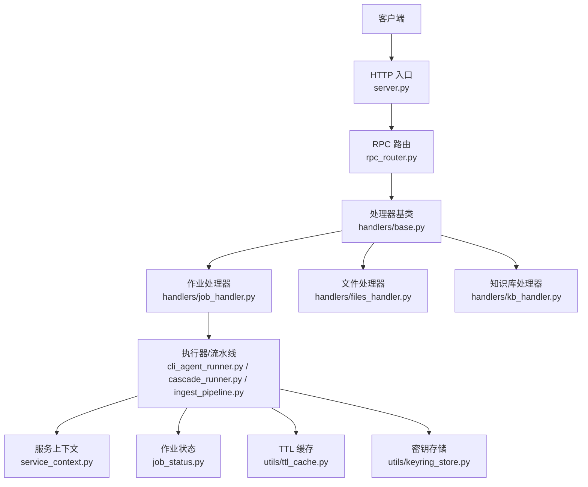
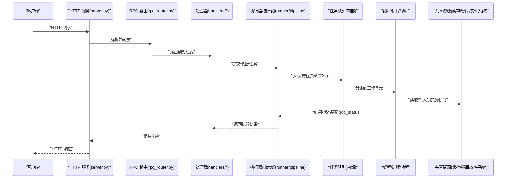
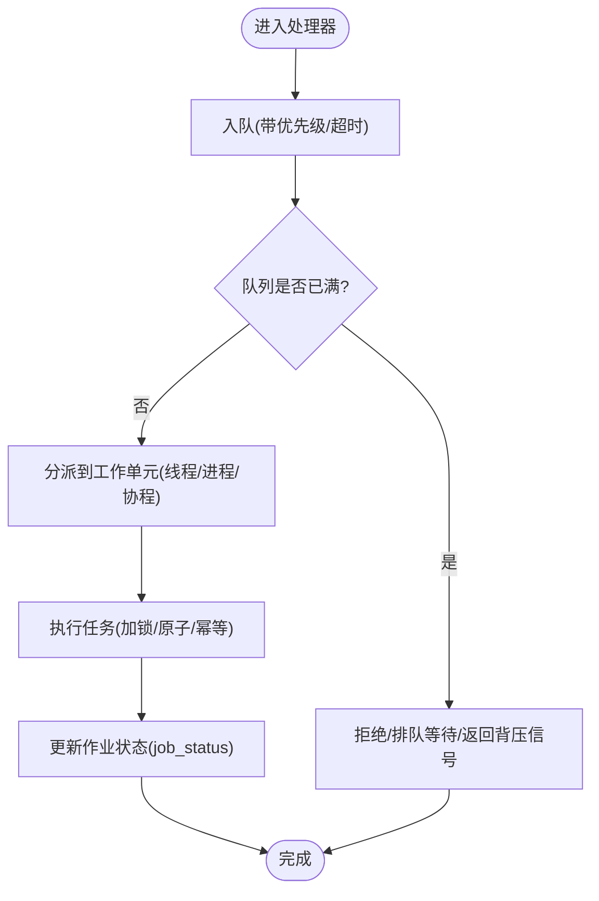
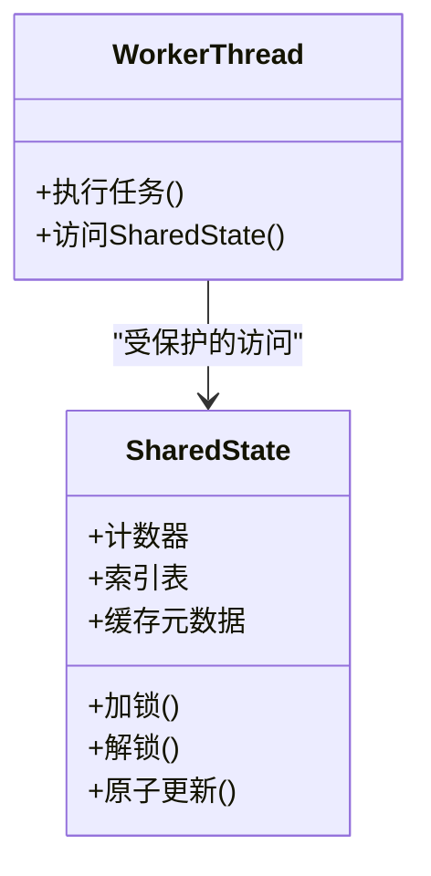
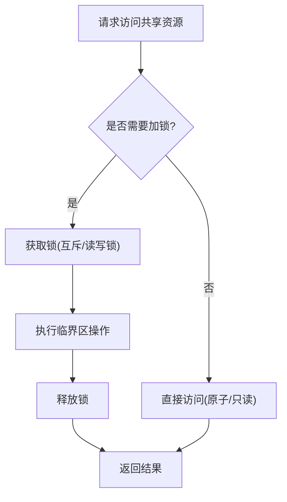
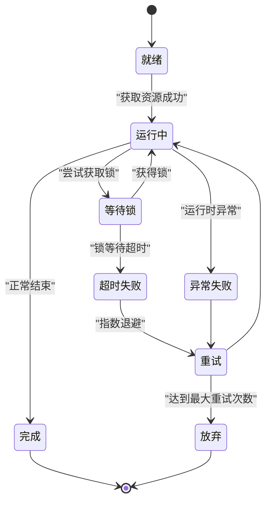
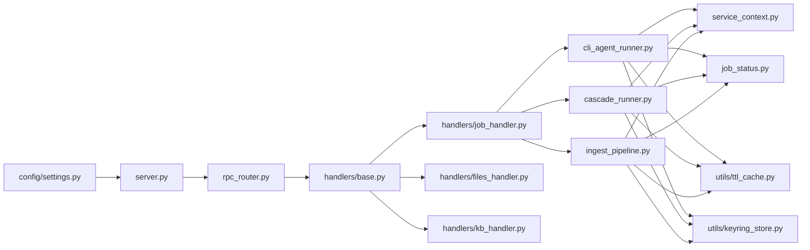

# 并发与线程安全

<cite>
**本文引用的文件**
- [python/sidecar/server.py](file://python/sidecar/server.py)
- [python/sidecar/rpc_router.py](file://python/sidecar/rpc_router.py)
- [python/sidecar/service_context.py](file://python/sidecar/service_context.py)
- [python/sidecar/job_status.py](file://python/sidecar/job_status.py)
- [python/sidecar/ingest_pipeline.py](file://python/sidecar/ingest_pipeline.py)
- [python/sidecar/cli_agent_runner.py](file://python/sidecar/cli_agent_runner.py)
- [python/sidecar/cascade_runner.py](file://python/sidecar/cascade_runner.py)
- [python/sidecar/mixins/topics_3tier_mixin.py](file://python/sidecar/mixins/topics_3tier_mixin.py)
- [python/sidecar/cloud/sync_engine.py](file://python/sidecar/cloud/sync_engine.py)
- [python/sidecar/handlers/base.py](file://python/sidecar/handlers/base.py)
- [python/sidecar/handlers/job_handler.py](file://python/sidecar/handlers/job_handler.py)
- [python/sidecar/handlers/files_handler.py](file://python/sidecar/handlers/files_handler.py)
- [python/sidecar/handlers/kb_handler.py](file://python/sidecar/handlers/kb_handler.py)
- [utils/ttl_cache.py](file://utils/ttl_cache.py)
- [utils/keyring_store.py](file://utils/keyring_store.py)
- [config/settings.py](file://config/settings.py)
</cite>

## 目录
1. [简介](#简介)
2. [项目结构](#项目结构)
3. [核心组件](#核心组件)
4. [架构总览](#架构总览)
5. [详细组件分析](#详细组件分析)
6. [依赖关系分析](#依赖关系分析)
7. [性能考虑](#性能考虑)
8. [故障排查指南](#故障排查指南)
9. [结论](#结论)
10. [附录](#附录)

## 简介
本文件聚焦 Python Sidecar 服务的并发与线程安全机制，系统性阐述其多线程处理、协程调度、任务队列管理、锁与原子操作、内存屏障语义、异步框架集成（含 asyncio 事件循环与背压控制）、资源竞争处理方案（数据库连接池、文件锁、缓存一致性），以及死锁检测与预防（超时控制、资源监控、故障恢复）。文档同时提供并发架构图、线程模型图与性能调优建议，并给出可落地的最佳实践示例路径。

## 项目结构
Sidecar 服务采用“HTTP 入口 + RPC 路由 + 处理器 + 执行器/流水线”的分层组织方式：
- HTTP 入口负责接收请求、鉴权与参数校验
- RPC 路由将调用分发到具体处理器
- 处理器封装业务逻辑，必要时委派给执行器或流水线
- 执行器/流水线负责实际工作项的调度与执行，内部使用线程/进程/协程等并发原语



图示来源
- [python/sidecar/server.py](file://python/sidecar/server.py)
- [python/sidecar/rpc_router.py](file://python/sidecar/rpc_router.py)
- [python/sidecar/handlers/base.py](file://python/sidecar/handlers/base.py)
- [python/sidecar/handlers/job_handler.py](file://python/sidecar/handlers/job_handler.py)
- [python/sidecar/handlers/files_handler.py](file://python/sidecar/handlers/files_handler.py)
- [python/sidecar/handlers/kb_handler.py](file://python/sidecar/handlers/kb_handler.py)
- [python/sidecar/cli_agent_runner.py](file://python/sidecar/cli_agent_runner.py)
- [python/sidecar/cascade_runner.py](file://python/sidecar/cascade_runner.py)
- [python/sidecar/ingest_pipeline.py](file://python/sidecar/ingest_pipeline.py)
- [python/sidecar/service_context.py](file://python/sidecar/service_context.py)
- [python/sidecar/job_status.py](file://python/sidecar/job_status.py)
- [utils/ttl_cache.py](file://utils/ttl_cache.py)
- [utils/keyring_store.py](file://utils/keyring_store.py)

章节来源
- [python/sidecar/server.py](file://python/sidecar/server.py)
- [python/sidecar/rpc_router.py](file://python/sidecar/rpc_router.py)
- [python/sidecar/handlers/base.py](file://python/sidecar/handlers/base.py)
- [python/sidecar/handlers/job_handler.py](file://python/sidecar/handlers/job_handler.py)
- [python/sidecar/handlers/files_handler.py](file://python/sidecar/handlers/files_handler.py)
- [python/sidecar/handlers/kb_handler.py](file://python/sidecar/handlers/kb_handler.py)
- [python/sidecar/cli_agent_runner.py](file://python/sidecar/cli_agent_runner.py)
- [python/sidecar/cascade_runner.py](file://python/sidecar/cascade_runner.py)
- [python/sidecar/ingest_pipeline.py](file://python/sidecar/ingest_pipeline.py)
- [python/sidecar/service_context.py](file://python/sidecar/service_context.py)
- [python/sidecar/job_status.py](file://python/sidecar/job_status.py)
- [utils/ttl_cache.py](file://utils/ttl_cache.py)
- [utils/keyring_store.py](file://utils/keyring_store.py)

## 核心组件
- 服务启动与生命周期：由 server.py 启动 HTTP 服务，注册路由与中间件，维护全局上下文与资源池。
- RPC 路由与处理器：rpc_router.py 将外部调用映射到 handlers；handlers/base.py 定义通用能力（如日志、错误码、限流/重试策略）；各领域处理器实现具体业务。
- 执行器与流水线：cli_agent_runner.py、cascade_runner.py、ingest_pipeline.py 分别负责 CLI Agent 编排、级联流程编排与数据摄入流水线，内部协调线程/进程/协程与任务队列。
- 服务上下文与状态：service_context.py 提供跨请求共享的服务上下文（配置、连接池、缓存句柄等）；job_status.py 维护作业运行状态与进度。
- 共享资源：ttl_cache.py 提供带过期时间的内存缓存；keyring_store.py 提供安全的凭据存取；settings.py 集中管理配置项。

章节来源
- [python/sidecar/server.py](file://python/sidecar/server.py)
- [python/sidecar/rpc_router.py](file://python/sidecar/rpc_router.py)
- [python/sidecar/handlers/base.py](file://python/sidecar/handlers/base.py)
- [python/sidecar/handlers/job_handler.py](file://python/sidecar/handlers/job_handler.py)
- [python/sidecar/handlers/files_handler.py](file://python/sidecar/handlers/files_handler.py)
- [python/sidecar/handlers/kb_handler.py](file://python/sidecar/handlers/kb_handler.py)
- [python/sidecar/cli_agent_runner.py](file://python/sidecar/cli_agent_runner.py)
- [python/sidecar/cascade_runner.py](file://python/sidecar/cascade_runner.py)
- [python/sidecar/ingest_pipeline.py](file://python/sidecar/ingest_pipeline.py)
- [python/sidecar/service_context.py](file://python/sidecar/service_context.py)
- [python/sidecar/job_status.py](file://python/sidecar/job_status.py)
- [utils/ttl_cache.py](file://utils/ttl_cache.py)
- [utils/keyring_store.py](file://utils/keyring_store.py)
- [config/settings.py](file://config/settings.py)

## 架构总览
下图展示从请求进入到执行完成的并发链路，包括线程/协程边界、任务队列与资源访问点。



图示来源
- [python/sidecar/server.py](file://python/sidecar/server.py)
- [python/sidecar/rpc_router.py](file://python/sidecar/rpc_router.py)
- [python/sidecar/handlers/base.py](file://python/sidecar/handlers/base.py)
- [python/sidecar/handlers/job_handler.py](file://python/sidecar/handlers/job_handler.py)
- [python/sidecar/cli_agent_runner.py](file://python/sidecar/cli_agent_runner.py)
- [python/sidecar/cascade_runner.py](file://python/sidecar/cascade_runner.py)
- [python/sidecar/ingest_pipeline.py](file://python/sidecar/ingest_pipeline.py)
- [python/sidecar/job_status.py](file://python/sidecar/job_status.py)
- [utils/ttl_cache.py](file://utils/ttl_cache.py)
- [utils/keyring_store.py](file://utils/keyring_store.py)

## 详细组件分析

### 线程模型与任务队列
- 线程模型
  - HTTP 层通常以多进程或多线程方式接受请求，每个请求进入处理器后，可能进一步派发至线程池或进程池执行 CPU/IO 密集型任务。
  - 对于长耗时或可并行化的子任务（如批量文件处理、网络抓取、向量检索），优先使用线程池或进程池隔离资源与失败域。
- 任务队列
  - 处理器通过内部队列对任务进行缓冲与削峰填谷，支持优先级、超时与重试。
  - 消费者侧按可用工作单元拉取任务，避免阻塞主循环。
- 背压控制
  - 当队列长度超过阈值时，拒绝新任务或返回降级响应；消费者侧根据负载动态调整并发度。



图示来源
- [python/sidecar/handlers/job_handler.py](file://python/sidecar/handlers/job_handler.py)
- [python/sidecar/handlers/base.py](file://python/sidecar/handlers/base.py)
- [python/sidecar/cli_agent_runner.py](file://python/sidecar/cli_agent_runner.py)
- [python/sidecar/cascade_runner.py](file://python/sidecar/cascade_runner.py)
- [python/sidecar/ingest_pipeline.py](file://python/sidecar/ingest_pipeline.py)
- [python/sidecar/job_status.py](file://python/sidecar/job_status.py)

章节来源
- [python/sidecar/handlers/job_handler.py](file://python/sidecar/handlers/job_handler.py)
- [python/sidecar/handlers/base.py](file://python/sidecar/handlers/base.py)
- [python/sidecar/cli_agent_runner.py](file://python/sidecar/cli_agent_runner.py)
- [python/sidecar/cascade_runner.py](file://python/sidecar/cascade_runner.py)
- [python/sidecar/ingest_pipeline.py](file://python/sidecar/ingest_pipeline.py)
- [python/sidecar/job_status.py](file://python/sidecar/job_status.py)

### 异步处理与事件循环
- asyncio 集成
  - 在 IO 密集场景（网络请求、文件 I/O、数据库查询）优先使用协程，减少线程切换开销。
  - 通过事件循环统一调度协程，配合 aiohttp/fastapi 等异步框架提升吞吐。
- 事件循环管理
  - 明确事件循环边界，避免在同步上下文中阻塞事件循环。
  - 对第三方同步库使用 run_in_executor 包装，防止阻塞。
- 背压控制
  - 使用有界队列或信号量限制并发协程数量，结合超时与取消传播，避免雪崩。

```mermaid
sequenceDiagram
participant Loop as "事件循环"
participant Handler as "异步处理器"
participant Pool as "线程/进程池"
participant Ext as "外部系统(网络/DB/FS)"
Loop->>Handler : "触发协程"
Handler->>Ext : "异步 IO(非阻塞)"
Handler->>Pool : "CPU 密集任务(回调)"
Pool-->>Handler : "结果回传"
Handler-->>Loop : "继续调度其他协程"
```

图示来源
- [python/sidecar/server.py](file://python/sidecar/server.py)
- [python/sidecar/rpc_router.py](file://python/sidecar/rpc_router.py)
- [python/sidecar/handlers/base.py](file://python/sidecar/handlers/base.py)
- [python/sidecar/ingest_pipeline.py](file://python/sidecar/ingest_pipeline.py)

章节来源
- [python/sidecar/server.py](file://python/sidecar/server.py)
- [python/sidecar/rpc_router.py](file://python/sidecar/rpc_router.py)
- [python/sidecar/handlers/base.py](file://python/sidecar/handlers/base.py)
- [python/sidecar/ingest_pipeline.py](file://python/sidecar/ingest_pipeline.py)

### 线程安全策略
- 锁机制
  - 对共享可变状态（如索引、计数器、缓存元数据）使用互斥锁保护读写路径。
  - 尽量缩小临界区范围，避免长时间持锁导致争用放大。
- 原子操作
  - 对简单计数/标志位使用原子变量或无锁数据结构，降低锁粒度。
- 内存屏障
  - 在多核环境下，确保可见性与顺序性，避免编译器/CPU 重排导致的竞态条件。
- 不可变对象与拷贝
  - 传递只读视图或深拷贝，避免共享可变状态被意外修改。



图示来源
- [python/sidecar/mixins/topics_3tier_mixin.py](file://python/sidecar/mixins/topics_3tier_mixin.py)
- [python/sidecar/job_status.py](file://python/sidecar/job_status.py)
- [utils/ttl_cache.py](file://utils/ttl_cache.py)

章节来源
- [python/sidecar/mixins/topics_3tier_mixin.py](file://python/sidecar/mixins/topics_3tier_mixin.py)
- [python/sidecar/job_status.py](file://python/sidecar/job_status.py)
- [utils/ttl_cache.py](file://utils/ttl_cache.py)

### 资源竞争处理
- 数据库连接池
  - 使用连接池复用连接，设置最大连接数与空闲回收策略，避免连接泄漏。
  - 对事务边界加超时，失败自动回滚与重试（指数退避）。
- 文件锁
  - 对同一文件的并发写使用文件锁或原子替换（先写临时文件再 rename）保证一致性。
- 缓存一致性
  - TTL 缓存需考虑失效策略与并发更新热点键的“击穿/穿透/雪崩”防护。
  - 使用分布式锁或本地锁对热点键的刷新进行串行化。



图示来源
- [python/sidecar/cloud/sync_engine.py](file://python/sidecar/cloud/sync_engine.py)
- [python/sidecar/handlers/files_handler.py](file://python/sidecar/handlers/files_handler.py)
- [utils/ttl_cache.py](file://utils/ttl_cache.py)
- [utils/keyring_store.py](file://utils/keyring_store.py)

章节来源
- [python/sidecar/cloud/sync_engine.py](file://python/sidecar/cloud/sync_engine.py)
- [python/sidecar/handlers/files_handler.py](file://python/sidecar/handlers/files_handler.py)
- [utils/ttl_cache.py](file://utils/ttl_cache.py)
- [utils/keyring_store.py](file://utils/keyring_store.py)

### 死锁检测与预防
- 超时控制
  - 所有锁持有时间上限、任务执行超时、I/O 超时均需显式配置，避免无限等待。
- 资源监控
  - 统计锁等待时长、队列积压、线程/进程活跃数，异常告警。
- 故障恢复
  - 任务失败重试（带退避与去重）、作业状态持久化、断点续跑。
- 预防策略
  - 固定加锁顺序、避免嵌套锁、尽量无锁设计、短临界区。



图示来源
- [python/sidecar/job_status.py](file://python/sidecar/job_status.py)
- [python/sidecar/handlers/base.py](file://python/sidecar/handlers/base.py)
- [python/sidecar/cli_agent_runner.py](file://python/sidecar/cli_agent_runner.py)
- [python/sidecar/cascade_runner.py](file://python/sidecar/cascade_runner.py)

章节来源
- [python/sidecar/job_status.py](file://python/sidecar/job_status.py)
- [python/sidecar/handlers/base.py](file://python/sidecar/handlers/base.py)
- [python/sidecar/cli_agent_runner.py](file://python/sidecar/cli_agent_runner.py)
- [python/sidecar/cascade_runner.py](file://python/sidecar/cascade_runner.py)

## 依赖关系分析
- 模块耦合
  - server.py 依赖 rpc_router.py 与 handlers；handlers 依赖 runner/pipeline；runner/pipeline 依赖 service_context、job_status、缓存与密钥存储。
- 外部依赖
  - 配置来自 settings.py；缓存与密钥存储位于 utils 包；云同步引擎依赖外部云服务 SDK。
- 潜在环依赖
  - 应避免 handler 与 runner 互相导入，通过接口或上下文解耦。



图示来源
- [python/sidecar/server.py](file://python/sidecar/server.py)
- [python/sidecar/rpc_router.py](file://python/sidecar/rpc_router.py)
- [python/sidecar/handlers/base.py](file://python/sidecar/handlers/base.py)
- [python/sidecar/handlers/job_handler.py](file://python/sidecar/handlers/job_handler.py)
- [python/sidecar/handlers/files_handler.py](file://python/sidecar/handlers/files_handler.py)
- [python/sidecar/handlers/kb_handler.py](file://python/sidecar/handlers/kb_handler.py)
- [python/sidecar/cli_agent_runner.py](file://python/sidecar/cli_agent_runner.py)
- [python/sidecar/cascade_runner.py](file://python/sidecar/cascade_runner.py)
- [python/sidecar/ingest_pipeline.py](file://python/sidecar/ingest_pipeline.py)
- [python/sidecar/service_context.py](file://python/sidecar/service_context.py)
- [python/sidecar/job_status.py](file://python/sidecar/job_status.py)
- [utils/ttl_cache.py](file://utils/ttl_cache.py)
- [utils/keyring_store.py](file://utils/keyring_store.py)
- [config/settings.py](file://config/settings.py)

章节来源
- [python/sidecar/server.py](file://python/sidecar/server.py)
- [python/sidecar/rpc_router.py](file://python/sidecar/rpc_router.py)
- [python/sidecar/handlers/base.py](file://python/sidecar/handlers/base.py)
- [python/sidecar/handlers/job_handler.py](file://python/sidecar/handlers/job_handler.py)
- [python/sidecar/handlers/files_handler.py](file://python/sidecar/handlers/files_handler.py)
- [python/sidecar/handlers/kb_handler.py](file://python/sidecar/handlers/kb_handler.py)
- [python/sidecar/cli_agent_runner.py](file://python/sidecar/cli_agent_runner.py)
- [python/sidecar/cascade_runner.py](file://python/sidecar/cascade_runner.py)
- [python/sidecar/ingest_pipeline.py](file://python/sidecar/ingest_pipeline.py)
- [python/sidecar/service_context.py](file://python/sidecar/service_context.py)
- [python/sidecar/job_status.py](file://python/sidecar/job_status.py)
- [utils/ttl_cache.py](file://utils/ttl_cache.py)
- [utils/keyring_store.py](file://utils/keyring_store.py)
- [config/settings.py](file://config/settings.py)

## 性能考虑
- 并发度调优
  - 根据 CPU 核心数与 IO 特性设置线程/进程池大小；IO 密集可适当提高并发，CPU 密集遵循核心数原则。
- 队列与背压
  - 为队列设置容量上限与丢弃/拒绝策略；监控队列深度与消费延迟。
- 锁粒度与热点
  - 细化锁粒度，拆分热点键的更新路径；使用读写锁分离读多写少场景。
- 缓存命中率
  - 合理设置 TTL 与预热策略；对热点键使用防击穿锁。
- 超时与重试
  - 分层设置超时（网络、磁盘、计算）；重试采用指数退避与抖动，避免风暴。
- 监控与观测
  - 暴露关键指标：QPS、P99 延迟、锁等待时间、队列积压、错误率。

[本节为通用指导，不直接分析具体文件]

## 故障排查指南
- 常见问题定位
  - 高延迟：检查锁等待、队列积压、下游依赖超时。
  - 内存增长：关注缓存未清理、连接泄漏、大对象未及时释放。
  - 偶发崩溃：查看作业状态与堆栈，确认是否因竞态或越界访问。
- 诊断手段
  - 启用详细日志与结构化追踪；采集线程/协程栈快照。
  - 使用压力测试复现问题，逐步缩小范围。
- 恢复策略
  - 自动重启健康探针；作业状态持久化与断点续跑；灰度发布与快速回滚。

章节来源
- [python/sidecar/job_status.py](file://python/sidecar/job_status.py)
- [python/sidecar/handlers/base.py](file://python/sidecar/handlers/base.py)
- [python/sidecar/cli_agent_runner.py](file://python/sidecar/cli_agent_runner.py)
- [python/sidecar/cascade_runner.py](file://python/sidecar/cascade_runner.py)

## 结论
Python Sidecar 服务通过清晰的层次划分与明确的并发边界，实现了可扩展的并发模型与稳健的线程安全策略。借助任务队列、背压控制、锁与原子操作、TTL 缓存与密钥存储等机制，系统在吞吐、延迟与可靠性之间取得平衡。配合超时、监控与故障恢复，可有效预防与缓解死锁与资源竞争问题。建议在后续迭代中持续完善指标观测与自动化回归，进一步提升稳定性与性能。

[本节为总结性内容，不直接分析具体文件]

## 附录
- 线程安全编程最佳实践示例路径
  - 处理器中的作业提交与状态更新：[handlers/job_handler.py](file://python/sidecar/handlers/job_handler.py)
  - 基础处理器中的通用并发与错误处理模式：[handlers/base.py](file://python/sidecar/handlers/base.py)
  - CLI Agent 执行器的线程/进程调度与超时控制：[cli_agent_runner.py](file://python/sidecar/cli_agent_runner.py)
  - 级联流程的执行编排与状态流转：[cascade_runner.py](file://python/sidecar/cascade_runner.py)
  - 数据摄入流水线的批处理与背压：[ingest_pipeline.py](file://python/sidecar/ingest_pipeline.py)
  - 三阶主题混入中的共享状态与锁使用：[mixins/topics_3tier_mixin.py](file://python/sidecar/mixins/topics_3tier_mixin.py)
  - 云同步引擎的文件与远端资源并发访问：[cloud/sync_engine.py](file://python/sidecar/cloud/sync_engine.py)
  - 文件处理器中的文件锁与原子替换：[handlers/files_handler.py](file://python/sidecar/handlers/files_handler.py)
  - TTL 缓存的并发访问与过期策略：[utils/ttl_cache.py](file://utils/ttl_cache.py)
  - 密钥存储的安全访问与并发保护：[utils/keyring_store.py](file://utils/keyring_store.py)
  - 作业状态机与超时/重试：[job_status.py](file://python/sidecar/job_status.py)
  - 服务上下文与资源池初始化：[service_context.py](file://python/sidecar/service_context.py)
  - 配置项与并发相关参数：[config/settings.py](file://config/settings.py)