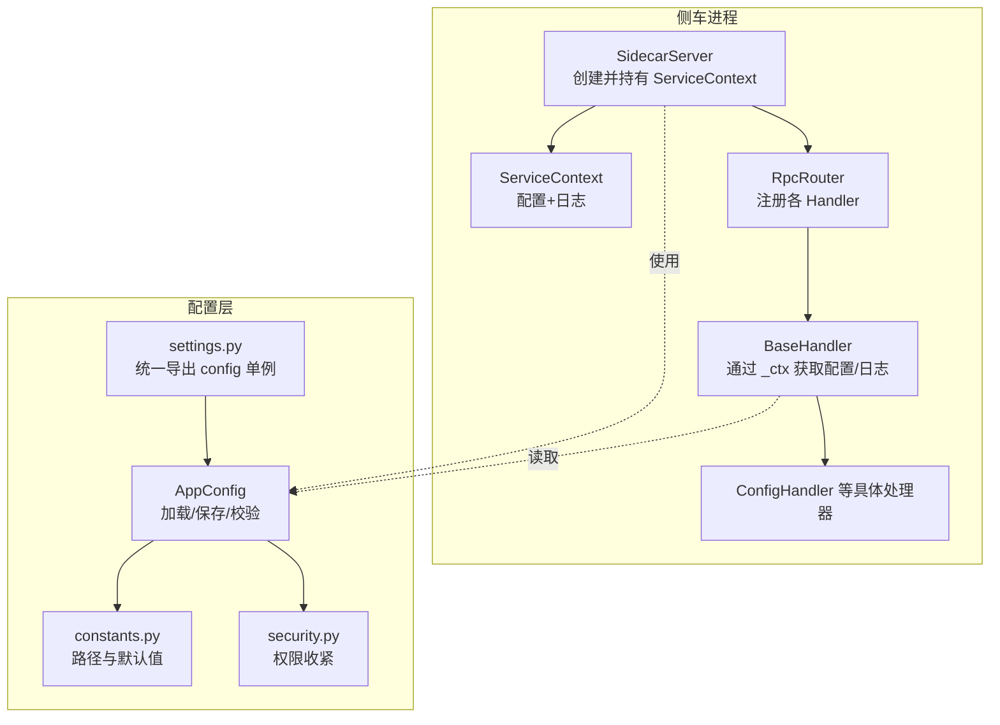
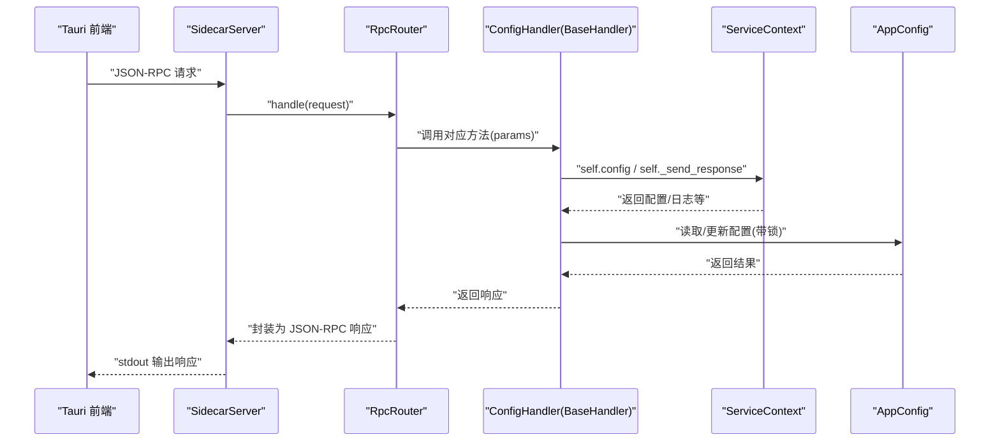
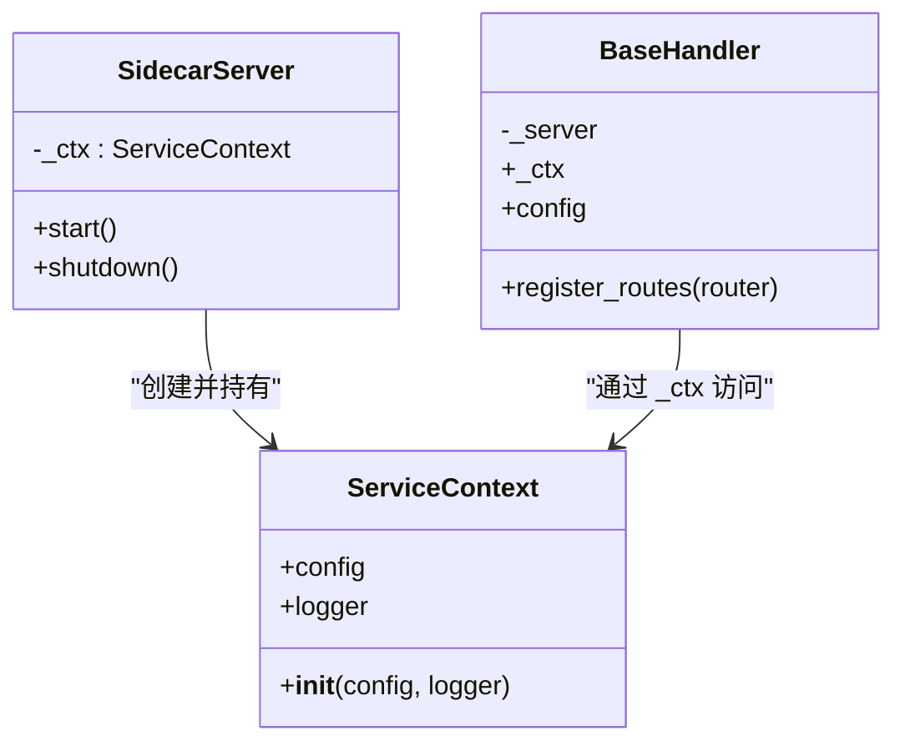
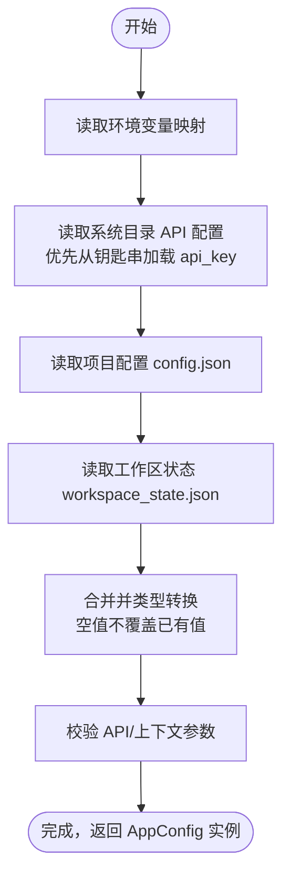
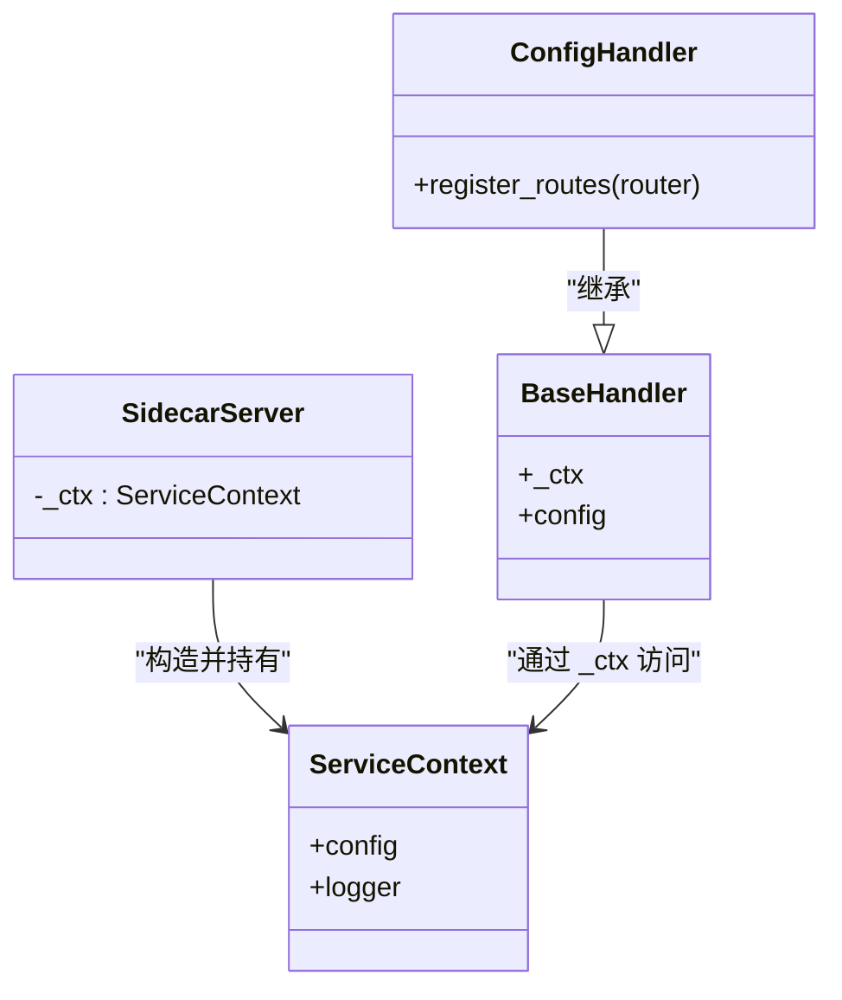
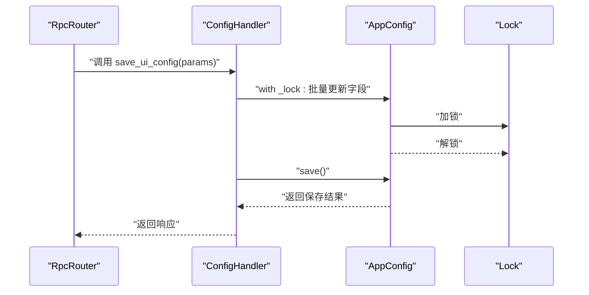
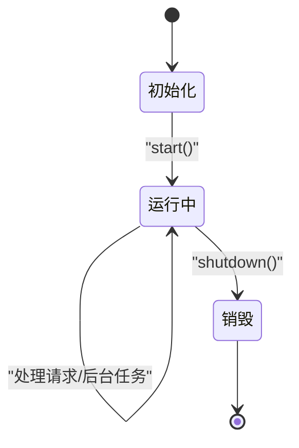
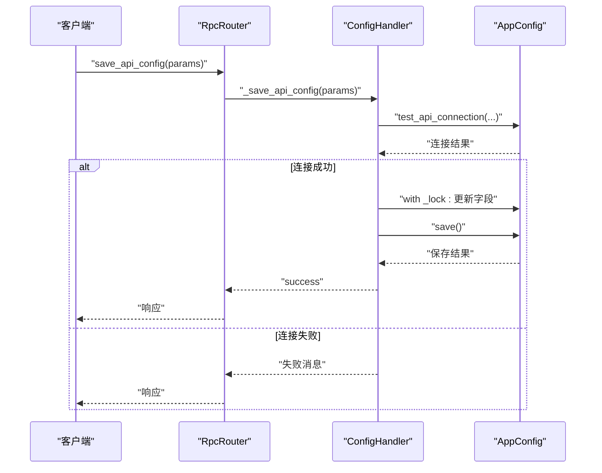
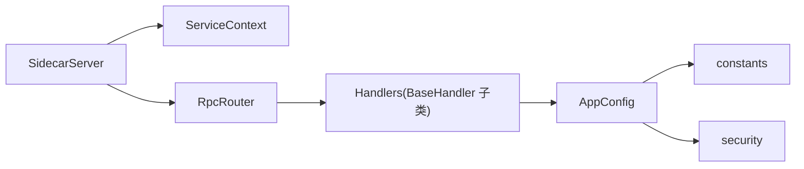

# 服务上下文管理

<cite>
**本文引用的文件**   
- [service_context.py](file://python/sidecar/service_context.py)
- [server.py](file://python/sidecar/server.py)
- [base.py](file://python/sidecar/handlers/base.py)
- [config_handler.py](file://python/sidecar/handlers/config_handler.py)
- [rpc_router.py](file://python/sidecar/rpc_router.py)
- [app_config.py](file://config/app_config.py)
- [settings.py](file://config/settings.py)
- [constants.py](file://config/constants.py)
- [security.py](file://config/security.py)
</cite>

## 目录
1. [简介](#简介)
2. [项目结构](#项目结构)
3. [核心组件](#核心组件)
4. [架构总览](#架构总览)
5. [详细组件分析](#详细组件分析)
6. [依赖关系分析](#依赖关系分析)
7. [性能与并发特性](#性能与并发特性)
8. [故障排查指南](#故障排查指南)
9. [结论](#结论)
10. [附录：最佳实践](#附录最佳实践)

## 简介
本技术文档围绕“服务上下文管理系统”展开，聚焦于 ServiceContext 类及其在侧车（Sidecar）进程中的角色。文档深入解释其设计模式与实现原理，包括：
- 依赖注入容器：以显式上下文替代模块级全局引用，提升可测试性与可维护性
- 配置管理：层次化加载、线程安全访问、持久化策略
- 状态维护：工作区初始化、索引与缓存失效、后台任务生命周期
- 上下文生命周期：初始化、传播到处理器、销毁与资源释放
- 线程安全：基于锁的读写隔离与线程池执行模型
- 架构图、依赖图与流程图，帮助读者快速理解系统全貌

## 项目结构
与“服务上下文管理”直接相关的代码分布在以下位置：
- python/sidecar/service_context.py：定义 ServiceContext 上下文对象
- python/sidecar/server.py：创建并持有 ServiceContext，构建 RPC 路由，启动/停止后台任务
- python/sidecar/handlers/base.py：处理器基类，通过 _ctx 暴露配置与日志等能力
- python/sidecar/handlers/config_handler.py：配置相关 RPC 处理示例，展示对配置的读写流程
- python/sidecar/rpc_router.py：轻量 JSON-RPC 路由器，负责请求分发与线程池执行
- config/app_config.py：应用配置数据模型、加载/保存逻辑、线程安全访问
- config/settings.py：统一导出配置常量与单例实例
- config/constants.py：路径常量与工作区默认值
- config/security.py：敏感文件权限收紧工具

图表来源
- [server.py:54-95](file://python/sidecar/server.py#L54-L95)
- [service_context.py:6-19](file://python/sidecar/service_context.py#L6-L19)
- [base.py:4-15](file://python/sidecar/handlers/base.py#L4-L15)
- [app_config.py:28-110](file://config/app_config.py#L28-L110)
- [settings.py:1-41](file://config/settings.py#L1-L41)
- [constants.py:1-52](file://config/constants.py#L1-L52)
- [security.py:6-12](file://config/security.py#L6-L12)

章节来源
- [server.py:54-95](file://python/sidecar/server.py#L54-L95)
- [service_context.py:6-19](file://python/sidecar/service_context.py#L6-L19)
- [base.py:4-15](file://python/sidecar/handlers/base.py#L4-L15)
- [app_config.py:28-110](file://config/app_config.py#L28-L110)
- [settings.py:1-41](file://config/settings.py#L1-L41)
- [constants.py:1-52](file://config/constants.py#L1-L52)
- [security.py:6-12](file://config/security.py#L6-L12)

## 核心组件
- ServiceContext：最小化的依赖注入容器，持有配置与日志，供处理器显式访问
- SidecarServer：进程入口，构造 ServiceContext，注册路由，管理后台任务与资源
- BaseHandler：处理器基类，提供统一的 _ctx 访问点，屏蔽底层细节
- AppConfig：配置数据模型，支持从多源合并、类型转换、校验、持久化与线程安全访问
- RpcRouter：JSON-RPC 路由与线程池执行器，将请求分派给处理器方法
- settings.py：对外暴露 config 单例，便于旧代码兼容过渡

章节来源
- [service_context.py:6-19](file://python/sidecar/service_context.py#L6-L19)
- [server.py:54-95](file://python/sidecar/server.py#L54-L95)
- [base.py:4-15](file://python/sidecar/handlers/base.py#L4-L15)
- [app_config.py:28-110](file://config/app_config.py#L28-L110)
- [rpc_router.py:43-82](file://python/sidecar/rpc_router.py#L43-L82)
- [settings.py:1-41](file://config/settings.py#L1-L41)

## 架构总览
下图展示了“服务上下文”在请求处理链路中的位置与职责边界：

图表来源
- [server.py:54-95](file://python/sidecar/server.py#L54-L95)
- [rpc_router.py:43-82](file://python/sidecar/rpc_router.py#L43-L82)
- [base.py:4-15](file://python/sidecar/handlers/base.py#L4-L15)
- [config_handler.py:16-78](file://python/sidecar/handlers/config_handler.py#L16-L78)
- [app_config.py:28-110](file://config/app_config.py#L28-L110)

## 详细组件分析

### ServiceContext 类设计与实现
- 设计目标：用显式上下文替代模块级全局引用，使处理器无需 import 全局 config/logger
- 组成字段：config、logger（通过 __slots__ 限制属性集合，降低内存占用）
- 使用方式：由 SidecarServer 构造并持有，处理器通过 BaseHandler._ctx 间接访问

图表来源
- [service_context.py:6-19](file://python/sidecar/service_context.py#L6-L19)
- [base.py:4-15](file://python/sidecar/handlers/base.py#L4-L15)
- [server.py:54-95](file://python/sidecar/server.py#L54-L95)

章节来源
- [service_context.py:6-19](file://python/sidecar/service_context.py#L6-L19)
- [base.py:4-15](file://python/sidecar/handlers/base.py#L4-L15)
- [server.py:54-95](file://python/sidecar/server.py#L54-L95)

### 配置系统层次结构与优先级
- 数据模型：AppConfig 使用 dataclass 声明所有配置项及默认值
- 加载顺序（从高到低）：
  1) 环境变量（如 NOTEAI_API_KEY、NOTEAI_WORKSPACE_PATH 等）
  2) API 配置文件（系统目录 api_config.json，优先从系统钥匙串加载 api_key）
  3) 项目配置文件（config/config.json）
  4) 工作区状态（workspace_state.json）用于 workspace_path 默认值
  5) 类默认值
- 类型转换：按 key 分组进行 float/int 强制转换，空字符串视为未设置
- 校验：API 配置与上下文长度阈值校验
- 持久化：非 API 字段写入项目配置；API 字段优先写入系统钥匙串，剩余写入系统目录配置文件，并收紧权限
- 线程安全：内部持有一个锁，提供 _get_attr/_set_attr 以及 to_dict 的受保护访问

图表来源
- [app_config.py:212-311](file://config/app_config.py#L212-L311)
- [app_config.py:176-194](file://config/app_config.py#L176-L194)
- [app_config.py:313-383](file://config/app_config.py#L313-L383)
- [constants.py:1-52](file://config/constants.py#L1-L52)
- [security.py:6-12](file://config/security.py#L6-L12)

章节来源
- [app_config.py:28-110](file://config/app_config.py#L28-L110)
- [app_config.py:212-311](file://config/app_config.py#L212-L311)
- [app_config.py:313-383](file://config/app_config.py#L313-L383)
- [constants.py:1-52](file://config/constants.py#L1-L52)
- [security.py:6-12](file://config/security.py#L6-L12)

### 依赖注入工作原理
- 容器：ServiceContext 作为最小容器，仅持有必要的共享实例（config、logger）
- 注册：SidecarServer 在构造时创建 ServiceContext 并持有
- 传播：BaseHandler 通过 _ctx 属性将上下文透传到具体处理器
- 解析：处理器通过 self.config 访问配置，避免模块级导入
- 循环依赖检测：当前实现为扁平容器，无自动依赖解析与循环检测机制；如需扩展，可在容器层引入延迟解析与环检测

图表来源
- [service_context.py:6-19](file://python/sidecar/service_context.py#L6-L19)
- [server.py:54-95](file://python/sidecar/server.py#L54-L95)
- [base.py:4-15](file://python/sidecar/handlers/base.py#L4-L15)
- [config_handler.py:16-29](file://python/sidecar/handlers/config_handler.py#L16-L29)

章节来源
- [service_context.py:6-19](file://python/sidecar/service_context.py#L6-L19)
- [server.py:54-95](file://python/sidecar/server.py#L54-L95)
- [base.py:4-15](file://python/sidecar/handlers/base.py#L4-L15)
- [config_handler.py:16-29](file://python/sidecar/handlers/config_handler.py#L16-L29)

### 线程安全的上下文访问机制
- 配置层：AppConfig 内部持有 threading.Lock，并提供 _get_attr/_set_attr 与 to_dict 的受保护访问
- 处理器层：ConfigHandler 在批量更新配置时使用 with self.config._lock 包裹，保证原子性
- 执行模型：RpcRouter 使用 ThreadPoolExecutor 执行处理器方法，避免阻塞 stdin 主循环
- 全局状态隔离：当前未使用 Python 本地存储（threading.local），而是通过进程内单例配置与锁实现跨线程一致视图

图表来源
- [app_config.py:100-110](file://config/app_config.py#L100-L110)
- [config_handler.py:135-198](file://python/sidecar/handlers/config_handler.py#L135-L198)
- [rpc_router.py:43-82](file://python/sidecar/rpc_router.py#L43-L82)

章节来源
- [app_config.py:100-110](file://config/app_config.py#L100-L110)
- [config_handler.py:135-198](file://python/sidecar/handlers/config_handler.py#L135-L198)
- [rpc_router.py:43-82](file://python/sidecar/rpc_router.py#L43-L82)

### 上下文生命周期管理
- 初始化：
  - 进程启动时 main() 创建 SidecarServer
  - SidecarServer.__init__ 中创建 ServiceContext(config=config, logger=logger)
  - 注册所有处理器路由
- 传播：
  - BaseHandler 通过 _ctx 暴露配置与日志
  - 具体处理器通过 self.config 访问配置
- 运行期：
  - 后台任务（文件监听、自动转换、RAG 重建）在 start() 后启动
  - 配置变更触发缓存失效与可能的 WIKI 同步
- 销毁：
  - shutdown() 停止文件监听、关闭路由线程池、清理外部执行器与缓存

图表来源
- [server.py:57-95](file://python/sidecar/server.py#L57-L95)
- [server.py:97-106](file://python/sidecar/server.py#L97-L106)
- [server.py:544-568](file://python/sidecar/server.py#L544-L568)

章节来源
- [server.py:57-95](file://python/sidecar/server.py#L57-L95)
- [server.py:97-106](file://python/sidecar/server.py#L97-L106)
- [server.py:544-568](file://python/sidecar/server.py#L544-L568)

### 配置读写流程（示例）
- 读取 API 配置：返回脱敏后的 api_key 与其他字段
- 保存 API 配置：先连通性测试，再在锁下批量更新并持久化
- 保存 UI 配置：批量更新 UI/RAG 相关字段，必要时刷新查询缓存

图表来源
- [config_handler.py:50-78](file://python/sidecar/handlers/config_handler.py#L50-L78)
- [rpc_router.py:43-82](file://python/sidecar/rpc_router.py#L43-L82)
- [app_config.py:313-383](file://config/app_config.py#L313-L383)

章节来源
- [config_handler.py:50-78](file://python/sidecar/handlers/config_handler.py#L50-L78)
- [rpc_router.py:43-82](file://python/sidecar/rpc_router.py#L43-L82)
- [app_config.py:313-383](file://config/app_config.py#L313-L383)

## 依赖关系分析
- 组件耦合：
  - SidecarServer 强依赖 ServiceContext、RpcRouter 与各处理器
  - BaseHandler 弱依赖 Server（仅通过属性访问），松耦合
  - AppConfig 依赖 constants、security 与 utils.keyring_store（运行时导入）
- 外部依赖：
  - watchdog 文件系统监听
  - 系统钥匙串（可选）
  - 标准库 threading、json、pathlib 等

图表来源
- [server.py:54-95](file://python/sidecar/server.py#L54-L95)
- [base.py:4-15](file://python/sidecar/handlers/base.py#L4-L15)
- [app_config.py:28-110](file://config/app_config.py#L28-L110)
- [constants.py:1-52](file://config/constants.py#L1-L52)
- [security.py:6-12](file://config/security.py#L6-L12)

章节来源
- [server.py:54-95](file://python/sidecar/server.py#L54-L95)
- [base.py:4-15](file://python/sidecar/handlers/base.py#L4-L15)
- [app_config.py:28-110](file://config/app_config.py#L28-L110)
- [constants.py:1-52](file://config/constants.py#L1-L52)
- [security.py:6-12](file://config/security.py#L6-L12)

## 性能与并发特性
- 请求处理：RpcRouter 使用固定大小线程池（最大 8 个 worker），避免阻塞 stdin 读循环
- 配置更新：批量更新在锁内完成，减少中间态可见性
- 缓存与失效：文件变更时清除 RPC/全文检索/RAG 查询缓存，避免脏读
- 后台任务：独立线程执行耗时操作，并通过 job_status 上报进度与状态
- 建议优化：
  - 若需更高吞吐，可按业务域拆分线程池或采用异步 IO
  - 对热点配置项考虑只读快照与写时复制策略
  - 谨慎扩大线程池上限，避免上下文切换开销

[本节为通用性能讨论，不直接分析具体文件]

## 故障排查指南
- 配置保存失败：
  - 检查系统目录权限与钥匙串可用性
  - 关注保存 API 配置时的权限收紧步骤
- 配置未生效：
  - 确认环境变量是否被空字符串覆盖（空值不会覆盖已有值）
  - 核对优先级顺序：环境变量 > API 配置 > 项目配置 > 工作区状态 > 默认值
- 线程竞争导致不一致：
  - 确保批量更新在 with self.config._lock 下进行
  - 避免在锁外长时间 I/O 操作
- 请求卡住：
  - 检查 RpcRouter 线程池是否耗尽
  - 查看 handler 是否抛出异常并被记录

章节来源
- [app_config.py:313-383](file://config/app_config.py#L313-L383)
- [app_config.py:212-311](file://config/app_config.py#L212-L311)
- [rpc_router.py:43-82](file://python/sidecar/rpc_router.py#L43-L82)
- [config_handler.py:135-198](file://python/sidecar/handlers/config_handler.py#L135-L198)

## 结论
ServiceContext 以极简的方式实现了依赖注入容器的核心职责，配合 AppConfig 的层次化加载与线程安全访问，构成了稳定可靠的“服务上下文”。SidecarServer 负责上下文的创建、传播与销毁，RpcRouter 保障请求处理的并发与健壮性。整体架构清晰、可扩展性强，适合在复杂业务中逐步演进。

[本节为总结性内容，不直接分析具体文件]

## 附录：最佳实践
- 显式依赖注入
  - 通过 ServiceContext 传递必要依赖，避免模块级全局引用
- 配置更新原子性
  - 批量更新务必在配置锁内进行
- 错误信息脱敏
  - RPC 层已对绝对路径与家目录进行脱敏，避免泄露敏感信息
- 线程安全
  - 避免在锁内执行耗时 I/O
  - 合理设置线程池大小，监控队列积压
- 配置优先级
  - 明确环境变量与文件的覆盖规则，避免误覆盖
- 生命周期管理
  - 将 I/O 副作用移出构造函数，使用 start()/shutdown() 管理资源

[本节为通用指导，不直接分析具体文件]