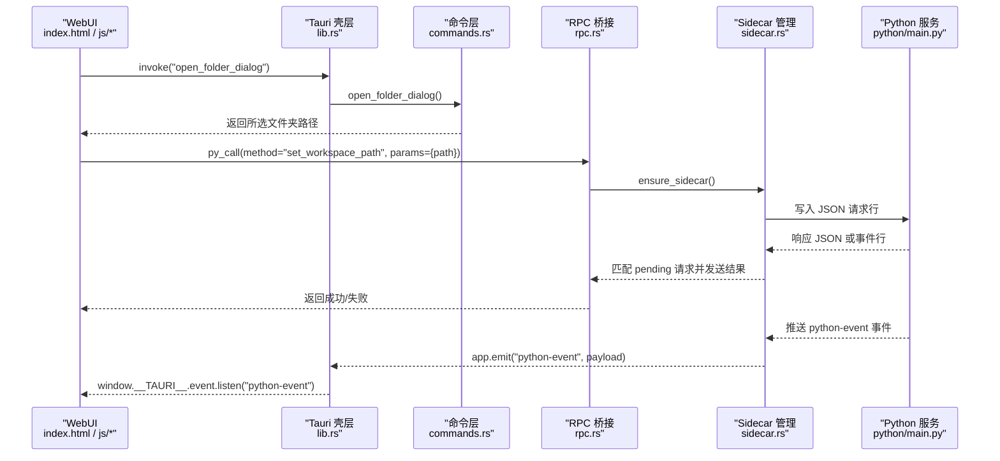
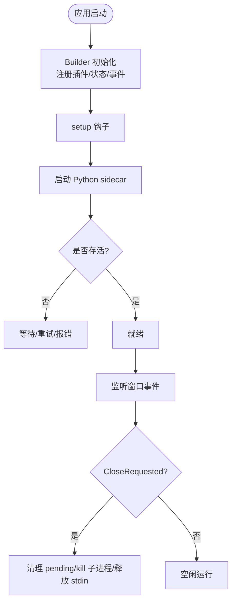
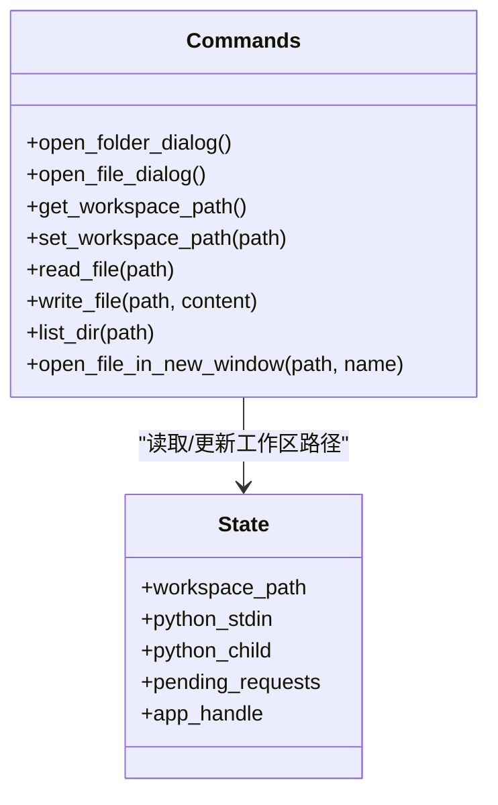
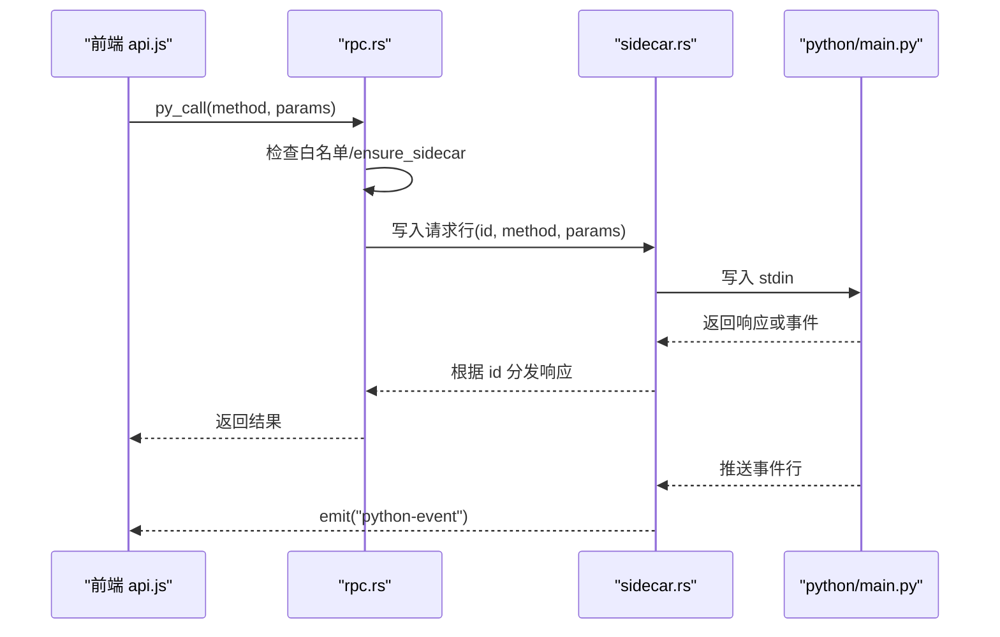
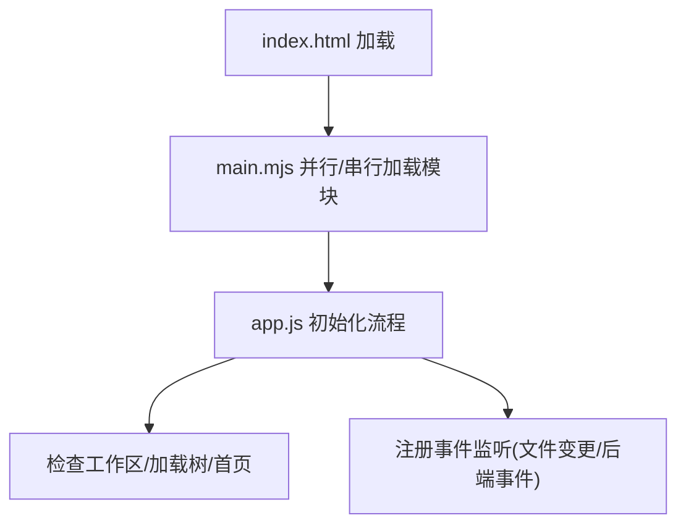
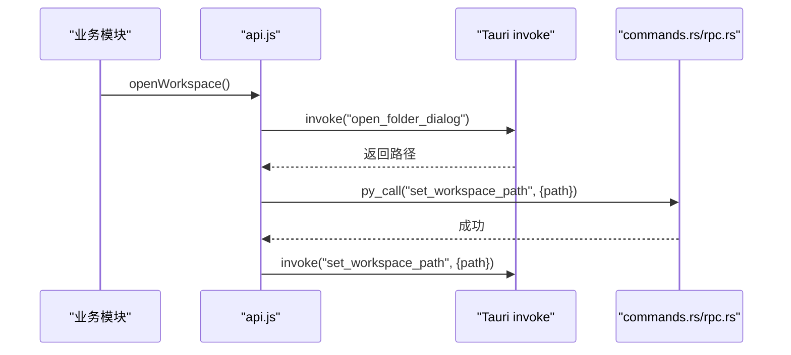
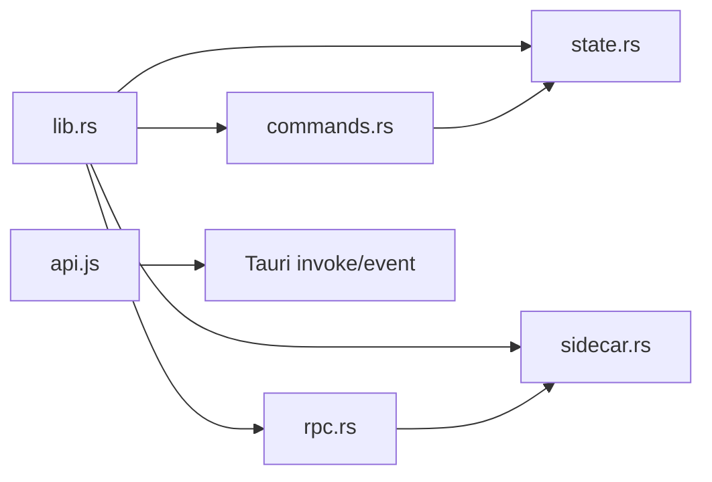

# Tauri 前端架构

<cite>
**本文引用的文件**   
- [tauri.conf.json](file://src-tauri/tauri.conf.json)
- [Cargo.toml](file://src-tauri/Cargo.toml)
- [main.rs](file://src-tauri/src/main.rs)
- [lib.rs](file://src-tauri/src/lib.rs)
- [commands.rs](file://src-tauri/src/commands.rs)
- [rpc.rs](file://src-tauri/src/rpc.rs)
- [sidecar.rs](file://src-tauri/src/sidecar.rs)
- [state.rs](file://src-tauri/src/state.rs)
- [default.json](file://src-tauri/capabilities/default.json)
- [build.rs](file://src-tauri/build.rs)
- [index.html](file://webui/index.html)
- [main.mjs](file://webui/js/main.mjs)
- [api.js](file://webui/js/api.js)
- [app.js](file://webui/js/app.js)
- [package.json](file://package.json)
</cite>

## 目录
1. [简介](#简介)
2. [项目结构](#项目结构)
3. [核心组件](#核心组件)
4. [架构总览](#架构总览)
5. [详细组件分析](#详细组件分析)
6. [依赖关系分析](#依赖关系分析)
7. [性能与优化](#性能与优化)
8. [故障排查指南](#故障排查指南)
9. [结论](#结论)
10. [附录](#附录)

## 简介
本文件面向 NoteAI 的 Tauri 前端架构，系统性阐述 Rust 壳层的设计模式（进程管理、窗口管理、系统集成）、Tauri 配置与安全策略、前后端通信机制（命令调用、事件监听、状态同步）、静态资源加载与构建流程，并给出架构图、数据流图与跨平台兼容性建议。目标是帮助开发者快速理解应用生命周期、组件职责与扩展点。

## 项目结构
NoteAI 采用“Rust 壳层 + Web UI”的分层架构：
- Rust 壳层负责：启动 Python sidecar、暴露 Tauri 命令、管理窗口与系统能力、转发 RPC 请求、处理事件。
- Web UI 负责：用户界面、交互逻辑、通过 Tauri invoke 调用后端能力，并通过事件通道接收异步进度与状态。

```mermaid
graph TB
subgraph "Web 前端"
HTML["index.html"]
MJS["js/main.mjs"]
API["js/api.js"]
APP["js/app.js"]
end
subgraph "Tauri 壳层 (Rust)"
MAIN["src/main.rs"]
LIB["src/lib.rs"]
CMD["src/commands.rs"]
RPC["src/rpc.rs"]
SIDE["src/sidecar.rs"]
STATE["src/state.rs"]
CAP["capabilities/default.json"]
CONF["tauri.conf.json"]
end
subgraph "Python Sidecar"
PYMAIN["python/main.py"]
end
HTML --> MJS --> API --> APP
APP --> |invoke('py_call')| RPC
API --> |原生命令| CMD
LIB --> RPC
LIB --> CMD
LIB --> SIDE
SIDE --> PYMAIN
LIB --> STATE
CAP -.-> LIB
CONF -.-> LIB
```

图表来源
- [lib.rs:10-82](file://src-tauri/src/lib.rs#L10-L82)
- [commands.rs:107-246](file://src-tauri/src/commands.rs#L107-L246)
- [rpc.rs:273-284](file://src-tauri/src/rpc.rs#L273-L284)
- [sidecar.rs:215-311](file://src-tauri/src/sidecar.rs#L215-L311)
- [state.rs:9-27](file://src-tauri/src/state.rs#L9-L27)
- [default.json:1-50](file://src-tauri/capabilities/default.json#L1-L50)
- [tauri.conf.json:1-47](file://src-tauri/tauri.conf.json#L1-L47)
- [index.html:1-32](file://webui/index.html#L1-L32)
- [main.mjs:1-201](file://webui/js/main.mjs#L1-L201)
- [api.js:1-492](file://webui/js/api.js#L1-L492)
- [app.js:1-376](file://webui/js/app.js#L1-L376)

章节来源
- [tauri.conf.json:1-47](file://src-tauri/tauri.conf.json#L1-L47)
- [Cargo.toml:1-27](file://src-tauri/Cargo.toml#L1-L27)
- [main.rs:1-4](file://src-tauri/src/main.rs#L1-L4)
- [lib.rs:10-82](file://src-tauri/src/lib.rs#L10-L82)
- [commands.rs:107-246](file://src-tauri/src/commands.rs#L107-L246)
- [rpc.rs:273-284](file://src-tauri/src/rpc.rs#L273-L284)
- [sidecar.rs:215-311](file://src-tauri/src/sidecar.rs#L215-L311)
- [state.rs:9-27](file://src-tauri/src/state.rs#L9-L27)
- [default.json:1-50](file://src-tauri/capabilities/default.json#L1-L50)
- [index.html:1-32](file://webui/index.html#L1-L32)
- [main.mjs:1-201](file://webui/js/main.mjs#L1-L201)
- [api.js:1-492](file://webui/js/api.js#L1-L492)
- [app.js:1-376](file://webui/js/app.js#L1-L376)
- [package.json:1-28](file://package.json#L1-L28)

## 核心组件
- 应用入口与初始化
  - main.rs 作为二进制入口，委托给库函数 run() 启动 Tauri 应用。
  - lib.rs 中完成插件注册、全局状态注入、Python sidecar 启动、命令注册、窗口事件处理。
- 命令层（commands.rs）
  - 提供文件系统访问、工作区路径管理、对话框选择、新窗口预览等能力。
  - 包含路径规范化与工作区边界校验，防止越权访问。
- RPC 桥接（rpc.rs）
  - 白名单控制可调用 Python 方法；封装重试与超时；维护 pending 请求映射；自动重启侧车。
- Sidecar 进程管理（sidecar.rs）
  - 查找 Python 解释器、解析脚本路径、设置环境变量、启动子进程、读写标准输入输出、错误与退出处理、事件转发。
- 全局状态（state.rs）
  - 保存 Python 子进程句柄、stdin、待处理请求映射、工作区路径、AppHandle 引用。
- 能力与权限（capabilities/default.json）
  - 声明主窗口与预览窗口可用的 core/window/dialog/shell 能力。
- 配置与打包（tauri.conf.json, Cargo.toml, build.rs, package.json）
  - 定义产物名、版本、前端资源目录、安全 CSP、打包资源、插件开关、开发前置脚本等。

章节来源
- [main.rs:1-4](file://src-tauri/src/main.rs#L1-L4)
- [lib.rs:10-82](file://src-tauri/src/lib.rs#L10-L82)
- [commands.rs:107-246](file://src-tauri/src/commands.rs#L107-L246)
- [rpc.rs:173-284](file://src-tauri/src/rpc.rs#L173-L284)
- [sidecar.rs:123-311](file://src-tauri/src/sidecar.rs#L123-L311)
- [state.rs:9-27](file://src-tauri/src/state.rs#L9-L27)
- [default.json:1-50](file://src-tauri/capabilities/default.json#L1-L50)
- [tauri.conf.json:1-47](file://src-tauri/tauri.conf.json#L1-L47)
- [Cargo.toml:1-27](file://src-tauri/Cargo.toml#L1-L27)
- [build.rs:1-4](file://src-tauri/build.rs#L1-L4)
- [package.json:1-28](file://package.json#L1-L28)

## 架构总览
下图展示从 Web 到 Rust 再到 Python sidecar 的完整调用链与事件回流。



图表来源
- [lib.rs:39-79](file://src-tauri/src/lib.rs#L39-L79)
- [commands.rs:107-126](file://src-tauri/src/commands.rs#L107-L126)
- [rpc.rs:273-284](file://src-tauri/src/rpc.rs#L273-L284)
- [sidecar.rs:260-301](file://src-tauri/src/sidecar.rs#L260-L301)
- [api.js:61-90](file://webui/js/api.js#L61-L90)
- [app.js:227-258](file://webui/js/app.js#L227-L258)

## 详细组件分析

### Rust 壳层：进程管理与生命周期
- 启动流程
  - main.rs 调用 noteai_lib::run()。
  - lib.rs 中 Builder 注册插件、注入 AppState、在 setup 阶段异步启动 Python sidecar，注册 invoke_handler 与 on_window_event。
- 进程管理
  - sidecar.rs 负责查找 Python 解释器、定位 main.py、设置缓存与线程相关环境变量、以管道方式连接 stdin/stdout/stderr。
  - 使用生成号 SIDECAR_GEN 与原子标志 SIDECAR_RESTARTING 协调重启并发控制。
  - 异常退出时清理句柄并广播“意外退出”事件；正常恢复后广播“已恢复”。
- 窗口生命周期
  - lib.rs 监听 CloseRequested，仅对主窗口进行清理：清空 pending 请求、终止子进程、释放 stdin。



图表来源
- [lib.rs:10-82](file://src-tauri/src/lib.rs#L10-L82)
- [sidecar.rs:81-107](file://src-tauri/src/sidecar.rs#L81-L107)
- [sidecar.rs:215-311](file://src-tauri/src/sidecar.rs#L215-L311)

章节来源
- [main.rs:1-4](file://src-tauri/src/main.rs#L1-L4)
- [lib.rs:10-82](file://src-tauri/src/lib.rs#L10-L82)
- [sidecar.rs:81-107](file://src-tauri/src/sidecar.rs#L81-L107)
- [sidecar.rs:215-311](file://src-tauri/src/sidecar.rs#L215-L311)

### Rust 壳层：窗口管理与系统集成
- 窗口创建与参数
  - tauri.conf.json 定义主窗口尺寸、最小尺寸、装饰等。
  - commands.rs 支持在新窗口中打开文件预览，动态设置标题、尺寸、macOS 覆盖式标题栏等。
- 系统集成
  - 通过 tauri-plugin-dialog 打开文件夹/文件选择框。
  - 通过 tauri-plugin-shell 启用 shell.open 能力。
  - capabilities/default.json 细粒度授权窗口操作、对话框、shell 能力。



图表来源
- [commands.rs:107-246](file://src-tauri/src/commands.rs#L107-L246)
- [state.rs:9-27](file://src-tauri/src/state.rs#L9-L27)
- [default.json:1-50](file://src-tauri/capabilities/default.json#L1-L50)
- [tauri.conf.json:11-26](file://src-tauri/tauri.conf.json#L11-L26)

章节来源
- [commands.rs:107-246](file://src-tauri/src/commands.rs#L107-L246)
- [default.json:1-50](file://src-tauri/capabilities/default.json#L1-L50)
- [tauri.conf.json:11-26](file://src-tauri/tauri.conf.json#L11-L26)

### Rust 壳层：安全策略与权限控制
- 路径安全
  - normalize_path 消除相对路径中的 “.”、“..”，避免越界。
  - validate_workspace_path 强制目标路径位于工作区内，拒绝越权访问。
- 能力白名单
  - capabilities/default.json 明确允许的能力集合，遵循最小权限原则。
- 运行时安全
  - tauri.conf.json 的 CSP 限制脚本、样式、图片、连接源，禁止 object/frame 等高风险类型。

章节来源
- [commands.rs:7-105](file://src-tauri/src/commands.rs#L7-L105)
- [default.json:1-50](file://src-tauri/capabilities/default.json#L1-L50)
- [tauri.conf.json:23-25](file://src-tauri/tauri.conf.json#L23-L25)

### Rust 壳层：RPC 桥接与 Python 通信
- 方法白名单
  - rpc.rs 维护 ALLOWED_PYTHON_METHODS，未列入的方法将被拒绝。
- 请求-响应模型
  - 为每次调用生成唯一 id，写入 pending_requests；通过 stdin 发送 JSON 行；按 id 匹配响应。
- 超时与重试
  - 不同方法设定不同超时时间；检测到 Broken pipe 或进程不可用时自动重启 sidecar 并重试一次。
- 事件通道
  - 当 Python 侧推送 event 类型消息时，直接通过 app.emit("python-event") 转发至前端。



图表来源
- [rpc.rs:173-284](file://src-tauri/src/rpc.rs#L173-L284)
- [sidecar.rs:260-301](file://src-tauri/src/sidecar.rs#L260-L301)
- [api.js:61-90](file://webui/js/api.js#L61-L90)

章节来源
- [rpc.rs:173-284](file://src-tauri/src/rpc.rs#L173-L284)
- [sidecar.rs:260-301](file://src-tauri/src/sidecar.rs#L260-L301)
- [api.js:61-90](file://webui/js/api.js#L61-L90)

### 前端 WebUI：模块加载与初始化
- 入口与模块编排
  - index.html 引入 CSS、第三方库与模块化入口 main.mjs。
  - main.mjs 顺序加载 utils、window、api、state、i18n、assistant、theme、icons、toast、settings、cloud-sync、workspace、tree、note-list、inspector、cli-agent、statusbar、sidebar、tiptap-editor、preview、selection-tools、editor、converter、downloader、integrator、topic、search、pending、tabs、workspace-rules、ingest、job-center、home、note-draft、quick-create、event-listeners、app。
- 应用初始化
  - app.js 在 DOMContentLoaded 后执行主题恢复、拖拽导入、标签页切换、工作区状态检查、树视图加载、首页统计刷新、事件监听器注册等。



图表来源
- [index.html:1-32](file://webui/index.html#L1-L32)
- [main.mjs:1-201](file://webui/js/main.mjs#L1-L201)
- [app.js:1-113](file://webui/js/app.js#L1-L113)

章节来源
- [index.html:1-32](file://webui/index.html#L1-L32)
- [main.mjs:1-201](file://webui/js/main.mjs#L1-L201)
- [app.js:1-113](file://webui/js/app.js#L1-L113)

### 前端 WebUI：与 Rust 后端的通信
- 命令调用
  - api.js 检测 Tauri 环境，获取 invoke/event API，统一封装 pyCall 调用，带重试与错误翻译。
  - 特殊命令如 open_folder_dialog、open_file_dialog、open_file_in_new_window 直接走 Tauri invoke。
- 事件监听
  - 通过 getTauriEventAPI().listen("python-event", ...) 订阅后端事件，用于导入进度、错误提示、RAG 对话等。
- 状态同步
  - 工作区路径在 Python 与 Rust 两侧保持一致：先由 Python 设置，再同步到 Rust 状态。



图表来源
- [api.js:170-194](file://webui/js/api.js#L170-L194)
- [commands.rs:128-146](file://src-tauri/src/commands.rs#L128-L146)
- [rpc.rs:273-284](file://src-tauri/src/rpc.rs#L273-L284)

章节来源
- [api.js:1-492](file://webui/js/api.js#L1-L492)
- [commands.rs:128-146](file://src-tauri/src/commands.rs#L128-L146)
- [rpc.rs:273-284](file://src-tauri/src/rpc.rs#L273-L284)

### 静态资源加载、热重载与构建流程
- 静态资源
  - tauri.conf.json 指定 frontendDist 指向 webui，打包时将 python/** 等资源一并打包。
  - index.html 通过本地脚本与 CSS 加载页面所需资源。
- 构建与开发
  - beforeDevCommand 执行 npm run build:tiptap，确保编辑器依赖预构建。
  - package.json 定义 build:tiptap 脚本，依赖 esbuild 与 tiptap 包。
  - Cargo.toml 启用 devtools 特性便于调试。
  - build.rs 调用 tauri_build::build() 生成上下文与 schema。

章节来源
- [tauri.conf.json:6-10](file://src-tauri/tauri.conf.json#L6-L10)
- [tauri.conf.json:27-40](file://src-tauri/tauri.conf.json#L27-L40)
- [package.json:10-26](file://package.json#L10-L26)
- [Cargo.toml:20-22](file://src-tauri/Cargo.toml#L20-L22)
- [build.rs:1-4](file://src-tauri/build.rs#L1-L4)

## 依赖关系分析
- 外部依赖
  - Tauri 2.x 核心与插件：dialog、shell。
  - 异步运行时：tokio（rt、sync、process、time）。
  - 序列化：serde、serde_json。
  - 工具：which（查找 Python）、uuid（生成窗口标签与请求 ID）。
- 内部耦合
  - lib.rs 聚合 commands、rpc、sidecar、state 模块。
  - rpc.rs 强依赖 sidecar.rs 的状态与进程管理能力。
  - commands.rs 依赖 state.rs 的工作区路径状态。
  - 前端 api.js 依赖 Tauri 提供的 invoke/event/window API。



图表来源
- [lib.rs:1-8](file://src-tauri/src/lib.rs#L1-L8)
- [rpc.rs:1-3](file://src-tauri/src/rpc.rs#L1-L3)
- [commands.rs:1-6](file://src-tauri/src/commands.rs#L1-L6)
- [api.js:1-30](file://webui/js/api.js#L1-L30)

章节来源
- [Cargo.toml:9-18](file://src-tauri/Cargo.toml#L9-L18)
- [lib.rs:1-8](file://src-tauri/src/lib.rs#L1-L8)
- [rpc.rs:1-3](file://src-tauri/src/rpc.rs#L1-L3)
- [commands.rs:1-6](file://src-tauri/src/commands.rs#L1-L6)
- [api.js:1-30](file://webui/js/api.js#L1-L30)

## 性能与优化
- 大文件预览分片传输
  - 前端 api.js 实现 read_preview_raw_slice 分页读取，拼接 UTF-8 文本，降低单次传输体积。
- 请求超时与重试
  - rpc.rs 针对不同方法设置合理超时；遇到 Broken pipe 自动重启 sidecar 并重试一次，提升鲁棒性。
- 进程复用与资源回收
  - sidecar.rs 复用同一 Python 进程，避免频繁启动开销；关闭主窗口时及时 kill 子进程并释放 stdin。
- 构建优化
  - 使用 esbuild 预构建 tiptap 编辑器，减少运行时编译成本。
  - 按需加载前端模块，缩短首屏时间。

[本节为通用指导，不直接分析具体文件]

## 故障排查指南
- Python 后端启动失败
  - 现象：setup 阶段 emit "sidecar_error" 事件。
  - 排查：确认 NOTEAI_PYTHON 环境变量、Resources 下 sidecar-python/bin/python3 是否存在、python/main.py 是否可达。
- 后端意外退出
  - 现象：emit "sidecar_died" 事件；下次操作将自动恢复。
  - 排查：查看 stderr 日志输出；检查 Python 依赖与 HF 缓存目录权限。
- 请求超时
  - 现象：前端抛出“请求超时”错误。
  - 排查：确认方法是否在白名单内；适当调整超时策略；检查 Python 任务是否阻塞。
- 路径越权
  - 现象：写/读/列目录时报错“Path is outside workspace”。
  - 排查：确认工作区路径设置正确；避免使用 “..” 逃逸。

章节来源
- [lib.rs:19-35](file://src-tauri/src/lib.rs#L19-L35)
- [sidecar.rs:57-79](file://src-tauri/src/sidecar.rs#L57-L79)
- [rpc.rs:232-244](file://src-tauri/src/rpc.rs#L232-L244)
- [commands.rs:78-105](file://src-tauri/src/commands.rs#L78-L105)

## 结论
NoteAI 的 Tauri 架构以 Rust 壳层为核心，结合 Python sidecar 提供强大的数据处理与 AI 能力。通过严格的权限控制、健壮的重启与重试机制、以及清晰的前后端通信协议，实现了高可用与可扩展的桌面应用体验。建议在后续迭代中继续完善错误码体系、增加遥测指标，并对大文件预览与 RAG 查询做更细粒度的性能监控。

[本节为总结性内容，不直接分析具体文件]

## 附录
- 关键配置项说明
  - tauri.conf.json
    - productName/version/identifier：应用标识与版本。
    - build.frontendDist：前端资源目录。
    - app.windows：主窗口尺寸与装饰。
    - app.security.csp：内容安全策略。
    - bundle.resources：打包资源（含 python/**）。
    - plugins.shell.open：启用 shell.open。
  - capabilities/default.json
    - windows：生效窗口范围（main、preview_*）。
    - permissions：core/window/dialog/shell 能力白名单。
  - Cargo.toml
    - features.devtools：启用开发工具。
    - dependencies：tauri、tauri-plugin-*、tokio、serde、which、uuid。
  - package.json
    - scripts.build:tiptap：构建编辑器依赖。

章节来源
- [tauri.conf.json:1-47](file://src-tauri/tauri.conf.json#L1-L47)
- [default.json:1-50](file://src-tauri/capabilities/default.json#L1-L50)
- [Cargo.toml:1-27](file://src-tauri/Cargo.toml#L1-L27)
- [package.json:1-28](file://package.json#L1-L28)