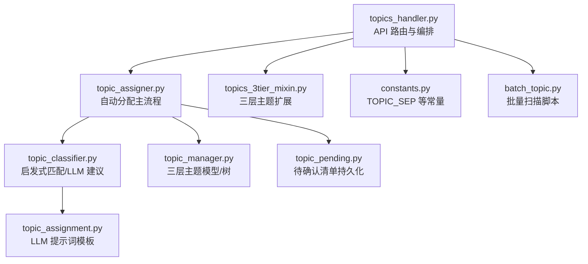
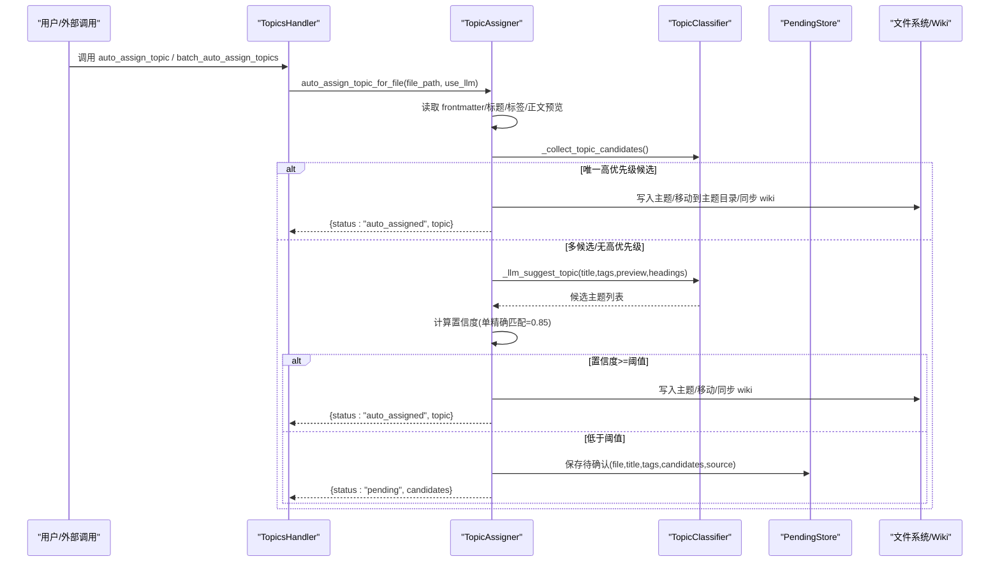
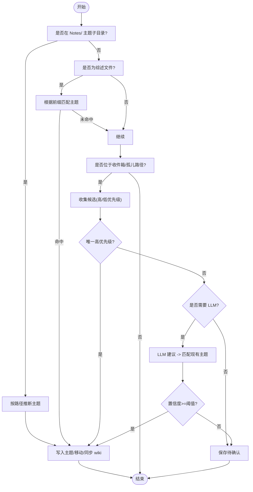
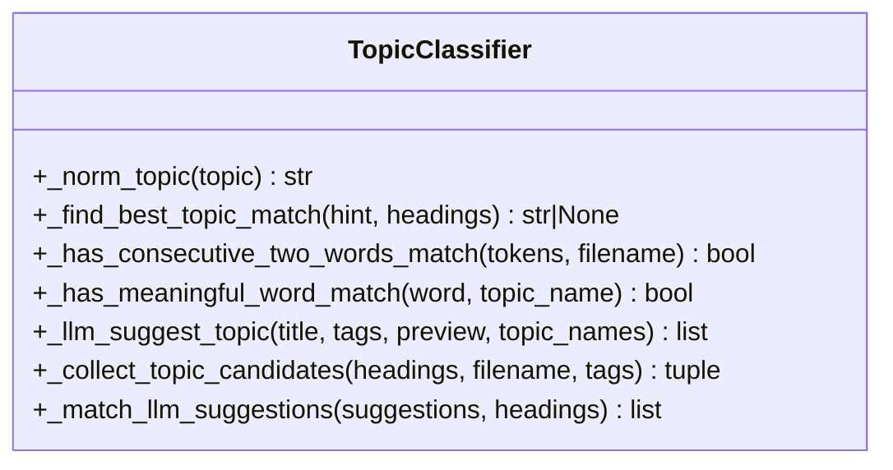
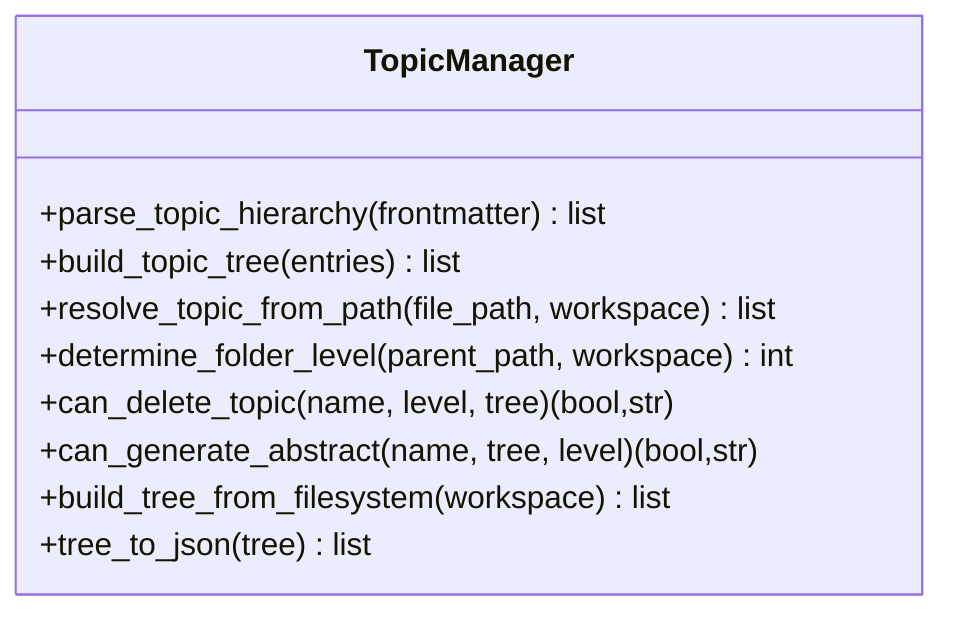
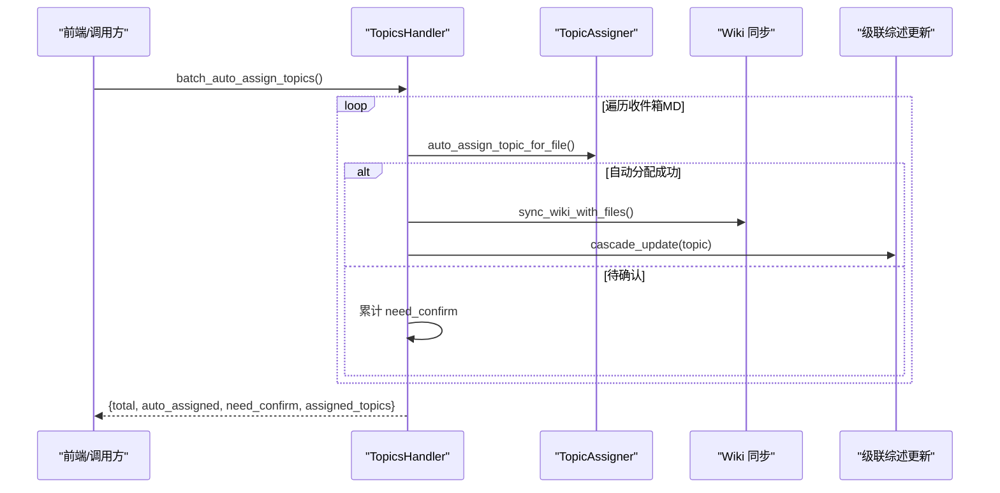
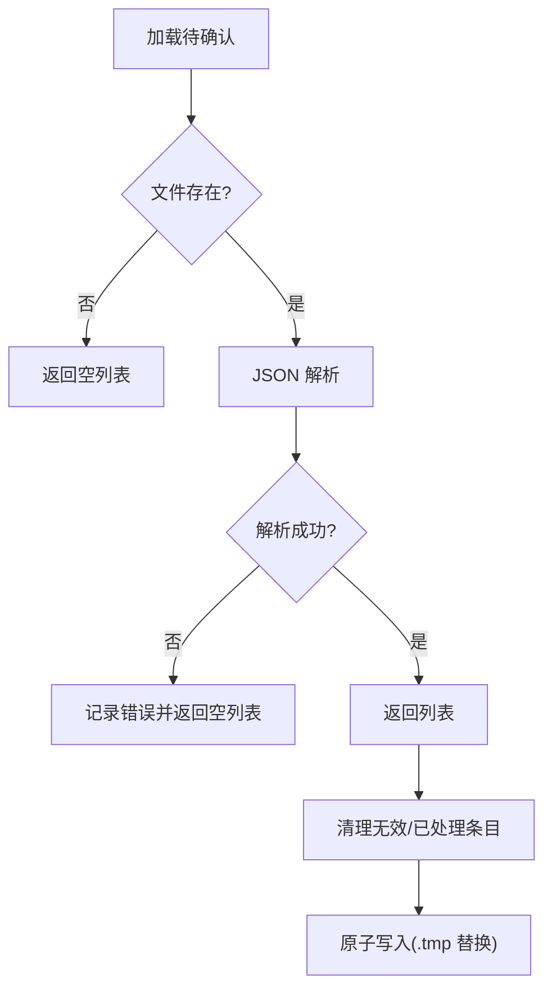
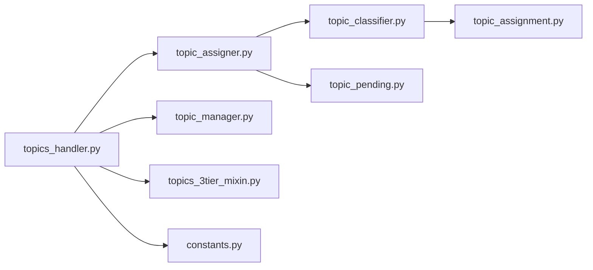

# 主题分类阶段

<cite>
**本文引用的文件**   
- [utils/topic_assigner.py](file://utils/topic_assigner.py)
- [utils/topic_classifier.py](file://utils/topic_classifier.py)
- [utils/topic_manager.py](file://utils/topic_manager.py)
- [python/sidecar/handlers/topics_handler.py](file://python/sidecar/handlers/topics_handler.py)
- [python/sidecar/mixins/topics_3tier_mixin.py](file://python/sidecar/mixins/topics_3tier_mixin.py)
- [utils/topic_pending.py](file://utils/topic_pending.py)
- [python/sidecar/pending_topics.py](file://python/sidecar/pending_topics.py)
- [config/constants.py](file://config/constants.py)
- [prompts/topic_assignment.py](file://prompts/topic_assignment.py)
- [scripts/batch_topic.py](file://scripts/batch_topic.py)
</cite>

## 目录
1. [简介](#简介)
2. [项目结构](#项目结构)
3. [核心组件](#核心组件)
4. [架构总览](#架构总览)
5. [详细组件分析](#详细组件分析)
6. [依赖关系分析](#依赖关系分析)
7. [性能与可扩展性](#性能与可扩展性)
8. [故障排查指南](#故障排查指南)
9. [结论](#结论)
10. [附录](#附录)

## 简介
本章节聚焦 NoteAI 入库流水线的“主题分类阶段”，围绕三级主题体系的自动分类算法、匹配规则与优先级、冲突解决策略、待确认主题标记机制、人工审核与批量确认流程，以及分类效果调优建议与常见问题解决方案进行系统化说明。系统采用“路径推断 + 内容语义 + LLM 辅助”的多源融合策略，在保证高准确率的同时，提供可解释的候选集与人工兜底能力。

## 项目结构
主题分类相关代码主要分布在以下模块：
- 分配与流水线入口：utils/topic_assigner.py
- 分类器与启发式匹配：utils/topic_classifier.py
- 三层主题模型与树构建：utils/topic_manager.py
- 处理器与路由（含批量/单文件操作）：python/sidecar/handlers/topics_handler.py
- 三层主题扩展（综述开关、图谱等）：python/sidecar/mixins/topics_3tier_mixin.py
- 待确认主题持久化：utils/topic_pending.py 与 python/sidecar/pending_topics.py
- 常量与分隔符：config/constants.py
- LLM 提示词模板：prompts/topic_assignment.py
- 批量处理脚本：scripts/batch_topic.py

图表来源
- [python/sidecar/handlers/topics_handler.py:1-120](file://python/sidecar/handlers/topics_handler.py#L1-L120)
- [utils/topic_assigner.py:1-120](file://utils/topic_assigner.py#L1-L120)
- [utils/topic_classifier.py:1-120](file://utils/topic_classifier.py#L1-L120)
- [utils/topic_manager.py:1-120](file://utils/topic_manager.py#L1-L120)
- [utils/topic_pending.py:1-60](file://utils/topic_pending.py#L1-L60)
- [config/constants.py:1-40](file://config/constants.py#L1-L40)
- [prompts/topic_assignment.py:1-14](file://prompts/topic_assignment.py#L1-L14)
- [scripts/batch_topic.py:1-40](file://scripts/batch_topic.py#L1-L40)

章节来源
- [python/sidecar/handlers/topics_handler.py:1-120](file://python/sidecar/handlers/topics_handler.py#L1-L120)
- [utils/topic_assigner.py:1-120](file://utils/topic_assigner.py#L1-L120)
- [utils/topic_classifier.py:1-120](file://utils/topic_classifier.py#L1-L120)
- [utils/topic_manager.py:1-120](file://utils/topic_manager.py#L1-L120)
- [utils/topic_pending.py:1-60](file://utils/topic_pending.py#L1-L60)
- [config/constants.py:1-40](file://config/constants.py#L1-L40)
- [prompts/topic_assignment.py:1-14](file://prompts/topic_assignment.py#L1-L14)
- [scripts/batch_topic.py:1-40](file://scripts/batch_topic.py#L1-L40)

## 核心组件
- 自动分配器（topic_assigner）：负责从文件路径、标题、标签、正文预览等多源信息中推断主题，必要时调用 LLM 生成候选并做置信度判定；支持“综述文件”特殊路径优先；将结果写入 frontmatter、移动文件到对应主题目录、更新 wiki 索引，并将不确定项入待确认队列。
- 分类器（topic_classifier）：实现启发式匹配（文件名/标签/标题与主题名的归一化匹配、连续双词匹配、关键词权重）、LLM 建议收集与回退匹配。
- 三层主题管理器（topic_manager）：定义三级主题数据结构、解析 frontmatter topic 层级、从文件系统构建主题树、统计文件数、判断综述开关合法性、删除保护等。
- 处理器（topics_handler）：对外暴露 API（单文件/批量自动分配、移动、创建/重命名/删除主题、合并重复主题、获取待确认列表、应用放置阈值等），串联分类器与持久化。
- 待确认清单（topic_pending）：线程安全地读写 .pending_topics.json，支持清理过期条目。
- 常量（constants）：定义主题分隔符 TOPIC_SEP 与目录常量。
- 提示词（topic_assignment）：LLM 主题建议的提示模板。
- 批量脚本（batch_topic）：遍历工作区 MD 文件，对未设置主题的条目执行自动分配。

章节来源
- [utils/topic_assigner.py:1-120](file://utils/topic_assigner.py#L1-L120)
- [utils/topic_classifier.py:1-120](file://utils/topic_classifier.py#L1-L120)
- [utils/topic_manager.py:1-120](file://utils/topic_manager.py#L1-L120)
- [python/sidecar/handlers/topics_handler.py:1-120](file://python/sidecar/handlers/topics_handler.py#L1-L120)
- [utils/topic_pending.py:1-60](file://utils/topic_pending.py#L1-L60)
- [config/constants.py:1-40](file://config/constants.py#L1-L40)
- [prompts/topic_assignment.py:1-14](file://prompts/topic_assignment.py#L1-L14)
- [scripts/batch_topic.py:1-40](file://scripts/batch_topic.py#L1-L40)

## 架构总览
下图展示了从文件进入 Notes/ 或收件箱到完成主题分配的关键交互。

图表来源
- [python/sidecar/handlers/topics_handler.py:71-149](file://python/sidecar/handlers/topics_handler.py#L71-L149)
- [utils/topic_assigner.py:267-316](file://utils/topic_assigner.py#L267-L316)
- [utils/topic_classifier.py:72-159](file://utils/topic_classifier.py#L72-L159)
- [utils/topic_pending.py:24-44](file://utils/topic_pending.py#L24-L44)

## 详细组件分析

### 自动分配主流程（topic_assigner）
- 输入：文件绝对路径、是否启用 LLM。
- 关键步骤：
  - 若文件位于 Notes/ 下且处于某主题子目录，则优先按文件夹路径推断主题并直接落盘。
  - 若为“综述”文件（文件名以“综述”结尾），尝试基于前缀在主题树中精确匹配并自动分配。
  - 若文件位于收件箱/孤儿路径，则进入启发式+LLM 分类流程。
  - 启发式阶段：收集高优先级候选（文件名包含主题连续双词）、低优先级候选（标签命中、文件名 token 命中）。
  - LLM 阶段：当存在歧义或缺少高优先级线索时，调用 LLM 生成 2-4 个候选，并与现有主题名做归一化匹配。
  - 置信度判定：仅当 LLM 返回的唯一精确匹配达到默认阈值（可通过配置调整）时，自动落盘；否则入待确认。
  - 落盘动作：写入 frontmatter topic、移动文件至 Notes/<主题>/...、更新 wiki 索引、记录活动日志、清理待确认项。
- 输出：自动分配成功（携带目标主题）、需要人工确认（携带候选集与来源）。

图表来源
- [utils/topic_assigner.py:267-316](file://utils/topic_assigner.py#L267-L316)
- [utils/topic_assigner.py:212-237](file://utils/topic_assigner.py#L212-L237)
- [utils/topic_assigner.py:142-179](file://utils/topic_assigner.py#L142-L179)
- [utils/topic_assigner.py:181-199](file://utils/topic_assigner.py#L181-L199)

章节来源
- [utils/topic_assigner.py:1-120](file://utils/topic_assigner.py#L1-L120)
- [utils/topic_assigner.py:267-316](file://utils/topic_assigner.py#L267-L316)
- [utils/topic_assigner.py:142-179](file://utils/topic_assigner.py#L142-L179)
- [utils/topic_assigner.py:181-199](file://utils/topic_assigner.py#L181-L199)

### 分类器与匹配规则（topic_classifier）
- 归一化与分词：统一分隔符、去除无关字符、分词后过滤通用词。
- 启发式匹配：
  - 精确相等匹配优先。
  - 包含匹配（双向）次之。
  - 连续双词匹配加分（主题名连续两词出现在文件名中，或反之）。
  - 标签命中提升候选优先级。
- LLM 建议：
  - 使用提示词模板，结合标题、标签、正文预览与现有主题列表，生成 2-4 个候选。
  - 将 LLM 输出与现有主题名做归一化匹配，保留精确命中；同时允许短名称作为新候选补充。
- 置信度：
  - 当前实现将“唯一精确匹配”视为 0.85 置信度，与配置的自动分配阈值比较决定是否自动落盘。

图表来源
- [utils/topic_classifier.py:1-159](file://utils/topic_classifier.py#L1-L159)
- [prompts/topic_assignment.py:1-14](file://prompts/topic_assignment.py#L1-L14)

章节来源
- [utils/topic_classifier.py:1-159](file://utils/topic_classifier.py#L1-L159)
- [prompts/topic_assignment.py:1-14](file://prompts/topic_assignment.py#L1-L14)

### 三层主题体系（topic_manager）
- 数据模型：一级（领域）、二级（方向）、三级（子题），最多三层。
- 解析与构建：
  - 从 frontmatter 的 YAML 列表解析层级关系。
  - 从文件系统 Notes/ 目录扫描构建主题树，统计每层文件数量。
- 路径→主题映射：根据相对路径提取 1-3 级主题。
- 综述控制：一级与二级互斥，三级不支持综述；提供合法性检查。
- 删除保护：一级需先删完二级才可删除；二级删除会级联其下三级。

图表来源
- [utils/topic_manager.py:1-120](file://utils/topic_manager.py#L1-L120)
- [utils/topic_manager.py:377-426](file://utils/topic_manager.py#L377-L426)
- [utils/topic_manager.py:250-345](file://utils/topic_manager.py#L250-L345)

章节来源
- [utils/topic_manager.py:1-120](file://utils/topic_manager.py#L1-L120)
- [utils/topic_manager.py:377-426](file://utils/topic_manager.py#L377-L426)
- [utils/topic_manager.py:250-345](file://utils/topic_manager.py#L250-L345)

### 处理器与 API（topics_handler）
- 单文件自动分配：auto_assign_topic → 调用分配器，成功后触发 wiki 同步与级联综述更新。
- 批量自动分配：遍历收件箱/孤儿路径下的 MD 文件，逐个调用分配器，汇总统计并异步更新综述。
- 移动/创建/重命名/删除主题：封装写 frontmatter、移动文件、合并目录、同步 wiki 等操作。
- 待确认管理：获取所有待确认项（含主题选项下拉）、人工确认 resolve_topic（写入主题、移动文件、清理待确认、触发级联更新）。
- 其他：获取主题树、文件主题、主题文件列表、合并重复主题、修复综述主题等。

图表来源
- [python/sidecar/handlers/topics_handler.py:96-149](file://python/sidecar/handlers/topics_handler.py#L96-L149)
- [python/sidecar/handlers/topics_handler.py:463-500](file://python/sidecar/handlers/topics_handler.py#L463-L500)

章节来源
- [python/sidecar/handlers/topics_handler.py:71-149](file://python/sidecar/handlers/topics_handler.py#L71-L149)
- [python/sidecar/handlers/topics_handler.py:463-500](file://python/sidecar/handlers/topics_handler.py#L463-L500)

### 待确认主题与人工审核（topic_pending）
- 存储：工作区根目录 .pending_topics.json，线程锁保证并发安全，原子写入（tmp 替换）。
- 结构：每条记录包含 file、title、tags、candidates、source 等字段。
- 清理：定期清理无效/已处理/非收件箱的待确认项。
- 兼容层：python/sidecar/pending_topics.py 提供向后兼容接口。

图表来源
- [utils/topic_pending.py:24-44](file://utils/topic_pending.py#L24-L44)
- [utils/topic_pending.py:53-99](file://utils/topic_pending.py#L53-L99)
- [python/sidecar/pending_topics.py:1-22](file://python/sidecar/pending_topics.py#L1-L22)

章节来源
- [utils/topic_pending.py:1-99](file://utils/topic_pending.py#L1-L99)
- [python/sidecar/pending_topics.py:1-22](file://python/sidecar/pending_topics.py#L1-L22)

### 常量与分隔符（constants）
- TOPIC_SEP：主题路径分隔符（如 “ > ”），用于拼接/拆分多级主题。
- 目录常量：Notes、wiki、Raw、Used 等。

章节来源
- [config/constants.py:1-40](file://config/constants.py#L1-L40)

### 批量处理脚本（batch_topic）
- 功能：遍历工作区所有 MD 文件，跳过已有主题的文件，对缺失主题的文件调用自动分配器，最后输出统计与待确认数量。
- 适用场景：历史数据清洗、大规模入库后的集中处理。

章节来源
- [scripts/batch_topic.py:1-86](file://scripts/batch_topic.py#L1-L86)

## 依赖关系分析
- 组件耦合：
  - topics_handler 依赖 topic_assigner 与 topic_manager，并通过 topics_3tier_mixin 扩展三层主题能力。
  - topic_assigner 依赖 topic_classifier 与 topic_pending，间接依赖 wiki 同步工具。
  - topic_classifier 依赖文本工具与 LLM 提示词模板。
- 外部依赖：
  - LLM 服务（通过 utils.llm_utils 调用，受 API 配置影响）。
  - 文件系统（Notes/wiki 目录结构）。
- 潜在循环：
  - 当前未见直接循环导入；但注意在运行时动态 import 的使用位置（如 LLM 调用、workspace_rules 等）。

图表来源
- [python/sidecar/handlers/topics_handler.py:1-120](file://python/sidecar/handlers/topics_handler.py#L1-L120)
- [utils/topic_assigner.py:1-120](file://utils/topic_assigner.py#L1-L120)
- [utils/topic_classifier.py:1-120](file://utils/topic_classifier.py#L1-L120)
- [utils/topic_manager.py:1-120](file://utils/topic_manager.py#L1-L120)
- [python/sidecar/mixins/topics_3tier_mixin.py:1-60](file://python/sidecar/mixins/topics_3tier_mixin.py#L1-L60)
- [config/constants.py:1-40](file://config/constants.py#L1-L40)
- [prompts/topic_assignment.py:1-14](file://prompts/topic_assignment.py#L1-L14)

章节来源
- [python/sidecar/handlers/topics_handler.py:1-120](file://python/sidecar/handlers/topics_handler.py#L1-L120)
- [utils/topic_assigner.py:1-120](file://utils/topic_assigner.py#L1-L120)
- [utils/topic_classifier.py:1-120](file://utils/topic_classifier.py#L1-L120)
- [utils/topic_manager.py:1-120](file://utils/topic_manager.py#L1-L120)
- [python/sidecar/mixins/topics_3tier_mixin.py:1-60](file://python/sidecar/mixins/topics_3tier_mixin.py#L1-L60)
- [config/constants.py:1-40](file://config/constants.py#L1-L40)
- [prompts/topic_assignment.py:1-14](file://prompts/topic_assignment.py#L1-L14)

## 性能与可扩展性
- 启发式匹配复杂度：
  - 候选收集与评分主要基于分词与字符串匹配，时间复杂度近似 O(N·K)，N 为主题数，K 为平均分词长度。
- LLM 调用开销：
  - 仅在启发式无法给出唯一高优先级候选或候选过多时触发，降低整体成本。
- 批处理优化：
  - 批量分配接口内部对进度进行反馈，并在完成后批量触发 wiki 同步与级联更新，减少频繁 IO。
- 可扩展点：
  - 分类器可接入更丰富的语义特征（如嵌入相似度）以提升召回率。
  - 阈值与提示词可配置化，便于不同工作区的差异化调优。

[本节为通用指导，不直接分析具体文件]

## 故障排查指南
- 自动分配失败但未报错：
  - 检查文件是否位于收件箱/孤儿路径；若非，可能不会触发分配逻辑。
  - 查看活动日志与 pending 清单，确认是否被标记为待确认。
- LLM 不可用导致无法自动分配：
  - 确认 API 配置有效；若不可用，系统将回退到启发式匹配与待确认流程。
- 主题路径不一致：
  - 确认 TOPIC_SEP 一致性与前后端传递的主题格式；必要时使用“合并重复主题”与“修复综述主题”工具。
- 待确认清单异常：
  - 检查 .pending_topics.json 是否存在损坏；可使用清理函数移除无效条目。

章节来源
- [python/sidecar/handlers/topics_handler.py:463-500](file://python/sidecar/handlers/topics_handler.py#L463-L500)
- [utils/topic_pending.py:53-99](file://utils/topic_pending.py#L53-L99)
- [config/constants.py:1-40](file://config/constants.py#L1-L40)

## 结论
NoteAI 的主题分类阶段通过“路径推断 + 启发式匹配 + LLM 建议”的组合策略，实现了高准确率与强鲁棒性的自动分类。系统在不确定性场景下提供清晰的候选集与人工审核通道，配合批量处理与级联综述更新，形成完整的入库闭环。通过可调阈值与提示词定制，可在不同工作区实现个性化优化。

[本节为总结，不直接分析具体文件]

## 附录

### 分类准确率评估建议
- 指标设计：
  - 自动分配命中率（自动分配成功数/总处理数）。
  - 待确认率（待确认数/总处理数）。
  - 人工修正率（人工确认后与系统建议不一致的比例）。
- 采样方法：
  - 分层抽样（按主题层级、按来源类型）。
  - 时间窗口对比（版本迭代前后对比）。
- 基线与对照：
  - 关闭 LLM 的纯启发式 vs 开启 LLM 的建议。
  - 不同阈值配置的效果对比。

[本节为通用指导，不直接分析具体文件]

### 自定义分类规则与迁移工具
- 自定义规则：
  - 调整自动分配阈值（topic_auto_assign_threshold）以平衡自动化程度与准确性。
  - 修改提示词模板（topic_assignment.py）以适配特定领域术语。
- 迁移工具：
  - 批量脚本（batch_topic.py）可用于历史数据一次性处理。
  - 合并重复主题与修复综述主题接口用于知识库治理。

章节来源
- [scripts/batch_topic.py:1-86](file://scripts/batch_topic.py#L1-L86)
- [python/sidecar/handlers/topics_handler.py:541-544](file://python/sidecar/handlers/topics_handler.py#L541-L544)
- [prompts/topic_assignment.py:1-14](file://prompts/topic_assignment.py#L1-L14)

### 常见分类问题与解决方案
- 问题：同一内容被分配到不同主题
  - 方案：使用“合并重复主题”工具，统一主题命名规范。
- 问题：大量文件未被自动分配
  - 方案：提高阈值敏感度或优化提示词；检查文件是否位于收件箱/孤儿路径。
- 问题：综述状态异常
  - 方案：使用“修复综述主题”与“切换综述开关”接口，确保一级/二级互斥约束。

章节来源
- [python/sidecar/handlers/topics_handler.py:541-544](file://python/sidecar/handlers/topics_handler.py#L541-L544)
- [python/sidecar/handlers/topics_handler.py:569-587](file://python/sidecar/handlers/topics_handler.py#L569-L587)