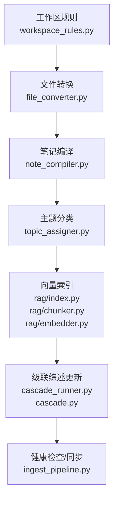
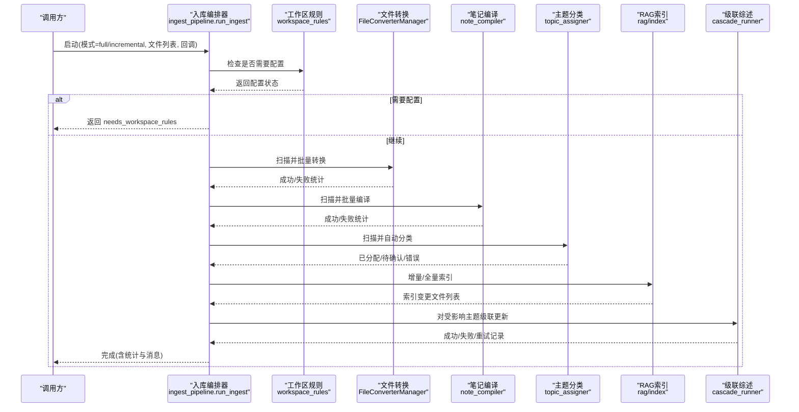
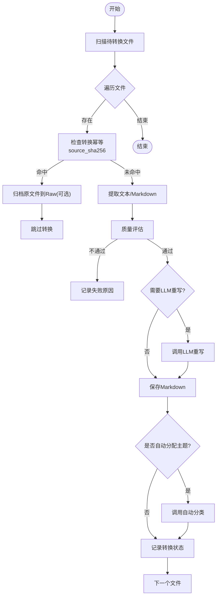
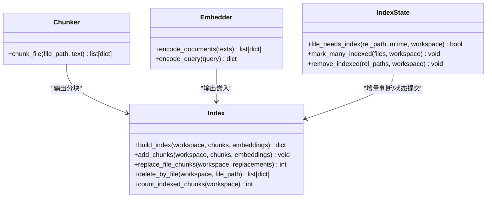
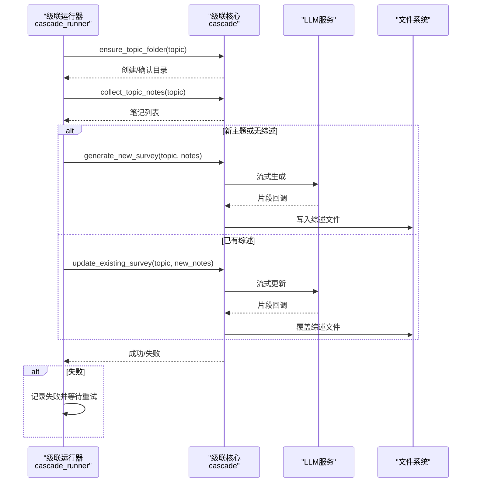
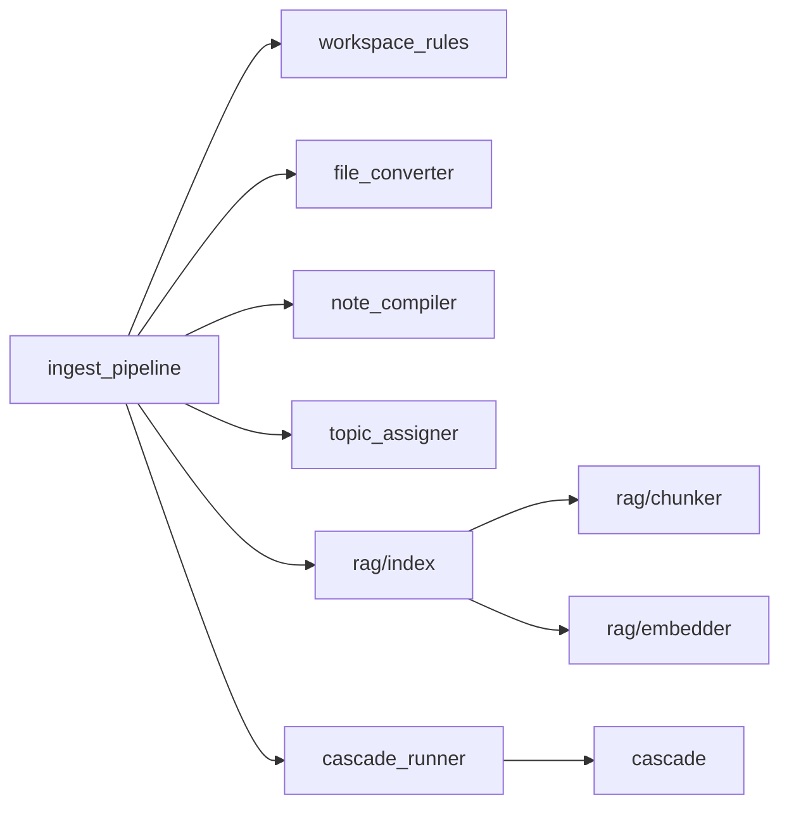

# 入库流水线

<cite>
**本文引用的文件**   
- [ingest_pipeline.py](file://python/sidecar/ingest_pipeline.py)
- [cascade_runner.py](file://python/sidecar/cascade_runner.py)
- [cascade.py](file://python/sidecar/cascade.py)
- [workspace_rules.py](file://python/sidecar/workspace_rules.py)
- [job_status.py](file://python/sidecar/job_status.py)
- [conversion_state.py](file://python/sidecar/conversion_state.py)
- [compile_state.py](file://python/sidecar/compile_state.py)
- [index.py](file://python/sidecar/rag/index.py)
- [index_state.py](file://python/sidecar/rag/index_state.py)
- [chunker.py](file://python/sidecar/rag/chunker.py)
- [embedder.py](file://python/sidecar/rag/embedder.py)
- [file_converter.py](file://modules/file_converter.py)
- [note_compiler.py](file://utils/note_compiler.py)
- [topic_assigner.py](file://utils/topic_assigner.py)
- [settings.py](file://config/settings.py)
</cite>

## 目录
1. [简介](#简介)
2. [项目结构](#项目结构)
3. [核心组件](#核心组件)
4. [架构总览](#架构总览)
5. [详细组件分析](#详细组件分析)
6. [依赖关系分析](#依赖关系分析)
7. [性能考量](#性能考量)
8. [故障排查指南](#故障排查指南)
9. [结论](#结论)
10. [附录：配置与使用示例](#附录配置与使用示例)

## 简介
本技术文档面向 NoteAI 的“入库流水线”，系统化阐述从文件监控、格式转换、内容编译、主题分类、向量索引到级联更新的全链路自动化处理流程。文档覆盖每个阶段的执行逻辑、依赖关系、错误处理机制，并解释增量与全量处理的差异、状态持久化与断点续跑的实现原理。同时提供管道图、状态转换图与错误恢复策略，以及配置选项与扩展方式，帮助读者快速理解与二次开发。

## 项目结构
入库流水线由编排器（ingest_pipeline）统一调度，串联以下关键模块：
- 工作区规则与前置检查
- 文件转换（多格式转 Markdown）
- 笔记编译（规则清理 + LLM 重写）
- 主题分类（自动分配或待确认）
- 向量索引（分块、嵌入、BM25 与元数据索引）
- 交叉引用与级联综述更新
- 健康检查与同步

图表来源
- [ingest_pipeline.py:1-120](file://python/sidecar/ingest_pipeline.py#L1-L120)
- [workspace_rules.py:1-120](file://python/sidecar/workspace_rules.py#L1-L120)
- [file_converter.py:408-770](file://modules/file_converter.py#L408-L770)
- [note_compiler.py:1-120](file://utils/note_compiler.py#L1-L120)
- [topic_assigner.py:318-328](file://utils/topic_assigner.py#L318-L328)
- [index.py:502-582](file://python/sidecar/rag/index.py#L502-L582)
- [chunker.py:11-43](file://python/sidecar/rag/chunker.py#L11-L43)
- [embedder.py:334-384](file://python/sidecar/rag/embedder.py#L334-L384)
- [cascade_runner.py:74-154](file://python/sidecar/cascade_runner.py#L74-L154)
- [cascade.py:312-386](file://python/sidecar/cascade.py#L312-L386)

章节来源
- [ingest_pipeline.py:1-120](file://python/sidecar/ingest_pipeline.py#L1-L120)
- [settings.py:1-41](file://config/settings.py#L1-L41)

## 核心组件
- 流水线编排器：负责阶段推进、进度上报、取消控制、状态持久化与断点续跑。
- 文件转换器：支持 PDF/DOCX/PPT/HTML/TXT 等格式转换为 Markdown，含质量评估与可选 LLM 重写。
- 笔记编译器：基于规则的清洗与可选 LLM 重写，提升可读性与结构化程度。
- 主题分类器：依据文件夹路径、标题、标签与 LLM 建议进行自动分配或进入待确认队列。
- RAG 索引器：分块、向量化、BM25 与元数据倒排索引，支持增量替换与完整性修复。
- 级联综述生成器：按主题收集笔记，生成或更新综述，具备重试与失败持久化。
- 工作区规则：定义最大层级、是否自动生成综述、可编辑范围等策略。
- 任务状态注册表：内存中维护后台任务状态，便于前端展示与查询。

章节来源
- [ingest_pipeline.py:480-800](file://python/sidecar/ingest_pipeline.py#L480-L800)
- [file_converter.py:408-770](file://modules/file_converter.py#L408-L770)
- [note_compiler.py:128-238](file://utils/note_compiler.py#L128-L238)
- [topic_assigner.py:318-328](file://utils/topic_assigner.py#L318-L328)
- [index.py:502-582](file://python/sidecar/rag/index.py#L502-L582)
- [cascade_runner.py:74-154](file://python/sidecar/cascade_runner.py#L74-L154)
- [workspace_rules.py:15-92](file://python/sidecar/workspace_rules.py#L15-L92)
- [job_status.py:35-118](file://python/sidecar/job_status.py#L35-L118)

## 架构总览
下图展示了入库流水线的端到端调用序列，包括阶段推进、状态持久化、取消信号传播与事件上报。

图表来源
- [ingest_pipeline.py:480-800](file://python/sidecar/ingest_pipeline.py#L480-L800)
- [workspace_rules.py:95-97](file://python/sidecar/workspace_rules.py#L95-L97)
- [file_converter.py:732-770](file://modules/file_converter.py#L732-L770)
- [note_compiler.py:213-238](file://utils/note_compiler.py#L213-L238)
- [topic_assigner.py:318-328](file://utils/topic_assigner.py#L318-L328)
- [index.py:646-702](file://python/sidecar/rag/index.py#L646-L702)
- [cascade_runner.py:156-185](file://python/sidecar/cascade_runner.py#L156-L185)

## 详细组件分析

### 阶段一：工作区规则与前置校验
- 目标：确保工作区规则已配置，否则中止流水线并提示用户完成设置。
- 关键点：
  - 读取 workspace_rules.json，若未配置则标记 needs_workspace_rules。
  - 默认策略包含最大层级、是否自动生成综述、可编辑范围等。
- 错误处理：
  - 规则缺失或非法时返回明确错误信息，阻止后续阶段执行。

章节来源
- [workspace_rules.py:15-92](file://python/sidecar/workspace_rules.py#L15-L92)
- [workspace_rules.py:95-97](file://python/sidecar/workspace_rules.py#L95-L97)
- [ingest_pipeline.py:598-617](file://python/sidecar/ingest_pipeline.py#L598-L617)

### 阶段二：文件转换（convert）
- 目标：将非 Markdown 源文件转换为 Markdown，写入 Notes 目录，必要时归档原始文件至 Raw。
- 关键点：
  - 支持 PDF/DOCX/PPT/HTML/TXT 等格式；通过 FileConverterManager 路由到具体转换器。
  - 质量评估：检测正文长度、乱码比例、疑似扫描 PDF 等，不达标直接拒绝。
  - 可选 LLM 重写：当内容结构较差且长度可控时触发。
  - 去重与幂等：基于 source_sha256 与 conversion_state.json 避免重复转换。
- 错误处理：
  - 单个文件失败不影响其他文件；批量结果记录到 convert_failures。
  - 原文件归档失败会返回部分成功结果并记录警告。

图表来源
- [file_converter.py:569-731](file://modules/file_converter.py#L569-L731)
- [file_converter.py:732-770](file://modules/file_converter.py#L732-L770)
- [conversion_state.py:65-109](file://python/sidecar/conversion_state.py#L65-L109)

章节来源
- [file_converter.py:408-770](file://modules/file_converter.py#L408-L770)
- [conversion_state.py:1-109](file://python/sidecar/conversion_state.py#L1-L109)
- [ingest_pipeline.py:627-656](file://python/sidecar/ingest_pipeline.py#L627-L656)

### 阶段三：笔记编译（compile）
- 目标：对由外部源生成的 Markdown 进行规则清理与可选 LLM 重写，提升可读性与一致性。
- 关键点：
  - 仅针对带有 source 字段且为受支持外部格式的文件。
  - 规则清理：去除页眉页脚、重复行、分隔线等噪声。
  - LLM 重写：在长度限制内尝试整篇重写，保留 frontmatter。
  - 增量判断：基于 compile_state.json 的 mtime 比较，避免重复处理。
- 错误处理：
  - 正文过短或异常时跳过并记录日志。

章节来源
- [note_compiler.py:1-120](file://utils/note_compiler.py#L1-L120)
- [note_compiler.py:128-238](file://utils/note_compiler.py#L128-L238)
- [compile_state.py:1-55](file://python/sidecar/compile_state.py#L1-L55)
- [ingest_pipeline.py:658-688](file://python/sidecar/ingest_pipeline.py#L658-L688)

### 阶段四：主题分类（classify）
- 目标：为无主题或主题不明确的笔记自动分配主题，或将不确定项放入待确认队列。
- 关键点：
  - 优先从 Notes/ 子目录推断主题；其次基于标题、标签与 LLM 建议匹配。
  - 支持“综述”文件名特殊处理，映射到对应主题。
  - 自动移动文件到正确主题目录，并更新 Wiki 关联。
- 错误处理：
  - 分类失败记录错误；待确认项进入 pending 列表供人工处理。

章节来源
- [topic_assigner.py:318-328](file://utils/topic_assigner.py#L318-L328)
- [topic_assigner.py:267-316](file://utils/topic_assigner.py#L267-L316)
- [ingest_pipeline.py:690-733](file://python/sidecar/ingest_pipeline.py#L690-L733)

### 阶段五：向量索引（index）
- 目标：将 Markdown 分块、嵌入、构建 BM25 与元数据倒排索引，支持增量更新与完整性修复。
- 关键点：
  - 分块：按 H2/H3 标题分段，段落切分，表格/代码块保护，重叠窗口。
  - 嵌入：本地模型 BGE-small-zh-v1.5，缓存于系统目录，支持下载回调。
  - 索引：zvec 稠密向量 + BM25s 稀疏检索 + metadata 倒排（topic/tags/files）。
  - 增量：基于 rag_index_state.json 的 mtime 判断是否需要重新索引。
  - 完整性：对比 manifest 与实际 chunk 数量，不一致时触发全量修复。
  - 原子性：replace_file_chunks 先 upsert 新文档再删除旧 ID，最后提交 manifest。
- 错误处理：
  - 并发写锁：index_operation 保证同一工作区串行写入。
  - 集合锁冲突：打开 zvec 集合失败时给出友好提示，建议关闭其他实例。

图表来源
- [chunker.py:11-43](file://python/sidecar/rag/chunker.py#L11-L43)
- [embedder.py:334-384](file://python/sidecar/rag/embedder.py#L334-L384)
- [index.py:502-582](file://python/sidecar/rag/index.py#L502-L582)
- [index.py:646-702](file://python/sidecar/rag/index.py#L646-L702)
- [index.py:704-774](file://python/sidecar/rag/index.py#L704-L774)
- [index_state.py:75-102](file://python/sidecar/rag/index_state.py#L75-L102)

章节来源
- [index.py:502-582](file://python/sidecar/rag/index.py#L502-L582)
- [index.py:646-702](file://python/sidecar/rag/index.py#L646-L702)
- [index.py:704-774](file://python/sidecar/rag/index.py#L704-L774)
- [index_state.py:1-102](file://python/sidecar/rag/index_state.py#L1-L102)
- [chunker.py:11-163](file://python/sidecar/rag/chunker.py#L11-L163)
- [embedder.py:140-165](file://python/sidecar/rag/embedder.py#L140-L165)
- [embedder.py:334-384](file://python/sidecar/rag/embedder.py#L334-L384)
- [ingest_pipeline.py:747-788](file://python/sidecar/ingest_pipeline.py#L747-L788)

### 阶段六：交叉引用与级联综述更新（crossref & cascade）
- 目标：对索引变更涉及的主题，自动收集笔记并生成或更新综述；失败可重试并持久化。
- 关键点：
  - 收集主题下所有笔记（按 topic/frontmatter 与目录层级匹配）。
  - 新主题或无综述时生成；已有综述则增量更新。
  - 压缩长笔记以控制上下文长度（SnowNLP/jieba 回退）。
  - 重试策略：最多 3 次，间隔固定秒数；失败写入 cascade_failures.json。
- 错误处理：
  - 无法访问工作区或主题非法时返回错误；无笔记时跳过并记录日志。

图表来源
- [cascade_runner.py:74-154](file://python/sidecar/cascade_runner.py#L74-L154)
- [cascade.py:312-386](file://python/sidecar/cascade.py#L312-L386)
- [cascade.py:118-178](file://python/sidecar/cascade.py#L118-L178)
- [cascade.py:232-265](file://python/sidecar/cascade.py#L232-L265)

章节来源
- [cascade_runner.py:74-154](file://python/sidecar/cascade_runner.py#L74-L154)
- [cascade_runner.py:156-185](file://python/sidecar/cascade_runner.py#L156-L185)
- [cascade.py:312-386](file://python/sidecar/cascade.py#L312-L386)
- [cascade.py:118-178](file://python/sidecar/cascade.py#L118-L178)
- [cascade.py:232-265](file://python/sidecar/cascade.py#L232-L265)

### 阶段七：健康检查与同步（lint & sync）
- 目标：清理无效索引条目、校验工作区一致性、触发必要同步。
- 关键点：
  - 删除已不存在文件的索引与状态。
  - 根据规则决定是否触发 wiki 同步。
- 错误处理：
  - 操作失败记录警告，不影响主流程。

章节来源
- [ingest_pipeline.py:464-478](file://python/sidecar/ingest_pipeline.py#L464-L478)

## 依赖关系分析
- 编排器依赖：
  - 工作区规则：决定是否需要配置、是否允许 AI 编辑 wiki/notes、综述生成级别。
  - 转换器：根据扩展名选择具体实现，支持懒加载与批量处理。
  - 编译器：依赖 compile_state 做增量判断。
  - 分类器：依赖主题结构与 LLM 建议。
  - 索引器：依赖 chunker 与 embedder，管理并发与原子提交。
  - 级联器：依赖 cascade 核心与 LLM 流式接口。
- 外部依赖：
  - zvec/bm25s：稠密与稀疏检索。
  - fastembed/BGE-small-zh-v1.5：中文嵌入模型。
  - LLM API：用于重写与综述生成。

图表来源
- [ingest_pipeline.py:1-120](file://python/sidecar/ingest_pipeline.py#L1-L120)
- [workspace_rules.py:1-120](file://python/sidecar/workspace_rules.py#L1-L120)
- [file_converter.py:408-770](file://modules/file_converter.py#L408-L770)
- [note_compiler.py:1-120](file://utils/note_compiler.py#L1-L120)
- [topic_assigner.py:318-328](file://utils/topic_assigner.py#L318-L328)
- [index.py:502-582](file://python/sidecar/rag/index.py#L502-L582)
- [chunker.py:11-43](file://python/sidecar/rag/chunker.py#L11-L43)
- [embedder.py:334-384](file://python/sidecar/rag/embedder.py#L334-L384)
- [cascade_runner.py:74-154](file://python/sidecar/cascade_runner.py#L74-L154)
- [cascade.py:312-386](file://python/sidecar/cascade.py#L312-L386)

章节来源
- [ingest_pipeline.py:1-120](file://python/sidecar/ingest_pipeline.py#L1-L120)
- [index.py:502-582](file://python/sidecar/rag/index.py#L502-L582)

## 性能考量
- 增量优化：
  - 指纹比对：通过 mtime+size 快速判断工作区变化，避免全量扫描。
  - 编译/索引增量：基于 compile_state 与 rag_index_state 的 mtime 阈值判断。
- 并发与锁：
  - 索引写入串行化：index_operation 与工作区锁避免并发写冲突。
  - 集合句柄缓存：减少 zvec.open 开销。
- 批处理：
  - 转换/编译/索引均支持批量处理与进度回调，降低 IO 与模型调用次数。
- 资源管理：
  - 嵌入模型缓存与 ONNX 线程数自适应，避免频繁下载与初始化。
  - BM25 检索器缓存，避免每次查询重建。

[本节为通用指导，无需源码引用]

## 故障排查指南
- 常见错误与恢复：
  - 工作区未配置：需先完成整理规则设置。
  - 索引被占用：提示关闭其他 NoteAI 实例后重试。
  - 转换质量不达标：检查源文件格式与内容，必要时手动修正。
  - 分类失败：查看待确认列表，人工选择主题。
  - 级联失败：查看 cascade_failures.json，手动重试。
- 诊断工具：
  - 任务状态：通过 job_status 查询后台任务进度与错误。
  - 状态文件：ingest_state.json、conversion_state.json、compile_state.json、rag_index_state.json、cascade_failures.json。
  - 日志：各模块 logger 输出，重点关注 warning/error 级别。

章节来源
- [job_status.py:35-118](file://python/sidecar/job_status.py#L35-L118)
- [ingest_pipeline.py:107-177](file://python/sidecar/ingest_pipeline.py#L107-L177)
- [cascade_runner.py:28-72](file://python/sidecar/cascade_runner.py#L28-L72)

## 结论
NoteAI 的入库流水线以编排器为核心，串联转换、编译、分类、索引与级联更新等阶段，形成高可靠、可扩展的自动化处理链。通过指纹与 mtime 驱动的增量策略、原子提交与并发锁、失败重试与持久化，系统在大规模知识库场景下具备良好的稳定性与性能表现。

[本节为总结，无需源码引用]

## 附录：配置与使用示例

### 配置选项
- 工作区规则（workspace_rules.json）
  - max_topic_depth：最大主题层级（1-3）
  - auto_update_survey：是否自动生成综述
  - survey_at_level：综述所在层级（1-2）
  - ai_may_edit_wiki / ai_may_edit_notes：是否允许 AI 编辑 wiki/notes
  - configured：是否已完成配置
- 应用设置（settings.py 导出常量）
  - NOTES_FOLDER / ABSTRACT_FOLDER / RAW_FOLDER / WORKSPACE_APP_FOLDER / RAG_INDEX_FOLDER 等目录常量

章节来源
- [workspace_rules.py:15-92](file://python/sidecar/workspace_rules.py#L15-L92)
- [settings.py:1-41](file://config/settings.py#L1-L41)

### 使用示例
- 启动流水线（全量/增量/指定文件）
  - 全量：run_ingest(mode="full")
  - 增量：run_ingest(mode="incremental")
  - 指定文件：run_ingest(mode="incremental", file_paths=[...])
- 断点续跑
  - 上次中断状态会被识别为 interrupted，下次自动 resume 并恢复已完成阶段与统计数据。
- 强制下一次全量
  - request_full_ingest() 设置 force_full_next，下次自动全量。
- 取消与进度
  - request_cancel()/clear_cancel()/is_cancelled() 控制取消；send_progress/send_event 回调上报进度与事件。

章节来源
- [ingest_pipeline.py:202-268](file://python/sidecar/ingest_pipeline.py#L202-L268)
- [ingest_pipeline.py:270-275](file://python/sidecar/ingest_pipeline.py#L270-L275)
- [ingest_pipeline.py:480-567](file://python/sidecar/ingest_pipeline.py#L480-L567)
- [ingest_pipeline.py:568-617](file://python/sidecar/ingest_pipeline.py#L568-L617)

### 自定义处理规则与扩展新阶段
- 自定义规则
  - 修改 workspace_rules.json 中的策略项，如禁用自动综述或调整层级。
- 扩展新阶段
  - 在 STAGES 中添加新阶段名称，并在 run_ingest 中插入相应处理逻辑。
  - 利用 mark_stage_done(stage_done) 与 save_ingest_state 保持状态一致。
  - 如需独立重试与失败持久化，参考 cascade_runner 的模式。

章节来源
- [ingest_pipeline.py:23-29](file://python/sidecar/ingest_pipeline.py#L23-L29)
- [ingest_pipeline.py:575-583](file://python/sidecar/ingest_pipeline.py#L575-L583)
- [cascade_runner.py:187-195](file://python/sidecar/cascade_runner.py#L187-L195)