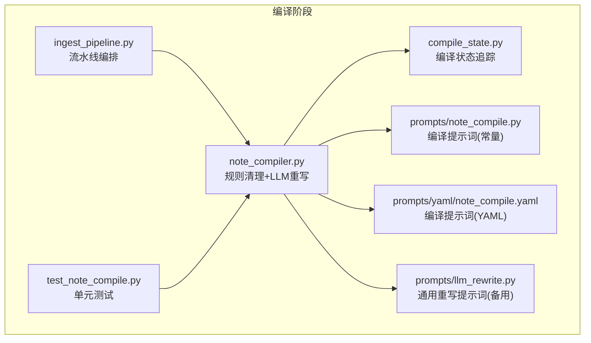
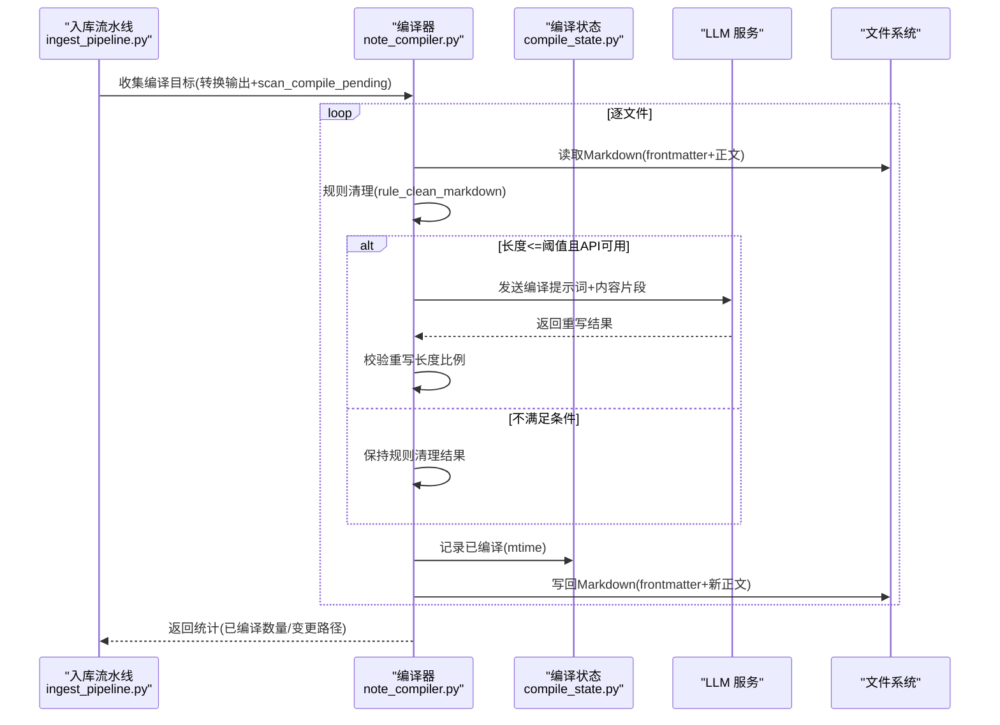
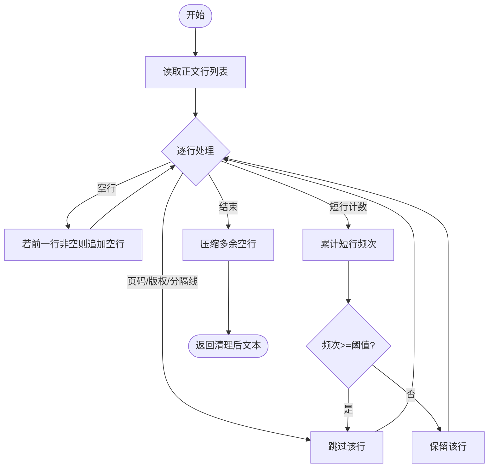
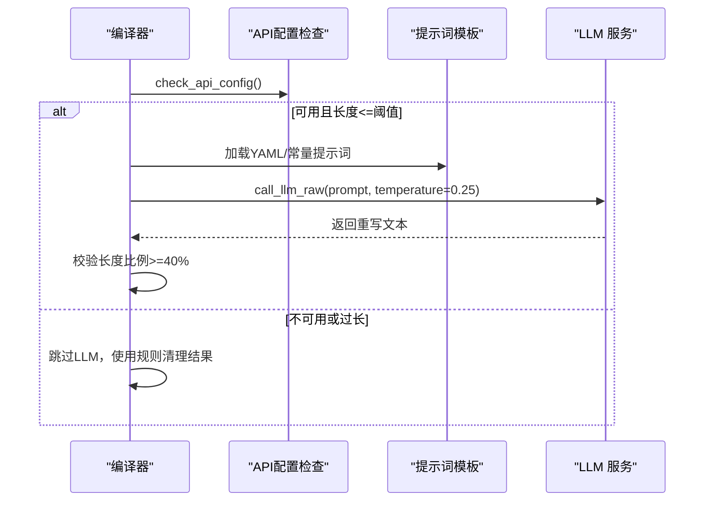
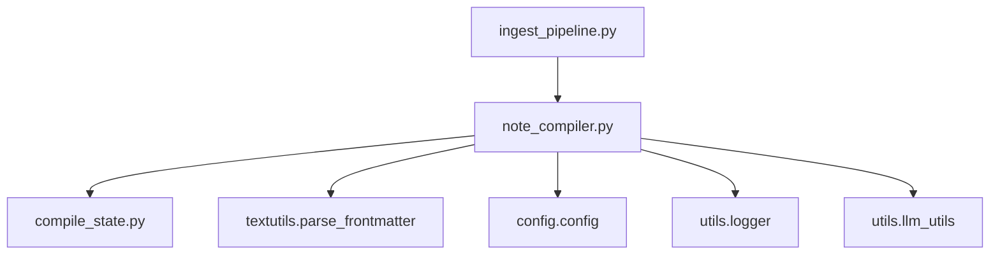

# 内容编译阶段

<cite>
**本文引用的文件**   
- [utils/note_compiler.py](file://utils/note_compiler.py)
- [python/sidecar/ingest_pipeline.py](file://python/sidecar/ingest_pipeline.py)
- [python/sidecar/compile_state.py](file://python/sidecar/compile_state.py)
- [prompts/note_compile.py](file://prompts/note_compile.py)
- [prompts/yaml/note_compile.yaml](file://prompts/yaml/note_compile.yaml)
- [prompts/llm_rewrite.py](file://prompts/llm_rewrite.py)
- [tests/unit/test_note_compile.py](file://tests/unit/test_note_compile.py)
</cite>

## 目录
1. [简介](#简介)
2. [项目结构](#项目结构)
3. [核心组件](#核心组件)
4. [架构总览](#架构总览)
5. [详细组件分析](#详细组件分析)
6. [依赖关系分析](#依赖关系分析)
7. [性能与调优](#性能与调优)
8. [故障排除指南](#故障排除指南)
9. [结论](#结论)
10. [附录：配置与扩展](#附录配置与扩展)

## 简介
本章节聚焦 NoteAI 入库流水线中的“内容编译阶段”，面向从 PDF/Word/HTML/TXT 等格式转换而来的 Markdown 笔记，提供自动优化与标准化处理。该阶段在“规则清理 + LLM 重写”双轨策略下，完成去噪、客观化、结构重组与完整性补全，同时保留并复用 YAML frontmatter 元数据。文档将深入解释编译流程、LLM 驱动改写算法、模板匹配与增强策略、编译规则配置与优先级管理、冲突解决机制、质量评估指标、性能参数与自定义扩展方法，并提供使用示例与故障排除指南。

## 项目结构
内容编译阶段涉及以下关键模块与文件：
- 编译主逻辑与批处理：utils/note_compiler.py
- 流水线编排（触发编译）：python/sidecar/ingest_pipeline.py
- 编译状态追踪（增量跳过）：python/sidecar/compile_state.py
- 编译提示词模板（Python 常量与 YAML 优先加载）：prompts/note_compile.py、prompts/yaml/note_compile.yaml
- 通用 LLM 重写提示词（备用）：prompts/llm_rewrite.py
- 单元测试覆盖：tests/unit/test_note_compile.py

图表来源
- [utils/note_compiler.py:1-238](file://utils/note_compiler.py#L1-L238)
- [python/sidecar/ingest_pipeline.py:658-686](file://python/sidecar/ingest_pipeline.py#L658-L686)
- [python/sidecar/compile_state.py:1-55](file://python/sidecar/compile_state.py#L1-L55)
- [prompts/note_compile.py:1-25](file://prompts/note_compile.py#L1-L25)
- [prompts/yaml/note_compile.yaml:1-21](file://prompts/yaml/note_compile.yaml#L1-L21)
- [prompts/llm_rewrite.py:1-29](file://prompts/llm_rewrite.py#L1-L29)
- [tests/unit/test_note_compile.py:1-79](file://tests/unit/test_note_compile.py#L1-L79)

章节来源
- [utils/note_compiler.py:1-238](file://utils/note_compiler.py#L1-L238)
- [python/sidecar/ingest_pipeline.py:658-686](file://python/sidecar/ingest_pipeline.py#L658-L686)
- [python/sidecar/compile_state.py:1-55](file://python/sidecar/compile_state.py#L1-L55)
- [prompts/note_compile.py:1-25](file://prompts/note_compile.py#L1-L25)
- [prompts/yaml/note_compile.yaml:1-21](file://prompts/yaml/note_compile.yaml#L1-L21)
- [prompts/llm_rewrite.py:1-29](file://prompts/llm_rewrite.py#L1-L29)
- [tests/unit/test_note_compile.py:1-79](file://tests/unit/test_note_compile.py#L1-L79)

## 核心组件
- 规则清理器 rule_clean_markdown：基于正则与启发式策略，去除页眉页脚、页码、重复水印、版权声明、重复分隔线，合并多余空行，过滤高频短行（常见运行头尾）。
- 编译决策 should_compile_file/_should_compile_file：根据 frontmatter 的 source/origin 字段判断是否来自可转换源（PDF/Word/PPT/HTML/TXT），决定是否进入编译。
- 扫描待编译 scan_compile_pending：遍历工作区 Notes 目录下的 .md，结合编译状态文件，筛选需要重新编译的文件。
- 单文件编译 compile_note_file：解析 frontmatter，执行规则清理，必要时调用 LLM 重写，回写文件并更新编译状态。
- 批量编译 compile_notes_batch：对多个文件顺序执行编译，支持进度回调与异常隔离。
- 编译状态追踪 file_needs_compile/mark_compiled：以 mtime 为信号，避免重复编译未改动文件。
- 流水线集成 ingest_pipeline.compile 阶段：在转换完成后统一收集目标并调用批量编译。

章节来源
- [utils/note_compiler.py:43-81](file://utils/note_compiler.py#L43-L81)
- [utils/note_compiler.py:90-98](file://utils/note_compiler.py#L90-L98)
- [utils/note_compiler.py:105-125](file://utils/note_compiler.py#L105-L125)
- [utils/note_compiler.py:128-210](file://utils/note_compiler.py#L128-L210)
- [utils/note_compiler.py:213-238](file://utils/note_compiler.py#L213-L238)
- [python/sidecar/compile_state.py:45-55](file://python/sidecar/compile_state.py#L45-L55)
- [python/sidecar/ingest_pipeline.py:658-686](file://python/sidecar/ingest_pipeline.py#L658-L686)

## 架构总览
内容编译阶段在入库流水线中位于“转换”之后、“分类/索引”之前，负责将转换产物标准化为高质量 Markdown，并为后续检索与知识组织提供稳定输入。

图表来源
- [python/sidecar/ingest_pipeline.py:658-686](file://python/sidecar/ingest_pipeline.py#L658-L686)
- [utils/note_compiler.py:128-210](file://utils/note_compiler.py#L128-L210)
- [python/sidecar/compile_state.py:45-55](file://python/sidecar/compile_state.py#L45-L55)

## 详细组件分析

### 规则清理与预处理
- 去噪策略：
  - 页码行：匹配中英文页码模式，直接丢弃。
  - 版权/保密声明：匹配常见版权关键词，丢弃首段或独立行。
  - 重复分隔线：连续点/横线/下划线作为分隔符时忽略。
  - 高频短行：统计短行出现次数，超过阈值视为运行头尾，丢弃。
  - 空白行压缩：将连续空行归一化为两段换行。
- 复杂度：线性 O(n)，n 为行数；空间 O(n)。

图表来源
- [utils/note_compiler.py:43-81](file://utils/note_compiler.py#L43-L81)

章节来源
- [utils/note_compiler.py:43-81](file://utils/note_compiler.py#L43-L81)

### Frontmatter 解析与保留
- 解析：使用 parse_frontmatter 分离 frontmatter 与正文。
- 决策：若 frontmatter 包含 source/origin 且后缀属于可转换集，则标记为需编译。
- 回写：最终输出仍保留原始 frontmatter，仅替换正文部分。

章节来源
- [utils/note_compiler.py:83-98](file://utils/note_compiler.py#L83-L98)
- [utils/note_compiler.py:145-152](file://utils/note_compiler.py#L145-L152)
- [utils/note_compiler.py:195-202](file://utils/note_compiler.py#L195-L202)

### LLM 驱动的文本改写算法
- 触发条件：
  - API 配置可用；
  - 清理后正文长度不超过阈值（默认 12000 字符）；
  - 重写结果长度不低于原长度的 40%（防止截断导致内容丢失）。
- 提示词模板：
  - 优先加载 prompts/yaml/note_compile.yaml 中的 INGEST_NOTE_COMPILE_PROMPT；
  - 若未加载到 YAML，则回退至 prompts/note_compile.py 中的常量；
  - 注入工作区补充规则（project_rules），用于个性化约束。
- 安全保护：
  - 超长文档跳过整篇重写，避免截断影响完整性；
  - 捕获 API 配置错误与异常，降级为规则清理结果。

图表来源
- [utils/note_compiler.py:165-194](file://utils/note_compiler.py#L165-L194)
- [prompts/note_compile.py:1-25](file://prompts/note_compile.py#L1-L25)
- [prompts/yaml/note_compile.yaml:1-21](file://prompts/yaml/note_compile.yaml#L1-L21)

章节来源
- [utils/note_compiler.py:165-194](file://utils/note_compiler.py#L165-L194)
- [prompts/note_compile.py:1-25](file://prompts/note_compile.py#L1-L25)
- [prompts/yaml/note_compile.yaml:1-21](file://prompts/yaml/note_compile.yaml#L1-L21)

### 模板匹配与内容增强策略
- 模板来源优先级：
  - YAML 模板（prompts/yaml/note_compile.yaml）优先；
  - Python 常量（prompts/note_compile.py）作为备用；
  - 通用重写提示词（prompts/llm_rewrite.py）可用于其他场景。
- 内容增强：
  - 注入 project_rules（工作区补充规则），实现按仓库/主题定制；
  - 强制只输出正文，避免引入额外说明或 frontmatter。

章节来源
- [prompts/note_compile.py:1-25](file://prompts/note_compile.py#L1-L25)
- [prompts/yaml/note_compile.yaml:1-21](file://prompts/yaml/note_compile.yaml#L1-L21)
- [prompts/llm_rewrite.py:1-29](file://prompts/llm_rewrite.py#L1-L29)
- [utils/note_compiler.py:173-177](file://utils/note_compiler.py#L173-L177)

### 编译规则的配置方式、优先级管理与冲突解决
- 配置位置：
  - 全局提示词：prompts/yaml/note_compile.yaml 或 prompts/note_compile.py；
  - 工作区补充规则：.ai_memory/project_rules.md 或 NoteAI/GUIDE.md（最长取前 2000 字符）。
- 优先级：
  - YAML > Python 常量；
  - 工作区补充规则通过 {project_rules} 注入，置于通用规则之后，具备更高针对性。
- 冲突解决：
  - 当工作区规则与通用规则不一致时，以工作区规则为准；
  - 若 LLM 重写失败或长度不足，回退到规则清理结果，保证稳定性。

章节来源
- [utils/note_compiler.py:30-41](file://utils/note_compiler.py#L30-L41)
- [utils/note_compiler.py:173-177](file://utils/note_compiler.py#L173-L177)
- [prompts/yaml/note_compile.yaml:14-16](file://prompts/yaml/note_compile.yaml#L14-L16)

### 编译质量评估指标
- 最小正文长度：清理后正文少于 30 字符视为过短，拒绝编译。
- 重写长度比例：重写结果至少为原长度 40%，否则弃用。
- 成功标志：返回 compiled=True 表示实际写入新正文；skipped=True 表示无需或已编译。
- 日志与事件：流水线阶段进度与消息通过 send_progress/send_event 上报。

章节来源
- [utils/note_compiler.py:158-161](file://utils/note_compiler.py#L158-L161)
- [utils/note_compiler.py:179-181](file://utils/note_compiler.py#L179-L181)
- [utils/note_compiler.py:204-210](file://utils/note_compiler.py#L204-L210)
- [python/sidecar/ingest_pipeline.py:584-591](file://python/sidecar/ingest_pipeline.py#L584-L591)

### 性能调优参数
- LLM 输入长度阈值：默认 12000 字符，超过则跳过整篇重写，避免截断与超时。
- 温度参数：temperature=0.25，降低随机性，提升一致性。
- 增量跳过：基于 mtime 的编译状态文件，避免重复处理未改动文件。
- 批量处理：compile_notes_batch 支持进度回调，便于前端展示与中断控制。

章节来源
- [utils/note_compiler.py:170-171](file://utils/note_compiler.py#L170-L171)
- [utils/note_compiler.py:178](file://utils/note_compiler.py#L178)
- [python/sidecar/compile_state.py:45-55](file://python/sidecar/compile_state.py#L45-L55)
- [utils/note_compiler.py:213-238](file://utils/note_compiler.py#L213-L238)

### 自定义编译规则的扩展方法
- 新增工作区规则：在工作区根创建 .ai_memory/project_rules.md 或 NoteAI/GUIDE.md，编写特定领域规范（如术语表、风格指南、禁用词等）。
- 调整提示词：修改 prompts/yaml/note_compile.yaml 或 prompts/note_compile.py，增加/细化规则条目。
- 扩展清理策略：在 rule_clean_markdown 中添加新的正则或启发式规则，注意复杂度与误伤风险。
- 接入外部模板：通过 prompts/llm_rewrite.py 或其他提示词模块，按需切换不同重写策略。

章节来源
- [utils/note_compiler.py:30-41](file://utils/note_compiler.py#L30-L41)
- [prompts/note_compile.py:1-25](file://prompts/note_compile.py#L1-L25)
- [prompts/yaml/note_compile.yaml:1-21](file://prompts/yaml/note_compile.yaml#L1-L21)
- [prompts/llm_rewrite.py:1-29](file://prompts/llm_rewrite.py#L1-L29)

## 依赖关系分析
- 内部依赖：
  - note_compiler 依赖 compile_state（增量跳过）、textutils（frontmatter 解析）、config（工作区路径）、logger（日志）。
  - ingest_pipeline 在“compile”阶段调用 note_compiler 的扫描与批量编译接口。
- 外部依赖：
  - LLM 服务（通过 utils.llm_utils.call_llm_raw 调用）。
  - YAML 与正则库（标准库）。

图表来源
- [utils/note_compiler.py:1-16](file://utils/note_compiler.py#L1-L16)
- [python/sidecar/ingest_pipeline.py:658-686](file://python/sidecar/ingest_pipeline.py#L658-L686)

章节来源
- [utils/note_compiler.py:1-16](file://utils/note_compiler.py#L1-L16)
- [python/sidecar/ingest_pipeline.py:658-686](file://python/sidecar/ingest_pipeline.py#L658-L686)

## 性能与调优
- 建议开启增量编译：确保 compile_state.json 正常读写，避免重复处理。
- 合理设置 LLM 长度阈值：对于长文档，优先采用分段重写或离线批处理。
- 控制并发：当前为串行批处理，如需并行，需在外部调度层进行限流与重试。
- 监控日志：关注 LLM 跳过原因与异常信息，及时修复配置问题。

[本节为通用指导，不直接分析具体文件]

## 故障排除指南
- 未设置工作区：返回 success=False，message="未设置工作区"。请确认 config.workspace_path 正确。
- 非 Markdown 文件：仅处理 .md 文件，其他类型将被跳过。
- 正文过短：清理后小于 30 字符，拒绝编译。检查源文件是否有效。
- LLM 配置错误：check_api_config 返回不可用时，自动降级为规则清理。
- 长文档被截断：超过阈值的文档不会调用 LLM，保持规则清理结果。
- 权限/IO 错误：文件读写异常会被捕获并记录日志，不影响其他文件。

章节来源
- [utils/note_compiler.py:135-161](file://utils/note_compiler.py#L135-L161)
- [utils/note_compiler.py:188-194](file://utils/note_compiler.py#L188-L194)
- [tests/unit/test_note_compile.py:34-67](file://tests/unit/test_note_compile.py#L34-L67)

## 结论
内容编译阶段通过“规则清理 + LLM 重写”的双轨机制，在保证稳定性的前提下显著提升 Markdown 笔记的可读性与结构化程度。配合工作区补充规则与 YAML 模板，可实现高度可定制的编译策略。增量状态与性能参数使系统在高吞吐场景下依然高效可靠。

[本节为总结性内容，不直接分析具体文件]

## 附录：配置与扩展
- 启用/关闭 LLM 重写：compile_note_file(use_llm=True/False) 控制是否尝试 LLM。
- 强制编译：force=True 绕过增量检查，适用于规则变更后重跑。
- 批量编译：compile_notes_batch(rel_paths, progress_cb, use_llm, force)。
- 测试验证：参考 tests/unit/test_note_compile.py 中的用例，快速验证规则与行为。

章节来源
- [utils/note_compiler.py:128-210](file://utils/note_compiler.py#L128-L210)
- [utils/note_compiler.py:213-238](file://utils/note_compiler.py#L213-L238)
- [tests/unit/test_note_compile.py:1-79](file://tests/unit/test_note_compile.py#L1-L79)