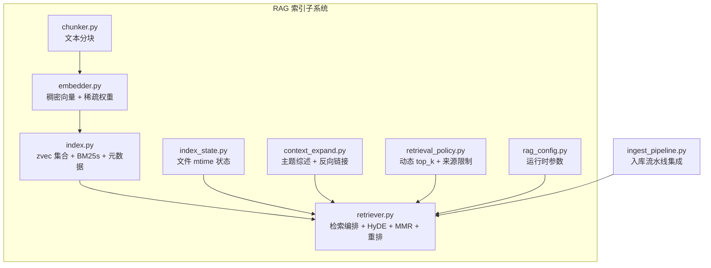
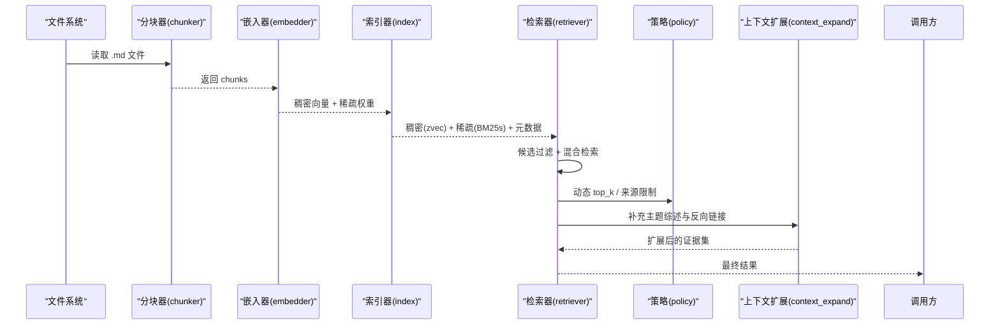
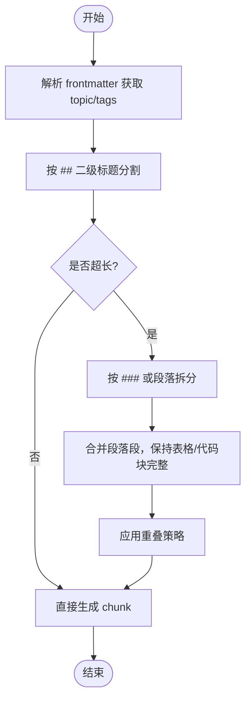
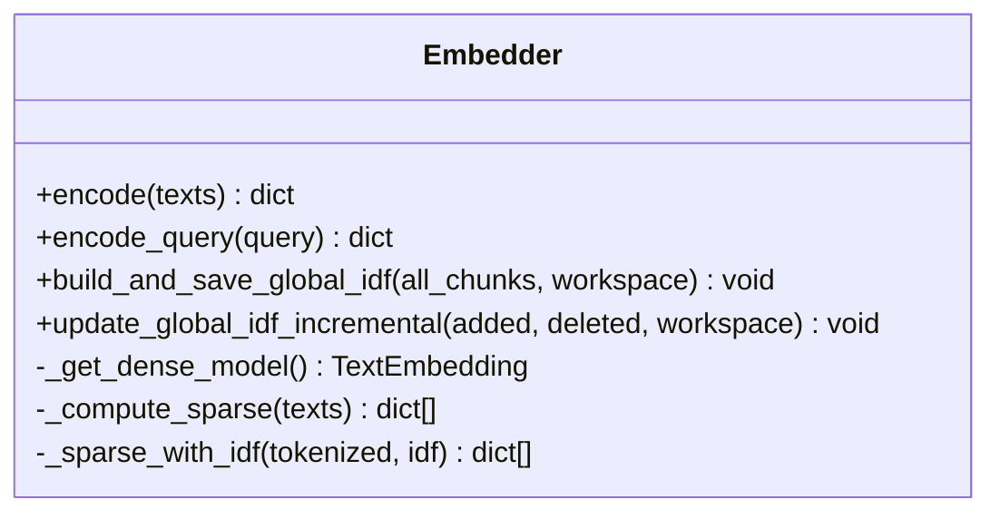
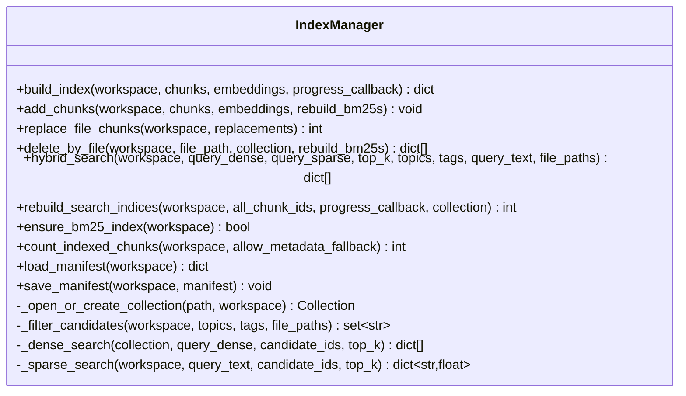
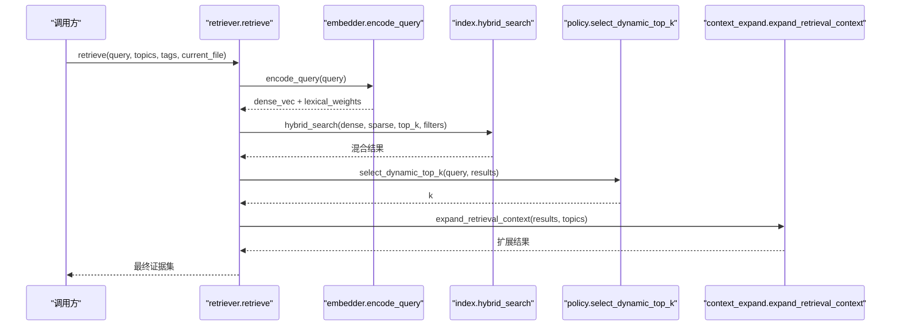
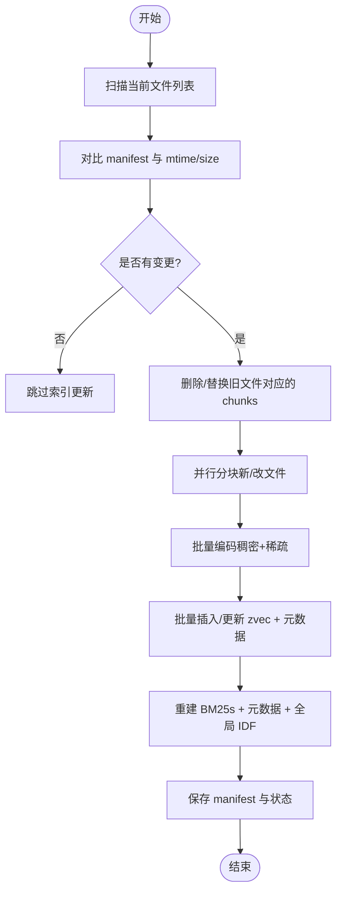
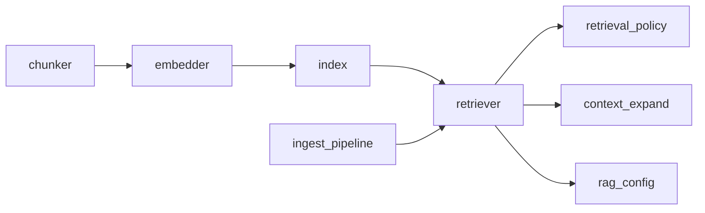

# 向量索引阶段

<cite>
**本文引用的文件**
- [index.py](file://python/sidecar/rag/index.py)
- [chunker.py](file://python/sidecar/rag/chunker.py)
- [embedder.py](file://python/sidecar/rag/embedder.py)
- [retriever.py](file://python/sidecar/rag/retriever.py)
- [index_state.py](file://python/sidecar/rag/index_state.py)
- [context_expand.py](file://python/sidecar/rag/context_expand.py)
- [retrieval_policy.py](file://python/sidecar/rag/retrieval_policy.py)
- [rag_config.py](file://python/sidecar/rag/rag_config.py)
- [ingest_pipeline.py](file://python/sidecar/ingest_pipeline.py)
</cite>

## 目录
1. [简介](#简介)
2. [项目结构](#项目结构)
3. [核心组件](#核心组件)
4. [架构总览](#架构总览)
5. [详细组件分析](#详细组件分析)
6. [依赖关系分析](#依赖关系分析)
7. [性能与优化](#性能与优化)
8. [故障诊断与排错](#故障诊断与排错)
9. [结论](#结论)
10. [附录：维护工具与监控指标](#附录：维护工具与监控指标)

## 简介
本章节聚焦 NoteAI 入库流水线的“向量索引阶段”，系统性阐述 RAG 检索系统的向量索引构建过程，包括文本分块、嵌入向量生成、混合检索（稠密+稀疏）与索引存储机制；并覆盖增量更新、完整性检查、数据一致性保证、并发访问控制、错误恢复、查询性能调优与存储空间管理。文档同时提供索引状态同步、索引维护工具、性能监控指标和故障诊断方法的使用指南。

## 项目结构
向量索引阶段的核心代码位于 sidecar/rag 子模块中，围绕以下关键文件组织：
- 索引与检索：index.py、retriever.py
- 文本分块：chunker.py
- 嵌入与稀疏权重：embedder.py
- 索引状态与一致性：index_state.py
- 上下文扩展与策略：context_expand.py、retrieval_policy.py
- 运行时配置：rag_config.py
- 入库流水线集成：ingest_pipeline.py

图表来源
- [index.py:1-120](file://python/sidecar/rag/index.py#L1-L120)
- [chunker.py:1-60](file://python/sidecar/rag/chunker.py#L1-L60)
- [embedder.py:1-80](file://python/sidecar/rag/embedder.py#L1-L80)
- [retriever.py:1-60](file://python/sidecar/rag/retriever.py#L1-L60)
- [index_state.py:1-40](file://python/sidecar/rag/index_state.py#L1-L40)
- [context_expand.py:1-40](file://python/sidecar/rag/context_expand.py#L1-L40)
- [retrieval_policy.py:1-40](file://python/sidecar/rag/retrieval_policy.py#L1-L40)
- [rag_config.py:1-40](file://python/sidecar/rag/rag_config.py#L1-L40)
- [ingest_pipeline.py:1-60](file://python/sidecar/ingest_pipeline.py#L1-L60)

章节来源
- [index.py:1-120](file://python/sidecar/rag/index.py#L1-L120)
- [chunker.py:1-60](file://python/sidecar/rag/chunker.py#L1-L60)
- [embedder.py:1-80](file://python/sidecar/rag/embedder.py#L1-L80)
- [retriever.py:1-60](file://python/sidecar/rag/retriever.py#L1-L60)
- [index_state.py:1-40](file://python/sidecar/rag/index_state.py#L1-L40)
- [context_expand.py:1-40](file://python/sidecar/rag/context_expand.py#L1-L40)
- [retrieval_policy.py:1-40](file://python/sidecar/rag/retrieval_policy.py#L1-L40)
- [rag_config.py:1-40](file://python/sidecar/rag/rag_config.py#L1-L40)
- [ingest_pipeline.py:1-60](file://python/sidecar/ingest_pipeline.py#L1-L60)

## 核心组件
- 文本分块器：按二级标题切分，必要时按三级标题或段落进行二次切分，保留表格与代码块完整，设置最大长度与重叠比例，输出带 id、content、file_path、topic、tags、section_title 的 chunk。
- 嵌入器：使用本地 Embedding 模型生成稠密向量，同时基于 jieba 分词与全局 IDF 计算稀疏权重，支持离线缓存与增量更新。
- 索引器：以 zvec 作为稠密向量数据库，BM25s 作为稀疏倒排索引，metadata.json 维护 topic/tag/file 倒排，manifest.json 记录文件级 chunk 映射与版本信息。
- 检索器：组合稠密搜索与稀疏检索，支持过滤候选集、HyDE 假设式检索、MMR 去重、可选重排器，以及上下文扩展（主题综述与反向链接）。
- 索引状态：持久化每个文件的 mtime，用于增量重建判断与跳过未变更文件。
- 策略与配置：动态选择 top_k、限制唯一来源数量、混合权重、HyDE 阈值、重排开关等。

章节来源
- [chunker.py:1-163](file://python/sidecar/rag/chunker.py#L1-L163)
- [embedder.py:167-384](file://python/sidecar/rag/embedder.py#L167-L384)
- [index.py:148-582](file://python/sidecar/rag/index.py#L148-L582)
- [retriever.py:102-196](file://python/sidecar/rag/retriever.py#L102-L196)
- [index_state.py:75-102](file://python/sidecar/rag/index_state.py#L75-L102)
- [retrieval_policy.py:58-101](file://python/sidecar/rag/retrieval_policy.py#L58-L101)
- [rag_config.py:21-64](file://python/sidecar/rag/rag_config.py#L21-L64)

## 架构总览
下图展示了从文件到检索结果的端到端流程，涵盖分块、嵌入、索引构建、混合检索与结果后处理。

图表来源
- [chunker.py:11-43](file://python/sidecar/rag/chunker.py#L11-L43)
- [embedder.py:334-384](file://python/sidecar/rag/embedder.py#L334-L384)
- [index.py:502-582](file://python/sidecar/rag/index.py#L502-L582)
- [retriever.py:102-196](file://python/sidecar/rag/retriever.py#L102-L196)
- [retrieval_policy.py:58-101](file://python/sidecar/rag/retrieval_policy.py#L58-L101)
- [context_expand.py:147-198](file://python/sidecar/rag/context_expand.py#L147-L198)

## 详细组件分析

### 文本分块算法（chunker）
- 解析 frontmatter 提取 topic/tags，按 ## 二级标题分段，再对长段落按 ### 三级标题或段落边界切分。
- 表格与代码块整体保留，避免被截断破坏语义。
- 最大长度与重叠比例可调，确保相邻片段有足够上下文衔接。
- 输出包含稳定的 chunk_id（由 file_path、section_title、内容前缀哈希得到），便于去重与定位。

图表来源
- [chunker.py:11-103](file://python/sidecar/rag/chunker.py#L11-L103)
- [chunker.py:105-163](file://python/sidecar/rag/chunker.py#L105-L163)

章节来源
- [chunker.py:11-163](file://python/sidecar/rag/chunker.py#L11-L163)

### 嵌入向量生成（embedder）
- 稠密向量：加载本地 Embedding 模型，批量编码，支持下载回调与进度回调。
- 稀疏权重：jieba 分词 + 停用词过滤，优先使用全局 IDF，否则回退为批次内 IDF。
- 全局 IDF：全量重建时计算并持久化，增量场景近似更新或标记失效。
- 模型与环境：统一 HF 缓存路径与代理设置，失败可清理快照重试。

图表来源
- [embedder.py:140-165](file://python/sidecar/rag/embedder.py#L140-L165)
- [embedder.py:173-225](file://python/sidecar/rag/embedder.py#L173-L225)
- [embedder.py:258-328](file://python/sidecar/rag/embedder.py#L258-L328)
- [embedder.py:334-384](file://python/sidecar/rag/embedder.py#L334-L384)

章节来源
- [embedder.py:140-384](file://python/sidecar/rag/embedder.py#L140-L384)

### 索引存储机制（index）
- 稠密索引：zvec 集合，字段包含 content、file_path、topic、tags_json、section_title，向量维度固定，度量类型为余弦相似度。
- 稀疏索引：bm25s 倒排，保存于独立目录，支持在线加载与缓存。
- 元数据索引：metadata.json 维护 topic/tag/file 倒排，快速过滤候选集。
- 清单文件：manifest.json 记录每个文件的 mtime、size 与对应 chunk ids，用于一致性校验与增量重建。
- 原子写入：构建期间使用临时目录与备份，成功后原子替换，失败回滚，保障一致性。
- 并发控制：工作区级写锁、集合句柄缓存、BM25 加载保护，避免重复打开与竞争。

图表来源
- [index.py:502-582](file://python/sidecar/rag/index.py#L502-L582)
- [index.py:596-702](file://python/sidecar/rag/index.py#L596-L702)
- [index.py:704-774](file://python/sidecar/rag/index.py#L704-L774)
- [index.py:961-1029](file://python/sidecar/rag/index.py#L961-L1029)
- [index.py:1084-1137](file://python/sidecar/rag/index.py#L1084-L1137)
- [index.py:229-285](file://python/sidecar/rag/index.py#L229-L285)
- [index.py:925-959](file://python/sidecar/rag/index.py#L925-L959)

章节来源
- [index.py:148-582](file://python/sidecar/rag/index.py#L148-L582)
- [index.py:596-702](file://python/sidecar/rag/index.py#L596-L702)
- [index.py:704-774](file://python/sidecar/rag/index.py#L704-L774)
- [index.py:961-1029](file://python/sidecar/rag/index.py#L961-L1029)
- [index.py:1084-1137](file://python/sidecar/rag/index.py#L1084-L1137)
- [index.py:229-285](file://python/sidecar/rag/index.py#L229-L285)
- [index.py:925-959](file://python/sidecar/rag/index.py#L925-L959)

### 检索编排与后处理（retriever）
- 查询编码：encode_query 生成稠密向量与稀疏权重。
- 混合检索：并行执行稠密与稀疏检索，归一化稀疏分数并按权重融合。
- 候选过滤：基于 metadata 的 topic/tag/file 倒排缩小搜索空间。
- HyDE：在弱检索情况下通过 LLM 生成假设答案再检索。
- MMR 去重：平衡相关性多样性，减少冗余。
- 可选重排：FlagReranker 对候选进行精细排序，具备冷却期与降级策略。
- 上下文扩展：前置主题综述片段与后置反向链接片段，增强证据面。
- 动态 top_k：根据查询复杂度与分数分布自适应调整引用数量。
- 来源限制：限制结果来自不同文件的数量，提升覆盖面。

图表来源
- [retriever.py:102-196](file://python/sidecar/rag/retriever.py#L102-L196)
- [retriever.py:198-227](file://python/sidecar/rag/retriever.py#L198-L227)
- [retriever.py:229-291](file://python/sidecar/rag/retriever.py#L229-L291)
- [retriever.py:293-325](file://python/sidecar/rag/retriever.py#L293-L325)
- [retriever.py:147-196](file://python/sidecar/rag/retriever.py#L147-L196)
- [retrieval_policy.py:58-86](file://python/sidecar/rag/retrieval_policy.py#L58-L86)
- [retrieval_policy.py:88-101](file://python/sidecar/rag/retrieval_policy.py#L88-L101)
- [context_expand.py:147-198](file://python/sidecar/rag/context_expand.py#L147-L198)

章节来源
- [retriever.py:102-196](file://python/sidecar/rag/retriever.py#L102-L196)
- [retriever.py:198-227](file://python/sidecar/rag/retriever.py#L198-L227)
- [retriever.py:229-291](file://python/sidecar/rag/retriever.py#L229-L291)
- [retriever.py:293-325](file://python/sidecar/rag/retriever.py#L293-L325)
- [retrieval_policy.py:58-101](file://python/sidecar/rag/retrieval_policy.py#L58-L101)
- [context_expand.py:147-198](file://python/sidecar/rag/context_expand.py#L147-L198)

### 索引状态同步与增量更新（index_state + retriever）
- 文件级 mtime 状态：记录上次索引的文件修改时间，避免重复处理。
- 增量重建：比较当前文件列表与 manifest，仅对新增/修改/删除文件进行处理，复用已打开集合句柄，延迟 BM25s 重建至批处理末尾。
- 一致性校验：对比 expected_chunks 与 count_indexed_chunks，不一致则触发全量重建。
- 幂等性：replace_file_chunks 先 upsert 新文档再删除旧 ids，失败不污染现有索引。

图表来源
- [retriever.py:459-627](file://python/sidecar/rag/retriever.py#L459-L627)
- [index_state.py:75-102](file://python/sidecar/rag/index_state.py#L75-L102)
- [index.py:646-702](file://python/sidecar/rag/index.py#L646-L702)
- [index.py:1084-1137](file://python/sidecar/rag/index.py#L1084-L1137)

章节来源
- [retriever.py:459-627](file://python/sidecar/rag/retriever.py#L459-L627)
- [index_state.py:75-102](file://python/sidecar/rag/index_state.py#L75-L102)
- [index.py:646-702](file://python/sidecar/rag/index.py#L646-L702)
- [index.py:1084-1137](file://python/sidecar/rag/index.py#L1084-L1137)

## 依赖关系分析
- 外部库：zvec（稠密向量）、bm25s（稀疏倒排）、fastembed（本地 Embedding）、FlagReranker（可选重排）、jieba（中文分词）。
- 内部依赖：
  - index.py 依赖 embedder（生成 dense/sparse）、retriever（编排检索）、rag_config（权重与阈值）。
  - retriever.py 依赖 index（混合检索）、context_expand（上下文扩展）、retrieval_policy（动态 top_k/来源限制）。
  - ingest_pipeline.py 驱动整个流水线，触发索引重建与状态同步。

图表来源
- [index.py:1-60](file://python/sidecar/rag/index.py#L1-L60)
- [retriever.py:1-40](file://python/sidecar/rag/retriever.py#L1-L40)
- [ingest_pipeline.py:1-60](file://python/sidecar/ingest_pipeline.py#L1-L60)

章节来源
- [index.py:1-60](file://python/sidecar/rag/index.py#L1-L60)
- [retriever.py:1-40](file://python/sidecar/rag/retriever.py#L1-L40)
- [ingest_pipeline.py:1-60](file://python/sidecar/ingest_pipeline.py#L1-L60)

## 性能与优化
- 稠密索引参数：
  - EF 上限与倍数：控制 HNSW 搜索精度与召回的权衡，默认上限与倍数见常量定义。
  - 批量插入：按固定批次大小写入，降低单次请求体积与内存峰值。
- 稀疏索引：
  - BM25s 参数：k1、b 影响词频与长度归一化效果。
  - 全局 IDF：全量重建时持久化，避免每次批次内 IDF 波动。
- 检索优化：
  - 候选过滤：利用 metadata 倒排提前裁剪候选集，显著降低搜索空间。
  - 并行执行：稠密与稀疏检索线程池并行，缩短端到端延迟。
  - 结果缓存：相同查询在 TTL 窗口内命中缓存，减少重复计算。
- 资源管理：
  - 集合句柄缓存：避免频繁 open/close 带来的 mmindex 重载开销。
  - BM25 加载缓存：避免重复 load 成本。
  - 模型线程数：依据 CPU 核数自动设置 ONNX 推理线程。
- 存储管理：
  - 原子写入与备份：构建期间使用临时目录与备份，成功替换，失败回滚。
  - 清理策略：构建完成后移除临时与备份目录，释放磁盘空间。

章节来源
- [index.py:36-41](file://python/sidecar/rag/index.py#L36-L41)
- [index.py:502-582](file://python/sidecar/rag/index.py#L502-L582)
- [index.py:824-844](file://python/sidecar/rag/index.py#L824-L844)
- [index.py:961-1029](file://python/sidecar/rag/index.py#L961-L1029)
- [embedder.py:103-108](file://python/sidecar/rag/embedder.py#L103-L108)
- [retriever.py:36-41](file://python/sidecar/rag/retriever.py#L36-L41)

## 故障诊断与排错
- 索引文件占用：
  - 现象：打开集合时报“被占用”错误。
  - 处理：自动 GC 与短暂休眠重试，若仍失败提示关闭其他实例。
- BM25 缺失：
  - 现象：稀疏检索不可用。
  - 处理：ensure_bm25_index 检测并从 zvec 重建 BM25s，防止空索引导致检索失败。
- 模型加载失败：
  - 现象：Embedding 模型加载异常（如 ONNXRuntimeError）。
  - 处理：清理不完整缓存目录并重试，失败则抛出明确错误日志。
- 版本不匹配：
  - 现象：manifest version 与当前 schema 不一致。
  - 处理：销毁旧集合与 BM25s，重新创建并重建索引。
- 计数不一致：
  - 现象：metadata 与 collection 的 chunk 计数不一致。
  - 处理：以 collection 为准并告警，必要时触发重建。

章节来源
- [index.py:169-190](file://python/sidecar/rag/index.py#L169-L190)
- [index.py:800-822](file://python/sidecar/rag/index.py#L800-L822)
- [embedder.py:117-165](file://python/sidecar/rag/embedder.py#L117-L165)
- [index.py:255-285](file://python/sidecar/rag/index.py#L255-L285)
- [index.py:336-360](file://python/sidecar/rag/index.py#L336-L360)

## 结论
NoteAI 的向量索引阶段采用“稠密+稀疏”的混合检索架构，结合高效的本地向量数据库与倒排索引，实现了高召回与高精度的检索能力。通过原子写入、并发控制、增量更新与一致性校验，系统在大规模知识库下仍能保持稳定与高效。配合动态 top_k、来源限制与上下文扩展，最终输出的证据集兼具相关性与多样性。

## 附录：维护工具与监控指标
- 索引维护工具
  - 全量重建：rebuild_index(force_full=True)，适用于索引损坏或不一致场景。
  - 增量更新：rebuild_index(force_full=False)，基于文件 mtime/size 差异进行增量处理。
  - 单文件更新：incremental_update(file_path, action="update"/"delete")，适合实时编辑后的快速刷新。
  - 重建辅助：rebuild_search_indices(all_chunk_ids)，从 zvec 重建 BM25s 与 metadata。
  - 状态清理：clear_bm25_cache()/clear_collection_cache()，强制刷新缓存句柄。
- 监控指标
  - 索引规模：count_indexed_chunks(workspace) 返回实际索引 chunk 数。
  - 就绪状态：bm25_index_ready(workspace)、is_index_up_to_date(workspace)。
  - 进度回调：构建与重建过程中通过 progress_callback 上报阶段与百分比。
- 使用建议
  - 首次导入：优先全量重建，确保全局 IDF 与 BM25s 正确初始化。
  - 日常更新：启用增量模式，减少不必要的编码与索引重建。
  - 性能调优：根据数据集规模调整 EF 上限、混合权重与 top_k，观察命中率与延迟变化。

章节来源
- [retriever.py:459-627](file://python/sidecar/rag/retriever.py#L459-L627)
- [retriever.py:629-662](file://python/sidecar/rag/retriever.py#L629-L662)
- [index.py:1084-1137](file://python/sidecar/rag/index.py#L1084-L1137)
- [index.py:287-311](file://python/sidecar/rag/index.py#L287-L311)
- [index.py:336-360](file://python/sidecar/rag/index.py#L336-L360)
- [index.py:786-822](file://python/sidecar/rag/index.py#L786-L822)
- [retriever.py:362-385](file://python/sidecar/rag/retriever.py#L362-L385)