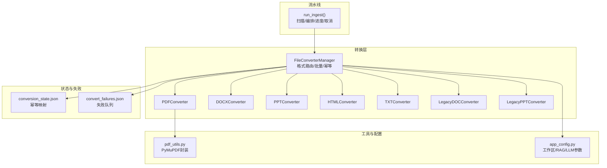
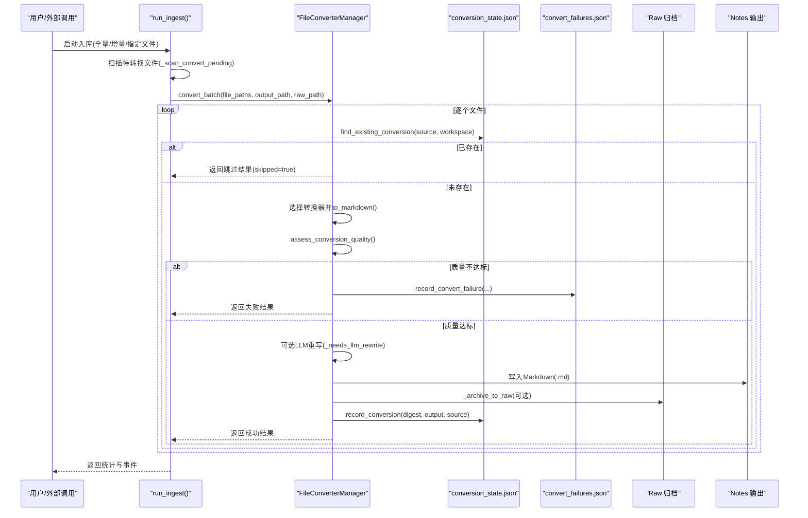
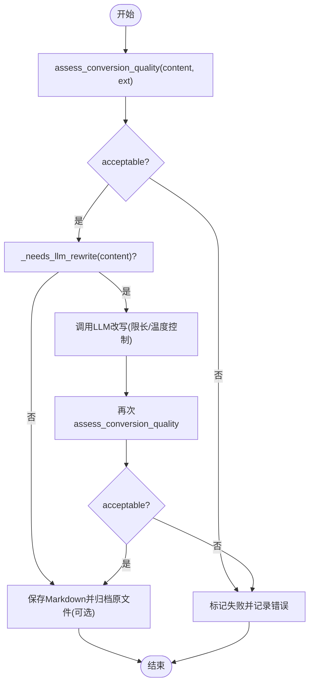
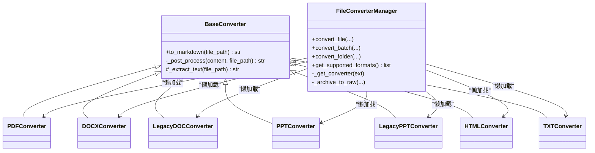

# 文件转换阶段

<cite>
**本文引用的文件**
- [modules/file_converter.py](file://modules/file_converter.py)
- [python/sidecar/ingest_pipeline.py](file://python/sidecar/ingest_pipeline.py)
- [python/sidecar/conversion_state.py](file://python/sidecar/conversion_state.py)
- [python/sidecar/convert_failures.py](file://python/sidecar/convert_failures.py)
- [utils/pdf_utils.py](file://utils/pdf_utils.py)
- [config/app_config.py](file://config/app_config.py)
</cite>

## 目录
1. [简介](#简介)
2. [项目结构](#项目结构)
3. [核心组件](#核心组件)
4. [架构总览](#架构总览)
5. [详细组件分析](#详细组件分析)
6. [依赖关系分析](#依赖关系分析)
7. [性能与资源管理](#性能与资源管理)
8. [故障排查指南](#故障排查指南)
9. [结论](#结论)
10. [附录：配置与参数](#附录配置与参数)

## 简介
本章节聚焦 NoteAI 入库流水线的“文件转换阶段”，系统性地说明多格式文件的识别、转换、质量评估、幂等去重、批量处理、失败记录与重试策略，以及资源管理与性能优化。目标读者包括开发者与运维人员，力求在保持技术深度的同时提供可操作的实践建议。

## 项目结构
文件转换阶段涉及的核心模块与职责如下：
- 转换器实现与调度：位于 modules/file_converter.py，包含各格式转换器与统一管理器。
- 入库流水线编排：位于 python/sidecar/ingest_pipeline.py，负责扫描待转换文件、调用转换器、推进后续阶段。
- 转换幂等状态：位于 python/sidecar/conversion_state.py，基于源文件哈希避免重复转换。
- 转换失败队列：位于 python/sidecar/convert_failures.py，持久化失败条目以便后续重试或人工干预。
- PDF 文本提取工具：位于 utils/pdf_utils.py，封装 PyMuPDF 的逐页与全文提取。
- 应用配置：位于 config/app_config.py，提供工作区路径、RAG 开关、LLM 相关参数等。

图表来源
- [modules/file_converter.py:407-862](file://modules/file_converter.py#L407-L862)
- [python/sidecar/ingest_pipeline.py:277-654](file://python/sidecar/ingest_pipeline.py#L277-L654)
- [python/sidecar/conversion_state.py:1-109](file://python/sidecar/conversion_state.py#L1-L109)
- [python/sidecar/convert_failures.py:1-100](file://python/sidecar/convert_failures.py#L1-L100)
- [utils/pdf_utils.py:1-40](file://utils/pdf_utils.py#L1-L40)
- [config/app_config.py:28-100](file://config/app_config.py#L28-L100)

章节来源
- [modules/file_converter.py:407-862](file://modules/file_converter.py#L407-L862)
- [python/sidecar/ingest_pipeline.py:277-654](file://python/sidecar/ingest_pipeline.py#L277-L654)
- [python/sidecar/conversion_state.py:1-109](file://python/sidecar/conversion_state.py#L1-L109)
- [python/sidecar/convert_failures.py:1-100](file://python/sidecar/convert_failures.py#L1-L100)
- [utils/pdf_utils.py:1-40](file://utils/pdf_utils.py#L1-L40)
- [config/app_config.py:28-100](file://config/app_config.py#L28-L100)

## 核心组件
- BaseConverter（模板方法）：统一日志、异常、后处理流程；子类仅实现 _extract_text。
- 具体转换器：
  - PDFConverter：使用 PyMuPDF 快速路径提取，支持签名/页眉页脚检测与移除。
  - DOCXConverter：通过 mammoth 将 .docx 转为 Markdown。
  - LegacyDOCConverter：依次尝试 textutil / antiword / catdoc 以兼容旧版 .doc。
  - PPTConverter：使用 python-pptx 解析 .pptx 文本与表格。
  - LegacyPPTConverter：解析 OLE PowerPoint Document 流中的文本记录。
  - HTMLConverter：使用 html2text 将 HTML/HTM 转为 Markdown。
  - TXTConverter：自动编码探测读取纯文本。
- FileConverterManager：
  - 格式路由：根据扩展名选择对应转换器。
  - 幂等检查：基于 source_sha256 与 conversion_state.json 避免重复转换。
  - 质量评估：assess_conversion_quality 对乱码、正文长度、扫描 PDF 进行判定。
  - LLM 重写：当内容质量不足且长度受限时，可选调用 LLM 改写为更结构化 Markdown。
  - 批量与文件夹转换：convert_batch / convert_folder 提供批处理能力。
  - 原始归档：_archive_to_raw 将原文件移动到 Raw 目录并更新笔记 frontmatter 的 source 字段。
  - 主题分配：可选 auto_assign_topic_for_file 自动归类到主题。

章节来源
- [modules/file_converter.py:27-158](file://modules/file_converter.py#L27-L158)
- [modules/file_converter.py:160-405](file://modules/file_converter.py#L160-L405)
- [modules/file_converter.py:407-862](file://modules/file_converter.py#L407-L862)
- [utils/pdf_utils.py:1-40](file://utils/pdf_utils.py#L1-L40)

## 架构总览
文件转换阶段在入库流水线中被作为独立阶段执行，具备以下关键特性：
- 增量扫描：仅处理支持格式且未被索引/转换的文件。
- 幂等转换：同一源文件多次触发不会重复生成笔记。
- 质量门控：转换结果需通过质量评估，否则进入错误分支。
- 可选增强：在内容较短或结构不佳时，可触发 LLM 重写以提升可读性。
- 失败持久化：失败条目写入 convert_failures.json，便于后续重试或人工处理。

图表来源
- [python/sidecar/ingest_pipeline.py:277-654](file://python/sidecar/ingest_pipeline.py#L277-L654)
- [modules/file_converter.py:569-731](file://modules/file_converter.py#L569-L731)
- [python/sidecar/conversion_state.py:65-109](file://python/sidecar/conversion_state.py#L65-L109)
- [python/sidecar/convert_failures.py:40-100](file://python/sidecar/convert_failures.py#L40-L100)

## 详细组件分析

### 文件格式检测与路由
- 支持格式列表由 FileConverterManager 集中维护，涵盖 PDF、DOCX、旧版 DOC、PPTX、旧版 PPT、HTML/HTM、TXT。
- 路由逻辑按扩展名匹配，若不支持则直接返回错误结果。
- 批量扫描时，忽略 RAW 与工作区元数据目录，避免重复处理。

章节来源
- [modules/file_converter.py:407-508](file://modules/file_converter.py#L407-L508)
- [python/sidecar/ingest_pipeline.py:277-291](file://python/sidecar/ingest_pipeline.py#L277-L291)

### 转换流程与后处理
- 基类 to_markdown 统一日志与异常，子类实现 _extract_text。
- 通用后处理 clean_text + remove_images_from_markdown。
- PDF 特有后处理：clean_text → 签名/页眉页脚检测与移除 → 图片移除。
- 旧版文档转换：依次尝试多个外部工具，任一成功即返回。

章节来源
- [modules/file_converter.py:27-92](file://modules/file_converter.py#L27-L92)
- [modules/file_converter.py:183-252](file://modules/file_converter.py#L183-L252)
- [modules/file_converter.py:289-388](file://modules/file_converter.py#L289-L388)

### 质量评估与 LLM 重写
- assess_conversion_quality 计算非空白字符数、替换字符与控制字符比例，判断是否疑似乱码或扫描 PDF。
- _needs_llm_rewrite 基于标题、标点、段落等启发式规则判断是否需要改写。
- 当满足条件且 API 可用时，调用 LLM 改写，提升结构与可读性。

图表来源
- [modules/file_converter.py:509-534](file://modules/file_converter.py#L509-L534)
- [modules/file_converter.py:428-443](file://modules/file_converter.py#L428-L443)
- [modules/file_converter.py:634-663](file://modules/file_converter.py#L634-L663)

### 幂等与去重
- 基于 source_sha256 与 conversion_state.json 建立“源→输出”映射。
- 若检测到相同源文件已有输出，则跳过转换并可更新 source 引用。
- 输出文件名冲突时采用递增后缀避免覆盖。

章节来源
- [python/sidecar/conversion_state.py:18-86](file://python/sidecar/conversion_state.py#L18-L86)
- [modules/file_converter.py:609-630](file://modules/file_converter.py#L609-L630)
- [modules/file_converter.py:680-691](file://modules/file_converter.py#L680-L691)

### 批量处理与进度回调
- convert_batch 顺序处理每个文件，支持 progress_callback 上报进度。
- 最终汇总结果并记录失败项至 convert_failures.json。
- convert_folder 递归扫描目录，过滤 RAW 与隐藏文件，复用 convert_batch。

章节来源
- [modules/file_converter.py:732-771](file://modules/file_converter.py#L732-L771)
- [modules/file_converter.py:812-848](file://modules/file_converter.py#L812-L848)
- [python/sidecar/convert_failures.py:83-100](file://python/sidecar/convert_failures.py#L83-L100)

### 原始文件归档与来源追踪
- _archive_to_raw 将原文件移动到 Raw 目录，避免污染 Notes。
- 更新笔记 frontmatter 的 source 字段为相对工作区的源路径，便于溯源。
- 若归档失败，仍保留转换结果但记录警告。

章节来源
- [modules/file_converter.py:772-811](file://modules/file_converter.py#L772-L811)
- [modules/file_converter.py:550-568](file://modules/file_converter.py#L550-L568)

### 错误处理与重试机制
- 单文件转换异常被捕获并记录到 result.error。
- 批量转换结束后，record_convert_batch_results 将失败项写入 convert_failures.json。
- 清理函数 cleanup_stale_convert_failures 可移除已不存在于工作区的失败条目。
- 当前未实现自动重试；建议在 UI 或上层服务中读取失败队列并触发重新转换。

章节来源
- [modules/file_converter.py:726-731](file://modules/file_converter.py#L726-L731)
- [python/sidecar/convert_failures.py:40-81](file://python/sidecar/convert_failures.py#L40-L81)

## 依赖关系分析
- 转换器对外部库的依赖：
  - PDF：fitz (PyMuPDF)
  - DOCX：mammoth
  - PPTX：python-pptx
  - HTML：html2text
  - 旧版 DOC：textutil / antiword / catdoc（系统命令）
  - 旧版 PPT：olefile
- 流水线与状态：
  - ingest_pipeline 调用 FileConverterManager 完成转换阶段。
  - conversion_state.json 与 convert_failures.json 分别用于幂等与失败记录。
- 配置：
  - app_config 提供工作区路径、RAG 开关、LLM 参数等。

图表来源
- [modules/file_converter.py:27-158](file://modules/file_converter.py#L27-L158)
- [modules/file_converter.py:160-405](file://modules/file_converter.py#L160-L405)
- [modules/file_converter.py:407-862](file://modules/file_converter.py#L407-L862)

章节来源
- [modules/file_converter.py:27-158](file://modules/file_converter.py#L27-L158)
- [modules/file_converter.py:160-405](file://modules/file_converter.py#L160-L405)
- [modules/file_converter.py:407-862](file://modules/file_converter.py#L407-L862)

## 性能与资源管理
- 惰性初始化：转换器实例按需创建，减少启动开销。
- 单次打开 PDF：签名检测仅在必要时打开一次 PDF，避免重复 I/O。
- 文本清理与图片移除：统一在后处理阶段执行，降低重复逻辑。
- 质量门控前置：先评估再决定是否调用 LLM，避免不必要的网络请求。
- 幂等去重：避免重复转换与重复索引，显著降低整体耗时。
- 批量处理：顺序执行，配合进度回调，便于前端展示与中断。
- 并发与锁：conversion_state.json 写操作使用线程锁与原子替换，保证一致性。

[本节为通用性能讨论，无需列出具体文件来源]

## 故障排查指南
- 常见错误类型
  - 不支持的文件格式：检查扩展名是否在支持列表中。
  - 外部工具缺失：旧版 DOC 需要 textutil/antiword/catdoc 之一。
  - 扫描 PDF 无法提取正文：质量评估会提示“疑似扫描 PDF”。
  - 原文件归档失败：检查 Raw 目录权限与路径有效性。
- 定位与恢复
  - 查看 convert_failures.json 获取失败条目与错误信息。
  - 确认 conversion_state.json 是否存在重复映射导致跳过。
  - 检查工作区路径与 NOTES/RAW 目录权限。
  - 对于 LLM 重写失败，检查 API 配置与网络连通性。
- 重试策略
  - 手动修复问题后，删除对应失败条目或重新触发入库。
  - 可在上层服务中读取失败队列并循环重试，直至成功或达到上限。

章节来源
- [python/sidecar/convert_failures.py:40-81](file://python/sidecar/convert_failures.py#L40-L81)
- [python/sidecar/conversion_state.py:65-109](file://python/sidecar/conversion_state.py#L65-L109)
- [modules/file_converter.py:183-252](file://modules/file_converter.py#L183-L252)
- [modules/file_converter.py:509-534](file://modules/file_converter.py#L509-L534)

## 结论
文件转换阶段通过统一的转换器抽象、严格的质量门控、幂等去重与失败持久化，实现了稳定可靠的多格式转换能力。结合入库流水线的编排，系统在增量模式下高效运行，并在必要时借助 LLM 提升输出质量。建议在生产环境中关注外部工具依赖、权限配置与失败队列治理，以获得最佳稳定性与性能。

[本节为总结性内容，无需列出具体文件来源]

## 附录：配置与参数
- 支持的格式
  - PDF (.pdf)
  - Word (.docx)
  - 旧版 Word (.doc)
  - PowerPoint (.pptx)
  - 旧版 PowerPoint (.ppt)
  - HTML/HTM (.html, .htm)
  - 纯文本 (.txt)
- 转换质量参数
  - assess_conversion_quality 内部阈值：
    - 非空白字符少于 30：视为过短
    - 可疑字符比例超过 0.02：视为乱码
    - PDF 且非空白字符少于 80：视为扫描 PDF
- LLM 重写触发条件
  - 内容长度不超过 6000 字符
  - 启发式规则判断结构不佳（缺少标题/标点/段落）
  - API 配置有效
- 工作区与目录
  - NOTES_FOLDER、RAW_FOLDER、WORKSPACE_APP_FOLDER 由配置提供
  - 转换输出默认置于 NOTES 目录，原文件归档至 RAW 目录
- 相关配置项（示例）
  - workspace_path：工作区根路径
  - rag_enabled：是否启用向量索引（影响后续阶段）
  - api_key/api_base/model_name/temperature/max_tokens：LLM 相关

章节来源
- [modules/file_converter.py:407-508](file://modules/file_converter.py#L407-L508)
- [modules/file_converter.py:509-534](file://modules/file_converter.py#L509-L534)
- [modules/file_converter.py:640-658](file://modules/file_converter.py#L640-L658)
- [config/app_config.py:28-100](file://config/app_config.py#L28-L100)