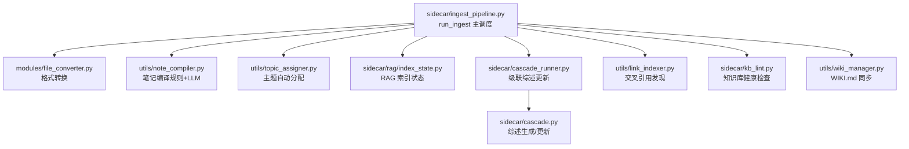
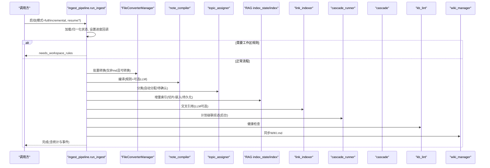
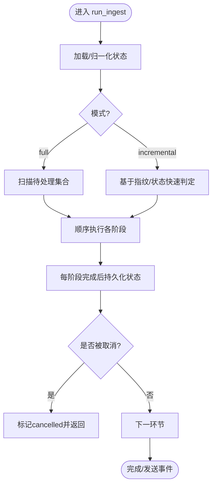
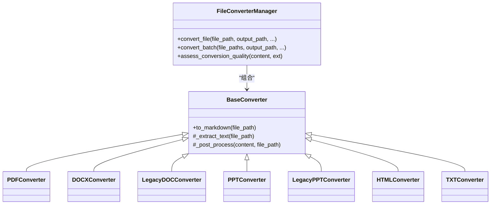
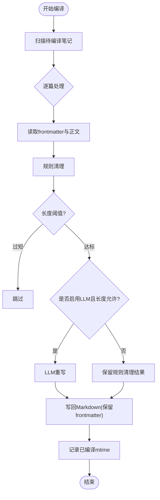
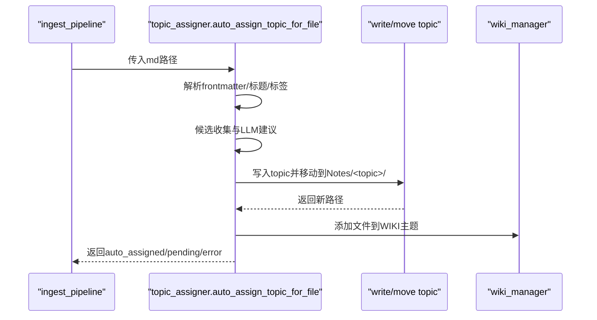
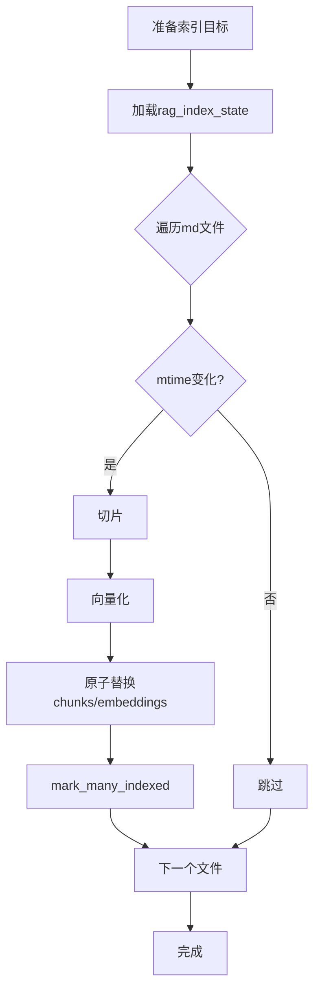
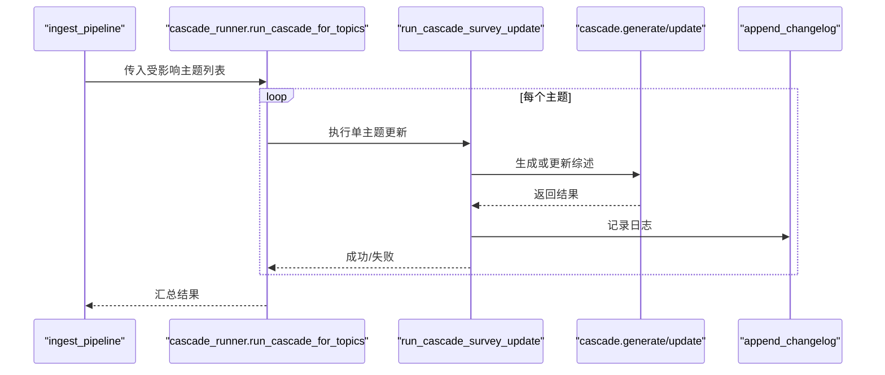
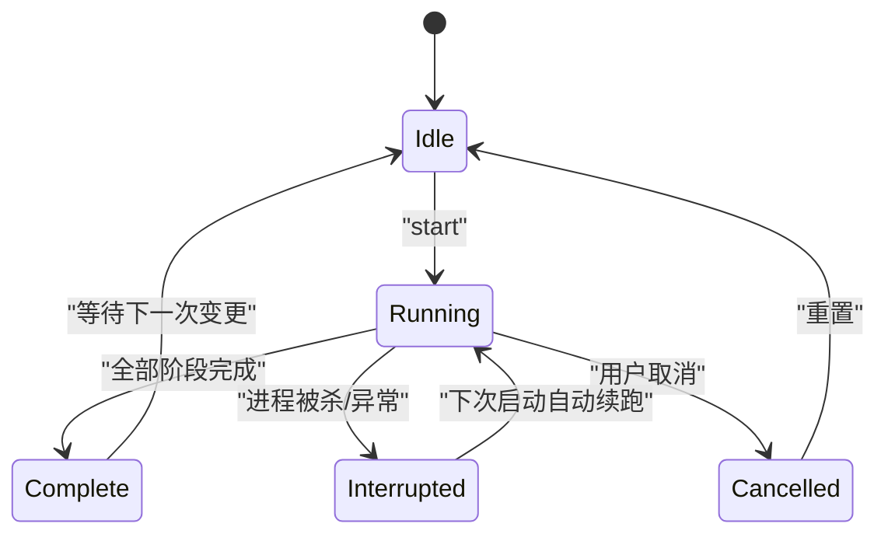

# 流水线概览

<cite>
**本文引用的文件**   
- [ingest_pipeline.py](file://python/sidecar/ingest_pipeline.py)
- [cascade_runner.py](file://python/sidecar/cascade_runner.py)
- [cascade.py](file://python/sidecar/cascade.py)
- [index_state.py](file://python/sidecar/rag/index_state.py)
- [compile_state.py](file://python/sidecar/compile_state.py)
- [conversion_state.py](file://python/sidecar/conversion_state.py)
- [note_compiler.py](file://utils/note_compiler.py)
- [file_converter.py](file://modules/file_converter.py)
- [topic_assigner.py](file://utils/topic_assigner.py)
</cite>

## 目录
1. [简介](#简介)
2. [项目结构](#项目结构)
3. [核心组件](#核心组件)
4. [架构总览](#架构总览)
5. [详细组件分析](#详细组件分析)
6. [依赖关系分析](#依赖关系分析)
7. [性能与可扩展性](#性能与可扩展性)
8. [故障排查指南](#故障排查指南)
9. [结论](#结论)
10. [附录：配置与使用示例](#附录配置与使用示例)

## 简介
本文件面向 NoteAI 入库流水线的整体架构与实现，系统性阐述从“文件监控 → 格式转换 → 内容编译 → 主题分类 → 向量索引 → 交叉引用 → 级联综述更新 → 健康检查 → Wiki 同步”的端到端流程。重点覆盖：
- 处理管道图、状态转换图与错误恢复策略
- 增量与全量模式的区别、断点续跑与状态持久化机制
- 关键模块的职责边界与数据流
- 如何扩展新阶段与自定义规则

## 项目结构
入库流水线位于 sidecar 层，围绕统一入口 run_ingest 编排多个阶段；各阶段通过轻量状态文件进行幂等与断点续跑。

图表来源
- [ingest_pipeline.py:480-947](file://python/sidecar/ingest_pipeline.py#L480-L947)
- [file_converter.py:407-770](file://modules/file_converter.py#L407-L770)
- [note_compiler.py:105-238](file://utils/note_compiler.py#L105-L238)
- [topic_assigner.py:318-328](file://utils/topic_assigner.py#L318-L328)
- [index_state.py:1-102](file://python/sidecar/rag/index_state.py#L1-L102)
- [cascade_runner.py:74-184](file://python/sidecar/cascade_runner.py#L74-L184)
- [cascade.py:312-386](file://python/sidecar/cascade.py#L312-L386)

章节来源
- [ingest_pipeline.py:1-23](file://python/sidecar/ingest_pipeline.py#L1-L23)

## 核心组件
- 统一调度器：定义阶段顺序、进度上报、取消信号、断点续跑与统计汇总。
- 转换器：多格式到 Markdown 的批量转换，支持质量评估与源文件归档。
- 编译器：对 PDF/Word/PPT/HTML/TXT 转出的笔记执行规则清理与可选 LLM 重写。
- 主题分配：基于路径、标题、标签与 LLM 建议的自动归类与移动。
- RAG 索引：按文件 mtime 增量切片、向量化与持久化，支持完整性修复。
- 级联综述：失败重试、事件推送、后台异步更新。
- 辅助状态：转换去重、编译去重、索引去重，确保幂等与快速跳过。

章节来源
- [ingest_pipeline.py:23-23](file://python/sidecar/ingest_pipeline.py#L23-L23)
- [file_converter.py:407-770](file://modules/file_converter.py#L407-L770)
- [note_compiler.py:105-238](file://utils/note_compiler.py#L105-L238)
- [topic_assigner.py:318-328](file://utils/topic_assigner.py#L318-L328)
- [index_state.py:1-102](file://python/sidecar/rag/index_state.py#L1-L102)
- [cascade_runner.py:74-184](file://python/sidecar/cascade_runner.py#L74-L184)

## 架构总览
下图展示一次完整入库调度的阶段序列、状态持久化与外部子系统交互。

图表来源
- [ingest_pipeline.py:480-947](file://python/sidecar/ingest_pipeline.py#L480-L947)
- [file_converter.py:407-770](file://modules/file_converter.py#L407-L770)
- [note_compiler.py:105-238](file://utils/note_compiler.py#L105-L238)
- [topic_assigner.py:318-328](file://utils/topic_assigner.py#L318-L328)
- [index_state.py:1-102](file://python/sidecar/rag/index_state.py#L1-L102)
- [cascade_runner.py:74-184](file://python/sidecar/cascade_runner.py#L74-L184)
- [cascade.py:312-386](file://python/sidecar/cascade.py#L312-L386)

## 详细组件分析

### 统一调度器：run_ingest
- 阶段常量：rules → convert → compile → classify → index → crossref → cascade → lint → sync
- 模式控制：
  - full：扫描所有可转换/需编译/需分类/需索引的文件
  - incremental：基于指纹与状态文件快速判断变更集
- 断点续跑：
  - 记录 completed_stages、affected_topics、pending_crossref_paths
  - 异常或中断后下次运行可从已完成的阶段继续
- 取消与恢复：
  - 全局取消事件与生成号，避免竞态
  - 捕获 _Cancelled 并保存 cancelled 状态
- 进度与事件：
  - send_progress(stage, progress, message, extra)
  - send_event({id:"event", result:{type:"ingest_complete", ...}})

图表来源
- [ingest_pipeline.py:480-947](file://python/sidecar/ingest_pipeline.py#L480-L947)

章节来源
- [ingest_pipeline.py:23-23](file://python/sidecar/ingest_pipeline.py#L23-L23)
- [ingest_pipeline.py:167-177](file://python/sidecar/ingest_pipeline.py#L167-L177)
- [ingest_pipeline.py:550-588](file://python/sidecar/ingest_pipeline.py#L550-L588)
- [ingest_pipeline.py:915-947](file://python/sidecar/ingest_pipeline.py#L915-L947)

### 阶段一：规则校验
- 若未配置工作区规则，提前终止并提示用户先完成规则设置。
- 成功后立即标记 rules 阶段完成。

章节来源
- [ingest_pipeline.py:598-620](file://python/sidecar/ingest_pipeline.py#L598-L620)

### 阶段二：格式转换
- 扫描 RAW 与 Notes 外的可转换文件（PDF/DOCX/DOC/PPTX/PPT/HTML/HTM/TXT）。
- 使用 FileConverterManager.convert_batch 批量转换，输出到 Notes 目录。
- 转换结果写入 conversion_state.json，避免重复转换。
- 可选将原文件归档至 Raw 目录，并在 frontmatter 中记录 source。

图表来源
- [file_converter.py:27-70](file://modules/file_converter.py#L27-L70)
- [file_converter.py:72-158](file://modules/file_converter.py#L72-L158)
- [file_converter.py:168-251](file://modules/file_converter.py#L168-L251)
- [file_converter.py:254-387](file://modules/file_converter.py#L254-L387)
- [file_converter.py:390-405](file://modules/file_converter.py#L390-L405)
- [file_converter.py:407-770](file://modules/file_converter.py#L407-L770)

章节来源
- [ingest_pipeline.py:627-656](file://python/sidecar/ingest_pipeline.py#L627-L656)
- [file_converter.py:407-770](file://modules/file_converter.py#L407-L770)
- [conversion_state.py:65-109](file://python/sidecar/conversion_state.py#L65-L109)

### 阶段三：内容编译
- 针对由 PDF/Word/PPT/HTML/TXT 转换而来的笔记，执行规则清理（页眉页脚、重复行、版权信息等），必要时调用 LLM 重写以提升可读性与结构化程度。
- 使用 compile_state.json 记录已编译文件的 mtime，避免重复编译。

图表来源
- [note_compiler.py:105-238](file://utils/note_compiler.py#L105-L238)
- [compile_state.py:45-55](file://python/sidecar/compile_state.py#L45-L55)

章节来源
- [ingest_pipeline.py:658-688](file://python/sidecar/ingest_pipeline.py#L658-L688)
- [note_compiler.py:105-238](file://utils/note_compiler.py#L105-L238)
- [compile_state.py:1-55](file://python/sidecar/compile_state.py#L1-L55)

### 阶段四：主题分类
- 对 Notes 下的孤儿文件（Inbox/Orphan）尝试自动分配主题：
  - 优先根据 Notes 子目录推断
  - 其次基于标题/标签候选匹配
  - 最后使用 LLM 建议（可配置阈值）
- 自动分配成功则移动到对应 Notes/<topic>/ 目录，并更新 WIKI 索引；否则加入待确认队列。

图表来源
- [topic_assigner.py:318-328](file://utils/topic_assigner.py#L318-L328)
- [topic_assigner.py:142-178](file://utils/topic_assigner.py#L142-L178)

章节来源
- [ingest_pipeline.py:690-733](file://python/sidecar/ingest_pipeline.py#L690-L733)
- [topic_assigner.py:318-328](file://utils/topic_assigner.py#L318-L328)

### 阶段五：向量索引
- 仅对 Notes 下 .md 文件进行增量索引：
  - 依据 rag_index_state.json 对比 mtime 决定是否重新切片与嵌入
  - 计算预期 chunk 数与实际 chunk 数不一致时触发全量修复
  - 原子替换 chunks/embeddings 并持久化状态
- 删除文件对应的索引条目，保持索引与磁盘一致。

图表来源
- [ingest_pipeline.py:350-462](file://python/sidecar/ingest_pipeline.py#L350-L462)
- [index_state.py:1-102](file://python/sidecar/rag/index_state.py#L1-L102)

章节来源
- [ingest_pipeline.py:747-788](file://python/sidecar/ingest_pipeline.py#L747-L788)
- [index_state.py:1-102](file://python/sidecar/rag/index_state.py#L1-L102)

### 阶段六：交叉引用
- 对实际发生改动的文件，使用 link_indexer 发现跨文件链接关系；当文件数量较少时使用 LLM 增强识别。
- 记录新增交叉引用条数，失败项聚合抛出。

章节来源
- [ingest_pipeline.py:790-834](file://python/sidecar/ingest_pipeline.py#L790-L834)

### 阶段七：级联综述更新
- 在入库阶段仅“计划”受影响的主题；真正的综述生成/更新在后台执行，避免阻塞主流程。
- 级联任务具备失败重试、事件推送与失败清单持久化能力。

图表来源
- [ingest_pipeline.py:836-860](file://python/sidecar/ingest_pipeline.py#L836-L860)
- [cascade_runner.py:74-184](file://python/sidecar/cascade_runner.py#L74-L184)
- [cascade.py:312-386](file://python/sidecar/cascade.py#L312-L386)

章节来源
- [cascade_runner.py:74-184](file://python/sidecar/cascade_runner.py#L74-L184)
- [cascade.py:312-386](file://python/sidecar/cascade.py#L312-L386)

### 阶段八：健康检查与Wiki同步
- 健康检查：检测断链、孤儿页、过时综述等，输出报告。
- Wiki 同步：根据当前 Notes 结构与主题关系更新 WIKI.md。

章节来源
- [ingest_pipeline.py:862-886](file://python/sidecar/ingest_pipeline.py#L862-L886)

### 状态管理与断点续跑
- 状态文件：ingest_state.json（运行状态、阶段、进度、统计、受影响的 topic 与待处理的 crossref 路径）
- 指纹文件：ingest_fingerprint.json（workspace 文件 mtime+size 快照，用于快速判断是否需要自检）
- 幂等状态：
  - conversion_state.json：source_sha256 → 已转换输出映射
  - compile_state.json：rel_path → last_compiled_mtime
  - rag_index_state.json：rel_path → last_indexed_mtime
- 断点续跑：resume=true 时恢复 completed_stages 与中间变量，跳过已完成阶段。

图表来源
- [ingest_pipeline.py:167-177](file://python/sidecar/ingest_pipeline.py#L167-L177)
- [ingest_pipeline.py:550-588](file://python/sidecar/ingest_pipeline.py#L550-L588)
- [ingest_pipeline.py:915-947](file://python/sidecar/ingest_pipeline.py#L915-L947)

章节来源
- [ingest_pipeline.py:107-145](file://python/sidecar/ingest_pipeline.py#L107-L145)
- [ingest_pipeline.py:40-105](file://python/sidecar/ingest_pipeline.py#L40-L105)
- [conversion_state.py:65-109](file://python/sidecar/conversion_state.py#L65-L109)
- [compile_state.py:21-55](file://python/sidecar/compile_state.py#L21-L55)
- [index_state.py:22-102](file://python/sidecar/rag/index_state.py#L22-L102)

## 依赖关系分析
- ingest_pipeline 作为编排者，依赖：
  - modules.file_converter：格式转换
  - utils.note_compiler：编译
  - utils.topic_assigner：分类
  - sidecar.rag.index_state / index：索引
  - utils.link_indexer：交叉引用
  - sidecar.cascade_runner / cascade：级联综述
  - sidecar.kb_lint：健康检查
  - utils.wiki_manager：Wiki 同步
- 状态文件均位于 WORKSPACE_APP_FOLDER 下，保证幂等与可恢复。

```mermaid
graph LR
IP["ingest_pipeline"] --> FC["file_converter"]
IP --> NC["note_compiler"]
IP --> TA["topic_assigner"]
IP --> IS["rag/index_state"]
IP --> LI["link_indexer"]
IP --> CR["cascade_runner"]
CR --> CS["cascade"]
IP --> KL["kb_lint"]
IP --> WM["wiki_manager"]
```

图表来源
- [ingest_pipeline.py:480-947](file://python/sidecar/ingest_pipeline.py#L480-L947)
- [cascade_runner.py:74-184](file://python/sidecar/cascade_runner.py#L74-L184)
- [cascade.py:312-386](file://python/sidecar/cascade.py#L312-L386)

章节来源
- [ingest_pipeline.py:480-947](file://python/sidecar/ingest_pipeline.py#L480-L947)

## 性能与可扩展性
- 快速自检：通过 workspace fingerprint 与 stage 完成度，避免不必要的扫描。
- 增量处理：
  - 转换：基于 source_sha256 去重
  - 编译：基于 mtime 阈值判断
  - 索引：基于 mtime 与 manifest 一致性校验
- 并发与锁：
  - RAG 索引操作采用互斥上下文，防止多实例同时写入
- 可扩展点：
  - 新增阶段：在 STAGES 中添加名称，并在 run_ingest 中插入相应逻辑，遵循 mark_stage_done 与进度回调约定
  - 自定义转换：继承 BaseConverter 并注册到 FileConverterManager
  - 自定义编译规则：在 note_compiler.rule_clean_markdown 中扩展正则与过滤策略
  - 自定义分类策略：在 topic_assigner 中增加候选收集或匹配逻辑

[本节为通用指导，不直接分析具体文件]

## 故障排查指南
- 常见错误与定位
  - 转换失败：查看转换结果中的 error 字段与 quality 指标，确认是否为乱码/扫描PDF导致
  - 编译失败：检查正文长度阈值与 LLM 配置，关注 rule-cleaned 后的长度
  - 分类失败：确认 Inbox/Orphan 路径与 frontmatter 是否缺失，查看 pending 列表
  - 索引失败：检查 RAG 索引是否被其他实例占用，或 manifest 与索引块数不一致
  - 级联失败：查看 cascade_failures.json 与日志，使用 retry_failed_cascades 重试
- 恢复手段
  - 断点续跑：将状态置为 interrupted/failed 后再次运行，自动恢复
  - 强制全量：设置 force_full_next 标志，触发全量扫描
  - 清理失败项：清除 cascade 失败记录后重试

章节来源
- [ingest_pipeline.py:929-947](file://python/sidecar/ingest_pipeline.py#L929-L947)
- [cascade_runner.py:187-195](file://python/sidecar/cascade_runner.py#L187-L195)

## 结论
NoteAI 入库流水线以“幂等+增量+断点续跑”为核心设计原则，通过清晰的分阶段编排与状态持久化，实现了高可靠、可扩展的知识库自动化处理。结合级联综述与健康检查，形成从原始文件到可检索知识资产的闭环。

[本节为总结，不直接分析具体文件]

## 附录：配置与使用示例
- 关键配置项（来自 settings/config）
  - NOTES_FOLDER、RAW_FOLDER、WORKSPACE_APP_FOLDER：工作区目录布局
  - RAG_INDEX_FOLDER：RAG 索引数据目录
  - ABSTRACT_FOLDER：综述与抽象文档目录
  - ingest_auto_enabled：是否启用自动入库
  - api_key：是否启用 LLM 相关功能（编译/分类/交叉引用/综述）
  - topic_auto_assign_threshold：自动分配主题的置信度阈值
- 典型用法
  - 手动触发：调用 run_ingest(mode="full"/"incremental", resume=True/False)
  - 指定文件：传入 file_paths 列表，仅处理这些文件
  - 强制全量：调用 request_full_ingest() 后再运行
  - 查询状态：load_ingest_state() 获取 status/stage/stats
  - 重试级联：retry_failed_cascades()
- 扩展新阶段
  - 在 STAGES 中添加阶段名
  - 在 run_ingest 中插入阶段逻辑，使用 prog/mark_stage_done 维护状态
  - 如需持久化状态，参考现有 state 文件模式（atomic write）

章节来源
- [ingest_pipeline.py:23-23](file://python/sidecar/ingest_pipeline.py#L23-L23)
- [ingest_pipeline.py:270-275](file://python/sidecar/ingest_pipeline.py#L270-L275)
- [ingest_pipeline.py:107-145](file://python/sidecar/ingest_pipeline.py#L107-L145)