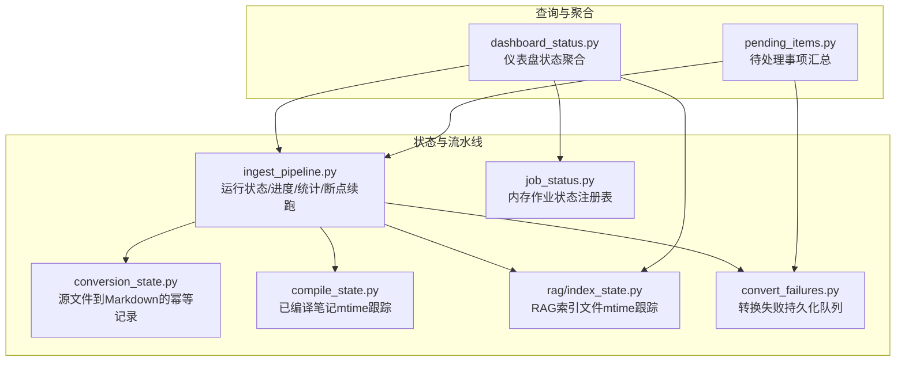
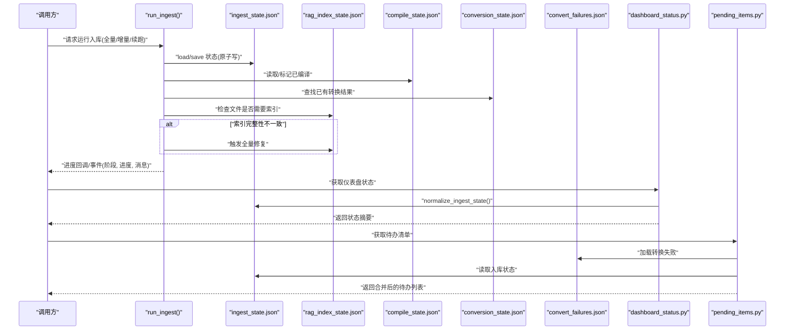
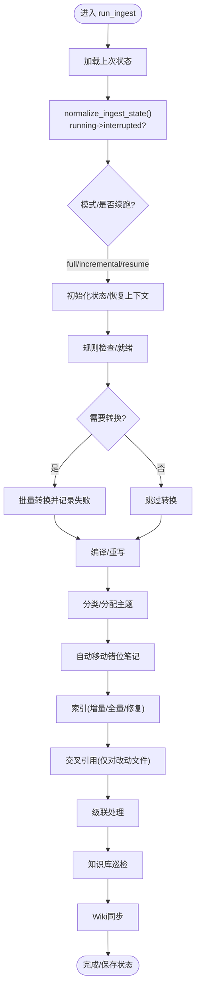
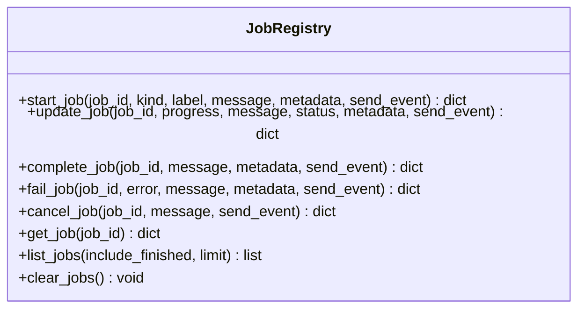
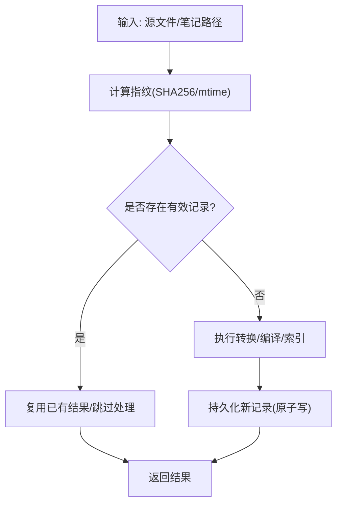
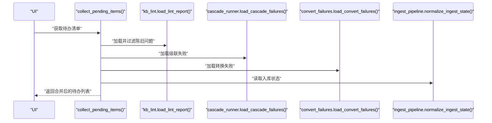
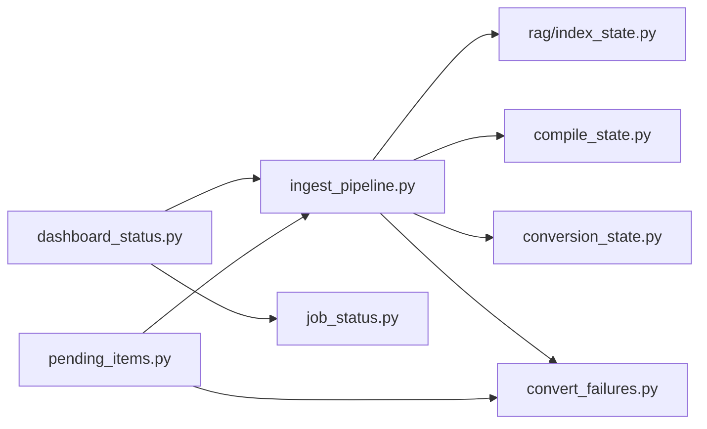

# 状态管理

<cite>
**本文引用的文件**   
- [ingest_pipeline.py](file://python/sidecar/ingest_pipeline.py)
- [job_status.py](file://python/sidecar/job_status.py)
- [conversion_state.py](file://python/sidecar/conversion_state.py)
- [compile_state.py](file://python/sidecar/compile_state.py)
- [index_state.py](file://python/sidecar/rag/index_state.py)
- [dashboard_status.py](file://python/sidecar/dashboard_status.py)
- [pending_items.py](file://python/sidecar/pending_items.py)
- [convert_failures.py](file://python/sidecar/convert_failures.py)
- [test_ingest_pipeline.py](file://tests/unit/test_ingest_pipeline.py)
- [test_job_status.py](file://tests/unit/test_job_status.py)
</cite>

## 目录
1. [简介](#简介)
2. [项目结构](#项目结构)
3. [核心组件](#核心组件)
4. [架构总览](#架构总览)
5. [详细组件分析](#详细组件分析)
6. [依赖关系分析](#依赖关系分析)
7. [性能考虑](#性能考虑)
8. [故障排查指南](#故障排查指南)
9. [结论](#结论)
10. [附录](#附录)

## 简介
本技术文档聚焦 NoteAI 入库流水线（Ingest Pipeline）的状态管理系统，围绕任务状态的持久化、断点续跑、并发与线程安全、查询与监控接口、历史分析与备份恢复等主题展开。文档面向不同技术背景的读者，提供从高层架构到代码级实现的系统化说明，并给出可操作的实践建议与排障指引。

## 项目结构
与状态管理相关的核心模块分布在 sidecar 子系统中，主要职责如下：
- 入库流水线状态与流程控制：ingest_pipeline.py
- 后台作业内存状态注册表：job_status.py
- 转换幂等记录：conversion_state.py
- 编译去重状态：compile_state.py
- RAG 索引去重状态：rag/index_state.py
- 仪表盘聚合与状态查询：dashboard_status.py
- 待处理事项聚合：pending_items.py
- 转换失败队列：convert_failures.py

图表来源
- [ingest_pipeline.py:1-120](file://python/sidecar/ingest_pipeline.py#L1-L120)
- [job_status.py:1-60](file://python/sidecar/job_status.py#L1-L60)
- [conversion_state.py:1-40](file://python/sidecar/conversion_state.py#L1-L40)
- [compile_state.py:1-30](file://python/sidecar/compile_state.py#L1-L30)
- [index_state.py:1-40](file://python/sidecar/rag/index_state.py#L1-L40)
- [dashboard_status.py:1-40](file://python/sidecar/dashboard_status.py#L1-L40)
- [pending_items.py:1-40](file://python/sidecar/pending_items.py#L1-L40)
- [convert_failures.py:1-40](file://python/sidecar/convert_failures.py#L1-L40)

章节来源
- [ingest_pipeline.py:1-120](file://python/sidecar/ingest_pipeline.py#L1-L120)
- [dashboard_status.py:1-40](file://python/sidecar/dashboard_status.py#L1-L40)

## 核心组件
- 入库流水线状态（持久化）
  - 状态文件：工作区应用目录下的 ingest_state.json
  - 关键键值：status、stage、progress、message、stats、completed_stages、mode、file_paths、resume、last_complete_at、interrupted_at、affected_topics、pending_crossref_paths 等
  - 原子写入：通过临时文件 + os.replace 实现无锁替换，避免部分写入导致损坏
- 后台作业状态（内存）
  - 进程内有序字典维护最近 N 个作业，支持 start/update/complete/fail/cancel/list/get/clear
  - 事件推送：统一以 job_update 事件形式广播
- 幂等与增量优化
  - 转换幂等：conversion_state.json 记录 source_sha256 -> output 映射，避免重复转换
  - 编译去重：compile_state.json 记录相对路径 -> mtime，跳过未变更文件
  - RAG 索引去重：rag_index_state.json 记录相对路径 -> mtime，结合 manifest 校验完整性
- 失败与待办
  - convert_failures.json 记录转换失败项，供 UI 展示与重试
  - pending_items 聚合 topic/link/lint/cascade/convert/ingest 等多类待办

章节来源
- [ingest_pipeline.py:107-178](file://python/sidecar/ingest_pipeline.py#L107-L178)
- [job_status.py:35-189](file://python/sidecar/job_status.py#L35-L189)
- [conversion_state.py:65-109](file://python/sidecar/conversion_state.py#L65-L109)
- [compile_state.py:21-55](file://python/sidecar/compile_state.py#L21-L55)
- [index_state.py:22-102](file://python/sidecar/rag/index_state.py#L22-L102)
- [convert_failures.py:22-100](file://python/sidecar/convert_failures.py#L22-L100)

## 架构总览
下图展示了状态管理与流水线执行的关键交互：状态读写、取消信号、阶段推进、索引完整性检查与修复、以及仪表盘与待办聚合。

图表来源
- [ingest_pipeline.py:480-800](file://python/sidecar/ingest_pipeline.py#L480-L800)
- [index_state.py:75-102](file://python/sidecar/rag/index_state.py#L75-L102)
- [compile_state.py:45-55](file://python/sidecar/compile_state.py#L45-L55)
- [conversion_state.py:65-86](file://python/sidecar/conversion_state.py#L65-L86)
- [convert_failures.py:22-52](file://python/sidecar/convert_failures.py#L22-L52)
- [dashboard_status.py:97-124](file://python/sidecar/dashboard_status.py#L97-L124)
- [pending_items.py:72-195](file://python/sidecar/pending_items.py#L72-L195)

## 详细组件分析

### 入库流水线状态与断点续跑
- 状态文件与字段
  - 位置：工作区应用目录 ingest_state.json
  - 关键字段：status、stage、progress、message、stats、completed_stages、mode、file_paths、resume、last_complete_at、interrupted_at、affected_topics、pending_crossref_paths
- 断点续跑策略
  - 启动时 normalize_ingest_state() 将残留 running 状态修正为 interrupted，并追加提示以便自动续跑
  - run_ingest() 在 resume=True 时恢复 completed_stages、pending_crossref_paths、affected_topics 等上下文
  - 阶段完成通过 mark_stage_done() 持久化，确保中断后可从下一未完成阶段继续
- 进度与统计
  - 每阶段更新 stage/progress/message/stats，并通过回调 send_progress/send_event 上报
  - stats 包含 converted/compiled/classified/indexed_files/cascade_updated/cascade_failed/cascade_topics 等
- 取消机制
  - 基于全局 Event + generation 计数，支持“调度后取消”语义，避免竞态
- 索引完整性与修复
  - 对比 manifest 期望 chunk 数与实际数量，若不一致则触发全量修复
  - 删除磁盘不存在的文件对应的 chunks 与状态条目，保持数据一致性

图表来源
- [ingest_pipeline.py:167-178](file://python/sidecar/ingest_pipeline.py#L167-L178)
- [ingest_pipeline.py:480-800](file://python/sidecar/ingest_pipeline.py#L480-L800)

章节来源
- [ingest_pipeline.py:107-178](file://python/sidecar/ingest_pipeline.py#L107-L178)
- [ingest_pipeline.py:480-800](file://python/sidecar/ingest_pipeline.py#L480-L800)
- [test_ingest_pipeline.py:27-74](file://tests/unit/test_ingest_pipeline.py#L27-L74)
- [test_ingest_pipeline.py:173-212](file://tests/unit/test_ingest_pipeline.py#L173-L212)
- [test_ingest_pipeline.py:238-286](file://tests/unit/test_ingest_pipeline.py#L238-L286)

### 后台作业状态注册表（内存）
- 数据结构
  - 进程内 OrderedDict 维护作业，限制最大数量，按更新时间排序
- 生命周期
  - start_job/update_job/complete_job/fail_job/cancel_job/get_job/list_jobs/clear_jobs
- 事件推送
  - 每次状态变更均发送 job_update 事件，便于前端实时刷新
- 线程安全
  - 所有操作使用全局 Lock 保护

图表来源
- [job_status.py:35-189](file://python/sidecar/job_status.py#L35-L189)

章节来源
- [job_status.py:1-189](file://python/sidecar/job_status.py#L1-L189)
- [test_job_status.py:11-41](file://tests/unit/test_job_status.py#L11-L41)

### 幂等与增量优化（转换/编译/索引）
- 转换幂等（conversion_state.json）
  - 计算源文件 SHA256，记录输出路径；若存在且目标文件存在则直接复用
- 编译去重（compile_state.json）
  - 记录相对路径与 mtime，mtime 差异阈值用于判定是否需要重新编译
- RAG 索引去重（rag_index_state.json）
  - 记录相对路径与 mtime；缺失辅助状态时可从 manifest 恢复
  - 支持批量标记已索引与移除失效条目

图表来源
- [conversion_state.py:65-109](file://python/sidecar/conversion_state.py#L65-L109)
- [compile_state.py:45-55](file://python/sidecar/compile_state.py#L45-L55)
- [index_state.py:75-102](file://python/sidecar/rag/index_state.py#L75-L102)

章节来源
- [conversion_state.py:1-109](file://python/sidecar/conversion_state.py#L1-L109)
- [compile_state.py:1-55](file://python/sidecar/compile_state.py#L1-L55)
- [index_state.py:1-102](file://python/sidecar/rag/index_state.py#L1-L102)

### 失败与待办聚合
- 转换失败队列（convert_failures.json）
  - 记录 file/error/ts，支持清理失效条目与批量结果回填
- 待办聚合（pending_items）
  - 合并 topic_pending、lint、cascade_fail、convert_fail、ingest 等来源
  - 根据优先级与时间戳排序，供 UI 展示与引导用户处理

图表来源
- [pending_items.py:72-195](file://python/sidecar/pending_items.py#L72-L195)
- [convert_failures.py:22-80](file://python/sidecar/convert_failures.py#L22-L80)
- [ingest_pipeline.py:167-178](file://python/sidecar/ingest_pipeline.py#L167-L178)

章节来源
- [pending_items.py:1-195](file://python/sidecar/pending_items.py#L1-L195)
- [convert_failures.py:1-100](file://python/sidecar/convert_failures.py#L1-L100)

### 仪表盘与状态查询接口
- 仪表盘状态聚合（dashboard_status.py）
  - ingest_status(): 封装 normalize_ingest_state() 并返回 status/stage/progress/message/stats/running/needs_resume/can_retry
  - rag_index_status(): 报告索引启用/构建/忙碌/重建需求/块数对比
  - get_dashboard_status(): 汇总 notes/topics、pending_summary、jobs、update_plan、index 等
- 使用方法
  - 前端定时轮询或订阅事件，渲染当前运行阶段、进度条、统计信息、待办入口

章节来源
- [dashboard_status.py:62-124](file://python/sidecar/dashboard_status.py#L62-L124)

## 依赖关系分析
- 组件耦合
  - ingest_pipeline 强依赖 index_state/compile_state/conversion_state 进行增量判断与幂等
  - dashboard_status 聚合 ingest 与 jobs 状态，对外暴露统一视图
  - pending_items 聚合多来源失败与待办，形成统一入口
- 外部依赖
  - RAG 索引模块（manifest/chunks/embeddings）
  - 文件系统（工作区 Notes/Raw/wiki 等目录）
- 潜在循环依赖
  - 通过函数式导入与延迟导入规避循环（如 utils.note_compiler、sidecar.rag.*）

图表来源
- [ingest_pipeline.py:1-120](file://python/sidecar/ingest_pipeline.py#L1-L120)
- [dashboard_status.py:1-40](file://python/sidecar/dashboard_status.py#L1-L40)
- [pending_items.py:1-40](file://python/sidecar/pending_items.py#L1-L40)

章节来源
- [ingest_pipeline.py:1-120](file://python/sidecar/ingest_pipeline.py#L1-L120)
- [dashboard_status.py:1-40](file://python/sidecar/dashboard_status.py#L1-L40)
- [pending_items.py:1-40](file://python/sidecar/pending_items.py#L1-L40)

## 性能考虑
- 原子写入与最小化 I/O
  - 状态文件采用临时文件 + os.replace，减少锁竞争与损坏风险
- 增量与幂等
  - 通过 mtime/SHA256 快速跳过未变更文件，降低 CPU/IO 开销
- 索引完整性自检
  - 仅在必要时触发全量修复，避免频繁重建
- 内存作业表上限
  - 限制最大作业数，防止内存增长

[本节为通用指导，无需特定文件来源]

## 故障排查指南
- 常见状态与含义
  - idle/running/interrupted/failed/completed/cancelled
  - needs_workspace_rules：需先配置整理规则
- 定位步骤
  - 查看 ingest_state.json 的 status/stage/message/stats
  - 检查 rag_index_state.json 与 manifest 的一致性
  - 查看 convert_failures.json 中的错误详情
  - 使用仪表盘接口获取综合状态与待办
- 恢复与重试
  - 对于 interrupted/failed，可直接再次运行（resume=True），系统会恢复上下文
  - 对于索引不一致，允许自动修复或手动触发全量重建
- 日志与事件
  - 关注 send_progress 与 event 回调，定位具体阶段失败原因

章节来源
- [ingest_pipeline.py:167-178](file://python/sidecar/ingest_pipeline.py#L167-L178)
- [dashboard_status.py:97-124](file://python/sidecar/dashboard_status.py#L97-L124)
- [convert_failures.py:22-80](file://python/sidecar/convert_failures.py#L22-L80)
- [test_ingest_pipeline.py:52-74](file://tests/unit/test_ingest_pipeline.py#L52-L74)

## 结论
NoteAI 的状态管理系统以“轻量持久化 + 幂等增量 + 原子写入 + 事件驱动”为核心设计，既保证了高可用与可恢复性，又兼顾了性能与可观测性。通过统一的仪表盘与待办聚合，用户可直观掌握系统健康度与下一步动作。建议在部署中配合定期备份与监控告警，进一步提升稳定性。

[本节为总结性内容，无需特定文件来源]

## 附录

### 状态文件与键值参考
- ingest_state.json
  - 关键字段：status、stage、progress、message、stats、completed_stages、mode、file_paths、resume、last_complete_at、interrupted_at、affected_topics、pending_crossref_paths
- conversion_state.json
  - sources: {source_sha256: {output, source_name}}
- compile_state.json
  - files: {relative_path: mtime}
- rag_index_state.json
  - files: {relative_path: mtime}
- convert_failures.json
  - items: [{file, error, ts}]

章节来源
- [ingest_pipeline.py:107-178](file://python/sidecar/ingest_pipeline.py#L107-L178)
- [conversion_state.py:26-42](file://python/sidecar/conversion_state.py#L26-L42)
- [compile_state.py:21-33](file://python/sidecar/compile_state.py#L21-L33)
- [index_state.py:22-49](file://python/sidecar/rag/index_state.py#L22-L49)
- [convert_failures.py:22-52](file://python/sidecar/convert_failures.py#L22-L52)

### 并发访问控制与线程安全
- 全局锁
  - 状态写入使用 _state_lock 保护，避免并发覆盖
- 取消信号
  - 基于 threading.Event + generation 计数，保证“调度后取消”语义不被清理事件影响
- 内存作业表
  - 使用全局 Lock 保护所有读写，确保一致性与顺序

章节来源
- [ingest_pipeline.py:25-28](file://python/sidecar/ingest_pipeline.py#L25-L28)
- [ingest_pipeline.py:147-165](file://python/sidecar/ingest_pipeline.py#L147-L165)
- [job_status.py:13-189](file://python/sidecar/job_status.py#L13-L189)

### 实时监控与历史分析
- 实时监控
  - 通过仪表盘接口周期性拉取 ingest_status/jobs/index 等状态
  - 订阅 job_update 事件，实现细粒度进度反馈
- 历史分析
  - 基于 ingest_state.json 的 stats 与 completed_stages 回溯各阶段耗时与成功率
  - 结合 convert_failures.json 与 pending_items 分析失败趋势与热点

章节来源
- [dashboard_status.py:97-124](file://python/sidecar/dashboard_status.py#L97-L124)
- [job_status.py:26-33](file://python/sidecar/job_status.py#L26-L33)
- [convert_failures.py:22-80](file://python/sidecar/convert_failures.py#L22-L80)

### 状态文件备份与恢复最佳实践
- 备份范围
  - .noteai 目录下 ingest_state.json、conversion_state.json、compile_state.json、rag_index_state.json、convert_failures.json
- 恢复策略
  - 停止服务后复制备份文件至对应工作区
  - 重启后由 normalize_ingest_state() 自动修正异常状态
- 一致性校验
  - 比对 rag_index_state.json 与 manifest 的 chunk 数，必要时触发修复

章节来源
- [ingest_pipeline.py:167-178](file://python/sidecar/ingest_pipeline.py#L167-L178)
- [index_state.py:22-49](file://python/sidecar/rag/index_state.py#L22-L49)