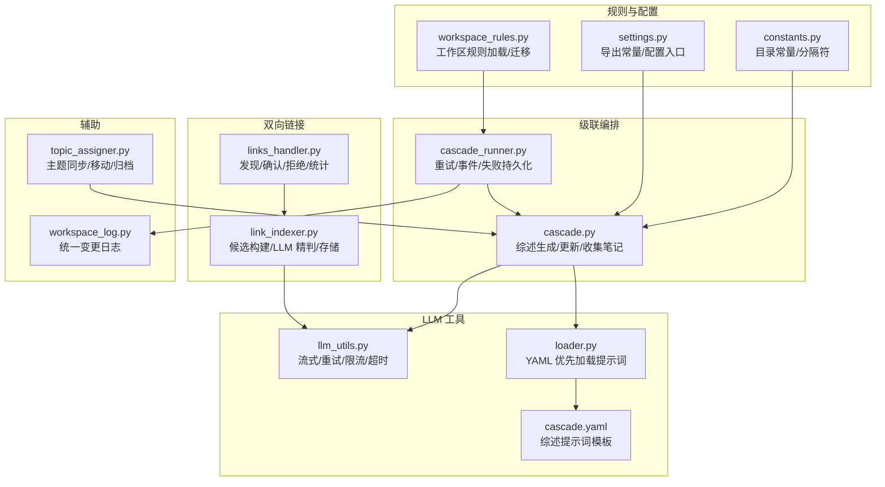
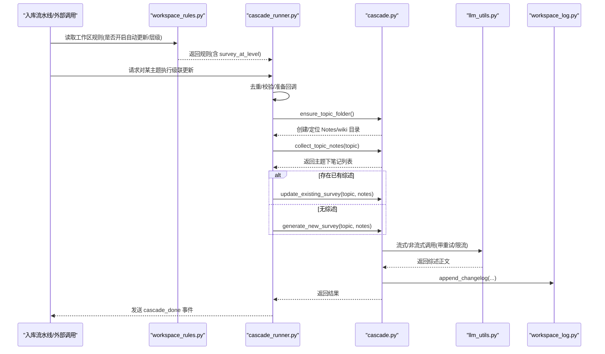
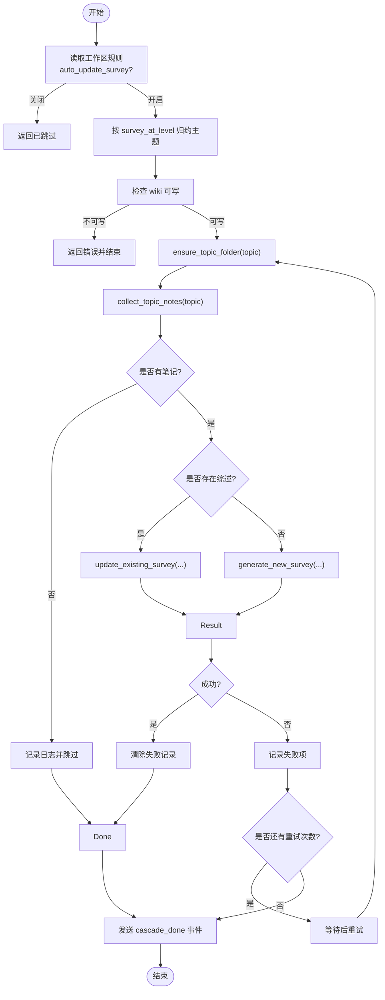
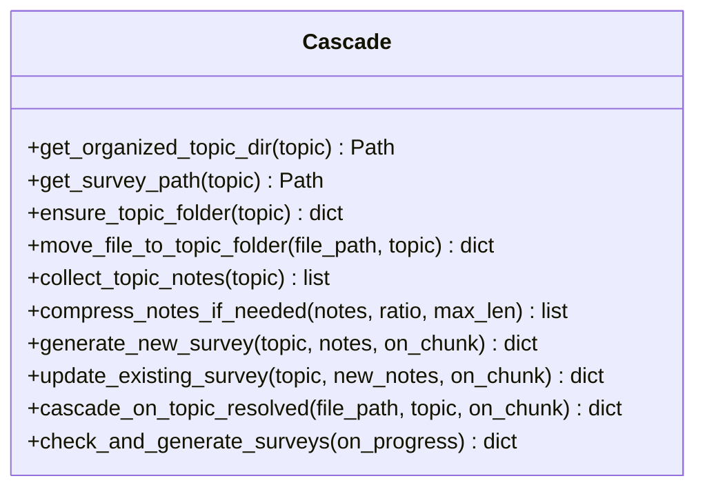
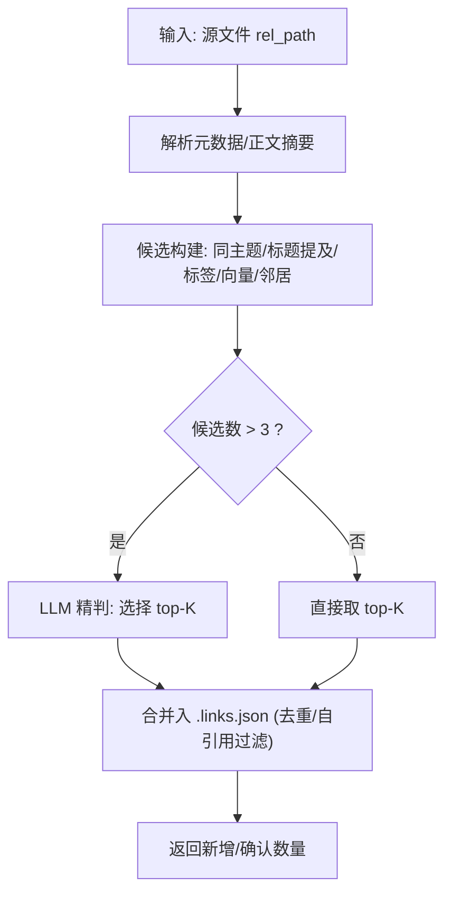
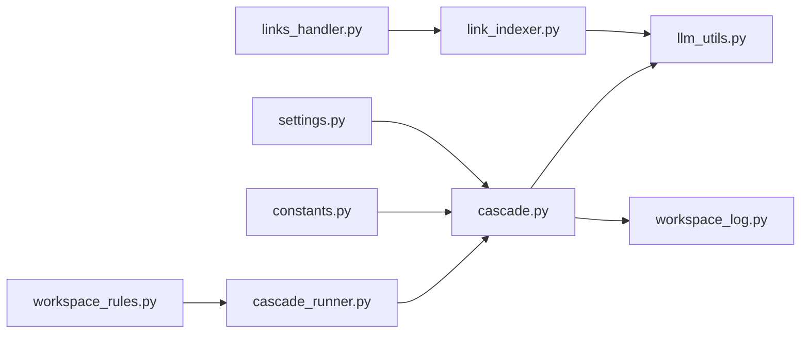

# 级联更新阶段

<cite>
**本文引用的文件**   
- [cascade.py](file://python/sidecar/cascade.py)
- [cascade_runner.py](file://python/sidecar/cascade_runner.py)
- [workspace_rules.py](file://python/sidecar/workspace_rules.py)
- [constants.py](file://config/constants.py)
- [settings.py](file://config/settings.py)
- [llm_utils.py](file://utils/llm_utils.py)
- [link_indexer.py](file://utils/link_indexer.py)
- [links_handler.py](file://python/sidecar/handlers/links_handler.py)
- [workspace_log.py](file://utils/workspace_log.py)
- [topic_assigner.py](file://utils/topic_assigner.py)
- [loader.py](file://prompts/loader.py)
- [cascade.yaml](file://prompts/yaml/cascade.yaml)
</cite>

## 目录
1. [简介](#简介)
2. [项目结构](#项目结构)
3. [核心组件](#核心组件)
4. [架构总览](#架构总览)
5. [详细组件分析](#详细组件分析)
6. [依赖关系分析](#依赖关系分析)
7. [性能考虑](#性能考虑)
8. [故障排查指南](#故障排查指南)
9. [结论](#结论)
10. [附录](#附录)

## 简介
本文件面向 NoteAI 入库流水线的“级联更新阶段”，聚焦知识关联的自动更新机制与主题综述的自动生成/增量更新。文档覆盖以下关键能力：
- 双向链接重建与相关性分析算法（基于启发式 + LLM 精判）
- 主题综述生成与增量更新（新综述 vs 已有综述合并）
- 级联更新的触发条件、依赖解析与执行顺序控制
- 更新范围确定、影响评估与失败持久化（重试与回滚建议）
- 级联规则配置、扩展接口与性能优化技巧
- 效果验证方法与异常处理方案

## 项目结构
级联更新涉及侧车服务中的多个模块，围绕“工作区规则”、“级联编排”、“LLM 调用”、“双向链接索引”和“日志记录”展开。

图示来源
- [workspace_rules.py:1-200](file://python/sidecar/workspace_rules.py#L1-L200)
- [constants.py:1-52](file://config/constants.py#L1-L52)
- [settings.py:1-41](file://config/settings.py#L1-L41)
- [cascade_runner.py:1-219](file://python/sidecar/cascade_runner.py#L1-L219)
- [cascade.py:1-526](file://python/sidecar/cascade.py#L1-L526)
- [llm_utils.py:1-610](file://utils/llm_utils.py#L1-L610)
- [loader.py:1-115](file://prompts/loader.py#L1-L115)
- [cascade.yaml:1-72](file://prompts/yaml/cascade.yaml#L1-L72)
- [link_indexer.py:1-800](file://utils/link_indexer.py#L1-L800)
- [links_handler.py:1-85](file://python/sidecar/handlers/links_handler.py#L1-L85)
- [workspace_log.py:1-254](file://utils/workspace_log.py#L1-L254)
- [topic_assigner.py:1-418](file://utils/topic_assigner.py#L1-L418)

章节来源
- [workspace_rules.py:1-200](file://python/sidecar/workspace_rules.py#L1-L200)
- [constants.py:1-52](file://config/constants.py#L1-L52)
- [settings.py:1-41](file://config/settings.py#L1-L41)
- [cascade_runner.py:1-219](file://python/sidecar/cascade_runner.py#L1-L219)
- [cascade.py:1-526](file://python/sidecar/cascade.py#L1-L526)
- [llm_utils.py:1-610](file://utils/llm_utils.py#L1-L610)
- [link_indexer.py:1-800](file://utils/link_indexer.py#L1-L800)
- [links_handler.py:1-85](file://python/sidecar/handlers/links_handler.py#L1-L85)
- [workspace_log.py:1-254](file://utils/workspace_log.py#L1-L254)
- [topic_assigner.py:1-418](file://utils/topic_assigner.py#L1-L418)
- [loader.py:1-115](file://prompts/loader.py#L1-L115)
- [cascade.yaml:1-72](file://prompts/yaml/cascade.yaml#L1-L72)

## 核心组件
- 级联编排器 cascade_runner：负责重试、事件推送、失败持久化与批量执行。
- 级联逻辑 cascade：负责主题文件夹管理、笔记收集、综述生成/更新、压缩策略与日志。
- 工作区规则 workspace_rules：提供 auto_update_survey、survey_at_level 等开关与迁移。
- LLM 工具 llm_utils：统一的流式/非流式调用、指数退避重试、并发限制与超时控制。
- 双向链接 link_indexer：两阶段发现（启发式粗筛 + LLM 精判），并维护 .links.json。
- 链接处理器 links_handler：对外暴露发现/确认/拒绝/统计等 API。
- 日志 workspace_log：统一写入 wiki/log.md，支持历史迁移与分页读取。
- 主题分配 topic_assigner：从 Notes 目录结构推断主题、移动文件、触发 wiki 同步。
- 提示词 loader 与 YAML：YAML 优先加载，Python 常量作为后备。

章节来源
- [cascade_runner.py:1-219](file://python/sidecar/cascade_runner.py#L1-L219)
- [cascade.py:1-526](file://python/sidecar/cascade.py#L1-L526)
- [workspace_rules.py:1-200](file://python/sidecar/workspace_rules.py#L1-L200)
- [llm_utils.py:1-610](file://utils/llm_utils.py#L1-L610)
- [link_indexer.py:1-800](file://utils/link_indexer.py#L1-L800)
- [links_handler.py:1-85](file://python/sidecar/handlers/links_handler.py#L1-L85)
- [workspace_log.py:1-254](file://utils/workspace_log.py#L1-L254)
- [topic_assigner.py:1-418](file://utils/topic_assigner.py#L1-L418)
- [loader.py:1-115](file://prompts/loader.py#L1-L115)
- [cascade.yaml:1-72](file://prompts/yaml/cascade.yaml#L1-L72)

## 架构总览
级联更新在入库流水线中由“主题解析 → 规则判定 → 级联编排 → 综述生成/更新 → 日志记录”构成闭环；同时与“双向链接重建”并行或串行协作，确保知识图谱与综述内容一致。

图示来源
- [workspace_rules.py:163-169](file://python/sidecar/workspace_rules.py#L163-L169)
- [cascade_runner.py:74-154](file://python/sidecar/cascade_runner.py#L74-L154)
- [cascade.py:388-426](file://python/sidecar/cascade.py#L388-L426)
- [llm_utils.py:232-295](file://utils/llm_utils.py#L232-L295)
- [workspace_log.py:36-79](file://utils/workspace_log.py#L36-L79)

## 详细组件分析

### 级联编排器（cascade_runner）
职责
- 读取工作区规则，决定是否跳过自动更新。
- 根据 survey_at_level 将具体主题归约到综述层级。
- 保证 wiki 可写权限后再执行。
- 循环重试（最多 MAX_RETRIES），失败持久化到 cascade_failures.json。
- 通过 send_response/on_chunk 向前端推送进度与分片。

关键流程
- 单主题更新：run_cascade_survey_update
- 批量更新：run_cascade_for_topics
- 失败重试：retry_failed_cascades

图示来源
- [cascade_runner.py:74-154](file://python/sidecar/cascade_runner.py#L74-L154)
- [cascade_runner.py:156-194](file://python/sidecar/cascade_runner.py#L156-L194)
- [cascade_runner.py:187-194](file://python/sidecar/cascade_runner.py#L187-L194)
- [workspace_rules.py:163-169](file://python/sidecar/workspace_rules.py#L163-L169)
- [cascade.py:56-76](file://python/sidecar/cascade.py#L56-L76)
- [cascade.py:118-178](file://python/sidecar/cascade.py#L118-L178)
- [cascade.py:312-346](file://python/sidecar/cascade.py#L312-L346)
- [cascade.py:348-386](file://python/sidecar/cascade.py#L348-L386)

章节来源
- [cascade_runner.py:1-219](file://python/sidecar/cascade_runner.py#L1-L219)
- [workspace_rules.py:15-92](file://python/sidecar/workspace_rules.py#L15-L92)
- [cascade.py:56-76](file://python/sidecar/cascade.py#L56-L76)
- [cascade.py:118-178](file://python/sidecar/cascade.py#L118-L178)
- [cascade.py:312-346](file://python/sidecar/cascade.py#L312-L346)
- [cascade.py:348-386](file://python/sidecar/cascade.py#L348-L386)

### 级联逻辑（cascade）
职责
- 主题路径安全化与目录创建。
- 收集主题下所有笔记（排除 wiki 与综述文件）。
- 长文本压缩（SnowNLP 优先，jieba 降级）。
- 生成新综述或增量更新已有综述。
- 修复旧综述 frontmatter。
- 批量补生成综述（遍历 wiki 标题）。

要点
- 主题分隔符来自 constants.TOPIC_SEP。
- 综述输出位置为 ABSTRACT_FOLDER 下的叶子名_综述.md。
- 新增/更新均使用 prompts 提供的模板（YAML 优先）。

图示来源
- [cascade.py:14-54](file://python/sidecar/cascade.py#L14-L54)
- [cascade.py:56-76](file://python/sidecar/cascade.py#L56-L76)
- [cascade.py:118-178](file://python/sidecar/cascade.py#L118-L178)
- [cascade.py:181-264](file://python/sidecar/cascade.py#L181-L264)
- [cascade.py:312-346](file://python/sidecar/cascade.py#L312-L346)
- [cascade.py:348-386](file://python/sidecar/cascade.py#L348-L386)
- [cascade.py:388-426](file://python/sidecar/cascade.py#L388-L426)
- [cascade.py:449-519](file://python/sidecar/cascade.py#L449-L519)

章节来源
- [cascade.py:1-526](file://python/sidecar/cascade.py#L1-L526)
- [constants.py:26-33](file://config/constants.py#L26-L33)
- [loader.py:34-46](file://prompts/loader.py#L34-L46)
- [cascade.yaml:1-72](file://prompts/yaml/cascade.yaml#L1-L72)

### 双向链接重建与相关性分析（link_indexer）
两阶段发现
- 第一阶段（本地启发式）：同主题、共享标签、文件名 token 重叠、向量检索候选、邻居传播。
- 第二阶段（LLM 精判）：对候选进行批处理判断，提取 JSON 数组并落盘。

存储与去重
- 有向链接键 from→to，自引用丢弃，README 忽略。
- 去重保留首次出现且优先 confirmed。
- 清理失效链接与 README 链接，自动确认未确认但有效的链接。

图示来源
- [link_indexer.py:430-560](file://utils/link_indexer.py#L430-L560)
- [link_indexer.py:690-737](file://utils/link_indexer.py#L690-L737)
- [link_indexer.py:740-800](file://utils/link_indexer.py#L740-L800)
- [link_indexer.py:136-154](file://utils/link_indexer.py#L136-L154)
- [link_indexer.py:171-203](file://utils/link_indexer.py#L171-L203)

章节来源
- [link_indexer.py:1-800](file://utils/link_indexer.py#L1-L800)
- [links_handler.py:1-85](file://python/sidecar/handlers/links_handler.py#L1-L85)

### 主题同步与移动（topic_assigner）
- 当文件位于 Notes/子目录时，从路径推断主题并写入 frontmatter。
- 若不在正确目录且非综述，则移动到目标主题目录，并触发 wiki 同步。
- 与级联更新联动：主题变化后，级联会重新收集笔记并更新综述。

章节来源
- [topic_assigner.py:40-92](file://utils/topic_assigner.py#L40-L92)
- [topic_assigner.py:330-418](file://utils/topic_assigner.py#L330-L418)

### 日志与审计（workspace_log）
- 统一写入 wiki/log.md，按日分组，支持解析与历史迁移。
- 级联各阶段操作均追加日志条目，便于追踪与回溯。

章节来源
- [workspace_log.py:36-79](file://utils/workspace_log.py#L36-L79)
- [workspace_log.py:82-115](file://utils/workspace_log.py#L82-L115)
- [workspace_log.py:229-254](file://utils/workspace_log.py#L229-L254)

## 依赖关系分析
- 规则层：workspace_rules 决定行为开关与层级归约。
- 编排层：cascade_runner 协调 cascade 与外部资源（wiki 可写性、失败持久化）。
- 模型层：llm_utils 提供稳定调用（重试/限流/超时/流式）。
- 数据层：link_indexer 维护 .links.json；workspace_log 维护 wiki/log.md。
- 文件系统：constants 定义 NOTES/ABSTRACT 等目录常量。

图示来源
- [workspace_rules.py:1-200](file://python/sidecar/workspace_rules.py#L1-L200)
- [cascade_runner.py:1-219](file://python/sidecar/cascade_runner.py#L1-L219)
- [cascade.py:1-526](file://python/sidecar/cascade.py#L1-L526)
- [llm_utils.py:1-610](file://utils/llm_utils.py#L1-L610)
- [workspace_log.py:1-254](file://utils/workspace_log.py#L1-L254)
- [link_indexer.py:1-800](file://utils/link_indexer.py#L1-L800)
- [links_handler.py:1-85](file://python/sidecar/handlers/links_handler.py#L1-L85)
- [constants.py:1-52](file://config/constants.py#L1-L52)
- [settings.py:1-41](file://config/settings.py#L1-L41)

章节来源
- [workspace_rules.py:1-200](file://python/sidecar/workspace_rules.py#L1-L200)
- [cascade_runner.py:1-219](file://python/sidecar/cascade_runner.py#L1-L219)
- [cascade.py:1-526](file://python/sidecar/cascade.py#L1-L526)
- [llm_utils.py:1-610](file://utils/llm_utils.py#L1-L610)
- [workspace_log.py:1-254](file://utils/workspace_log.py#L1-L254)
- [link_indexer.py:1-800](file://utils/link_indexer.py#L1-L800)
- [links_handler.py:1-85](file://python/sidecar/handlers/links_handler.py#L1-L85)
- [constants.py:1-52](file://config/constants.py#L1-L52)
- [settings.py:1-41](file://config/settings.py#L1-L41)

## 性能考虑
- LLM 并发与限流：全局信号量限制并发，线程池执行，指数退避重试，超时保护。
- 提示词长度控制：超出上下文预算时自动摘要/压缩/截断。
- 笔记压缩：长笔记按阈值与比例压缩，降低 LLM 输入成本。
- 链接发现缓存：按 mtime 增量缓存文件元数据，避免全量解析。
- 批量与分批：链接 LLM 精判采用批次大小限制，减少单次负载。
- 日志写入：原子替换与每日行数上限，避免大文件 I/O 瓶颈。

章节来源
- [llm_utils.py:33-83](file://utils/llm_utils.py#L33-L83)
- [llm_utils.py:187-195](file://utils/llm_utils.py#L187-L195)
- [cascade.py:181-264](file://python/sidecar/cascade.py#L181-L264)
- [link_indexer.py:638-676](file://utils/link_indexer.py#L638-L676)
- [workspace_log.py:36-79](file://utils/workspace_log.py#L36-L79)

## 故障排查指南
常见问题与定位
- API 未配置/无效：检查 check_api_config 返回的错误信息，确认 api_key/api_base/model_name。
- 网络/限流/超时：查看 llm_utils 的重试与分类错误信息，必要时调整并发与超时。
- Wiki 不可写：先运行可写性检查，再尝试级联更新。
- 无笔记导致跳过：确认 collect_topic_notes 是否能找到匹配笔记（frontmatter/topic 或目录路径）。
- 失败重试：查看 cascade_failures.json，使用 retry_failed_cascades 恢复。
- 日志缺失：检查 wiki/log.md 是否存在与写入权限，必要时执行历史迁移。

建议的回滚策略
- 当前实现以幂等为主（重复执行不破坏状态），建议在关键步骤前备份受影响文件（如综述文件、.links.json）。
- 对于失败的综述更新，可删除对应综述文件后重新触发生成，达到“软回滚”。

章节来源
- [llm_utils.py:298-365](file://utils/llm_utils.py#L298-L365)
- [cascade_runner.py:28-72](file://python/sidecar/cascade_runner.py#L28-L72)
- [cascade_runner.py:187-194](file://python/sidecar/cascade_runner.py#L187-L194)
- [cascade.py:312-346](file://python/sidecar/cascade.py#L312-L346)
- [workspace_log.py:229-254](file://utils/workspace_log.py#L229-L254)

## 结论
级联更新阶段通过规则驱动与稳健编排，实现了主题综述的自动化生成与增量更新，并与双向链接重建协同提升知识图谱质量。借助重试、限流、日志与失败持久化，系统具备较强的鲁棒性与可观测性。后续可在自定义扩展点（如新的压缩策略、链接评分权重、综述模板）上进一步演进。

## 附录

### 级联规则配置方法
- 配置文件：工作区 .noteai/workspace_rules.json
- 关键字段
  - auto_update_survey：是否开启自动更新综述（默认 True）
  - survey_at_level：综述所在层级（默认 2，最大受 max_topic_depth 约束）
  - ai_may_edit_wiki：是否允许 AI 编辑 wiki（默认 True）
  - ai_may_edit_notes：是否允许 AI 编辑笔记（默认 False）
  - max_topic_depth：主题最大深度（默认 3）
- 迁移：若存在 schema.md，将自动迁移至 workspace_rules.json

章节来源
- [workspace_rules.py:15-92](file://python/sidecar/workspace_rules.py#L15-L92)
- [workspace_rules.py:163-169](file://python/sidecar/workspace_rules.py#L163-L169)

### 自定义更新逻辑扩展接口
- 提示词模板：prompts/yaml/cascade.yaml（YAML 优先），可通过 loader.get_prompt 动态加载。
- 压缩策略：cascade.compress_notes_if_needed 可扩展更多算法（如 LLM 摘要）。
- 链接评分：link_indexer 的候选构建与 LLM 精判可注入自定义权重或策略。
- 事件回调：cascade_runner 支持 send_response/on_chunk，便于前端集成与可视化。

章节来源
- [loader.py:34-46](file://prompts/loader.py#L34-L46)
- [cascade.py:181-264](file://python/sidecar/cascade.py#L181-L264)
- [link_indexer.py:430-560](file://utils/link_indexer.py#L430-L560)
- [cascade_runner.py:94-108](file://python/sidecar/cascade_runner.py#L94-L108)

### 级联更新效果的验证方法
- 日志核对：查看 wiki/log.md 中“级联”相关条目，确认生成/更新动作。
- 文件检查：确认 ABSTRACT_FOLDER 下对应主题的综述文件存在且包含 frontmatter。
- 链接一致性：对比 .links.json 中新增链接与主题分布，确保与主题变更一致。
- 端到端测试：触发 run_cascade_for_topics 或单个主题更新，观察 cascade_done 事件与最终结果。

章节来源
- [workspace_log.py:82-115](file://utils/workspace_log.py#L82-L115)
- [cascade.py:312-346](file://python/sidecar/cascade.py#L312-L346)
- [link_indexer.py:136-154](file://utils/link_indexer.py#L136-L154)
- [cascade_runner.py:197-219](file://python/sidecar/cascade_runner.py#L197-L219)