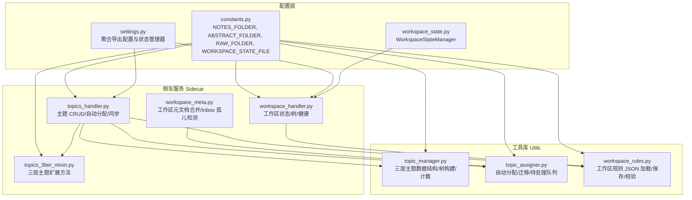
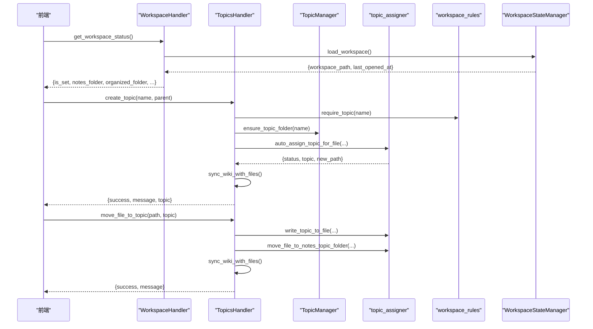
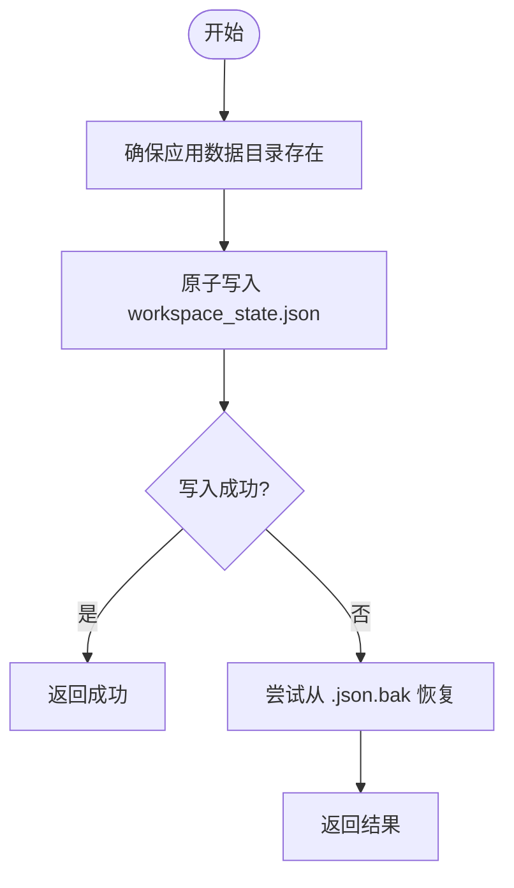
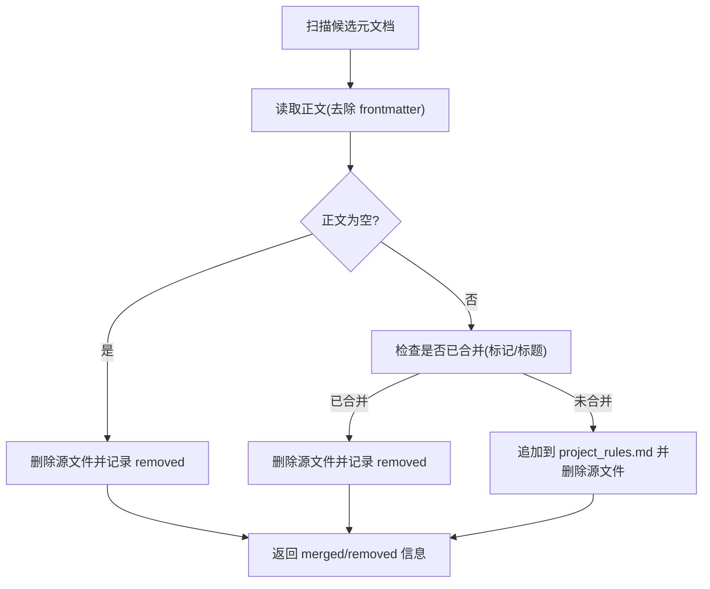
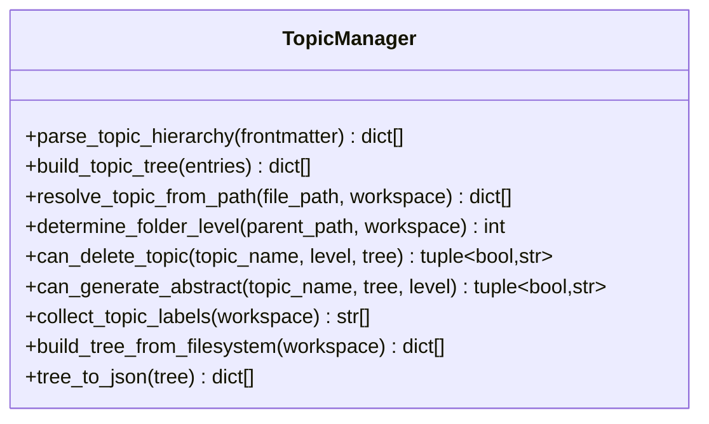
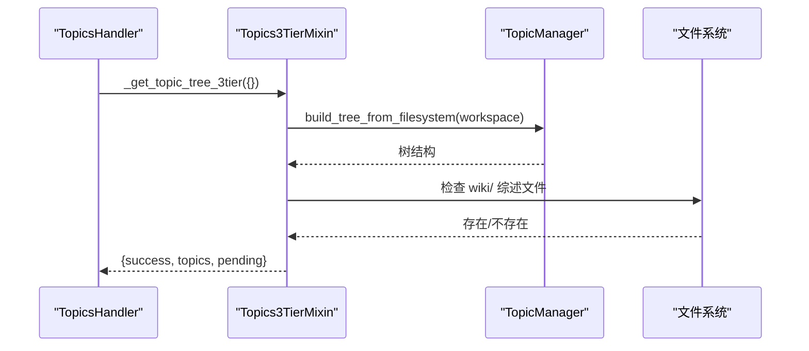
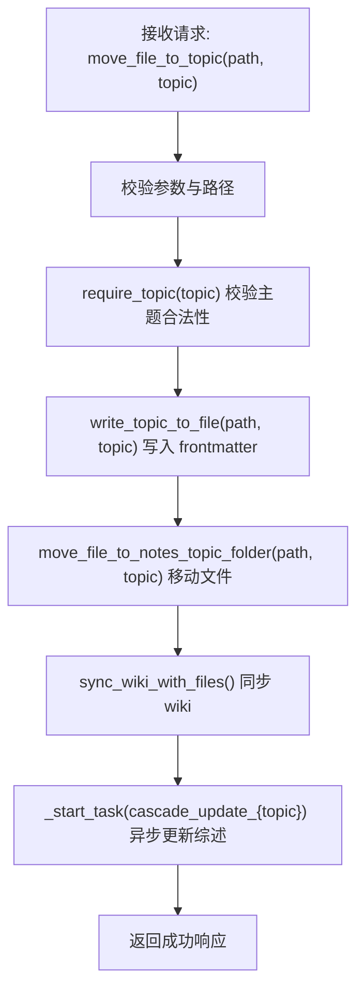
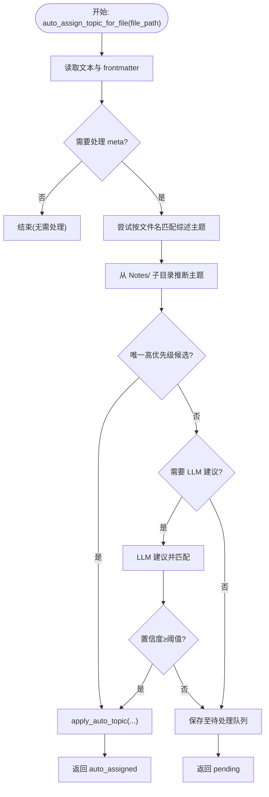
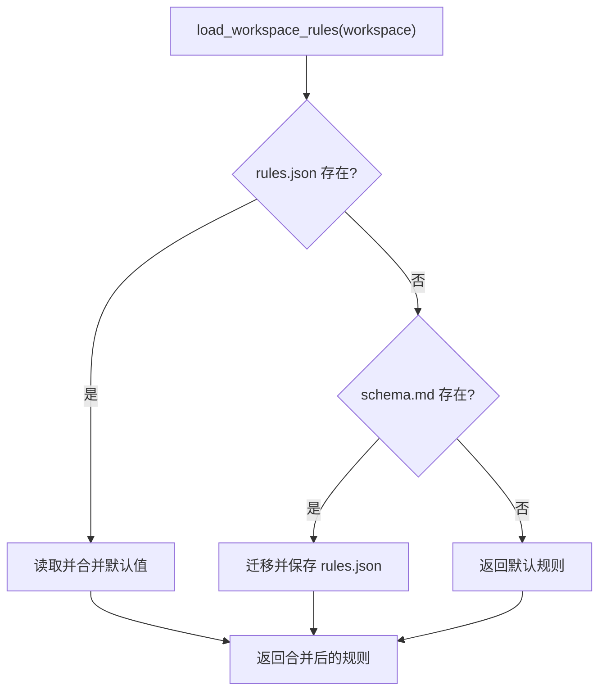
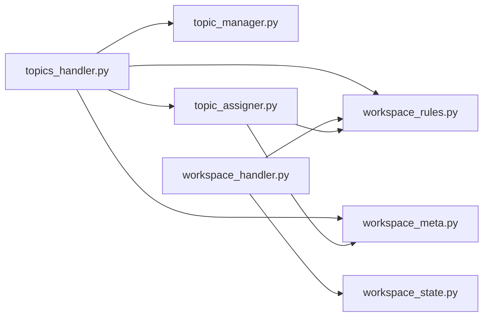

# 工作区元数据

<cite>
**本文引用的文件列表**
- [python/sidecar/workspace_meta.py](file://python/sidecar/workspace_meta.py)
- [config/workspace_state.py](file://config/workspace_state.py)
- [python/sidecar/mixins/topics_3tier_mixin.py](file://python/sidecar/mixins/topics_3tier_mixin.py)
- [utils/topic_manager.py](file://utils/topic_manager.py)
- [python/sidecar/handlers/workspace_handler.py](file://python/sidecar/handlers/workspace_handler.py)
- [config/constants.py](file://config/constants.py)
- [config/settings.py](file://config/settings.py)
- [python/sidecar/handlers/topics_handler.py](file://python/sidecar/handlers/topics_handler.py)
- [utils/topic_assigner.py](file://utils/topic_assigner.py)
- [python/sidecar/workspace_rules.py](file://python/sidecar/workspace_rules.py)
- [tests/unit/test_workspace_meta.py](file://tests/unit/test_workspace_meta.py)
- [tests/unit/test_topic_manager.py](file://tests/unit/test_topic_manager.py)
</cite>

## 目录
1. [简介](#简介)
2. [项目结构](#项目结构)
3. [核心组件](#核心组件)
4. [架构总览](#架构总览)
5. [详细组件分析](#详细组件分析)
6. [依赖关系分析](#依赖关系分析)
7. [性能考虑](#性能考虑)
8. [故障排查指南](#故障排查指南)
9. [结论](#结论)
10. [附录：API 使用示例与最佳实践](#附录api-使用示例与最佳实践)

## 简介
本文件为 NoteAI 工作区元数据管理系统的数据模型文档，聚焦以下目标：
- 解释工作区的文件系统映射、元数据存储结构与状态同步机制
- 描述三级主题体系的数据结构、路径规则和组织原则
- 说明工作区配置的管理方式（设置项定义、验证规则、默认值处理）
- 提供数据流图、存储架构图与一致性保证机制
- 给出元数据操作 API 的使用示例与性能优化建议

## 项目结构
NoteAI 的工作区元数据相关代码分布在 sidecar、utils、config 等模块中，围绕“文件系统即真相”的原则组织。关键目录与职责如下：
- config/constants.py：定义工作区根目录常量、Notes/wiki/Raw/Used 等子目录名、应用数据目录与工作区状态文件路径
- config/settings.py：聚合导出配置与状态管理器
- config/workspace_state.py：工作区持久化状态（最近打开的工作区路径、版本等）的原子写入与备份恢复
- python/sidecar/workspace_meta.py：工作区级元文档（AGENTS/CLAUDE/GEMINI.md）合并到 .ai_memory/project_rules.md，并识别 Inbox 孤儿文件
- utils/topic_manager.py：三层主题数据结构与管理（解析 frontmatter topic、构建主题树、从文件系统扫描、序列化）
- python/sidecar/mixins/topics_3tier_mixin.py：注入到 TopicsHandler 的三层主题扩展方法（树构建、图谱生成、综述开关、安全删除）
- python/sidecar/handlers/topics_handler.py：主题相关的 RPC 处理器（创建/重命名/删除/自动分配/批量分配/移动/同步 wiki 等）
- utils/topic_assigner.py：文件主题自动分配与迁移逻辑（基于文件夹路径、标题/标签匹配、LLM 建议、阈值控制）
- python/sidecar/workspace_rules.py：工作区规则 JSON（max_topic_depth、survey_at_level、auto_update_survey、权限开关等）
- python/sidecar/handlers/workspace_handler.py：工作区状态查询、路径校验、工作区树构建、健康检查等

图表来源
- [config/constants.py:1-52](file://config/constants.py#L1-L52)
- [config/settings.py:1-41](file://config/settings.py#L1-L41)
- [config/workspace_state.py:1-198](file://config/workspace_state.py#L1-L198)
- [python/sidecar/handlers/workspace_handler.py:1-260](file://python/sidecar/handlers/workspace_handler.py#L1-L260)
- [python/sidecar/handlers/topics_handler.py:1-588](file://python/sidecar/handlers/topics_handler.py#L1-L588)
- [python/sidecar/mixins/topics_3tier_mixin.py:1-324](file://python/sidecar/mixins/topics_3tier_mixin.py#L1-L324)
- [python/sidecar/workspace_meta.py:1-121](file://python/sidecar/workspace_meta.py#L1-L121)
- [utils/topic_manager.py:1-485](file://utils/topic_manager.py#L1-L485)
- [utils/topic_assigner.py:1-418](file://utils/topic_assigner.py#L1-L418)
- [python/sidecar/workspace_rules.py:1-200](file://python/sidecar/workspace_rules.py#L1-L200)

章节来源
- [config/constants.py:1-52](file://config/constants.py#L1-L52)
- [config/settings.py:1-41](file://config/settings.py#L1-L41)
- [config/workspace_state.py:1-198](file://config/workspace_state.py#L1-L198)
- [python/sidecar/handlers/workspace_handler.py:1-260](file://python/sidecar/handlers/workspace_handler.py#L1-L260)
- [python/sidecar/handlers/topics_handler.py:1-588](file://python/sidecar/handlers/topics_handler.py#L1-L588)
- [python/sidecar/mixins/topics_3tier_mixin.py:1-324](file://python/sidecar/mixins/topics_3tier_mixin.py#L1-L324)
- [python/sidecar/workspace_meta.py:1-121](file://python/sidecar/workspace_meta.py#L1-L121)
- [utils/topic_manager.py:1-485](file://utils/topic_manager.py#L1-L485)
- [utils/topic_assigner.py:1-418](file://utils/topic_assigner.py#L1-L418)
- [python/sidecar/workspace_rules.py:1-200](file://python/sidecar/workspace_rules.py#L1-L200)

## 核心组件
- 工作区状态管理（WorkspaceStateManager）
  - 负责将最近打开的工作区路径、时间戳、版本等信息原子写入系统应用数据目录下的 workspace_state.json，并提供备份恢复能力
- 工作区元文档合并（workspace_meta）
  - 将 AGENTS.md、CLAUDE.md、GEMINI.md 合并入 .ai_memory/project_rules.md，并清理源文件；同时识别 Inbox 孤儿文件（工作区根或 Notes/ 根下无主题归属的 .md）
- 三层主题管理（TopicManager + Topics3TierMixin + TopicsHandler）
  - 支持从 YAML frontmatter 解析 topic 层级、从文件系统扫描构建主题树、统计文件数、判断新建文件夹层级、删除保护、综述互斥控制、知识图谱节点/边生成
- 自动主题分配与迁移（topic_assigner）
  - 根据 Notes/ 子目录推断主题、标题/标签匹配、可选 LLM 建议、阈值控制、写入 frontmatter、移动到正确目录、更新 wiki、记录活动日志、维护待处理队列
- 工作区规则（workspace_rules）
  - 以 JSON 形式保存在 .noteai/workspace_rules.json，包含最大深度、综述级别、是否自动更新综述、AI 编辑权限等，并提供默认值与迁移逻辑

章节来源
- [config/workspace_state.py:1-198](file://config/workspace_state.py#L1-L198)
- [python/sidecar/workspace_meta.py:1-121](file://python/sidecar/workspace_meta.py#L1-L121)
- [utils/topic_manager.py:1-485](file://utils/topic_manager.py#L1-L485)
- [python/sidecar/mixins/topics_3tier_mixin.py:1-324](file://python/sidecar/mixins/topics_3tier_mixin.py#L1-L324)
- [python/sidecar/handlers/topics_handler.py:1-588](file://python/sidecar/handlers/topics_handler.py#L1-L588)
- [utils/topic_assigner.py:1-418](file://utils/topic_assigner.py#L1-L418)
- [python/sidecar/workspace_rules.py:1-200](file://python/sidecar/workspace_rules.py#L1-L200)

## 架构总览
下图展示工作区元数据在系统中的整体交互：前端通过 RPC 调用 handlers，handlers 组合 TopicManager、topic_assigner、workspace_rules 等工具完成主题与文件系统的同步，并通过 WorkspaceStateManager 持久化工作区状态。

图表来源
- [python/sidecar/handlers/workspace_handler.py:1-260](file://python/sidecar/handlers/workspace_handler.py#L1-L260)
- [config/workspace_state.py:1-198](file://config/workspace_state.py#L1-L198)
- [python/sidecar/handlers/topics_handler.py:1-588](file://python/sidecar/handlers/topics_handler.py#L1-L588)
- [utils/topic_manager.py:1-485](file://utils/topic_manager.py#L1-L485)
- [utils/topic_assigner.py:1-418](file://utils/topic_assigner.py#L1-L418)
- [python/sidecar/workspace_rules.py:1-200](file://python/sidecar/workspace_rules.py#L1-L200)

## 详细组件分析

### 工作区状态管理（WorkspaceStateManager）
- 职责
  - 原子写入工作区状态（workspace_state.json），包含 workspace_path、last_opened_at、version
  - 失败时回退到 .json.bak 备份
  - 提供 clear/get info 接口
- 关键点
  - 使用临时文件 + fsync + 原子 move 确保一致性
  - 权限错误与 OS 异常统一封装为 WorkspaceStateError
- 适用场景
  - 启动时恢复上次工作区、跨进程共享工作区路径

图表来源
- [config/workspace_state.py:1-198](file://config/workspace_state.py#L1-L198)

章节来源
- [config/workspace_state.py:1-198](file://config/workspace_state.py#L1-L198)

### 工作区元文档合并与 Inbox 孤儿检测
- 职责
  - 将 AGENTS/CLAUDE/GEMINI.md 合并到 .ai_memory/project_rules.md，并移除源文件
  - 识别工作区根或 Notes/ 根下的孤立 .md 文件（非 README、非工作区元文档）
- 关键点
  - 去重与增量合并（按标记避免重复）
  - 空内容文件直接删除
  - is_inbox_orphan_path 用于后续自动分配流程筛选

图表来源
- [python/sidecar/workspace_meta.py:1-121](file://python/sidecar/workspace_meta.py#L1-L121)

章节来源
- [python/sidecar/workspace_meta.py:1-121](file://python/sidecar/workspace_meta.py#L1-L121)

### 三层主题体系（数据结构、路径规则、组织原则）
- 数据结构
  - 扁平条目：{name, level, parent}
  - 嵌套树：L1 → children(L2) → children(L3)，附带 path、has_abstract、abstract_file、file_count
- 路径规则
  - 主题分隔符：TOPIC_SEP = " > "
  - 文件系统映射：Notes/L1/L2/L3/...
  - 解析策略：从相对路径提取最多三层作为主题
- 组织原则
  - 一级主题来自 Notes/ 顶层目录
  - 二级/三级由子目录决定
  - 综述文件位于 wiki/ 或 wiki/L1/L2/ 下，名称约定为 “{主题名}_综述.md”
- 核心方法
  - parse_topic_hierarchy：从 frontmatter topic 字段解析
  - build_topic_tree：扁平转嵌套
  - resolve_topic_from_path：路径→主题
  - determine_folder_level：新建文件夹应属层级
  - can_delete_topic：删除保护
  - can_generate_abstract：综述互斥
  - build_tree_from_filesystem：从文件系统扫描构建
  - tree_to_json：序列化输出

图表来源
- [utils/topic_manager.py:1-485](file://utils/topic_manager.py#L1-L485)

章节来源
- [utils/topic_manager.py:1-485](file://utils/topic_manager.py#L1-L485)
- [config/constants.py:1-52](file://config/constants.py#L1-L52)

### 主题扩展 Mixin（Topics3TierMixin）
- 职责
  - 注入到 TopicsHandler，提供 _get_topic_tree_3tier、_create_topic_folder、_set_abstract_config、_get_graph_data、_delete_topic_safe 等方法
- 关键点
  - 树构建后补充 has_abstract/abstract_file/file_count
  - 图谱生成支持 topic/tag/all 过滤，节点 ID 稳定（基于相对路径）
  - 删除前进行保护校验

图表来源
- [python/sidecar/mixins/topics_3tier_mixin.py:1-324](file://python/sidecar/mixins/topics_3tier_mixin.py#L1-L324)
- [utils/topic_manager.py:1-485](file://utils/topic_manager.py#L1-L485)

章节来源
- [python/sidecar/mixins/topics_3tier_mixin.py:1-324](file://python/sidecar/mixins/topics_3tier_mixin.py#L1-L324)

### 主题处理器（TopicsHandler）
- 职责
  - 暴露主题相关 RPC：创建/重命名/删除/自动分配/批量分配/移动/同步 wiki/获取文件主题/获取主题文件/待处理列表/活动日志/合并重复主题/综述开关等
- 关键点
  - 自动分配流程：优先从 Notes/ 子目录推断主题，其次标题/标签匹配，再可选 LLM 建议，最后进入待处理队列
  - 移动文件到主题目录后触发 cascade 更新综述
  - 重命名/删除会同步 wiki 并更新活动日志

图表来源
- [python/sidecar/handlers/topics_handler.py:1-588](file://python/sidecar/handlers/topics_handler.py#L1-L588)
- [utils/topic_assigner.py:1-418](file://utils/topic_assigner.py#L1-L418)

章节来源
- [python/sidecar/handlers/topics_handler.py:1-588](file://python/sidecar/handlers/topics_handler.py#L1-L588)
- [utils/topic_assigner.py:1-418](file://utils/topic_assigner.py#L1-L418)

### 自动主题分配与迁移（topic_assigner）
- 职责
  - 对 Markdown 文件执行自动主题分配与迁移，包括：
    - 从 Notes/ 子目录推断主题
    - 标题/标签匹配候选
    - 可选 LLM 建议与置信度阈值
    - 写入 frontmatter、移动文件、更新 wiki、记录活动日志、维护待处理队列
- 关键点
  - 阈值控制：topic_auto_assign_threshold 决定是否自动归档
  - 综述文件特殊处理：文件名含“综述”时尝试匹配主题
  - 待处理队列：当无法确定主题时进入 pending，供人工确认

图表来源
- [utils/topic_assigner.py:1-418](file://utils/topic_assigner.py#L1-L418)

章节来源
- [utils/topic_assigner.py:1-418](file://utils/topic_assigner.py#L1-L418)

### 工作区规则（workspace_rules）
- 职责
  - 加载/保存 .noteai/workspace_rules.json，提供默认值与迁移逻辑（从 schema.md 导入）
  - 提供主题头列表、一级主题列表、选项读写、综述级别解析
- 关键点
  - 默认值：max_topic_depth=3、survey_at_level=2、auto_update_survey=True、ai_may_edit_wiki=True、ai_may_edit_notes=False、configured=False
  - 校验：深度限制在 1..3，综述级别在 1..2
  - 迁移：若存在 schema.md，则按正则提取配置并保存到 rules.json

图表来源
- [python/sidecar/workspace_rules.py:1-200](file://python/sidecar/workspace_rules.py#L1-L200)

章节来源
- [python/sidecar/workspace_rules.py:1-200](file://python/sidecar/workspace_rules.py#L1-L200)

## 依赖关系分析
- 低耦合设计
  - handlers 仅依赖工具函数与 mixin，不直接操作文件系统细节
  - TopicManager 专注于数据结构与算法，不感知 RPC 上下文
  - workspace_rules 独立于主题与文件分配逻辑
- 外部依赖
  - 文件系统（Path）、JSON、YAML frontmatter、可选 LLM 服务
- 潜在循环依赖
  - topics_handler 与 topic_assigner 相互协作但无直接循环引用
  - workspace_meta 被 topic_assigner 复用，单向依赖

图表来源
- [python/sidecar/handlers/topics_handler.py:1-588](file://python/sidecar/handlers/topics_handler.py#L1-L588)
- [utils/topic_manager.py:1-485](file://utils/topic_manager.py#L1-L485)
- [utils/topic_assigner.py:1-418](file://utils/topic_assigner.py#L1-L418)
- [python/sidecar/workspace_rules.py:1-200](file://python/sidecar/workspace_rules.py#L1-L200)
- [python/sidecar/workspace_meta.py:1-121](file://python/sidecar/workspace_meta.py#L1-L121)
- [python/sidecar/handlers/workspace_handler.py:1-260](file://python/sidecar/handlers/workspace_handler.py#L1-L260)
- [config/workspace_state.py:1-198](file://config/workspace_state.py#L1-L198)

章节来源
- [python/sidecar/handlers/topics_handler.py:1-588](file://python/sidecar/handlers/topics_handler.py#L1-L588)
- [utils/topic_manager.py:1-485](file://utils/topic_manager.py#L1-L485)
- [utils/topic_assigner.py:1-418](file://utils/topic_assigner.py#L1-L418)
- [python/sidecar/workspace_rules.py:1-200](file://python/sidecar/workspace_rules.py#L1-L200)
- [python/sidecar/workspace_meta.py:1-121](file://python/sidecar/workspace_meta.py#L1-L121)
- [python/sidecar/handlers/workspace_handler.py:1-260](file://python/sidecar/handlers/workspace_handler.py#L1-L260)
- [config/workspace_state.py:1-198](file://config/workspace_state.py#L1-L198)

## 性能考虑
- 文件系统遍历
  - 主题树构建与图谱生成涉及大量目录扫描，注意忽略隐藏目录与大型无关目录（如 node_modules、.venv、rag_index 等）
  - 递归深度限制（例如工作区树构建 MAX_TREE_DEPTH=6）避免阻塞
- 原子写入与备份
  - 工作区状态写入采用临时文件+fsync+原子 move，减少损坏风险
- 缓存与增量
  - 建议在高频查询处引入 TTL 缓存（如主题树、图谱数据），并在文件变更事件后失效
- I/O 批处理
  - 批量自动分配时，分批次发送进度事件，避免长时间占用线程
- LLM 调用
  - 仅在必要时启用 LLM 建议，并设置合理阈值以减少不必要调用

[本节为通用指导，不直接分析具体文件]

## 故障排查指南
- 工作区状态丢失或损坏
  - 检查 workspace_state.json 是否存在且可读；若损坏，系统将尝试从 .json.bak 恢复
  - 常见原因：权限不足、磁盘空间不足、并发写入冲突
- 主题树不一致
  - 运行 sync_wiki_with_files 或 fix_survey_topics 以对齐 wiki 与文件系统
  - 检查 Notes/ 目录结构是否符合三级主题规范
- 自动分配未生效
  - 确认 topic_auto_assign_threshold 配置是否过高
  - 查看待处理队列（get_all_pending）是否有该文件
- 综述开关无效
  - 检查 can_generate_abstract 的互斥规则（一级与二级不能同时有综述；三级不支持综述）
- 工作区元文档未合并
  - 检查 AGENTS/CLAUDE/GEMINI.md 是否为空或已被合并；查看 .ai_memory/project_rules.md 是否包含对应标记

章节来源
- [config/workspace_state.py:1-198](file://config/workspace_state.py#L1-L198)
- [python/sidecar/handlers/topics_handler.py:1-588](file://python/sidecar/handlers/topics_handler.py#L1-L588)
- [utils/topic_assigner.py:1-418](file://utils/topic_assigner.py#L1-L418)
- [python/sidecar/workspace_meta.py:1-121](file://python/sidecar/workspace_meta.py#L1-L121)

## 结论
NoteAI 的工作区元数据系统以“文件系统即真相”为核心，结合稳定的主题数据结构与幂等的同步机制，实现了稳健的主题管理与文件组织。通过工作区规则与状态管理，系统在易用性与一致性之间取得平衡。未来可进一步引入缓存与增量同步以提升大规模工作区的性能。

[本节为总结性内容，不直接分析具体文件]

## 附录：API 使用示例与最佳实践

- 工作区状态
  - get_workspace_status：返回当前工作区路径、Notes/ 与 wiki/ 目录、是否需要规则初始化
  - set_workspace_path：设置工作区路径并持久化
  - check_workspace_path_valid：校验路径有效性
  - clear_saved_workspace：清除保存的工作区状态
- 主题管理
  - get_topic_tree / get_topic_tree_3tier：获取三层主题树（含综述状态与文件计数）
  - create_topic / rename_topic / delete_topic：创建/重命名/删除主题（含保护与 wiki 同步）
  - auto_assign_topic / batch_auto_assign_topics：单文件/批量自动分配主题
  - move_file_to_topic / remove_file_from_topic：移动/移除文件的主题关联
  - get_file_topics / get_topic_files：查询文件主题或主题下文件
  - get_all_pending / resolve_topic：查看待处理列表并确认主题
  - get_activity_log：获取活动日志
  - merge_duplicate_topics：合并重复主题与去重文件
  - toggle_survey / get_survey_status / fix_survey_topics：综述开关与修复
- 工作区规则
  - get_workspace_rules_options / save_workspace_rules_options：读取/保存规则选项
  - list_topic_headings / list_l1_topics：列出主题头与一级主题
- 最佳实践
  - 保持 Notes/ 目录结构清晰，遵循三级主题规范
  - 合理使用综述功能，避免一级与二级同时开启
  - 调整 topic_auto_assign_threshold 以平衡自动化与准确性
  - 定期运行 sync_wiki_with_files 与 merge_duplicate_topics 保持知识库整洁

章节来源
- [python/sidecar/handlers/workspace_handler.py:1-260](file://python/sidecar/handlers/workspace_handler.py#L1-L260)
- [python/sidecar/handlers/topics_handler.py:1-588](file://python/sidecar/handlers/topics_handler.py#L1-L588)
- [python/sidecar/workspace_rules.py:1-200](file://python/sidecar/workspace_rules.py#L1-L200)
- [tests/unit/test_workspace_meta.py:1-65](file://tests/unit/test_workspace_meta.py#L1-L65)
- [tests/unit/test_topic_manager.py:1-233](file://tests/unit/test_topic_manager.py#L1-L233)