# 数据流架构

<cite>
**本文引用的文件**   
- [ingest_pipeline.py](file://python/sidecar/ingest_pipeline.py)
- [server.py](file://python/sidecar/server.py)
- [cascade.py](file://python/sidecar/cascade.py)
- [cascade_runner.py](file://python/sidecar/cascade_runner.py)
- [workspace_meta.py](file://python/sidecar/workspace_meta.py)
- [index.py](file://python/sidecar/rag/index.py)
- [retriever.py](file://python/sidecar/rag/retriever.py)
- [note_compiler.py](file://utils/note_compiler.py)
- [file_converter.py](file://modules/file_converter.py)
- [topic_assigner.py](file://utils/topic_assigner.py)
- [error_handler.py](file://utils/error_handler.py)
- [settings.py](file://config/settings.py)
</cite>

## 目录
1. [引言](#引言)
2. [项目结构](#项目结构)
3. [核心组件](#核心组件)
4. [架构总览](#架构总览)
5. [详细组件分析](#详细组件分析)
6. [依赖关系分析](#依赖关系分析)
7. [性能与缓存](#性能与缓存)
8. [故障恢复与可观测性](#故障恢复与可观测性)
9. [结论](#结论)
10. [附录：关键流程图](#附录关键流程图)

## 引言
本文件面向 NoteAI 的数据流架构，系统性阐述从用户输入到最终存储的端到端链路。重点覆盖入库流水线（文件监控、自动转换、内容编译、分类、索引更新）、级联处理器（综述生成与更新）的执行模型、工作区元数据管理、缓存策略与批量处理优化，并给出数据流图、处理管道图与状态转换图，帮助读者快速理解系统设计与扩展点。

## 项目结构
NoteAI 采用“前端 Tauri + Python Sidecar”的双进程架构。Python Sidecar 通过 JSON-RPC 接收命令，内部包含：
- 文件系统监听与事件分发
- 入库流水线编排（convert → compile → classify → index → cascade → sync）
- RAG 向量与 BM25 混合索引
- 级联综述生成与重试
- 工作区规则与元数据合并

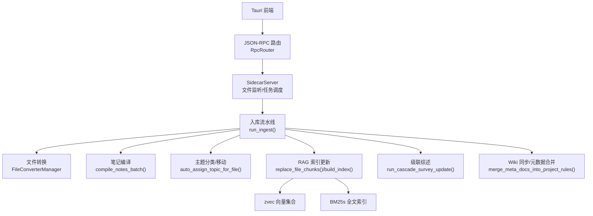

**图表来源** 
- [server.py:97-125](file://python/sidecar/server.py#L97-L125)
- [ingest_pipeline.py:480-800](file://python/sidecar/ingest_pipeline.py#L480-L800)
- [file_converter.py:407-770](file://modules/file_converter.py#L407-L770)
- [note_compiler.py:213-238](file://utils/note_compiler.py#L213-L238)
- [topic_assigner.py:318-327](file://utils/topic_assigner.py#L318-L327)
- [index.py:502-582](file://python/sidecar/rag/index.py#L502-L582)
- [workspace_meta.py:46-98](file://python/sidecar/workspace_meta.py#L46-L98)

**章节来源**
- [server.py:97-125](file://python/sidecar/server.py#L97-L125)
- [settings.py:1-41](file://config/settings.py#L1-L41)

## 核心组件
- 入库流水线（Ingest Pipeline）：统一编排 convert/compile/classify/index/crossref/cascade/lint/sync 阶段，支持全量/增量/续跑模式，持久化运行状态与指纹，提供取消与进度上报。
- 文件转换（File Converter）：多格式转 Markdown，质量评估、LLM 重写、源文件归档、自动主题分配。
- 笔记编译（Note Compiler）：规则清理 + LLM 改写，保留 frontmatter，记录编译状态避免重复。
- 主题分类与移动（Topic Assigner）：基于文件夹路径、标题、标签、LLM 建议进行自动归类与移动，维护待确认队列。
- RAG 索引（Index & Retriever）：zvec 稠密向量 + BM25s 稀疏检索，支持增量/全量重建、原子替换、去重与重排。
- 级联处理器（Cascade Runner）：按主题收集笔记、压缩、调用 LLM 生成/更新综述，带重试与失败持久化。
- 工作区元数据（Workspace Meta）：将 AGENTS/CLAUDE/GEMINI 等文档合并入 project_rules.md，隐藏于笔记之外。
- 服务器与监听（Server）：watchdog 监听工作区变更，触发自动转换、自动处理、Wiki 同步与缓存失效。

**章节来源**
- [ingest_pipeline.py:23-28](file://python/sidecar/ingest_pipeline.py#L23-L28)
- [file_converter.py:407-770](file://modules/file_converter.py#L407-L770)
- [note_compiler.py:128-238](file://utils/note_compiler.py#L128-L238)
- [topic_assigner.py:318-327](file://utils/topic_assigner.py#L318-L327)
- [index.py:502-582](file://python/sidecar/rag/index.py#L502-L582)
- [retriever.py:459-627](file://python/sidecar/rag/retriever.py#L459-L627)
- [cascade_runner.py:74-154](file://python/sidecar/cascade_runner.py#L74-L154)
- [workspace_meta.py:46-98](file://python/sidecar/workspace_meta.py#L46-L98)
- [server.py:298-540](file://python/sidecar/server.py#L298-L540)

## 架构总览
下图展示从文件变更到索引与综述更新的完整数据流。

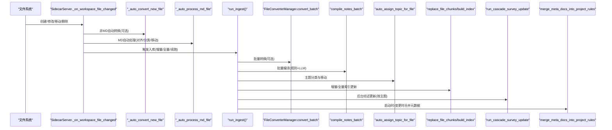

**图表来源** 
- [server.py:416-540](file://python/sidecar/server.py#L416-L540)
- [ingest_pipeline.py:480-800](file://python/sidecar/ingest_pipeline.py#L480-L800)
- [file_converter.py:569-770](file://modules/file_converter.py#L569-L770)
- [note_compiler.py:213-238](file://utils/note_compiler.py#L213-L238)
- [topic_assigner.py:330-418](file://utils/topic_assigner.py#L330-L418)
- [index.py:646-702](file://python/sidecar/rag/index.py#L646-L702)
- [cascade_runner.py:74-154](file://python/sidecar/cascade_runner.py#L74-L154)
- [workspace_meta.py:46-98](file://python/sidecar/workspace_meta.py#L46-L98)

## 详细组件分析

### 入库流水线（Ingest Pipeline）
- 阶段定义：rules → convert → compile → classify → index → crossref → cascade → lint → sync
- 状态与指纹：持久化 ingest_state.json 与 ingest_fingerprint.json；支持 interrupted/failed 续跑；force_full_next 标记下次全量
- 增量判定：比较 mtime+size 指纹，必要时扫描 convert/classify/index 待处理项
- 取消机制：基于 generation 的轻量取消信号，避免竞态
- 统计与事件：每阶段进度回调，完成后发送事件，错误聚合抛出

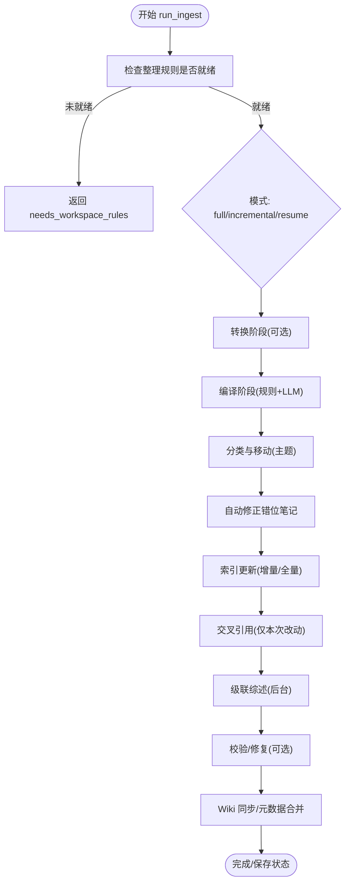

**图表来源** 
- [ingest_pipeline.py:480-800](file://python/sidecar/ingest_pipeline.py#L480-L800)

**章节来源**
- [ingest_pipeline.py:23-28](file://python/sidecar/ingest_pipeline.py#L23-L28)
- [ingest_pipeline.py:107-178](file://python/sidecar/ingest_pipeline.py#L107-L178)
- [ingest_pipeline.py:180-268](file://python/sidecar/ingest_pipeline.py#L180-L268)
- [ingest_pipeline.py:480-800](file://python/sidecar/ingest_pipeline.py#L480-L800)

### 文件转换（File Converter）
- 模板方法：BaseConverter 统一日志、异常与后处理，子类实现 _extract_text
- 支持格式：PDF/TXT/DOCX/旧版DOC/PPTX/旧版PPT/HTML
- 质量评估：字符密度、乱码比例、扫描 PDF 检测
- LLM 重写：对低结构化内容在长度阈值内尝试重写
- 源文件归档：移动到 Raw 目录，并在 frontmatter 中记录 source
- 自动主题分配：转换后可调用 auto_assign_topic_for_file

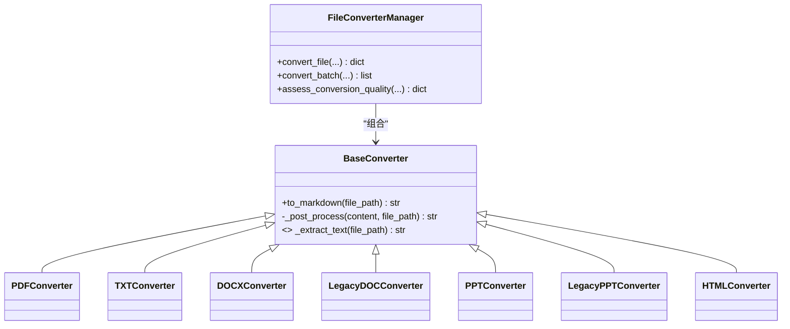

**图表来源** 
- [file_converter.py:27-70](file://modules/file_converter.py#L27-L70)
- [file_converter.py:407-770](file://modules/file_converter.py#L407-L770)

**章节来源**
- [file_converter.py:27-70](file://modules/file_converter.py#L27-L70)
- [file_converter.py:569-770](file://modules/file_converter.py#L569-L770)

### 笔记编译（Note Compiler）
- 规则清理：去除页眉页脚、重复分隔线、短行重复等
- LLM 改写：在长度限制内调用 LLM 提升可读性与结构化程度
- 状态跟踪：记录已编译文件的 mtime，避免重复处理
- 批处理：支持批量编译并回调进度

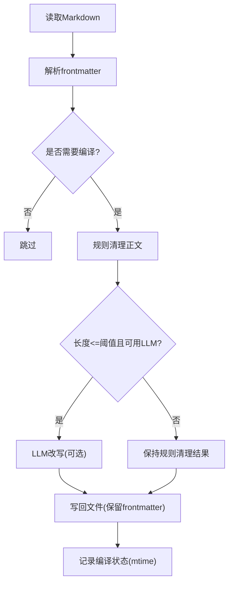

**图表来源** 
- [note_compiler.py:128-238](file://utils/note_compiler.py#L128-L238)

**章节来源**
- [note_compiler.py:128-238](file://utils/note_compiler.py#L128-L238)

### 主题分类与移动（Topic Assigner）
- 优先级：综述文件名推断 > 文件夹路径推断 > 单候选直接分配 > LLM 建议匹配 > 进入待确认队列
- 自动移动：根据主题写入 frontmatter 并移动到 Notes/<topic>/...
- 待确认：当置信度不足或无候选时，记录 pending 供后续人工确认
- 与 Wiki 同步：分类成功后触发 wiki 同步

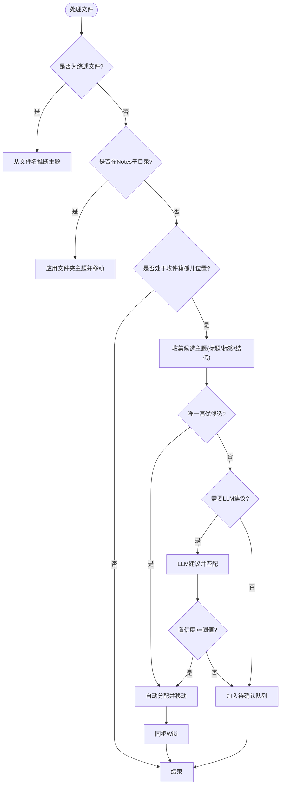

**图表来源** 
- [topic_assigner.py:267-327](file://utils/topic_assigner.py#L267-L327)
- [topic_assigner.py:330-418](file://utils/topic_assigner.py#L330-L418)

**章节来源**
- [topic_assigner.py:267-327](file://utils/topic_assigner.py#L267-L327)
- [topic_assigner.py:330-418](file://utils/topic_assigner.py#L330-L418)

### RAG 索引与检索（Index & Retriever）
- 索引结构：zvec 稠密向量集合 + BM25s 稀疏索引 + metadata.json 倒排
- 构建流程：分块 → Embedding → 批量插入 → 原子替换 → 重建 BM25/metadata/manifest
- 增量更新：对比 manifest 与当前文件 mtime/size，删除/新增/替换对应 chunks
- 检索流程：HyDE 可选增强 → MMR 去重 → Rerank 可选 → 上下文扩展 → 动态 top-k
- 并发与锁：索引操作互斥、集合句柄缓存、BM25 加载缓存

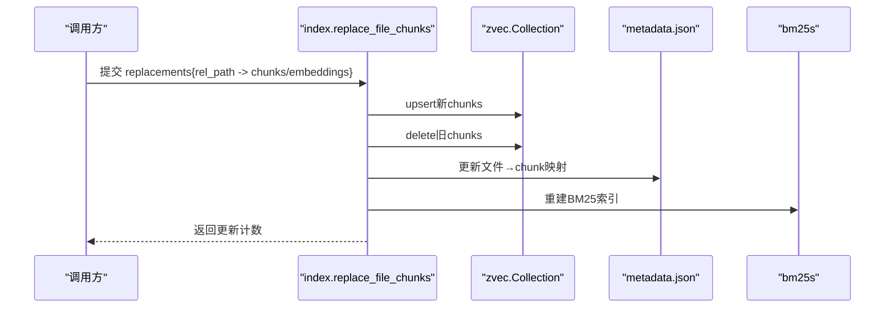

**图表来源** 
- [index.py:646-702](file://python/sidecar/rag/index.py#L646-L702)
- [index.py:502-582](file://python/sidecar/rag/index.py#L502-L582)
- [retriever.py:102-196](file://python/sidecar/rag/retriever.py#L102-L196)

**章节来源**
- [index.py:502-582](file://python/sidecar/rag/index.py#L502-L582)
- [index.py:646-702](file://python/sidecar/rag/index.py#L646-L702)
- [retriever.py:102-196](file://python/sidecar/rag/retriever.py#L102-L196)

### 级联处理器（Cascade Runner）
- 执行模型：为每个主题收集笔记 → 压缩文本 → 生成/更新综述 → 写入 .ai_memory/ABSTRACT_FOLDER
- 可靠性：最大重试次数、退避延迟、失败持久化、可重试接口
- 事件与进度：实时推送 chunk 与完成事件

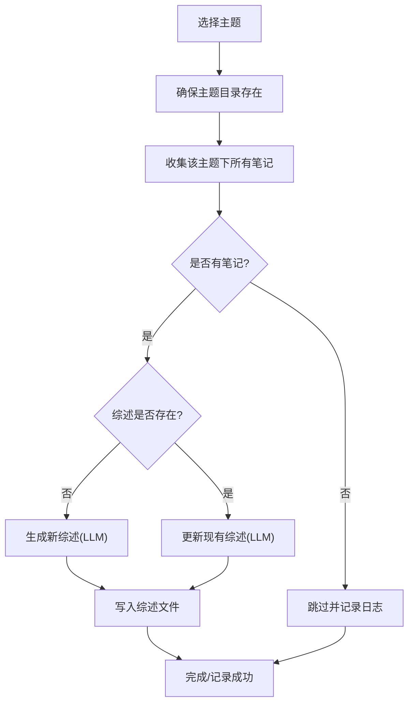

**图表来源** 
- [cascade_runner.py:74-154](file://python/sidecar/cascade_runner.py#L74-L154)
- [cascade.py:388-426](file://python/sidecar/cascade.py#L388-L426)

**章节来源**
- [cascade_runner.py:74-154](file://python/sidecar/cascade_runner.py#L74-L154)
- [cascade.py:388-426](file://python/sidecar/cascade.py#L388-L426)

### 工作区元数据管理（Workspace Meta）
- 合并策略：扫描 AGENTS/CLAUDE/GEMINI 文档，提取正文，合并至 .ai_memory/project_rules.md，并移除源文件
- 幂等性：若已存在对应标记则跳过合并
- 用途：作为项目规则注入给 LLM 编译/分类等流程

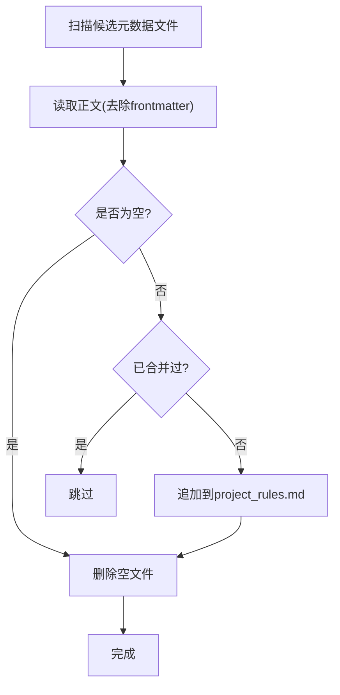

**图表来源** 
- [workspace_meta.py:46-98](file://python/sidecar/workspace_meta.py#L46-L98)

**章节来源**
- [workspace_meta.py:46-98](file://python/sidecar/workspace_meta.py#L46-L98)

### 服务器与文件监听（Server）
- 监听范围：忽略隐藏目录与 wiki/Raw 等，关注 NOTES 下的 .md 及可转换格式
- 自动动作：新建/移动 .md 自动处理；非 .md 自动转换；变更触发 Wiki 同步与缓存失效
- 防抖：5 秒定时器聚合变更，避免频繁同步

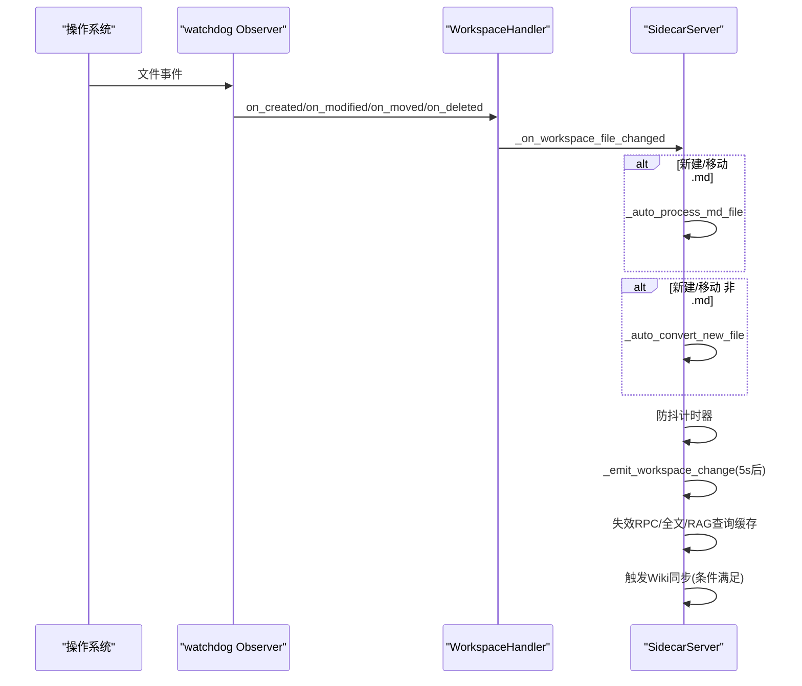

**图表来源** 
- [server.py:298-540](file://python/sidecar/server.py#L298-L540)

**章节来源**
- [server.py:298-540](file://python/sidecar/server.py#L298-L540)

## 依赖关系分析
- 模块耦合
  - server.py 依赖 handlers 与各子系统（ingest、rag、cascade、workspace_meta）
  - ingest_pipeline.py 串联 converter、compiler、classifier、index、cascade
  - retriever.py 依赖 index.py 的 hybrid_search 与 embedder
  - topic_assigner.py 依赖 workspace_rules、wiki_manager、textutils
- 外部依赖
  - zvec/bm25s 用于向量与稀疏检索
  - LLM 工具链（FlagReranker、Embedder、call_llm_*）
- 潜在循环
  - 通过函数内 import 避免强耦合与循环导入（如 note_compiler、cascade 中的局部导入）

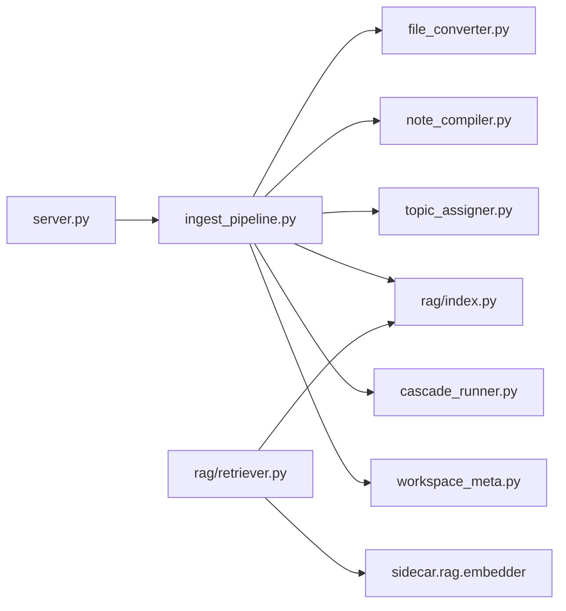

**图表来源** 
- [server.py:97-125](file://python/sidecar/server.py#L97-L125)
- [ingest_pipeline.py:480-800](file://python/sidecar/ingest_pipeline.py#L480-L800)
- [retriever.py:102-196](file://python/sidecar/rag/retriever.py#L102-L196)

**章节来源**
- [server.py:97-125](file://python/sidecar/server.py#L97-L125)
- [ingest_pipeline.py:480-800](file://python/sidecar/ingest_pipeline.py#L480-L800)
- [retriever.py:102-196](file://python/sidecar/rag/retriever.py#L102-L196)

## 性能与缓存
- 指纹与增量
  - 工作区指纹（mtime+size）快速判断是否需要入库
  - RAG 索引增量更新基于 manifest 与 mtime/size 比对
- 批量与并行
  - 文件转换批量处理、笔记编译批量处理
  - RAG 分块与编码使用线程池，BM25 重建与集合操作串行化
- 缓存策略
  - TTLCache 用于 RPC 与查询结果缓存（含 RAG 查询缓存）
  - zvec 集合句柄缓存、BM25 加载缓存
  - 文件变更时主动失效缓存
- 去重与重排
  - HyDE 仅在弱检索时启用，MMR 去重，Rerank 可选且具备冷却期

[本节为通用性能讨论，不直接分析具体文件]

## 故障恢复与可观测性
- 状态持久化
  - ingest_state.json：记录 stage、progress、stats、completed_stages、pending_crossref_paths、affected_topics
  - cascade_failures.json：记录失败主题与错误信息，支持重试
- 续跑与中断
  - normalize_ingest_state 将 running 转为 interrupted，提示自动续跑
  - resume 标志恢复已完成阶段与中间状态
- 取消与重试
  - cancel_generation 基于 generation 号避免竞态
  - 级联处理器最大重试次数与退避
- 错误处理
  - 统一 log_exception、swallow、log_and_reraise 装饰器
  - 各阶段捕获异常并汇总错误消息

**章节来源**
- [ingest_pipeline.py:107-178](file://python/sidecar/ingest_pipeline.py#L107-L178)
- [ingest_pipeline.py:480-800](file://python/sidecar/ingest_pipeline.py#L480-L800)
- [cascade_runner.py:28-73](file://python/sidecar/cascade_runner.py#L28-L73)
- [error_handler.py:24-120](file://utils/error_handler.py#L24-L120)

## 结论
NoteAI 的数据流以“监听驱动 + 流水线编排 + 可靠持久化”为核心，实现了从文件变更到索引与综述生成的自动化闭环。通过指纹与增量策略、批量与并行、多级缓存与去重重排，系统在大规模知识库场景下具备良好的可扩展性与稳定性。级联处理器与错误恢复机制进一步增强了系统的鲁棒性。

[本节为总结性内容，不直接分析具体文件]

## 附录：关键流程图

### 入库流水线状态转换图
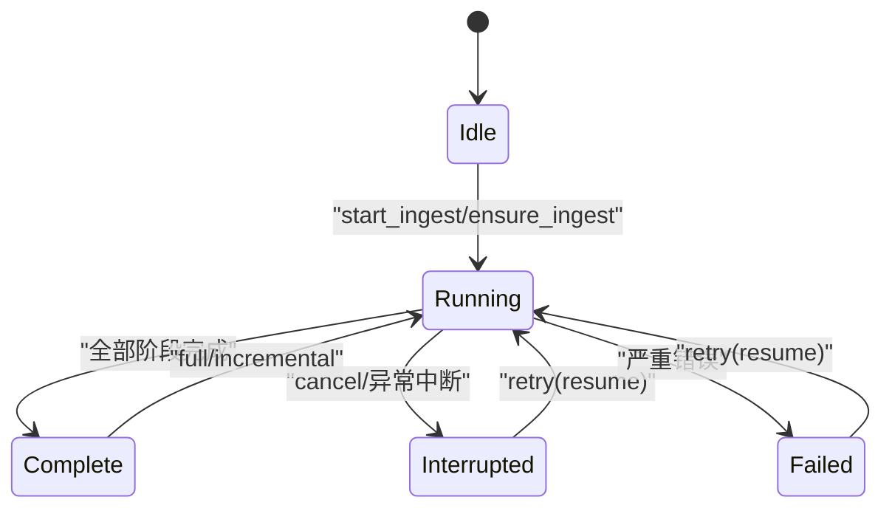

**图表来源** 
- [ingest_pipeline.py:167-178](file://python/sidecar/ingest_pipeline.py#L167-L178)
- [ingest_pipeline.py:480-800](file://python/sidecar/ingest_pipeline.py#L480-L800)

### 级联综述更新序列图
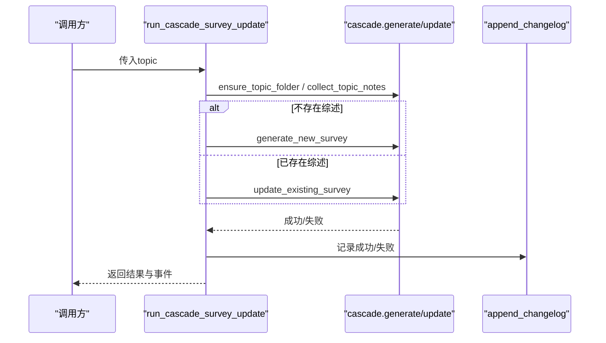

**图表来源** 
- [cascade_runner.py:74-154](file://python/sidecar/cascade_runner.py#L74-L154)
- [cascade.py:388-426](file://python/sidecar/cascade.py#L388-L426)