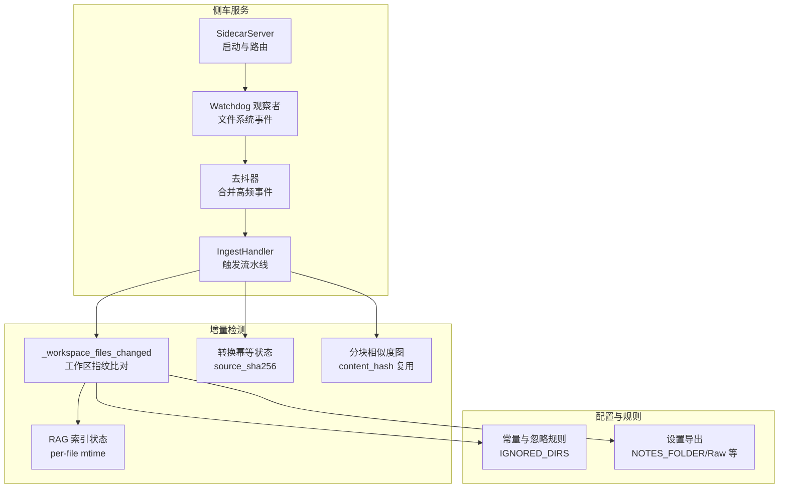
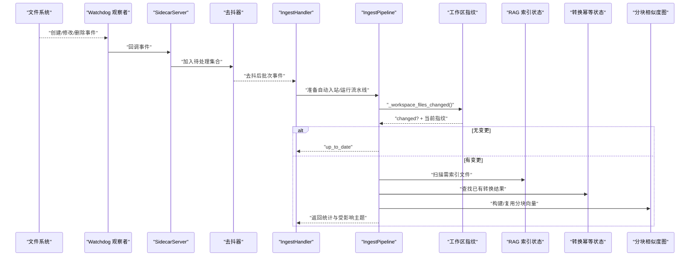
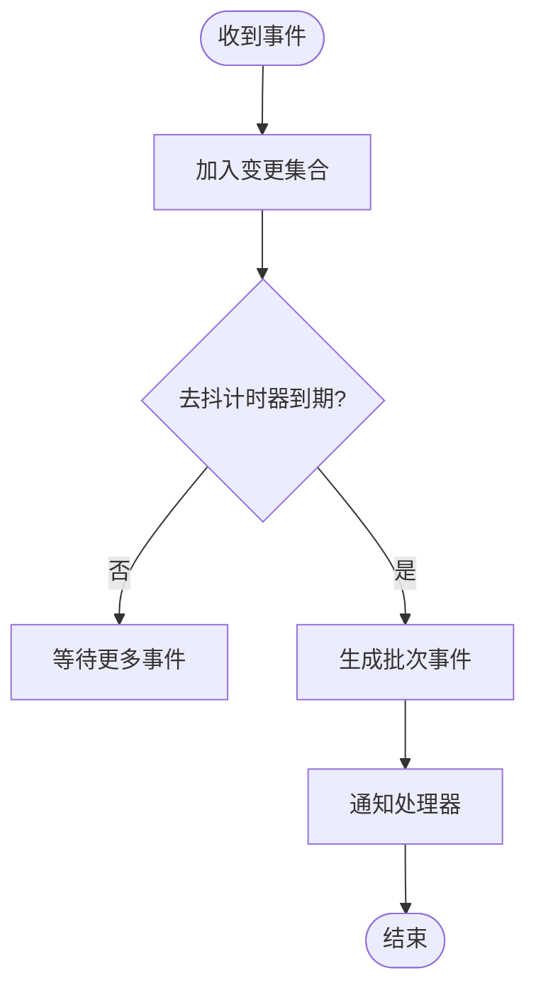
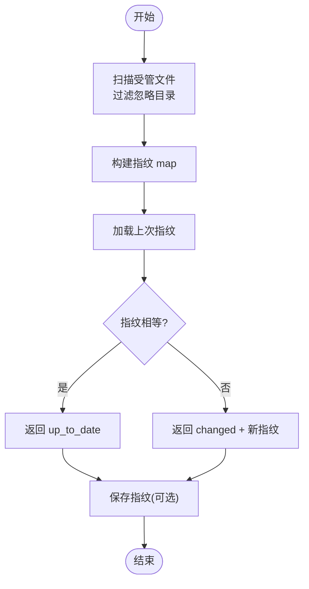
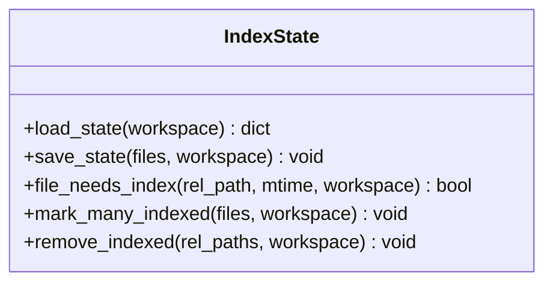
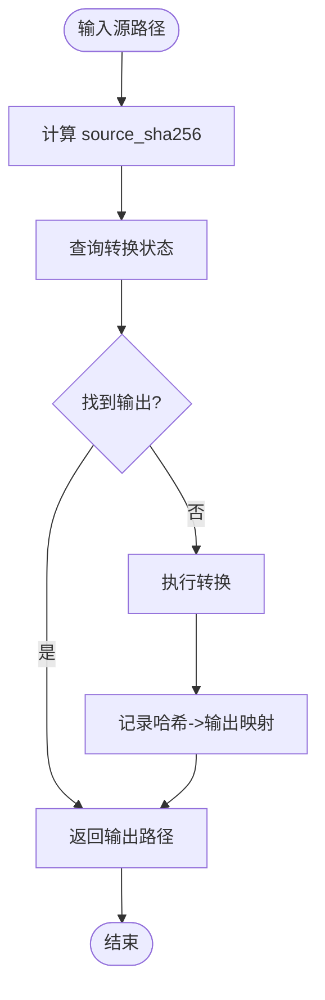
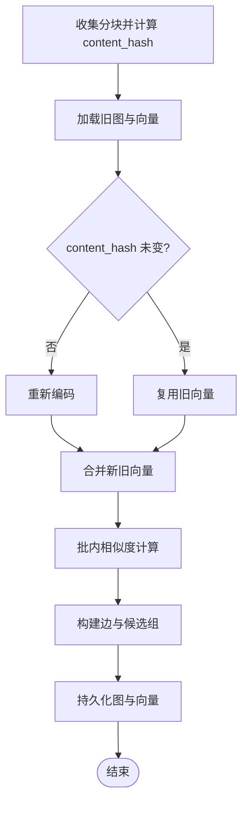
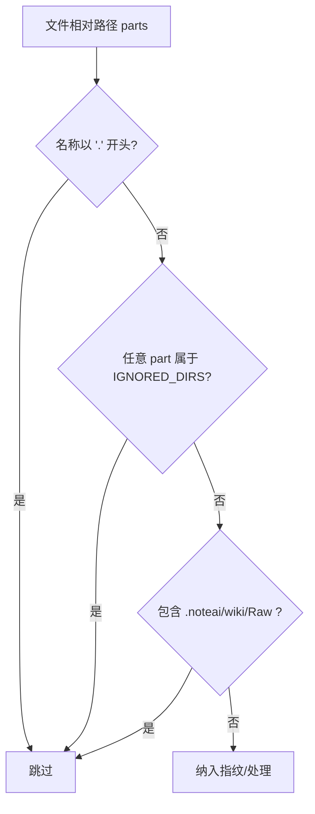
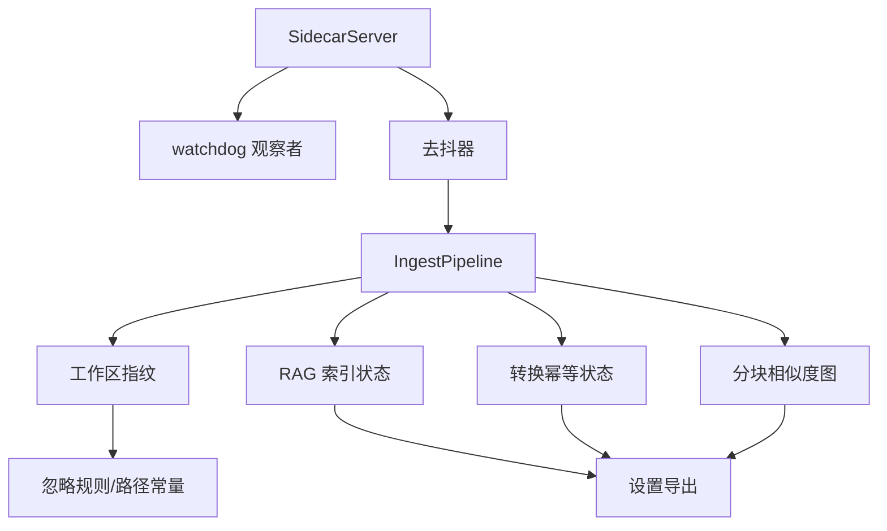

# 文件监控与变更检测

<cite>
**本文引用的文件**   
- [server.py](file://python/sidecar/server.py)
- [ingest_pipeline.py](file://python/sidecar/ingest_pipeline.py)
- [index_state.py](file://python/sidecar/rag/index_state.py)
- [conversion_state.py](file://python/sidecar/conversion_state.py)
- [chunk_similarity.py](file://python/sidecar/chunk_similarity.py)
- [constants.py](file://config/constants.py)
- [settings.py](file://config/settings.py)
</cite>

## 目录
1. [简介](#简介)
2. [项目结构](#项目结构)
3. [核心组件](#核心组件)
4. [架构总览](#架构总览)
5. [详细组件分析](#详细组件分析)
6. [依赖关系分析](#依赖关系分析)
7. [性能考量](#性能考量)
8. [故障排除指南](#故障排除指南)
9. [结论](#结论)
10. [附录：配置示例](#附录配置示例)

## 简介
本技术文档聚焦 NoteAI 的文件监控与变更检测系统，系统性阐述以下方面：
- 文件系统监听机制与事件去抖策略
- 增量检测算法（指纹、差异比较、批量处理）
- 指纹计算、内容哈希与向量索引状态管理
- 忽略规则的配置方式与路径过滤
- 内存管理与并发控制
- 事件处理流程图、监控架构图
- 监控配置示例与大规模文件场景的优化建议

## 项目结构
与“文件监控与变更检测”直接相关的代码主要分布在 sidecar 服务层与 RAG 索引状态模块中，配合配置常量完成路径与忽略规则。

图示来源
- [server.py:54-106](file://python/sidecar/server.py#L54-L106)
- [ingest_pipeline.py:93-104](file://python/sidecar/ingest_pipeline.py#L93-L104)
- [index_state.py:75-91](file://python/sidecar/rag/index_state.py#L75-L91)
- [conversion_state.py:18-23](file://python/sidecar/conversion_state.py#L18-L23)
- [chunk_similarity.py:33-48](file://python/sidecar/chunk_similarity.py#L33-L48)
- [constants.py:35-51](file://config/constants.py#L35-L51)
- [settings.py:1-41](file://config/settings.py#L1-L41)

章节来源
- [server.py:54-106](file://python/sidecar/server.py#L54-L106)
- [ingest_pipeline.py:93-104](file://python/sidecar/ingest_pipeline.py#L93-L104)
- [index_state.py:75-91](file://python/sidecar/rag/index_state.py#L75-L91)
- [conversion_state.py:18-23](file://python/sidecar/conversion_state.py#L18-L23)
- [chunk_similarity.py:33-48](file://python/sidecar/chunk_similarity.py#L33-L48)
- [constants.py:35-51](file://config/constants.py#L35-L51)
- [settings.py:1-41](file://config/settings.py#L1-L41)

## 核心组件
- 文件系统监听与去抖：基于 Watchdog 的事件观察与内部去抖计时器，聚合短时间内的高频写入，避免重复触发。
- 工作区指纹：对受管文件集合生成轻量指纹（相对路径 -> [mtime, size]），持久化到工作区应用目录，用于快速判断是否有变更。
- RAG 索引状态：维护每个 Markdown 文件的最后索引时间戳，跳过未改动文件，实现细粒度增量索引。
- 转换幂等状态：记录源文件 SHA256 与输出笔记映射，避免重复转换并支持按哈希定位已生成笔记。
- 分块相似度图：为相似性分析与合并候选提供基础，复用 content_hash 避免重复编码。
- 忽略规则：通过常量集与路径前缀过滤，排除系统目录、wiki、Raw 等无关路径。

章节来源
- [server.py:54-106](file://python/sidecar/server.py#L54-L106)
- [ingest_pipeline.py:65-104](file://python/sidecar/ingest_pipeline.py#L65-L104)
- [index_state.py:22-91](file://python/sidecar/rag/index_state.py#L22-L91)
- [conversion_state.py:18-86](file://python/sidecar/conversion_state.py#L18-L86)
- [chunk_similarity.py:33-48](file://python/sidecar/chunk_similarity.py#L33-L48)
- [constants.py:35-51](file://config/constants.py#L35-L51)
- [settings.py:1-41](file://config/settings.py#L1-L41)

## 架构总览
下图展示了从文件系统事件到增量检测与后续处理的端到端流程。

图示来源
- [server.py:54-106](file://python/sidecar/server.py#L54-L106)
- [ingest_pipeline.py:93-104](file://python/sidecar/ingest_pipeline.py#L93-L104)
- [index_state.py:75-91](file://python/sidecar/rag/index_state.py#L75-L91)
- [conversion_state.py:65-86](file://python/sidecar/conversion_state.py#L65-L86)
- [chunk_similarity.py:151-172](file://python/sidecar/chunk_similarity.py#L151-L172)

## 详细组件分析

### 文件系统监听与事件去抖
- 监听范围：侧车服务在启动时初始化观察者，订阅工作区内的文件变化。
- 事件收集：将事件路径加入内部集合，使用去抖计时器合并短时间内的多次事件，降低抖动带来的重复处理。
- 触发策略：去抖完成后，通知 IngestHandler 进行下一步决策（是否立即运行或标记待处理）。

图示来源
- [server.py:54-106](file://python/sidecar/server.py#L54-L106)

章节来源
- [server.py:54-106](file://python/sidecar/server.py#L54-L106)

### 工作区指纹与增量检测
- 指纹定义：遍历工作区，收集受管文件（Markdown 与可转换格式），过滤隐藏文件、系统目录、wiki、Raw 等，记录相对路径到 [mtime, size] 的映射。
- 变更判定：加载上次指纹并与当前指纹对比，若完全一致则判定无变更；否则标记有变更并保存新指纹。
- 快速路径：当工作区处于“已完成”且无待处理任务时，可直接返回“已是最新”，但仍更新指纹以维持重启后的快速路径。

图示来源
- [ingest_pipeline.py:65-104](file://python/sidecar/ingest_pipeline.py#L65-L104)

章节来源
- [ingest_pipeline.py:65-104](file://python/sidecar/ingest_pipeline.py#L65-L104)

### RAG 索引状态与细粒度增量
- 状态文件：在工作区应用目录下维护 per-file mtime 状态，缺失时可从 RAG manifest 恢复。
- 需要索引判定：比较当前文件 mtime 与上次索引 mtime，阈值容差避免毫秒级抖动导致误判。
- 批量提交：成功索引后批量更新状态文件，保证原子性与一致性。

图示来源
- [index_state.py:22-91](file://python/sidecar/rag/index_state.py#L22-L91)

章节来源
- [index_state.py:22-91](file://python/sidecar/rag/index_state.py#L22-L91)

### 转换幂等状态与内容哈希
- 源文件哈希：对源文件流式计算 SHA256，避免大文件一次性读入内存。
- 幂等查询：根据哈希查找已存在的转换输出笔记，若存在则跳过转换。
- 记录映射：转换成功后记录哈希到输出路径的映射，便于后续定位与清理。

图示来源
- [conversion_state.py:18-86](file://python/sidecar/conversion_state.py#L18-L86)

章节来源
- [conversion_state.py:18-86](file://python/sidecar/conversion_state.py#L18-L86)

### 分块相似度图与内容哈希复用
- 分块收集：遍历 Notes 下的 Markdown，分块并计算 content_hash。
- 向量复用：若 content_hash 未变，复用上次计算的向量，减少重复编码。
- 批量化计算：对矩阵进行批内相似度计算，限制 top_k 与阈值，降低复杂度。

图示来源
- [chunk_similarity.py:33-48](file://python/sidecar/chunk_similarity.py#L33-L48)
- [chunk_similarity.py:151-172](file://python/sidecar/chunk_similarity.py#L151-L172)
- [chunk_similarity.py:179-196](file://python/sidecar/chunk_similarity.py#L179-L196)

章节来源
- [chunk_similarity.py:33-48](file://python/sidecar/chunk_similarity.py#L33-L48)
- [chunk_similarity.py:151-172](file://python/sidecar/chunk_similarity.py#L151-L172)
- [chunk_similarity.py:179-196](file://python/sidecar/chunk_similarity.py#L179-L196)

### 忽略规则与路径过滤
- 忽略目录：通过常量集匹配目录名（不区分大小写），在指纹扫描与分类扫描中跳过这些目录。
- 路径前缀过滤：在指纹构建阶段排除 .noteai、wiki、Raw 等子路径，避免系统数据参与变更检测。
- 配置导出：设置模块统一导出 NOTES_FOLDER、RAW_FOLDER、WORKSPACE_APP_FOLDER 等关键常量，供各模块引用。

图示来源
- [ingest_pipeline.py:65-90](file://python/sidecar/ingest_pipeline.py#L65-L90)
- [constants.py:35-51](file://config/constants.py#L35-L51)
- [settings.py:1-41](file://config/settings.py#L1-L41)

章节来源
- [ingest_pipeline.py:65-90](file://python/sidecar/ingest_pipeline.py#L65-L90)
- [constants.py:35-51](file://config/constants.py#L35-L51)
- [settings.py:1-41](file://config/settings.py#L1-L41)

## 依赖关系分析
- 组件耦合：
  - SidecarServer 依赖 Watchdog 观察者与去抖逻辑，负责事件入口。
  - IngestPipeline 依赖工作区指纹、RAG 索引状态、转换幂等状态与分块相似度图，形成完整的增量检测链路。
  - 配置常量与设置模块被多处引用，确保路径与忽略规则的一致性。
- 外部依赖：
  - watchdog 库用于文件系统事件监听。
  - numpy 用于向量相似度批计算。
  - hashlib 用于内容哈希。

图示来源
- [server.py:54-106](file://python/sidecar/server.py#L54-L106)
- [ingest_pipeline.py:93-104](file://python/sidecar/ingest_pipeline.py#L93-L104)
- [index_state.py:22-91](file://python/sidecar/rag/index_state.py#L22-L91)
- [conversion_state.py:18-86](file://python/sidecar/conversion_state.py#L18-L86)
- [chunk_similarity.py:151-172](file://python/sidecar/chunk_similarity.py#L151-L172)
- [constants.py:35-51](file://config/constants.py#L35-L51)
- [settings.py:1-41](file://config/settings.py#L1-L41)

章节来源
- [server.py:54-106](file://python/sidecar/server.py#L54-L106)
- [ingest_pipeline.py:93-104](file://python/sidecar/ingest_pipeline.py#L93-L104)
- [index_state.py:22-91](file://python/sidecar/rag/index_state.py#L22-L91)
- [conversion_state.py:18-86](file://python/sidecar/conversion_state.py#L18-L86)
- [chunk_similarity.py:151-172](file://python/sidecar/chunk_similarity.py#L151-L172)
- [constants.py:35-51](file://config/constants.py#L35-L51)
- [settings.py:1-41](file://config/settings.py#L1-L41)

## 性能考量
- 事件去抖：合并短时间内的密集事件，显著降低重复处理开销。
- 指纹快速路径：仅比较 mtime+size，避免全量内容哈希；仅在必要时才深入检查。
- 细粒度索引：基于 per-file mtime 的索引状态，跳过未改动文件，减少向量编码与写入。
- 向量复用：分块相似度图利用 content_hash 复用旧向量，避免重复编码。
- 批处理：相似度计算采用批内矩阵乘法与 top_k 截断，控制内存与 CPU 占用。
- 原子写入：指纹、索引状态、转换状态均使用临时文件替换，保证一致性。

[本节为通用性能指导，无需具体文件分析]

## 故障排除指南
- 工作区未配置规则：
  - 现象：流水线提示需要先完成工作区整理规则配置。
  - 排查：检查工作区应用目录中的规则文件是否存在且已标记为已配置。
- 索引不可用：
  - 现象：提示 RAG 索引不可访问，需关闭其他实例。
  - 排查：确认索引锁未被占用，尝试重启服务或清理残留锁。
- 大量文件监控卡顿：
  - 现象：初次扫描耗时较长。
  - 排查：确认忽略规则生效，避免扫描 wiki、Raw 等目录；适当增大去抖间隔；分批处理。
- 重复转换：
  - 现象：相同源文件被反复转换。
  - 排查：检查转换幂等状态文件是否损坏或被清空；确认 source_sha256 计算正常。
- 索引状态不一致：
  - 现象：部分文件被重复索引。
  - 排查：检查 rag_index_state.json 与 file_manifest.json 的一致性；必要时重建索引状态。

章节来源
- [ingest_pipeline.py:598-617](file://python/sidecar/ingest_pipeline.py#L598-L617)
- [ingest_pipeline.py:384-386](file://python/sidecar/ingest_pipeline.py#L384-L386)
- [conversion_state.py:18-86](file://python/sidecar/conversion_state.py#L18-L86)
- [index_state.py:22-49](file://python/sidecar/rag/index_state.py#L22-L49)

## 结论
NoteAI 的文件监控与变更检测系统通过 Watchdog 事件监听、工作区指纹快速比对、RAG 索引状态细粒度增量、转换幂等与分块向量复用等多重机制，实现了高效、稳定、可扩展的变更处理流程。忽略规则与路径过滤进一步降低了无关数据的干扰，原子写入与批处理保障了数据一致性与性能。针对大规模文件场景，建议结合去抖策略、忽略规则与批处理参数进行调优。

[本节为总结性内容，无需具体文件分析]

## 附录：配置示例
- 忽略规则配置：
  - 在常量集中维护 IGNORED_DIRS，确保目录名匹配不区分大小写。
  - 在指纹构建与分类扫描中，对路径 parts 逐一检查是否命中忽略规则。
- 路径常量：
  - 使用设置模块导出的 NOTES_FOLDER、RAW_FOLDER、WORKSPACE_APP_FOLDER 等常量，保持跨模块一致性。
- 监控范围：
  - 仅监控 Notes 目录下的 Markdown 与 Raw 目录下的可转换文件，避免 wiki 与系统目录参与变更检测。
- 去抖与批处理：
  - 合理设置去抖间隔，平衡实时性与性能。
  - 对相似度计算与索引更新采用批处理，控制内存峰值。

章节来源
- [constants.py:35-51](file://config/constants.py#L35-L51)
- [settings.py:1-41](file://config/settings.py#L1-L41)
- [ingest_pipeline.py:65-90](file://python/sidecar/ingest_pipeline.py#L65-L90)