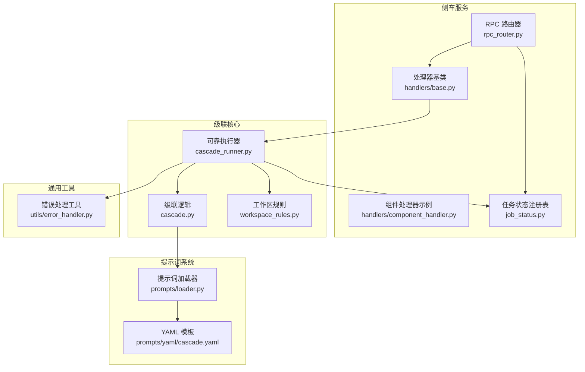
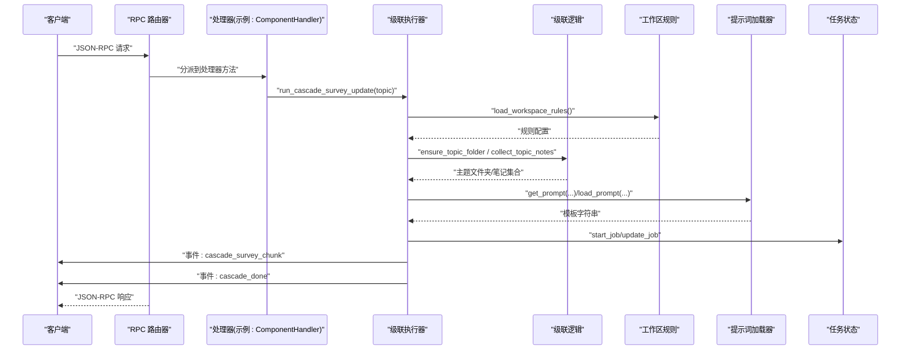
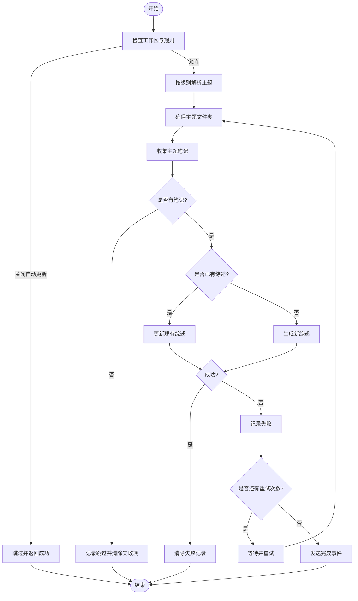
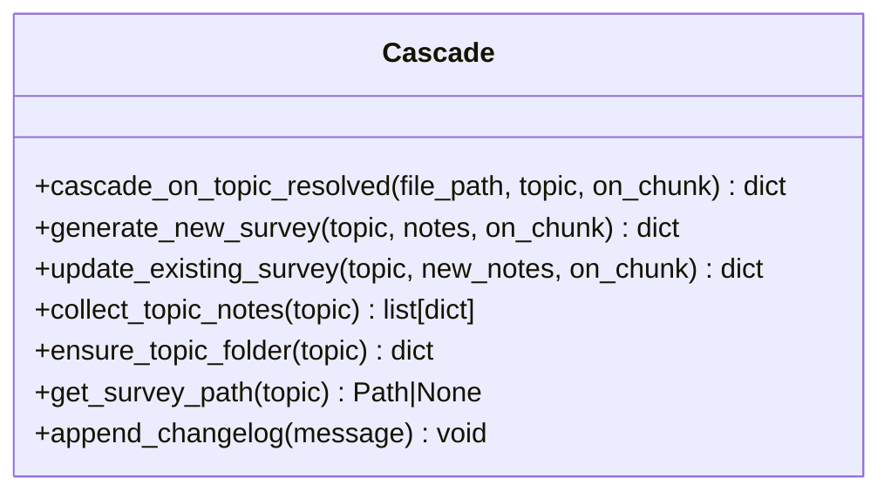
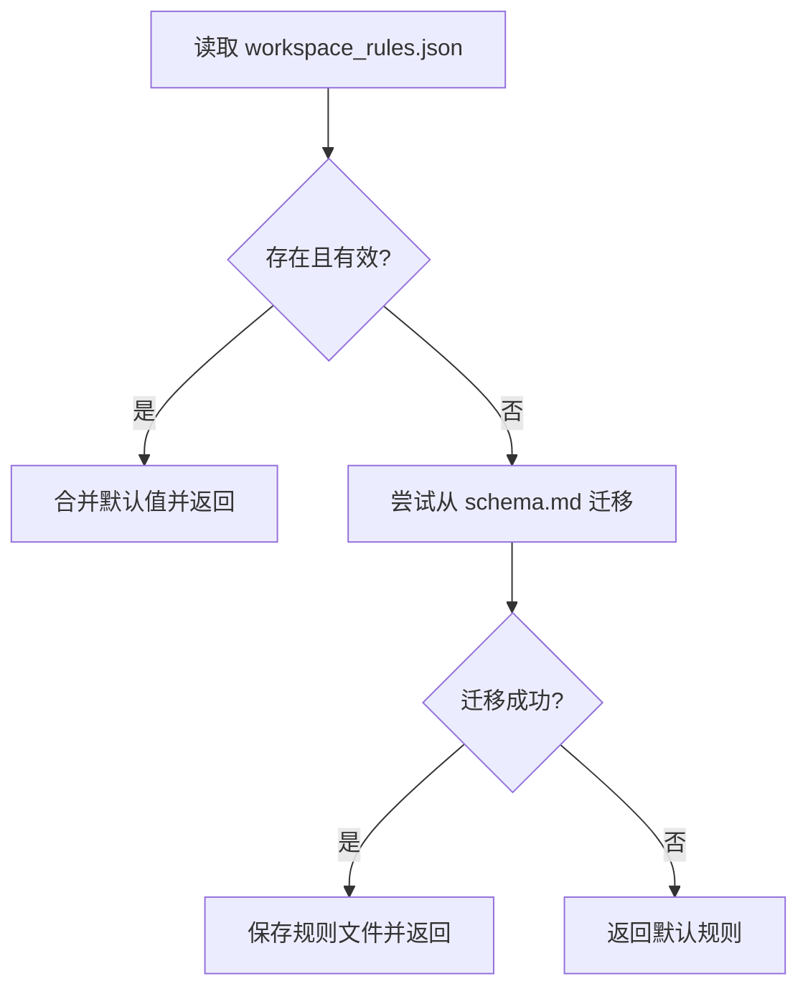
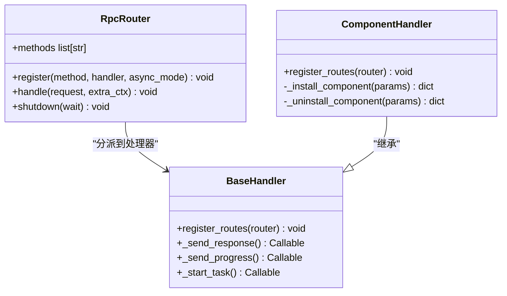
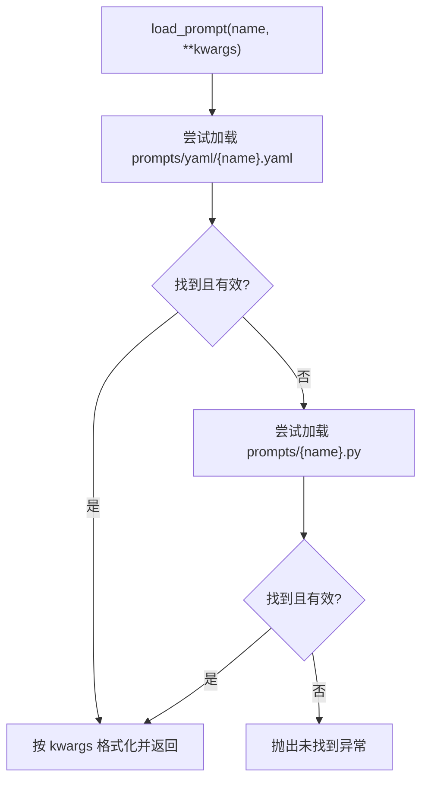
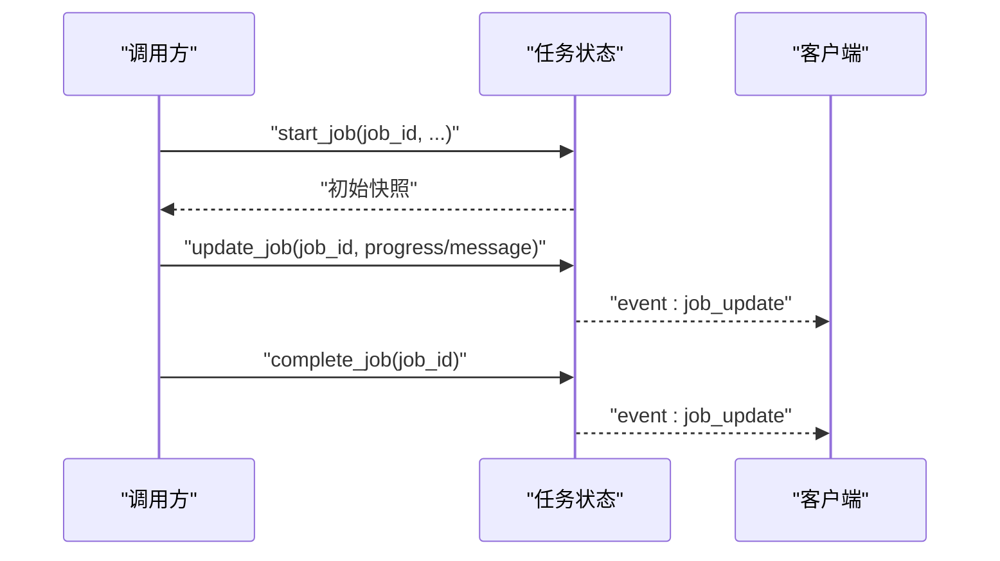
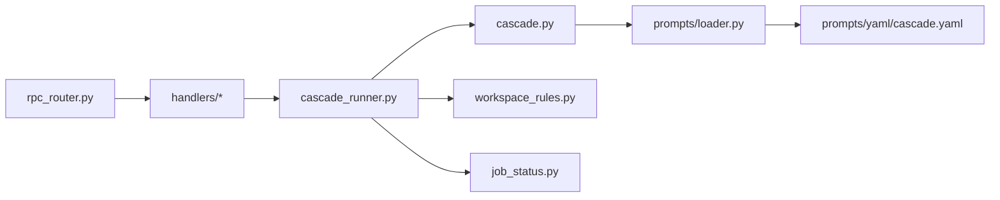

# 级联处理器

<cite>
**本文引用的文件**   
- [cascade.py](file://python/sidecar/cascade.py)
- [cascade_runner.py](file://python/sidecar/cascade_runner.py)
- [workspace_rules.py](file://python/sidecar/workspace_rules.py)
- [rpc_router.py](file://python/sidecar/rpc_router.py)
- [job_status.py](file://python/sidecar/job_status.py)
- [base.py](file://python/sidecar/handlers/base.py)
- [component_handler.py](file://python/sidecar/handlers/component_handler.py)
- [loader.py](file://prompts/loader.py)
- [cascade.yaml](file://prompts/yaml/cascade.yaml)
- [error_handler.py](file://utils/error_handler.py)
</cite>

## 目录
1. [引言](#引言)
2. [项目结构](#项目结构)
3. [核心组件](#核心组件)
4. [架构总览](#架构总览)
5. [详细组件分析](#详细组件分析)
6. [依赖关系分析](#依赖关系分析)
7. [性能考虑](#性能考虑)
8. [故障排查指南](#故障排查指南)
9. [结论](#结论)
10. [附录：处理器开发指南与最佳实践](#附录处理器开发指南与最佳实践)

## 引言
本文件面向 NoteAI 的“级联处理器”系统，系统性阐述其执行模型、任务调度、依赖管理、并行执行与错误恢复机制；说明处理器的注册机制、生命周期管理与资源清理；解释提示词模板的动态加载与环境隔离；并提供级联流程图、任务队列设计、性能优化策略以及自定义处理器开发与调试指南。目标是帮助读者快速理解并扩展该子系统。

## 项目结构
围绕级联处理器，关键代码分布在以下模块：
- 级联编排与执行：sidecar/cascade.py、sidecar/cascade_runner.py
- 工作区规则与主题解析：sidecar/workspace_rules.py
- RPC 路由与线程池：sidecar/rpc_router.py
- 任务状态跟踪：sidecar/job_status.py
- 处理器基类与示例：sidecar/handlers/base.py、handlers/component_handler.py
- 提示词动态加载：prompts/loader.py、prompts/yaml/cascade.yaml
- 统一错误处理工具：utils/error_handler.py

图表来源
- [rpc_router.py:43-106](file://python/sidecar/rpc_router.py#L43-L106)
- [base.py:4-106](file://python/sidecar/handlers/base.py#L4-L106)
- [component_handler.py:10-107](file://python/sidecar/handlers/component_handler.py#L10-L107)
- [cascade_runner.py:74-219](file://python/sidecar/cascade_runner.py#L74-L219)
- [cascade.py:388-426](file://python/sidecar/cascade.py#L388-L426)
- [workspace_rules.py:59-92](file://python/sidecar/workspace_rules.py#L59-L92)
- [loader.py:34-64](file://prompts/loader.py#L34-L64)
- [cascade.yaml:1-72](file://prompts/yaml/cascade.yaml#L1-L72)
- [job_status.py:35-118](file://python/sidecar/job_status.py#L35-L118)
- [error_handler.py:24-120](file://utils/error_handler.py#L24-L120)

章节来源
- [rpc_router.py:43-106](file://python/sidecar/rpc_router.py#L43-L106)
- [base.py:4-106](file://python/sidecar/handlers/base.py#L4-L106)
- [component_handler.py:10-107](file://python/sidecar/handlers/component_handler.py#L10-L107)
- [cascade_runner.py:74-219](file://python/sidecar/cascade_runner.py#L74-L219)
- [cascade.py:388-426](file://python/sidecar/cascade.py#L388-L426)
- [workspace_rules.py:59-92](file://python/sidecar/workspace_rules.py#L59-L92)
- [loader.py:34-64](file://prompts/loader.py#L34-L64)
- [cascade.yaml:1-72](file://prompts/yaml/cascade.yaml#L1-L72)
- [job_status.py:35-118](file://python/sidecar/job_status.py#L35-L118)
- [error_handler.py:24-120](file://utils/error_handler.py#L24-L120)

## 核心组件
- 级联编排（cascade.py）
  - 负责主题路径安全化、笔记收集、综述生成/更新、变更日志记录等。
  - 提供对外入口 cascade_on_topic_resolved(file_path, topic, on_chunk)，用于在主题确定后触发级联流程。
- 可靠执行器（cascade_runner.py）
  - 封装重试、事件推送、失败持久化、批量执行与取消检查。
  - 提供 run_cascade_survey_update(topic, send_response, on_chunk)、run_cascade_for_topics(topics, ...)、retry_failed_cascades(...)。
- 工作区规则（workspace_rules.py）
  - 加载/保存 .noteai/workspace_rules.json，提供 auto_update_survey、survey_at_level 等开关与默认值迁移。
  - 提供 resolve_survey_topic(topic, level) 将任意层级主题归一到指定层级。
- RPC 路由器（rpc_router.py）
  - JSON-RPC 路由，支持同步/异步处理器，内部使用线程池执行，统一错误码与消息脱敏。
- 任务状态（job_status.py）
  - 内存中的任务状态注册表，支持 start/update/complete/fail/cancel/list/clear，并通过事件回调推送 job_update。
- 处理器基类（handlers/base.py）
  - 为各 Handler 提供对服务器上下文、发送响应/进度、启动任务、解析 wiki 标题、缓存、工作区设置、级联更新等能力的便捷访问。
- 组件处理器示例（handlers/component_handler.py）
  - 演示异步安装组件、进度上报、事件推送、锁控制与重启标记。
- 提示词加载器（prompts/loader.py）
  - 优先从 prompts/yaml/*.yaml 加载模板，回退到 legacy Python 模块；支持 system/user 选择与参数格式化。
- 错误处理工具（utils/error_handler.py）
  - 提供 swallow/log_and_reraise/format_exc_compact 等装饰器与工具函数，统一异常日志与包装。

章节来源
- [cascade.py:388-426](file://python/sidecar/cascade.py#L388-L426)
- [cascade_runner.py:74-219](file://python/sidecar/cascade_runner.py#L74-L219)
- [workspace_rules.py:59-92](file://python/sidecar/workspace_rules.py#L59-L92)
- [rpc_router.py:43-106](file://python/sidecar/rpc_router.py#L43-L106)
- [job_status.py:35-118](file://python/sidecar/job_status.py#L35-L118)
- [base.py:4-106](file://python/sidecar/handlers/base.py#L4-L106)
- [component_handler.py:10-107](file://python/sidecar/handlers/component_handler.py#L10-L107)
- [loader.py:34-64](file://prompts/loader.py#L34-L64)
- [error_handler.py:24-120](file://utils/error_handler.py#L24-L120)

## 架构总览
级联处理器采用“RPC 路由 + 处理器基类 + 可靠执行器 + 提示词模板”的分层架构：
- 调用方通过 RPC 路由发起请求，路由将方法分发到具体处理器或执行器。
- 处理器基于基类获取上下文能力，调用可靠执行器完成级联任务。
- 可靠执行器负责重试、事件推送、失败持久化与批量调度。
- 提示词模板由 loader 动态加载，支持 YAML 优先与参数填充。
- 任务状态通过 job_status 统一管理，便于前端展示与查询。

图表来源
- [rpc_router.py:54-82](file://python/sidecar/rpc_router.py#L54-L82)
- [component_handler.py:21-81](file://python/sidecar/handlers/component_handler.py#L21-L81)
- [cascade_runner.py:74-153](file://python/sidecar/cascade_runner.py#L74-L153)
- [workspace_rules.py:59-92](file://python/sidecar/workspace_rules.py#L59-L92)
- [loader.py:34-64](file://prompts/loader.py#L34-L64)
- [job_status.py:35-118](file://python/sidecar/job_status.py#L35-L118)

## 详细组件分析

### 级联执行器（cascade_runner.py）
- 重试与延迟：最多 MAX_RETRIES=3 次，每次间隔 RETRY_DELAY_SEC=2.0s。
- 失败持久化：写入 cascade_failures.json，支持 retry_failed_cascades 重跑。
- 事件推送：on_chunk 透传 LLM 流式片段；_emit_done 统一结束事件。
- 批量执行：run_cascade_for_topics 去重、顺序执行、可取消。
- 规则驱动：根据 auto_update_survey 与 survey_at_level 决定是否执行及目标层级。

图表来源
- [cascade_runner.py:74-153](file://python/sidecar/cascade_runner.py#L74-L153)
- [workspace_rules.py:163-168](file://python/sidecar/workspace_rules.py#L163-L168)

章节来源
- [cascade_runner.py:24-26](file://python/sidecar/cascade_runner.py#L24-L26)
- [cascade_runner.py:28-72](file://python/sidecar/cascade_runner.py#L28-L72)
- [cascade_runner.py:74-153](file://python/sidecar/cascade_runner.py#L74-L153)
- [cascade_runner.py:156-194](file://python/sidecar/cascade_runner.py#L156-L194)
- [workspace_rules.py:163-168](file://python/sidecar/workspace_rules.py#L163-L168)

### 级联逻辑（cascade.py）
- 主题路径安全化：过滤非法字符，保证文件系统安全。
- 笔记收集：扫描 Notes 目录，匹配 frontmatter 的 topic/topics 字段与目录层级。
- 综述生成/更新：根据 notes 数量与内容长度进行压缩，调用 LLM 流式生成，写入带 frontmatter 的综述文件。
- 变更日志：append_changelog 追加到 workspace log。

图表来源
- [cascade.py:388-426](file://python/sidecar/cascade.py#L388-L426)
- [cascade.py:312-346](file://python/sidecar/cascade.py#L312-L346)
- [cascade.py:348-386](file://python/sidecar/cascade.py#L348-L386)
- [cascade.py:118-178](file://python/sidecar/cascade.py#L118-L178)
- [cascade.py:56-76](file://python/sidecar/cascade.py#L56-L76)
- [cascade.py:46-54](file://python/sidecar/cascade.py#L46-L54)
- [cascade.py:429-434](file://python/sidecar/cascade.py#L429-L434)

章节来源
- [cascade.py:14-33](file://python/sidecar/cascade.py#L14-L33)
- [cascade.py:118-178](file://python/sidecar/cascade.py#L118-L178)
- [cascade.py:312-346](file://python/sidecar/cascade.py#L312-L346)
- [cascade.py:348-386](file://python/sidecar/cascade.py#L348-L386)
- [cascade.py:388-426](file://python/sidecar/cascade.py#L388-L426)
- [cascade.py:429-434](file://python/sidecar/cascade.py#L429-L434)

### 工作区规则（workspace_rules.py）
- 规则文件：.noteai/workspace_rules.json，包含 max_topic_depth、auto_update_survey、survey_at_level、ai_may_edit_wiki、ai_may_edit_notes、configured。
- 迁移：若存在 schema.md，则尝试导入旧配置。
- 主题解析：resolve_survey_topic 将任意层级主题归一到指定层级。

图表来源
- [workspace_rules.py:59-92](file://python/sidecar/workspace_rules.py#L59-L92)
- [workspace_rules.py:32-56](file://python/sidecar/workspace_rules.py#L32-L56)
- [workspace_rules.py:163-168](file://python/sidecar/workspace_rules.py#L163-L168)

章节来源
- [workspace_rules.py:15-22](file://python/sidecar/workspace_rules.py#L15-L22)
- [workspace_rules.py:59-92](file://python/sidecar/workspace_rules.py#L59-L92)
- [workspace_rules.py:163-168](file://python/sidecar/workspace_rules.py#L163-L168)

### RPC 路由器与处理器注册（rpc_router.py、handlers/base.py、handlers/component_handler.py）
- RPC 路由器：register(method, handler, async_mode=False)，handle(request) 提交至线程池执行，统一错误码与消息脱敏。
- 处理器基类：提供 _send_response/_send_progress/_start_task 等便捷属性，简化处理器实现。
- 组件处理器示例：演示 register_routes、异步安装、进度上报、事件推送、互斥锁与重启标记。

图表来源
- [rpc_router.py:43-106](file://python/sidecar/rpc_router.py#L43-L106)
- [base.py:4-106](file://python/sidecar/handlers/base.py#L4-L106)
- [component_handler.py:10-107](file://python/sidecar/handlers/component_handler.py#L10-L107)

章节来源
- [rpc_router.py:51-82](file://python/sidecar/rpc_router.py#L51-L82)
- [base.py:4-106](file://python/sidecar/handlers/base.py#L4-L106)
- [component_handler.py:13-16](file://python/sidecar/handlers/component_handler.py#L13-L16)
- [component_handler.py:21-81](file://python/sidecar/handlers/component_handler.py#L21-L81)

### 提示词模板动态加载（prompts/loader.py、prompts/yaml/cascade.yaml）
- 加载优先级：YAML 优先，回退到 legacy Python 模块。
- 支持 system/user 选择与参数格式化。
- 级联相关模板：CASCADE_SURVEY_NEW_PROMPT、CASCADE_SURVEY_UPDATE_PROMPT、SURVEY_CHAT_APPEND_PROMPT。

图表来源
- [loader.py:49-64](file://prompts/loader.py#L49-L64)
- [loader.py:66-89](file://prompts/loader.py#L66-L89)
- [loader.py:92-114](file://prompts/loader.py#L92-L114)
- [cascade.yaml:1-72](file://prompts/yaml/cascade.yaml#L1-L72)

章节来源
- [loader.py:34-64](file://prompts/loader.py#L34-L64)
- [loader.py:66-89](file://prompts/loader.py#L66-L89)
- [loader.py:92-114](file://prompts/loader.py#L92-L114)
- [cascade.yaml:1-72](file://prompts/yaml/cascade.yaml#L1-L72)

### 任务状态与事件（job_status.py）
- 内存有序字典维护任务，支持 start/update/complete/fail/cancel/list/clear。
- 通过 send_event 回调推送 job_update 事件，便于前端实时刷新。

图表来源
- [job_status.py:35-118](file://python/sidecar/job_status.py#L35-L118)

章节来源
- [job_status.py:35-118](file://python/sidecar/job_status.py#L35-L118)
- [job_status.py:174-189](file://python/sidecar/job_status.py#L174-L189)

## 依赖关系分析
- 低耦合高内聚：
  - cascade_runner 仅依赖 cascade 提供的原子能力与 workspace_rules 的配置。
  - rpc_router 与处理器解耦，通过 register 注册方法名与处理函数。
  - prompts/loader 独立于业务逻辑，仅负责模板加载与格式化。
- 外部依赖点：
  - LLM 调用由 cascade 内部间接调用（如 call_llm_raw_stream），不在本文件范围内。
  - 文件系统操作集中在 cascade 与 workspace_rules。
- 潜在循环依赖：
  - 当前未见循环 import；所有跨模块引用均为单向。

图表来源
- [cascade_runner.py:74-153](file://python/sidecar/cascade_runner.py#L74-L153)
- [cascade.py:388-426](file://python/sidecar/cascade.py#L388-L426)
- [workspace_rules.py:59-92](file://python/sidecar/workspace_rules.py#L59-L92)
- [loader.py:34-64](file://prompts/loader.py#L34-L64)
- [rpc_router.py:51-82](file://python/sidecar/rpc_router.py#L51-L82)
- [job_status.py:35-118](file://python/sidecar/job_status.py#L35-L118)

章节来源
- [cascade_runner.py:74-153](file://python/sidecar/cascade_runner.py#L74-L153)
- [cascade.py:388-426](file://python/sidecar/cascade.py#L388-L426)
- [workspace_rules.py:59-92](file://python/sidecar/workspace_rules.py#L59-L92)
- [loader.py:34-64](file://prompts/loader.py#L34-L64)
- [rpc_router.py:51-82](file://python/sidecar/rpc_router.py#L51-L82)
- [job_status.py:35-118](file://python/sidecar/job_status.py#L35-L118)

## 性能考虑
- 并发与线程池
  - RPC 路由器内置 ThreadPoolExecutor，避免阻塞主 I/O 循环。
  - 建议将耗时任务（如 LLM 调用、文件 IO）放入后台任务，通过 job_status 上报进度。
- 重试与退避
  - 固定延迟重试适用于短时抖动；如需更高弹性，可引入指数退避与最大上限。
- 输入压缩
  - 长文本在进入 LLM 前进行句子级压缩，降低 token 消耗与延迟。
- 批量与去重
  - run_cascade_for_topics 对主题去重并顺序执行，避免重复计算。
- 资源限制
  - 合理设置 MAX_WORKERS 与 MAX_JOBS，防止内存膨胀与线程风暴。
- 缓存与增量
  - 对不变的主题结构或模板结果做缓存；仅对新增/修改笔记触发增量更新。

[本节为通用指导，不直接分析具体文件]

## 故障排查指南
- 常见问题定位
  - 未设置工作区：检查 config.workspace_path 是否正确初始化。
  - 规则关闭自动更新：确认 workspace_rules.json 中 auto_update_survey 是否为 True。
  - 无笔记可处理：确认主题下是否存在匹配的 .md 文件与 frontmatter。
  - LLM 配置错误：检查 API 配置校验与网络连通性。
- 失败恢复
  - 查看 cascade_failures.json 中的失败记录，使用 retry_failed_cascades 重跑。
  - 通过 get_changelog 与 append_changelog 追踪变更记录。
- 事件与状态
  - 监听 cascade_survey_chunk 与 cascade_done 事件，确认流式输出与最终结果。
  - 通过 job_status.list_jobs 查看任务状态与错误信息。
- 错误日志
  - 使用 utils.error_handler.log_exception 与 format_exc_compact 辅助定位问题。

章节来源
- [cascade_runner.py:28-72](file://python/sidecar/cascade_runner.py#L28-L72)
- [cascade_runner.py:187-194](file://python/sidecar/cascade_runner.py#L187-L194)
- [cascade.py:429-446](file://python/sidecar/cascade.py#L429-L446)
- [job_status.py:174-189](file://python/sidecar/job_status.py#L174-L189)
- [error_handler.py:24-120](file://utils/error_handler.py#L24-L120)

## 结论
NoteAI 的级联处理器以“规则驱动 + 可靠执行 + 事件反馈”为核心，实现了稳定的综述自动生成与更新。通过 RPC 路由与处理器基类，系统具备良好的可扩展性与清晰的职责边界。提示词模板的动态加载进一步提升了灵活性。结合任务状态与失败持久化，系统在可靠性与可观测性方面表现良好。

[本节为总结性内容，不直接分析具体文件]

## 附录：处理器开发指南与最佳实践
- 处理器注册
  - 在自定义处理器中实现 register_routes(router)，使用 router.register("method_name", self._handler) 注册方法。
  - 参考 handlers/component_handler.py 的注册模式。
- 生命周期管理
  - 在处理器构造时持有 server 引用，通过基类属性访问上下文、发送响应与进度。
  - 对于需要长期运行的任务，使用 _start_task 启动后台任务，并通过 job_status 管理状态。
- 资源清理
  - 在 finally 块释放锁、关闭资源；必要时在 shutdown 钩子中清理线程池与临时文件。
- 错误处理
  - 使用 utils.error_handler.swallow 包裹易错逻辑，返回默认值避免崩溃。
  - 使用 log_and_reraise 记录错误并向上抛出，便于上层统一处理。
- 调试技巧
  - 开启 on_chunk 回调观察 LLM 流式输出。
  - 通过 get_changelog 与 append_changelog 追踪关键步骤。
  - 使用 job_status.list_jobs 与 get_job 查看任务快照。
- 自定义处理器示例思路
  - 定义一个处理器类继承 BaseHandler，实现 register_routes。
  - 在处理方法中调用 cascade_runner.run_cascade_survey_update 或 run_cascade_for_topics。
  - 通过 _send_progress 与 _send_response 向客户端推送进度与事件。
  - 使用 load_workspace_rules 与 resolve_survey_topic 控制行为与目标层级。

章节来源
- [component_handler.py:13-16](file://python/sidecar/handlers/component_handler.py#L13-L16)
- [base.py:4-106](file://python/sidecar/handlers/base.py#L4-L106)
- [error_handler.py:53-82](file://utils/error_handler.py#L53-L82)
- [error_handler.py:85-112](file://utils/error_handler.py#L85-L112)
- [cascade_runner.py:74-153](file://python/sidecar/cascade_runner.py#L74-L153)
- [workspace_rules.py:59-92](file://python/sidecar/workspace_rules.py#L59-L92)
- [workspace_rules.py:163-168](file://python/sidecar/workspace_rules.py#L163-L168)