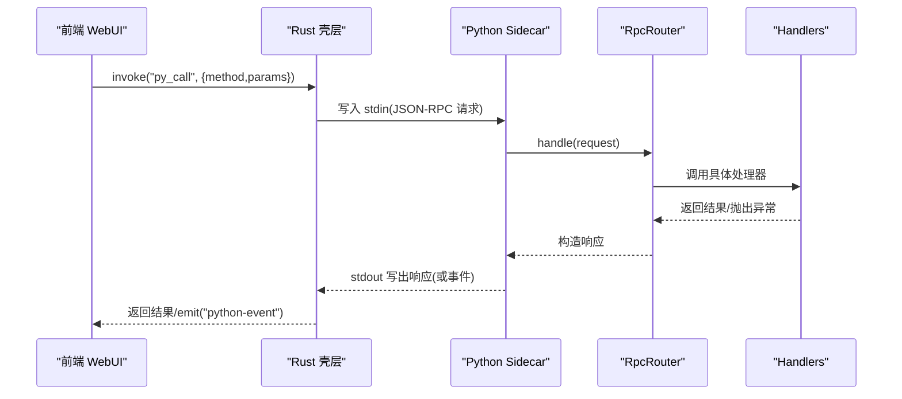
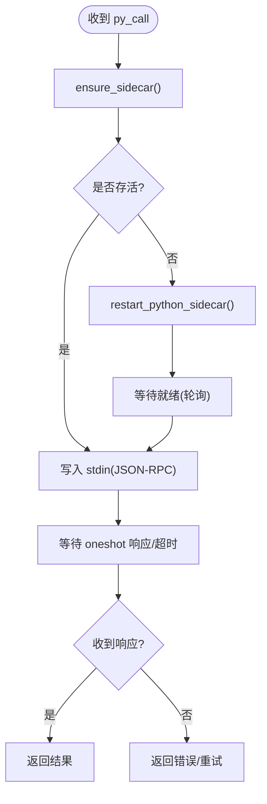
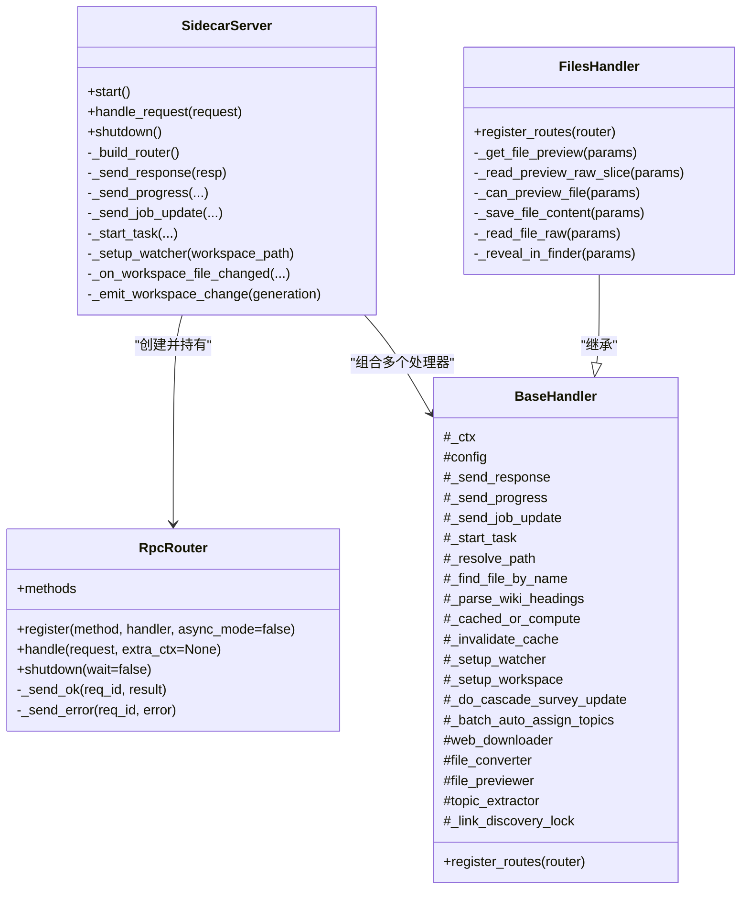
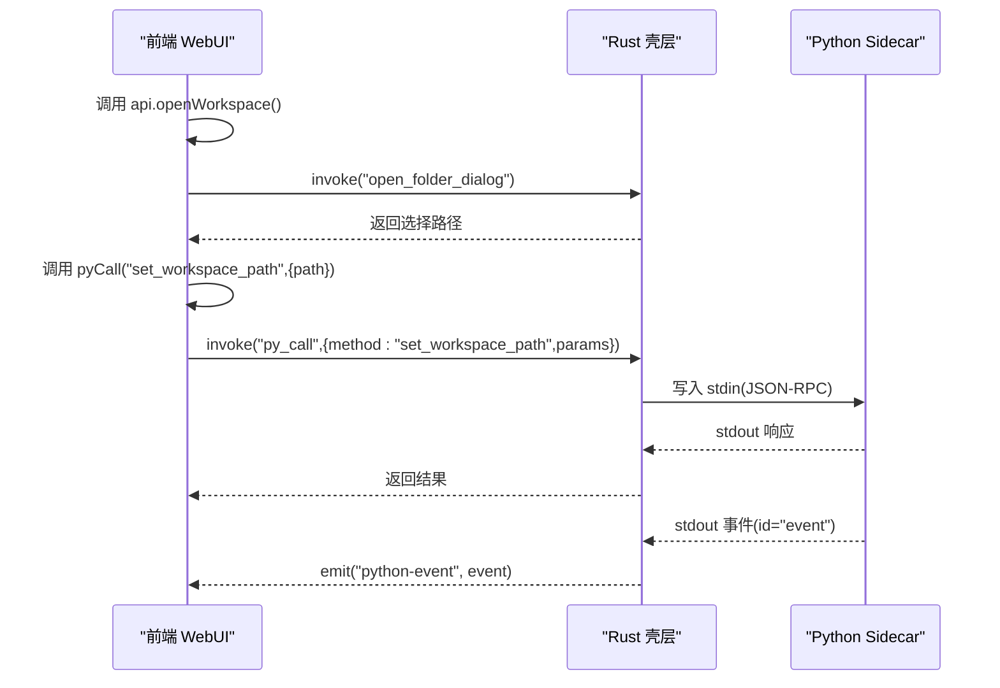
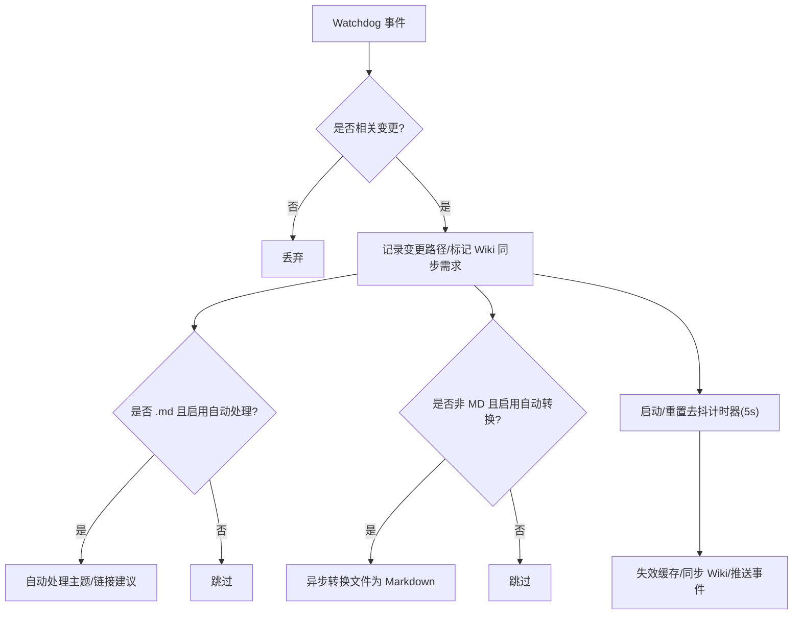
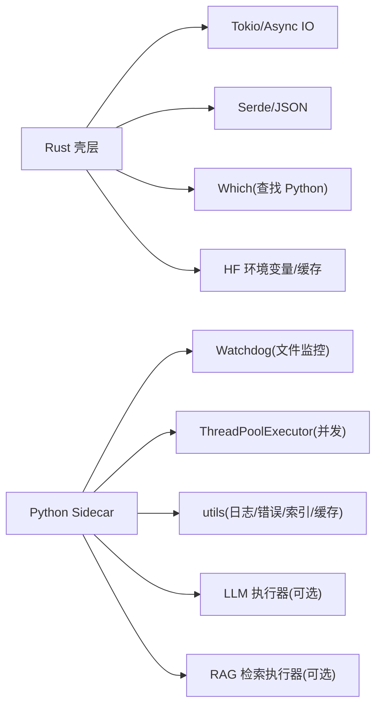

# 架构设计

<cite>
**本文引用的文件**   
- [src-tauri/src/main.rs](file://src-tauri/src/main.rs)
- [src-tauri/src/lib.rs](file://src-tauri/src/lib.rs)
- [src-tauri/src/rpc.rs](file://src-tauri/src/rpc.rs)
- [src-tauri/src/sidecar.rs](file://src-tauri/src/sidecar.rs)
- [src-tauri/src/state.rs](file://src-tauri/src/state.rs)
- [python/main.py](file://python/main.py)
- [python/sidecar/server.py](file://python/sidecar/server.py)
- [python/sidecar/rpc_router.py](file://python/sidecar/rpc_router.py)
- [python/sidecar/handlers/base.py](file://python/sidecar/handlers/base.py)
- [python/sidecar/handlers/files_handler.py](file://python/sidecar/handlers/files_handler.py)
- [webui/js/api.js](file://webui/js/api.js)
- [config/app_config.py](file://config/app_config.py)
- [config/settings.py](file://config/settings.py)
</cite>

## 目录
1. [简介](#简介)
2. [项目结构](#项目结构)
3. [核心组件](#核心组件)
4. [架构总览](#架构总览)
5. [详细组件分析](#详细组件分析)
6. [依赖关系分析](#依赖关系分析)
7. [性能考虑](#性能考虑)
8. [故障排查指南](#故障排查指南)
9. [结论](#结论)
10. [附录](#附录)

## 简介
本架构文档面向 NoteAI 的混合架构：前端 WebUI（Tauri 宿主）+ Rust 壳层 + Python Sidecar 服务。重点阐述以下方面：
- Tauri v2 (Rust) 与 Python sidecar 的通信机制：基于 stdin/stdout 的 JSON-RPC 协议、进程管理与事件通道。
- 前端 webui 与后端服务的交互模式：通过 Tauri invoke 调用 Rust 命令，再由 Rust 转发到 Python。
- 事件驱动架构：Python 侧通过 stdout 推送事件，Rust 侧广播至前端。
- SidecarServer 核心服务类设计与处理器注册机制。
- 文件系统监控、异步处理、并发控制等关键技术决策。
- 系统架构图、组件关系图和数据流图，以及性能、安全边界与扩展性讨论。

## 项目结构
NoteAI 采用分层组织：
- 前端 WebUI：纯静态资源与 JS 逻辑，封装对 Tauri 的调用。
- Rust 壳层（Tauri v2）：负责进程管理、JSON-RPC 路由、事件分发、原生能力桥接。
- Python Sidecar：提供业务逻辑、文件操作、RAG/LLM 集成、工作区监控等。
- 配置与常量：集中式配置加载与校验。

```mermaid
graph TB
subgraph "前端 WebUI"
UI["index.html<br/>JS 模块"]
APIJS["api.js<br/>pyCall / 事件订阅"]
end
subgraph "Rust 壳层 (Tauri v2)"
MAIN["main.rs<br/>入口"]
LIB["lib.rs<br/>插件/命令注册"]
RPC["rpc.rs<br/>方法白名单/超时/重试"]
SIDE["sidecar.rs<br/>进程管理/IO 监听"]
STATE["state.rs<br/>共享状态/请求映射"]
end
subgraph "Python Sidecar"
PMAIN["python/main.py<br/>启动脚本"]
SERVER["server.py<br/>SidecarServer/事件/任务"]
ROUTER["rpc_router.py<br/>RPC 路由/线程池"]
HANDLERS["handlers/*.py<br/>功能处理器"]
end
UI --> APIJS
APIJS --> |invoke('py_call')| RPC
RPC --> |stdin/stdout JSON-RPC| SERVER
SIDE --> |stdout 事件| LIB
LIB --> |window.emit| APIJS
SERVER --> ROUTER
ROUTER --> HANDLERS
```

图表来源
- [src-tauri/src/main.rs:1-4](file://src-tauri/src/main.rs#L1-L4)
- [src-tauri/src/lib.rs:10-49](file://src-tauri/src/lib.rs#L10-L49)
- [src-tauri/src/rpc.rs:173-284](file://src-tauri/src/rpc.rs#L173-L284)
- [src-tauri/src/sidecar.rs:215-312](file://src-tauri/src/sidecar.rs#L215-L312)
- [src-tauri/src/state.rs:9-48](file://src-tauri/src/state.rs#L9-L48)
- [python/main.py:1-21](file://python/main.py#L1-L21)
- [python/sidecar/server.py:54-125](file://python/sidecar/server.py#L54-L125)
- [python/sidecar/rpc_router.py:43-106](file://python/sidecar/rpc_router.py#L43-L106)

章节来源
- [src-tauri/src/main.rs:1-4](file://src-tauri/src/main.rs#L1-L4)
- [src-tauri/src/lib.rs:10-49](file://src-tauri/src/lib.rs#L10-L49)
- [python/main.py:1-21](file://python/main.py#L1-L21)

## 核心组件
- Tauri 应用初始化与命令注册：在 lib.rs 中完成插件加载、AppState 注入、命令绑定与窗口关闭清理。
- Python Sidecar 生命周期：Rust 侧负责查找 Python 解释器、启动子进程、读写标准输入输出、异常退出恢复。
- JSON-RPC 协议：Rust 构造 PyRequest，写入 stdin；Python 读取行并解析为 JSON，交由 RpcRouter 分派到具体处理器。
- 事件通道：Python 通过 stdout 发送 id="event" 的消息，Rust 捕获后以 "python-event" 广播给前端。
- 前端 API 封装：api.js 统一 pyCall 调用、错误翻译与重试、特殊流程（对话框、分页预览）。

章节来源
- [src-tauri/src/lib.rs:10-49](file://src-tauri/src/lib.rs#L10-L49)
- [src-tauri/src/sidecar.rs:215-312](file://src-tauri/src/sidecar.rs#L215-L312)
- [src-tauri/src/rpc.rs:190-284](file://src-tauri/src/rpc.rs#L190-L284)
- [python/sidecar/server.py:540-595](file://python/sidecar/server.py#L540-L595)
- [python/sidecar/rpc_router.py:43-106](file://python/sidecar/rpc_router.py#L43-L106)
- [webui/js/api.js:61-90](file://webui/js/api.js#L61-L90)

## 架构总览
整体数据与控制流如下：
- 前端通过 window.__TAURI__.invoke 调用 Rust 命令 py_call(method, params)。
- Rust 确保 Python 子进程存活，将 JSON-RPC 请求写入 stdin，等待 oneshot 响应或超时。
- Python 主循环从 stdin 逐行读取 JSON，交给 RpcRouter 执行对应 handler，返回结果或推送事件。
- Rust 将 Python 的 stdout 事件转发到前端，形成“请求-响应 + 事件”的双向通信。



图表来源
- [src-tauri/src/rpc.rs:190-284](file://src-tauri/src/rpc.rs#L190-L284)
- [src-tauri/src/sidecar.rs:260-301](file://src-tauri/src/sidecar.rs#L260-L301)
- [python/sidecar/server.py:540-595](file://python/sidecar/server.py#L540-L595)
- [python/sidecar/rpc_router.py:54-83](file://python/sidecar/rpc_router.py#L54-L83)

## 详细组件分析

### Rust 壳层：进程管理与 JSON-RPC 桥接
- 进程发现与启动：按优先级查找 Python 解释器，设置环境变量（HF/HuggingFace 缓存、线程数、编码），启动子进程并接管 stdin/stdout/stderr。
- 健康检查与自动重启：检测管道断开或意外退出时，触发重启流程，避免阻塞用户操作。
- 请求-响应匹配：使用 oneshot channel 与 pending_requests 表进行 id 匹配，支持超时控制。
- 事件转发：识别 id="event" 的消息，直接 emit 到前端，不进入请求匹配。



图表来源
- [src-tauri/src/rpc.rs:173-284](file://src-tauri/src/rpc.rs#L173-L284)
- [src-tauri/src/sidecar.rs:81-107](file://src-tauri/src/sidecar.rs#L81-L107)
- [src-tauri/src/sidecar.rs:215-312](file://src-tauri/src/sidecar.rs#L215-L312)

章节来源
- [src-tauri/src/rpc.rs:173-284](file://src-tauri/src/rpc.rs#L173-L284)
- [src-tauri/src/sidecar.rs:81-107](file://src-tauri/src/sidecar.rs#L81-L107)
- [src-tauri/src/sidecar.rs:215-312](file://src-tauri/src/sidecar.rs#L215-L312)
- [src-tauri/src/state.rs:9-48](file://src-tauri/src/state.rs#L9-L48)

### Python Sidecar：SidecarServer 与 RPC 路由
- SidecarServer 职责：
  - 初始化各子系统（下载器、转换器、预览器、主题提取器等）。
  - 构建 RpcRouter 并注册所有处理器。
  - 启动工作区文件监控（watchdog），批量去抖后失效缓存并同步 Wiki。
  - 后台任务调度（启动巡检、RAG 索引重建等）。
  - 统一的进度/作业状态更新与事件推送。
- RPC 路由：
  - 轻量级 JSON-RPC 路由器，支持同步处理器。
  - 统一错误码与消息脱敏（隐藏绝对路径）。
  - 使用线程池执行处理器，避免阻塞 stdin 读取循环。



图表来源
- [python/sidecar/server.py:54-125](file://python/sidecar/server.py#L54-L125)
- [python/sidecar/rpc_router.py:43-106](file://python/sidecar/rpc_router.py#L43-L106)
- [python/sidecar/handlers/base.py:4-106](file://python/sidecar/handlers/base.py#L4-L106)
- [python/sidecar/handlers/files_handler.py:15-200](file://python/sidecar/handlers/files_handler.py#L15-L200)

章节来源
- [python/sidecar/server.py:54-125](file://python/sidecar/server.py#L54-L125)
- [python/sidecar/rpc_router.py:43-106](file://python/sidecar/rpc_router.py#L43-L106)
- [python/sidecar/handlers/base.py:4-106](file://python/sidecar/handlers/base.py#L4-L106)
- [python/sidecar/handlers/files_handler.py:15-200](file://python/sidecar/handlers/files_handler.py#L15-L200)

### 前端 WebUI：API 封装与事件订阅
- pyCall 封装：
  - 检测 Tauri 环境，获取 invoke 函数。
  - 统一错误翻译与可重试判断（如 sidecar/python/timeout 相关错误）。
  - 默认最多重试两次，指数退避延迟。
- 特殊 API：
  - 打开文件夹/文件对话框、设置工作区路径、导入文件等直接调用 Tauri 原生命令。
  - 大文件预览采用 raw_slices 分页传输，前端拼接 base64 片段还原 UTF-8 文本。
- 事件订阅：
  - 通过 getTauriEventAPI 订阅 "python-event"，接收进度、工作区变更、RAG 索引状态等事件。



图表来源
- [webui/js/api.js:170-184](file://webui/js/api.js#L170-L184)
- [webui/js/api.js:61-90](file://webui/js/api.js#L61-L90)
- [webui/js/api.js:224-248](file://webui/js/api.js#L224-L248)
- [src-tauri/src/rpc.rs:273-284](file://src-tauri/src/rpc.rs#L273-L284)
- [src-tauri/src/sidecar.rs:260-301](file://src-tauri/src/sidecar.rs#L260-L301)

章节来源
- [webui/js/api.js:61-90](file://webui/js/api.js#L61-L90)
- [webui/js/api.js:170-184](file://webui/js/api.js#L170-L184)
- [webui/js/api.js:224-248](file://webui/js/api.js#L224-L248)

### 文件系统监控与工作区联动
- 监控范围：仅关注工作区内非忽略目录与特定后缀的文件（md/txt/pdf/docx/pptx/html/doc/ppt）。
- 去抖策略：使用 Timer 聚合短时间内的多次变更，避免频繁刷新。
- 联动动作：
  - 自动处理新增 .md 文件（主题分配、链接建议等）。
  - 自动转换非 Markdown 文件为 Markdown。
  - 失效 RPC/全文检索/RAG 查询缓存，必要时同步 WIKI.md。
  - 推送 workspace_files_changed 事件给前端。



图表来源
- [python/sidecar/server.py:298-340](file://python/sidecar/server.py#L298-L340)
- [python/sidecar/server.py:416-459](file://python/sidecar/server.py#L416-L459)
- [python/sidecar/server.py:513-540](file://python/sidecar/server.py#L513-L540)

章节来源
- [python/sidecar/server.py:298-340](file://python/sidecar/server.py#L298-L340)
- [python/sidecar/server.py:416-459](file://python/sidecar/server.py#L416-L459)
- [python/sidecar/server.py:513-540](file://python/sidecar/server.py#L513-L540)

### 处理器注册机制与示例：FilesHandler
- 注册方式：各处理器实现 register_routes(router)，在 SidecarServer._build_router 中统一注册。
- FilesHandler 典型能力：
  - 文件预览：小文件语义预览，大文本走 raw_slices 分页。
  - 保存内容：限制大小、保护运行时目录、触发链接建议异步任务。
  - 原始读取：base64 返回二进制内容。
  - 系统暴露：跨平台 reveal_in_finder。

章节来源
- [python/sidecar/server.py:107-125](file://python/sidecar/server.py#L107-L125)
- [python/sidecar/handlers/files_handler.py:42-106](file://python/sidecar/handlers/files_handler.py#L42-L106)
- [python/sidecar/handlers/files_handler.py:117-150](file://python/sidecar/handlers/files_handler.py#L117-L150)
- [python/sidecar/handlers/files_handler.py:156-200](file://python/sidecar/handlers/files_handler.py#L156-L200)

## 依赖关系分析
- Rust 依赖：
  - tauri、tauri_plugin_dialog/shell、tokio、serde_json、uuid、which。
  - 内部模块：commands、rpc、sidecar、state。
- Python 依赖：
  - watchdog（文件系统监控）、concurrent.futures（线程池）、utils（日志、错误码、全文索引、TTL 缓存等）。
- 外部集成：
  - HuggingFace 模型缓存目录与环境变量。
  - LLM 推理执行器与 RAG 检索执行器（在 shutdown 时优雅关闭）。



图表来源
- [src-tauri/src/sidecar.rs:215-312](file://src-tauri/src/sidecar.rs#L215-L312)
- [python/sidecar/server.py:540-595](file://python/sidecar/server.py#L540-L595)

章节来源
- [src-tauri/src/sidecar.rs:215-312](file://src-tauri/src/sidecar.rs#L215-L312)
- [python/sidecar/server.py:540-595](file://python/sidecar/server.py#L540-L595)

## 性能考虑
- 并发与隔离：
  - Python 侧使用线程池执行处理器，避免阻塞 stdin 读取循环。
  - Rust 侧使用 tokio 异步 I/O 与 oneshot 通道，保证高吞吐与低延迟。
- 超时与重试：
  - 针对长耗时方法（rag_chat、ingest、RAG 索引）设置更长超时。
  - 前端对可重试错误进行有限次重试，降低瞬时失败影响。
- 缓存与去抖：
  - TTLCache 减少重复计算；文件变更去抖合并事件，避免频繁刷新。
  - 全文检索与 RAG 查询缓存随文件变更失效。
- 资源管理：
  - 优雅关闭 LLM 与 RAG 执行器，释放线程池与集合缓存。
  - 大文件预览采用分页传输，降低内存峰值。

[本节为通用指导，无需源码引用]

## 故障排查指南
- Python 后端未运行/意外退出：
  - Rust 侧检测到 Broken pipe 或进程退出，自动重启并通知前端。
  - 检查 find_python 候选路径与 NOTEAI_PYTHON 环境变量。
- 请求超时：
  - 确认 rpc_timeout_secs 配置的方法类别，必要时调整超时阈值。
- 权限与路径问题：
  - 保存文件时拒绝写入受保护目录（.noteai/.git/.trash 等）。
  - 工作区路径需存在且具备读写权限。
- 事件丢失：
  - 确认 stdout 编码为 utf-8，PYTHONUNBUFFERED=1 已设置。
  - 前端是否正确订阅 "python-event"。

章节来源
- [src-tauri/src/rpc.rs:169-171](file://src-tauri/src/rpc.rs#L169-L171)
- [src-tauri/src/rpc.rs:173-188](file://src-tauri/src/rpc.rs#L173-L188)
- [src-tauri/src/sidecar.rs:57-79](file://src-tauri/src/sidecar.rs#L57-L79)
- [python/sidecar/handlers/files_handler.py:117-150](file://python/sidecar/handlers/files_handler.py#L117-L150)
- [python/sidecar/server.py:540-595](file://python/sidecar/server.py#L540-L595)

## 结论
NoteAI 的混合架构通过 Tauri v2 与 Python Sidecar 的清晰分工，实现了高性能、可扩展与易维护的系统：
- Rust 负责稳定可靠的进程管理与事件分发，Python 专注复杂业务与 AI 能力。
- JSON-RPC over stdin/stdout 提供了简单高效的 IPC 方案，配合事件通道实现“请求-响应 + 事件”的完整交互。
- 文件系统监控、异步处理与并发控制保障了用户体验与系统稳定性。
- 安全边界（方法白名单、路径保护、错误脱敏）与优雅关闭策略提升了鲁棒性。

[本节为总结，无需源码引用]

## 附录

### 配置与常量
- AppConfig 提供集中式配置加载、校验与持久化，支持环境变量覆盖与密钥安全存储。
- settings.py 导出常用常量与工具，便于各模块一致访问。

章节来源
- [config/app_config.py:28-115](file://config/app_config.py#L28-L115)
- [config/app_config.py:212-311](file://config/app_config.py#L212-L311)
- [config/app_config.py:313-383](file://config/app_config.py#L313-L383)
- [config/settings.py:1-41](file://config/settings.py#L1-L41)