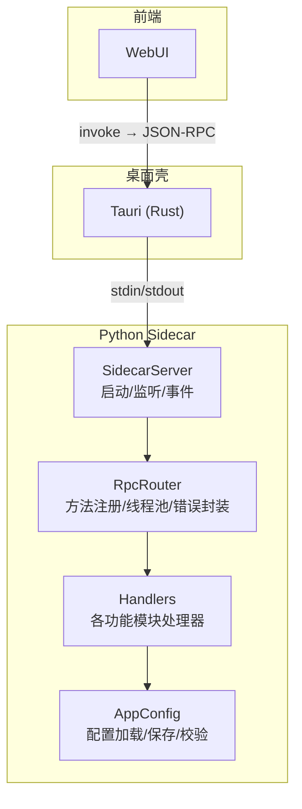
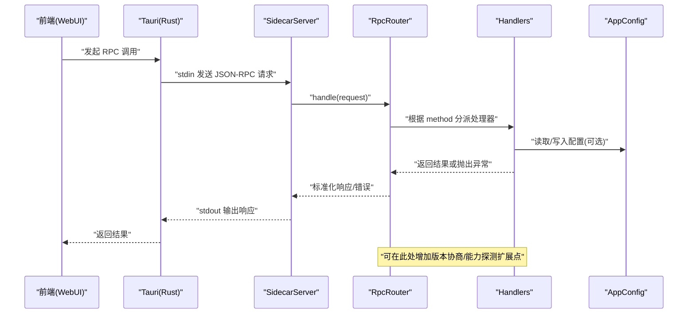
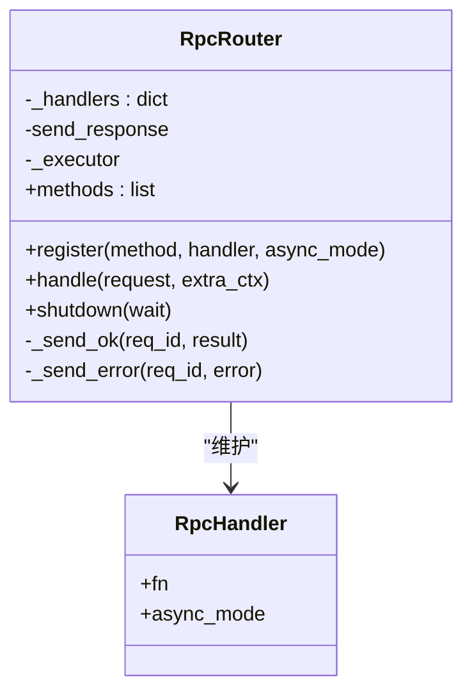
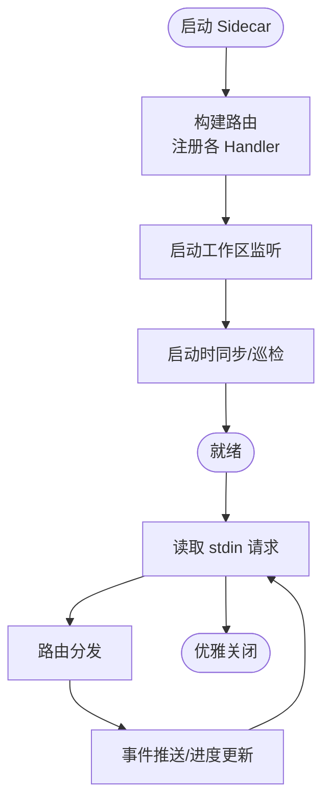
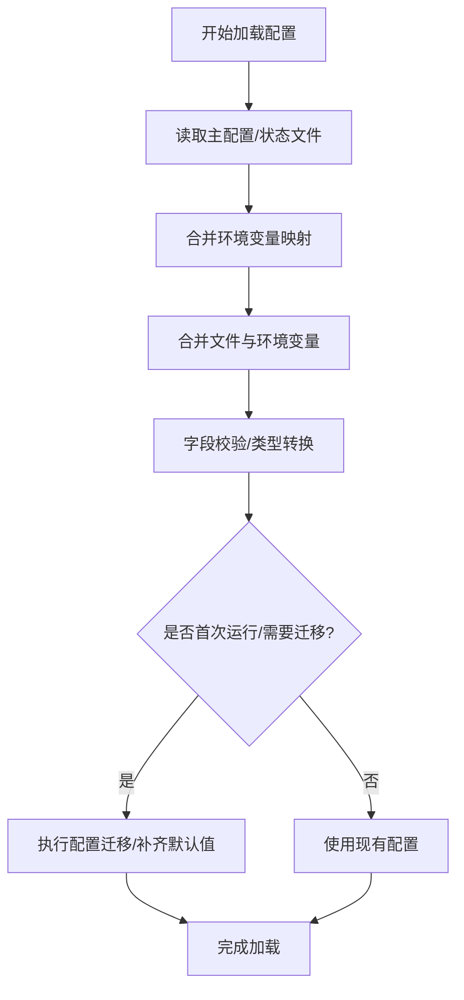
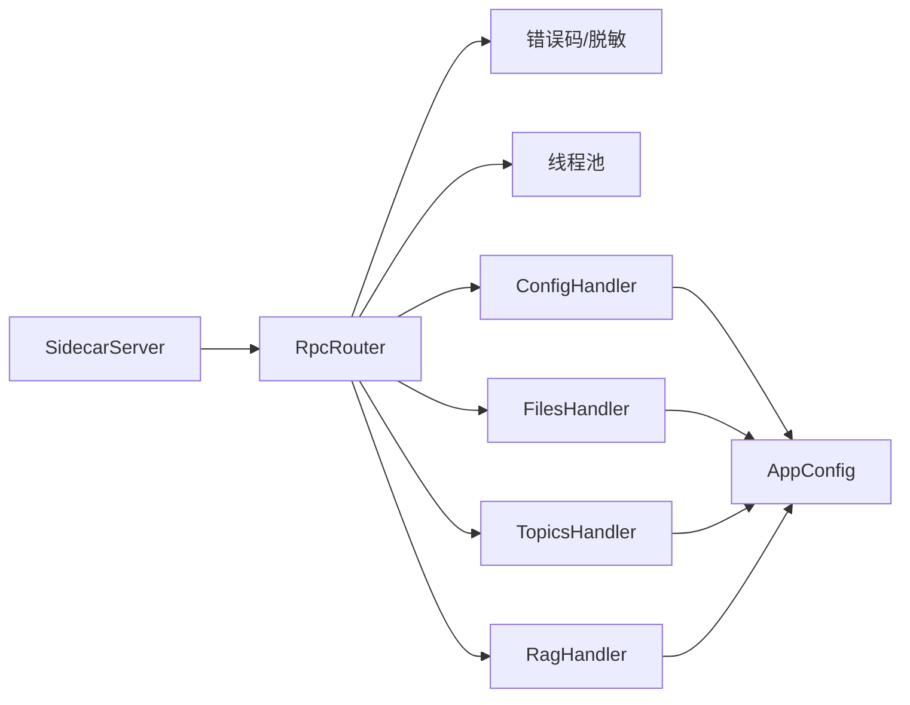

# API 版本管理与兼容性

<cite>
**本文引用的文件**   
- [README.md](file://README.md)
- [server.py](file://python/sidecar/server.py)
- [rpc_router.py](file://python/sidecar/rpc_router.py)
- [settings.py](file://config/settings.py)
- [app_config.py](file://config/app_config.py)
</cite>

## 目录
1. [简介](#简介)
2. [项目结构](#项目结构)
3. [核心组件](#核心组件)
4. [架构总览](#架构总览)
5. [详细组件分析](#详细组件分析)
6. [依赖关系分析](#依赖关系分析)
7. [性能考量](#性能考量)
8. [故障排查指南](#故障排查指南)
9. [结论](#结论)
10. [附录](#附录)

## 简介
本文件面向 NoteAI 的 API 版本管理与兼容性策略，聚焦于以下目标：
- 定义 API 版本控制策略（版本号、向后兼容与向前兼容）
- 废弃 API 的处理机制（弃用警告、迁移路径、最终删除）
- 客户端与服务端版本协商（能力检测与降级处理）
- 配置迁移与数据格式演进（数据库/索引迁移、配置文件升级）
- API 变更管理流程与测试验证方法

NoteAI 采用 Tauri v2 + Python sidecar 架构，前端通过 JSON-RPC 调用后端处理器。当前代码库未显式实现“API 版本字段”或“版本协商协议”，因此本文在尊重现有实现的基础上，提出可落地的版本化与兼容性增强方案，并给出最小侵入的集成点建议。

## 项目结构
NoteAI 的关键层如下：
- 前端（webui）：用户界面与交互逻辑
- 桌面壳（Tauri/Rust）：进程编排与 IPC
- Python sidecar：JSON-RPC 路由、业务处理器、RAG、入库流水线等
- 配置系统：AppConfig 负责加载/保存配置，包含 API 密钥与工作区设置

图表来源
- [server.py:54-125](file://python/sidecar/server.py#L54-L125)
- [rpc_router.py:43-106](file://python/sidecar/rpc_router.py#L43-L106)
- [app_config.py:212-396](file://config/app_config.py#L212-L396)

章节来源
- [README.md:155-203](file://README.md#L155-L203)
- [server.py:54-125](file://python/sidecar/server.py#L54-L125)
- [rpc_router.py:43-106](file://python/sidecar/rpc_router.py#L43-L106)
- [settings.py:1-41](file://config/settings.py#L1-L41)
- [app_config.py:212-396](file://config/app_config.py#L212-L396)

## 核心组件
- SidecarServer：负责启动、工作区监听、任务调度、事件推送、RPC 分发入口
- RpcRouter：轻量 JSON-RPC 路由器，统一错误码、线程池执行、方法注册表
- AppConfig：配置加载/保存/校验，支持环境变量覆盖、敏感信息分离存储
- Handlers：按功能域注册的 RPC 处理器集合（文件、主题、RAG、云同步等）

这些组件共同构成 API 的运行时基础。为实现版本管理与兼容性，可在 Router 与 Handler 层面引入“版本协商”和“能力探测”的最小扩展点。

章节来源
- [server.py:54-125](file://python/sidecar/server.py#L54-L125)
- [rpc_router.py:43-106](file://python/sidecar/rpc_router.py#L43-L106)
- [app_config.py:212-396](file://config/app_config.py#L212-L396)

## 架构总览
下图展示从前端到后端的请求链路，以及可扩展的版本协商位置（以虚线标注）。

图表来源
- [server.py:541-595](file://python/sidecar/server.py#L541-L595)
- [rpc_router.py:54-98](file://python/sidecar/rpc_router.py#L54-L98)
- [app_config.py:212-396](file://config/app_config.py#L212-L396)

## 详细组件分析

### 组件 A：RPC 路由与错误处理（RpcRouter）
- 职责：方法注册、参数解析、线程池执行、统一错误码与消息脱敏
- 兼容性切入点：
  - 在 handle 前对请求进行“版本检查”（如新增 optional 字段 version/capabilities）
  - 对未知 method 返回结构化错误，便于前端做能力回退
  - 错误消息脱敏，避免泄露路径信息

图表来源
- [rpc_router.py:35-106](file://python/sidecar/rpc_router.py#L35-L106)

章节来源
- [rpc_router.py:1-106](file://python/sidecar/rpc_router.py#L1-L106)

### 组件 B：Sidecar 服务与事件总线（SidecarServer）
- 职责：初始化各 Handler、构建路由、工作区文件监听、后台任务、进度事件推送
- 兼容性切入点：
  - 在 _build_router 阶段集中注册所有方法，便于后续加入“版本白名单/灰度开关”
  - 在 start/shutdown 中预留能力探测接口（例如 /version 或 /capabilities）
  - 事件类型（workspace_files_changed、rag_index_needs_rebuild 等）可作为“能力信号”供前端降级

图表来源
- [server.py:97-125](file://python/sidecar/server.py#L97-L125)
- [server.py:221-255](file://python/sidecar/server.py#L221-L255)
- [server.py:570-595](file://python/sidecar/server.py#L570-L595)

章节来源
- [server.py:54-125](file://python/sidecar/server.py#L54-L125)
- [server.py:221-255](file://python/sidecar/server.py#L221-L255)
- [server.py:570-595](file://python/sidecar/server.py#L570-L595)

### 组件 C：配置系统与迁移（AppConfig）
- 职责：加载/保存配置、环境变量覆盖、敏感信息分离、工作区目录初始化
- 兼容性切入点：
  - 在 load_from_file 中实现“配置字段迁移/默认值补齐”
  - 在 save_to_file 中保留“只写非敏感字段”的策略，避免回写敏感信息
  - 提供“配置版本/迁移标记”字段，用于渐进式升级

图表来源
- [app_config.py:212-311](file://config/app_config.py#L212-L311)
- [app_config.py:313-386](file://config/app_config.py#L313-L386)

章节来源
- [app_config.py:212-396](file://config/app_config.py#L212-L396)
- [settings.py:1-41](file://config/settings.py#L1-L41)

## 依赖关系分析
- 耦合关系
  - SidecarServer 依赖 RpcRouter 与各 Handler；Router 依赖错误码工具与日志
  - Handlers 可能依赖 AppConfig 获取工作区路径、模型配置等
- 外部依赖
  - 文件系统监听（watchdog）、线程池、JSON 编解码
- 潜在循环依赖
  - 当前 Router 不直接依赖具体 Handler 实现，仅持有方法名映射，降低耦合
- 扩展点
  - Router.handle 前后可插入“版本协商/能力探测”中间件
  - Router.methods 可用于暴露“可用方法列表”，辅助前端能力检测

图表来源
- [server.py:107-125](file://python/sidecar/server.py#L107-L125)
- [rpc_router.py:43-98](file://python/sidecar/rpc_router.py#L43-L98)
- [app_config.py:212-396](file://config/app_config.py#L212-L396)

章节来源
- [server.py:107-125](file://python/sidecar/server.py#L107-L125)
- [rpc_router.py:43-98](file://python/sidecar/rpc_router.py#L43-L98)

## 性能考量
- 路由执行：所有处理器均提交至线程池，避免阻塞 stdin 读循环
- 缓存与失效：SidecarServer 提供 TTL 缓存并在文件变更时失效，减少重复计算
- 事件节流：工作区变更使用防抖定时器，批量合并事件，降低频繁刷新开销
- 资源清理：shutdown 时有序关闭线程池与 RAG 集合缓存，避免残留句柄

[本节为通用指导，无需特定文件引用]

## 故障排查指南
- 常见错误
  - 未知方法：Router 会返回 METHOD_NOT_FOUND，前端应据此降级或提示升级
  - 内部错误：Router 捕获异常并返回 INTERNAL_ERROR，同时记录堆栈；注意错误消息已脱敏
  - 配置加载失败：AppConfig 会记录警告并使用默认值，需检查权限与文件格式
- 定位步骤
  - 查看 Sidecar 日志与 stdout 事件，确认请求是否到达 Router
  - 核对 Router.methods 是否包含所需方法
  - 检查 AppConfig 加载顺序（环境变量 > 文件 > 默认），确认敏感信息是否被正确分离

章节来源
- [rpc_router.py:54-98](file://python/sidecar/rpc_router.py#L54-L98)
- [app_config.py:212-311](file://config/app_config.py#L212-L311)

## 结论
当前代码库提供了稳定的 JSON-RPC 基础设施与配置系统，具备实现 API 版本管理与兼容性的良好基础。建议在 Router 与 SidecarServer 上以最小改动引入“版本协商/能力探测”，并通过配置迁移机制保障数据与配置的平滑演进。配合完善的测试与发布流程，可实现向后兼容优先、向前兼容可控的稳健升级策略。

[本节为总结性内容，无需特定文件引用]

## 附录

### A. API 版本控制策略（建议）
- 版本号定义
  - 语义化版本：major.minor.patch
  - major：破坏性变更（不兼容）
  - minor：新增能力（兼容）
  - patch：修复问题（兼容）
- 向后兼容保证
  - 新增字段必须可选，旧客户端忽略未知字段
  - 删除字段需先标记废弃，再在下一个 major 移除
- 向前兼容考虑
  - 服务端对未知 method 返回结构化错误，前端据此降级
  - 提供 /version 或 /capabilities 接口，返回服务端能力集

### B. 废弃 API 处理机制（建议）
- 弃用警告
  - 在响应头或响应体中包含 deprecation 字段与过期时间
- 迁移路径
  - 文档化新旧方法对照与字段映射
  - 提供过渡期双写/双读兼容逻辑
- 最终删除
  - 在下一个 major 版本彻底移除，并更新 Router.methods 列表

### C. 客户端与服务端版本协商（建议）
- 协商方式
  - 请求携带 version/capabilities，服务端校验并返回兼容策略
  - 若不支持，返回 METHOD_NOT_FOUND 或 VERSION_MISMATCH
- 降级处理
  - 前端根据 capabilities 选择最佳可用方法
  - 对缺失能力回退到本地缓存或简化流程

### D. 配置迁移与数据格式演进（建议）
- 配置迁移
  - 在 AppConfig.load_from_file 中实现迁移脚本，按“配置版本”逐步升级
  - 保留历史字段作为兼容桥，避免破坏旧工作区
- 数据格式演进
  - 对索引/数据库结构变更，提供迁移工具与回滚策略
  - 增量迁移，避免全量重建带来的性能抖动

### E. API 变更管理流程与测试验证（建议）
- 变更流程
  - 设计评审 → 兼容性评估 → 开发实现 → 单元测试/集成测试 → 文档更新 → 灰度发布
- 测试验证
  - 单元：针对 Router 的错误分支与能力检测
  - 集成：端到端调用链，覆盖降级路径
  - 回归：基于 Router.methods 生成冒烟用例，确保方法可用性

[本节为概念性指导，无需特定文件引用]