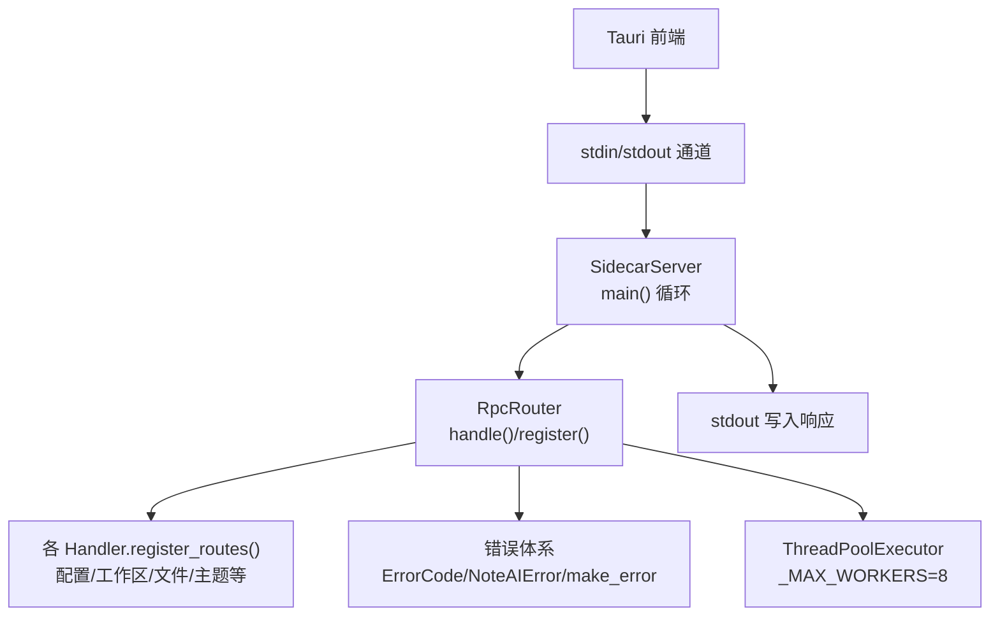
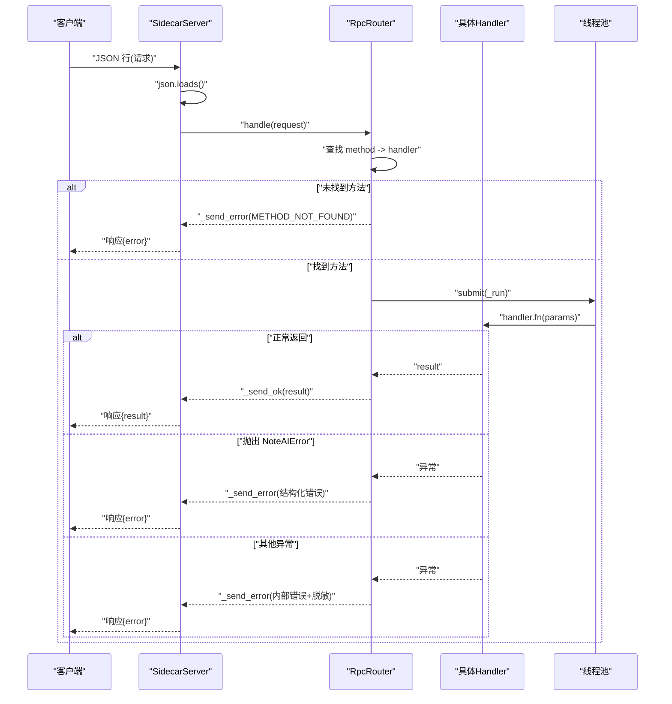
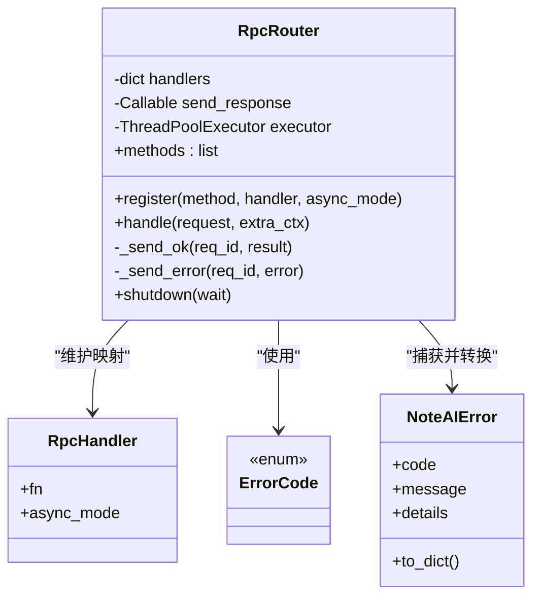
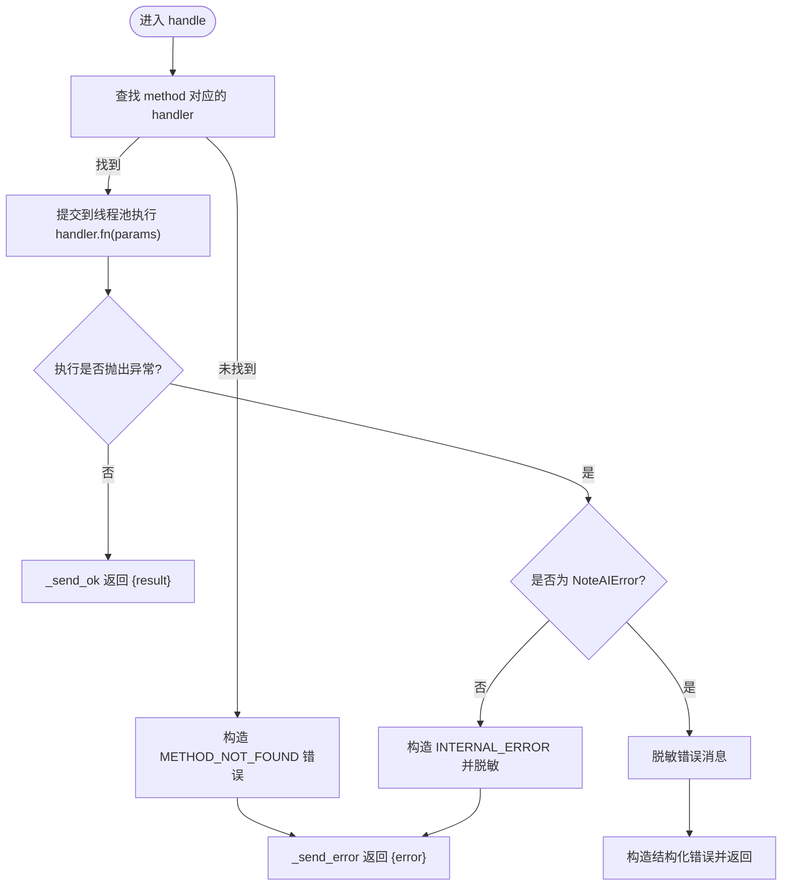
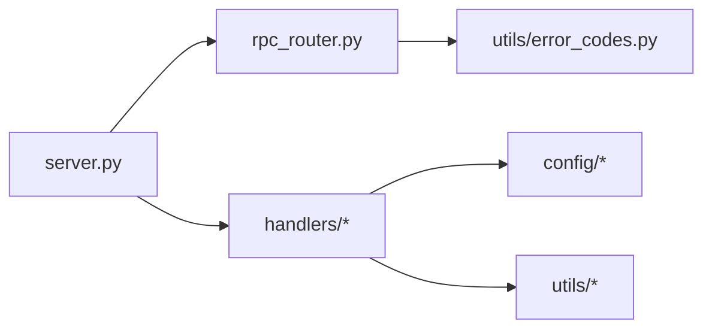

# JSON-RPC 协议实现

<cite>
**本文引用的文件**
- [rpc_router.py](file://python/sidecar/rpc_router.py)
- [server.py](file://python/sidecar/server.py)
- [error_codes.py](file://utils/error_codes.py)
- [config_handler.py](file://python/sidecar/handlers/config_handler.py)
- [workspace_handler.py](file://python/sidecar/handlers/workspace_handler.py)
- [test_rpc_router.py](file://tests/unit/test_rpc_router.py)
</cite>

## 目录
1. [简介](#简介)
2. [项目结构](#项目结构)
3. [核心组件](#核心组件)
4. [架构总览](#架构总览)
5. [详细组件分析](#详细组件分析)
6. [依赖关系分析](#依赖关系分析)
7. [性能考量](#性能考量)
8. [故障排查指南](#故障排查指南)
9. [结论](#结论)
10. [附录：API 调用示例与最佳实践](#附录api-调用示例与最佳实践)

## 简介
本文件为 NoteAI 的 JSON-RPC 协议实现提供深入的技术文档，重点围绕 RpcRouter 类的设计模式与实现细节，包括方法注册机制、请求路由逻辑、线程池管理；同时给出 JSON-RPC 消息格式规范（请求对象、响应对象、错误对象）、同步/异步处理器支持约定、错误处理体系（自定义异常、错误码、错误信息脱敏），并提供完整的 API 调用示例与最佳实践。

## 项目结构
NoteAI 的 RPC 子系统位于 Python sidecar 中，采用“轻量级 JSON-RPC over stdin/stdout”的模式，由 Tauri 前端通过标准输入输出与 Python 子进程通信。核心文件与职责如下：
- python/sidecar/rpc_router.py：RPC 路由器，负责方法注册、请求分发、结果/错误封装与线程池调度。
- python/sidecar/server.py：Sidecar 服务主循环，负责从 stdin 读取 JSON 行、解析并交给路由器处理，以及将响应写回 stdout。
- utils/error_codes.py：结构化错误码与错误构造器，定义领域异常类型。
- python/sidecar/handlers/*.py：各业务域处理器，统一通过 register_routes 向路由器注册方法。
- tests/unit/test_rpc_router.py：对路由器的单元测试，覆盖成功、未知方法、异步执行、错误传播与路径脱敏等场景。

图表来源
- [server.py:570-595](file://python/sidecar/server.py#L570-L595)
- [rpc_router.py:43-106](file://python/sidecar/rpc_router.py#L43-L106)
- [error_codes.py:14-120](file://utils/error_codes.py#L14-L120)

章节来源
- [server.py:570-595](file://python/sidecar/server.py#L570-L595)
- [rpc_router.py:43-106](file://python/sidecar/rpc_router.py#L43-L106)

## 核心组件
- RpcRouter：维护方法名到处理函数的映射，接收请求后按 method 路由到对应 handler，并以线程池方式执行，避免阻塞 I/O 读循环。
- SidecarServer：构建所有业务处理器实例，集中调用各 handler 的 register_routes 完成方法注册；负责 stdin/stdout 的读写与事件推送。
- 错误体系：ErrorCode 枚举 + make_error 构造器 + NoteAIError 领域异常，配合 _sanitize_error_message 进行敏感路径脱敏。

章节来源
- [rpc_router.py:35-106](file://python/sidecar/rpc_router.py#L35-L106)
- [server.py:54-125](file://python/sidecar/server.py#L54-L125)
- [error_codes.py:14-120](file://utils/error_codes.py#L14-L120)

## 架构总览
下图展示了从客户端发起请求到返回响应的完整流程，包括路由、线程池执行、错误处理与响应写出。

图表来源
- [server.py:570-595](file://python/sidecar/server.py#L570-L595)
- [rpc_router.py:54-95](file://python/sidecar/rpc_router.py#L54-L95)
- [error_codes.py:82-120](file://utils/error_codes.py#L82-L120)

## 详细组件分析

### RpcRouter 设计与实现
- 设计要点
  - 方法注册：register(method, handler, async_mode=False)，将方法名与函数绑定，async_mode 用于标记是否走线程池（当前实现统一提交至线程池）。
  - 请求路由：handle(request) 从请求中提取 method、params、id，查表获取 handler，不存在则返回 METHOD_NOT_FOUND。
  - 执行模型：所有 handler 均通过 ThreadPoolExecutor.submit 提交执行，避免阻塞 stdin 读取循环。
  - 响应封装：成功时发送 {id, result}；失败时发送 {id, error}，error 为结构化字典。
  - 错误脱敏：在捕获异常时，使用 _sanitize_error_message 替换绝对路径与家目录提示，防止泄露敏感信息。
  - 生命周期：shutdown(wait=False) 关闭线程池，cancel_futures 控制是否取消未完成任务。

图表来源
- [rpc_router.py:35-106](file://python/sidecar/rpc_router.py#L35-L106)
- [error_codes.py:14-120](file://utils/error_codes.py#L14-L120)

章节来源
- [rpc_router.py:43-106](file://python/sidecar/rpc_router.py#L43-L106)

### 方法注册机制与处理器组织
- 处理器组织：每个业务域处理器（如 ConfigHandler、WorkspaceHandler）实现 register_routes(router) 方法，统一向 RpcRouter 注册方法。
- 注册示例：
  - 配置相关：get_api_config、save_api_config、get_ui_config、save_ui_config、get_theme_preference、save_theme_preference、test_api_connection、get_project_rules、save_project_rules、get_workspace_rules、save_workspace_rules、needs_workspace_rules_setup。
  - 工作区相关：get_workspace_status、check_workspace_path_valid、clear_saved_workspace、set_workspace_path、get_workspace_tree、on_file_selected、refresh_log、get_kb_health。
- 注册入口：SidecarServer._build_router 集中调用各 handler 的 register_routes，确保启动时一次性完成全部方法注册。

章节来源
- [server.py:107-125](file://python/sidecar/server.py#L107-L125)
- [config_handler.py:16-30](file://python/sidecar/handlers/config_handler.py#L16-L30)
- [workspace_handler.py:34-44](file://python/sidecar/handlers/workspace_handler.py#L34-L44)

### 请求路由逻辑与参数传递
- 请求对象结构（客户端发出）
  - id: 字符串或数字，用于匹配响应。
  - method: 字符串，表示要调用的方法名。
  - params: 对象，包含方法的入参键值对。
- 路由过程
  - 从 request 提取 method、params、id。
  - 若 method 未注册，直接返回 METHOD_NOT_FOUND 错误。
  - 若已注册，提交到线程池执行 handler.fn(params)。
- 参数传递约定
  - 所有处理器以单一 dict 作为参数，字段名与方法语义一致，例如 save_api_config 期望 api_key、api_base、model_name 等键。
  - 处理器内部对参数进行校验与默认值填充，必要时返回 success/message 结构。

章节来源
- [rpc_router.py:54-83](file://python/sidecar/rpc_router.py#L54-L83)
- [config_handler.py:50-78](file://python/sidecar/handlers/config_handler.py#L50-L78)
- [workspace_handler.py:85-105](file://python/sidecar/handlers/workspace_handler.py#L85-L105)

### 线程池管理与并发特性
- 线程池大小：固定最大工作线程数为 8，适用于大多数本地 I/O 与 CPU 混合负载。
- 提交策略：所有 handler 统一 submit 到线程池，避免阻塞 stdin 读取循环。
- 优雅关闭：shutdown(wait=False) 会尽快停止线程池且不等待未完成任务，适合进程退出场景。
- 注意事项
  - 长时间运行的任务应谨慎使用，避免线程池耗尽导致请求排队。
  - 对于需要背压或队列化的任务，应在业务层自行实现限流与队列。

章节来源
- [rpc_router.py:44-50](file://python/sidecar/rpc_router.py#L44-L50)
- [rpc_router.py:80-83](file://python/sidecar/rpc_router.py#L80-L83)
- [rpc_router.py:100-106](file://python/sidecar/rpc_router.py#L100-L106)

### 同步与异步处理器支持机制
- 当前实现说明
  - register 支持 async_mode 标志，但 handle 对所有 handler 统一提交到线程池执行，因此无论 sync 还是 async 标记，实际都在独立线程中运行。
  - 这意味着“异步”在当前实现中更多是语义标注，而非基于协程的异步 IO。
- 函数签名约定
  - 处理器函数签名为 fn(params: dict) -> Any，返回值即为 result。
  - 如需返回结构化成功体，可返回 {"success": True, ...} 等业务约定结构。
- 参数传递方式
  - 仅通过 params 一个 dict 传递，建议保持字段稳定与向后兼容。

章节来源
- [rpc_router.py:51-53](file://python/sidecar/rpc_router.py#L51-L53)
- [rpc_router.py:65-83](file://python/sidecar/rpc_router.py#L65-L83)

### 错误处理体系
- 错误码定义
  - ErrorCode 枚举涵盖通用错误、路径与工作区、认证凭据、RAG/索引、功能可用性、Schema/Ingest、验证、云同步、UI/前端等分类。
- 错误构造
  - make_error(code, message, details=None) 生成结构化错误字典，供 handler 直接返回或 router 包装。
- 领域异常
  - NoteAIError 携带 code、message、details，router 捕获后转换为结构化错误。
- 错误信息脱敏
  - _sanitize_error_message 会将工作区路径与家目录替换为 <workspace>/<home> 占位符，并去重连续占位符，避免泄露敏感路径。

图表来源
- [rpc_router.py:54-95](file://python/sidecar/rpc_router.py#L54-L95)
- [error_codes.py:82-120](file://utils/error_codes.py#L82-L120)

章节来源
- [rpc_router.py:14-33](file://python/sidecar/rpc_router.py#L14-L33)
- [error_codes.py:14-120](file://utils/error_codes.py#L14-L120)

### 处理器示例与行为说明
- 配置处理器（ConfigHandler）
  - 提供 API 配置、UI 配置、主题偏好、项目规则与工作区规则的读写接口。
  - 保存操作通常返回 {"success": True/False, "message": "..."} 的结构。
- 工作区处理器（WorkspaceHandler）
  - 提供工作区状态查询、路径有效性检查、树形结构浏览、健康检查等接口。
  - 对大目录递归深度进行限制，避免阻塞 RPC 线程。

章节来源
- [config_handler.py:16-30](file://python/sidecar/handlers/config_handler.py#L16-L30)
- [config_handler.py:50-78](file://python/sidecar/handlers/config_handler.py#L50-L78)
- [workspace_handler.py:34-44](file://python/sidecar/handlers/workspace_handler.py#L34-L44)
- [workspace_handler.py:200-247](file://python/sidecar/handlers/workspace_handler.py#L200-L247)

## 依赖关系分析
- 模块耦合
  - server.py 依赖 rpc_router.py 完成请求路由，依赖各 handler 完成业务逻辑。
  - rpc_router.py 依赖 utils.error_codes 进行错误构造与脱敏。
  - 各 handler 依赖 config、logger、业务工具模块。
- 外部依赖
  - watchdog 用于工作区文件变更监听（非 RPC 核心，但与 SidecarServer 集成）。
  - 标准库 concurrent.futures.ThreadPoolExecutor 用于线程池。

图表来源
- [server.py:107-125](file://python/sidecar/server.py#L107-L125)
- [rpc_router.py:43-106](file://python/sidecar/rpc_router.py#L43-L106)
- [error_codes.py:14-120](file://utils/error_codes.py#L14-L120)

章节来源
- [server.py:107-125](file://python/sidecar/server.py#L107-L125)
- [rpc_router.py:43-106](file://python/sidecar/rpc_router.py#L43-L106)

## 性能考量
- 线程池上限为 8，适合本地开发与服务端短任务；若引入大量长耗时任务，需评估是否需要增大线程数或引入任务队列与限流。
- 工作区树遍历存在递归深度限制，避免在大目录上阻塞。
- 错误日志记录使用 logger，避免在高频路径中产生过多开销。
- 建议在处理器内对热点数据进行缓存（如 TTLCache），并在文件变更时失效缓存。

[本节为通用指导，不直接分析具体文件]

## 故障排查指南
- 常见问题
  - 未知方法：检查方法名是否正确注册，确认 register_routes 是否被调用。
  - 参数缺失或类型不符：处理器内部应做参数校验与默认值填充，返回 success/message 结构以便前端提示。
  - 线程池饱和：观察是否有长时间运行的任务，考虑拆分或异步化。
  - 错误信息泄露：确认异常消息是否包含绝对路径，确保被 _sanitize_error_message 处理。
- 定位手段
  - 查看 stderr 中的错误日志（router 会记录异常堆栈）。
  - 使用测试用例模拟请求，快速验证路由与错误路径。

章节来源
- [rpc_router.py:72-78](file://python/sidecar/rpc_router.py#L72-L78)
- [test_rpc_router.py:74-87](file://tests/unit/test_rpc_router.py#L74-L87)

## 结论
NoteAI 的 JSON-RPC 实现以 RpcRouter 为核心，采用简洁的注册-路由-执行模型，结合线程池保证 I/O 不阻塞，并通过结构化错误码与消息脱敏提升健壮性与安全性。处理器以 register_routes 的方式集中注册，便于扩展与维护。整体架构清晰、易于理解，适合在桌面应用侧边进程中承载本地能力。

[本节为总结性内容，不直接分析具体文件]

## 附录：API 调用示例与最佳实践

### JSON-RPC 消息格式规范
- 请求对象
  - id: 字符串或数字，用于匹配响应。
  - method: 字符串，方法名。
  - params: 对象，方法参数。
- 响应对象
  - 成功：{id, result}
  - 失败：{id, error}，其中 error 为结构化字典，包含 code、message、可选 details。
- 错误对象
  - code: 来自 ErrorCode 枚举的值。
  - message: 人类可读的错误描述（已脱敏）。
  - details: 可选附加信息。

章节来源
- [rpc_router.py:84-95](file://python/sidecar/rpc_router.py#L84-L95)
- [error_codes.py:82-120](file://utils/error_codes.py#L82-L120)

### 典型 API 调用示例
- 获取 API 配置
  - 请求：{"id":"a1","method":"get_api_config","params":{}}
  - 响应：{"id":"a1","result":{"api_key":"...","api_key_configured":true,...}}
- 保存 API 配置
  - 请求：{"id":"a2","method":"save_api_config","params":{"api_key":"sk-...","api_base":"https://...","model_name":"gpt-4"}}
  - 响应：{"id":"a2","result":{"success":true,"message":"配置已保存..."}}
- 设置工作区路径
  - 请求：{"id":"a3","method":"set_workspace_path","params":{"path":"/path/to/workspace"}}
  - 响应：{"id":"a3","result":{"success":true,"message":"工作区已设置",...}}
- 未知方法错误
  - 请求：{"id":"a4","method":"nonexistent","params":{}}
  - 响应：{"id":"a4","error":{"code":"METHOD_NOT_FOUND","message":"Unknown method: nonexistent"}}

章节来源
- [config_handler.py:16-30](file://python/sidecar/handlers/config_handler.py#L16-L30)
- [workspace_handler.py:34-44](file://python/sidecar/handlers/workspace_handler.py#L34-L44)
- [test_rpc_router.py:48-56](file://tests/unit/test_rpc_router.py#L48-L56)

### 最佳实践
- 方法命名与分组
  - 使用清晰的动词前缀（如 get_/save_/check_），并按业务域划分方法名空间。
- 参数校验与默认值
  - 在处理器中对必要参数进行校验，提供合理的默认值与友好错误消息。
- 错误处理
  - 优先使用 make_error 或 raise NoteAIError，确保错误码一致且消息脱敏。
- 并发与资源
  - 避免在处理器中进行长时间阻塞操作；必要时拆分任务并通过 job_status 上报进度。
- 安全与隐私
  - 不在错误消息中暴露绝对路径、密钥等敏感信息；遵循脱敏机制。

[本节为通用指导，不直接分析具体文件]