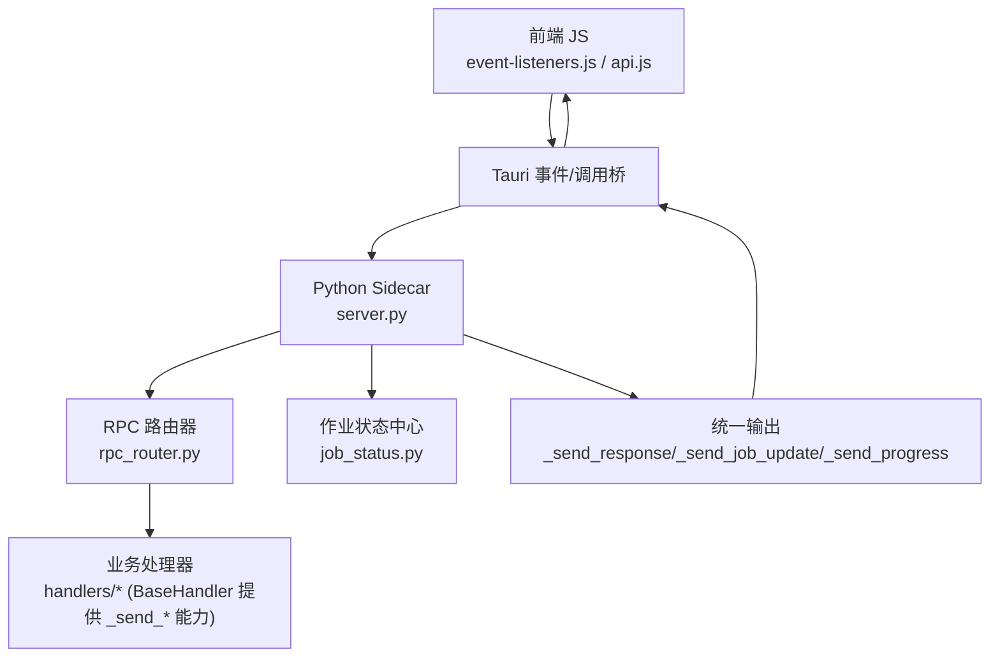
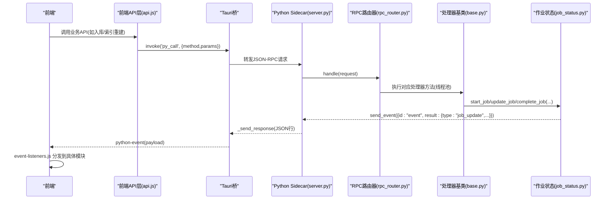
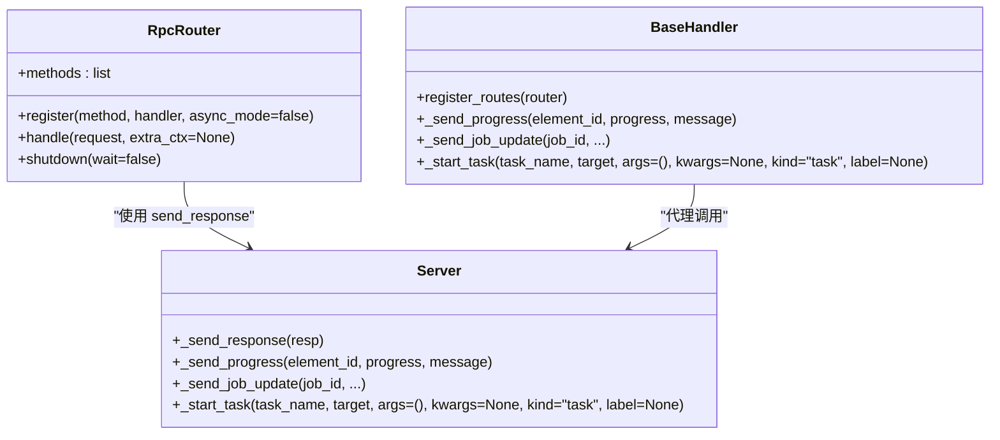
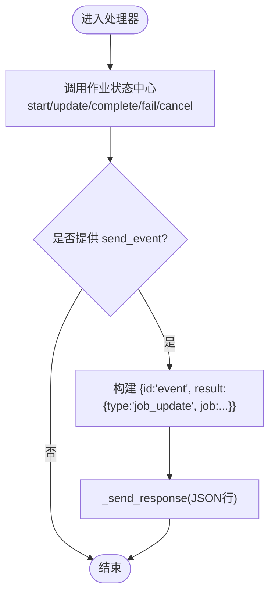
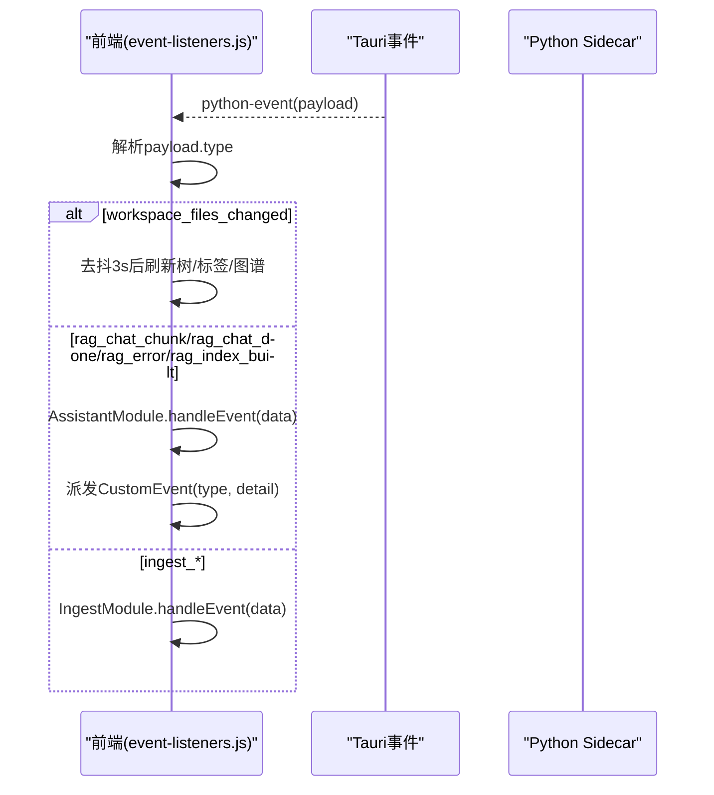
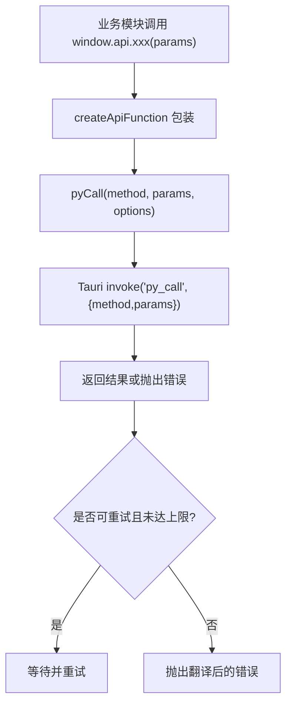
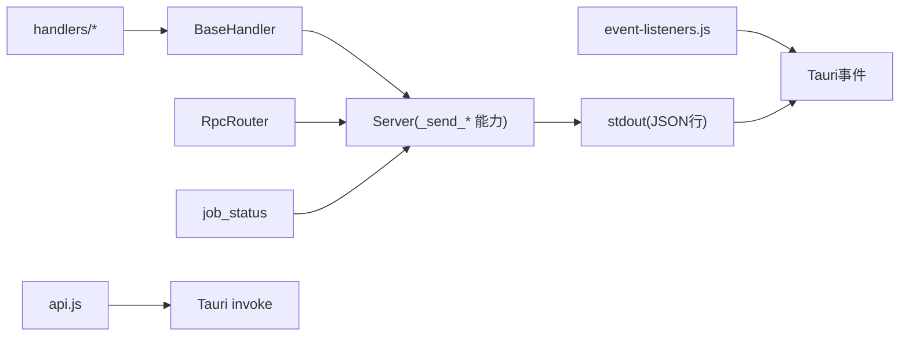

# 事件驱动通信系统

<cite>
**本文引用的文件**   
- [server.py](file://python/sidecar/server.py)
- [rpc_router.py](file://python/sidecar/rpc_router.py)
- [base.py](file://python/sidecar/handlers/base.py)
- [job_status.py](file://python/sidecar/job_status.py)
- [event-listeners.js](file://webui/js/event-listeners.js)
- [api.js](file://webui/js/api.js)
</cite>

## 目录
1. [简介](#简介)
2. [项目结构](#项目结构)
3. [核心组件](#核心组件)
4. [架构总览](#架构总览)
5. [详细组件分析](#详细组件分析)
6. [依赖关系分析](#依赖关系分析)
7. [性能考量](#性能考量)
8. [故障排查指南](#故障排查指南)
9. [结论](#结论)
10. [附录：事件消息格式规范与最佳实践](#附录事件消息格式规范与最佳实践)

## 简介
本技术文档聚焦 NoteAI 的事件驱动通信系统，围绕“发布-订阅”模式在前后端之间的设计与实现进行系统化说明。内容涵盖：
- 事件定义、处理器注册与分发机制
- 实时通知体系（状态变更监听、前端实时更新、跨组件通信）
- 事件消息格式规范（事件类型、载荷结构与元数据管理）
- 事件流处理（过滤、转换、聚合）
- 事件驱动架构的最佳实践与常见使用模式示例

NoteAI 采用“Tauri + Python Sidecar”的架构：前端通过 Tauri 调用后端 RPC 方法，同时通过 Tauri 事件通道接收来自后端的异步事件推送；Python 侧基于 JSON-RPC 路由与线程池执行任务，并通过统一的响应输出将结果与事件推送到前端。

## 项目结构
下图展示了事件驱动通信的关键路径与模块职责：

图示来源
- [server.py:126-182](file://python/sidecar/server.py#L126-L182)
- [rpc_router.py:43-106](file://python/sidecar/rpc_router.py#L43-L106)
- [base.py:1-106](file://python/sidecar/handlers/base.py#L1-L106)
- [job_status.py:1-189](file://python/sidecar/job_status.py#L1-L189)
- [event-listeners.js:1-259](file://webui/js/event-listeners.js#L1-L259)
- [api.js:61-90](file://webui/js/api.js#L61-L90)

章节来源
- [server.py:54-125](file://python/sidecar/server.py#L54-L125)
- [rpc_router.py:1-106](file://python/sidecar/rpc_router.py#L1-L106)
- [base.py:1-106](file://python/sidecar/handlers/base.py#L1-L106)
- [job_status.py:1-189](file://python/sidecar/job_status.py#L1-L189)
- [event-listeners.js:1-259](file://webui/js/event-listeners.js#L1-L259)
- [api.js:1-492](file://webui/js/api.js#L1-L492)

## 核心组件
- Python 侧统一输出与事件发送
  - 统一响应输出：通过标准输出以 JSON 行协议返回给 Tauri，用于请求应答与事件推送。
  - 进度与作业更新：封装了进度上报与作业状态广播，便于前端统一消费。
- RPC 路由器
  - 负责方法注册、参数解析、异常处理与线程池调度，保证主循环不被阻塞。
- 处理器基类
  - 为各功能处理器提供对服务器能力的访问（如发送进度、启动任务等），降低耦合。
- 作业状态中心
  - 内存中维护作业生命周期与快照，统一广播 job_update 事件。
- 前端事件监听器
  - 订阅 Tauri 事件，按事件类型分发到不同 UI 模块，支持去抖刷新与跨组件通信。
- 前端 API 层
  - 封装 pyCall 调用与重试策略，暴露配置化 API 供业务模块使用。

章节来源
- [server.py:126-182](file://python/sidecar/server.py#L126-L182)
- [rpc_router.py:43-106](file://python/sidecar/rpc_router.py#L43-L106)
- [base.py:1-106](file://python/sidecar/handlers/base.py#L1-L106)
- [job_status.py:1-189](file://python/sidecar/job_status.py#L1-L189)
- [event-listeners.js:1-259](file://webui/js/event-listeners.js#L1-L259)
- [api.js:61-90](file://webui/js/api.js#L61-L90)

## 架构总览
下图展示一次典型“长耗时任务”的端到端流程：前端发起 RPC → 路由分发 → 后台线程执行 → 作业状态中心广播 → 前端事件监听器消费并更新 UI。

图示来源
- [api.js:61-90](file://webui/js/api.js#L61-L90)
- [server.py:126-182](file://python/sidecar/server.py#L126-L182)
- [rpc_router.py:54-82](file://python/sidecar/rpc_router.py#L54-L82)
- [base.py:17-31](file://python/sidecar/handlers/base.py#L17-L31)
- [job_status.py:26-64](file://python/sidecar/job_status.py#L26-L64)
- [event-listeners.js:150-246](file://webui/js/event-listeners.js#L150-L246)

## 详细组件分析

### Python 侧：RPC 路由器与处理器基类
- RPC 路由器
  - 注册表：以方法名为键存储处理器与执行模式。
  - 分发：从请求中提取 method/params/id，查找处理器；未知方法返回错误。
  - 并发：所有处理器提交至线程池执行，避免阻塞 stdin 读取循环。
  - 错误处理：捕获业务异常与通用异常，统一格式化并返回。
- 处理器基类
  - 提供对服务器的能力代理：发送进度、发送作业更新、启动任务等。
  - 约定：各处理器通过 register_routes(router) 完成方法注册。

图示来源
- [rpc_router.py:43-106](file://python/sidecar/rpc_router.py#L43-L106)
- [base.py:1-106](file://python/sidecar/handlers/base.py#L1-L106)
- [server.py:126-214](file://python/sidecar/server.py#L126-L214)

章节来源
- [rpc_router.py:1-106](file://python/sidecar/rpc_router.py#L1-L106)
- [base.py:1-106](file://python/sidecar/handlers/base.py#L1-L106)
- [server.py:107-125](file://python/sidecar/server.py#L107-L125)

### Python 侧：作业状态中心与统一输出
- 作业状态中心
  - 维护作业快照（运行中/完成/失败/取消），限制最大数量，自动裁剪旧记录。
  - 每次状态变更都会触发 send_event 回调，生成 type="job_update" 事件。
- 统一输出
  - _send_response：以 JSON 行写入 stdout，供 Tauri 读取。
  - _send_job_update：根据作业状态或进度，构造并发送事件。
  - _send_progress：便捷封装，内部调用 _send_job_update。

图示来源
- [job_status.py:26-64](file://python/sidecar/job_status.py#L26-L64)
- [server.py:145-182](file://python/sidecar/server.py#L145-L182)

章节来源
- [job_status.py:1-189](file://python/sidecar/job_status.py#L1-L189)
- [server.py:126-182](file://python/sidecar/server.py#L126-L182)

### 前端：事件监听与跨组件通信
- 事件订阅
  - 通过 Tauri 事件 API 监听 'python-event'，解析 payload.type 进行分支处理。
  - 针对 workspace_files_changed、rag_chat_chunk、ingest_*、cli_agent_* 等事件类型分别处理。
- 去抖与批量刷新
  - 对高频文件变更事件进行去抖，合并多次变更后统一刷新视图。
- 跨组件通信
  - 将后端事件转换为 CustomEvent 派发，供其他模块订阅（如 assistant、ingest、cli-agent）。

图示来源
- [event-listeners.js:15-46](file://webui/js/event-listeners.js#L15-L46)
- [event-listeners.js:148-246](file://webui/js/event-listeners.js#L148-L246)

章节来源
- [event-listeners.js:1-259](file://webui/js/event-listeners.js#L1-L259)

### 前端：API 层与重试策略
- pyCall
  - 检测 Tauri 环境，获取 invoke 函数，调用 'py_call' 方法名与参数。
  - 内置可重试逻辑，针对超时/中止/后端不可用等错误进行指数退避重试。
- 配置化 API 注册
  - 通过 API_DEFS 声明式注册大量方法，减少样板代码，统一映射到 pyCall。

图示来源
- [api.js:61-90](file://webui/js/api.js#L61-L90)
- [api.js:324-329](file://webui/js/api.js#L324-L329)
- [api.js:331-460](file://webui/js/api.js#L331-L460)

章节来源
- [api.js:1-492](file://webui/js/api.js#L1-L492)

## 依赖关系分析
- 低耦合高内聚
  - 处理器仅依赖 BaseHandler 提供的能力代理，不直接耦合 server 细节。
  - RPC 路由器与处理器解耦，新增方法只需注册即可。
- 事件与请求分离
  - 请求-响应走 JSON-RPC；异步状态与通知走事件通道，互不干扰。
- 外部依赖
  - 文件系统监听（watchdog）触发工作区变更事件。
  - Tauri 作为进程间通信与事件总线载体。

图示来源
- [base.py:1-106](file://python/sidecar/handlers/base.py#L1-L106)
- [server.py:126-214](file://python/sidecar/server.py#L126-L214)
- [rpc_router.py:43-106](file://python/sidecar/rpc_router.py#L43-L106)
- [job_status.py:1-189](file://python/sidecar/job_status.py#L1-L189)
- [event-listeners.js:1-259](file://webui/js/event-listeners.js#L1-L259)
- [api.js:61-90](file://webui/js/api.js#L61-L90)

章节来源
- [server.py:54-125](file://python/sidecar/server.py#L54-L125)
- [rpc_router.py:1-106](file://python/sidecar/rpc_router.py#L1-L106)
- [base.py:1-106](file://python/sidecar/handlers/base.py#L1-L106)
- [job_status.py:1-189](file://python/sidecar/job_status.py#L1-L189)
- [event-listeners.js:1-259](file://webui/js/event-listeners.js#L1-L259)
- [api.js:1-492](file://webui/js/api.js#L1-L492)

## 性能考量
- 线程池隔离
  - 所有处理器提交至线程池执行，避免阻塞 stdin 读取循环，提升吞吐。
- 事件去抖
  - 工作区变更事件在前端进行去抖，合并高频刷新，降低 UI 压力。
- 作业快照裁剪
  - 作业列表限制最大数量，避免内存无限增长。
- 统一输出加锁
  - 标准输出写操作加锁，防止多并发下 JSON 行交错。

[本节为通用指导，无需源码引用]

## 故障排查指南
- 常见问题定位
  - 后端无响应：检查 Tauri invoke 是否可用、pyCall 重试日志、stderr 输出。
  - 事件未到达前端：确认 'python-event' 监听已初始化，payload.type 匹配。
  - 作业状态不更新：检查处理器是否正确调用作业状态中心，send_event 是否传入。
- 建议排查步骤
  - 查看前端控制台日志（api.js 的错误翻译与重试信息）。
  - 在后端增加关键路径日志，确认 JSON 行输出是否符合预期。
  - 使用作业查询接口拉取最近作业快照，核对状态流转。

章节来源
- [api.js:35-59](file://webui/js/api.js#L35-L59)
- [event-listeners.js:110-146](file://webui/js/event-listeners.js#L110-L146)
- [job_status.py:168-189](file://python/sidecar/job_status.py#L168-L189)

## 结论
NoteAI 的事件驱动通信系统以“请求-响应 + 事件推送”的双通道设计，实现了前后端松耦合、可扩展的实时交互。通过 RPC 路由器与处理器基类抽象，新增功能仅需注册方法与复用统一输出能力；作业状态中心与前端事件监听器共同构建了稳定的实时通知链路。配合去抖、重试与线程池隔离，系统在稳定性与性能上具备良好表现。

[本节为总结性内容，无需源码引用]

## 附录：事件消息格式规范与最佳实践

### 事件消息格式规范
- 传输协议
  - 后端通过标准输出以 JSON 行形式推送事件；Tauri 将其封装为 'python-event' 事件传递给前端。
- 事件结构
  - id: 固定为 "event"
  - result: 对象，包含 type 与可选字段
    - type: 事件类型字符串（如 "workspace_files_changed"、"job_update"、"progress"、"rag_chat_chunk" 等）
    - 其他字段：随事件类型变化，例如 job_update 携带 job 快照，progress 携带 element_id、progress、message 等
- 元数据管理
  - 作业相关事件通过 job_status 中心生成，包含 id、kind、label、status、progress、message、metadata、时间戳等字段。
  - 业务事件可在 result 中扩展自定义字段，但需保持向后兼容。

章节来源
- [server.py:126-182](file://python/sidecar/server.py#L126-L182)
- [job_status.py:26-64](file://python/sidecar/job_status.py#L26-L64)
- [event-listeners.js:150-246](file://webui/js/event-listeners.js#L150-L246)

### 事件流处理（过滤、转换、聚合）
- 过滤
  - 前端按 payload.type 分支处理，忽略无关事件。
- 转换
  - 将后端事件转换为前端 CustomEvent，供模块订阅；或将字节流/分片数据组装为可读文本。
- 聚合
  - 对高频文件变更事件进行去抖聚合，减少重复刷新；对作业状态进行快照聚合，便于 UI 渲染。

章节来源
- [event-listeners.js:35-46](file://webui/js/event-listeners.js#L35-L46)
- [event-listeners.js:177-200](file://webui/js/event-listeners.js#L177-L200)
- [api.js:131-153](file://webui/js/api.js#L131-L153)

### 最佳实践与常见使用模式
- 新增事件类型
  - 后端：在处理器中通过 _send_job_update 或 _send_progress 发送事件；或在合适时机直接 _send_response 推送自定义事件。
  - 前端：在 event-listeners.js 中添加分支处理，必要时派发 CustomEvent 供其他模块订阅。
- 长耗时任务
  - 使用 _start_task 启动后台任务，结合 job_status 中心进行状态广播；前端通过 job_update 事件更新进度条与状态栏。
- 文件变更联动
  - 利用工作区监听触发 workspace_files_changed 事件，前端去抖后刷新树、标签、图谱等视图。
- 错误与恢复
  - 前端对 pyCall 进行可重试封装；后端统一错误码与消息清洗，避免泄露敏感路径。

章节来源
- [server.py:184-214](file://python/sidecar/server.py#L184-L214)
- [server.py:416-539](file://python/sidecar/server.py#L416-L539)
- [event-listeners.js:15-46](file://webui/js/event-listeners.js#L15-L46)
- [api.js:61-90](file://webui/js/api.js#L61-L90)