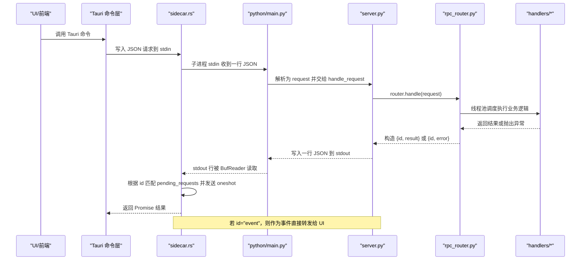
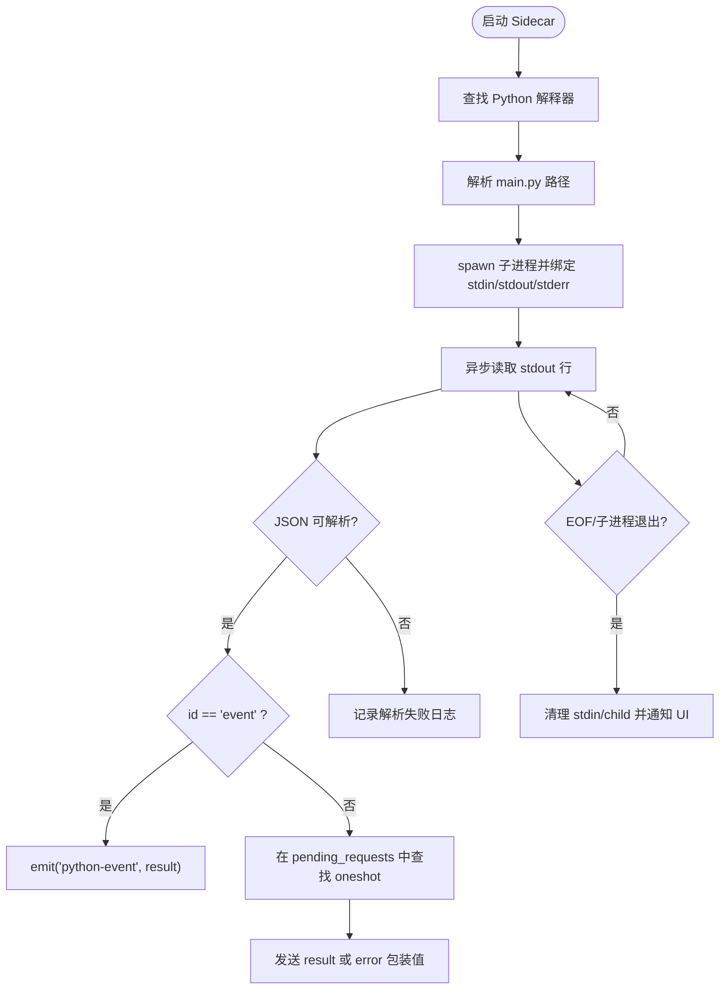
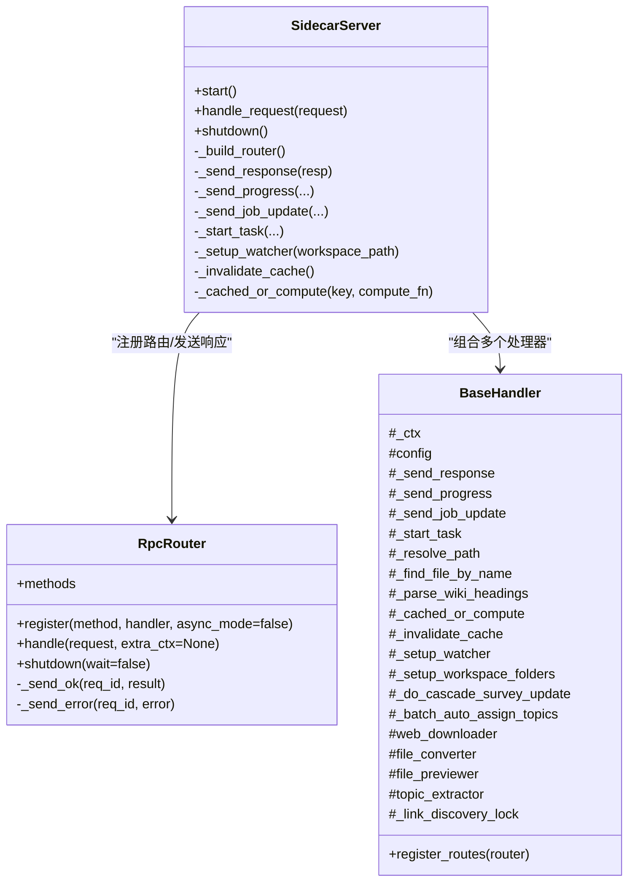
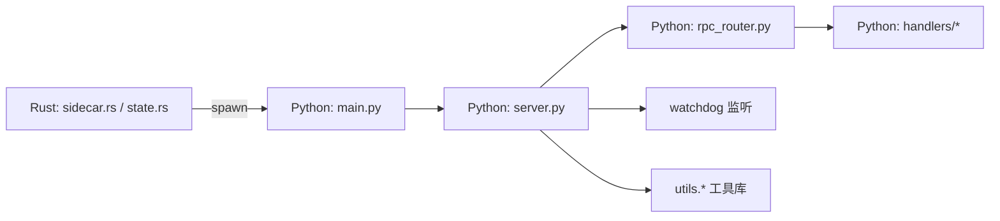

# 进程间通信机制

<cite>
**本文引用的文件**
- [src-tauri/src/sidecar.rs](file://src-tauri/src/sidecar.rs)
- [src-tauri/src/state.rs](file://src-tauri/src/state.rs)
- [python/main.py](file://python/main.py)
- [python/sidecar/server.py](file://python/sidecar/server.py)
- [python/sidecar/rpc_router.py](file://python/sidecar/rpc_router.py)
- [python/sidecar/handlers/base.py](file://python/sidecar/handlers/base.py)
</cite>

## 目录
1. [简介](#简介)
2. [项目结构](#项目结构)
3. [核心组件](#核心组件)
4. [架构总览](#架构总览)
5. [详细组件分析](#详细组件分析)
6. [依赖关系分析](#依赖关系分析)
7. [性能考量](#性能考量)
8. [故障排查指南](#故障排查指南)
9. [结论](#结论)
10. [附录](#附录)

## 简介
本技术文档聚焦 NoteAI 的进程间通信（IPC）机制，深入解析 Tauri Rust 壳层与 Python Sidecar 服务之间的通信实现。内容涵盖：
- 基于标准输入/输出管道的 JSON-RPC 通信协议、消息序列化与反序列化流程
- 子进程的启动、监控与优雅关闭的生命周期管理
- 内存管理与数据共享策略，包括大对象传输优化与泄漏防护建议
- 并发处理与线程安全考虑，多线程环境下的资源访问控制
- IPC 调试技巧与性能监控方法

## 项目结构
NoteAI 采用“Rust 前端 + Python 后端”的双进程架构：
- Rust 侧通过 Tauri 应用状态持有 Python 子进程句柄、stdin/stdout 管道以及请求等待队列
- Python 侧以单进程常驻服务形式运行，监听 stdin 行式 JSON 请求，路由到业务处理器并写回 stdout

```mermaid
graph TB
subgraph "Tauri 应用(Rust)"
A["sidecar.rs<br/>子进程管理/事件转发"]
B["state.rs<br/>全局状态/请求映射"]
end
subgraph "Python Sidecar"
C["main.py<br/>入口脚本"]
D["server.py<br/>SidecarServer/IO循环/后台任务"]
E["rpc_router.py<br/>RPC路由/线程池执行"]
F["handlers/base.py<br/>处理器基类/能力代理"]
end
A --> |"spawn python main.py"| C
A <--|"stdout: JSON 响应/事件"| D
A --> |"stdin: JSON 请求"| D
D --> E
E --> F
```

图表来源
- [src-tauri/src/sidecar.rs:215-311](file://src-tauri/src/sidecar.rs#L215-L311)
- [src-tauri/src/state.rs:9-47](file://src-tauri/src/state.rs#L9-L47)
- [python/main.py:1-21](file://python/main.py#L1-L21)
- [python/sidecar/server.py:570-595](file://python/sidecar/server.py#L570-L595)
- [python/sidecar/rpc_router.py:43-106](file://python/sidecar/rpc_router.py#L43-L106)
- [python/sidecar/handlers/base.py:1-106](file://python/sidecar/handlers/base.py#L1-L106)

章节来源
- [src-tauri/src/sidecar.rs:1-312](file://src-tauri/src/sidecar.rs#L1-L312)
- [src-tauri/src/state.rs:1-48](file://src-tauri/src/state.rs#L1-L48)
- [python/main.py:1-21](file://python/main.py#L1-L21)
- [python/sidecar/server.py:1-595](file://python/sidecar/server.py#L1-L595)
- [python/sidecar/rpc_router.py:1-106](file://python/sidecar/rpc_router.py#L1-L106)
- [python/sidecar/handlers/base.py:1-106](file://python/sidecar/handlers/base.py#L1-L106)

## 核心组件
- Rust 侧
  - sidecar.rs：负责查找 Python 解释器、定位 main.py、启动子进程、读写管道、解析响应、派发事件、异常退出清理与重启逻辑
  - state.rs：定义跨命令共享的应用状态，包含 Python 子进程、stdin、待处理请求映射等
- Python 侧
  - main.py：设置运行时环境变量、注入模块路径、调用 SidecarServer.main 进入主循环
  - server.py：SidecarServer 封装了 RPC 路由、工作区文件监听、缓存失效、后台任务、进度与作业状态推送、优雅关闭
  - rpc_router.py：轻量 JSON-RPC 路由器，将方法分发到具体处理器，使用线程池避免阻塞 IO 循环
  - handlers/base.py：处理器基类，提供对 Server 能力的统一访问接口

章节来源
- [src-tauri/src/sidecar.rs:215-311](file://src-tauri/src/sidecar.rs#L215-L311)
- [src-tauri/src/state.rs:9-47](file://src-tauri/src/state.rs#L9-L47)
- [python/main.py:1-21](file://python/main.py#L1-L21)
- [python/sidecar/server.py:54-125](file://python/sidecar/server.py#L54-L125)
- [python/sidecar/rpc_router.py:43-106](file://python/sidecar/rpc_router.py#L43-L106)
- [python/sidecar/handlers/base.py:1-106](file://python/sidecar/handlers/base.py#L1-L106)

## 架构总览
下图展示了从 UI 发起请求到 Python 处理并返回响应的完整时序，包括事件通道和错误处理分支。



图表来源
- [src-tauri/src/sidecar.rs:260-301](file://src-tauri/src/sidecar.rs#L260-L301)
- [src-tauri/src/state.rs:35-47](file://src-tauri/src/state.rs#L35-L47)
- [python/sidecar/server.py:570-595](file://python/sidecar/server.py#L570-L595)
- [python/sidecar/rpc_router.py:54-95](file://python/sidecar/rpc_router.py#L54-L95)

## 详细组件分析

### Rust 侧：子进程生命周期与管道通信
- 子进程发现与启动
  - 查找 Python 解释器：支持显式环境变量、打包资源目录、开发时 resources、系统 PATH 等多候选策略，并通过 --version 校验是否为 Python 3
  - 定位 main.py：优先从 Tauri 资源中解析，其次尝试多种相对路径
  - 启动参数与环境变量：设置 HF_ENDPOINT、NO_PROXY、HF_HOME、HUGGINGFACE_HUB_CACHE、TRANSFORMERS_CACHE、PYTHONIOENCODING、PYTHONUNBUFFERED、KMP_DUPLICATE_LIB_OK、OMP_NUM_THREADS、TERM 等，确保模型下载与线程行为可控
  - 标准 I/O：stdin/stdout/stderr 均设置为 piped；stderr 单独打印便于调试
- 响应解析与事件转发
  - 使用 tokio::io::BufReader 逐行读取 stdout，按行进行 JSON 反序列化为 PyResponse
  - 当 id 为 "event" 时，直接将 result 作为事件通过 Tauri 事件总线转发给前端
  - 否则，根据 id 在 pending_requests 中查找对应的 oneshot Sender，并将 result 或 error 包装后发送
- 异常退出与自动恢复
  - 当 stdout 读取结束或子进程退出时，触发清理逻辑：清空 stdin、kill 子进程、重置状态，并向 UI 发出 sidecar_died 事件
  - 提供 restart_python_sidecar：串行化重启，避免重复重启；重启完成后发出 sidecar_ready 事件
- 健康检查与等待
  - is_sidecar_alive 与 wait_for_sidecar 用于判断子进程是否可用，结合 SIDECAR_RESTARTING 标志防止竞态



图表来源
- [src-tauri/src/sidecar.rs:109-175](file://src-tauri/src/sidecar.rs#L109-L175)
- [src-tauri/src/sidecar.rs:177-213](file://src-tauri/src/sidecar.rs#L177-L213)
- [src-tauri/src/sidecar.rs:215-311](file://src-tauri/src/sidecar.rs#L215-L311)
- [src-tauri/src/sidecar.rs:56-79](file://src-tauri/src/sidecar.rs#L56-L79)

章节来源
- [src-tauri/src/sidecar.rs:109-175](file://src-tauri/src/sidecar.rs#L109-L175)
- [src-tauri/src/sidecar.rs:177-213](file://src-tauri/src/sidecar.rs#L177-L213)
- [src-tauri/src/sidecar.rs:215-311](file://src-tauri/src/sidecar.rs#L215-L311)
- [src-tauri/src/sidecar.rs:56-79](file://src-tauri/src/sidecar.rs#L56-L79)

### Python 侧：SidecarServer 与 RPC 路由
- 初始化与路由注册
  - SidecarServer 构造时创建各功能处理器实例，并通过 RpcRouter.register_routes 完成方法注册
  - 提供 _send_response 统一写入 stdout，保证线程安全（_stdout_lock）
- 请求处理与线程池
  - main() 循环读取 stdin 行，解析为 JSON 后交由 server.handle_request -> router.handle
  - RpcRouter 将所有处理器提交至 ThreadPoolExecutor，避免阻塞 IO 循环
  - 错误处理：捕获 NoteAIError 与普通异常，统一封装为标准错误格式，并对敏感信息进行脱敏
- 后台任务与工作区监听
  - 启动时执行知识库巡检、WIKI 同步、RAG 索引自检等后台任务
  - 使用 watchdog 监听工作区文件变更，去抖合并后批量失效缓存并触发 WIKI 同步
  - 自动转换非 Markdown 文件为 Markdown，并推送 auto_file_converted 事件
- 优雅关闭
  - shutdown 停止文件监听、关闭 RPC 线程池、关闭 LLM 与检索执行器、清理 RAG 集合缓存



图表来源
- [python/sidecar/server.py:54-125](file://python/sidecar/server.py#L54-L125)
- [python/sidecar/server.py:570-595](file://python/sidecar/server.py#L570-L595)
- [python/sidecar/rpc_router.py:43-106](file://python/sidecar/rpc_router.py#L43-L106)
- [python/sidecar/handlers/base.py:1-106](file://python/sidecar/handlers/base.py#L1-L106)

章节来源
- [python/sidecar/server.py:54-125](file://python/sidecar/server.py#L54-L125)
- [python/sidecar/server.py:570-595](file://python/sidecar/server.py#L570-L595)
- [python/sidecar/rpc_router.py:43-106](file://python/sidecar/rpc_router.py#L43-L106)
- [python/sidecar/handlers/base.py:1-106](file://python/sidecar/handlers/base.py#L1-L106)

### 消息协议与序列化/反序列化
- 请求格式（Rust -> Python）
  - 字段：id、method、params
  - 编码：UTF-8 JSON，每行一条
- 响应格式（Python -> Rust）
  - 成功：{id, result}
  - 错误：{id, error}
  - 事件：{id: "event", result: {...}}
- 序列化位置
  - Rust：PyRequest/PyResponse 使用 serde 进行编解码
  - Python：json.dumps/json.loads 进行编解码

章节来源
- [src-tauri/src/state.rs:35-47](file://src-tauri/src/state.rs#L35-L47)
- [python/sidecar/server.py:126-143](file://python/sidecar/server.py#L126-L143)
- [python/sidecar/server.py:570-595](file://python/sidecar/server.py#L570-L595)

### 并发处理与线程安全
- Rust 侧
  - 使用 tokio::sync::Mutex 保护 ChildStdin 与 Child 句柄
  - 使用 std::sync::Mutex 保护 pending_requests 映射
  - 使用 AtomicU64/AtomicBool 维护生成号与重启标志，避免竞态
- Python 侧
  - RpcRouter 使用 ThreadPoolExecutor 并行执行处理器，最大工作线程数固定
  - SidecarServer 内部使用 threading.Lock 保护 stdout 写入、运行任务集合、去抖计时器等共享状态
  - 文件监听回调与定时器回调可能并发触发，通过 generation 与锁保证幂等与一致性

章节来源
- [src-tauri/src/state.rs:9-27](file://src-tauri/src/state.rs#L9-L27)
- [src-tauri/src/sidecar.rs:10-11](file://src-tauri/src/sidecar.rs#L10-L11)
- [python/sidecar/rpc_router.py:43-50](file://python/sidecar/rpc_router.py#L43-L50)
- [python/sidecar/server.py:64-76](file://python/sidecar/server.py#L64-L76)
- [python/sidecar/server.py:447-459](file://python/sidecar/server.py#L447-L459)

### 内存管理与数据共享策略
- 当前策略
  - 所有数据通过 JSON 在进程间传递，适合中小体量结构化数据
  - Python 侧内置 TTLCache 与多处缓存失效逻辑，减少重复计算
- 大对象传输优化建议
  - 对于大文本或二进制数据，建议采用分块传输或临时文件+路径引用方式，避免一次性 JSON 序列化开销
  - 可在协议层扩展“流式/分片”模式，由 Rust 侧按需拉取
- 内存泄漏防护建议
  - 避免在处理器中持有长生命周期闭包引用外部大对象
  - 定期清理缓存与集合句柄，确保文件监听与线程池正确关闭
  - 谨慎使用全局单例，必要时提供显式释放接口

章节来源
- [python/sidecar/server.py:75-76](file://python/sidecar/server.py#L75-L76)
- [python/sidecar/server.py:340-356](file://python/sidecar/server.py#L340-L356)
- [python/sidecar/server.py:544-568](file://python/sidecar/server.py#L544-L568)

## 依赖关系分析
- Rust 依赖
  - tauri、tokio、serde_json、which 等
  - 通过 AppHandle 向 UI 发射事件
- Python 依赖
  - watchdog 用于文件系统监听
  - 各业务模块通过 handlers 注册到 RpcRouter
  - utils 提供错误码、日志、全文索引、TTL 缓存等通用能力



图表来源
- [src-tauri/src/sidecar.rs:215-311](file://src-tauri/src/sidecar.rs#L215-L311)
- [python/sidecar/server.py:1-50](file://python/sidecar/server.py#L1-L50)
- [python/sidecar/rpc_router.py:1-20](file://python/sidecar/rpc_router.py#L1-L20)

章节来源
- [src-tauri/src/sidecar.rs:215-311](file://src-tauri/src/sidecar.rs#L215-L311)
- [python/sidecar/server.py:1-50](file://python/sidecar/server.py#L1-L50)
- [python/sidecar/rpc_router.py:1-20](file://python/sidecar/rpc_router.py#L1-L20)

## 性能考量
- 网络与序列化
  - JSON 行式协议简单高效，但大对象序列化成本较高；建议对大数据采用分块或文件中转
- 并发与吞吐
  - Python 侧线程池上限为 8，可根据 CPU 核数与任务类型调优
  - Rust 侧异步 IO 不阻塞，事件转发与响应匹配均为 O(1) 操作
- 缓存与失效
  - 文件变更触发缓存失效与 WIKI 同步，注意去抖间隔与批量处理范围，避免频繁重建索引
- 资源占用
  - 合理设置 OMP_NUM_THREADS 与 KMP_DUPLICATE_LIB_OK，避免多线程冲突与过度占用

[本节为通用指导，无需特定文件来源]

## 故障排查指南
- 常见问题定位
  - Python 未找到：检查 NOTEAI_PYTHON 环境变量、打包资源目录、系统 PATH
  - 子进程意外退出：关注 Rust 侧 stderr 输出与 sidecar_died 事件
  - 请求无响应：确认 pending_requests 映射未被提前清理，检查 oneshot 发送时机
  - 事件丢失：确认 id="event" 的消息未被误判为普通请求
- 调试技巧
  - 启用 PYTHONUNBUFFERED=1 与 PYTHONIOENCODING=utf-8，确保输出及时可见
  - 观察 Rust 侧 eprintln 输出与 Tauri 事件面板
  - 在 Python 侧增加关键路径日志，注意错误信息脱敏
- 性能监控
  - 统计 RPC 耗时与线程池队列长度
  - 监控文件监听事件频率与去抖效果
  - 跟踪缓存命中率与失效次数

章节来源
- [src-tauri/src/sidecar.rs:109-175](file://src-tauri/src/sidecar.rs#L109-L175)
- [src-tauri/src/sidecar.rs:295-301](file://src-tauri/src/sidecar.rs#L295-L301)
- [python/sidecar/server.py:570-595](file://python/sidecar/server.py#L570-L595)

## 结论
NoteAI 的 IPC 机制以简洁可靠的 JSON-RPC over stdin/stdout 为核心，配合 Rust 的异步 IO 与 Python 的线程池，实现了高内聚、低耦合的双进程架构。通过完善的生命周期管理、事件转发与错误处理，系统在稳定性与可维护性方面表现良好。针对大对象传输与内存管理，建议在协议层引入分块/流式方案，并在业务层加强缓存与资源释放策略，以进一步提升性能与健壮性。

[本节为总结性内容，无需特定文件来源]

## 附录
- 术语
  - Sidecar：与宿主进程独立运行的辅助服务进程
  - JSON-RPC：基于 JSON 的远程过程调用协议
  - oneshot：一次性发送通道，用于请求-响应匹配
- 相关配置
  - NOTEAI_PYTHON：指定 Python 解释器路径
  - HF_ENDPOINT/NO_PROXY/HF_HOME/HUGGINGFACE_HUB_CACHE/TRANSFORMERS_CACHE：模型下载与缓存路径
  - PYTHONIOENCODING/PYTHONUNBUFFERED：输出编码与缓冲策略
  - KMP_DUPLICATE_LIB_OK/OMP_NUM_THREADS：OpenMP 兼容性与线程数

[本节为补充说明，无需特定文件来源]