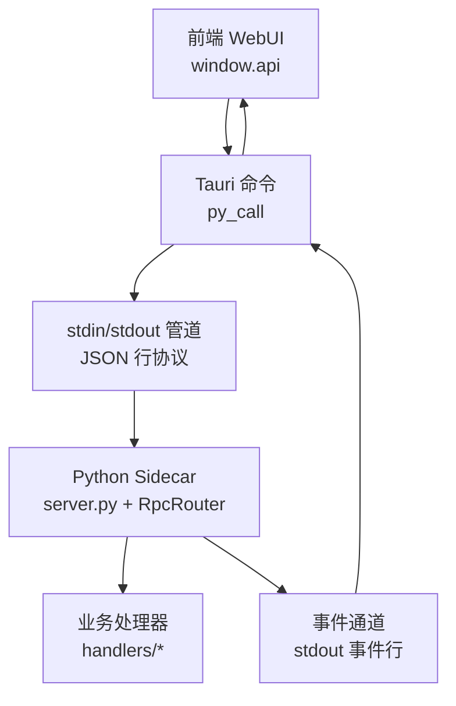
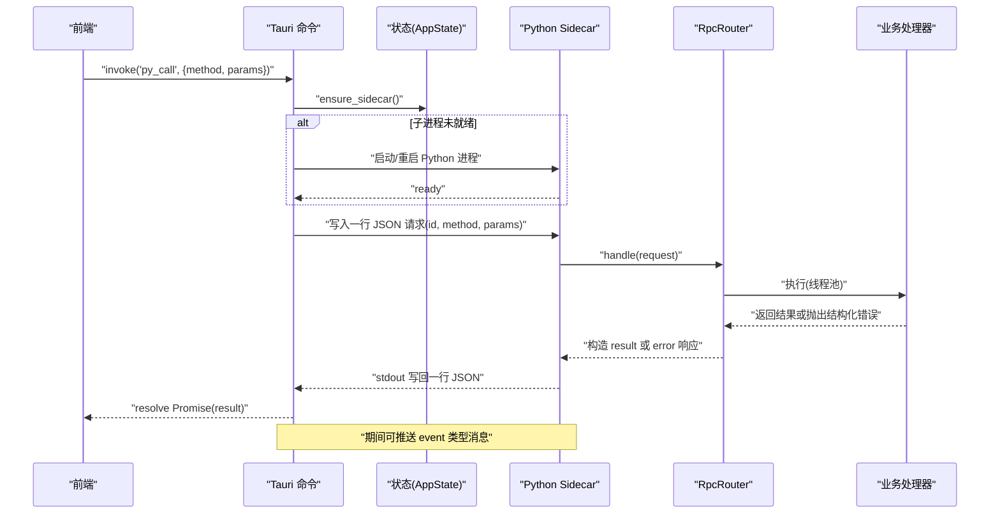
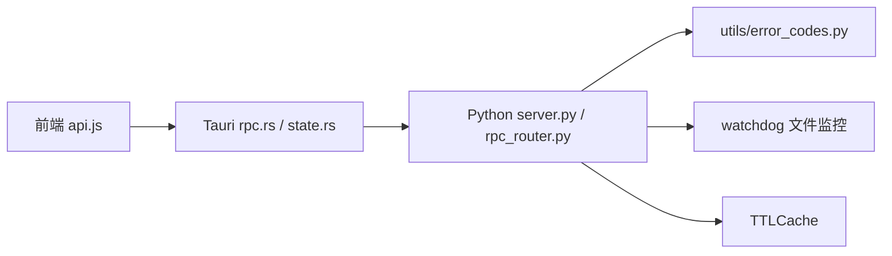
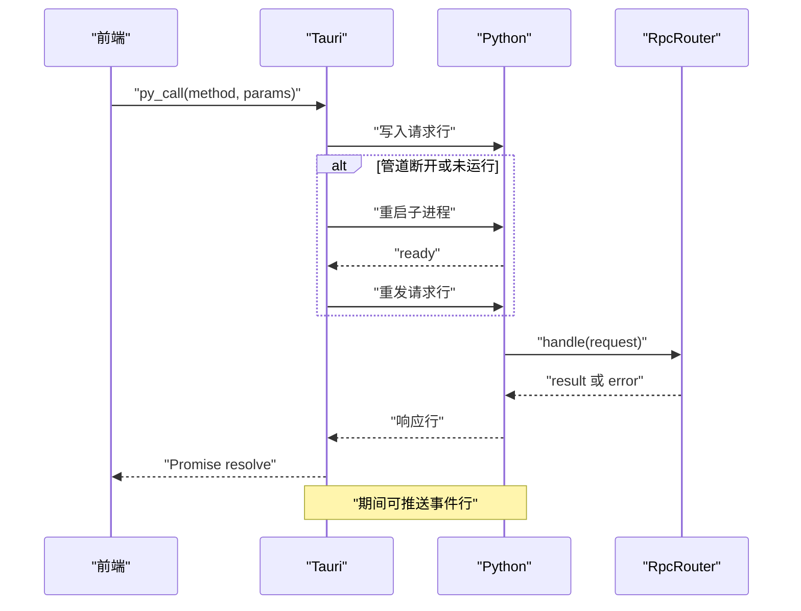

# 通信协议设计

<cite>
**本文引用的文件**   
- [server.py](file://python/sidecar/server.py)
- [rpc_router.py](file://python/sidecar/rpc_router.py)
- [error_codes.py](file://utils/error_codes.py)
- [rpc.rs](file://src-tauri/src/rpc.rs)
- [sidecar.rs](file://src-tauri/src/sidecar.rs)
- [state.rs](file://src-tauri/src/state.rs)
- [api.js](file://webui/js/api.js)
</cite>

## 目录
1. [简介](#简介)
2. [项目结构](#项目结构)
3. [核心组件](#核心组件)
4. [架构总览](#架构总览)
5. [详细组件分析](#详细组件分析)
6. [依赖关系分析](#依赖关系分析)
7. [性能考虑](#性能考虑)
8. [故障排查指南](#故障排查指南)
9. [结论](#结论)
10. [附录：协议规范与示例](#附录协议规范与示例)

## 简介
本文件为 NoteAI 的通信协议技术文档，聚焦于前后端之间的 JSON-RPC 自定义实现、IPC 进程间通信机制、事件驱动通信模式、错误码体系以及 API 版本管理与兼容性策略。NoteAI 采用 Tauri（Rust）作为宿主应用，通过 stdin/stdout 以行式 JSON 与 Python sidecar 进行双向通信；前端通过 Tauri invoke 调用 Rust 命令，再由 Rust 转发到 Python 侧处理并返回结果或推送事件。

## 项目结构
- 前端（WebUI）：通过 window.api 暴露的方法统一发起 RPC 调用，封装重试、错误翻译与特殊流程（如分页预览）。
- 中间层（Tauri/Rust）：维护 Python 子进程生命周期、请求/响应路由、超时控制、管道异常恢复与事件广播。
- 后端（Python Sidecar）：基于标准输入输出逐行解析 JSON-RPC 请求，使用 RpcRouter 分发到具体处理器，并通过 stdout 发送响应与事件。

图表来源
- [api.js](file://webui/js/api.js)
- [rpc.rs](file://src-tauri/src/rpc.rs)
- [sidecar.rs](file://src-tauri/src/sidecar.rs)
- [server.py](file://python/sidecar/server.py)
- [rpc_router.py](file://python/sidecar/rpc_router.py)

章节来源
- [api.js](file://webui/js/api.js)
- [rpc.rs](file://src-tauri/src/rpc.rs)
- [sidecar.rs](file://src-tauri/src/sidecar.rs)
- [server.py](file://python/sidecar/server.py)
- [rpc_router.py](file://python/sidecar/rpc_router.py)

## 核心组件
- 前端 API 封装：提供统一的 pyCall 方法，负责环境检测、Tauri invoke 适配、重试与错误翻译。
- Tauri 命令与状态：注册 py_call 命令，管理 Python 子进程、待处理请求映射、超时与重启逻辑。
- Python 侧服务器：读取 stdin 行、解析 JSON、路由到处理器、并发执行、写回 stdout。
- RPC 路由器：支持同步/异步处理器、线程池调度、结构化错误包装与消息脱敏。
- 错误码体系：统一的 ErrorCode 枚举与 make_error/NoteAIError 工具，保证跨语言一致的错误语义。

章节来源
- [api.js](file://webui/js/api.js)
- [rpc.rs](file://src-tauri/src/rpc.rs)
- [sidecar.rs](file://src-tauri/src/sidecar.rs)
- [server.py](file://python/sidecar/server.py)
- [rpc_router.py](file://python/sidecar/rpc_router.py)
- [error_codes.py](file://utils/error_codes.py)

## 架构总览
下图展示了从前端到后端的完整调用链与事件回流路径，包括超时、重试与管道异常恢复。

图表来源
- [rpc.rs](file://src-tauri/src/rpc.rs)
- [sidecar.rs](file://src-tauri/src/sidecar.rs)
- [server.py](file://python/sidecar/server.py)
- [rpc_router.py](file://python/sidecar/rpc_router.py)

## 详细组件分析

### 前端 API 封装（webui/js/api.js）
- 环境检测：识别 Tauri 运行时，兼容不同版本的 __TAURI__ 接口。
- 统一调用：pyCall(method, params, options) 封装 invoke('py_call')，内置重试与错误翻译。
- 特殊流程：openWorkspace、getFilePreview 等涉及原生对话框或多步逻辑的函数直接调用 Tauri 命令。
- 配置化 API：API_DEFS 将前端方法与 Python 侧 RPC 方法名一一映射，减少重复代码。

章节来源
- [api.js](file://webui/js/api.js)

### Tauri 命令与状态（src-tauri/src/rpc.rs, src-tauri/src/state.rs）
- 白名单校验：ALLOWED_PYTHON_METHODS 限制可调用方法集合，防止任意方法被调用。
- 超时控制：按方法类别设置 rpc_timeout_secs，避免长任务阻塞。
- 请求-响应匹配：AppState.pending_requests 保存 oneshot channel，按 id 匹配响应。
- 进程健康检查：is_sidecar_alive 与 restart_python_sidecar 确保管道可用，异常时自动重启并重试。
- 数据结构：PyRequest/PyResponse 定义 JSON 行协议字段。

章节来源
- [rpc.rs](file://src-tauri/src/rpc.rs)
- [state.rs](file://src-tauri/src/state.rs)

### Python 侧服务器与路由（python/sidecar/server.py, python/sidecar/rpc_router.py）
- 主循环：main() 逐行读取 stdin，解析 JSON 后交由 server.handle_request -> router.handle。
- 并发执行：RpcRouter 使用线程池提交处理器，避免阻塞 stdin 读循环。
- 错误处理：捕获 NoteAIError 与普通异常，统一包装为结构化错误，并对敏感信息进行脱敏。
- 事件推送：服务端可通过 {"id":"event","result":{...}} 格式推送进度、工作区变更等事件。
- 处理器注册：各功能模块在 Server._build_router 中集中注册路由。

章节来源
- [server.py](file://python/sidecar/server.py)
- [rpc_router.py](file://python/sidecar/rpc_router.py)

### 错误码体系（utils/error_codes.py）
- 统一枚举：ErrorCode 覆盖通用、路径、认证、RAG、特性可用性、Schema/Ingest、验证、云同步、UI 等场景。
- 结构化错误：make_error 生成包含 code/message/details 的字典；NoteAIError 便于在处理器中抛出。
- 安全脱敏：RPC 层对错误消息中的绝对路径与家目录进行替换，避免泄露敏感信息。

章节来源
- [error_codes.py](file://utils/error_codes.py)
- [rpc_router.py](file://python/sidecar/rpc_router.py)

### 事件驱动通信（stdout 事件流）
- 事件格式：{"id":"event","result":{"type":"...","...数据..."}}
- 典型事件：workspace_files_changed、rag_index_needs_rebuild、auto_file_converted、progress 等。
- 前端消费：Tauri 将事件通过 app.emit("python-event", payload) 转发给前端监听器。

章节来源
- [server.py](file://python/sidecar/server.py)
- [sidecar.rs](file://src-tauri/src/sidecar.rs)

## 依赖关系分析
- 前端依赖 Tauri 运行时与 window.__TAURI__ 接口。
- Tauri 依赖 tokio 异步 I/O、进程管理、状态共享与事件系统。
- Python 依赖 watchdog 文件系统观察、TTLCache、线程池与日志。
- 错误码与日志工具被多模块复用，形成稳定的契约层。

图表来源
- [api.js](file://webui/js/api.js)
- [rpc.rs](file://src-tauri/src/rpc.rs)
- [state.rs](file://src-tauri/src/state.rs)
- [server.py](file://python/sidecar/server.py)
- [rpc_router.py](file://python/sidecar/rpc_router.py)
- [error_codes.py](file://utils/error_codes.py)

章节来源
- [api.js](file://webui/js/api.js)
- [rpc.rs](file://src-tauri/src/rpc.rs)
- [state.rs](file://src-tauri/src/state.rs)
- [server.py](file://python/sidecar/server.py)
- [rpc_router.py](file://python/sidecar/rpc_router.py)
- [error_codes.py](file://utils/error_codes.py)

## 性能考虑
- 线程池隔离：Python 侧使用固定大小线程池执行处理器，避免阻塞 stdin 读循环。
- 超时控制：Rust 侧按方法类别设置超时，防止长任务导致资源泄漏。
- 缓存策略：Python 侧 TTLCache 与工作区变更失效，降低重复计算开销。
- 事件去抖：工作区变更合并与延迟触发，减少频繁事件风暴。
- 大文件预览：前端采用分片读取与 base64 传输，避免一次性加载大对象。

[本节为通用性能建议，不直接分析具体文件]

## 故障排查指南
- 管道断开：Rust 检测到 Broken pipe 或进程退出时自动重启 Python 子进程并提示用户。
- 超时失败：根据方法类别调整超时时间，必要时拆分任务或使用事件流反馈进度。
- 方法未注册：确认 ALLOWED_PYTHON_METHODS 与 Python 侧路由是否一致。
- 错误信息脱敏：若出现 <workspace>/<home> 占位符，属正常脱敏行为。
- 事件丢失：检查 stdout 是否被正确 flush，以及前端是否正确订阅 python-event。

章节来源
- [rpc.rs](file://src-tauri/src/rpc.rs)
- [sidecar.rs](file://src-tauri/src/sidecar.rs)
- [server.py](file://python/sidecar/server.py)
- [rpc_router.py](file://python/sidecar/rpc_router.py)

## 结论
NoteAI 的通信协议以 JSON 行式 JSON-RPC 为核心，结合 Tauri 的进程管理与事件系统，实现了稳定、可扩展的前后端交互。通过白名单、超时、错误码与事件机制，系统在可靠性与可观测性方面具备良好基础。后续可在方法分组、版本协商与更细粒度的权限控制上进一步完善。

[本节为总结性内容，不直接分析具体文件]

## 附录：协议规范与示例

### JSON-RPC 消息格式
- 请求行（单行 JSON）
  - 字段：id（字符串）、method（字符串）、params（对象）
- 响应行（单行 JSON）
  - 成功：id（字符串）、result（任意值）
  - 失败：id（字符串）、error（对象，包含 code、message、details）
- 事件行（单行 JSON）
  - 字段：id="event"、result（对象，包含 type 与业务数据）

章节来源
- [state.rs](file://src-tauri/src/state.rs)
- [rpc.rs](file://src-tauri/src/rpc.rs)
- [server.py](file://python/sidecar/server.py)
- [rpc_router.py](file://python/sidecar/rpc_router.py)
- [error_codes.py](file://utils/error_codes.py)

### 方法调用规范
- 前端通过 window.api.invoke('py_call', {method, params}) 发起调用。
- Rust 侧校验方法是否在白名单内，随后写入 Python 子进程 stdin。
- Python 侧 RpcRouter 查找对应处理器并执行，返回 result 或 error。
- 长时间任务应返回后立即通过事件推送进度与状态。

章节来源
- [api.js](file://webui/js/api.js)
- [rpc.rs](file://src-tauri/src/rpc.rs)
- [rpc_router.py](file://python/sidecar/rpc_router.py)

### 错误码体系
- 通用错误：UNKNOWN_ERROR、INVALID_PARAMS、INTERNAL_ERROR、METHOD_NOT_FOUND、TIMEOUT 等
- 路径与工作区：WORKSPACE_NOT_SET、FILE_NOT_FOUND、PATH_OUTSIDE_WORKSPACE 等
- 认证与连接：API_KEY_MISSING、API_CONNECTION_FAILED、CLOUD_AUTH_FAILED 等
- RAG/索引：RAG_NOT_ENABLED、RAG_INDEX_BUILDING、RAG_RETRIEVAL_FAILED 等
- 特性可用性：FEATURE_NOT_INSTALLED、DEPENDENCY_MISSING、CLI_AGENT_NOT_FOUND 等
- Schema/Ingest：SCHEMA_NOT_SETUP、INGEST_IN_PROGRESS、CONVERSION_FAILED 等
- UI/Tauri：NOT_RUNNING_IN_TAURI、WINDOW_OPERATION_FAILED 等

章节来源
- [error_codes.py](file://utils/error_codes.py)

### 通信时序图（含异常与重试）

图表来源
- [rpc.rs](file://src-tauri/src/rpc.rs)
- [sidecar.rs](file://src-tauri/src/sidecar.rs)
- [server.py](file://python/sidecar/server.py)
- [rpc_router.py](file://python/sidecar/rpc_router.py)

### 事件类型与用途
- workspace_files_changed：工作区文件变更通知，携带 file_paths 列表
- rag_index_needs_rebuild：RAG 索引需要重建提示
- auto_file_converted：自动转换完成，携带 source/markdown 路径
- progress：任务进度更新，携带 element_id/progress/message

章节来源
- [server.py](file://python/sidecar/server.py)
- [sidecar.rs](file://src-tauri/src/sidecar.rs)

### API 版本管理与向后兼容
- 方法白名单：新增方法需加入白名单，旧方法保持不变以确保兼容。
- 参数扩展：在 params 对象中新增可选字段，保持默认行为不变。
- 错误码演进：新增错误码不应破坏现有客户端判断逻辑，优先使用 details 传递附加信息。
- 事件演进：新事件类型增加新的 type 值，前端按需处理未知类型。

章节来源
- [rpc.rs](file://src-tauri/src/rpc.rs)
- [rpc_router.py](file://python/sidecar/rpc_router.py)
- [error_codes.py](file://utils/error_codes.py)