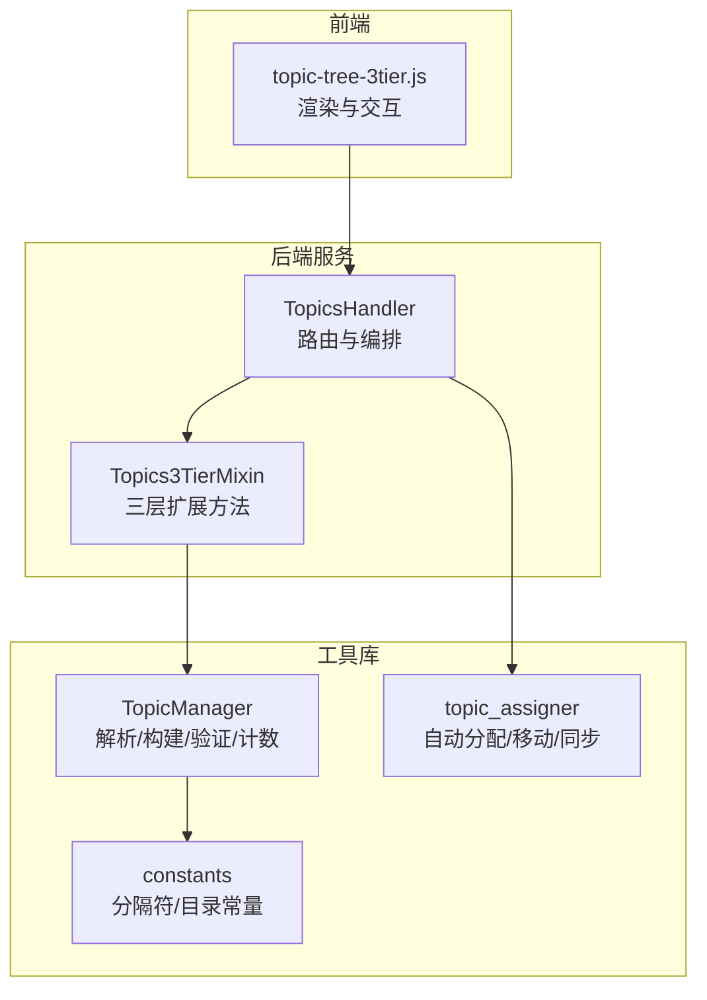
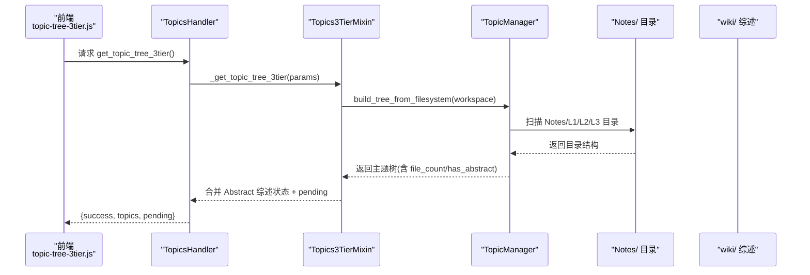
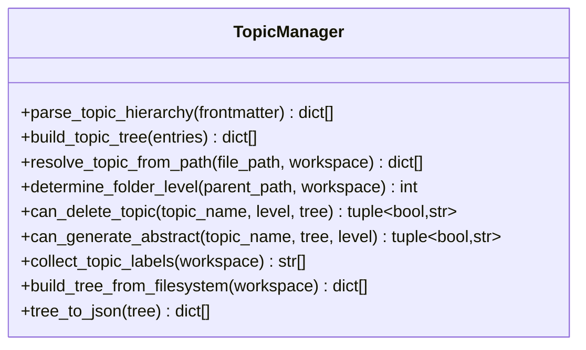
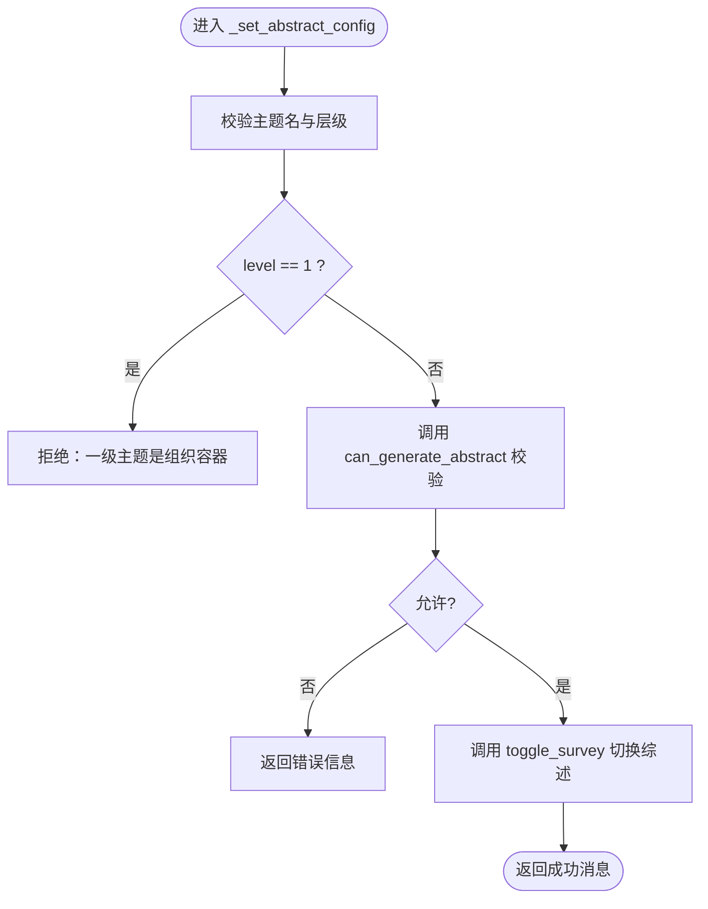
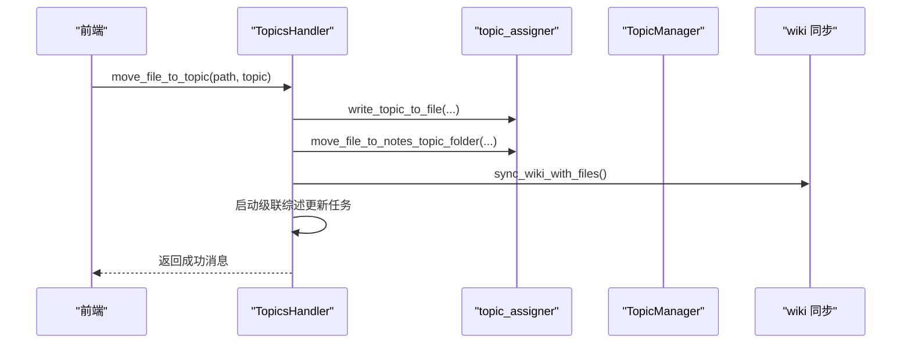
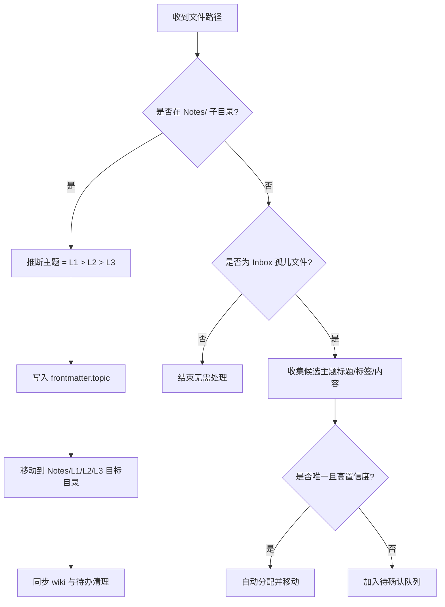
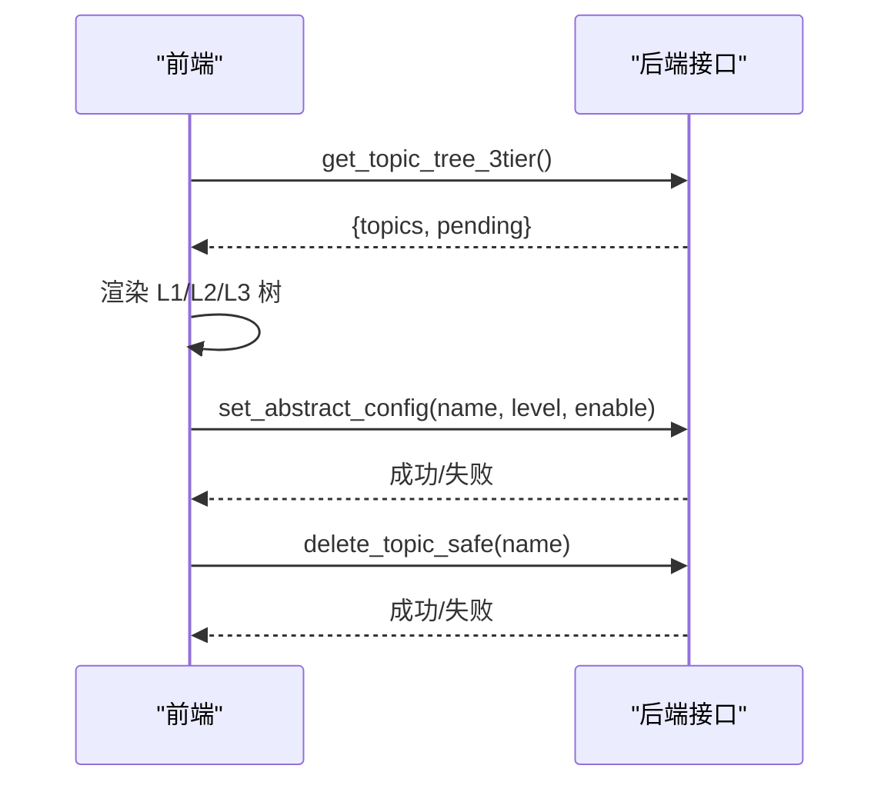
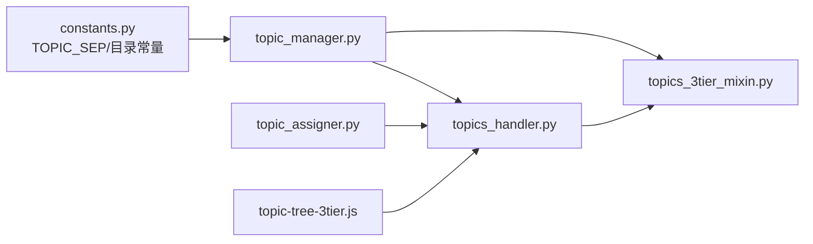

# 三级主题体系

<cite>
**本文引用的文件**   
- [topics_3tier_mixin.py](file://python/sidecar/mixins/topics_3tier_mixin.py)
- [topic_manager.py](file://utils/topic_manager.py)
- [topics_handler.py](file://python/sidecar/handlers/topics_handler.py)
- [topic_assigner.py](file://utils/topic_assigner.py)
- [constants.py](file://config/constants.py)
- [topic-tree-3tier.js](file://webui/js/topic-tree-3tier.js)
</cite>

## 目录
1. [引言](#引言)
2. [项目结构](#项目结构)
3. [核心组件](#核心组件)
4. [架构总览](#架构总览)
5. [详细组件分析](#详细组件分析)
6. [依赖关系分析](#依赖关系分析)
7. [性能考量](#性能考量)
8. [故障排查指南](#故障排查指南)
9. [结论](#结论)
10. [附录：操作示例与规则](#附录操作示例与规则)

## 引言
本技术文档围绕“L1 > L2 > L3”的三级主题体系，系统阐述其设计原理、数据模型、文件系统映射、YAML frontmatter 解析规则、主题树构建算法、综述生成与开关策略、删除保护机制，以及前端交互流程。目标是帮助开发者与使用者全面理解并正确使用该体系。

## 项目结构
三级主题体系涉及后端服务、工具库与前端渲染三大部分：
- 后端服务层：提供主题树查询、创建/重命名/删除、综述开关、图谱数据等接口
- 工具库层：负责 frontmatter 解析、层级判定、树构建、路径映射、自动分配与同步
- 前端展示层：渲染三层主题树、处理用户交互（新建、切换综述、删除）

图表来源
- [topics_handler.py:41-66](file://python/sidecar/handlers/topics_handler.py#L41-L66)
- [topics_3tier_mixin.py:44-86](file://python/sidecar/mixins/topics_3tier_mixin.py#L44-L86)
- [topic_manager.py:32-40](file://utils/topic_manager.py#L32-L40)
- [topic_assigner.py:318-327](file://utils/topic_assigner.py#L318-L327)
- [constants.py:26-33](file://config/constants.py#L26-L33)

章节来源
- [topics_handler.py:41-66](file://python/sidecar/handlers/topics_handler.py#L41-L66)
- [topics_3tier_mixin.py:44-86](file://python/sidecar/mixins/topics_3tier_mixin.py#L44-L86)
- [topic_manager.py:32-40](file://utils/topic_manager.py#L32-L40)
- [topic_assigner.py:318-327](file://utils/topic_assigner.py#L318-L327)
- [constants.py:26-33](file://config/constants.py#L26-L33)

## 核心组件
- TopicManager：负责 YAML frontmatter 中 topic 字段的层级解析、扁平条目到嵌套树的构建、从文件系统扫描构建主题树、层级判定、删除保护与综述控制、文件计数与序列化。
- Topics3TierMixin：为 TopicsHandler 注入三层主题能力，包括获取三层主题树、创建文件夹、设置综述开关、图谱节点追加、安全删除等。
- TopicsHandler：聚合业务逻辑，注册路由，协调 wiki 同步、级联更新、待办处理、批量自动分配等。
- topic_assigner：实现自动主题分配、根据 Notes 目录推断主题、将文件移动到正确主题目录、与 wiki 同步。
- constants：定义 NOTES_FOLDER、ABSTRACT_FOLDER、TOPIC_SEP 等关键常量。
- topic-tree-3tier.js：前端渲染三层主题树，支持展开/折叠、双击打开综述、新建子文件夹、切换综述开关、删除主题等操作。

章节来源
- [topic_manager.py:32-40](file://utils/topic_manager.py#L32-L40)
- [topics_3tier_mixin.py:44-86](file://python/sidecar/mixins/topics_3tier_mixin.py#L44-L86)
- [topics_handler.py:41-66](file://python/sidecar/handlers/topics_handler.py#L41-L66)
- [topic_assigner.py:318-327](file://utils/topic_assigner.py#L318-L327)
- [constants.py:26-33](file://config/constants.py#L26-L33)
- [topic-tree-3tier.js:5-20](file://webui/js/topic-tree-3tier.js#L5-L20)

## 架构总览
下图展示了从前端点击到后端处理、再到文件系统与 wiki 同步的整体调用链。

图表来源
- [topics_handler.py:65-66](file://python/sidecar/handlers/topics_handler.py#L65-L66)
- [topics_3tier_mixin.py:50-86](file://python/sidecar/mixins/topics_3tier_mixin.py#L50-L86)
- [topic_manager.py:378-426](file://utils/topic_manager.py#L378-L426)

## 详细组件分析

### 组件一：TopicManager（主题管理器）
职责与要点：
- 解析 YAML frontmatter 中的 topic 字段，支持横杠缩进语法（列表项与嵌套字典），输出扁平的主题条目列表。
- 将扁平条目构建为嵌套树（L1 → L2 → L3），并按名称排序。
- 从 Notes/ 目录扫描构建主题树，统计每个节点的文件数，标记综述存在性。
- 提供层级判定（新建文件夹应属于哪个层级）、删除保护（一级需无二级才可删；二级可删但会级联删除其下三级）、综述控制（一级与二级互斥，三级不支持）。
- 提供序列化 tree_to_json 供前端使用。

图表来源
- [topic_manager.py:45-109](file://utils/topic_manager.py#L45-L109)
- [topic_manager.py:114-179](file://utils/topic_manager.py#L114-L179)
- [topic_manager.py:184-217](file://utils/topic_manager.py#L184-L217)
- [topic_manager.py:222-245](file://utils/topic_manager.py#L222-L245)
- [topic_manager.py:250-286](file://utils/topic_manager.py#L250-L286)
- [topic_manager.py:291-345](file://utils/topic_manager.py#L291-L345)
- [topic_manager.py:350-426](file://utils/topic_manager.py#L350-L426)
- [topic_manager.py:446-484](file://utils/topic_manager.py#L446-L484)

章节来源
- [topic_manager.py:45-109](file://utils/topic_manager.py#L45-L109)
- [topic_manager.py:114-179](file://utils/topic_manager.py#L114-L179)
- [topic_manager.py:184-217](file://utils/topic_manager.py#L184-L217)
- [topic_manager.py:222-245](file://utils/topic_manager.py#L222-L245)
- [topic_manager.py:250-286](file://utils/topic_manager.py#L250-L286)
- [topic_manager.py:291-345](file://utils/topic_manager.py#L291-L345)
- [topic_manager.py:350-426](file://utils/topic_manager.py#L350-L426)
- [topic_manager.py:446-484](file://utils/topic_manager.py#L446-L484)

### 组件二：Topics3TierMixin（三层主题扩展）
职责与要点：
- 提供 _get_topic_tree_3tier：扫描 Notes/ 目录，构建主题树，检查 Abstract 目录下的综述文件，加载待确认列表。
- 提供 _create_topic_folder：在 Notes/ 或指定父目录下创建新文件夹，自动判定层级。
- 提供 _set_abstract_config：仅二级主题可开启综述，校验互斥规则后调用 toggle_survey。
- 提供 _append_topic_graph_nodes / _append_tag_graph_nodes：为知识图谱追加节点与边。
- 提供 _delete_topic_safe：删除前进行保护校验，再委托给底层删除逻辑。

图表来源
- [topics_3tier_mixin.py:126-153](file://python/sidecar/mixins/topics_3tier_mixin.py#L126-L153)
- [topic_manager.py:291-345](file://utils/topic_manager.py#L291-L345)

章节来源
- [topics_3tier_mixin.py:50-86](file://python/sidecar/mixins/topics_3tier_mixin.py#L50-L86)
- [topics_3tier_mixin.py:88-124](file://python/sidecar/mixins/topics_3tier_mixin.py#L88-L124)
- [topics_3tier_mixin.py:126-153](file://python/sidecar/mixins/topics_3tier_mixin.py#L126-L153)
- [topics_3tier_mixin.py:288-315](file://python/sidecar/mixins/topics_3tier_mixin.py#L288-L315)

### 组件三：TopicsHandler（主题处理器）
职责与要点：
- 聚合主题相关路由：获取主题树、同步 wiki、自动分配、批量分配、移动文件、创建/重命名/删除主题、解析待办、活动日志等。
- 通过 mixin 注入三层主题能力，统一对外暴露接口。
- 在创建/移动/删除主题时，触发 wiki 同步与级联综述更新任务。

图表来源
- [topics_handler.py:151-180](file://python/sidecar/handlers/topics_handler.py#L151-L180)
- [topic_assigner.py:142-178](file://utils/topic_assigner.py#L142-L178)

章节来源
- [topics_handler.py:41-66](file://python/sidecar/handlers/topics_handler.py#L41-L66)
- [topics_handler.py:151-180](file://python/sidecar/handlers/topics_handler.py#L151-L180)
- [topics_handler.py:182-229](file://python/sidecar/handlers/topics_handler.py#L182-L229)
- [topics_handler.py:231-282](file://python/sidecar/handlers/topics_handler.py#L231-L282)
- [topics_handler.py:284-333](file://python/sidecar/handlers/topics_handler.py#L284-L333)

### 组件四：自动分配与目录推断（topic_assigner）
职责与要点：
- 当文件位于 Notes/L1/L2/L3 子目录时，优先从目录路径推断主题并写入 frontmatter，同时移动文件到对应目录。
- 对未分配主题的文件，尝试基于标题、标签、内容片段与现有主题匹配，必要时调用 LLM 建议，按阈值自动分配或加入待确认队列。
- 识别“综述”文件，将其归入 wiki/{主题}_综述.md 所在目录。

图表来源
- [topic_assigner.py:95-118](file://utils/topic_assigner.py#L95-L118)
- [topic_assigner.py:142-178](file://utils/topic_assigner.py#L142-L178)
- [topic_assigner.py:267-315](file://utils/topic_assigner.py#L267-L315)
- [topic_assigner.py:318-327](file://utils/topic_assigner.py#L318-L327)

章节来源
- [topic_assigner.py:95-118](file://utils/topic_assigner.py#L95-L118)
- [topic_assigner.py:142-178](file://utils/topic_assigner.py#L142-L178)
- [topic_assigner.py:267-315](file://utils/topic_assigner.py#L267-L315)
- [topic_assigner.py:318-327](file://utils/topic_assigner.py#L318-L327)

### 组件五：前端三层主题树（topic-tree-3tier.js）
职责与要点：
- 加载并渲染 L1/L2/L3 主题树，显示文件数量与综述标识。
- 单击选中主题并加载右侧文件列表；双击有综述的主题节点直接打开综述预览。
- 提供新建子文件夹、切换综述开关（仅二级）、删除主题（受保护）等交互。

图表来源
- [topic-tree-3tier.js:12-20](file://webui/js/topic-tree-3tier.js#L12-L20)
- [topic-tree-3tier.js:169-218](file://webui/js/topic-tree-3tier.js#L169-L218)
- [topic-tree-3tier.js:267-276](file://webui/js/topic-tree-3tier.js#L267-L276)
- [topic-tree-3tier.js:282-293](file://webui/js/topic-tree-3tier.js#L282-L293)

章节来源
- [topic-tree-3tier.js:12-20](file://webui/js/topic-tree-3tier.js#L12-L20)
- [topic-tree-3tier.js:169-218](file://webui/js/topic-tree-3tier.js#L169-L218)
- [topic-tree-3tier.js:267-276](file://webui/js/topic-tree-3tier.js#L267-L276)
- [topic-tree-3tier.js:282-293](file://webui/js/topic-tree-3tier.js#L282-L293)

## 依赖关系分析
- 常量依赖：TOPIC_SEP 用于拼接主题路径（如 “A > B > C”），NOTES_FOLDER 与 ABSTRACT_FOLDER 决定 Notes/ 与 wiki/ 目录位置。
- 模块耦合：
  - Topics3TierMixin 依赖 TopicManager 进行树构建与校验。
  - TopicsHandler 依赖 topic_assigner 完成自动分配与文件移动，依赖 wiki 同步与级联更新。
  - 前端依赖后端接口返回的 topics/pending 数据结构进行渲染与交互。

图表来源
- [constants.py:26-33](file://config/constants.py#L26-L33)
- [topic_manager.py:378-426](file://utils/topic_manager.py#L378-L426)
- [topics_3tier_mixin.py:50-86](file://python/sidecar/mixins/topics_3tier_mixin.py#L50-L86)
- [topics_handler.py:41-66](file://python/sidecar/handlers/topics_handler.py#L41-L66)
- [topic_assigner.py:318-327](file://utils/topic_assigner.py#L318-L327)
- [topic-tree-3tier.js:12-20](file://webui/js/topic-tree-3tier.js#L12-L20)

章节来源
- [constants.py:26-33](file://config/constants.py#L26-L33)
- [topic_manager.py:378-426](file://utils/topic_manager.py#L378-L426)
- [topics_3tier_mixin.py:50-86](file://python/sidecar/mixins/topics_3tier_mixin.py#L50-L86)
- [topics_handler.py:41-66](file://python/sidecar/handlers/topics_handler.py#L41-L66)
- [topic_assigner.py:318-327](file://utils/topic_assigner.py#L318-L327)
- [topic-tree-3tier.js:12-20](file://webui/js/topic-tree-3tier.js#L12-L20)

## 性能考量
- 主题树构建：从 Notes/ 目录递归扫描，时间复杂度与文件/目录数量线性相关。建议在大型工作区中避免频繁全量刷新，采用增量同步与缓存策略。
- 文件计数：统计每个主题节点的文件数时跳过隐藏文件与特殊文件（综述、WIKI、tags 等），减少无效计算。
- 自动分配：批量处理时按进度反馈，避免阻塞主线程；LLM 建议仅在需要时调用，降低外部依赖开销。
- 综述生成：仅在二级主题启用，且与一级互斥，避免重复计算与冗余存储。

[本节为通用指导，不直接分析具体文件]

## 故障排查指南
常见问题与定位：
- 主题树为空：检查工作区路径是否配置、Notes/ 目录是否存在、是否有权限读取。
- 综述无法打开：确认二级主题已开启综述开关，且 wiki/ 下存在对应综述文件；若前端缺少 abstract_file 字段，重新加载主题树以恢复最新状态。
- 删除失败：一级主题下有二级标题时会阻止删除；二级删除会提示级联删除其下三级。
- 自动分配未生效：检查文件是否位于 Notes/ 子目录或为 Inbox 孤儿文件；查看待确认列表并进行人工确认。

章节来源
- [topics_3tier_mixin.py:50-86](file://python/sidecar/mixins/topics_3tier_mixin.py#L50-L86)
- [topic_manager.py:250-286](file://utils/topic_manager.py#L250-L286)
- [topic-manager.py:291-345](file://utils/topic_manager.py#L291-L345)
- [topic-tree-3tier.js:156-163](file://webui/js/topic-tree-3tier.js#L156-L163)

## 结论
三级主题体系通过“Notes/ 目录 + YAML frontmatter topic 字段”的双轨机制，实现了稳定的层次化知识组织。TopicManager 提供解析、构建与校验的核心能力；Topics3TierMixin 与 TopicsHandler 将能力封装为易用的接口；前端则以直观的方式呈现与交互。配合自动分配与综述生成，整体形成闭环的知识管理流程。

[本节为总结，不直接分析具体文件]

## 附录：操作示例与规则

### YAML frontmatter topic 字段解析规则
- 支持横杠缩进语法（列表项与嵌套字典），例如：
  - 一级（0 缩进）
  - 二级（2 空格缩进）
  - 三级（4 空格缩进）
- 解析器会将上述结构转换为扁平条目列表，再由构建器组装为嵌套树。

章节来源
- [topic_manager.py:45-109](file://utils/topic_manager.py#L45-L109)

### 文件系统路径与主题层级映射
- Notes/ 根目录 → L1
- Notes/L1 → L2
- Notes/L1/L2 → L3
- 文件位于 Notes/L1/L2/L3 时，自动推断主题为 “L1 > L2 > L3”，并写入 frontmatter。

章节来源
- [topic_manager.py:184-217](file://utils/topic_manager.py#L184-L217)
- [topic_assigner.py:95-118](file://utils/topic_assigner.py#L95-L118)

### 主题树构建算法（从扁平列表到嵌套树）
- parse_topic_hierarchy：解析 frontmatter 得到扁平条目（name、level、parent）。
- build_topic_tree：按 level 与 parent 关系构建嵌套树，children 由 dict 转为排序后的 list。
- build_tree_from_filesystem：从 Notes/ 目录扫描构建条目，再调用 build_topic_tree 生成树，并填充 path、has_abstract、abstract_file、file_count。

章节来源
- [topic_manager.py:45-109](file://utils/topic_manager.py#L45-L109)
- [topic_manager.py:114-179](file://utils/topic_manager.py#L114-L179)
- [topic_manager.py:378-426](file://utils/topic_manager.py#L378-L426)

### 综述生成与开关规则
- 仅二级主题可开启综述；一级与二级互斥（若一级已有综述，二级不可设；反之亦然）。
- 三级主题不支持综述。
- 开启综述后，会在 wiki/ 下生成或更新对应综述文件，并在主题树中标记 has_abstract 与 abstract_file。

章节来源
- [topics_3tier_mixin.py:126-153](file://python/sidecar/mixins/topics_3tier_mixin.py#L126-L153)
- [topic_manager.py:291-345](file://utils/topic_manager.py#L291-L345)

### 删除保护与级联删除
- 三级：可直接删除。
- 二级：可删除，但会级联删除其下所有三级（给出警告但允许）。
- 一级：必须确保其下无二级标题才能删除，否则拒绝并列出剩余二级标题。

章节来源
- [topic_manager.py:250-286](file://utils/topic_manager.py#L250-L286)
- [topics_3tier_mixin.py:288-315](file://python/sidecar/mixins/topics_3tier_mixin.py#L288-L315)

### 实际操作示例（步骤说明）
- 创建主题文件夹：
  - 在 Notes/ 或某 L1/L2 目录下新建子文件夹，系统自动判定层级（L1/L2/L3）。
  - 成功后返回新路径与层级信息，并刷新主题树。
- 删除主题：
  - 选择 L2/L3 主题执行删除；L1 删除需先清空其下 L2。
  - 删除后将 Notes/ 下相关文件移至 Notes/ 根目录，并更新 wiki。
- 移动文件到主题：
  - 指定文件路径与目标主题（如 “A > B > C”），系统将写入 frontmatter 并移动到 Notes/A/B/C。
  - 完成后同步 wiki 并触发级联综述更新。
- 切换综述开关：
  - 仅对二级主题可用；开启后会生成或更新 wiki 下的综述文件。

章节来源
- [topics_3tier_mixin.py:88-124](file://python/sidecar/mixins/topics_3tier_mixin.py#L88-L124)
- [topics_handler.py:151-180](file://python/sidecar/handlers/topics_handler.py#L151-L180)
- [topics_handler.py:284-333](file://python/sidecar/handlers/topics_handler.py#L284-L333)
- [topic-tree-3tier.js:241-262](file://webui/js/topic-tree-3tier.js#L241-L262)
- [topic-tree-3tier.js:267-276](file://webui/js/topic-tree-3tier.js#L267-L276)
- [topic-tree-3tier.js:282-293](file://webui/js/topic-tree-3tier.js#L282-L293)