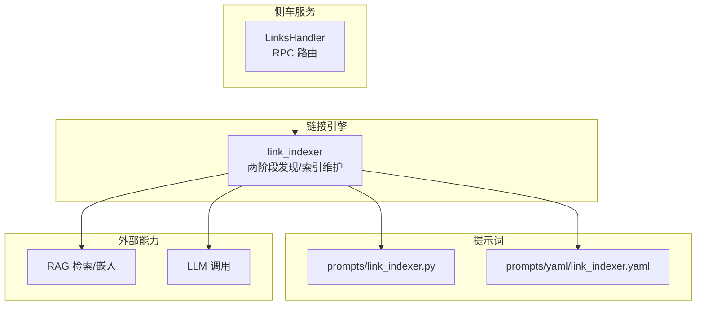
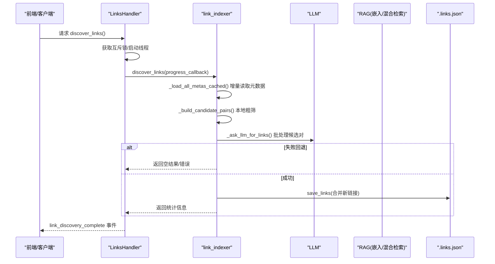
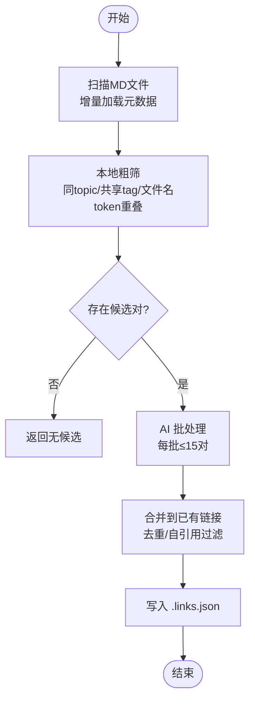
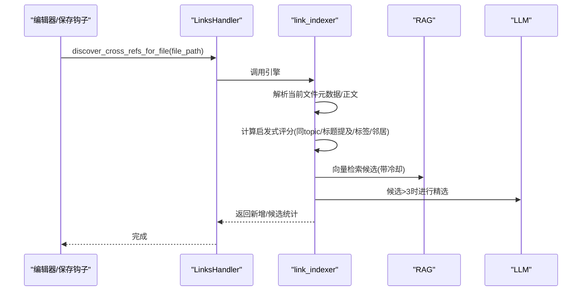
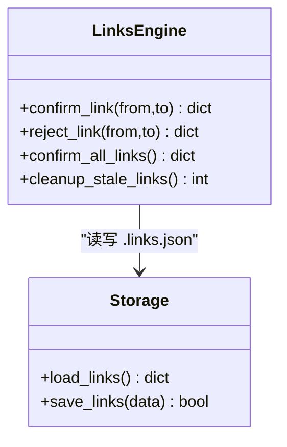
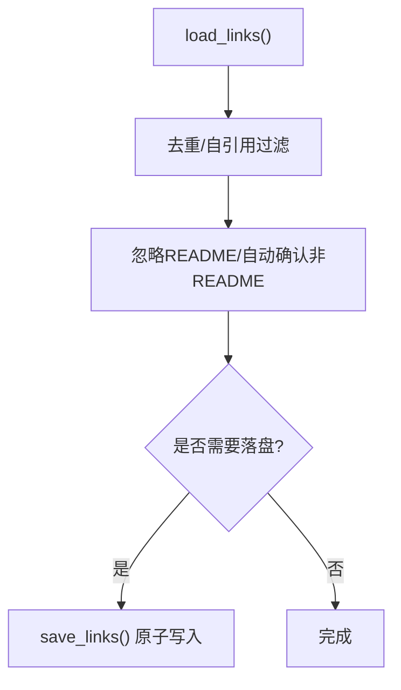
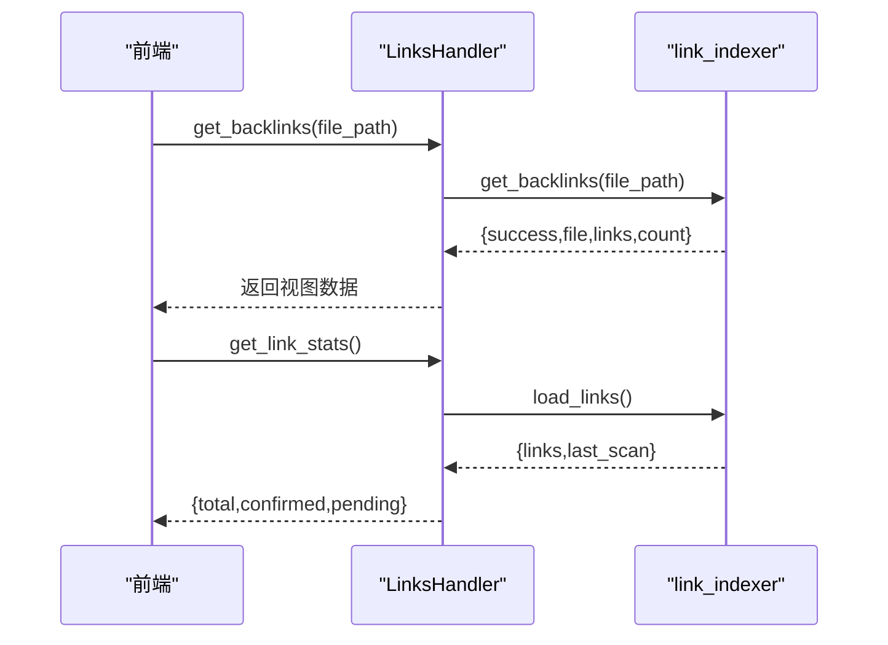
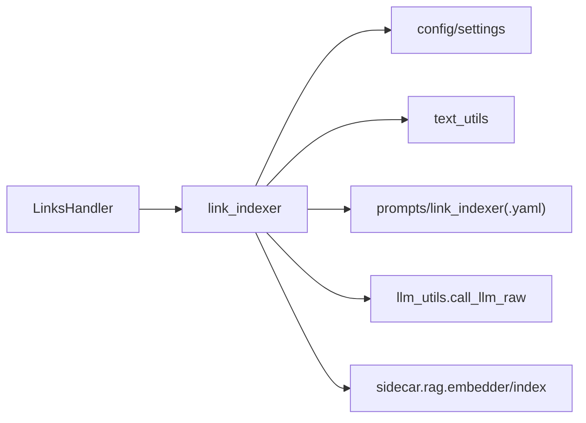

# 双向链接系统

<cite>
**本文引用的文件**
- [utils/link_indexer.py](file://utils/link_indexer.py)
- [python/sidecar/handlers/links_handler.py](file://python/sidecar/handlers/links_handler.py)
- [prompts/link_indexer.py](file://prompts/link_indexer.py)
- [prompts/yaml/link_indexer.yaml](file://prompts/yaml/link_indexer.yaml)
</cite>

## 目录
1. [简介](#简介)
2. [项目结构](#项目结构)
3. [核心组件](#核心组件)
4. [架构总览](#架构总览)
5. [详细组件分析](#详细组件分析)
6. [依赖关系分析](#依赖关系分析)
7. [性能与增量更新](#性能与增量更新)
8. [故障排查指南](#故障排查指南)
9. [结论](#结论)
10. [附录：API 参考](#附录api-参考)

## 简介
本技术文档面向“双向链接系统”，聚焦于“本地粗筛 + AI 精判”的关联发现机制、待确认/已确认状态管理、索引构建与维护（含增量更新）、冲突检测与解决、以及查询与可视化 API。该系统的目标是在工作区中自动发现笔记之间的语义相关关系，并以可审核的方式沉淀为稳定的双向链接图。

## 项目结构
与双向链接相关的核心代码主要分布在以下位置：
- 引擎实现：utils/link_indexer.py
- RPC 处理器：python/sidecar/handlers/links_handler.py
- LLM 提示词：prompts/link_indexer.py 与 prompts/yaml/link_indexer.yaml

图表来源
- [python/sidecar/handlers/links_handler.py:1-85](file://python/sidecar/handlers/links_handler.py#L1-L85)
- [utils/link_indexer.py:807-897](file://utils/link_indexer.py#L807-L897)
- [prompts/link_indexer.py:1-30](file://prompts/link_indexer.py#L1-L30)
- [prompts/yaml/link_indexer.yaml:1-26](file://prompts/yaml/link_indexer.yaml#L1-L26)

章节来源
- [python/sidecar/handlers/links_handler.py:1-85](file://python/sidecar/handlers/links_handler.py#L1-L85)
- [utils/link_indexer.py:1-987](file://utils/link_indexer.py#L1-L987)
- [prompts/link_indexer.py:1-30](file://prompts/link_indexer.py#L1-L30)
- [prompts/yaml/link_indexer.yaml:1-26](file://prompts/yaml/link_indexer.yaml#L1-L26)

## 核心组件
- 链接存储与归一化
  - 持久化路径：工作区根目录下的 .links.json
  - 去重策略：按有向 from→to 键去重；自引用被丢弃；README 不参与
  - 自动确认：加载时会将非 README 且未确认的链接统一标记为 confirmed，便于后续清理流程再处理
- 两阶段关联发现
  - 本地粗筛：同 topic、共享 tag、文件名 token 重叠、标题提及等启发式规则生成候选
  - AI 精判：将候选对或候选列表批量提交给 LLM，返回高置信度关联
- 单文件交叉引用建议
  - 保存后触发：基于当前文件内容与其他文件的元数据快速打分，必要时走 LLM 精选
- 反向链接查询
  - 根据中心文件过滤入链/出链，并标注方向与原因
- 状态管理
  - pending/confirmed 两种状态；支持逐条确认/拒绝、一键全部确认
- 增量缓存
  - 基于 mtime 的文件元数据缓存，避免全量解析

章节来源
- [utils/link_indexer.py:41-168](file://utils/link_indexer.py#L41-L168)
- [utils/link_indexer.py:223-303](file://utils/link_indexer.py#L223-L303)
- [utils/link_indexer.py:310-360](file://utils/link_indexer.py#L310-L360)
- [utils/link_indexer.py:430-560](file://utils/link_indexer.py#L430-L560)
- [utils/link_indexer.py:638-688](file://utils/link_indexer.py#L638-L688)
- [utils/link_indexer.py:900-987](file://utils/link_indexer.py#L900-L987)

## 架构总览
整体采用“侧车 RPC 处理器 → 链接引擎 → 外部能力（RAG/LLM）”的分层设计。处理器负责并发控制、进度上报与参数校验；引擎负责数据流编排、索引读写与业务逻辑；提示词由 YAML/Python 双源提供，YAML 优先。

图表来源
- [python/sidecar/handlers/links_handler.py:8-35](file://python/sidecar/handlers/links_handler.py#L8-L35)
- [utils/link_indexer.py:807-897](file://utils/link_indexer.py#L807-L897)
- [utils/link_indexer.py:740-806](file://utils/link_indexer.py#L740-L806)
- [utils/link_indexer.py:157-168](file://utils/link_indexer.py#L157-L168)

## 详细组件分析

### 组件A：两阶段关联发现（discover_links）
- 输入：可选 progress_callback
- 步骤
  1) 扫描工作区 MD 文件，使用 mtime 缓存增量加载元数据
  2) 本地粗筛：同 topic、共享 tag、文件名 token 重叠，限制最多 200 对进入 AI
  3) AI 精判：每批最多 15 对，调用 LLM 判断是否有关联
  4) 合并：去重、跳过自引用、新增链接直接标记为 confirmed
  5) 持久化：写入 .links.json，记录 last_scan
- 输出：新增数量、总数、候选评估数、扫描文件数

图表来源
- [utils/link_indexer.py:807-897](file://utils/link_indexer.py#L807-L897)
- [utils/link_indexer.py:690-737](file://utils/link_indexer.py#L690-L737)
- [utils/link_indexer.py:740-806](file://utils/link_indexer.py#L740-L806)

章节来源
- [utils/link_indexer.py:807-897](file://utils/link_indexer.py#L807-L897)

### 组件B：单文件交叉引用建议（discover_cross_refs_for_file）
- 适用场景：保存单个笔记后即时建议
- 策略
  - 同主题、正文提及对方标题、对方摘要提及本标题、共享标签
  - 向量检索候选（RAG 混合检索），冷却期保护
  - 已确认链接的一跳邻居
  - 当候选 > 3 时，调用 LLM 精选
- 输出：新增链接数、候选数、消息

图表来源
- [python/sidecar/handlers/links_handler.py:69-75](file://python/sidecar/handlers/links_handler.py#L69-L75)
- [utils/link_indexer.py:430-560](file://utils/link_indexer.py#L430-L560)
- [utils/link_indexer.py:310-360](file://utils/link_indexer.py#L310-L360)

章节来源
- [python/sidecar/handlers/links_handler.py:69-75](file://python/sidecar/handlers/links_handler.py#L69-L75)
- [utils/link_indexer.py:430-560](file://utils/link_indexer.py#L430-L560)

### 组件C：状态管理与用户审核
- 状态定义
  - pending：待确认
  - confirmed：已确认
- 操作
  - confirm_link(from, to)：精确匹配有向链接并确认
  - reject_link(from, to)：删除指定有向链接
  - confirm_all_links()：一键确认所有 pending
  - cleanup_stale_links()：清理无效/README 链接，并将剩余 pending 自动确认
- 注意
  - 自引用不允许确认或删除
  - README 不参与链接图

图表来源
- [utils/link_indexer.py:936-987](file://utils/link_indexer.py#L936-L987)
- [utils/link_indexer.py:171-204](file://utils/link_indexer.py#L171-L204)
- [utils/link_indexer.py:136-168](file://utils/link_indexer.py#L136-L168)

章节来源
- [utils/link_indexer.py:936-987](file://utils/link_indexer.py#L936-L987)
- [utils/link_indexer.py:171-204](file://utils/link_indexer.py#L171-L204)

### 组件D：链接索引构建与维护
- 索引文件：workspace/.links.json
- 数据结构要点
  - links[]：每条包含 from、to、reason、status
  - last_scan：最近一次全量扫描时间戳
- 维护流程
  - load_links：读取、去重、自引用过滤、README 忽略、自动确认非 README 未确认项
  - save_links：原子写入（先写 tmp 再替换）
  - cleanup_stale_links：清理不存在文件或 README 链接，并将剩余 pending 自动确认

图表来源
- [utils/link_indexer.py:136-168](file://utils/link_indexer.py#L136-L168)
- [utils/link_indexer.py:171-204](file://utils/link_indexer.py#L171-L204)

章节来源
- [utils/link_indexer.py:136-168](file://utils/link_indexer.py#L136-L168)
- [utils/link_indexer.py:171-204](file://utils/link_indexer.py#L171-L204)

### 组件E：冲突检测与解决
- 冲突类型
  - 重复链接：相同 from→to 出现多次
  - 自引用：from == to
  - README 参与：不应出现在图中
- 解决策略
  - 去重：保留首次出现，若后者为 confirmed 则覆盖前者
  - 自引用：直接丢弃
  - README：在加载和清理阶段均被忽略/移除

章节来源
- [utils/link_indexer.py:111-134](file://utils/link_indexer.py#L111-L134)
- [utils/link_indexer.py:93-108](file://utils/link_indexer.py#L93-L108)

### 组件F：查询与可视化 API
- get_backlinks(file_path)
  - 为空：返回全部链接视图
  - 非空：返回与该文件相关的入链/出链，附带 direction、reason、status
- get_link_stats()
  - 返回 total/confirmed/pending 计数

图表来源
- [python/sidecar/handlers/links_handler.py:37-50](file://python/sidecar/handlers/links_handler.py#L37-L50)
- [utils/link_indexer.py:900-934](file://utils/link_indexer.py#L900-L934)

章节来源
- [python/sidecar/handlers/links_handler.py:37-50](file://python/sidecar/handlers/links_handler.py#L37-L50)
- [utils/link_indexer.py:900-934](file://utils/link_indexer.py#L900-L934)

## 依赖关系分析
- 处理器依赖
  - LinksHandler 依赖 link_indexer 提供的 discover_links、get_backlinks、load_links、confirm/reject 等接口
- 引擎依赖
  - link_indexer 依赖：
    - 配置与工作区路径
    - 文本工具（分词、前文解析、通用词过滤等）
    - 提示词（YAML 优先，Python fallback）
    - LLM 调用与配置检查
    - RAG 嵌入与混合检索（用于向量候选）
- 外部能力
  - RAG：encode_query + hybrid_search
  - LLM：call_llm_raw / check_api_config

图表来源
- [python/sidecar/handlers/links_handler.py:1-85](file://python/sidecar/handlers/links_handler.py#L1-L85)
- [utils/link_indexer.py:20-31](file://utils/link_indexer.py#L20-L31)
- [utils/link_indexer.py:388-427](file://utils/link_indexer.py#L388-L427)
- [utils/link_indexer.py:330-346](file://utils/link_indexer.py#L330-L346)
- [prompts/link_indexer.py:1-30](file://prompts/link_indexer.py#L1-L30)
- [prompts/yaml/link_indexer.yaml:1-26](file://prompts/yaml/link_indexer.yaml#L1-L26)

章节来源
- [python/sidecar/handlers/links_handler.py:1-85](file://python/sidecar/handlers/links_handler.py#L1-L85)
- [utils/link_indexer.py:20-31](file://utils/link_indexer.py#L20-L31)
- [utils/link_indexer.py:330-346](file://utils/link_indexer.py#L330-L346)
- [utils/link_indexer.py:388-427](file://utils/link_indexer.py#L388-L427)
- [prompts/link_indexer.py:1-30](file://prompts/link_indexer.py#L1-L30)
- [prompts/yaml/link_indexer.yaml:1-26](file://prompts/yaml/link_indexer.yaml#L1-L26)

## 性能与增量更新
- 增量元数据缓存
  - 基于 mtime 的缓存表，仅解析新增或修改的文件；删除文件自动清理缓存条目
  - 单文件保存后失效对应条目，确保下次读取最新内容
- 向量检索冷却
  - 当 RAG 调用失败时，设置冷却期，避免频繁重试导致雪崩
- 批处理与上限
  - 粗筛候选对最多 200 对进入 AI；AI 批大小 15 对；单文件建议最大候选预览 40
- 原子写入
  - 保存 .links.json 采用临时文件 + replace，降低损坏风险

章节来源
- [utils/link_indexer.py:638-688](file://utils/link_indexer.py#L638-L688)
- [utils/link_indexer.py:326-346](file://utils/link_indexer.py#L326-L346)
- [utils/link_indexer.py:690-737](file://utils/link_indexer.py#L690-L737)
- [utils/link_indexer.py:740-806](file://utils/link_indexer.py#L740-L806)
- [utils/link_indexer.py:157-168](file://utils/link_indexer.py#L157-L168)

## 故障排查指南
- 常见问题
  - 工作区未设置或非 Markdown 文件：单文件建议会直接返回失败
  - README 文件：不参与链接图，会被忽略
  - 自引用：不被允许，确认/拒绝均会失败
  - LLM/RAG 不可用：AI 阶段会回退或跳过，需检查 API 配置
- 定位方法
  - 查看日志中的 “[link_indexer]” 前缀，关注去重/自动确认/清理/失败冷却等信息
  - 通过 get_link_stats 观察 pending/confirmed 分布
  - 使用 get_backlinks 验证特定文件的入链/出链是否正确

章节来源
- [utils/link_indexer.py:223-240](file://utils/link_indexer.py#L223-L240)
- [utils/link_indexer.py:88-91](file://utils/link_indexer.py#L88-L91)
- [utils/link_indexer.py:936-972](file://utils/link_indexer.py#L936-L972)
- [utils/link_indexer.py:326-346](file://utils/link_indexer.py#L326-L346)
- [python/sidecar/handlers/links_handler.py:41-50](file://python/sidecar/handlers/links_handler.py#L41-L50)

## 结论
双向链接系统通过“本地粗筛 + AI 精判”的两阶段机制，在保证性能的同时提升关联质量；配合完善的去重、自引用与 README 过滤策略，以及原子写入与增量缓存，实现了稳定可靠的索引维护。用户可通过简洁的 API 完成链接的发现、审核与管理，并在需要时借助 RAG 与 LLM 获得更高质量的推荐。

## 附录：API 参考
- discover_links
  - 功能：执行完整的全量链接发现流程
  - 入口：LinksHandler._discover_links
  - 行为：异步执行，完成后以 link_discovery_complete 事件推送结果
- discover_cross_refs_for_file
  - 功能：为指定文件生成交叉引用建议
  - 入口：LinksHandler._discover_cross_refs_for_file
- get_backlinks
  - 功能：按中心文件查询入链/出链，或返回全部链接视图
  - 入口：LinksHandler._get_backlinks
- get_link_stats
  - 功能：统计 total/confirmed/pending
  - 入口：LinksHandler._get_link_stats
- confirm_link / reject_link / confirm_all_links
  - 功能：逐条确认/拒绝，或一键确认所有 pending
  - 入口：LinksHandler._confirm_link / _reject_link / _confirm_all_links

章节来源
- [python/sidecar/handlers/links_handler.py:8-85](file://python/sidecar/handlers/links_handler.py#L8-L85)