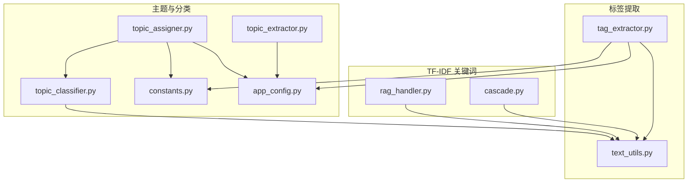
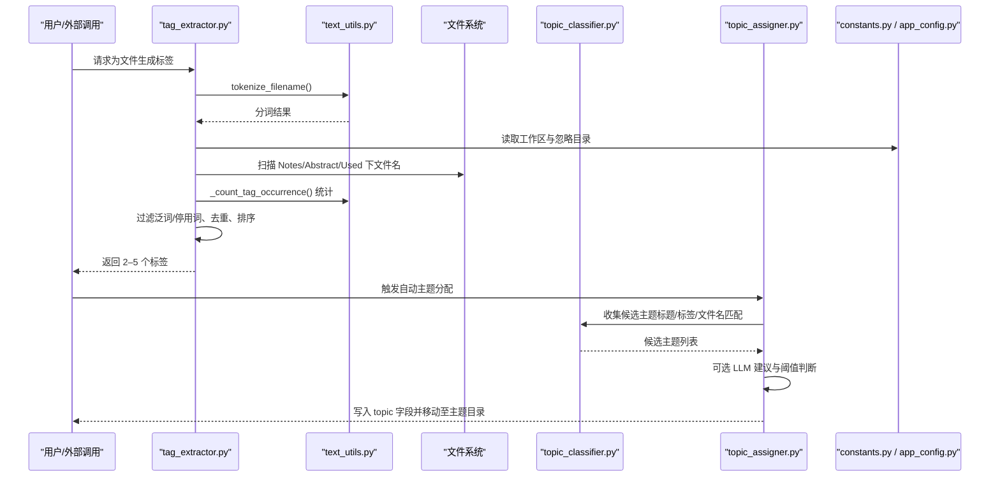
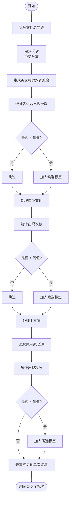
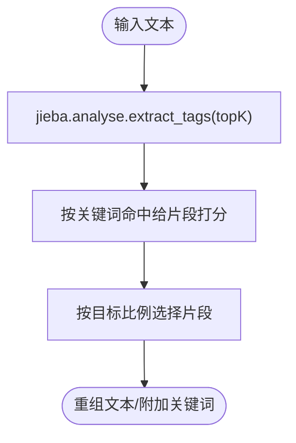
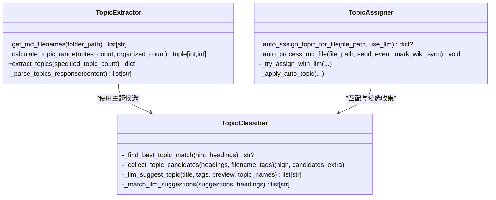
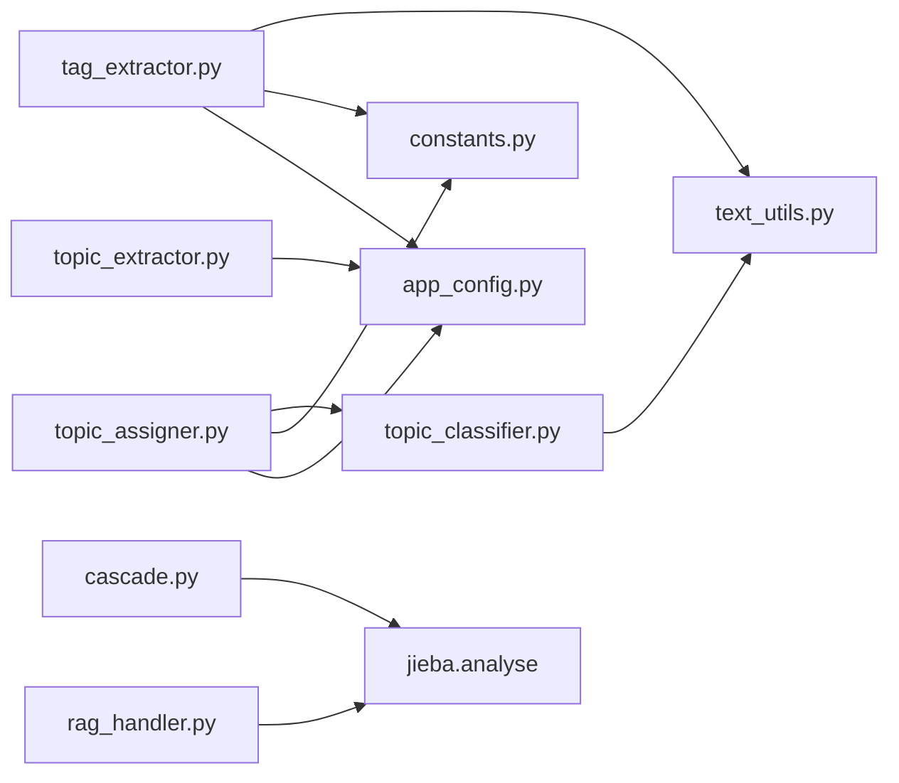

# 标签提取系统

<cite>
**本文引用的文件**   
- [utils/tag_extractor.py](file://utils/tag_extractor.py)
- [utils/text_utils.py](file://utils/text_utils.py)
- [python/sidecar/cascade.py](file://python/sidecar/cascade.py)
- [python/sidecar/handlers/rag_handler.py](file://python/sidecar/handlers/rag_handler.py)
- [modules/topic_extractor.py](file://modules/topic_extractor.py)
- [utils/topic_classifier.py](file://utils/topic_classifier.py)
- [utils/topic_assigner.py](file://utils/topic_assigner.py)
- [config/constants.py](file://config/constants.py)
- [config/app_config.py](file://config/app_config.py)
</cite>

## 目录
1. [简介](#简介)
2. [项目结构](#项目结构)
3. [核心组件](#核心组件)
4. [架构总览](#架构总览)
5. [详细组件分析](#详细组件分析)
6. [依赖关系分析](#依赖关系分析)
7. [性能与复杂度](#性能与复杂度)
8. [配置与自定义规则](#配置与自定义规则)
9. [端到端处理流程与示例](#端到端处理流程与示例)
10. [故障排查指南](#故障排查指南)
11. [结论](#结论)

## 简介
本技术文档围绕“基于 jieba 分词 + TF-IDF 的标签提取系统”展开，覆盖中文文本预处理、分词策略、权重计算、区分度标签生成（2–5 个）、标签去重与合并、以及与主题分类的联动机制。同时提供可配置的停用词表、关键词权重调整方式，并给出实际的文件处理流程与输出示例路径，帮助读者快速理解与落地使用。

## 项目结构
与标签提取相关的代码主要分布在以下模块：
- utils/tag_extractor.py：文件名驱动的标签提取、YAML front matter 写入、批量处理与标签索引生成
- utils/text_utils.py：通用文本工具（jieba 分词、中英文识别、泛词/停用词过滤、归一化匹配、出现次数统计）
- python/sidecar/cascade.py：内容压缩时基于 jieba.analyse 的 TF-IDF 关键词抽取
- python/sidecar/handlers/rag_handler.py：RAG 对话摘要中调用 jieba.analyse 提取关键词
- modules/topic_extractor.py：从 Notes/wiki 文件名推断主题范围并调用大模型生成主题列表
- utils/topic_classifier.py：基于标题、标签、文件名与主题候选的匹配算法
- utils/topic_assigner.py：自动将文件分配到主题层级（含 LLM 建议与阈值控制）
- config/constants.py：工作区常量（Notes、wiki 等目录名、主题分隔符）
- config/app_config.py：全局配置（API、阈值、RAG 参数等）



图表来源
- [utils/tag_extractor.py:1-661](file://utils/tag_extractor.py#L1-L661)
- [utils/text_utils.py:1-1367](file://utils/text_utils.py#L1-L1367)
- [python/sidecar/cascade.py:200-230](file://python/sidecar/cascade.py#L200-L230)
- [python/sidecar/handlers/rag_handler.py:595-610](file://python/sidecar/handlers/rag_handler.py#L595-L610)
- [modules/topic_extractor.py:1-245](file://modules/topic_extractor.py#L1-L245)
- [utils/topic_classifier.py:1-159](file://utils/topic_classifier.py#L1-L159)
- [utils/topic_assigner.py:1-418](file://utils/topic_assigner.py#L1-L418)
- [config/constants.py:1-52](file://config/constants.py#L1-L52)
- [config/app_config.py:1-396](file://config/app_config.py#L1-L396)

章节来源
- [utils/tag_extractor.py:1-661](file://utils/tag_extractor.py#L1-L661)
- [utils/text_utils.py:1-1367](file://utils/text_utils.py#L1-L1367)
- [python/sidecar/cascade.py:200-230](file://python/sidecar/cascade.py#L200-L230)
- [python/sidecar/handlers/rag_handler.py:595-610](file://python/sidecar/handlers/rag_handler.py#L595-L610)
- [modules/topic_extractor.py:1-245](file://modules/topic_extractor.py#L1-L245)
- [utils/topic_classifier.py:1-159](file://utils/topic_classifier.py#L1-L159)
- [utils/topic_assigner.py:1-418](file://utils/topic_assigner.py#L1-L418)
- [config/constants.py:1-52](file://config/constants.py#L1-L52)
- [config/app_config.py:1-396](file://config/app_config.py#L1-L396)

## 核心组件
- 文件名驱动标签提取器：对 Notes、Abstract、Used 中的 MD 文件名进行分词与频次筛选，优先组合英文相邻词，再考虑单英文词与中文词，结合泛词/停用词过滤与最小长度限制，最终输出 2–5 个高区分度标签。
- 文本工具库：提供 jieba 分词、中英文识别、CamelCase 拆分、归一化匹配、出现次数统计、泛词/停用词集合与“有意义标签”判定。
- TF-IDF 关键词抽取：在内容压缩与 RAG 摘要场景中使用 jieba.analyse.extract_tags 获取关键词，用于辅助信息浓缩或展示。
- 主题提取与分配：从 Notes/wiki 文件名推断主题范围，调用大模型生成主题；随后通过标题、标签、文件名与主题候选匹配，必要时引入 LLM 建议并按阈值自动归档到主题层级。

章节来源
- [utils/tag_extractor.py:94-174](file://utils/tag_extractor.py#L94-L174)
- [utils/text_utils.py:1256-1330](file://utils/text_utils.py#L1256-L1330)
- [python/sidecar/cascade.py:200-230](file://python/sidecar/cascade.py#L200-L230)
- [python/sidecar/handlers/rag_handler.py:595-610](file://python/sidecar/handlers/rag_handler.py#L595-L610)
- [modules/topic_extractor.py:97-206](file://modules/topic_extractor.py#L97-L206)
- [utils/topic_classifier.py:15-148](file://utils/topic_classifier.py#L15-L148)
- [utils/topic_assigner.py:267-316](file://utils/topic_assigner.py#L267-L316)

## 架构总览
标签提取系统与主题分类协同工作：先由文件名与文本工具生成候选标签，再通过主题分类器与分配器将内容归入合适的主题层级；TF-IDF 关键词抽取在内容压缩与 RAG 场景中作为补充能力。



图表来源
- [utils/tag_extractor.py:94-174](file://utils/tag_extractor.py#L94-L174)
- [utils/text_utils.py:1282-1298](file://utils/text_utils.py#L1282-L1298)
- [utils/topic_classifier.py:117-148](file://utils/topic_classifier.py#L117-L148)
- [utils/topic_assigner.py:267-316](file://utils/topic_assigner.py#L267-L316)
- [config/constants.py:26-33](file://config/constants.py#L26-L33)
- [config/app_config.py:79-84](file://config/app_config.py#L79-L84)

## 详细组件分析

### 组件 A：文件名驱动标签提取器（tag_extractor.py）
- 输入：单个 Markdown 文件路径或一批文件路径
- 处理：
  - 解析文件名，按分隔符拆分为字段
  - 使用 jieba 分词，分离英文与中文词
  - 优先尝试英文相邻双词组合，若在工作区文件名中出现次数超过阈值则保留
  - 其次考虑单英文词与中文词，同样需满足出现次数阈值且非泛词/停用词
  - 去重与泛词过滤，保证标签具备区分度
- 输出：2–5 个标签字符串列表，并可写入 YAML front matter



图表来源
- [utils/tag_extractor.py:94-174](file://utils/tag_extractor.py#L94-L174)
- [utils/text_utils.py:1282-1330](file://utils/text_utils.py#L1282-L1330)

章节来源
- [utils/tag_extractor.py:94-174](file://utils/tag_extractor.py#L94-L174)
- [utils/text_utils.py:1282-1330](file://utils/text_utils.py#L1282-L1330)

### 组件 B：文本工具与分词策略（text_utils.py）
- 分词策略：
  - CamelCase 拆分提升英文术语识别
  - 优先使用 jieba.lcut 进行分词，失败时回退正则切分
  - 过滤短词（最小长度 2），去除括号内注释
- 语言识别：
  - is_chinese_word/is_english_word 用于中英分离
- 匹配与统计：
  - _normalize_for_match 去除空格并小写，支持模糊匹配
  - _count_tag_occurrence 在工作区文件名中统计候选标签出现次数
- 质量过滤：
  - GENERIC_WORDS 与 CHINESE_STOPWORDS 提供泛词与停用词集合
  - _is_meaningful_tag 确保标签具备足够意义（中文>2字、英文不在泛词集、混合长度与分词数要求）

章节来源
- [utils/text_utils.py:1246-1330](file://utils/text_utils.py#L1246-L1330)
- [utils/text_utils.py:855-1234](file://utils/text_utils.py#L855-L1234)

### 组件 C：TF-IDF 关键词抽取（cascade.py 与 rag_handler.py）
- cascade.py：
  - 使用 jieba.analyse.extract_tags(content, topK=15) 抽取关键词
  - 基于关键词对句子打分并选择目标比例的句子，实现内容压缩
- rag_handler.py：
  - 在 RAG 对话摘要中，使用 jieba.analyse.extract_tags(text, topK=3) 提取关键词并附加到消息预览



图表来源
- [python/sidecar/cascade.py:200-230](file://python/sidecar/cascade.py#L200-L230)
- [python/sidecar/handlers/rag_handler.py:595-610](file://python/sidecar/handlers/rag_handler.py#L595-L610)

章节来源
- [python/sidecar/cascade.py:200-230](file://python/sidecar/cascade.py#L200-L230)
- [python/sidecar/handlers/rag_handler.py:595-610](file://python/sidecar/handlers/rag_handler.py#L595-L610)

### 组件 D：主题提取与分类（topic_extractor.py、topic_classifier.py、topic_assigner.py）
- 主题提取：
  - 读取 Notes 与 wiki 文件夹下的 MD 文件名
  - 根据数量计算主题个数范围，调用大模型返回主题列表
- 主题分类：
  - 基于标题、标签、文件名与主题候选进行多策略匹配（精确匹配、包含匹配、连续双词匹配、语义词匹配）
  - 可选 LLM 建议，并与已有主题列表对齐
- 主题分配：
  - 当单一候选置信度达到阈值（默认 0.80）时自动归档到对应主题目录
  - 否则进入待处理队列，等待人工确认



图表来源
- [modules/topic_extractor.py:97-206](file://modules/topic_extractor.py#L97-L206)
- [utils/topic_classifier.py:15-148](file://utils/topic_classifier.py#L15-L148)
- [utils/topic_assigner.py:267-316](file://utils/topic_assigner.py#L267-L316)

章节来源
- [modules/topic_extractor.py:97-206](file://modules/topic_extractor.py#L97-L206)
- [utils/topic_classifier.py:15-148](file://utils/topic_classifier.py#L15-L148)
- [utils/topic_assigner.py:267-316](file://utils/topic_assigner.py#L267-L316)

## 依赖关系分析
- tag_extractor.py 依赖 text_utils.py 的分词、匹配与统计函数，以及 constants.py 的工作区目录常量与 app_config.py 的全局配置
- TF-IDF 关键词抽取依赖 jieba.analyse，分别在 cascade.py 与 rag_handler.py 中调用
- 主题相关模块相互协作：topic_extractor.py 负责主题范围与 LLM 调用，topic_classifier.py 负责候选匹配，topic_assigner.py 负责最终分配与文件移动



图表来源
- [utils/tag_extractor.py:1-661](file://utils/tag_extractor.py#L1-L661)
- [utils/text_utils.py:1-1367](file://utils/text_utils.py#L1-L1367)
- [python/sidecar/cascade.py:200-230](file://python/sidecar/cascade.py#L200-L230)
- [python/sidecar/handlers/rag_handler.py:595-610](file://python/sidecar/handlers/rag_handler.py#L595-L610)
- [modules/topic_extractor.py:1-245](file://modules/topic_extractor.py#L1-L245)
- [utils/topic_classifier.py:1-159](file://utils/topic_classifier.py#L1-L159)
- [utils/topic_assigner.py:1-418](file://utils/topic_assigner.py#L1-L418)
- [config/constants.py:1-52](file://config/constants.py#L1-L52)
- [config/app_config.py:1-396](file://config/app_config.py#L1-L396)

章节来源
- [utils/tag_extractor.py:1-661](file://utils/tag_extractor.py#L1-L661)
- [utils/text_utils.py:1-1367](file://utils/text_utils.py#L1-L1367)
- [python/sidecar/cascade.py:200-230](file://python/sidecar/cascade.py#L200-L230)
- [python/sidecar/handlers/rag_handler.py:595-610](file://python/sidecar/handlers/rag_handler.py#L595-L610)
- [modules/topic_extractor.py:1-245](file://modules/topic_extractor.py#L1-L245)
- [utils/topic_classifier.py:1-159](file://utils/topic_classifier.py#L1-L159)
- [utils/topic_assigner.py:1-418](file://utils/topic_assigner.py#L1-L418)
- [config/constants.py:1-52](file://config/constants.py#L1-L52)
- [config/app_config.py:1-396](file://config/app_config.py#L1-L396)

## 性能与复杂度
- 时间复杂度：
  - 文件名扫描：O(N)，N 为 Notes/Abstract/Used 下 MD 文件总数
  - 候选标签统计：O(M×K)，M 为候选标签数，K 为文件名数（近似线性）
  - 分词与过滤：O(L)，L 为文件名字符长度
- 空间复杂度：
  - 存储文件名集合与候选标签集合，整体 O(N+M)
- 优化建议：
  - 缓存工作区文件名集合，避免重复扫描
  - 对高频候选标签采用增量更新而非全量重算
  - 合理设置 OCCURRENCE_THRESHOLD 与 MIN_TAG_LENGTH，减少无效候选

[本节为一般性讨论，不直接分析具体文件]

## 配置与自定义规则
- 工作区与目录常量：
  - NOTES_FOLDER、ABSTRACT_FOLDER、IGNORED_DIRS、TOPIC_SEP 等定义于 constants.py
- 全局配置项（app_config.py）：
  - topic_auto_assign_threshold：LLM 建议自动归档的置信度阈值（默认 0.80）
  - rag_top_k_tags：RAG 相关标签数量配置
  - api_key、model_name、temperature 等影响 LLM 行为
- 文本工具与过滤：
  - MIN_TAG_LENGTH、OCCURRENCE_THRESHOLD：控制最小长度与出现次数阈值
  - GENERIC_WORDS、CHINESE_STOPWORDS：泛词与停用词集合，可按需扩展
- 自定义建议：
  - 在 GENERIC_WORDS 与 CHINESE_STOPWORDS 中添加领域特定泛词/停用词
  - 调整 OCCURRENCE_THRESHOLD 以平衡召回与精度
  - 针对英文术语，可在 CamelCase 拆分后增加领域词典以提升分词质量

章节来源
- [config/constants.py:26-52](file://config/constants.py#L26-L52)
- [config/app_config.py:79-96](file://config/app_config.py#L79-L96)
- [utils/text_utils.py:14-16](file://utils/text_utils.py#L14-L16)
- [utils/text_utils.py:17-852](file://utils/text_utils.py#L17-L852)
- [utils/text_utils.py:855-1234](file://utils/text_utils.py#L855-L1234)

## 端到端处理流程与示例
- 步骤概览：
  1) 扫描工作区 Notes/Abstract/Used 下的 MD 文件名
  2) 对每个文件名进行分词与候选生成（英文双词优先、单英文词、中文词）
  3) 统计候选在工作区中的出现次数，过滤泛词/停用词与短词
  4) 去重与排序，输出 2–5 个标签
  5) 将标签写入文件的 YAML front matter（tags 字段）
  6) 触发主题分类与自动分配（可选）
- 示例路径（示意）：
  - 输入文件：Notes/机器学习/Transformer-注意力机制.md
  - 输出标签：["Transformer", "注意力机制"]
  - 写入 front matter：
    ```
    ---
    title: "Transformer-注意力机制"
    tags: ["Transformer", "注意力机制"]
    date: "2026-01-01"
    source: ""
    ---
    ```
  - 主题分配：若候选主题命中且置信度≥阈值，自动移动到 wiki/主题目录并写入 topic 字段

章节来源
- [utils/tag_extractor.py:94-174](file://utils/tag_extractor.py#L94-L174)
- [utils/tag_extractor.py:458-527](file://utils/tag_extractor.py#L458-L527)
- [utils/topic_assigner.py:267-316](file://utils/topic_assigner.py#L267-L316)

## 故障排查指南
- 常见问题：
  - 未设置工作区：检查 workspace_path 是否为空或路径不存在
  - API 配置无效：确认 api_key、api_base、model_name 与 temperature 合法
  - 权限错误：确保对 Notes/Abstract/Used 目录有读写权限
  - 无有效主题：当没有候选主题时，文件会进入待处理队列，需人工确认
- 定位方法：
  - 查看日志输出（系统日志目录由 app_config.py 指定）
  - 检查 tags.md 生成情况（wiki/tags.md）
  - 验证 front matter 是否正确写入（title、tags、date、source）

章节来源
- [config/app_config.py:176-195](file://config/app_config.py#L176-L195)
- [utils/tag_extractor.py:583-661](file://utils/tag_extractor.py#L583-L661)
- [utils/topic_assigner.py:330-418](file://utils/topic_assigner.py#L330-L418)

## 结论
本系统以文件名驱动为主、辅以 TF-IDF 关键词抽取与主题分类，形成“轻量、可控、可扩展”的标签与主题自动化流水线。通过合理的分词策略、出现次数阈值与泛词/停用词过滤，能够稳定产出 2–5 个高区分度标签；结合主题分类与 LLM 建议，可将内容自动归档到合适的主题层级。用户可通过配置项与自定义规则灵活调整行为，满足不同场景需求。