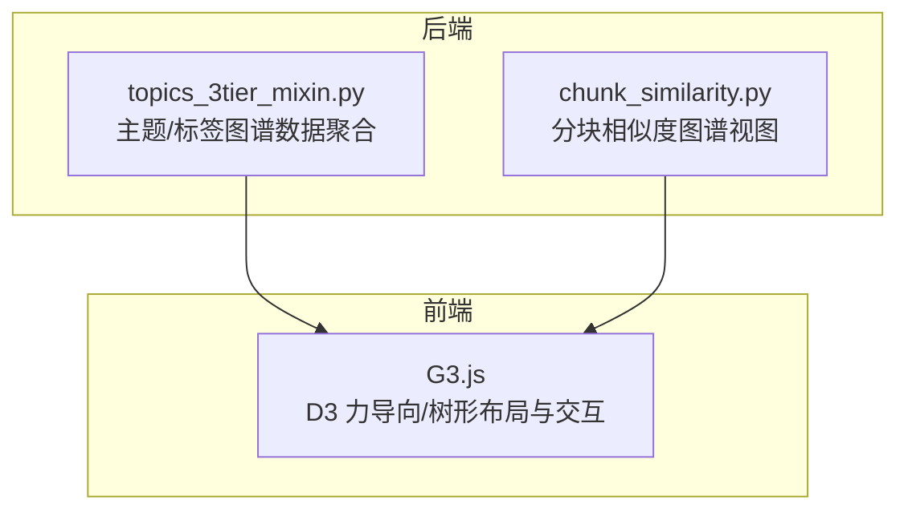
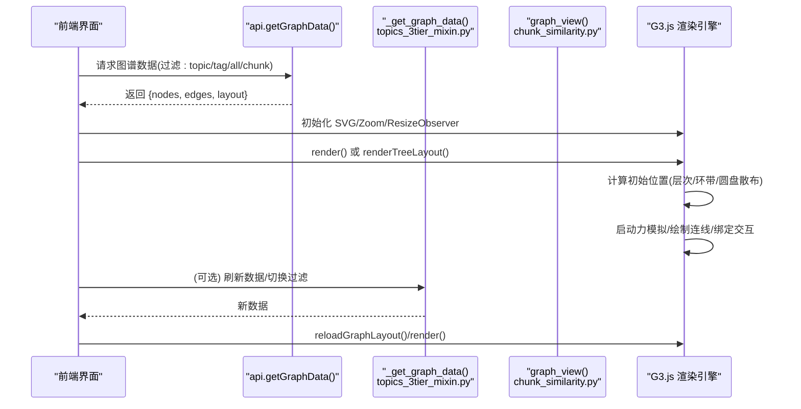
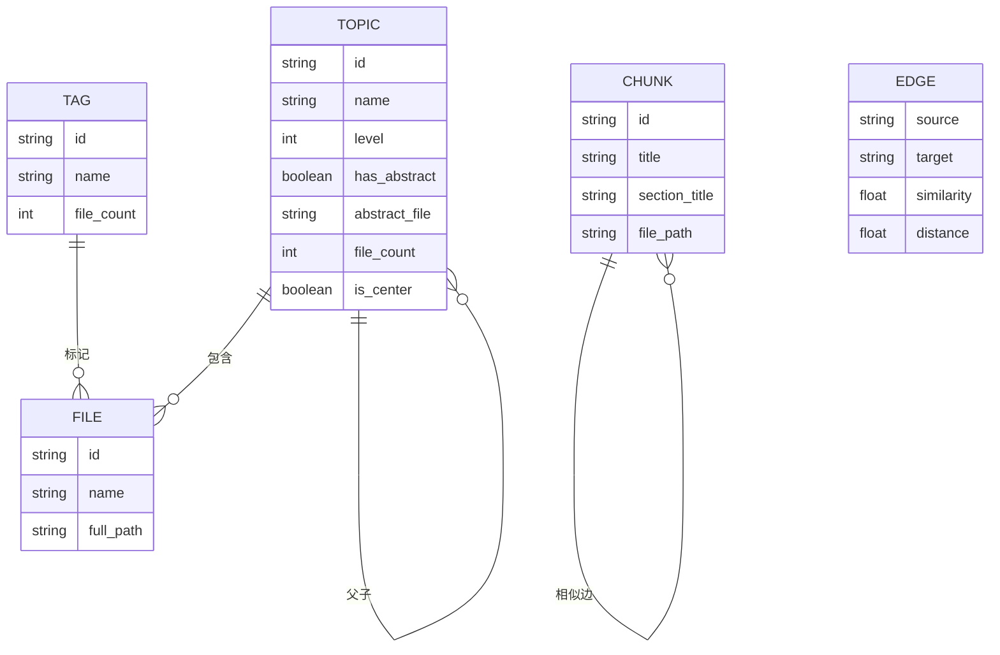
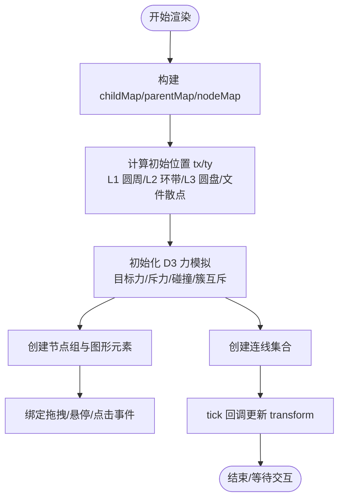
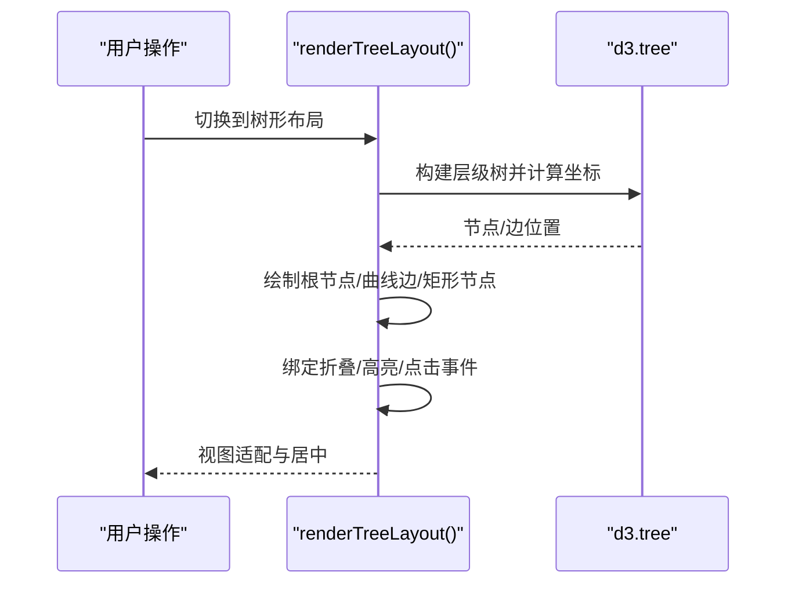
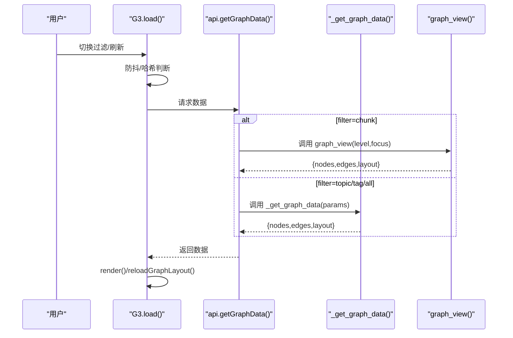
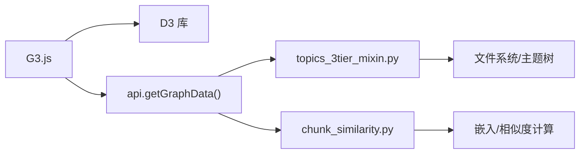

# 知识图谱可视化

<cite>
**本文引用的文件**   
- [G3.js](file://webui/js/G3.js)
- [topics_3tier_mixin.py](file://python/sidecar/mixins/topics_3tier_mixin.py)
- [chunk_similarity.py](file://python/sidecar/chunk_similarity.py)
</cite>

## 目录
1. [简介](#简介)
2. [项目结构](#项目结构)
3. [核心组件](#核心组件)
4. [架构总览](#架构总览)
5. [详细组件分析](#详细组件分析)
6. [依赖关系分析](#依赖关系分析)
7. [性能考虑](#性能考虑)
8. [故障排查指南](#故障排查指南)
9. [结论](#结论)
10. [附录](#附录)

## 简介
本技术文档面向“知识图谱可视化系统”，聚焦力导向图渲染算法、数据模型（节点：主题/文件；边：链接关系）、实时更新机制、用户交互（拖拽、缩放、搜索与过滤）、性能优化策略，以及导出与分享能力。同时结合系统在“知识发现与整理”中的应用场景进行说明。

## 项目结构
本项目将图谱的“数据生成/聚合”与“前端可视化渲染”解耦：
- 后端侧提供图谱数据接口，支持按主题/标签/分块相似度视图输出节点与边。
- 前端侧基于 D3 实现两种布局模式：力导向（星座）与树形（思维导图），并提供丰富的交互与配置。

图表来源
- [topics_3tier_mixin.py:256-286](file://python/sidecar/mixins/topics_3tier_mixin.py#L256-L286)
- [chunk_similarity.py:234-272](file://python/sidecar/chunk_similarity.py#L234-L272)
- [G3.js:962-1013](file://webui/js/G3.js#L962-L1013)

章节来源
- [topics_3tier_mixin.py:256-286](file://python/sidecar/mixins/topics_3tier_mixin.py#L256-L286)
- [chunk_similarity.py:234-272](file://python/sidecar/chunk_similarity.py#L234-L272)
- [G3.js:962-1013](file://webui/js/G3.js#L962-L1013)

## 核心组件
- 图谱数据提供者
  - 主题/标签视图：从文件系统与元数据构建节点与边，支持 filter=topic/tag/all。
  - 分块相似度视图：基于内容向量相似度聚合为 chunk/note/topic 层级视图。
- 前端渲染器
  - 力导向布局（星座）：层次化初始位置 + D3 力模拟 + 碰撞/斥力/目标定位。
  - 树形布局（思维导图）：d3.tree 左右分支平衡布局，支持折叠/展开。
- 交互与控制
  - 拖拽、缩放、双击打开预览、点击聚焦、布局参数调节、统计与图例更新。

章节来源
- [topics_3tier_mixin.py:155-286](file://python/sidecar/mixins/topics_3tier_mixin.py#L155-L286)
- [chunk_similarity.py:234-272](file://python/sidecar/chunk_similarity.py#L234-L272)
- [G3.js:1102-1261](file://webui/js/G3.js#L1102-L1261)

## 架构总览
下图展示从数据到可视化的端到端流程，包括加载、布局计算、渲染与交互。

图表来源
- [G3.js:962-1013](file://webui/js/G3.js#L962-L1013)
- [G3.js:1102-1261](file://webui/js/G3.js#L1102-L1261)
- [topics_3tier_mixin.py:256-286](file://python/sidecar/mixins/topics_3tier_mixin.py#L256-L286)
- [chunk_similarity.py:234-272](file://python/sidecar/chunk_similarity.py#L234-L272)

## 详细组件分析

### 数据模型与数据结构
- 节点类型
  - topic：主题节点，包含 level、has_abstract、abstract_file、file_count、is_center 等属性。
  - file：文件节点，包含 full_path、name 等属性。
  - tag：标签节点，包含 file_count 等属性。
  - chunk：分块节点（在 chunk 视图中出现），包含 section_title/title、file_path 等。
- 边类型
  - 主题-子主题/文件：父子层级关系。
  - 标签-文件：标签关联关系。
  - 相似度边（chunk 视图）：source/target 为 chunk id，附带 similarity/distance。

图表来源
- [topics_3tier_mixin.py:155-196](file://python/sidecar/mixins/topics_3tier_mixin.py#L155-L196)
- [topics_3tier_mixin.py:240-255](file://python/sidecar/mixins/topics_3tier_mixin.py#L240-L255)
- [chunk_similarity.py:234-272](file://python/sidecar/chunk_similarity.py#L234-L272)

章节来源
- [topics_3tier_mixin.py:155-196](file://python/sidecar/mixins/topics_3tier_mixin.py#L155-L196)
- [topics_3tier_mixin.py:240-255](file://python/sidecar/mixins/topics_3tier_mixin.py#L240-L255)
- [chunk_similarity.py:234-272](file://python/sidecar/chunk_similarity.py#L234-L272)

### 力导向图渲染算法（星座布局）
- 初始布局
  - L1 主题围绕中心均匀分布，L2/L3 主题在环形区域内按黄金角散布，文件在圆盘内按平方根半径散布。
  - 通过 _applyTopicHierarchyLayout 与 _scatterTopicsInAnnulus/_scatterInDisk 完成层次化初始坐标 tx/ty。
- 力模拟
  - 使用 d3.forceSimulation 组合以下力：
    - forceX/forceY：向初始位置 tx/ty 的目标定位力。
    - forceManyBody：多体斥力，按节点类型设置不同强度。
    - forceCollide：碰撞检测，避免节点重叠。
    - clusterRepel：一级主题簇间近距离互斥，防止整图被撑开。
  - 通过 alpha/alphaDecay/velocityDecay 控制收敛过程。
- 连线绘制
  - 根据 childMap/parentMap 构建父子边集合，渲染时以路径连接节点。
- 交互效果
  - 拖拽：支持整簇拖拽（同属一个 L1 或父主题），拖拽中保持相对位移并重启模拟。
  - 悬停放大、双击打开摘要、点击聚焦并缩放至节点。
  - 缩放平移：d3.zoom 控制整体视图。

图表来源
- [G3.js:1175-1261](file://webui/js/G3.js#L1175-L1261)
- [G3.js:434-453](file://webui/js/G3.js#L434-L453)
- [G3.js:530-583](file://webui/js/G3.js#L530-L583)
- [G3.js:612-694](file://webui/js/G3.js#L612-L694)

章节来源
- [G3.js:530-583](file://webui/js/G3.js#L530-L583)
- [G3.js:434-453](file://webui/js/G3.js#L434-L453)
- [G3.js:612-694](file://webui/js/G3.js#L612-L694)
- [G3.js:1175-1261](file://webui/js/G3.js#L1175-L1261)

### 树形布局（思维导图）
- 使用 d3.tree 对左右两侧分支进行分层布局，自动平衡权重。
- 支持节点折叠/展开，默认对二级及以上主题与标签节点初始折叠。
- 鼠标悬停高亮路径，双击切换折叠状态，点击打开预览。

图表来源
- [G3.js:1272-1537](file://webui/js/G3.js#L1272-L1537)

章节来源
- [G3.js:1272-1537](file://webui/js/G3.js#L1272-L1537)

### 图谱数据获取与实时更新
- 数据加载
  - 前端通过 api.getGraphData(filter) 拉取数据，内部做防抖与哈希去重，避免重复渲染。
- 过滤与视图切换
  - filter 支持 topic/tag/all；当选择 chunk 时，后端调用 graph_view 返回分块相似度视图。
- 实时性
  - 同一过滤条件下，短时间内的多次加载会合并触发；布局参数修改后自动重新渲染。

图表来源
- [G3.js:962-1013](file://webui/js/G3.js#L962-L1013)
- [topics_3tier_mixin.py:256-286](file://python/sidecar/mixins/topics_3tier_mixin.py#L256-L286)
- [chunk_similarity.py:234-272](file://python/sidecar/chunk_similarity.py#L234-L272)

章节来源
- [G3.js:962-1013](file://webui/js/G3.js#L962-L1013)
- [topics_3tier_mixin.py:256-286](file://python/sidecar/mixins/topics_3tier_mixin.py#L256-L286)
- [chunk_similarity.py:234-272](file://python/sidecar/chunk_similarity.py#L234-L272)

### 用户交互功能
- 拖拽
  - 支持整簇拖拽（同 L1 或父主题下所有后代），拖拽期间固定节点并重启模拟。
- 缩放与平移
  - 滚轮缩放、拖拽平移，双击禁用默认缩放行为以避免误触。
- 搜索与过滤
  - 前端维护当前 filter 状态，切换过滤按钮即时更新图例与统计。
- 节点操作
  - 单击文件/主题打开预览；双击主题（若存在摘要）打开综述；悬停放大节点。

章节来源
- [G3.js:612-694](file://webui/js/G3.js#L612-L694)
- [G3.js:1102-1148](file://webui/js/G3.js#L1102-L1148)
- [G3.js:1221-1250](file://webui/js/G3.js#L1221-L1250)
- [G3.js:1015-1037](file://webui/js/G3.js#L1015-L1037)

### 布局参数与可配置项
- 布局参数涵盖 L1 全局间距、L2/L3 环带与圆盘半径公式、碰撞迭代次数、斥力强度、目标定位强度、视图适配与回放动画等。
- 提供滑块表单，支持实时调整与持久化存储，修改后自动重新渲染。

章节来源
- [G3.js:25-124](file://webui/js/G3.js#L25-L124)
- [G3.js:720-800](file://webui/js/G3.js#L720-L800)
- [G3.js:857-870](file://webui/js/G3.js#L857-L870)

## 依赖关系分析
- 模块耦合
  - 前端 G3.js 依赖 D3 库（外部依赖）与 api 模块（内部约定）。
  - 后端 topics_3tier_mixin.py 依赖文件系统扫描与主题管理工具。
  - 后端 chunk_similarity.py 依赖嵌入编码与相似度计算（外部依赖）。
- 关键依赖链
  - 数据层：topics_3tier_mixin.py → 文件系统/WIKI.md → 节点/边
  - 数据层：chunk_similarity.py → 文本分块/向量编码 → 相似度边
  - 表现层：G3.js → D3 力模拟/树布局 → 渲染与交互

图表来源
- [topics_3tier_mixin.py:256-286](file://python/sidecar/mixins/topics_3tier_mixin.py#L256-L286)
- [chunk_similarity.py:234-272](file://python/sidecar/chunk_similarity.py#L234-L272)
- [G3.js:962-1013](file://webui/js/G3.js#L962-L1013)

章节来源
- [topics_3tier_mixin.py:256-286](file://python/sidecar/mixins/topics_3tier_mixin.py#L256-L286)
- [chunk_similarity.py:234-272](file://python/sidecar/chunk_similarity.py#L234-L272)
- [G3.js:962-1013](file://webui/js/G3.js#L962-L1013)

## 性能考虑
- 数据层
  - 增量更新：仅对变更的分块重新编码，复用已有向量，减少计算开销。
  - 相似度聚合：按 top_k 与阈值筛选边，限制边数量，降低前端渲染压力。
- 前端渲染
  - 防抖与哈希去重：避免短时间内重复加载与渲染。
  - 布局参数可调：通过减小碰撞迭代、调整斥力与目标强度提升收敛速度。
  - 视图自适应：ResizeObserver 监听容器变化，按需 re-fit，避免全量重建。
- 大数据量建议
  - 优先使用聚合视图（note/topic 级别）而非 chunk 粒度。
  - 适当增大 l1PackRatio 与 annulusMinSpan，减少节点拥挤。
  - 关闭不必要的文件名显示，降低 DOM/SVG 节点数。

章节来源
- [chunk_similarity.py:151-222](file://python/sidecar/chunk_similarity.py#L151-L222)
- [G3.js:957-1013](file://webui/js/G3.js#L957-L1013)
- [G3.js:891-905](file://webui/js/G3.js#L891-L905)

## 故障排查指南
- 常见问题
  - 图谱为空：检查工作区是否配置、是否存在笔记文件或主题文件夹。
  - 数据格式异常：确认后端返回 nodes/edges 数组结构完整。
  - 布局不生效：确认布局参数范围合法，必要时重置布局配置。
- 定位方法
  - 查看控制台错误日志与堆栈信息。
  - 切换 filter 与布局模式，观察是否复现。
  - 使用“重置布局配置”恢复默认参数。

章节来源
- [G3.js:994-1013](file://webui/js/G3.js#L994-L1013)
- [G3.js:865-870](file://webui/js/G3.js#L865-L870)

## 结论
本系统在后端提供灵活的数据聚合能力（主题/标签/分块相似度），在前端以 D3 实现高性能的力导向与树形布局，并通过丰富的交互与可配置参数满足复杂场景下的知识探索需求。通过增量计算、边裁剪与前端防抖等手段，系统在大数据量下仍保持良好体验。

## 附录

### 导出与分享能力
- 图片导出
  - 可通过浏览器截图或 Canvas/SVG 导出为 PNG/SVG 静态图片。
- 交互式 HTML 输出
  - 可将当前图谱快照（节点/边/布局参数）序列化为 JSON，随 HTML 一并打包，便于离线分享与二次开发。
- 注意
  - 导出前建议先执行“适合视图”以确保画面完整。
  - 对于超大图谱，建议先聚合到 note/topic 级别再导出。

[本节为通用指导，不涉及具体源码文件]

### 应用场景：知识发现与整理
- 知识发现
  - 通过分块相似度视图快速识别重复或高度相关的片段，辅助合并与去重。
  - 利用标签网络发现跨主题的共性概念，形成新的分类或综述。
- 知识整理
  - 借助主题层级与文件关联，梳理知识脉络，完善综述与索引。
  - 使用思维导图模式进行结构化表达与汇报展示。

[本节为通用指导，不涉及具体源码文件]