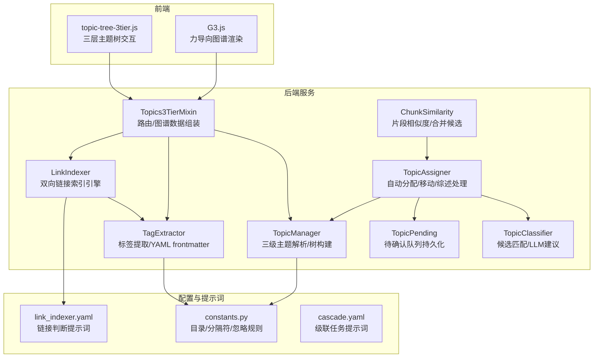
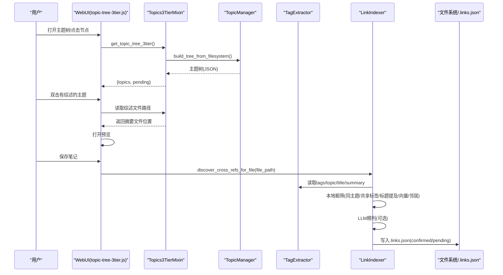
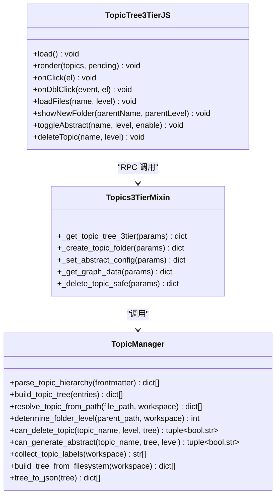
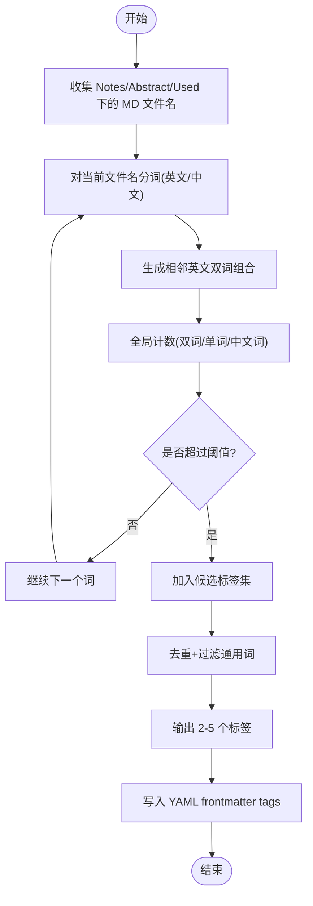
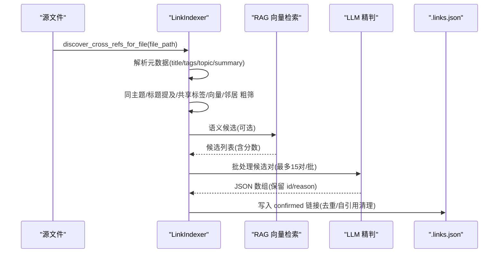
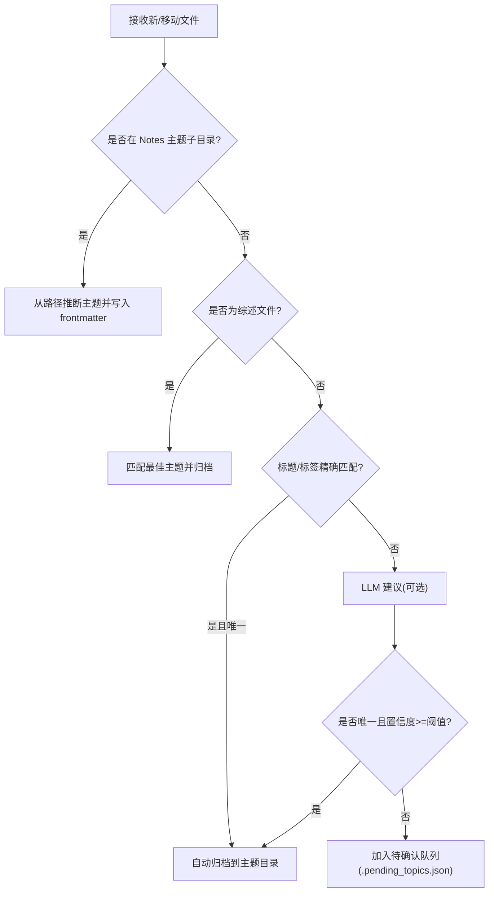
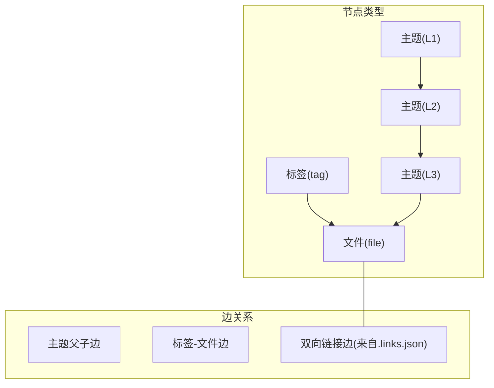
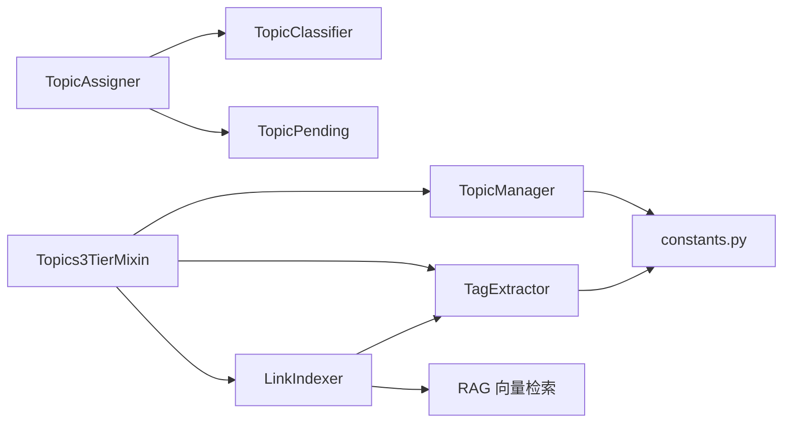

# 知识组织系统

<cite>
**本文引用的文件**   
- [utils/topic_manager.py](file://utils/topic_manager.py)
- [python/sidecar/mixins/topics_3tier_mixin.py](file://python/sidecar/mixins/topics_3tier_mixin.py)
- [webui/js/topic-tree-3tier.js](file://webui/js/topic-tree-3tier.js)
- [utils/tag_extractor.py](file://utils/tag_extractor.py)
- [utils/text_utils.py](file://utils/text_utils.py)
- [utils/link_indexer.py](file://utils/link_indexer.py)
- [prompts/link_indexer.yaml](file://prompts/link_indexer.yaml)
- [prompts/cascade.yaml](file://prompts/cascade.yaml)
- [utils/topic_assigner.py](file://utils/topic_assigner.py)
- [utils/topic_classifier.py](file://utils/topic_classifier.py)
- [utils/topic_pending.py](file://utils/topic_pending.py)
- [config/constants.py](file://config/constants.py)
- [python/sidecar/chunk_similarity.py](file://python/sidecar/chunk_similarity.py)
- [webui/js/G3.js](file://webui/js/G3.js)
</cite>

## 目录
1. [简介](#简介)
2. [项目结构](#项目结构)
3. [核心组件](#核心组件)
4. [架构总览](#架构总览)
5. [详细组件分析](#详细组件分析)
6. [依赖关系分析](#依赖关系分析)
7. [性能考量](#性能考量)
8. [故障排查指南](#故障排查指南)
9. [结论](#结论)
10. [附录：使用示例](#附录使用示例)

## 简介
本技术文档面向“知识组织系统”，围绕以下目标展开：
- 三级主题体系（L1 > L2 > L3）的设计原理与实现机制，包括自动分类算法与手动调整能力。
- 标签提取系统：基于文件名分词、TF-IDF 思想与阈值策略，生成 2–5 个高区分度标签。
- 双向链接系统：本地粗筛 + AI 精判的关联发现机制，以及待确认/已确认状态管理。
- 知识图谱构建与可视化：力导向图渲染与布局参数调优。
- 主题建议、合并重组、冲突检测的实际使用示例。

## 项目结构
系统采用前后端分离与模块化设计：
- 后端 Python 模块负责主题解析、标签提取、链接发现、图谱数据聚合等。
- 前端 WebUI 提供三层主题树交互、图谱可视化与用户操作入口。
- 配置与常量集中管理，提示词模板用于引导大模型行为。

图表来源
- [python/sidecar/mixins/topics_3tier_mixin.py:50-86](file://python/sidecar/mixins/topics_3tier_mixin.py#L50-L86)
- [utils/topic_manager.py:32-179](file://utils/topic_manager.py#L32-L179)
- [utils/tag_extractor.py:94-174](file://utils/tag_extractor.py#L94-L174)
- [utils/link_indexer.py:430-560](file://utils/link_indexer.py#L430-L560)
- [utils/topic_assigner.py:330-418](file://utils/topic_assigner.py#L330-L418)
- [utils/topic_classifier.py:72-159](file://utils/topic_classifier.py#L72-L159)
- [utils/topic_pending.py:24-44](file://utils/topic_pending.py#L24-L44)
- [config/constants.py:26-33](file://config/constants.py#L26-L33)
- [prompts/link_indexer.yaml](file://prompts/link_indexer.yaml)
- [prompts/cascade.yaml](file://prompts/cascade.yaml)

章节来源
- [python/sidecar/mixins/topics_3tier_mixin.py:50-86](file://python/sidecar/mixins/topics_3tier_mixin.py#L50-L86)
- [utils/topic_manager.py:32-179](file://utils/topic_manager.py#L32-L179)
- [utils/tag_extractor.py:94-174](file://utils/tag_extractor.py#L94-L174)
- [utils/link_indexer.py:430-560](file://utils/link_indexer.py#L430-L560)
- [utils/topic_assigner.py:330-418](file://utils/topic_assigner.py#L330-L418)
- [utils/topic_classifier.py:72-159](file://utils/topic_classifier.py#L72-L159)
- [utils/topic_pending.py:24-44](file://utils/topic_pending.py#L24-L44)
- [config/constants.py:26-33](file://config/constants.py#L26-L33)

## 核心组件
- 三级主题管理器：解析 YAML frontmatter 中的 topic 层级，构建嵌套树，支持从文件系统扫描与综述开关控制。
- 标签提取器：基于文件名分词与全局出现频率阈值，生成少量高区分度标签并写入 YAML frontmatter。
- 双向链接索引引擎：两阶段发现（本地粗筛 + AI 精判），维护 .links.json 中的有向链接与状态。
- 自动分配与待确认队列：根据文件夹路径、标题/标签匹配与大模型建议，自动归档或进入待确认列表。
- 片段相似度与合并候选：对笔记进行分块嵌入与相似度计算，输出可解释的合并候选组。
- 图谱数据与可视化：聚合主题、标签、文件节点与边，前端以力导向图展示并可调节布局参数。

章节来源
- [utils/topic_manager.py:32-179](file://utils/topic_manager.py#L32-L179)
- [utils/tag_extractor.py:94-174](file://utils/tag_extractor.py#L94-L174)
- [utils/link_indexer.py:430-560](file://utils/link_indexer.py#L430-L560)
- [utils/topic_assigner.py:330-418](file://utils/topic_assigner.py#L330-L418)
- [python/sidecar/chunk_similarity.py:151-222](file://python/sidecar/chunk_similarity.py#L151-L222)
- [python/sidecar/mixins/topics_3tier_mixin.py:256-286](file://python/sidecar/mixins/topics_3tier_mixin.py#L256-L286)

## 架构总览
系统通过“主题—标签—链接—图谱”四层协同工作：
- 主题层：以 Notes 目录为根，按 L1/L2/L3 组织；YAML frontmatter 中 topic 字段描述归属。
- 标签层：基于文件名分词与全局统计，产出 2–5 个标签，写入 frontmatter tags。
- 链接层：同主题/共享标签/标题提及/向量检索/邻居扩展 → 候选集 → LLM 精判 → 写入 .links.json。
- 图谱层：将主题、标签、文件作为节点，主题父子与标签-文件、链接关系作为边，前端力导向渲染。

图表来源
- [webui/js/topic-tree-3tier.js:12-64](file://webui/js/topic-tree-3tier.js#L12-L64)
- [python/sidecar/mixins/topics_3tier_mixin.py:50-86](file://python/sidecar/mixins/topics_3tier_mixin.py#L50-L86)
- [utils/topic_manager.py:378-426](file://utils/topic_manager.py#L378-L426)
- [utils/link_indexer.py:430-560](file://utils/link_indexer.py#L430-L560)
- [utils/tag_extractor.py:94-174](file://utils/tag_extractor.py#L94-L174)

## 详细组件分析

### 三级主题体系（L1 > L2 > L3）
- 数据结构与解析
  - 支持从 YAML frontmatter 的 topic 字段解析出 L1/L2/L3 条目，并构建嵌套树。
  - 同时支持从 Notes 目录结构直接扫描构建主题树，兼容实际文件夹层级。
- 综述控制
  - 一级与二级不可同时设置综述；三级不支持综述。
  - 可在二级主题开启/关闭综述，并在树中标记 has_abstract 与 abstract_file。
- 删除保护
  - 一级删除需确保其下无二级；二级删除会级联警告但允许；三级可直接删除。
- 前端交互
  - 三层主题树渲染，单击选中并加载文件列表，双击打开综述预览，支持新建子文件夹与删除。

图表来源
- [utils/topic_manager.py:32-179](file://utils/topic_manager.py#L32-L179)
- [utils/topic_manager.py:251-346](file://utils/topic_manager.py#L251-L346)
- [utils/topic_manager.py:378-426](file://utils/topic_manager.py#L378-L426)
- [python/sidecar/mixins/topics_3tier_mixin.py:50-154](file://python/sidecar/mixins/topics_3tier_mixin.py#L50-L154)
- [webui/js/topic-tree-3tier.js:12-299](file://webui/js/topic-tree-3tier.js#L12-L299)

章节来源
- [utils/topic_manager.py:32-179](file://utils/topic_manager.py#L32-L179)
- [utils/topic_manager.py:251-346](file://utils/topic_manager.py#L251-L346)
- [utils/topic_manager.py:378-426](file://utils/topic_manager.py#L378-L426)
- [python/sidecar/mixins/topics_3tier_mixin.py:50-154](file://python/sidecar/mixins/topics_3tier_mixin.py#L50-L154)
- [webui/js/topic-tree-3tier.js:12-299](file://webui/js/topic-tree-3tier.js#L12-L299)

### 标签提取系统（jieba 分词 + TF-IDF 思想）
- 算法要点
  - 仅基于文件名分词，不读取正文内容，提升性能。
  - 英文优先组合相邻双词，中文排除停用词，统一过滤通用词。
  - 在全局工作区范围内统计出现次数，超过阈值才纳入标签集合。
  - 最终去重并按优先级输出，通常产出 2–5 个高区分度标签。
- 持久化
  - 将 tags 写入 Markdown 文件的 YAML frontmatter，便于后续检索与图谱构建。

图表来源
- [utils/tag_extractor.py:94-174](file://utils/tag_extractor.py#L94-L174)
- [utils/tag_extractor.py:355-408](file://utils/tag_extractor.py#L355-L408)
- [utils/tag_extractor.py:458-526](file://utils/tag_extractor.py#L458-L526)
- [utils/text_utils.py](file://utils/text_utils.py)

章节来源
- [utils/tag_extractor.py:94-174](file://utils/tag_extractor.py#L94-L174)
- [utils/tag_extractor.py:355-408](file://utils/tag_extractor.py#L355-L408)
- [utils/tag_extractor.py:458-526](file://utils/tag_extractor.py#L458-L526)
- [utils/text_utils.py](file://utils/text_utils.py)

### 双向链接系统（本地粗筛 + AI 精判）
- 两阶段发现
  - 本地粗筛：同主题、共享标签、标题在正文/摘要中互相提及、向量检索候选、已确认链接的一跳邻居。
  - AI 精判：批量候选对提交给 LLM，依据提示词选择相关对，返回 JSON 数组。
- 状态管理
  - 链接记录包含 from/to/reason/status，默认自动确认；README 笔记不参与链接图。
  - 清理无效链接与自引用，保证索引整洁。
- 存储
  - 工作区根目录 .links.json 持久化，原子写入避免损坏。

图表来源
- [utils/link_indexer.py:430-560](file://utils/link_indexer.py#L430-L560)
- [utils/link_indexer.py:378-428](file://utils/link_indexer.py#L378-L428)
- [utils/link_indexer.py:136-168](file://utils/link_indexer.py#L136-L168)
- [prompts/link_indexer.yaml](file://prompts/link_indexer.yaml)

章节来源
- [utils/link_indexer.py:430-560](file://utils/link_indexer.py#L430-L560)
- [utils/link_indexer.py:378-428](file://utils/link_indexer.py#L378-L428)
- [utils/link_indexer.py:136-168](file://utils/link_indexer.py#L136-L168)
- [prompts/link_indexer.yaml](file://prompts/link_indexer.yaml)

### 自动分类与待确认队列
- 自动分类流程
  - 若文件位于 Notes 子目录且符合 L1/L2/L3 结构，则直接从路径推断主题并同步到 frontmatter。
  - 否则尝试标题/标签匹配与 LLM 建议；若唯一匹配且置信度高于阈值，自动归档至对应主题目录。
  - 否则进入待确认队列，供用户人工决策。
- 待确认队列
  - 持久化于 .pending_topics.json，支持线程安全读写与原子替换。
  - 清理无效/非收件箱/已处理的待办项，保持队列精简。

图表来源
- [utils/topic_assigner.py:330-418](file://utils/topic_assigner.py#L330-L418)
- [utils/topic_assigner.py:267-316](file://utils/topic_assigner.py#L267-L316)
- [utils/topic_assigner.py:181-199](file://utils/topic_assigner.py#L181-L199)
- [utils/topic_pending.py:24-44](file://utils/topic_pending.py#L24-L44)
- [utils/topic_classifier.py:72-159](file://utils/topic_classifier.py#L72-L159)

章节来源
- [utils/topic_assigner.py:330-418](file://utils/topic_assigner.py#L330-L418)
- [utils/topic_assigner.py:267-316](file://utils/topic_assigner.py#L267-L316)
- [utils/topic_assigner.py:181-199](file://utils/topic_assigner.py#L181-L199)
- [utils/topic_pending.py:24-44](file://utils/topic_pending.py#L24-L44)
- [utils/topic_classifier.py:72-159](file://utils/topic_classifier.py#L72-L159)

### 知识图谱构建与可视化（力导向图）
- 数据聚合
  - 主题节点：L1/L2/L3 层级，附带 file_count、has_abstract、abstract_file。
  - 标签节点：tag -> file 边，统计每个标签覆盖的文件数。
  - 文件节点：归属于主题或标签，支持 full_path 定位。
- 视图模式
  - filter=topic/tag/all 三种模式；chunk 模式基于片段相似度聚合。
- 前端渲染
  - 使用 D3 力导向布局，提供大量可调参数（电荷、斥力、碰撞迭代、半径公式等）。
  - 支持保存/恢复布局配置，回放动画揭示节点。

图表来源
- [python/sidecar/mixins/topics_3tier_mixin.py:155-286](file://python/sidecar/mixins/topics_3tier_mixin.py#L155-L286)
- [webui/js/G3.js:1-200](file://webui/js/G3.js#L1-L200)

章节来源
- [python/sidecar/mixins/topics_3tier_mixin.py:155-286](file://python/sidecar/mixins/topics_3tier_mixin.py#L155-L286)
- [webui/js/G3.js:1-200](file://webui/js/G3.js#L1-L200)

## 依赖关系分析
- 模块耦合
  - Topics3TierMixin 聚合 TopicManager、TagExtractor、LinkIndexer 的能力，对外暴露 RPC 接口。
  - TopicAssigner 依赖 TopicClassifier 与 TopicPending，完成自动归档与待确认管理。
  - LinkIndexer 依赖 TagExtractor 与 RAG 向量检索，结合提示词驱动 LLM 精判。
- 外部依赖
  - 大模型 API：用于主题建议、链接精判、交叉引用筛选。
  - 向量检索：RAG embedder/index 提供语义候选。
  - 文件系统：Notes/Abstract/Used/wiki 等目录结构与 .links.json/.pending_topics.json 持久化。

图表来源
- [python/sidecar/mixins/topics_3tier_mixin.py:50-86](file://python/sidecar/mixins/topics_3tier_mixin.py#L50-L86)
- [utils/topic_assigner.py:330-418](file://utils/topic_assigner.py#L330-L418)
- [utils/link_indexer.py:430-560](file://utils/link_indexer.py#L430-L560)
- [config/constants.py:26-33](file://config/constants.py#L26-L33)

章节来源
- [python/sidecar/mixins/topics_3tier_mixin.py:50-86](file://python/sidecar/mixins/topics_3tier_mixin.py#L50-L86)
- [utils/topic_assigner.py:330-418](file://utils/topic_assigner.py#L330-L418)
- [utils/link_indexer.py:430-560](file://utils/link_indexer.py#L430-L560)
- [config/constants.py:26-33](file://config/constants.py#L26-L33)

## 性能考量
- 标签提取仅扫描文件名，避免全文读取，降低 I/O 压力。
- 链接索引使用 mtime 缓存与增量更新，减少全量解析开销。
- 向量检索具备冷却期与降级策略，失败时回退到启发式候选。
- 图谱数据按需聚合，支持 chunk/note/topic 多粒度视图，避免一次性渲染过多节点。

[本节为通用指导，无需特定文件来源]

## 故障排查指南
- 主题树异常
  - 检查 Notes 目录结构与 TOPIC_SEP 分隔符一致性。
  - 确认综述文件命名与路径是否符合预期。
- 标签缺失或过多
  - 检查工作区范围是否包含足够样本，阈值是否合理。
  - 查看 YAML frontmatter 是否被正确写入。
- 链接未生成
  - 确认 .links.json 是否存在且可读，清理 README 与自引用。
  - 检查 LLM 配置与提示词是否正确加载。
- 待确认队列堆积
  - 运行清理逻辑，移除不存在或非收件箱文件。
  - 检查自动分配阈值与 LLM 建议结果。

章节来源
- [utils/link_indexer.py:136-168](file://utils/link_indexer.py#L136-L168)
- [utils/topic_pending.py:53-99](file://utils/topic_pending.py#L53-L99)
- [utils/tag_extractor.py:94-174](file://utils/tag_extractor.py#L94-L174)
- [config/constants.py:26-33](file://config/constants.py#L26-L33)

## 结论
本系统以“主题—标签—链接—图谱”为主线，实现了从自动化到半自动化的知识组织闭环。三级主题体系提供清晰的结构骨架，标签提取增强检索与聚合能力，双向链接借助本地启发式与 LLM 精判提升相关性质量，图谱可视化帮助用户直观理解知识网络。配合待确认队列与合并候选，系统在效率与准确性之间取得良好平衡。

[本节为总结性内容，无需特定文件来源]

## 附录：使用示例

### 主题建议
- 场景：新增笔记后，系统根据标题、标签与内容预览，给出 1–4 个候选主题。
- 步骤：
  - 触发自动分配流程，若无法确定唯一主题，则进入待确认队列。
  - 在前端“待确认”面板中查看建议，人工确认后自动归档。
- 参考实现
  - [utils/topic_assigner.py:267-316](file://utils/topic_assigner.py#L267-L316)
  - [utils/topic_classifier.py:72-159](file://utils/topic_classifier.py#L72-L159)
  - [utils/topic_pending.py:24-44](file://utils/topic_pending.py#L24-L44)

### 合并重组
- 场景：多篇笔记内容高度相似，需要合并以减少冗余。
- 步骤：
  - 运行片段相似度构建，获取候选合并组。
  - 查看候选组的评分与匹配详情，选择合适的一组进行合并。
- 参考实现
  - [python/sidecar/chunk_similarity.py:151-222](file://python/sidecar/chunk_similarity.py#L151-L222)
  - [python/sidecar/chunk_similarity.py:68-148](file://python/sidecar/chunk_similarity.py#L68-L148)

### 冲突检测
- 场景：同一主题下存在重复或相近内容的笔记，或链接指向不一致。
- 步骤：
  - 利用片段相似度与链接索引，识别潜在冲突。
  - 在图谱视图中聚焦相关节点，辅助人工决策。
- 参考实现
  - [python/sidecar/chunk_similarity.py:151-222](file://python/sidecar/chunk_similarity.py#L151-L222)
  - [utils/link_indexer.py:430-560](file://utils/link_indexer.py#L430-L560)