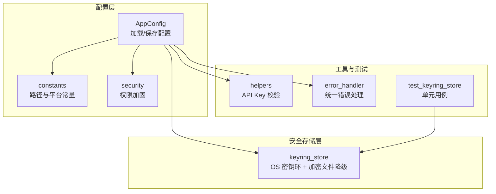
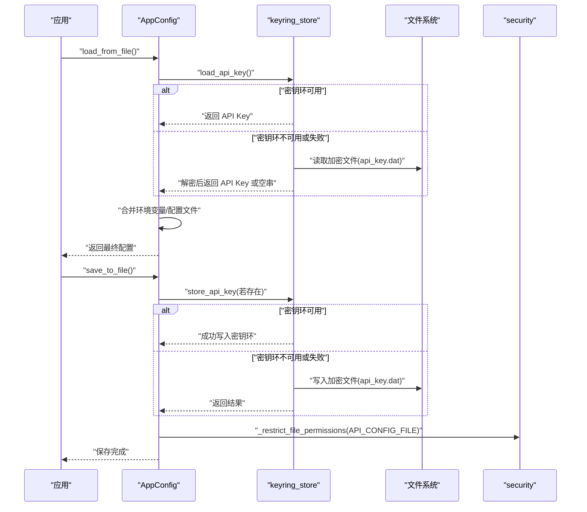
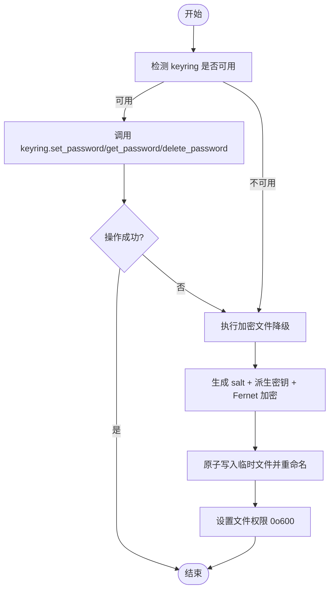
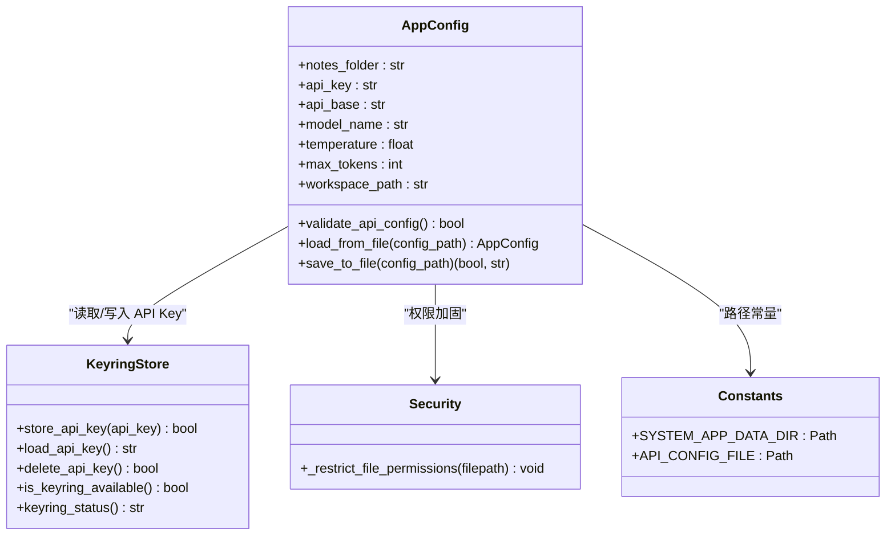
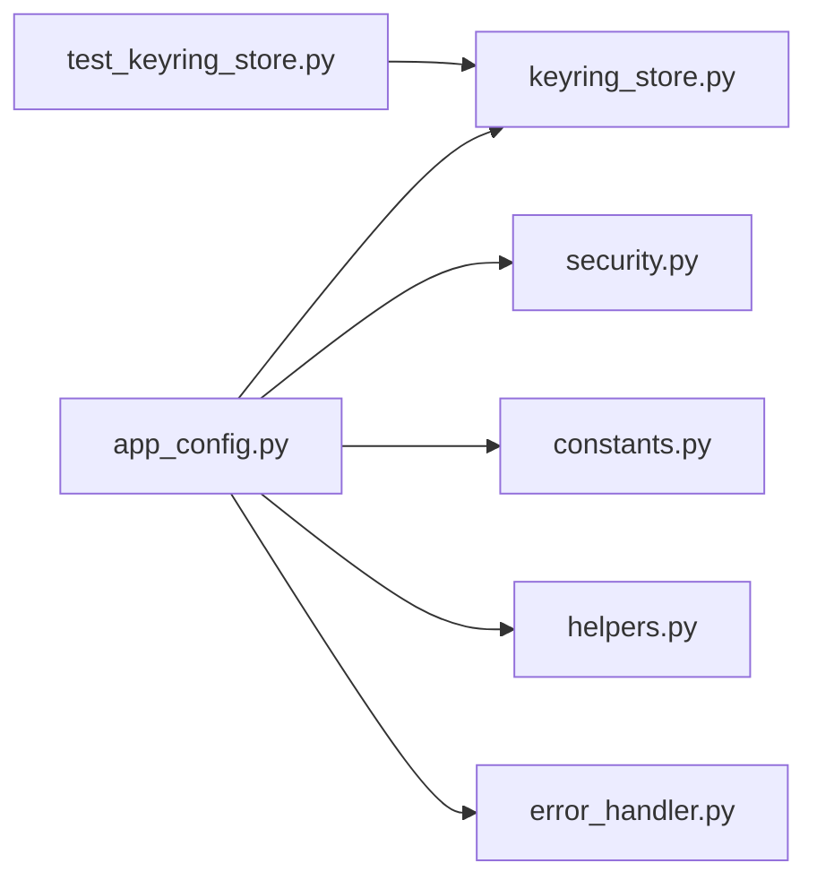

# 安全配置

<cite>
**本文引用的文件**   
- [config/security.py](file://config/security.py)
- [utils/keyring_store.py](file://utils/keyring_store.py)
- [config/app_config.py](file://config/app_config.py)
- [config/constants.py](file://config/constants.py)
- [tests/unit/test_keyring_store.py](file://tests/unit/test_keyring_store.py)
- [utils/helpers.py](file://utils/helpers.py)
- [utils/error_handler.py](file://utils/error_handler.py)
</cite>

## 目录
1. [简介](#简介)
2. [项目结构](#项目结构)
3. [核心组件](#核心组件)
4. [架构总览](#架构总览)
5. [详细组件分析](#详细组件分析)
6. [依赖关系分析](#依赖关系分析)
7. [性能考量](#性能考量)
8. [故障排查指南](#故障排查指南)
9. [结论](#结论)
10. [附录](#附录)

## 简介
本技术文档聚焦 NoteAI 的安全配置系统，重点说明 API Key 的安全存储机制、跨平台密钥环集成与加密文件降级方案、敏感配置文件权限控制策略、运行时安全检查与热更新路径，以及常见安全问题（如配置泄露、注入攻击）的检测与防护。文档同时给出最佳实践建议，包括密钥轮换、最小权限原则与安全审计日志。

## 项目结构
安全相关代码主要分布在以下模块：
- 配置加载与持久化：config/app_config.py
- 操作系统密钥环与加密文件降级：utils/keyring_store.py
- 文件权限加固：config/security.py
- 系统与平台常量（应用数据目录、API 配置路径等）：config/constants.py
- API Key 校验工具：utils/helpers.py
- 统一错误处理与日志：utils/error_handler.py
- 单元测试（覆盖 keyring 可用性、加解密往返）：tests/unit/test_keyring_store.py

图表来源
- [config/app_config.py:213-396](file://config/app_config.py#L213-L396)
- [config/constants.py:9-24](file://config/constants.py#L9-L24)
- [config/security.py:6-12](file://config/security.py#L6-L12)
- [utils/keyring_store.py:166-203](file://utils/keyring_store.py#L166-L203)
- [utils/helpers.py:1-200](file://utils/helpers.py#L1-L200)
- [utils/error_handler.py:24-51](file://utils/error_handler.py#L24-L51)
- [tests/unit/test_keyring_store.py:1-20](file://tests/unit/test_keyring_store.py#L1-L20)

章节来源
- [config/app_config.py:213-396](file://config/app_config.py#L213-L396)
- [config/constants.py:9-24](file://config/constants.py#L9-L24)
- [config/security.py:6-12](file://config/security.py#L6-L12)
- [utils/keyring_store.py:166-203](file://utils/keyring_store.py#L166-L203)
- [utils/helpers.py:1-200](file://utils/helpers.py#L1-L200)
- [utils/error_handler.py:24-51](file://utils/error_handler.py#L24-L51)
- [tests/unit/test_keyring_store.py:1-20](file://tests/unit/test_keyring_store.py#L1-L20)

## 核心组件
- 配置对象 AppConfig：负责从环境变量、主配置文件、API 配置文件及 OS 密钥环合并最终配置；保存时将非敏感字段写入主配置文件，将 API Key 优先写入 OS 密钥环，其余 API 配置写入受限的 API 配置文件。
- 密钥存储 keyring_store：优先使用 OS 密钥环（macOS Keychain、Windows Credential Manager、Linux Secret Service），不可用时回退到基于 Fernet 的加密文件存储，并引入安装级随机密钥以增强安全性。
- 权限加固 security：对敏感配置文件设置仅当前用户可读写权限（0o600）。
- 常量 constants：定义跨平台的应用数据目录、工作区状态文件与 API 配置文件路径。
- 工具 helpers：提供 API Key 格式校验等基础能力。
- 错误处理 error_handler：统一异常记录与降级返回策略。

章节来源
- [config/app_config.py:213-396](file://config/app_config.py#L213-L396)
- [utils/keyring_store.py:166-203](file://utils/keyring_store.py#L166-L203)
- [config/security.py:6-12](file://config/security.py#L6-L12)
- [config/constants.py:9-24](file://config/constants.py#L9-L24)
- [utils/helpers.py:1-200](file://utils/helpers.py#L1-L200)
- [utils/error_handler.py:24-51](file://utils/error_handler.py#L24-L51)

## 架构总览
下图展示了配置加载与保存的关键流程，包括优先级、密钥环优先与加密文件降级、权限加固与日志记录。

图表来源
- [config/app_config.py:213-396](file://config/app_config.py#L213-L396)
- [utils/keyring_store.py:166-203](file://utils/keyring_store.py#L166-L203)
- [config/security.py:6-12](file://config/security.py#L6-L12)

## 详细组件分析

### 组件一：API Key 安全存储与降级
- 存储策略
  - 首选 OS 密钥环：通过 keyring 库访问 macOS Keychain、Windows Credential Manager、Linux Secret Service。
  - 降级方案：当 keyring 不可用或操作失败时，使用 Fernet 对称加密将 API Key 写入加密文件 api_key.dat，并使用安装级随机密钥提升安全性。
- 加密细节
  - 每次加密生成随机 salt，结合机器名、用户名与安装级随机密钥派生 Fernet 密钥。
  - 支持旧格式兼容解密，确保升级平滑。
- 删除策略
  - 同时尝试删除密钥环条目与加密文件，任一失败仍记录警告但不中断整体流程。

图表来源
- [utils/keyring_store.py:166-203](file://utils/keyring_store.py#L166-L203)
- [utils/keyring_store.py:82-103](file://utils/keyring_store.py#L82-L103)
- [utils/keyring_store.py:138-163](file://utils/keyring_store.py#L138-L163)
- [utils/keyring_store.py:253-298](file://utils/keyring_store.py#L253-L298)

章节来源
- [utils/keyring_store.py:166-203](file://utils/keyring_store.py#L166-L203)
- [utils/keyring_store.py:82-103](file://utils/keyring_store.py#L82-L103)
- [utils/keyring_store.py:138-163](file://utils/keyring_store.py#L138-L163)
- [utils/keyring_store.py:253-298](file://utils/keyring_store.py#L253-L298)
- [tests/unit/test_keyring_store.py:1-20](file://tests/unit/test_keyring_store.py#L1-L20)

### 组件二：配置加载与合并优先级
- 加载顺序
  - 环境变量 > API 配置文件 > 主配置文件 > 默认值。
  - API Key 优先从 OS 密钥环加载，若为空则回退到加密文件。
- 保存策略
  - 非敏感字段写入主配置文件。
  - API Key 写入 OS 密钥环；其他 API 配置写入 API 配置文件，并对该文件进行权限加固。
- 线程安全
  - 配置对象内部使用锁保护属性读写快照，避免并发写入导致不一致。

图表来源
- [config/app_config.py:213-396](file://config/app_config.py#L213-L396)
- [utils/keyring_store.py:301-309](file://utils/keyring_store.py#L301-L309)
- [config/security.py:6-12](file://config/security.py#L6-L12)
- [config/constants.py:9-24](file://config/constants.py#L9-L24)

章节来源
- [config/app_config.py:213-396](file://config/app_config.py#L213-L396)
- [config/constants.py:9-24](file://config/constants.py#L9-L24)
- [config/security.py:6-12](file://config/security.py#L6-L12)

### 组件三：文件权限控制与敏感配置隔离
- 权限策略
  - 对 API 配置文件与加密文件均设置为 0o600，仅当前用户可读写。
  - 写入采用“临时文件 + 原子替换”模式，降低部分写入风险。
- 路径隔离
  - 敏感文件位于系统应用数据目录（不同平台自动选择合适位置），避免与用户工作区混放。

章节来源
- [config/security.py:6-12](file://config/security.py#L6-L12)
- [utils/keyring_store.py:138-163](file://utils/keyring_store.py#L138-L163)
- [config/constants.py:9-24](file://config/constants.py#L9-L24)

### 组件四：跨平台安全实现差异
- macOS
  - 密钥环：macOS Keychain
  - 应用数据目录：~/Library/Application Support/NoteAI
- Windows
  - 密钥环：Windows Credential Manager
  - 应用数据目录：%APPDATA%/NoteAI
- Linux
  - 密钥环：Secret Service（通过 keyring 后端）
  - 应用数据目录：~/.config/NoteAI

章节来源
- [config/constants.py:9-24](file://config/constants.py#L9-L24)
- [utils/keyring_store.py:166-203](file://utils/keyring_store.py#L166-L203)

### 组件五：运行时安全检查与热更新
- 运行时检查
  - 配置加载时对 API Key 进行格式校验，不合法则拒绝启用。
  - 上下文长度、模型参数等范围校验，防止越界配置。
- 热更新机制
  - 通过环境变量覆盖配置项，进程启动时按优先级合并，无需重启即可生效。
  - 保存时不会修改运行时的环境变量，保持外部配置源只读语义。

章节来源
- [config/app_config.py:176-194](file://config/app_config.py#L176-L194)
- [config/app_config.py:261-311](file://config/app_config.py#L261-L311)
- [config/app_config.py:313-386](file://config/app_config.py#L313-L386)
- [utils/helpers.py:1-200](file://utils/helpers.py#L1-L200)

### 组件六：通用凭据存储扩展
- 除 API Key 外，还提供通用的 service/account 凭据存储接口，同样遵循“密钥环优先 + 加密文件降级”的策略，便于未来扩展更多敏感配置。

章节来源
- [utils/keyring_store.py:205-242](file://utils/keyring_store.py#L205-L242)
- [utils/keyring_store.py:244-298](file://utils/keyring_store.py#L244-L298)

## 依赖关系分析
- 耦合与内聚
  - AppConfig 与 keyring_store 高内聚于“配置与密钥管理”，通过明确的接口交互，降低耦合面。
  - security 作为独立工具被多处复用，职责单一，内聚良好。
- 外部依赖
  - keyring 库用于跨平台密钥环访问；cryptography 用于 Fernet 加密。
  - 标准库 os、tempfile、hashlib、secrets 等用于路径、加密与原子写入。
- 潜在循环依赖
  - 当前未发现循环导入；关键模块间为单向依赖。

图表来源
- [config/app_config.py:213-396](file://config/app_config.py#L213-L396)
- [utils/keyring_store.py:166-203](file://utils/keyring_store.py#L166-L203)
- [config/security.py:6-12](file://config/security.py#L6-L12)
- [config/constants.py:9-24](file://config/constants.py#L9-L24)
- [utils/helpers.py:1-200](file://utils/helpers.py#L1-L200)
- [utils/error_handler.py:24-51](file://utils/error_handler.py#L24-L51)
- [tests/unit/test_keyring_store.py:1-20](file://tests/unit/test_keyring_store.py#L1-L20)

章节来源
- [config/app_config.py:213-396](file://config/app_config.py#L213-L396)
- [utils/keyring_store.py:166-203](file://utils/keyring_store.py#L166-L203)
- [config/security.py:6-12](file://config/security.py#L6-L12)
- [config/constants.py:9-24](file://config/constants.py#L9-L24)
- [utils/helpers.py:1-200](file://utils/helpers.py#L1-L200)
- [utils/error_handler.py:24-51](file://utils/error_handler.py#L24-L51)
- [tests/unit/test_keyring_store.py:1-20](file://tests/unit/test_keyring_store.py#L1-L20)

## 性能考量
- 密钥环 I/O 开销较小，通常优于磁盘加密文件读写。
- 加密文件路径使用 PBKDF2 派生密钥，迭代次数较高，可能带来轻微 CPU 开销；但仅在密钥环不可用时触发。
- 原子写入与权限设置会增加少量系统调用，但能显著提升可靠性与安全性。

[本节为通用指导，不涉及具体文件分析]

## 故障排查指南
- 常见问题
  - 密钥环不可用：检查 keyring 库安装与后端驱动；查看 keyring_status 输出。
  - 加密文件损坏：若新格式解密失败，系统将尝试旧格式；若仍失败，将回退到 base64 明文（仅用于兼容迁移）。
  - 权限不足：确认当前用户对系统应用数据目录具有写权限；检查 0o600 权限设置是否生效。
- 日志定位
  - 使用统一错误处理工具记录异常上下文与级别，便于快速定位问题。
  - 关注“加载/保存配置失败”、“Keyring 操作失败”等关键字。

章节来源
- [utils/keyring_store.py:301-309](file://utils/keyring_store.py#L301-L309)
- [utils/keyring_store.py:117-163](file://utils/keyring_store.py#L117-L163)
- [utils/error_handler.py:24-51](file://utils/error_handler.py#L24-L51)

## 结论
NoteAI 的安全配置系统在跨平台上实现了“密钥环优先 + 加密文件降级”的高可用策略，并通过严格的文件权限控制与运行时校验保障敏感配置的安全性。建议在部署中遵循最小权限原则、定期轮换 API Key，并结合审计日志持续监控异常行为。

[本节为总结性内容，不涉及具体文件分析]

## 附录

### 安全最佳实践清单
- API Key 轮换
  - 定期更换 API Key，并在变更后立即同步至密钥环或加密文件。
  - 保留历史 Key 的短期兼容窗口，逐步淘汰。
- 权限最小化
  - 限制应用数据目录与敏感文件的访问者仅为当前用户。
  - 在容器或多用户环境中，确保进程以最小必要权限运行。
- 安全审计日志
  - 记录所有配置加载/保存、密钥环操作与权限变更事件。
  - 集中收集日志，设置告警阈值与留存周期。
- 配置泄露防护
  - 禁止在日志中打印完整 API Key；如需脱敏展示，仅显示前后缀。
  - 避免将敏感配置提交至版本控制系统。
- 注入攻击防护
  - 对所有外部输入（环境变量、配置文件）进行严格类型与范围校验。
  - 使用白名单策略限制可接受的配置键集。

[本节为通用指导，不涉及具体文件分析]