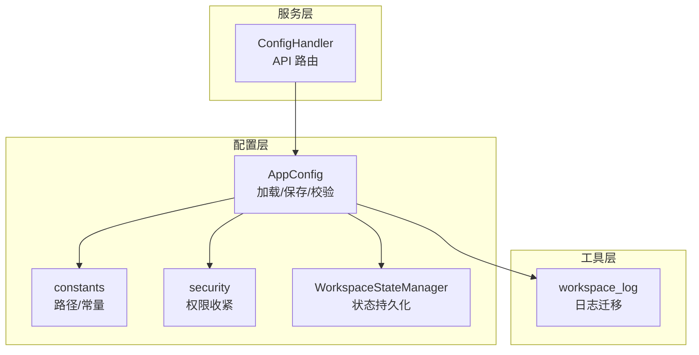
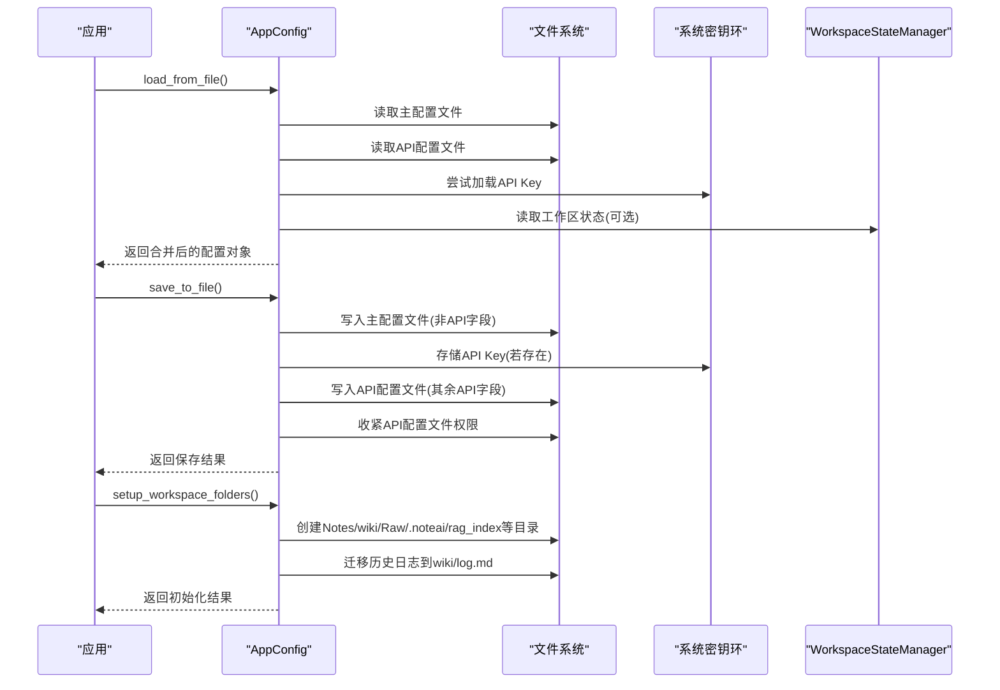
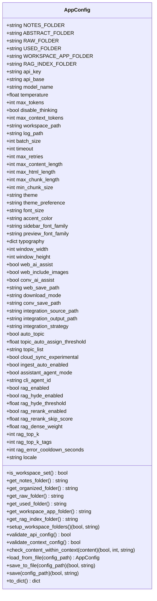
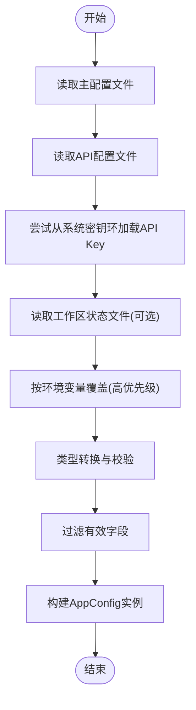
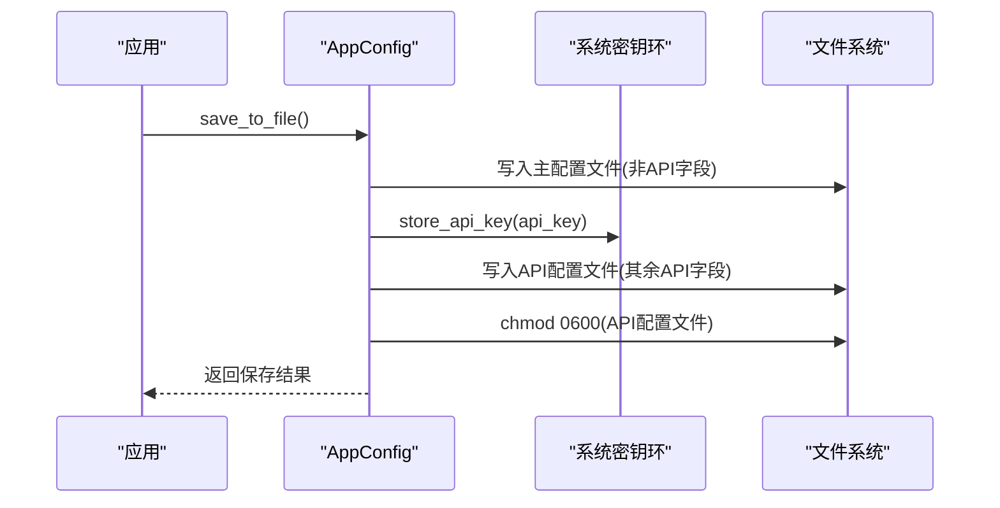
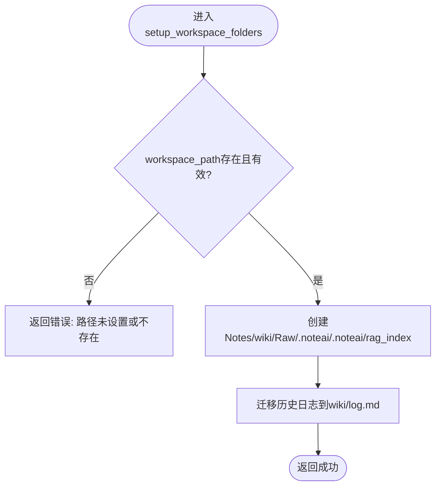
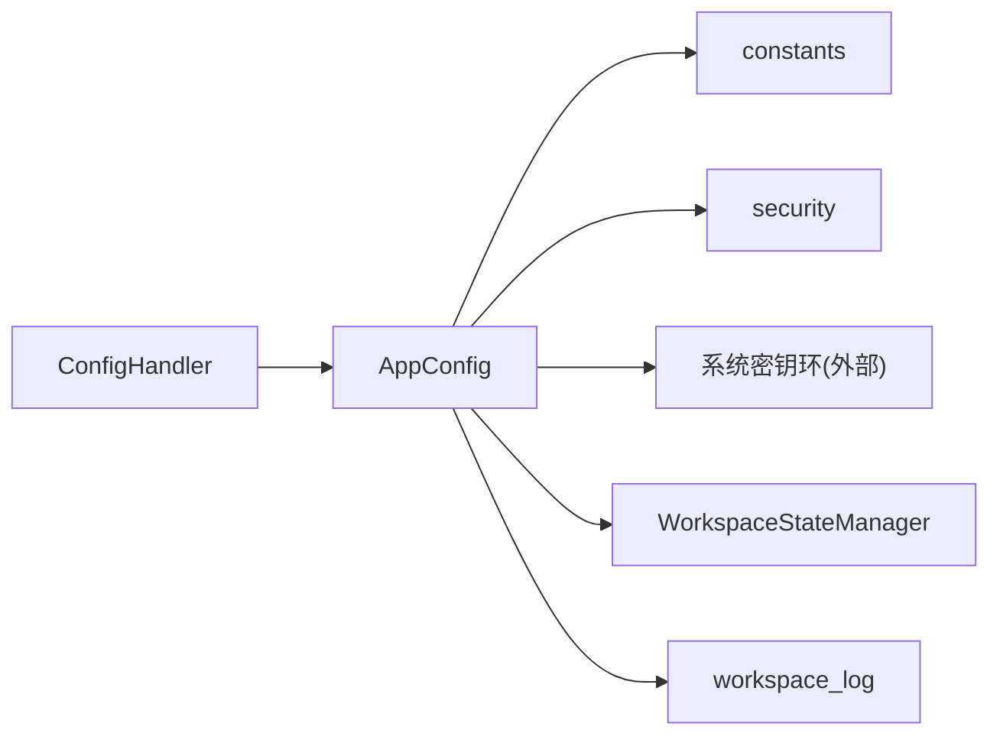

# 应用配置管理

<cite>
**本文引用的文件**
- [config/app_config.py](file://config/app_config.py)
- [config/constants.py](file://config/constants.py)
- [config/security.py](file://config/security.py)
- [config/workspace_state.py](file://config/workspace_state.py)
- [config/settings.py](file://config/settings.py)
- [config/config.json.example](file://config/config.json.example)
- [python/sidecar/handlers/config_handler.py](file://python/sidecar/handlers/config_handler.py)
- [utils/workspace_log.py](file://utils/workspace_log.py)
</cite>

## 目录
1. [简介](#简介)
2. [项目结构](#项目结构)
3. [核心组件](#核心组件)
4. [架构总览](#架构总览)
5. [详细组件分析](#详细组件分析)
6. [依赖关系分析](#依赖关系分析)
7. [性能与并发特性](#性能与并发特性)
8. [故障排除指南](#故障排除指南)
9. [结论](#结论)
10. [附录：JSON 规范与字段定义](#附录json-规范与字段定义)

## 简介
本技术文档聚焦于 NoteAI 的应用配置管理系统，围绕 AppConfig 数据类的设计模式、配置项结构与加载优先级展开，详细说明工作区路径、API 配置、RAG 参数、UI 主题等核心配置选项。文档还涵盖配置验证机制、默认值处理、工作区文件夹结构的自动创建与管理逻辑，并提供配置热重载、配置迁移、配置备份恢复的实现方案建议。最后给出配置文件 JSON 格式规范、字段类型定义与取值范围约束，以及常见配置场景的最佳实践与故障排除指南。

## 项目结构
配置相关代码主要位于 config 包中，并通过 sidecar 的 handlers 暴露 API 接口供前端或外部调用。关键文件职责如下：
- config/app_config.py：定义 AppConfig 数据类，实现配置的加载、保存、校验与工作区初始化。
- config/constants.py：定义全局常量（系统应用数据目录、工作区状态文件、API 配置文件、忽略目录等）。
- config/security.py：提供敏感文件权限收紧工具。
- config/workspace_state.py：管理工作区状态文件的原子写入、备份与恢复。
- config/settings.py：统一导出常用配置常量与实例，便于其他模块引用。
- python/sidecar/handlers/config_handler.py：通过 RPC/HTTP 路由暴露配置读取、保存、测试连接等操作。
- utils/workspace_log.py：工作区日志迁移与统一日志输出（在设置工作区时触发迁移）。

图表来源
- [config/app_config.py:1-396](file://config/app_config.py#L1-L396)
- [config/constants.py:1-52](file://config/constants.py#L1-L52)
- [config/security.py:1-12](file://config/security.py#L1-L12)
- [config/workspace_state.py:1-198](file://config/workspace_state.py#L1-L198)
- [python/sidecar/handlers/config_handler.py:1-286](file://python/sidecar/handlers/config_handler.py#L1-L286)
- [utils/workspace_log.py:1-254](file://utils/workspace_log.py#L1-L254)

章节来源
- [config/app_config.py:1-396](file://config/app_config.py#L1-L396)
- [config/constants.py:1-52](file://config/constants.py#L1-L52)
- [config/security.py:1-12](file://config/security.py#L1-L12)
- [config/workspace_state.py:1-198](file://config/workspace_state.py#L1-L198)
- [config/settings.py:1-41](file://config/settings.py#L1-L41)
- [python/sidecar/handlers/config_handler.py:1-286](file://python/sidecar/handlers/config_handler.py#L1-L286)
- [utils/workspace_log.py:1-254](file://utils/workspace_log.py#L1-L254)

## 核心组件
- AppConfig 数据类
  - 使用 dataclass 组织所有配置项，包含工作区路径、API 配置、RAG 参数、UI 主题等。
  - 提供加载、保存、校验、工作区初始化等方法，内部使用线程锁保证并发安全。
- WorkspaceStateManager
  - 负责工作区状态文件的原子写入、备份与恢复，确保状态变更的可靠性。
- ConfigHandler
  - 对外暴露配置相关的 API 路由，包括获取/保存 API 配置、UI 配置、主题偏好、测试连接等。
- constants 与 security
  - 提供系统应用数据目录、工作区状态文件、API 配置文件路径等常量，以及敏感文件权限收紧能力。

章节来源
- [config/app_config.py:28-396](file://config/app_config.py#L28-L396)
- [config/workspace_state.py:15-198](file://config/workspace_state.py#L15-L198)
- [python/sidecar/handlers/config_handler.py:16-286](file://python/sidecar/handlers/config_handler.py#L16-L286)
- [config/constants.py:1-52](file://config/constants.py#L1-L52)
- [config/security.py:1-12](file://config/security.py#L1-L12)

## 架构总览
配置系统的整体流程如下：
- 启动时从主配置文件、API 配置文件、系统密钥环与工作区状态文件中合并加载配置。
- 环境变量具有最高优先级，覆盖文件与默认值。
- 保存时将非 API 字段写入主配置文件，API 字段优先写入系统密钥环，剩余 API 字段写入系统目录下的 API 配置文件并收紧权限。
- 工作区初始化时自动创建必要的子目录，并执行历史日志迁移。

图表来源
- [config/app_config.py:212-396](file://config/app_config.py#L212-L396)
- [config/workspace_state.py:26-127](file://config/workspace_state.py#L26-L127)
- [utils/workspace_log.py:229-254](file://utils/workspace_log.py#L229-L254)

## 详细组件分析

### AppConfig 数据类设计
- 设计模式
  - 使用 dataclass 作为不可变配置容器的基础，结合 __post_init__ 初始化线程锁，提供 _get_attr/_set_attr 方法以支持带锁的属性访问。
  - 将配置分为三类：
    - 主配置（非 API 字段）：保存到项目根目录的主配置文件。
    - API 配置（api_key/api_base/model_name/temperature/max_tokens/max_context_tokens/disable_thinking）：优先存入系统密钥环，剩余字段保存到系统目录下的 API 配置文件。
    - 运行时配置（workspace_path）：仅用于运行期，不持久化到主配置文件。
- 配置加载优先级
  - 环境变量 > API 配置文件 > 主配置文件 > 默认值。
  - workspace_path 的默认值来自工作区状态文件；空的环境变量视为未设置，保留配置默认值。
- 配置验证
  - validate_api_config：校验 API Key、Base URL、模型名、温度范围、最大 Token 数。
  - validate_context_config：校验上下文 Token 上限范围。
  - check_content_within_context：估算内容 Token 数，必要时进行压缩或截断。
- 工作区初始化
  - setup_workspace_folders：检查并创建 Notes、wiki、Raw、.noteai、.noteai/rag_index 等目录，同时迁移历史日志。
- 保存策略
  - save_to_file：分离 API 与非 API 字段，分别持久化；对 API 配置文件进行权限收紧。
  - to_dict：导出配置快照（不含内部锁）。

图表来源
- [config/app_config.py:28-396](file://config/app_config.py#L28-L396)

章节来源
- [config/app_config.py:28-396](file://config/app_config.py#L28-L396)

### 配置加载与合并流程
- 加载顺序
  - 读取主配置文件（PROJECT_CONFIG_PATH）。
  - 读取 API 配置文件（SYSTEM_APP_DATA_DIR/api_config.json）。
  - 尝试从系统密钥环加载 API Key，若成功则覆盖 API 配置中的 api_key。
  - 读取工作区状态文件（SYSTEM_APP_DATA_DIR/workspace_state.json），提取 workspace_path 作为默认值。
  - 环境变量映射（NOTEAI_API_KEY、NOTEAI_API_BASE、NOTEAI_MODEL_NAME、NOTEAI_TEMPERATURE、NOTEAI_MAX_TOKENS、NOTEAI_MAX_CONTEXT、NOTEAI_WORKSPACE_PATH）覆盖上述来源。
- 类型转换
  - 针对 temperature 做浮点转换，max_tokens/max_context_tokens 做整型转换，失败则回退默认值。
- 字段过滤
  - 仅允许 AppConfig 数据类中定义的字段参与初始化，避免未知字段污染。

图表来源
- [config/app_config.py:212-311](file://config/app_config.py#L212-L311)
- [config/constants.py:9-24](file://config/constants.py#L9-L24)
- [config/workspace_state.py:87-127](file://config/workspace_state.py#L87-L127)

章节来源
- [config/app_config.py:212-311](file://config/app_config.py#L212-L311)
- [config/constants.py:9-24](file://config/constants.py#L9-L24)
- [config/workspace_state.py:87-127](file://config/workspace_state.py#L87-L127)

### 配置保存与权限控制
- 主配置文件保存
  - 排除 API 字段与运行时字段，仅保存非 API 字段到项目根目录的主配置文件。
- API 配置保存
  - 若存在 api_key，优先调用系统密钥环存储，并从待保存字典中移除该字段。
  - 剩余 API 字段写入系统目录下的 API 配置文件，并调用权限收紧函数设置为仅所有者可读写。
- 错误处理
  - 捕获权限异常与通用异常，记录日志并返回失败消息。

图表来源
- [config/app_config.py:313-383](file://config/app_config.py#L313-L383)
- [config/security.py:6-12](file://config/security.py#L6-L12)

章节来源
- [config/app_config.py:313-383](file://config/app_config.py#L313-L383)
- [config/security.py:6-12](file://config/security.py#L6-L12)

### 工作区文件夹结构与自动创建
- 必需目录
  - Notes：笔记存放目录。
  - wiki：整理后的知识库目录。
  - Raw：原始素材目录。
  - Used：已用素材目录。
  - .noteai：应用数据目录。
  - .noteai/rag_index：RAG 索引目录。
- 自动创建逻辑
  - 若 workspace_path 为空或不存在，返回错误信息。
  - 使用 mkdir(parents=True, exist_ok=True) 创建各子目录。
  - 迁移历史日志到 wiki/log.md。
- 权限与异常
  - 捕获 PermissionError 与通用异常，返回友好错误消息。

图表来源
- [config/app_config.py:146-175](file://config/app_config.py#L146-L175)
- [utils/workspace_log.py:229-254](file://utils/workspace_log.py#L229-L254)

章节来源
- [config/app_config.py:146-175](file://config/app_config.py#L146-L175)
- [utils/workspace_log.py:229-254](file://utils/workspace_log.py#L229-L254)

### 配置热重载方案
当前代码未内置“监听文件变化并自动重载”的热重载机制。推荐实现方案：
- 基于文件事件监听
  - 使用操作系统级事件（如 inotify、FSEvents、ReadDirectoryChangesW）监听主配置文件与 API 配置文件的变化。
  - 当检测到变更时，重新调用 AppConfig.load_from_file 生成新实例，并通过线程安全的替换方式更新全局配置引用。
- 基于定时轮询
  - 后台任务定期扫描配置文件时间戳，若发生变化则重新加载并替换全局配置。
- 线程安全与一致性
  - 使用读写锁保护配置对象的替换，确保读操作不会看到半更新状态。
  - 对于需要立即生效的配置（如 RAG 参数），在保存后主动清理相关缓存（例如查询缓存）。

[本节为概念性方案说明，不涉及具体源码]

### 配置迁移方案
- 历史日志迁移
  - 在工作区初始化时，自动将旧版 activity_log.json 与 log.md 迁移至 wiki/log.md，并标记原文件为 .migrated。
- 配置版本迁移
  - 建议在 AppConfig 增加 version 字段与迁移钩子，在加载时根据版本执行增量迁移（如重命名字段、调整取值范围、补充缺失字段）。
  - 迁移过程应幂等，避免重复迁移导致数据不一致。

章节来源
- [utils/workspace_log.py:229-254](file://utils/workspace_log.py#L229-L254)

### 配置备份与恢复
- 工作区状态备份
  - WorkspaceStateManager 在原子写入前会复制当前状态为 .json.bak，并在写入成功后删除临时文件。
  - 若主状态文件损坏或权限异常，会自动尝试从 .json.bak 恢复。
- 配置备份建议
  - 在主配置文件与 API 配置文件保存前，先创建 .bak 副本。
  - 提供一键导出/导入功能，将主配置与 API 配置打包为加密归档，便于跨环境迁移。

章节来源
- [config/workspace_state.py:26-127](file://config/workspace_state.py#L26-L127)

## 依赖关系分析
- 模块耦合
  - AppConfig 依赖 constants 提供的路径常量与 security 提供的权限收紧工具。
  - AppConfig 在保存 API 配置时依赖系统密钥环（外部库），失败时降级为明文文件存储。
  - ConfigHandler 依赖 AppConfig 实例，并通过其锁机制保证并发安全。
- 外部集成点
  - 系统密钥环：用于安全存储 API Key。
  - 工作区状态文件：用于持久化最近打开的工作区路径。
  - 日志迁移工具：在工作区初始化时执行。

图表来源
- [config/app_config.py:1-396](file://config/app_config.py#L1-L396)
- [config/constants.py:1-52](file://config/constants.py#L1-L52)
- [config/security.py:1-12](file://config/security.py#L1-L12)
- [config/workspace_state.py:1-198](file://config/workspace_state.py#L1-L198)
- [python/sidecar/handlers/config_handler.py:1-286](file://python/sidecar/handlers/config_handler.py#L1-L286)
- [utils/workspace_log.py:1-254](file://utils/workspace_log.py#L1-L254)

章节来源
- [config/app_config.py:1-396](file://config/app_config.py#L1-L396)
- [config/constants.py:1-52](file://config/constants.py#L1-L52)
- [config/security.py:1-12](file://config/security.py#L1-L12)
- [config/workspace_state.py:1-198](file://config/workspace_state.py#L1-L198)
- [python/sidecar/handlers/config_handler.py:1-286](file://python/sidecar/handlers/config_handler.py#L1-L286)
- [utils/workspace_log.py:1-254](file://utils/workspace_log.py#L1-L254)

## 性能与并发特性
- 线程安全
  - AppConfig 使用 threading.Lock 保护属性读写，避免多线程环境下出现竞态条件。
- I/O 优化
  - 配置加载采用一次性合并策略，减少多次磁盘访问。
  - 保存时使用原子写入与权限收紧，提升安全性与一致性。
- 缓存与失效
  - 保存 UI 配置中的 RAG 相关参数后，主动清理查询缓存，确保检索行为即时生效。

章节来源
- [config/app_config.py:100-110](file://config/app_config.py#L100-L110)
- [python/sidecar/handlers/config_handler.py:199-215](file://python/sidecar/handlers/config_handler.py#L199-L215)

## 故障排除指南
- 配置加载失败
  - 现象：主配置文件或 API 配置文件解析失败。
  - 排查：检查 JSON 语法与编码；确认文件权限；查看警告日志。
  - 处理：使用默认配置继续运行，修复文件后重启。
- API Key 无法保存
  - 现象：保存 API 配置时报权限错误或密钥环不可用。
  - 排查：确认系统密钥环可用性与权限；检查系统应用数据目录是否存在。
  - 处理：降级为明文文件存储（注意安全风险），或修复权限。
- 工作区初始化失败
  - 现象：创建目录失败或路径不存在。
  - 排查：确认 workspace_path 指向有效路径；检查目标目录写入权限。
  - 处理：修正路径或权限后重试。
- 配置热重载未生效
  - 现象：修改配置后未立即生效。
  - 排查：确认是否实现了热重载机制；检查缓存是否被清理。
  - 处理：重启进程或手动触发缓存清理。

章节来源
- [config/app_config.py:212-396](file://config/app_config.py#L212-L396)
- [config/workspace_state.py:87-127](file://config/workspace_state.py#L87-L127)
- [python/sidecar/handlers/config_handler.py:50-78](file://python/sidecar/handlers/config_handler.py#L50-L78)

## 结论
NoteAI 的配置管理系统以 AppConfig 为核心，采用清晰的加载优先级与严格的验证机制，确保配置的一致性与安全性。通过工作区状态管理与历史日志迁移，系统在易用性与可靠性之间取得平衡。建议后续引入配置热重载与版本迁移钩子，进一步提升运维效率与用户体验。

## 附录：JSON 规范与字段定义

### 主配置文件（config.json）
- 位置：项目根目录下的 config.json。
- 内容：非 API 字段（如工作区路径、UI 主题、RAG 参数等）。
- 示例参考：[config/config.json.example:1-37](file://config/config.json.example#L1-L37)

### API 配置文件（api_config.json）
- 位置：系统应用数据目录下的 api_config.json。
- 内容：除 api_key 外的 API 相关字段（api_base、model_name、temperature、max_tokens、max_context_tokens、disable_thinking）。
- 权限：文件权限收紧为仅所有者可读写。

### 字段类型与取值范围
- 字符串字段
  - api_key、api_base、model_name、workspace_path、log_path、theme、font_size、accent_color、sidebar_font_family、preview_font_family、locale 等。
- 数值字段
  - temperature：浮点数，范围 0.0–2.0。
  - max_tokens：整数，范围 100–128000。
  - max_context_tokens：整数，范围 1000–1000000。
  - rag_hyde_threshold、rag_rerank_skip_score、rag_dense_weight：浮点数，范围 0.0–1.0。
  - rag_top_k、rag_top_k_tags：整数，范围 1–50。
- 布尔字段
  - disable_thinking、web_ai_assist、web_include_images、conv_ai_assist、auto_topic、cloud_sync_experimental、ingest_auto_enabled、assistant_agent_mode、rag_enabled、rag_hyde_enabled、rag_rerank_enabled 等。
- 字典字段
  - typography：自由扩展的主题排版配置。

章节来源
- [config/app_config.py:28-99](file://config/app_config.py#L28-L99)
- [config/config.json.example:1-37](file://config/config.json.example#L1-L37)
- [python/sidecar/handlers/config_handler.py:109-196](file://python/sidecar/handlers/config_handler.py#L109-L196)