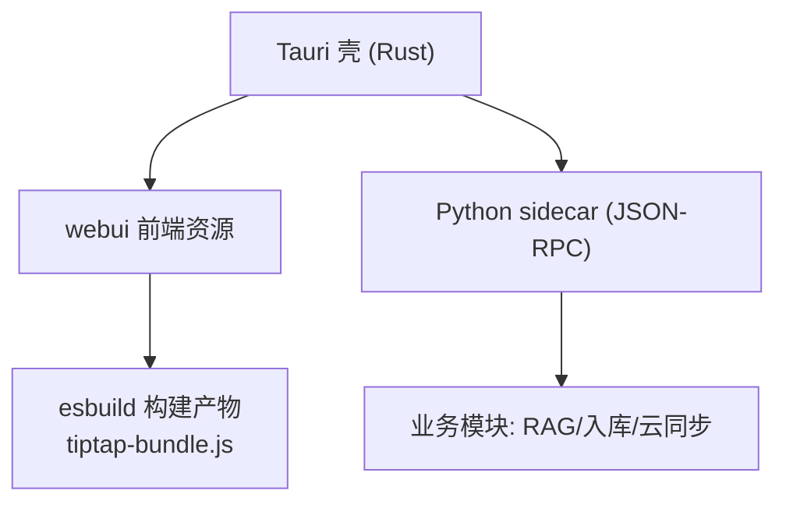
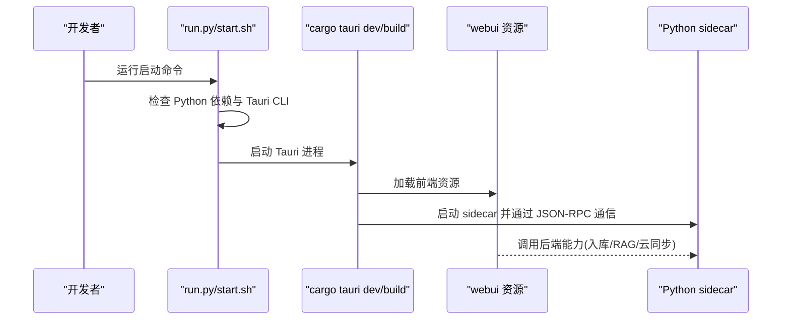
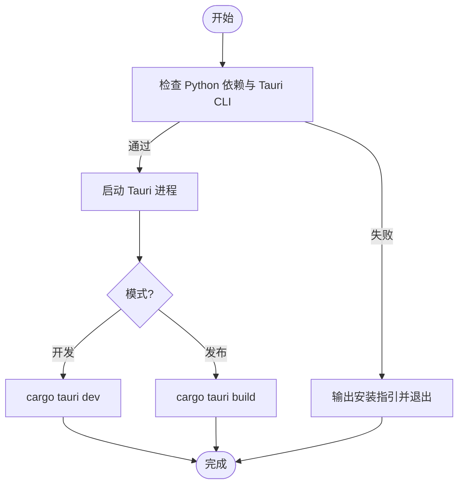
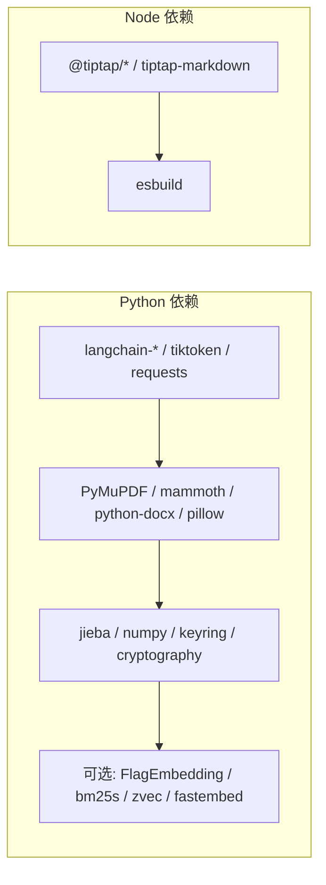

# 环境搭建

<cite>
**本文引用的文件**   
- [README.md](file://README.md)
- [pyproject.toml](file://pyproject.toml)
- [run.py](file://run.py)
- [start.sh](file://start.sh)
- [package.json](file://package.json)
- [scripts/build-tiptap-bundle.mjs](file://scripts/build-tiptap-bundle.mjs)
- [src-tauri/Cargo.toml](file://src-tauri/Cargo.toml)
- [src-tauri/tauri.conf.json](file://src-tauri/tauri.conf.json)
- [src-tauri/tauri.macos.conf.json](file://src-tauri/tauri.macos.conf.json)
- [utils/deps_sync.py](file://utils/deps_sync.py)
</cite>

## 目录
1. [简介](#简介)
2. [项目结构](#项目结构)
3. [核心组件](#核心组件)
4. [架构总览](#架构总览)
5. [详细组件分析](#详细组件分析)
6. [依赖分析](#依赖分析)
7. [性能考虑](#性能考虑)
8. [故障排查指南](#故障排查指南)
9. [结论](#结论)
10. [附录](#附录)

## 简介
本指南面向 NoteAI 的开发与生产环境搭建，覆盖 Python 3.10+、Node.js/npm、Rust/Tauri 的安装与配置，开发模式与生产模式的启动方式，调试环境设置，以及跨平台（Windows、macOS、Linux）的特定步骤与常见问题。同时提供自动化脚本使用方法和自定义选项说明。

## 项目结构
NoteAI 采用 Tauri v2 + Python sidecar 的桌面应用架构：
- Rust/Tauri 负责原生壳与前端资源加载
- webui 为纯前端资源（HTML/CSS/JS），通过 esbuild 打包 Tiptap 编辑器
- Python sidecar 提供 JSON-RPC 后端能力（入库、RAG、云同步等）
- 依赖管理以 uv 为主，Python 依赖声明在 pyproject.toml，Node 依赖在 package.json

**图表来源** 
- [src-tauri/tauri.conf.json:1-47](file://src-tauri/tauri.conf.json#L1-L47)
- [scripts/build-tiptap-bundle.mjs:1-40](file://scripts/build-tiptap-bundle.mjs#L1-L40)

**章节来源**
- [README.md:155-203](file://README.md#L155-L203)
- [src-tauri/tauri.conf.json:1-47](file://src-tauri/tauri.conf.json#L1-L47)

## 核心组件
- Python 环境与依赖
  - 要求 Python ≥ 3.10，推荐 uv 进行依赖管理与虚拟环境创建
  - 依赖定义于 pyproject.toml，支持可选 extras（dev、rag、cloud_*）
- Node.js 与 npm
  - 用于安装前端依赖并执行构建脚本（如构建 Tiptap bundle）
- Rust 与 Tauri
  - 需要 Rust 工具链与 Tauri CLI v2；Cargo 工程位于 src-tauri
- 启动器与自动化脚本
  - run.py：检查依赖并启动 cargo tauri dev
  - start.sh：一键启动（支持 --release 切换发布构建）

**章节来源**
- [pyproject.toml:1-133](file://pyproject.toml#L1-L133)
- [run.py:1-175](file://run.py#L1-L175)
- [start.sh:1-82](file://start.sh#L1-L82)
- [package.json:1-28](file://package.json#L1-L28)
- [src-tauri/Cargo.toml:1-27](file://src-tauri/Cargo.toml#L1-L27)

## 架构总览
下图展示了开发/生产模式下各组件的交互关系与关键入口。

**图表来源** 
- [run.py:146-175](file://run.py#L146-L175)
- [start.sh:73-82](file://start.sh#L73-L82)
- [src-tauri/tauri.conf.json:6-10](file://src-tauri/tauri.conf.json#L6-L10)

## 详细组件分析

### Python 3.10+ 环境与 uv 管理
- 版本要求
  - requires-python = ">=3.10"，mypy/ruff 目标版本均为 3.10
- 依赖管理
  - 推荐使用 uv 进行依赖同步与虚拟环境管理
  - 默认 extras：dev、rag（可通过设置移除 rag）
  - 可选 extras：cloud_tencent、cloud_baidu、all
- 依赖检查与自动补齐
  - run.py 会解析 pyproject.toml 中的 dependencies，检测缺失包并提示安装命令
  - utils/deps_sync.py 提供 uv sync 参数生成与执行封装，支持 include_dev 与 project_dir 参数
  - start.sh 在首次运行时会尝试自动执行 uv sync（含 dev + rag），并在检测到 RAG 缺失时自动补齐

建议操作
- 安装 uv（参考官方文档）
- 在项目根目录执行 uv sync --extra dev --extra rag
- 如需仅开发不启用 RAG，可在设置中移除 rag 组件后执行 uv sync --extra dev

**章节来源**
- [pyproject.toml:1-133](file://pyproject.toml#L1-L133)
- [run.py:44-122](file://run.py#L44-L122)
- [utils/deps_sync.py:1-55](file://utils/deps_sync.py#L1-L55)
- [start.sh:19-71](file://start.sh#L19-L71)

### Node.js 与 npm 依赖及前端构建
- Node.js 与 npm
  - 用于安装 package.json 中的依赖与执行构建脚本
- 构建脚本
  - scripts/build-tiptap-bundle.mjs 使用 esbuild 将 tiptap 相关代码打包为 iife 格式到 webui/lib/tiptap-bundle.js
  - 当入口文件或 package-lock.json 更新时才会重新构建，避免重复构建
- Tauri 集成
  - tauri.conf.json 中 beforeDevCommand 设置为 npm run build:tiptap，确保开发前构建最新 bundle

建议操作
- 安装 Node.js 与 npm
- 在项目根目录执行 npm install
- 首次或依赖变更后，执行 npm run build:tiptap 或让 Tauri 自动触发

**章节来源**
- [package.json:10-26](file://package.json#L10-L26)
- [scripts/build-tiptap-bundle.mjs:1-40](file://scripts/build-tiptap-bundle.mjs#L1-L40)
- [src-tauri/tauri.conf.json:6-10](file://src-tauri/tauri.conf.json#L6-L10)

### Rust 与 Tauri 开发环境
- Rust 工具链
  - 需要安装 rustup 与 cargo
- Tauri CLI v2
  - 可通过 cargo install tauri-cli 或 npm install -g @tauri-apps/cli 安装
  - run.py 会优先检测 cargo tauri，其次 npx tauri
- Cargo 工程
  - src-tauri/Cargo.toml 定义了 crate 名称、版本、依赖与特性（默认启用 devtools）
- 平台配置
  - macOS 特有窗口样式在 tauri.macos.conf.json 中配置

建议操作
- 安装 rustup 并初始化工具链
- 安装 Tauri CLI v2
- 进入 src-tauri 目录执行 cargo build 验证编译环境

**章节来源**
- [run.py:125-144](file://run.py#L125-L144)
- [src-tauri/Cargo.toml:1-27](file://src-tauri/Cargo.toml#L1-L27)
- [src-tauri/tauri.macos.conf.json:1-13](file://src-tauri/tauri.macos.conf.json#L1-L13)

### 开发模式与生产模式启动
- 开发模式
  - 使用 run.py 或 start.sh（不带参数）启动 cargo tauri dev，包含 Python sidecar
  - 首次构建会执行 Tiptap 打包
- 生产模式
  - 使用 start.sh --release 执行 cargo tauri build，生成可分发应用
- 依赖校验
  - 启动前会检查 Python 依赖与 Tauri CLI，缺失则给出安装指引

**图表来源** 
- [run.py:146-175](file://run.py#L146-L175)
- [start.sh:73-82](file://start.sh#L73-L82)

**章节来源**
- [README.md:273-284](file://README.md#L273-L284)
- [run.py:146-175](file://run.py#L146-L175)
- [start.sh:1-82](file://start.sh#L1-L82)

### 调试环境配置
- Tauri 开发工具
  - Cargo.toml 默认启用 devtools 特性，便于在开发模式下调试
- 前端调试
  - 浏览器开发者工具可用于 webui 调试
- Python sidecar 调试
  - 通过日志与异常信息定位问题；必要时在本地单独运行 sidecar 进行断点调试

**章节来源**
- [src-tauri/Cargo.toml:20-22](file://src-tauri/Cargo.toml#L20-L22)

### 跨平台安装要点与常见问题
- Windows
  - 安装 Rust 与 Tauri CLI；确保 PATH 中包含 cargo 与 node
  - 若缺少系统库导致某些 Python 包编译失败，请根据报错安装对应系统依赖
- macOS
  - 使用 brew 安装 Rust 与 Node.js；注意权限与沙盒限制
  - 窗口样式已在 tauri.macos.conf.json 中配置
- Linux
  - 安装系统级依赖（如 PDF/图像库）以满足 PyMuPDF、Pillow 等包的编译需求
  - 确保用户具备写入 .venv 与工作区目录的权限

常见错误与建议
- 未找到 uv：按提示安装 uv 后重试
- 未找到 Tauri CLI：按 run.py 提示安装 cargo tauri 或 npx tauri
- RAG 依赖缺失：执行 uv sync --extra rag 或在设置中移除 rag 组件

**章节来源**
- [run.py:125-144](file://run.py#L125-L144)
- [start.sh:19-71](file://start.sh#L19-L71)
- [src-tauri/tauri.macos.conf.json:1-13](file://src-tauri/tauri.macos.conf.json#L1-L13)

## 依赖分析
- Python 依赖矩阵（节选）
  - langchain-openai、langchain-core、tiktoken、requests、beautifulsoup4、markdownify、readability-lxml、validators、pydantic、PyMuPDF、mammoth、python-docx、python-pptx、olefile、pillow、markdown、PyYAML、jieba、html2text、watchdog、send2trash、numpy、keyring、cryptography、snownlp
  - 可选 extras：dev（pytest、ruff、mypy）、rag（FlagEmbedding、bm25s、zvec、fastembed）、cloud_tencent、cloud_baidu、all
- Node 依赖（节选）
  - @tiptap/core、@tiptap/starter-kit、tiptap-markdown、punycode
  - 开发依赖：esbuild

**图表来源** 
- [pyproject.toml:10-58](file://pyproject.toml#L10-L58)
- [package.json:18-26](file://package.json#L18-L26)

**章节来源**
- [pyproject.toml:10-58](file://pyproject.toml#L10-L58)
- [package.json:18-26](file://package.json#L18-L26)

## 性能考虑
- 首次构建耗时
  - Tauri 首次构建与 Rust 编译可能较长，后续增量构建更快
- 依赖安装优化
  - 使用 uv 缓存与并行下载，显著缩短依赖安装时间
- 前端构建
  - esbuild 构建速度快，仅在入口或锁文件变更时重建

[本节为通用指导，无需源码引用]

## 故障排查指南
- 未找到 uv
  - 现象：启动脚本提示未找到 uv
  - 处理：安装 uv 后重试
- 未找到 Tauri CLI
  - 现象：run.py 提示未找到 cargo tauri 或 npx tauri
  - 处理：按提示安装 Tauri CLI v2
- RAG 依赖缺失
  - 现象：提示缺少 bm25s/fastembed/zvec/FlagEmbedding
  - 处理：执行 uv sync --extra rag，或在设置中移除 rag 组件
- 前端构建失败
  - 现象：npm run build:tiptap 报错
  - 处理：确认 Node.js 版本兼容，清理 node_modules 后重装依赖

**章节来源**
- [run.py:125-144](file://run.py#L125-L144)
- [run.py:108-122](file://run.py#L108-L122)
- [start.sh:19-71](file://start.sh#L19-L71)

## 结论
通过合理配置 Python、Node.js、Rust/Tauri 环境并使用 uv 管理依赖，可以快速完成 NoteAI 的开发与生产环境搭建。借助 run.py 与 start.sh 的自动化流程，能够减少手动配置成本并提升一致性。对于 RAG 等可选功能，可按需启用或禁用，灵活适配不同场景。

[本节为总结性内容，无需源码引用]

## 附录

### 自动化安装脚本使用方法
- start.sh
  - 用法：./start.sh 或 ./start.sh --release
  - 功能：检查 uv 与 Python 依赖，自动执行 uv sync（含 dev + rag），然后启动 Tauri 开发或发布构建
- run.py
  - 用法：python run.py
  - 功能：检查 Python 依赖与 Tauri CLI，启动 cargo tauri dev

**章节来源**
- [start.sh:1-82](file://start.sh#L1-L82)
- [run.py:146-175](file://run.py#L146-L175)

### 自定义配置选项
- 是否启用 RAG
  - 在设置中移除 rag 组件后，默认同步不再包含 rag extras
- 是否包含开发依赖
  - utils/deps_sync.py 的 default_sync_extras 与 uv_sync_argv 支持 include_dev 参数控制是否包含 dev
- Tauri 构建前置命令
  - tauri.conf.json 的 beforeDevCommand 指定了构建 Tiptap bundle 的命令

**章节来源**
- [utils/deps_sync.py:17-37](file://utils/deps_sync.py#L17-L37)
- [src-tauri/tauri.conf.json:6-10](file://src-tauri/tauri.conf.json#L6-L10)