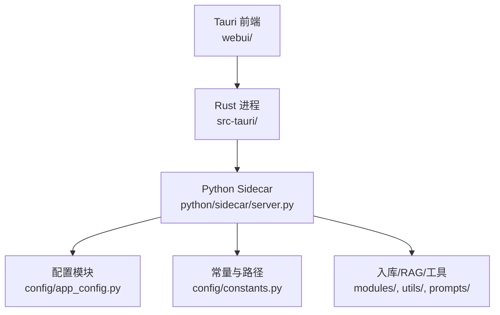
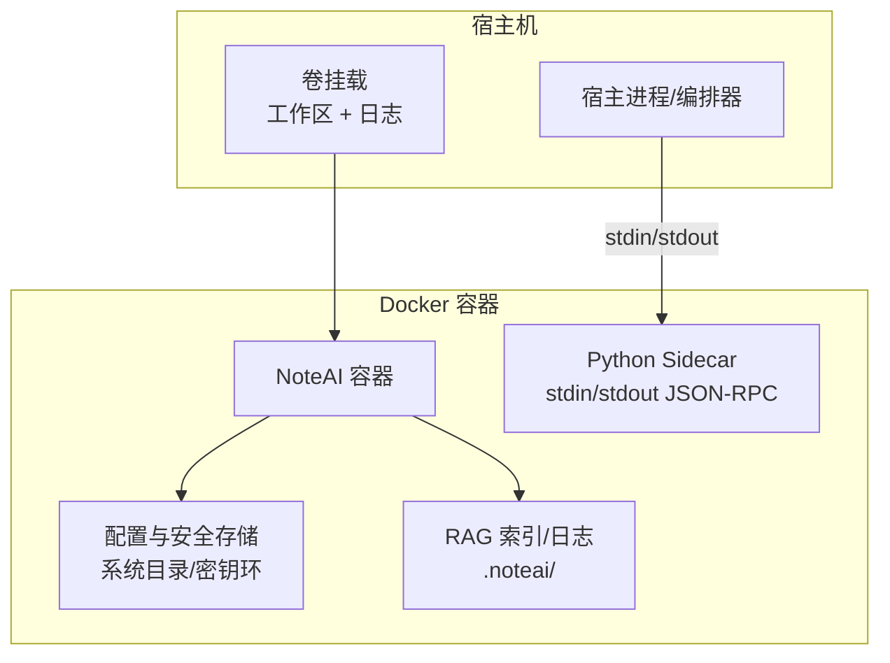
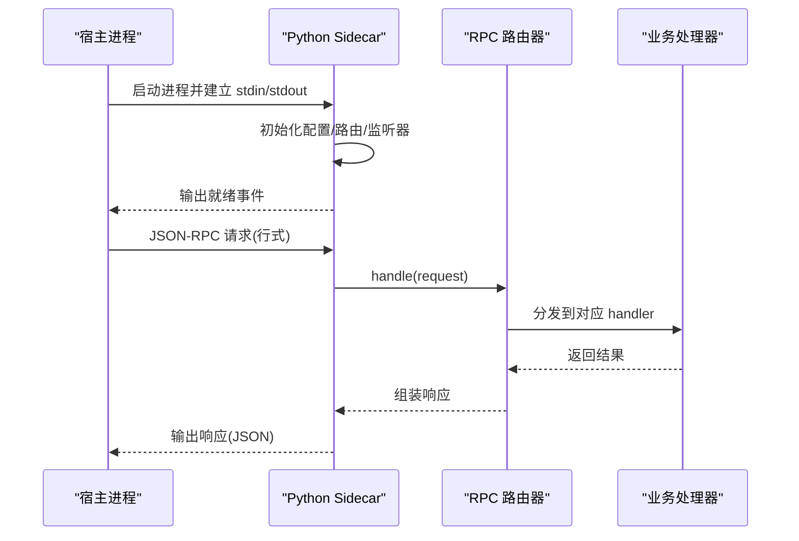
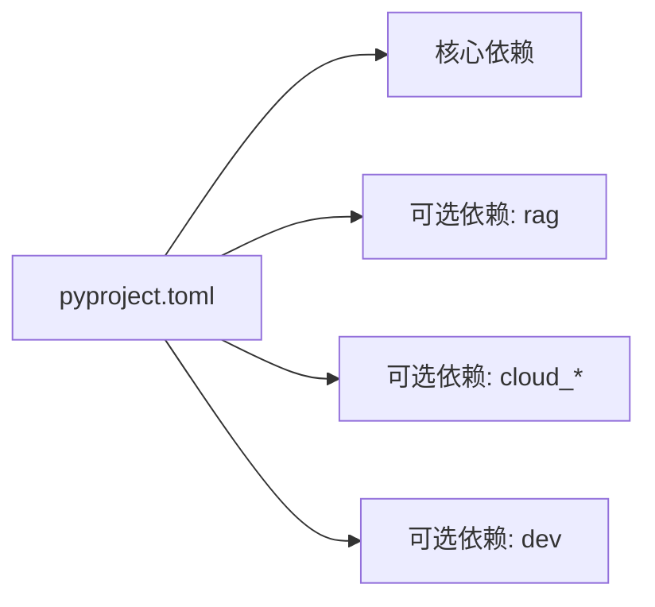

# Docker 容器化部署

<cite>
**本文引用的文件**   
- [README.md](file://README.md)
- [pyproject.toml](file://pyproject.toml)
- [config/app_config.py](file://config/app_config.py)
- [config/constants.py](file://config/constants.py)
- [config/settings.py](file://config/settings.py)
- [python/sidecar/server.py](file://python/sidecar/server.py)
- [python/main.py](file://python/main.py)
</cite>

## 目录
1. [简介](#简介)
2. [项目结构](#项目结构)
3. [核心组件](#核心组件)
4. [架构总览](#架构总览)
5. [详细组件分析](#详细组件分析)
6. [依赖分析](#依赖分析)
7. [性能考虑](#性能考虑)
8. [故障排查指南](#故障排查指南)
9. [结论](#结论)
10. [附录](#附录)

## 简介
本指南面向在容器中运行 NoteAI 的运维与开发者，聚焦以下目标：
- 多阶段 Dockerfile 设计：Rust 编译阶段与 Python 运行阶段的分离优化
- 基础镜像选择权衡：Alpine Linux 与 Debian 发行版
- 环境变量配置管理与敏感信息注入策略
- JSON-RPC 服务暴露、端口映射与访问控制（如需要）
- 卷挂载与工作区持久化、备份与迁移
- 资源限制与健康检查
- 日志收集与监控集成（结构化日志输出）
- Docker Compose 编排模板（多服务部署与服务发现）

NoteAI 采用 Tauri v2（Rust）+ Python sidecar 的架构。Python sidecar 通过标准输入/输出进行 JSON-RPC 通信，负责入库流水线、RAG、文件转换、云同步等能力。该文档将围绕这一特性给出容器化最佳实践。

## 项目结构
从容器化视角，关注以下关键路径与职责：
- python/sidecar/server.py：JSON-RPC 服务端主循环、工作区监听、任务调度、事件上报
- config/app_config.py：应用配置加载、环境变量覆盖、API Key 安全存储
- config/constants.py：系统数据目录、忽略目录、默认文件夹常量
- pyproject.toml：Python 依赖声明与可选依赖（含 RAG 与云同步）
- README.md：整体架构说明与快速开始

图示来源
- [README.md:155-170](file://README.md#L155-L170)
- [python/sidecar/server.py:1-50](file://python/sidecar/server.py#L1-L50)
- [config/app_config.py:1-50](file://config/app_config.py#L1-L50)
- [config/constants.py:1-30](file://config/constants.py#L1-L30)

章节来源
- [README.md:155-170](file://README.md#L155-L170)
- [pyproject.toml:1-60](file://pyproject.toml#L1-L60)

## 核心组件
- Python Sidecar 进程
  - 通过 stdin/stdout 实现 JSON-RPC 请求/响应与事件推送
  - 启动后初始化路由、注册各 Handler，并启动工作区文件监听与后台任务
- 配置与安全
  - 支持从配置文件、系统密钥环、环境变量加载 API Key 与模型参数
  - 非敏感配置落盘到用户态配置目录；敏感字段优先写入系统级安全存储
- 工作区与持久化
  - 工作区包含 Notes、wiki、Raw、.noteai 等目录；运行时索引与日志位于 .noteai
- 可选依赖
  - RAG 相关依赖为可选，按需启用以减小镜像体积

章节来源
- [python/sidecar/server.py:570-595](file://python/sidecar/server.py#L570-L595)
- [config/app_config.py:212-311](file://config/app_config.py#L212-L311)
- [config/constants.py:9-24](file://config/constants.py#L9-L24)
- [pyproject.toml:44-58](file://pyproject.toml#L44-L58)

## 架构总览
下图展示容器内外的交互关系：外部进程（或 Tauri 宿主）通过标准输入/输出与 Python Sidecar 通信；若需网络暴露，可额外提供 HTTP 网关（不在当前代码中）。

图示来源
- [python/sidecar/server.py:570-595](file://python/sidecar/server.py#L570-L595)
- [config/app_config.py:313-383](file://config/app_config.py#L313-L383)
- [config/constants.py:9-24](file://config/constants.py#L9-L24)

## 详细组件分析

### 多阶段 Dockerfile 编写建议
- 构建阶段（Builder）
  - 使用带 Rust 工具链与 Python 环境的镜像，安装 uv/pip，解析 pyproject.toml 依赖，预缓存 wheel，执行必要的预处理脚本
  - 仅保留构建产物与最小依赖集合
- 运行阶段（Runtime）
  - 基于轻量发行版（见“基础镜像选择”），复制构建阶段产物
  - 设置非 root 用户、只读根文件系统（除必要卷挂载）、健康检查入口
- 典型要点
  - 使用多阶段减少最终镜像体积
  - 利用依赖缓存层提升重建速度
  - 将工作区与日志通过卷挂载隔离

[本节为通用指导，不直接分析具体文件]

### 基础镜像选择：Alpine vs Debian
- Alpine
  - 优点：镜像极小、攻击面小
  - 风险：musl libc 兼容性问题，部分原生扩展（如 PyMuPDF、fastembed/bge-small-zh）可能需额外编译依赖
- Debian Slim
  - 优点：glibc 生态完善，第三方包兼容性更好
  - 缺点：镜像相对较大
- 建议
  - 若 RAG 与文档处理库稳定可用，优先 Debian Slim
  - 若追求极致体积且具备 musl 适配经验，可尝试 Alpine，但需充分验证

[本节为通用指导，不直接分析具体文件]

### 环境变量配置管理与敏感信息注入
- 支持的覆盖键（示例）
  - NOTEAI_API_KEY、NOTEAI_API_BASE、NOTEAI_MODEL_NAME、NOTEAI_TEMPERATURE、NOTEAI_MAX_TOKENS、NOTEAI_MAX_CONTEXT、NOTEAI_WORKSPACE_PATH
- 优先级
  - 环境变量 > 系统密钥环/加密文件 > 配置文件
- 安全策略
  - API Key 优先写入系统级安全存储，避免明文落盘
  - 非敏感配置落盘至用户态配置目录
- 容器注入方式
  - docker run --env-file
  - Kubernetes Secret/ConfigMap
  - Docker Compose secrets/env_file

章节来源
- [config/app_config.py:261-311](file://config/app_config.py#L261-L311)
- [config/app_config.py:313-383](file://config/app_config.py#L313-L383)
- [config/constants.py:9-24](file://config/constants.py#L9-L24)

### JSON-RPC 服务暴露与访问控制
- 当前实现
  - Sidecar 通过 stdin/stdout 进行 JSON-RPC 通信，无内置 HTTP 监听
- 如需网络暴露
  - 可在容器外封装一个轻量 HTTP→JSON-RPC 网关（例如 Nginx/Envoy + 自定义代理），或使用进程管理器（systemd/supervisor）管理 Sidecar 生命周期
  - 严格限制访问源（防火墙/网络策略），必要时增加鉴权中间件

章节来源
- [python/sidecar/server.py:570-595](file://python/sidecar/server.py#L570-L595)

### 端口映射与网络配置
- 由于 Sidecar 未监听端口，容器无需默认端口映射
- 若引入外部网关，则根据网关端口进行映射，并配合网络策略限制访问

[本节为通用指导，不直接分析具体文件]

### 卷挂载与数据持久化
- 工作区卷
  - 推荐挂载宿主目录到容器内的工作区路径（由 NOTEAI_WORKSPACE_PATH 指定）
  - 目录结构参考 README 中的工作区布局
- 运行时数据
  - .noteai 下的 rag_index、日志等应随工作区一起持久化
- 备份与迁移
  - 对宿主工作区目录做快照/增量备份
  - 迁移时保持目录结构与权限一致

章节来源
- [README.md:370-383](file://README.md#L370-L383)
- [config/app_config.py:146-175](file://config/app_config.py#L146-L175)

### 资源限制与容器编排
- CPU/内存限制
  - 通过容器运行时限制（docker run --cpus/--memory 或 K8s resources）
- 健康检查
  - 可通过 Sidecar 的事件通道或外部探针判断就绪状态（例如等待特定事件或调用某个 RPC 方法）
- 优雅关闭
  - 确保捕获 SIGTERM/SIGINT，停止文件监听与线程池

章节来源
- [python/sidecar/server.py:544-568](file://python/sidecar/server.py#L544-L568)

### 日志收集与监控集成
- 日志位置
  - 默认写入系统应用数据目录 logs 子目录（受系统平台影响）
- 结构化输出
  - 建议在 Sidecar 中统一输出 JSON 格式日志行，便于采集器解析
- 采集方案
  - 宿主机侧使用 Filebeat/Fluent Bit/Vector 等采集容器日志或挂载目录中的日志文件
  - 结合 OpenTelemetry 指标导出（如需要）

章节来源
- [config/constants.py:9-24](file://config/constants.py#L9-L24)
- [config/app_config.py:47-48](file://config/app_config.py#L47-L48)

### 工作流时序：Sidecar 启动与请求处理

图示来源
- [python/sidecar/server.py:570-595](file://python/sidecar/server.py#L570-L595)
- [python/sidecar/server.py:107-124](file://python/sidecar/server.py#L107-L124)

## 依赖分析
- Python 依赖
  - 核心依赖用于文档处理、网页抓取、NLP、加密等
  - 可选依赖 rag 用于向量检索与重排序
- 构建与打包
  - 使用 setuptools 与 package-dir 映射 sidecar 包路径
  - 开发/测试依赖独立分组

图示来源
- [pyproject.toml:10-58](file://pyproject.toml#L10-L58)

章节来源
- [pyproject.toml:1-60](file://pyproject.toml#L1-L60)

## 性能考虑
- 依赖预构建与缓存
  - 在构建阶段缓存 wheel，减少运行时安装开销
- 模型与索引预热
  - 首次启动可触发模型下载与索引构建，建议在容器启动钩子中完成
- 并发与线程池
  - 合理限制线程数，避免 I/O 竞争导致抖动
- 文件监听与去抖
  - 使用去抖合并变更事件，降低频繁重建索引的开销

[本节为通用指导，不直接分析具体文件]

## 故障排查指南
- 常见错误
  - 工作区路径不存在或无权限：检查 NOTEAI_WORKSPACE_PATH 与卷挂载权限
  - API Key 缺失或无效：确认环境变量或系统密钥环是否成功注入
  - RAG 索引未就绪：按提示手动重建索引
- 定位手段
  - 查看系统应用数据目录 logs
  - 观察 Sidecar 启动日志与事件输出
  - 使用容器日志聚合平台检索关键词

章节来源
- [config/app_config.py:146-175](file://config/app_config.py#L146-L175)
- [python/sidecar/server.py:256-266](file://python/sidecar/server.py#L256-L266)

## 结论
通过将 Rust 构建与 Python 运行解耦、合理选择基础镜像、严格管理敏感配置、明确工作区与日志持久化策略，并结合健康检查与资源限制，可以在生产环境中稳定运行 NoteAI。若需对外暴露服务，应在容器外增加安全的网关层并进行访问控制。

[本节为总结性内容，不直接分析具体文件]

## 附录

### Docker Compose 编排模板（概念性示例）
- 定义服务
  - noteai-sidecar：运行 Python Sidecar，挂载工作区与日志卷
  - （可选）gateway：HTTP→JSON-RPC 网关（自行实现）
- 环境变量
  - 通过 env_file 或 secrets 注入 NOTEAI_* 变量
- 健康检查
  - 基于 Sidecar 事件或自定义探针
- 资源限制
  - 设置 cpus/memory 上限

[本节为通用指导，不直接分析具体文件]