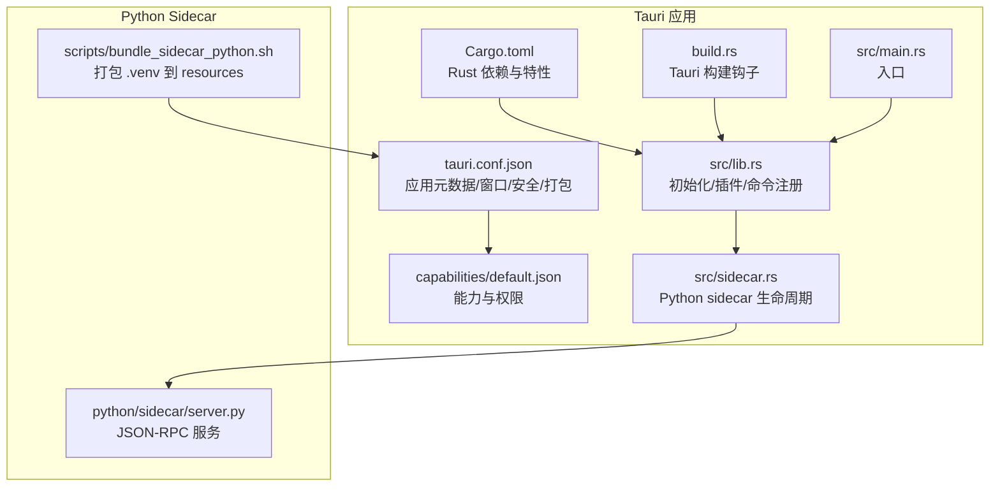
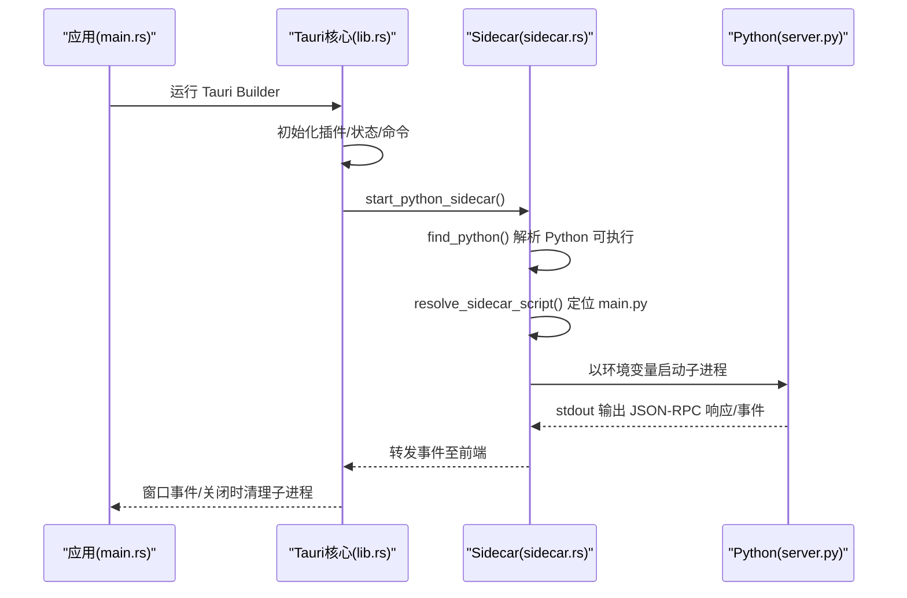
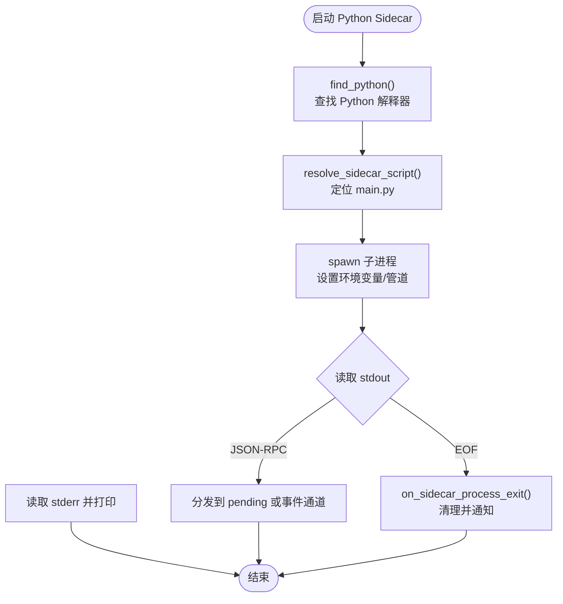
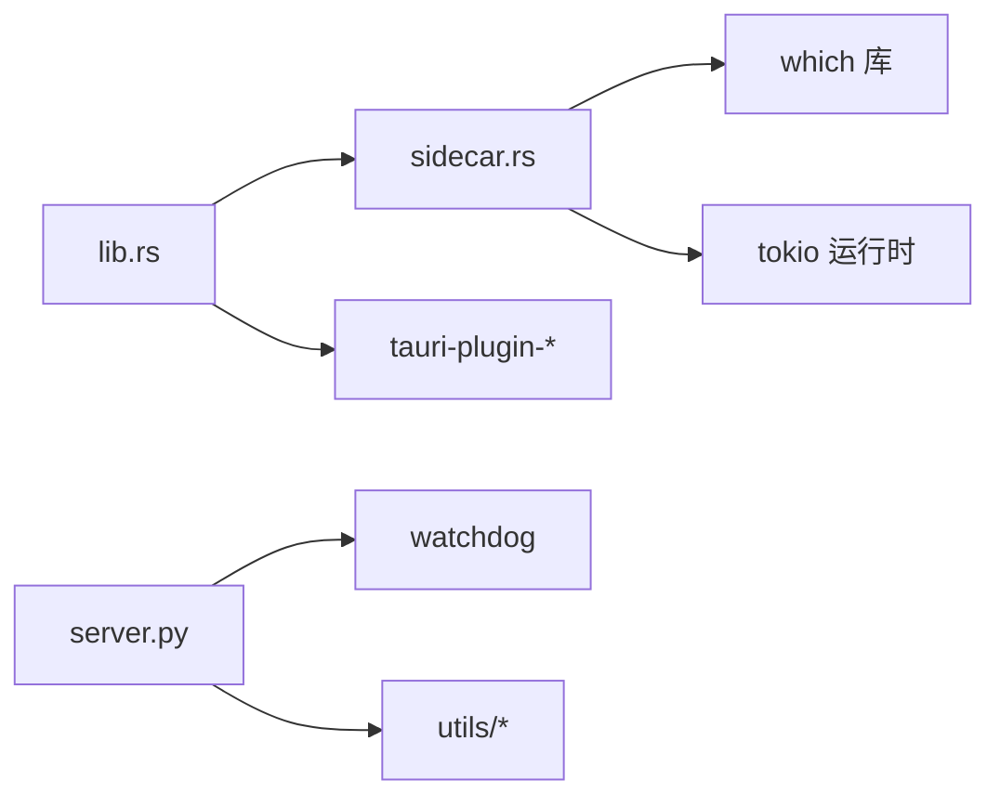

# Tauri 应用打包

<cite>
**本文引用的文件**
- [tauri.conf.json](file://src-tauri/tauri.conf.json)
- [Cargo.toml](file://src-tauri/Cargo.toml)
- [build.rs](file://src-tauri/build.rs)
- [default.json](file://src-tauri/capabilities/default.json)
- [main.rs](file://src-tauri/src/main.rs)
- [lib.rs](file://src-tauri/src/lib.rs)
- [sidecar.rs](file://src-tauri/src/sidecar.rs)
- [bundle_sidecar_python.sh](file://scripts/bundle_sidecar_python.sh)
- [server.py](file://python/sidecar/server.py)
</cite>

## 目录
1. [简介](#简介)
2. [项目结构](#项目结构)
3. [核心组件](#核心组件)
4. [架构总览](#架构总览)
5. [详细组件分析](#详细组件分析)
6. [依赖分析](#依赖分析)
7. [性能考虑](#性能考虑)
8. [故障排查指南](#故障排查指南)
9. [结论](#结论)
10. [附录](#附录)

## 简介
本指南面向 NoteAI 的 Tauri 桌面应用，聚焦“打包与发布”主题。内容覆盖：
- Tauri 配置结构与参数（应用元数据、窗口、安全策略、插件）
- 跨平台构建流程与平台差异优化
- Rust 依赖管理与 Cargo.toml 配置、条件编译与特性开关
- Python sidecar 集成打包、动态库链接与资源处理
- 构建优化（增量、并行、缓存）
- 代码签名与证书管理、应用商店发布要求与安全验证
- 调试模式与发布模式差异、性能分析与错误追踪

## 项目结构
NoteAI 采用 Tauri v2 + Rust 主进程 + Python sidecar 的混合架构。前端静态资源位于 webui，Rust 侧负责 UI 宿主、能力权限、Python 子进程通信；Python 侧提供业务逻辑与 RAG/知识库等能力。

图示来源
- [tauri.conf.json:1-47](file://src-tauri/tauri.conf.json#L1-L47)
- [default.json:1-50](file://src-tauri/capabilities/default.json#L1-L50)
- [Cargo.toml:1-27](file://src-tauri/Cargo.toml#L1-L27)
- [build.rs:1-4](file://src-tauri/build.rs#L1-L4)
- [main.rs:1-4](file://src-tauri/src/main.rs#L1-L4)
- [lib.rs:1-83](file://src-tauri/src/lib.rs#L1-L83)
- [sidecar.rs:1-312](file://src-tauri/src/sidecar.rs#L1-L312)
- [bundle_sidecar_python.sh:1-20](file://scripts/bundle_sidecar_python.sh#L1-L20)
- [server.py:1-595](file://python/sidecar/server.py#L1-L595)

章节来源
- [tauri.conf.json:1-47](file://src-tauri/tauri.conf.json#L1-L47)
- [Cargo.toml:1-27](file://src-tauri/Cargo.toml#L1-L27)
- [build.rs:1-4](file://src-tauri/build.rs#L1-L4)
- [default.json:1-50](file://src-tauri/capabilities/default.json#L1-L50)
- [main.rs:1-4](file://src-tauri/src/main.rs#L1-L4)
- [lib.rs:1-83](file://src-tauri/src/lib.rs#L1-L83)
- [sidecar.rs:1-312](file://src-tauri/src/sidecar.rs#L1-L312)
- [bundle_sidecar_python.sh:1-20](file://scripts/bundle_sidecar_python.sh#L1-L20)
- [server.py:1-595](file://python/sidecar/server.py#L1-L595)

## 核心组件
- Tauri 配置（tauri.conf.json）
  - 应用元数据：名称、版本、标识符
  - 构建：前端资源路径、开发/构建前命令
  - 窗口：尺寸、最小尺寸、装饰
  - 安全：CSP 策略
  - 打包：目标平台、图标、资源包含规则
  - 插件：shell 插件启用 open
- 能力与权限（capabilities/default.json）
  - 窗口操作、对话框、Shell 打开等细粒度权限
- Rust 工程（Cargo.toml）
  - tauri v2、插件、序列化、异步运行时、which、uuid 等
  - 特性开关 devtools 默认开启
  - lib crate 类型包含 staticlib/cdylib/rlib
- 构建脚本（build.rs）
  - 调用 tauri_build::build()
- 应用启动与初始化（main.rs / lib.rs）
  - 加载插件、注册命令、设置窗口事件、启动 Python sidecar
- Python sidecar（sidecar.rs / server.py）
  - 通过 stdin/stdout JSON-RPC 通信
  - 工作区监听、任务调度、RAG/知识库等

章节来源
- [tauri.conf.json:1-47](file://src-tauri/tauri.conf.json#L1-L47)
- [default.json:1-50](file://src-tauri/capabilities/default.json#L1-L50)
- [Cargo.toml:1-27](file://src-tauri/Cargo.toml#L1-L27)
- [build.rs:1-4](file://src-tauri/build.rs#L1-L4)
- [main.rs:1-4](file://src-tauri/src/main.rs#L1-L4)
- [lib.rs:1-83](file://src-tauri/src/lib.rs#L1-L83)
- [sidecar.rs:1-312](file://src-tauri/src/sidecar.rs#L1-L312)
- [server.py:1-595](file://python/sidecar/server.py#L1-L595)

## 架构总览
下图展示从应用启动到 Python sidecar 就绪的关键时序。

图示来源
- [main.rs:1-4](file://src-tauri/src/main.rs#L1-L4)
- [lib.rs:10-83](file://src-tauri/src/lib.rs#L10-L83)
- [sidecar.rs:215-312](file://src-tauri/src/sidecar.rs#L215-L312)
- [server.py:570-595](file://python/sidecar/server.py#L570-L595)

## 详细组件分析

### Tauri 配置详解（tauri.conf.json）
- 应用元数据
  - productName/version/identifier：用于应用名、版本号与应用标识
- 构建
  - frontendDist：指向 webui 目录
  - beforeDevCommand：开发前执行 tiptap 构建
  - beforeBuildCommand：构建前命令（当前为空）
- 应用与窗口
  - withGlobalTauri：暴露全局 Tauri API
  - windows：主窗口标题、宽高、最小尺寸、是否带装饰
- 安全
  - security.csp：严格的内容安全策略，限制脚本/样式/连接源
- 打包
  - active/targets：启用打包并选择 all
  - icon：多分辨率与平台图标集
  - resources：将 python/**/* 打包进应用资源
- 插件
  - plugins.shell.open：允许 shell 打开外部链接

章节来源
- [tauri.conf.json:1-47](file://src-tauri/tauri.conf.json#L1-L47)

### 能力与权限（capabilities/default.json）
- 窗口能力：拖拽、最大化/最小化、显示/隐藏、尺寸/位置、全屏、焦点等
- 对话框能力：打开/保存/消息/询问/确认
- Shell 能力：open
- 作用域：对 main 及 preview_* 窗口生效

章节来源
- [default.json:1-50](file://src-tauri/capabilities/default.json#L1-L50)

### Rust 依赖与特性（Cargo.toml）
- 包信息：name/version/edition
- build-dependencies：tauri-build v2
- dependencies：
  - tauri v2（无额外特性）
  - tauri-plugin-dialog/shell v2
  - serde/serde_json（序列化）
  - tokio（异步运行时，启用 rt/sync/io-util/process/time）
  - which（查找系统命令）
  - uuid（生成 ID）
- features：
  - default 包含 devtools
  - devtools 启用 tauri/devtools
- lib：
  - crate-type 包含 staticlib/cdylib/rlib，便于其他语言或工具链复用

章节来源
- [Cargo.toml:1-27](file://src-tauri/Cargo.toml#L1-L27)

### 构建脚本（build.rs）
- 调用 tauri_build::build()，完成 Tauri 上下文生成与资源注入

章节来源
- [build.rs:1-4](file://src-tauri/build.rs#L1-L4)

### 应用启动与初始化（main.rs / lib.rs）
- main.rs：调用 noteai_lib::run()
- lib.rs：
  - 初始化插件（dialog、shell）
  - 管理 AppState
  - setup 中异步启动 Python sidecar，失败则向前端发送错误事件
  - 注册 invoke_handler（RPC 与文件系统命令）
  - on_window_event：主窗口关闭时清理 Python 子进程与待处理请求

章节来源
- [main.rs:1-4](file://src-tauri/src/main.rs#L1-L4)
- [lib.rs:10-83](file://src-tauri/src/lib.rs#L10-L83)

### Python Sidecar 集成（sidecar.rs / server.py）
- 启动流程
  - find_python：按优先级查找 Python 解释器（环境变量、Resources 内嵌、.venv、PATH）
  - resolve_sidecar_script：优先使用 BaseDirectory::Resource 解析 main.py，回退到多种相对路径
  - 启动子进程：设置 HF_ENDPOINT/NO_PROXY/HF_HOME/HUGGINGFACE_HUB_CACHE/TRANSFORMERS_CACHE/PYTHONIOENCODING/PYTHONUNBUFFERED/KMP_DUPLICATE_LIB_OK/OMP_NUM_THREADS/TERM 等环境变量
  - 读写管道：stdout 解析 JSON-RPC，stderr 打印日志
  - 状态管理：维护 python_child/python_stdin/app_handle/pending_requests
- 重启与健壮性
  - restart_python_sidecar：防并发重启、等待就绪、自动恢复
  - on_sidecar_process_exit：意外退出时清理并通知前端
- Python 服务端（server.py）
  - 基于 stdin/stdout 的 JSON-RPC 路由
  - 工作区文件监听、自动转换、RAG 索引检查、任务进度事件推送
  - 优雅关闭：停止 watcher、关闭线程池与缓存

图示来源
- [sidecar.rs:123-213](file://src-tauri/src/sidecar.rs#L123-L213)
- [sidecar.rs:215-312](file://src-tauri/src/sidecar.rs#L215-L312)
- [server.py:570-595](file://python/sidecar/server.py#L570-L595)

章节来源
- [sidecar.rs:1-312](file://src-tauri/src/sidecar.rs#L1-L312)
- [server.py:1-595](file://python/sidecar/server.py#L1-L595)

### Python Sidecar 打包脚本（bundle_sidecar_python.sh）
- 功能：将项目 .venv 复制到 src-tauri/resources/sidecar-python，供 release 打包
- 前置条件：确保存在 python3/python 可执行
- 后续步骤：重新执行 cargo tauri build

章节来源
- [bundle_sidecar_python.sh:1-20](file://scripts/bundle_sidecar_python.sh#L1-L20)

## 依赖分析
- 模块耦合
  - lib.rs 依赖 sidecar.rs 启动 Python 子进程，并通过 state 共享句柄
  - sidecar.rs 依赖 which 查找 Python，依赖 tokio 异步 IO
  - server.py 依赖 watchdog、RAG/知识库等模块
- 外部依赖
  - Tauri v2 生态（core/dialog/shell）
  - Python 第三方库（由 .venv 提供）

图示来源
- [lib.rs:10-83](file://src-tauri/src/lib.rs#L10-L83)
- [sidecar.rs:1-312](file://src-tauri/src/sidecar.rs#L1-L312)
- [server.py:1-595](file://python/sidecar/server.py#L1-L595)

章节来源
- [Cargo.toml:1-27](file://src-tauri/Cargo.toml#L1-L27)
- [lib.rs:10-83](file://src-tauri/src/lib.rs#L10-L83)
- [sidecar.rs:1-312](file://src-tauri/src/sidecar.rs#L1-L312)
- [server.py:1-595](file://python/sidecar/server.py#L1-L595)

## 性能考虑
- 构建优化
  - 增量构建：利用 Cargo 增量与 Tauri 资源缓存
  - 并行编译：启用多线程编译（如 make -j 或 Cargo 默认并行）
  - 缓存：合理配置 CARGO_HOME 与 Tauri 缓存目录
- 运行时优化
  - Python 子进程复用：避免频繁重启，使用 is_sidecar_alive/wait_for_sidecar
  - OMP_NUM_THREADS 控制并行度，避免过度占用 CPU
  - KMP_DUPLICATE_LIB_OK 缓解部分 MKL 相关警告
- 资源体积
  - 仅打包必要 Python 依赖，减少 .venv 体积
  - 按需启用 devtools 特性，发布时关闭

[本节为通用建议，不直接分析具体文件]

## 故障排查指南
- Python 未找到
  - 现象：启动时报错提示找不到 Python
  - 排查：检查 NOTEAI_PYTHON、.venv、PATH；确认 bundle_sidecar_python.sh 已执行
- Sidecar 意外退出
  - 现象：前端收到 sidecar_died 事件
  - 排查：查看 stderr 日志；确认 main.py 路径与环境变量；尝试 restart_python_sidecar
- 权限不足
  - 现象：无法打开文件或对话框
  - 排查：确认 capabilities/default.json 中对应权限已授予
- CSP 拦截
  - 现象：控制台报错 CSP 违规
  - 排查：调整 tauri.conf.json 中 security.csp，谨慎放宽 connect-src/script-src

章节来源
- [sidecar.rs:123-175](file://src-tauri/src/sidecar.rs#L123-L175)
- [sidecar.rs:57-79](file://src-tauri/src/sidecar.rs#L57-L79)
- [default.json:1-50](file://src-tauri/capabilities/default.json#L1-L50)
- [tauri.conf.json:23-25](file://src-tauri/tauri.conf.json#L23-L25)

## 结论
NoteAI 的 Tauri 打包方案以“Rust 主进程 + Python sidecar”为核心，通过 tauri.conf.json 集中管理应用元数据、窗口与安全策略，借助 capabilities 精细化授权，配合 Cargo 特性与构建脚本实现灵活的调试/发布切换。Python sidecar 通过 stdin/stdout JSON-RPC 与主进程稳定通信，并提供健壮的启动、重启与异常恢复机制。遵循本指南的配置与优化建议，可在 Windows、macOS、Linux 上获得一致且高效的打包体验。

[本节为总结性内容，不直接分析具体文件]

## 附录

### 跨平台构建流程与平台特定配置
- 通用流程
  - 准备 Python 环境：uv sync 或 pip 安装依赖
  - 打包 Python 环境：执行 scripts/bundle_sidecar_python.sh
  - 构建：cargo tauri build
- 平台差异
  - Windows
    - 目标：msi/exe（取决于 targets=all）
    - 注意：确保 PATH 中包含 python3/python；必要时设置 NOTEAI_PYTHON
  - macOS
    - 目标：app/dmg/pkg（取决于 targets=all）
    - 注意：HF_HOME 默认写入 ~/Library/Application Support/NoteAI/hf_hub
  - Linux
    - 目标：deb/appimage/rpm（取决于 targets=all）
    - 注意：确保系统具备所需依赖（如 libwebkitgtk 等，视 Tauri 后端而定）

[本节为通用流程说明，不直接分析具体文件]

### Rust 条件编译与特性开关
- 默认特性包含 devtools，便于开发调试
- 发布构建可通过 --no-default-features 或自定义 profile 禁用 devtools，减小体积
- lib crate 类型包含 cdylib/staticlib/rlib，便于与其他语言或工具链集成

章节来源
- [Cargo.toml:20-27](file://src-tauri/Cargo.toml#L20-L27)

### 代码签名与证书管理、应用商店发布要求与安全验证
- Windows
  - 建议使用 Authenticode 签名（signtool），在 CI 中注入证书
  - 产物通常为 exe/msi，需满足 Microsoft Store 或企业分发要求
- macOS
  - 使用 Apple Developer 证书进行代码签名与公证（codesign + notarytool）
  - 产物 app/dmg/pkg 需符合 Gatekeeper 要求
- Linux
  - 发行版通常不强制签名，但可使用 gpg 签名增强可信度
- 安全验证
  - 结合 CSP、capabilities 最小权限原则，降低攻击面
  - 定期更新依赖与 Tauri 版本，修复已知漏洞

[本节为通用实践建议，不直接分析具体文件]

### 调试模式与发布模式的区别、性能分析与错误追踪
- 调试模式
  - 启用 devtools 特性，便于前端调试
  - 保留更多日志输出，便于定位问题
- 发布模式
  - 关闭 devtools，优化体积与启动时间
  - 收集关键错误事件（如 sidecar_error/sidecar_died）上报
- 性能分析
  - 使用系统级工具（Windows PerfView、macOS Instruments、Linux perf）
  - 关注 Python 子进程 CPU/内存占用与 I/O 瓶颈

[本节为通用指导，不直接分析具体文件]