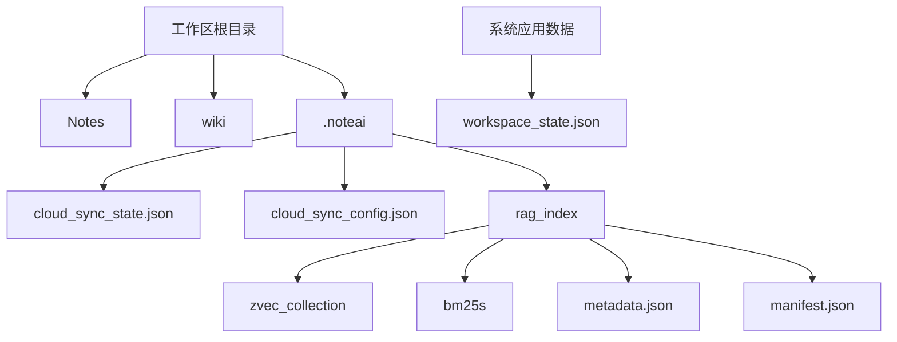
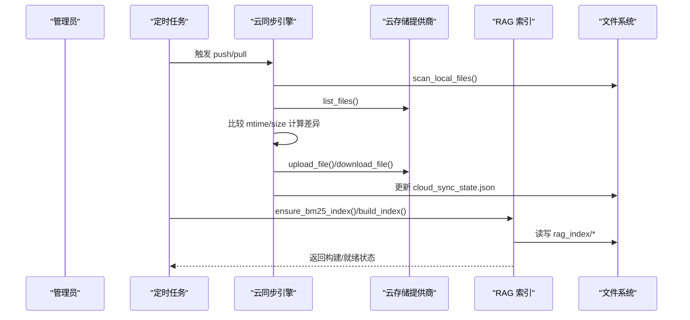
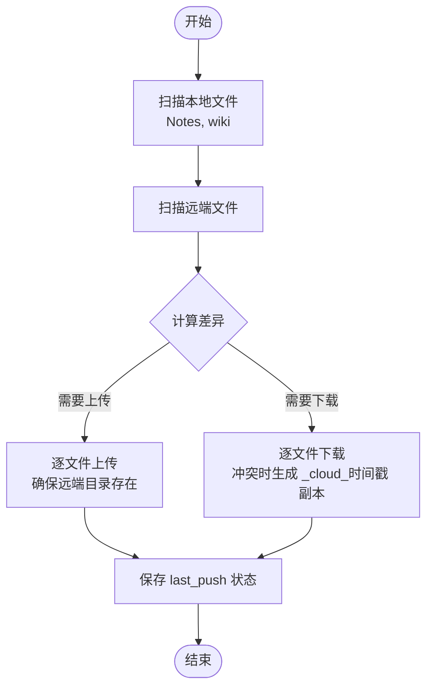
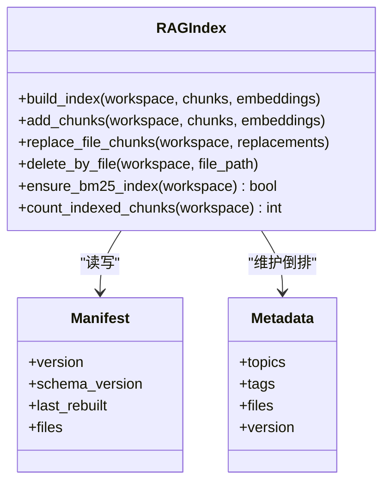
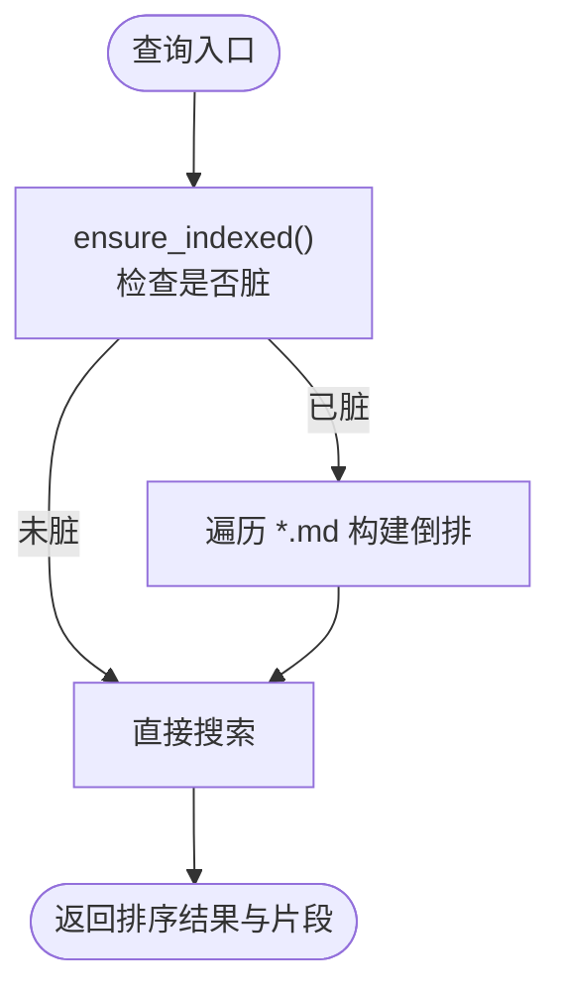
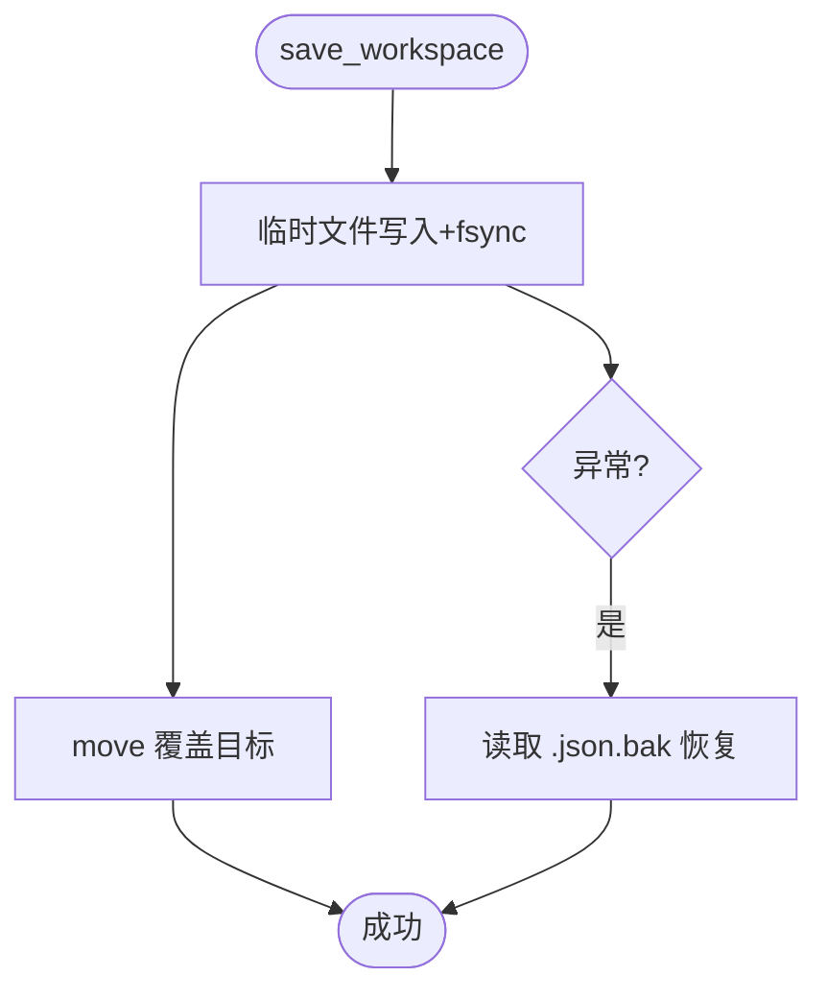
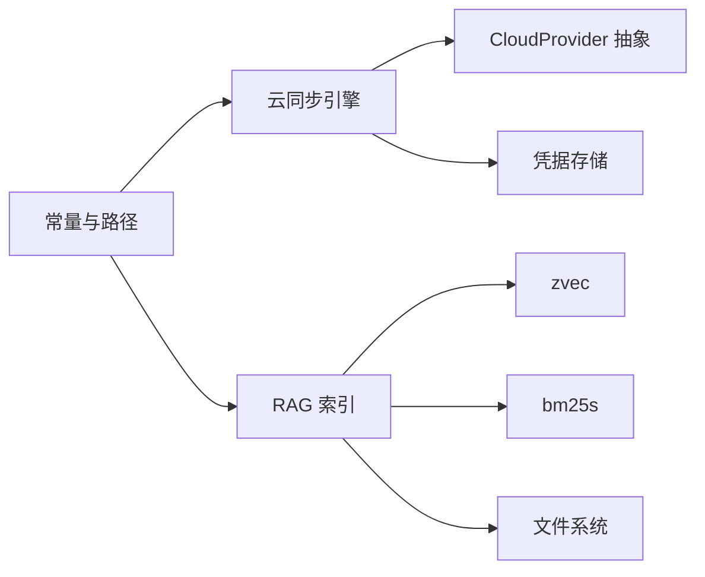

# 备份与恢复策略

<cite>
**本文引用的文件**   
- [sync_engine.py](file://python/sidecar/cloud/sync_engine.py)
- [constants.py](file://config/constants.py)
- [index.py](file://python/sidecar/rag/index.py)
- [fulltext_index.py](file://utils/fulltext_index.py)
- [workspace_state.py](file://config/workspace_state.py)
- [job_status.py](file://python/sidecar/job_status.py)
- [archive_wiki.py](file://python/sidecar/archive_wiki.py)
</cite>

## 目录
1. [简介](#简介)
2. [项目结构](#项目结构)
3. [核心组件](#核心组件)
4. [架构总览](#架构总览)
5. [详细组件分析](#详细组件分析)
6. [依赖关系分析](#依赖关系分析)
7. [性能考虑](#性能考虑)
8. [故障排查指南](#故障排查指南)
9. [结论](#结论)
10. [附录](#附录)

## 简介
本指南面向 NoteAI 生产环境的备份与恢复，围绕工作区数据、索引与元数据的备份策略展开，涵盖增量备份、变更检测、差异存储、压缩与加密、存储空间优化、数据安全、自动化调度、灾难恢复流程、版本控制与回滚、异地容灾与多云同步一致性保证、以及备份验证与演练。文档以代码实现为依据，提供可操作的步骤与最佳实践。

## 项目结构
NoteAI 的工作区包含用户笔记与知识库内容，同时维护应用级元数据与索引：
- 用户数据目录（需纳入备份）
  - Notes：用户笔记主目录
  - wiki：摘要/知识条目目录
- 应用与索引目录（建议纳入备份）
  - .noteai：工作区应用数据（含云同步状态、配置等）
  - .noteai/rag_index：RAG 向量与 BM25 索引、元数据与清单
- 系统应用数据（可选备份）
  - workspace_state.json：最近打开的工作区状态（含原子写入与 .bak 恢复）

图示来源
- [constants.py:26-31](file://config/constants.py#L26-L31)
- [sync_engine.py:12-14](file://python/sidecar/cloud/sync_engine.py#L12-L14)
- [index.py:81-102](file://python/sidecar/rag/index.py#L81-L102)
- [workspace_state.py:23](file://config/constants.py#L23)

章节来源
- [constants.py:26-31](file://config/constants.py#L26-L31)
- [sync_engine.py:12-14](file://python/sidecar/cloud/sync_engine.py#L12-L14)
- [index.py:81-102](file://python/sidecar/rag/index.py#L81-L102)
- [workspace_state.py:23](file://config/constants.py#L23)

## 核心组件
- 云同步引擎：负责本地 Notes/wiki 与云端对象存储的增量同步、冲突处理、认证凭据安全存储与状态持久化。
- RAG 索引子系统：维护 zvec 向量集合、BM25 稀疏索引、元数据倒排与清单；支持原子构建、替换与删除，具备缓存与并发控制。
- 全文检索索引：轻量内存倒排索引，按工作区 .md 文件重建，用于快速搜索。
- 工作区状态管理：原子写入工作区状态并保留 .bak 备份，异常时自动恢复。
- 任务状态注册表：在内存中记录后台任务进度与结果，便于编排与可视化。
- 归档助手：将对话答案归档为结构化 Markdown，便于审计与恢复。

章节来源
- [sync_engine.py:37-342](file://python/sidecar/cloud/sync_engine.py#L37-L342)
- [index.py:502-582](file://python/sidecar/rag/index.py#L502-L582)
- [fulltext_index.py:14-121](file://utils/fulltext_index.py#L14-L121)
- [workspace_state.py:15-198](file://config/workspace_state.py#L15-L198)
- [job_status.py:35-189](file://python/sidecar/job_status.py#L35-L189)
- [archive_wiki.py:49-117](file://python/sidecar/archive_wiki.py#L49-L117)

## 架构总览
下图展示备份与恢复的关键路径：从工作区扫描、增量变更检测、到云端推送/拉取，以及 RAG 索引的原子构建与清单管理。

图示来源
- [sync_engine.py:119-163](file://python/sidecar/cloud/sync_engine.py#L119-L163)
- [sync_engine.py:216-256](file://python/sidecar/cloud/sync_engine.py#L216-L256)
- [index.py:502-582](file://python/sidecar/rag/index.py#L502-L582)
- [index.py:786-800](file://python/sidecar/rag/index.py#L786-L800)

## 详细组件分析

### 云同步引擎（增量备份与冲突处理）
- 同步范围：仅 Notes 与 wiki 两个目录，避免无关数据膨胀。
- 增量策略：基于相对路径 + mtime + size 的三元组进行差异判断；上传时若远端不存在或本地 mtime 更晚则上传；下载时若远端存在且比本地新则覆盖，否则生成带时间戳的冲突副本。
- 安全路径校验：严格限制远程路径必须位于允许目录内，防止越界写入。
- 凭据安全：敏感字段不落地 JSON，使用系统钥匙串/后备文件存储，JSON 中仅保留占位符。
- 状态持久化：记录上次 push/pull 时间与使用的提供商名称，便于审计与断点续传。

图示来源
- [sync_engine.py:62-87](file://python/sidecar/cloud/sync_engine.py#L62-L87)
- [sync_engine.py:89-111](file://python/sidecar/cloud/sync_engine.py#L89-L111)
- [sync_engine.py:119-163](file://python/sidecar/cloud/sync_engine.py#L119-L163)
- [sync_engine.py:165-214](file://python/sidecar/cloud/sync_engine.py#L165-L214)
- [sync_engine.py:216-256](file://python/sidecar/cloud/sync_engine.py#L216-L256)
- [sync_engine.py:271-342](file://python/sidecar/cloud/sync_engine.py#L271-L342)

章节来源
- [sync_engine.py:12-14](file://python/sidecar/cloud/sync_engine.py#L12-L14)
- [sync_engine.py:62-87](file://python/sidecar/cloud/sync_engine.py#L62-L87)
- [sync_engine.py:119-163](file://python/sidecar/cloud/sync_engine.py#L119-L163)
- [sync_engine.py:165-214](file://python/sidecar/cloud/sync_engine.py#L165-L214)
- [sync_engine.py:216-256](file://python/sidecar/cloud/sync_engine.py#L216-L256)
- [sync_engine.py:271-342](file://python/sidecar/cloud/sync_engine.py#L271-L342)

### RAG 索引子系统（原子构建与清单管理）
- 数据结构
  - zvec_collection：稠密向量与字段倒排
  - bm25s：稀疏词项索引与语料
  - metadata.json：主题/标签/文件的倒排映射
  - manifest.json：索引版本、重建时间等清单
- 原子构建
  - 构建阶段写入临时目录，完成后重命名为正式集合，失败时回退至备份，保障一致性。
  - 通过全局锁与每工作区写锁串行化写入，避免并发破坏。
- 增量更新
  - add_chunks：追加文档并更新元数据；可选择重建 BM25。
  - replace_file_chunks：批量替换某文件对应分块，先 upsert 再删除旧 id，最后统一刷新与重建。
  - delete_by_file：按文件过滤删除，更新元数据与 BM25。
- 缓存与健壮性
  - 集合句柄缓存、BM25 加载缓存，减少重复 IO。
  - 针对 RocksDB 锁错误进行重试与清理提示。

图示来源
- [index.py:502-582](file://python/sidecar/rag/index.py#L502-L582)
- [index.py:596-702](file://python/sidecar/rag/index.py#L596-L702)
- [index.py:704-774](file://python/sidecar/rag/index.py#L704-L774)
- [index.py:786-800](file://python/sidecar/rag/index.py#L786-L800)
- [index.py:108-146](file://python/sidecar/rag/index.py#L108-L146)
- [index.py:377-431](file://python/sidecar/rag/index.py#L377-L431)

章节来源
- [index.py:81-102](file://python/sidecar/rag/index.py#L81-L102)
- [index.py:502-582](file://python/sidecar/rag/index.py#L502-L582)
- [index.py:596-702](file://python/sidecar/rag/index.py#L596-L702)
- [index.py:704-774](file://python/sidecar/rag/index.py#L704-L774)
- [index.py:786-800](file://python/sidecar/rag/index.py#L786-L800)
- [index.py:108-146](file://python/sidecar/rag/index.py#L108-L146)
- [index.py:377-431](file://python/sidecar/rag/index.py#L377-L431)

### 全文检索索引（轻量倒排）
- 设计要点
  - 内存倒排：word → {relpath: positions}
  - 脏标记与按需重建：当工作区文件变化时标记 dirty，下次查询前重建
  - 忽略 wiki 与隐藏文件，聚焦 Notes 内容
- 适用场景
  - 快速关键词检索与片段预览
  - 作为备份后的一致性校验辅助（对比重建前后命中数）

图示来源
- [fulltext_index.py:25-69](file://utils/fulltext_index.py#L25-L69)
- [fulltext_index.py:71-105](file://utils/fulltext_index.py#L71-L105)
- [fulltext_index.py:107-117](file://utils/fulltext_index.py#L107-L117)

章节来源
- [fulltext_index.py:14-121](file://utils/fulltext_index.py#L14-L121)

### 工作区状态管理（原子写入与恢复）
- 原子写入：先写临时文件，fsync，再移动覆盖原文件；失败时保留 .bak 并在读取失败时尝试恢复。
- 用途：记录最近打开的工作区路径、时间戳与版本信息，便于启动恢复与一致性检查。

图示来源
- [workspace_state.py:26-61](file://config/workspace_state.py#L26-L61)
- [workspace_state.py:87-126](file://config/workspace_state.py#L87-L126)

章节来源
- [workspace_state.py:15-198](file://config/workspace_state.py#L15-L198)

### 任务状态注册表（编排与可视化）
- 功能：在内存中维护任务生命周期（创建、更新、完成、失败、取消），支持事件推送与列表查询。
- 用途：为备份/恢复流程提供进度与结果上报能力。

章节来源
- [job_status.py:35-189](file://python/sidecar/job_status.py#L35-L189)

### 归档助手（结构化产物）
- 功能：将问答内容归档为 Notes 或 wiki 下的 Markdown，附带 frontmatter 元数据与日志记录。
- 用途：作为人工审计与恢复的补充材料。

章节来源
- [archive_wiki.py:49-117](file://python/sidecar/archive_wiki.py#L49-L117)

## 依赖关系分析
- 云同步依赖
  - 提供商抽象与多后端：通过 PROVIDER_MAP 动态选择具体实现
  - 凭据存储：keyring_store 封装系统钥匙串/后备文件
- RAG 索引依赖
  - zvec：稠密向量与倒排
  - bm25s：稀疏词项索引
  - 文件系统：原子替换、目录创建、垃圾回收与锁清理
- 常量与设置
  - constants.py 定义 NOTES_FOLDER、ABSTRACT_FOLDER、WORKSPACE_APP_FOLDER、RAG_INDEX_FOLDER 等关键路径

图示来源
- [sync_engine.py:8-10](file://python/sidecar/cloud/sync_engine.py#L8-L10)
- [index.py:22-28](file://python/sidecar/rag/index.py#L22-L28)
- [constants.py:26-31](file://config/constants.py#L26-L31)

章节来源
- [sync_engine.py:8-10](file://python/sidecar/cloud/sync_engine.py#L8-L10)
- [index.py:22-28](file://python/sidecar/rag/index.py#L22-L28)
- [constants.py:26-31](file://config/constants.py#L26-L31)

## 性能考虑
- 增量同步
  - 仅扫描 Notes 与 wiki，跳过隐藏文件，降低 I/O 压力
  - 基于 mtime/size 的差异判断避免无谓传输
- RAG 索引
  - 集合句柄与 BM25 检索器缓存，减少重复加载成本
  - 批量插入与 flush，提升写入吞吐
  - 单写者锁串行化，避免并发竞争导致的锁错误
- 全文索引
  - 内存倒排，按需重建，适合中小规模工作区

[本节为通用指导，无需源码引用]

## 故障排查指南
- 云同步
  - 上传/下载失败：查看日志中的 provider 调用异常与路径合法性校验错误
  - 冲突文件：下载分支会在本地生成带 _cloud_时间戳 的副本，需人工合并
  - 凭据问题：确认系统钥匙串可用，必要时重新保存凭据
- RAG 索引
  - 索引被占用：根据错误提示关闭其他 NoteAI 实例或等待锁释放
  - 版本不一致：manifest 版本不匹配会触发重建，必要时清理缓存后重试
  - BM25 缺失：ensure_bm25_index 会从现有向量重建稀疏索引
- 工作区状态
  - 状态损坏：自动尝试从 .json.bak 恢复；如仍失败，请检查磁盘权限与空间

章节来源
- [sync_engine.py:119-163](file://python/sidecar/cloud/sync_engine.py#L119-L163)
- [sync_engine.py:216-256](file://python/sidecar/cloud/sync_engine.py#L216-L256)
- [index.py:169-190](file://python/sidecar/rag/index.py#L169-L190)
- [index.py:229-285](file://python/sidecar/rag/index.py#L229-L285)
- [index.py:786-800](file://python/sidecar/rag/index.py#L786-L800)
- [workspace_state.py:87-126](file://config/workspace_state.py#L87-L126)

## 结论
NoteAI 的备份与恢复体系以“最小必要集”为原则，聚焦 Notes、wiki 与应用索引，结合增量同步、原子构建与清单管理，提供了高可用的基础能力。生产环境应在此基础上叠加压缩与加密、跨地域冗余、定期演练与一致性校验，形成完整的容灾闭环。

[本节为总结性内容，无需源码引用]

## 附录

### A. 备份范围与优先级
- 必保数据
  - Notes、wiki：用户核心内容
  - .noteai/rag_index：RAG 索引与清单，加速恢复
  - .noteai/cloud_sync_state.json：同步状态，便于断点续传
- 可选数据
  - 系统应用数据 workspace_state.json：最近工作区状态
  - .noteai/cloud_sync_config.json：云同步配置（敏感值不落盘）

章节来源
- [constants.py:26-31](file://config/constants.py#L26-L31)
- [sync_engine.py:12-14](file://python/sidecar/cloud/sync_engine.py#L12-L14)
- [index.py:81-102](file://python/sidecar/rag/index.py#L81-L102)

### B. 增量备份与差异存储机制
- 差异检测
  - 本地 vs 远端：相对路径 + mtime + size
  - 本地变更：mtime 变化即视为变更
- 差异存储
  - 云侧：仅上传新增/变更文件
  - 冲突处理：保留本地版本，远端新版本以 _cloud_时间戳 命名落盘，供人工合并

章节来源
- [sync_engine.py:119-163](file://python/sidecar/cloud/sync_engine.py#L119-L163)
- [sync_engine.py:165-214](file://python/sidecar/cloud/sync_engine.py#L165-L214)

### C. 压缩与加密
- 压缩
  - 建议在备份导出阶段对 Notes/wiki 与 .noteai 目录进行归档压缩，以降低带宽与存储成本
- 加密
  - 敏感配置（云凭据）已通过钥匙串/后备文件保护，不在 JSON 明文存放
  - 建议对备份包启用静态加密（如 GPG/AES），密钥与备份分离保管

[本节为通用指导，无需源码引用]

### D. 自动化备份调度与策略管理
- 调度方式
  - 操作系统 cron/systemd timer 或容器编排任务，周期性执行 push/pull 与索引健康检查
- 策略建议
  - 每日全量快照（归档压缩）+ 每小时增量同步
  - 保留策略：近 7 天小时级、近 30 天日级、近 12 个月月级
  - 清理策略：超过保留期的快照自动删除，并校验剩余快照可用性

[本节为通用指导，无需源码引用]

### E. 灾难恢复流程与完整性校验
- 恢复步骤
  1) 准备目标工作区目录
  2) 解压并还原 Notes、wiki、.noteai（含 rag_index 与云同步状态）
  3) 运行 ensure_bm25_index 确保稀疏索引可用
  4) 启动服务，验证全文索引与检索结果
  5) 对比云侧与本地状态，必要时执行一次 pull 补齐差异
- 完整性校验
  - 统计 chunk 数量：count_indexed_chunks 与 metadata/files 倒排核对
  - 随机抽样比对文件内容与大小
  - 运行一次增量同步，观察无异常差异

章节来源
- [index.py:336-359](file://python/sidecar/rag/index.py#L336-L359)
- [index.py:786-800](file://python/sidecar/rag/index.py#L786-L800)
- [sync_engine.py:258-269](file://python/sidecar/cloud/sync_engine.py#L258-L269)

### F. 版本控制与回滚
- 索引版本
  - manifest.json 维护 version/schema_version/last_rebuilt，版本不匹配将触发重建
- 集合原子切换
  - 构建期使用 building-* 与 backup-* 目录，成功后原子 rename，失败回退
- 回滚策略
  - 保留上一代集合与 BM25 快照，出现异常可直接回切

章节来源
- [index.py:108-146](file://python/sidecar/rag/index.py#L108-L146)
- [index.py:502-582](file://python/sidecar/rag/index.py#L502-L582)

### G. 异地备份与多云容灾
- 多云同步
  - 通过 PROVIDER_MAP 接入不同云厂商，可在多提供商间建立镜像
- 一致性保证
  - 以 cloud_sync_state.json 记录最近一次操作与提供商，配合幂等上传/下载逻辑
  - 定期执行双向校验（本地→远端A、本地→远端B），发现漂移及时修复

章节来源
- [sync_engine.py:336-342](file://python/sidecar/cloud/sync_engine.py#L336-L342)
- [sync_engine.py:258-269](file://python/sidecar/cloud/sync_engine.py#L258-L269)

### H. 备份验证与演练
- 定期演练
  - 在隔离环境中恢复最新快照，验证检索、归档与同步功能
- 一致性检查
  - 使用 count_indexed_chunks 与 metadata 倒排核对
  - 抽样比对 Notes/wiki 文件哈希与大小
- 报告与告警
  - 将演练结果与异常写入日志，必要时触发告警

章节来源
- [index.py:336-359](file://python/sidecar/rag/index.py#L336-L359)
- [job_status.py:35-189](file://python/sidecar/job_status.py#L35-L189)