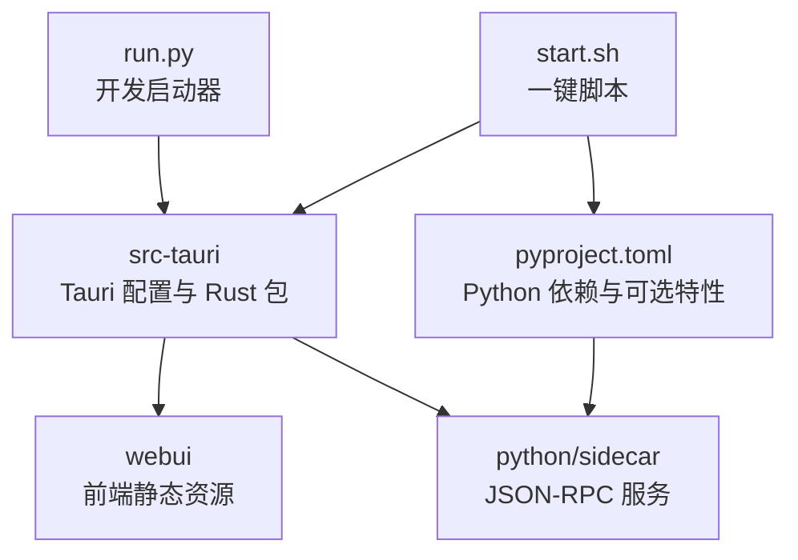
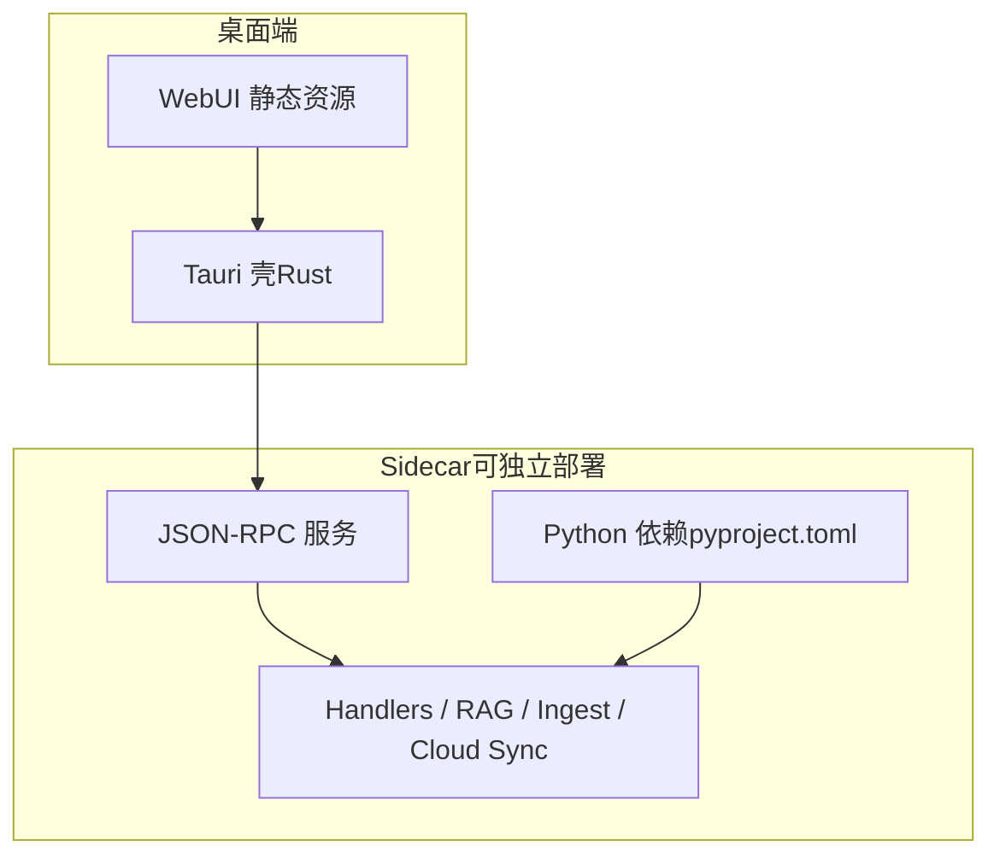
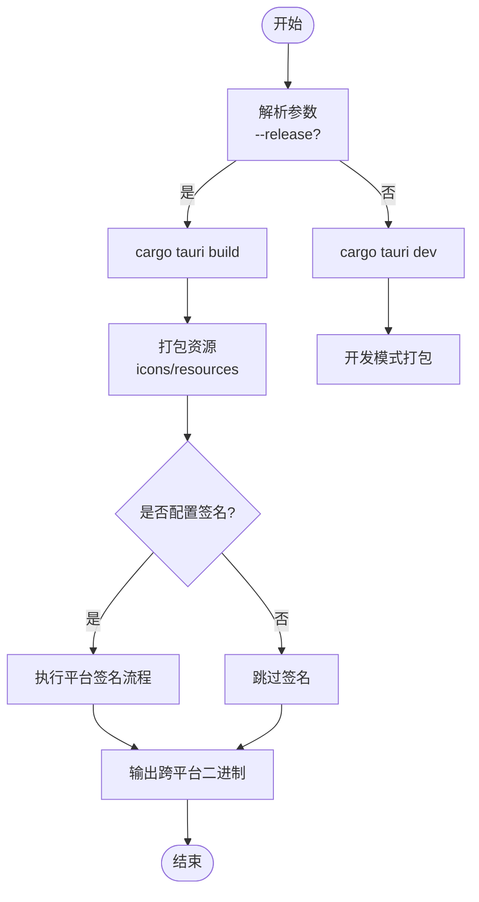
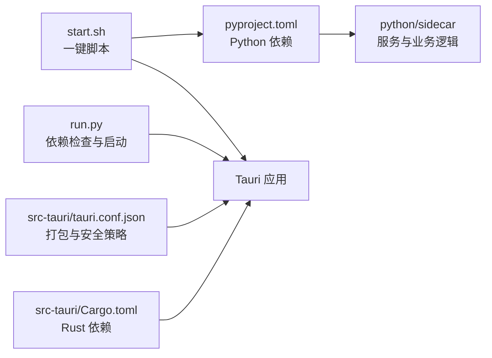

# 生产部署

<cite>
**本文引用的文件**
- [README.md](file://README.md)
- [pyproject.toml](file://pyproject.toml)
- [Cargo.toml](file://src-tauri/Cargo.toml)
- [tauri.conf.json](file://src-tauri/tauri.conf.json)
- [run.py](file://run.py)
- [start.sh](file://start.sh)
</cite>

## 目录
1. [简介](#简介)
2. [项目结构](#项目结构)
3. [核心组件](#核心组件)
4. [架构总览](#架构总览)
5. [详细组件分析](#详细组件分析)
6. [依赖关系分析](#依赖关系分析)
7. [性能考虑](#性能考虑)
8. [故障排查指南](#故障排查指南)
9. [结论](#结论)
10. [附录](#附录)

## 简介
本指南面向 NoteAI 的生产环境部署，覆盖以下主题：
- Tauri 应用的打包与签名流程、跨平台二进制生成与优化
- Docker 容器化部署方案与多阶段构建镜像优化
- 进程管理器配置（systemd、PM2、Docker Compose）
- 日志收集与分析（结构化输出、轮转策略）
- 性能调优（内存、并发、缓存）
- 监控告警与健康检查端点
- 备份恢复与增量备份、数据迁移
- 高可用部署架构、负载均衡与故障转移

NoteAI 采用 Tauri v2（Rust）作为桌面壳，前端静态资源位于 webui，Python sidecar 通过 JSON-RPC 提供后端能力。开发启动器 run.py 会校验依赖并调用 Tauri CLI；一键脚本 start.sh 封装了 uv 依赖补齐与 dev/build 模式切换。

## 项目结构
从生产视角关注的关键目录与文件：
- src-tauri：Tauri 应用配置与 Rust 包定义，包含产物打包目标、图标、资源与插件
- python/sidecar：JSON-RPC 服务、处理器、RAG、入库流水线等
- webui：前端静态资源
- pyproject.toml：Python 依赖与可选特性（dev、rag、cloud_*）
- run.py：开发启动器（依赖检查 + 启动 Tauri dev）
- start.sh：一键脚本（uv 依赖补齐 + cargo tauri dev/build）

图示来源
- [tauri.conf.json:1-47](file://src-tauri/tauri.conf.json#L1-L47)
- [Cargo.toml:1-27](file://src-tauri/Cargo.toml#L1-L27)
- [pyproject.toml:1-133](file://pyproject.toml#L1-L133)
- [run.py:1-175](file://run.py#L1-L175)
- [start.sh:1-82](file://start.sh#L1-L82)

章节来源
- [README.md:155-203](file://README.md#L155-L203)
- [README.md:384-433](file://README.md#L384-L433)

## 核心组件
- Tauri 应用层（Rust）
  - 负责加载 webui 静态资源、窗口与安全策略、打包资源与图标、启用 shell 插件等
  - 关键配置在 tauri.conf.json，包元信息与依赖在 Cargo.toml
- Python Sidecar
  - 通过 JSON-RPC 暴露能力（handlers、RAG、入库流水线、CLI agent 桥接、云同步等）
  - 依赖由 pyproject.toml 管理，支持 rag、cloud_tencent、cloud_baidu 等可选特性
- 启动与构建
  - run.py：解析 pyproject.toml 依赖、检测 RAG 组件、调用 Tauri CLI
  - start.sh：基于 uv 的依赖补齐与 dev/build 模式切换

章节来源
- [tauri.conf.json:1-47](file://src-tauri/tauri.conf.json#L1-L47)
- [Cargo.toml:1-27](file://src-tauri/Cargo.toml#L1-L27)
- [pyproject.toml:1-133](file://pyproject.toml#L1-L133)
- [run.py:1-175](file://run.py#L1-L175)
- [start.sh:1-82](file://start.sh#L1-L82)

## 架构总览
NoteAI 在生产环境中通常以“桌面应用 + 本地 sidecar”的方式运行。若需服务端形态，可将 Python sidecar 独立部署为服务，并通过反向代理对外暴露 API。

图示来源
- [README.md:155-170](file://README.md#L155-L170)
- [README.md:384-399](file://README.md#L384-L399)

## 详细组件分析

### Tauri 打包与签名（跨平台二进制）
- 打包目标与资源
  - targets 设置为 all，表示构建所有平台目标
  - resources 将 python/**/* 打包进应用，确保 sidecar 随应用分发
  - icon 指定多分辨率图标集
- 安全策略
  - CSP 限制脚本、样式、图片、字体、连接源等，建议生产环境收紧 connect-src 与 worker-src
- 插件
  - 启用 shell 插件 open 能力，便于外部打开链接或文件
- 构建命令
  - 使用 cargo tauri build 进行发布构建；开发时使用 cargo tauri dev
  - start.sh 提供 --release 参数切换构建模式

图示来源
- [tauri.conf.json:27-46](file://src-tauri/tauri.conf.json#L27-L46)
- [start.sh:75-81](file://start.sh#L75-L81)

章节来源
- [tauri.conf.json:1-47](file://src-tauri/tauri.conf.json#L1-L47)
- [start.sh:1-82](file://start.sh#L1-L82)

### Docker 容器化部署（多阶段构建）
- 适用场景
  - 将 Python sidecar 与服务逻辑容器化，供 Web 访问或作为后台任务
- 多阶段构建要点
  - 第一阶段：安装系统依赖与 Python 运行时，构建 Python 虚拟环境并安装依赖（含 rag/cloud 可选特性）
  - 第二阶段：仅复制必要文件（sidecar、webui 静态资源、配置文件），减小镜像体积
- 环境变量与配置
  - 通过环境变量注入 LLM API Key、RAG 开关、存储路径等
  - 使用 .env 或编排工具注入敏感信息
- 健康检查
  - 在 sidecar 中实现 /health 端点，返回状态码与指标摘要
- 示例步骤（概念性说明）
  - 编写 Dockerfile（多阶段）
  - 使用 docker build 构建镜像
  - 使用 docker run 或 docker-compose 启动服务

[本节为概念性说明，不直接分析具体文件]

### 进程管理器配置模板
- systemd（Linux 服务器）
  - 创建 service 单元文件，设置 ExecStart 指向 sidecar 入口或启动脚本
  - 配置 Restart=always、RestartSec、StandardOutput=journal、StandardError=journal
  - 使用 journalctl 查看日志
- PM2（Node.js 生态常用，也可用于 Python）
  - 使用 pm2 start 启动 sidecar 进程
  - 配置 ecosystem.config.js，设置实例数、重启策略、日志路径
- Docker Compose
  - 定义 sidecar 服务、网络、卷挂载（工作区与持久化数据）
  - 添加 healthcheck 与 depends_on

[本节为通用模板说明，不直接分析具体文件]

### 日志收集与分析
- 结构化日志
  - 建议在 sidecar 中统一输出 JSON 格式日志，包含时间戳、级别、模块、请求 ID、用户上下文等字段
- 日志轮转
  - 使用 logrotate（systemd/journal）或 PM2 内置轮转
  - 按大小或时间切分，保留固定天数
- 集中采集
  - 将日志输出到标准输出，交由容器日志驱动或日志采集器（如 Fluent Bit、Filebeat）转发至 ELK/Loki

[本节为通用实践说明，不直接分析具体文件]

### 性能调优参数
- 内存使用优化
  - 调整 Python GC 阈值与向量索引内存占用
  - 控制并发任务数量，避免同时触发大量 RAG 检索与重排序
- 并发连接数
  - 根据 CPU 核数与 I/O 模型调整 sidecar 工作进程/线程数
  - 对长耗时任务使用队列与限流
- 缓存策略
  - 启用结果缓存与索引预热
  - 合理设置 TTL，避免过期失效导致抖动

[本节为通用优化建议，不直接分析具体文件]

### 监控告警与健康检查
- 健康检查端点
  - 实现 /health 与 /metrics 端点，返回服务状态、依赖可用性、错误率、延迟分布
- 指标收集
  - 暴露 Prometheus 兼容指标（请求计数、错误率、P95/P99 延迟、内存/CPU 使用）
- 告警规则
  - 基于错误率、延迟、资源使用阈值配置告警
  - 结合外部通知渠道（邮件、企业微信、Slack）

[本节为通用监控方案，不直接分析具体文件]

### 备份恢复与增量备份
- 备份范围
  - 工作区 Notes/wiki/Raw/schema.md/.noteai/.ai_memory
- 增量备份
  - 基于文件变更时间戳或版本控制（Git）实现增量快照
- 恢复策略
  - 全量恢复与增量回滚
  - 验证一致性（索引重建、schema 校验）
- 数据迁移
  - 提供迁移脚本，处理目录结构调整、字段升级、索引重建

[本节为通用数据治理方案，不直接分析具体文件]

### 高可用部署架构
- 多副本部署
  - 使用容器编排（Kubernetes/Docker Swarm）部署多个 sidecar 副本
- 负载均衡
  - 通过 Nginx/HAProxy 或云 LB 分发请求
- 故障转移
  - 健康检查失败自动剔除节点
  - 会话无状态化，状态外置（Redis/数据库）

[本节为通用高可用方案，不直接分析具体文件]

## 依赖关系分析
NoteAI 的依赖关系主要体现在 Python 侧与 Tauri 侧：
- Python 依赖
  - 核心依赖包括文档处理、NLP、加密、文件系统操作等
  - 可选依赖 rag 提供向量检索与重排序能力
  - cloud_tencent/cloud_baidu 提供云盘同步扩展
- Tauri 依赖
  - 使用 tauri 与 tauri-plugin-shell/dialog
  - 启用 tokio 异步运行时与 which/uuid 等工具库

图示来源
- [pyproject.toml:1-133](file://pyproject.toml#L1-L133)
- [Cargo.toml:1-27](file://src-tauri/Cargo.toml#L1-L27)
- [tauri.conf.json:1-47](file://src-tauri/tauri.conf.json#L1-L47)
- [run.py:1-175](file://run.py#L1-L175)
- [start.sh:1-82](file://start.sh#L1-L82)

章节来源
- [pyproject.toml:1-133](file://pyproject.toml#L1-L133)
- [Cargo.toml:1-27](file://src-tauri/Cargo.toml#L1-L27)
- [tauri.conf.json:1-47](file://src-tauri/tauri.conf.json#L1-L47)
- [run.py:1-175](file://run.py#L1-L175)
- [start.sh:1-82](file://start.sh#L1-L82)

## 性能考虑
- 构建优化
  - 使用多阶段构建减少镜像体积
  - 预编译依赖与缓存层复用
- 运行时优化
  - 控制并发度与队列长度
  - 启用索引预热与结果缓存
  - 合理设置超时与重试策略
- 资源隔离
  - 容器内设置 CPU/内存限制
  - 使用 cgroup 限制 sidecar 资源使用

[本节为通用优化建议，不直接分析具体文件]

## 故障排查指南
- 依赖缺失
  - run.py 会读取 pyproject.toml 并检查依赖，缺失时提示安装命令
  - start.sh 会在首次运行或检测到缺失时自动 uv sync 补齐
- Tauri CLI 未找到
  - run.py 会尝试 cargo tauri 与 npx tauri，任一可用即可
- RAG 组件依赖
  - 若 RAG 未被移除但缺少相关包，start.sh 会尝试补齐；否则可在设置中禁用 RAG 组件
- 日志定位
  - 使用 journalctl（systemd）、pm2 logs（PM2）、docker logs（容器）查看运行日志
  - 结合结构化日志字段快速定位问题模块与请求上下文

章节来源
- [run.py:44-122](file://run.py#L44-L122)
- [run.py:125-143](file://run.py#L125-L143)
- [start.sh:19-71](file://start.sh#L19-L71)

## 结论
NoteAI 的生产部署应围绕“稳定构建、可控依赖、可观测运行、可恢复数据”展开。通过 Tauri 打包与签名保障客户端交付质量，通过容器化与进程管理器提升服务稳定性，通过结构化日志与监控告警增强可观测性，通过备份恢复与高可用架构保障业务连续性。

## 附录
- 参考命令
  - 开发启动：python run.py 或 ./start.sh
  - 发布构建：./start.sh --release
  - 依赖安装：uv sync --extra dev --extra rag
- 关键配置位置
  - Tauri 配置：src-tauri/tauri.conf.json
  - Rust 包依赖：src-tauri/Cargo.toml
  - Python 依赖：pyproject.toml

章节来源
- [run.py:146-175](file://run.py#L146-L175)
- [start.sh:75-81](file://start.sh#L75-L81)
- [pyproject.toml:38-58](file://pyproject.toml#L38-L58)