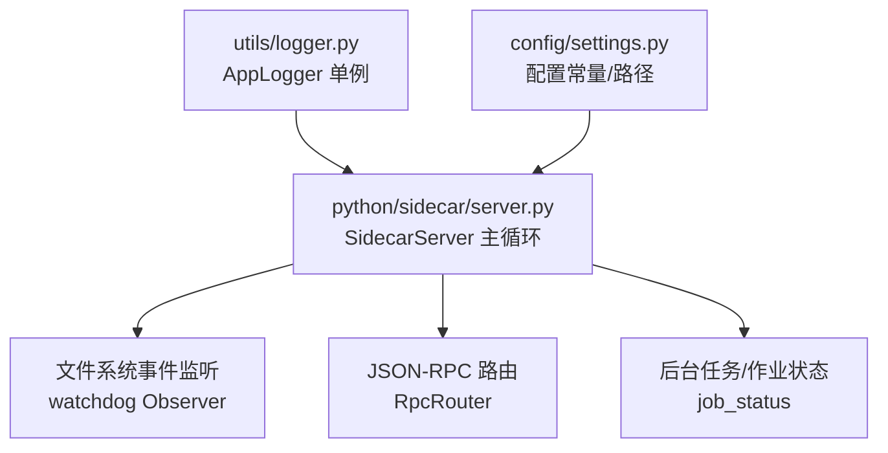
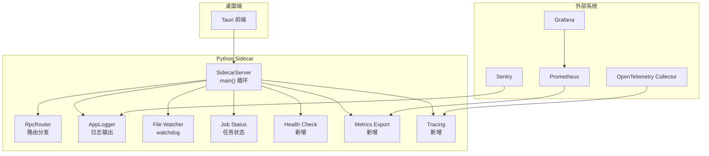
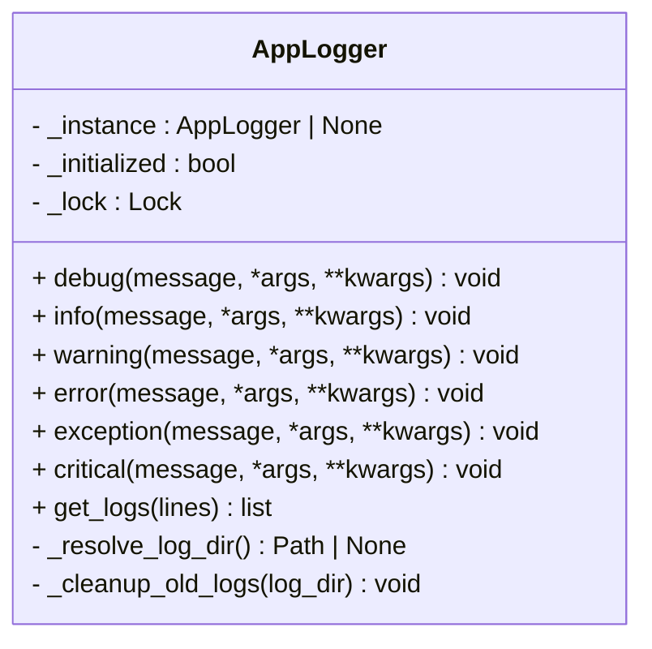
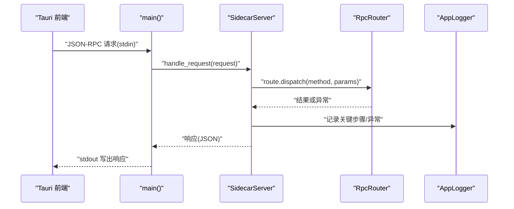
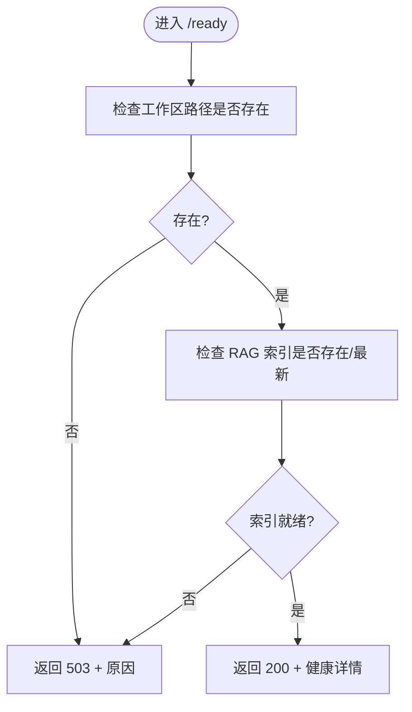
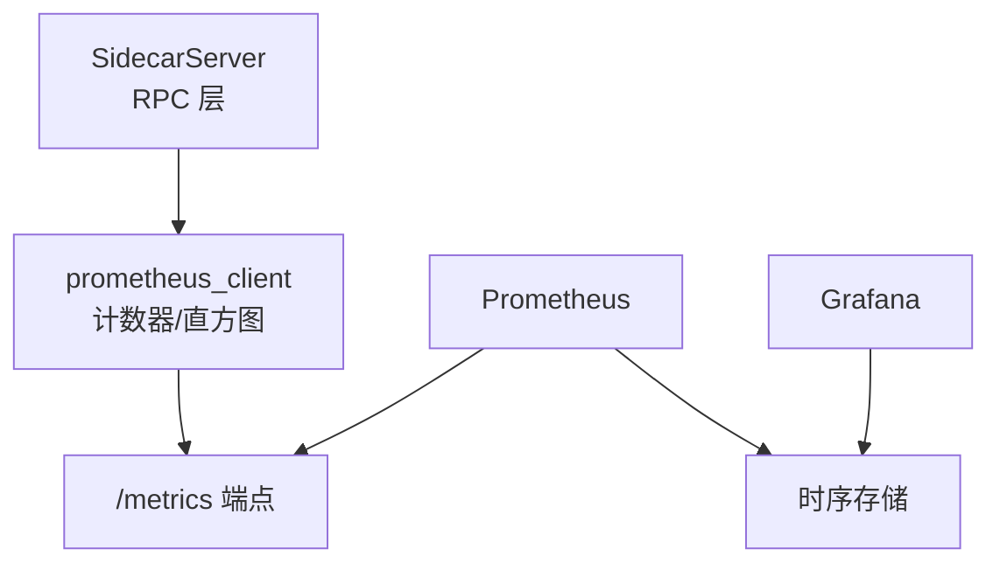
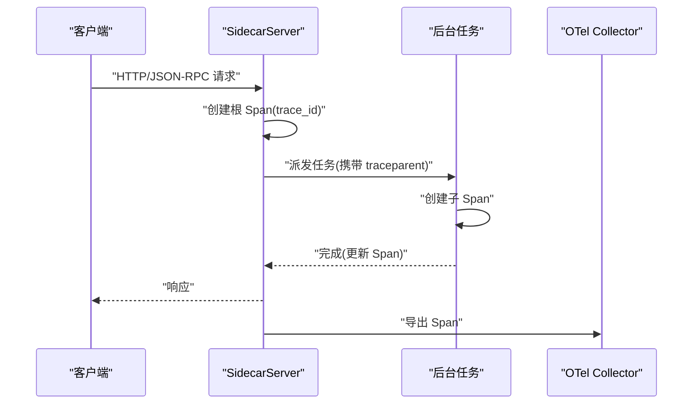
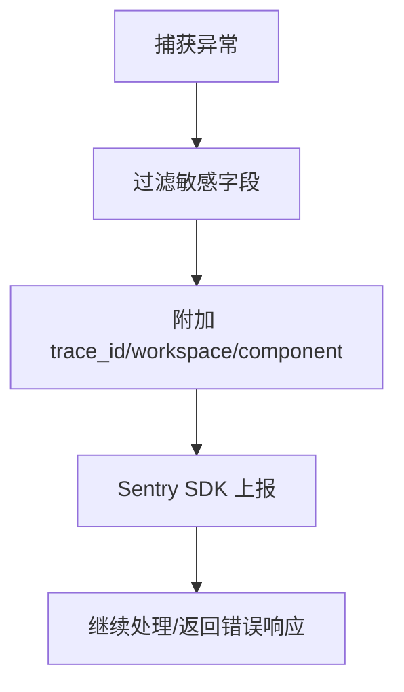
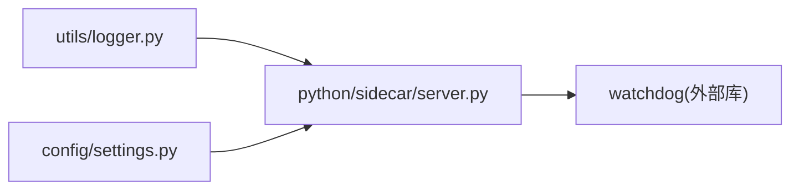

# 监控与可观测性

<cite>
**本文引用的文件**   
- [utils/logger.py](file://utils/logger.py)
- [python/sidecar/server.py](file://python/sidecar/server.py)
- [config/settings.py](file://config/settings.py)
</cite>

## 目录
1. [简介](#简介)
2. [项目结构](#项目结构)
3. [核心组件](#核心组件)
4. [架构总览](#架构总览)
5. [详细组件分析](#详细组件分析)
6. [依赖关系分析](#依赖关系分析)
7. [性能考量](#性能考量)
8. [故障排查指南](#故障排查指南)
9. [结论](#结论)
10. [附录](#附录)

## 简介
本指南面向 NoteAI 生产环境的监控与可观测性建设，围绕以下目标提供落地方案：
- 结构化日志：级别、格式、输出目标（控制台/文件）与轮转策略
- 健康检查端点：系统状态、工作区可用性、RAG 索引就绪度等
- 指标收集与导出：Prometheus 指标定义与抓取配置建议
- 分布式追踪：请求链路追踪与性能分析接入思路
- 告警规则：关键阈值与通知渠道集成
- 可视化仪表盘：Grafana 仪表板搭建与关键视图
- 错误监控与异常上报：Sentry 等工具集成
- 性能基准与容量规划：负载测试方法与瓶颈识别

说明：当前仓库已实现基础日志能力与 sidecar 服务生命周期管理；健康检查、指标、追踪、告警、仪表盘与错误上报为“生产化增强”建议，结合现有代码进行最小侵入式扩展。

## 项目结构
与监控相关的关键位置：
- utils/logger.py：应用级日志管理器（单例、线程安全），支持控制台与文件输出、按大小轮转、旧日志清理
- python/sidecar/server.py：Tauri Python sidecar 主进程，负责 JSON-RPC 路由、后台任务、工作区监听、启动/关闭流程
- config/settings.py：配置常量与工作区路径等设置入口

图示来源
- [utils/logger.py:13-126](file://utils/logger.py#L13-L126)
- [python/sidecar/server.py:54-125](file://python/sidecar/server.py#L54-L125)
- [config/settings.py:1-41](file://config/settings.py#L1-L41)

章节来源
- [utils/logger.py:13-126](file://utils/logger.py#L13-L126)
- [python/sidecar/server.py:54-125](file://python/sidecar/server.py#L54-L125)
- [config/settings.py:1-41](file://config/settings.py#L1-L41)

## 核心组件
- 结构化日志 AppLogger
  - 单例与线程安全初始化
  - 控制台 Handler（INFO 及以上）
  - 文件 Handler（DEBUG 及以上），按大小轮转并保留固定数量备份
  - 自动选择可写日志目录（环境变量优先，其次配置项，最后临时目录）
  - 定期清理超过阈值的旧日志
  - 提供最近 N 行日志读取接口
- SidecarServer 主进程
  - 构建 RPC 路由、注册各模块处理器
  - 启动工作区文件监听（watchdog），触发缓存失效与增量同步
  - 后台任务与作业状态推送（进度/完成/失败）
  - 优雅关闭：停止监听器、关闭线程池、清理 RAG 集合缓存
  - 标准输入/输出 JSON-RPC 通信

章节来源
- [utils/logger.py:13-126](file://utils/logger.py#L13-L126)
- [python/sidecar/server.py:54-125](file://python/sidecar/server.py#L54-L125)
- [python/sidecar/server.py:570-595](file://python/sidecar/server.py#L570-L595)

## 架构总览
NoteAI 的运行时由 Tauri 前端通过 JSON-RPC 调用 Python sidecar。sidecar 内部包含文件监听、索引与检索、任务调度等子系统。在生产环境中，建议在 sidecar 中增加健康检查、指标采集与链路追踪中间件，统一对外暴露 /health、/metrics 与 OpenTelemetry 兼容的追踪数据。

[此图为概念性架构图，不直接映射具体源码文件]

## 详细组件分析

### 组件A：结构化日志（AppLogger）
- 设计要点
  - 单例模式 + 双重检查锁保证线程安全
  - 多 Handler 输出：控制台（INFO+）、文件（DEBUG+）
  - 文件轮转：按大小切分与保留份数控制
  - 日志目录解析：环境变量 > 配置项 > 临时目录，自动创建并写入权限探测
  - 旧日志清理：基于 mtime 判断，超过阈值删除
  - 便捷方法：debug/info/warning/error/exception/critical/get_logs
- 复杂度与性能
  - I/O 操作集中在文件写入与轮转，常规场景开销可控
  - get_logs 采用尾部读取，时间复杂度 O(N)，N 为请求行数
- 可扩展点
  - 引入结构化字段（如 request_id、workspace_path、component）便于聚合
  - 对接 Sentry 异常上报（在 exception/critical 处捕获并发送）
  - 输出到 stdout 以便容器编排平台采集

图示来源
- [utils/logger.py:13-126](file://utils/logger.py#L13-L126)

章节来源
- [utils/logger.py:13-126](file://utils/logger.py#L13-L126)

### 组件B：Sidecar 主循环与任务管理
- 设计要点
  - main() 循环从 stdin 读取 JSON-RPC 请求，处理响应并通过 stdout 返回
  - start() 启动工作区监听与启动期同步任务
  - 后台任务封装：并发执行、失败记录、完成/失败事件推送
  - 优雅关闭：停止 watcher、关闭线程池、清理 RAG 缓存
- 与日志集成
  - 使用全局 logger 实例记录关键阶段与异常
- 可扩展点
  - 在 handle_request 前后注入追踪上下文（trace_id/span_id）
  - 在异常分支统一上报 Sentry
  - 暴露 /health 与 /metrics 端点（见下节）

图示来源
- [python/sidecar/server.py:570-595](file://python/sidecar/server.py#L570-L595)
- [python/sidecar/server.py:54-125](file://python/sidecar/server.py#L54-L125)
- [utils/logger.py:13-126](file://utils/logger.py#L13-L126)

章节来源
- [python/sidecar/server.py:570-595](file://python/sidecar/server.py#L570-L595)
- [python/sidecar/server.py:54-125](file://python/sidecar/server.py#L54-L125)

### 组件C：健康检查端点（建议实现）
- 目标
  - 快速判定服务是否可用、工作区是否就绪、RAG 索引是否可用
- 建议实现要点
  - /healthz：存活探针（返回 200 OK）
  - /ready：就绪探针（检查工作区路径存在、必要目录可读、RAG 索引存在且最新）
  - 可选：/db-check（若后续引入本地数据库）、/external-deps（第三方 API 连通性）
- 与现有代码衔接
  - 复用 server.startup 阶段的检查逻辑（工作区路径、索引状态）
  - 复用 logger 记录健康检查结果
  - 将结果以 JSON 形式返回，供 Prometheus blackbox exporter 或 K8s 探针消费

[此图为概念流程图，不直接映射具体源码文件]

### 组件D：指标收集与导出（建议实现）
- 指标分类
  - 运行态：进程 CPU/内存/GC、线程数、文件描述符
  - 业务态：请求 QPS、延迟分布、错误率、任务队列长度、RAG 索引大小/条目数
  - 资源态：磁盘使用率、I/O 吞吐、网络带宽
- 技术选型
  - Python 侧：prometheus_client 暴露 /metrics（文本格式）
  - 抓取：Prometheus 定时拉取
  - 可视化：Grafana 面板展示
- 与现有代码衔接
  - 在 RPC 路由层埋点（请求开始/结束计时、成功/失败计数）
  - 在后台任务中统计任务完成/失败次数与耗时
  - 在文件监听与索引更新时统计变更事件计数

[此图为概念架构图，不直接映射具体源码文件]

### 组件E：分布式追踪（建议实现）
- 目标
  - 端到端追踪：Tauri → sidecar → 子任务（转换、索引、检索）→ 外部依赖
- 技术选型
  - OpenTelemetry SDK（Python）+ OTLP 协议
  - 上游：Jaeger/Tempo/Zipkin 或云厂商 APM
- 与现有代码衔接
  - 在 main() 循环中解析 traceparent/tracestate 头（若通过 HTTP 代理）
  - 在 RPC 处理前后创建 span，附加 workspace_path、method、status 等标签
  - 在后台任务中传播上下文，确保跨线程追踪

[此图为概念序列图，不直接映射具体源码文件]

### 组件F：告警规则（建议实现）
- 典型规则
  - 服务不可用：/healthz 连续失败
  - 高错误率：RPC 错误率 > 阈值（如 5%）
  - 高延迟：P95/P99 延迟超阈值
  - 任务积压：待处理任务数持续增长
  - 索引异常：RAG 索引未更新或重建失败
- 通知渠道
  - 企业微信/钉钉/飞书机器人
  - 邮件/短信
  - PagerDuty/OpsGenie

[本节为通用实践，不直接分析具体文件]

### 组件G：仪表盘与可视化（建议实现）
- 关键视图
  - 服务健康：存活/就绪、错误率、延迟分布
  - 业务指标：入库流水线阶段耗时、RAG 检索命中率
  - 资源监控：CPU/内存/磁盘/网络
- 数据来源
  - Prometheus 指标
  - 结构化日志（通过 Loki 或 ELK 聚合）
  - 追踪数据（Jaeger/Tempo）

[本节为通用实践，不直接分析具体文件]

### 组件H：错误监控与异常上报（建议实现）
- 集成方式
  - 在 AppLogger.exception/critical 中调用 Sentry SDK 上报
  - 过滤敏感信息（工作区路径、用户隐私）
  - 关联 trace_id 与日志 ID，便于定位
- 与现有代码衔接
  - 在 sidecar 异常处理分支统一上报
  - 对已知可恢复异常降级处理，避免误报

[此图为概念流程图，不直接映射具体源码文件]

## 依赖关系分析
- 组件耦合
  - AppLogger 被 SidecarServer 广泛引用，作为统一日志出口
  - SidecarServer 依赖配置常量（工作区路径、忽略目录等）
- 潜在风险
  - 日志目录不可写导致回退至临时目录，需关注权限与空间
  - 文件监听在高并发变更场景下可能产生大量事件，需防抖与限流
- 外部依赖
  - watchdog（文件系统事件）
  - 未来引入 prometheus_client、opentelemetry-sdk、sentry-sdk

图示来源
- [utils/logger.py:13-126](file://utils/logger.py#L13-L126)
- [python/sidecar/server.py:54-125](file://python/sidecar/server.py#L54-L125)
- [config/settings.py:1-41](file://config/settings.py#L1-L41)

章节来源
- [utils/logger.py:13-126](file://utils/logger.py#L13-L126)
- [python/sidecar/server.py:54-125](file://python/sidecar/server.py#L54-L125)
- [config/settings.py:1-41](file://config/settings.py#L1-L41)

## 性能考量
- 日志 I/O
  - 使用 RotatingFileHandler 控制文件大小与备份数量，避免磁盘膨胀
  - 控制台输出仅 INFO 及以上，降低调试开销
- 文件监听
  - 防抖机制减少频繁同步与重建
  - 忽略隐藏目录与 wiki 目录，缩小影响范围
- 任务调度
  - 后台任务独立线程执行，避免阻塞主循环
  - 任务状态持久化与事件推送，便于前端反馈
- 建议
  - 在高频路径添加指标与采样追踪
  - 对大对象序列化与 I/O 进行批量化与异步化

[本节为通用指导，不直接分析具体文件]

## 故障排查指南
- 日志无法写入
  - 现象：日志回退至临时目录或无输出
  - 排查：确认 NOTEAI_LOG_DIR 或配置项指向的路径可写；检查磁盘空间与权限
- 健康检查失败
  - 现象：/ready 返回 503
  - 排查：检查工作区路径是否存在；查看 RAG 索引是否缺失或未更新
- 任务长时间未完成
  - 现象：前端显示任务进行中
  - 排查：查看 job_status 状态；检查后台线程是否卡住；观察日志中的异常堆栈
- 文件监听风暴
  - 现象：大量 workspace_files_changed 事件
  - 排查：确认防抖生效；检查是否有批量写入或 IDE 自动生成文件

章节来源
- [utils/logger.py:61-91](file://utils/logger.py#L61-L91)
- [python/sidecar/server.py:216-246](file://python/sidecar/server.py#L216-L246)
- [python/sidecar/server.py:416-539](file://python/sidecar/server.py#L416-L539)

## 结论
当前仓库已具备稳定的日志与 sidecar 主循环基础。生产环境建议在此基础上逐步补齐健康检查、指标导出、分布式追踪、告警与仪表盘、错误上报等能力，形成完整的可观测性闭环。所有增强应遵循最小侵入原则，复用现有日志与任务体系，确保可维护性与稳定性。

[本节为总结性内容，不直接分析具体文件]

## 附录
- 术语
  - 健康检查：存活与就绪探针
  - 指标：数值型度量，用于趋势分析与告警
  - 追踪：请求链路的时间线与上下文传播
  - 告警：基于指标的自动化通知
  - 仪表盘：可视化的指标与日志聚合视图
- 参考路径
  - 日志实现：[utils/logger.py](file://utils/logger.py)
  - Sidecar 主循环：[python/sidecar/server.py](file://python/sidecar/server.py)
  - 配置入口：[config/settings.py](file://config/settings.py)