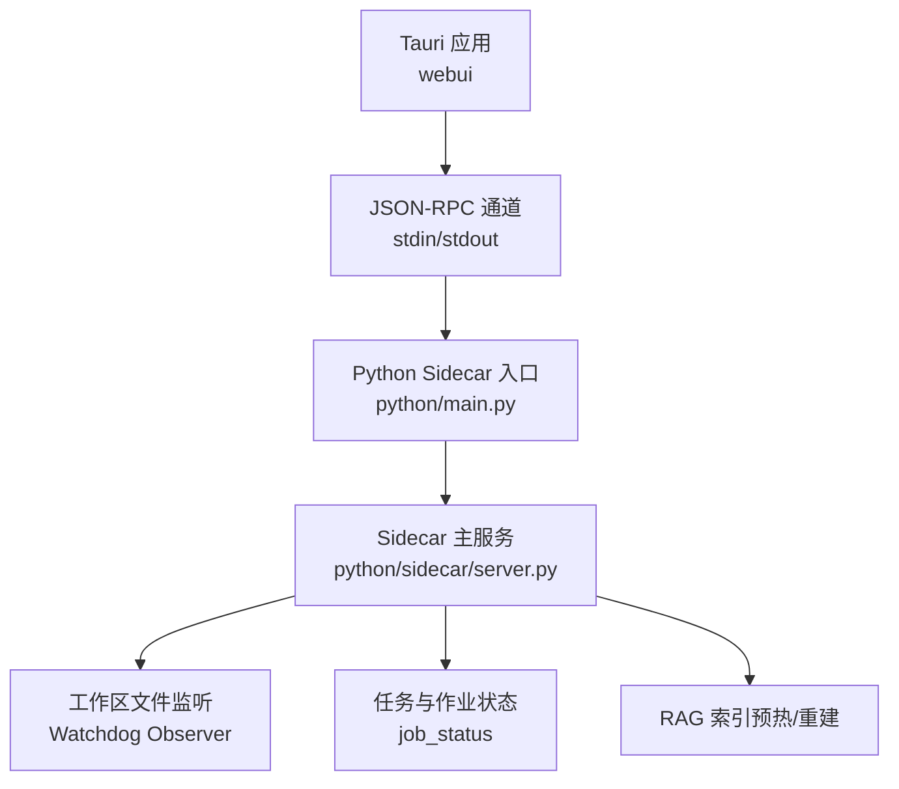
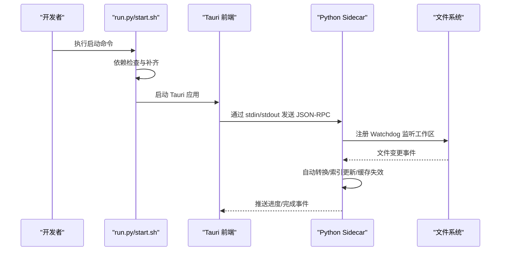
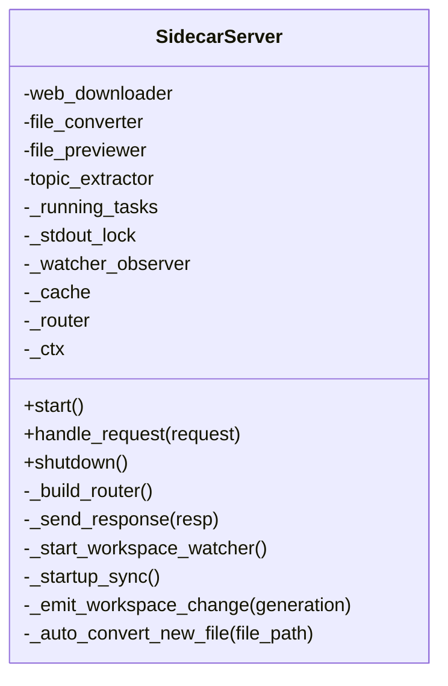
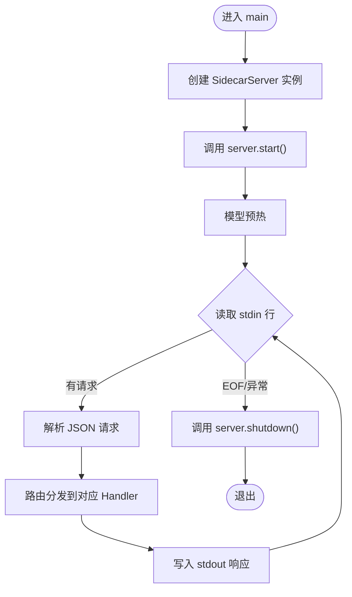
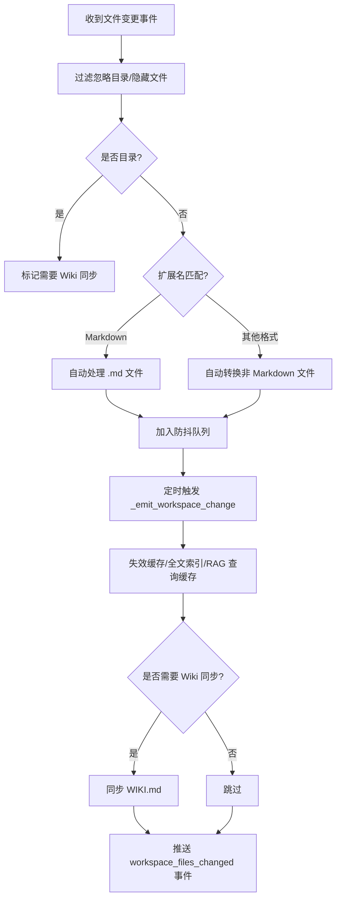
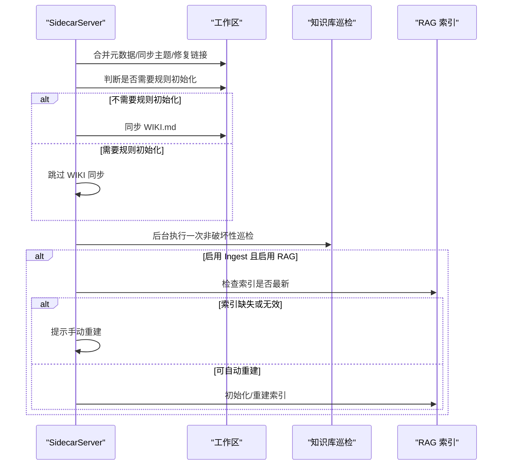
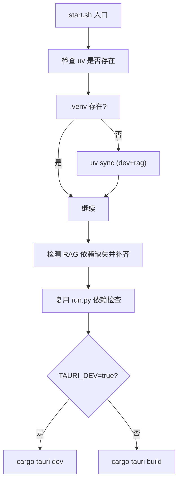
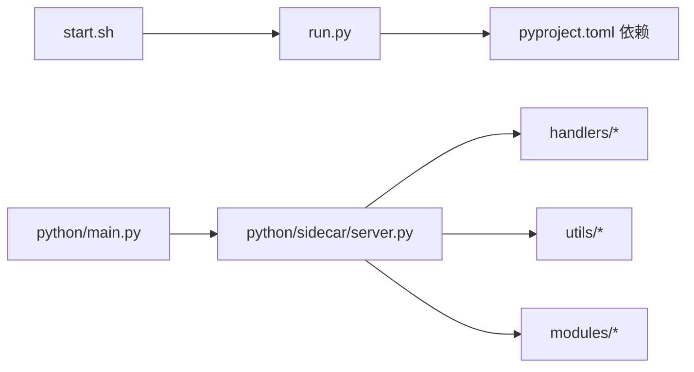

# 进程管理与服务编排

<cite>
**本文引用的文件**   
- [README.md](file://README.md)
- [run.py](file://run.py)
- [start.sh](file://start.sh)
- [python/main.py](file://python/main.py)
- [python/sidecar/server.py](file://python/sidecar/server.py)
</cite>

## 目录
1. [简介](#简介)
2. [项目结构](#项目结构)
3. [核心组件](#核心组件)
4. [架构总览](#架构总览)
5. [详细组件分析](#详细组件分析)
6. [依赖关系分析](#依赖关系分析)
7. [性能考虑](#性能考虑)
8. [故障排查指南](#故障排查指南)
9. [结论](#结论)
10. [附录](#附录)

## 简介
本指南面向 NoteAI 的生产环境进程管理，聚焦以下目标：
- systemd 服务单元配置与生命周期管理（启动、停止、重启、自动恢复）
- PM2 进程管理器使用、集群模式与负载均衡策略
- Python sidecar 与前端服务的健康检查与协调
- 日志轮转与归档、结构化日志收集与分析
- 资源监控与告警（CPU、内存、磁盘阈值）
- 优雅关闭与故障转移、连接池清理与状态同步
- 性能调优参数（线程池大小、连接数限制、缓存策略）
- 多环境差异化配置模板（开发、测试、生产）

NoteAI 采用 Tauri v2（Rust）作为桌面壳，Python sidecar 通过 stdin/stdout JSON-RPC 提供后端能力。开发入口为 run.py，脚本 start.sh 封装了依赖检查与构建/运行流程。

章节来源
- [README.md:155-203](file://README.md#L155-L203)
- [README.md:420-433](file://README.md#L420-L433)

## 项目结构
从进程与服务编排视角，关键路径如下：
- 应用外壳与前端：Tauri 工程与 webui
- Python sidecar 入口：python/main.py
- Sidecar 主服务：python/sidecar/server.py
- 开发/构建脚本：run.py、start.sh

图表来源
- [python/main.py:1-21](file://python/main.py#L1-L21)
- [python/sidecar/server.py:54-106](file://python/sidecar/server.py#L54-L106)
- [python/sidecar/server.py:216-255](file://python/sidecar/server.py#L216-L255)

章节来源
- [README.md:190-203](file://README.md#L190-L203)
- [README.md:420-433](file://README.md#L420-L433)

## 核心组件
- 开发启动器 run.py：解析 pyproject.toml 依赖并校验，检测 Tauri CLI，随后启动 cargo tauri dev。
- 一键脚本 start.sh：统一依赖安装与补齐逻辑，支持 --release 切换构建/开发模式。
- Python sidecar 入口 python/main.py：设置运行时环境变量，加载 sidecar.server.main。
- Sidecar 主服务 python/sidecar/server.py：实现 JSON-RPC 路由、后台任务、文件监听、RAG 索引预热与重建、优雅关闭等。

章节来源
- [run.py:44-122](file://run.py#L44-L122)
- [run.py:125-175](file://run.py#L125-L175)
- [start.sh:19-73](file://start.sh#L19-L73)
- [start.sh:75-82](file://start.sh#L75-L82)
- [python/main.py:1-21](file://python/main.py#L1-L21)
- [python/sidecar/server.py:54-106](file://python/sidecar/server.py#L54-L106)

## 架构总览
NoteAI 的进程模型由“Tauri 前端 + Python sidecar”组成，二者通过标准输入输出进行 JSON-RPC 通信。sidecar 负责业务处理（入库流水线、RAG、云同步、CLI Agent 桥接等），并通过 Watchdog 监听工作区变更触发自动转换与索引更新。

图表来源
- [run.py:146-175](file://run.py#L146-L175)
- [start.sh:75-82](file://start.sh#L75-L82)
- [python/sidecar/server.py:216-255](file://python/sidecar/server.py#L216-L255)
- [python/sidecar/server.py:570-595](file://python/sidecar/server.py#L570-L595)

## 详细组件分析

### 组件一：SidecarServer 类（进程内服务编排）
SidecarServer 是 Python sidecar 的核心，承担以下职责：
- 初始化各 Handler 并注册 RPC 路由
- 启动工作区文件监听与启动期同步
- 管理后台任务与作业状态
- 提供优雅关闭（停止监听、关闭线程池、清理缓存）

图表来源
- [python/sidecar/server.py:54-95](file://python/sidecar/server.py#L54-L95)
- [python/sidecar/server.py:97-125](file://python/sidecar/server.py#L97-L125)
- [python/sidecar/server.py:544-568](file://python/sidecar/server.py#L544-L568)

章节来源
- [python/sidecar/server.py:54-125](file://python/sidecar/server.py#L54-L125)
- [python/sidecar/server.py:544-568](file://python/sidecar/server.py#L544-L568)

### 组件二：Sidecar 主循环与优雅关闭
main 函数负责创建 SidecarServer、启动服务、预热模型、读取 stdin 请求并响应，最终在 finally 中执行优雅关闭。

图表来源
- [python/sidecar/server.py:570-595](file://python/sidecar/server.py#L570-L595)
- [python/sidecar/server.py:544-568](file://python/sidecar/server.py#L544-L568)

章节来源
- [python/sidecar/server.py:570-595](file://python/sidecar/server.py#L570-L595)

### 组件三：工作区变更处理与自动转换
Sidecar 通过 Watchdog 监听工作区变更，对 Markdown 与非 Markdown 文件分别处理：
- Markdown：自动分类、主题建议、Wiki 同步标记
- 非 Markdown：自动转换为 Markdown，记录结果并推送事件
- 防抖合并批量变更，避免频繁 I/O

图表来源
- [python/sidecar/server.py:298-339](file://python/sidecar/server.py#L298-L339)
- [python/sidecar/server.py:376-458](file://python/sidecar/server.py#L376-L458)
- [python/sidecar/server.py:513-539](file://python/sidecar/server.py#L513-L539)

章节来源
- [python/sidecar/server.py:298-339](file://python/sidecar/server.py#L298-L339)
- [python/sidecar/server.py:376-458](file://python/sidecar/server.py#L376-L458)
- [python/sidecar/server.py:513-539](file://python/sidecar/server.py#L513-L539)

### 组件四：启动期同步与 RAG 索引预热
启动时执行元数据合并、主题同步、链接修复、WIKI 同步；若启用 Ingest 与 RAG，则检查索引是否需要重建，必要时提示或自动重建。

图表来源
- [python/sidecar/server.py:221-255](file://python/sidecar/server.py#L221-L255)
- [python/sidecar/server.py:256-296](file://python/sidecar/server.py#L256-L296)

章节来源
- [python/sidecar/server.py:221-255](file://python/sidecar/server.py#L221-L255)
- [python/sidecar/server.py:256-296](file://python/sidecar/server.py#L256-L296)

### 组件五：开发启动器与一键脚本
- run.py：从 pyproject.toml 解析依赖，检查缺失包，提示 uv sync 或 pip install；检测 Tauri CLI 可用性，最终启动 cargo tauri dev。
- start.sh：封装 uv 依赖检查与补齐、RAG 依赖检测与补齐、复用 run.py 的依赖检查逻辑，支持 --release 切换构建/开发模式。

图表来源
- [start.sh:19-73](file://start.sh#L19-L73)
- [start.sh:75-82](file://start.sh#L75-L82)
- [run.py:44-122](file://run.py#L44-L122)
- [run.py:125-175](file://run.py#L125-L175)

章节来源
- [start.sh:19-73](file://start.sh#L19-L73)
- [start.sh:75-82](file://start.sh#L75-L82)
- [run.py:44-122](file://run.py#L44-L122)
- [run.py:125-175](file://run.py#L125-L175)

## 依赖关系分析
- 外部依赖：uv、Tauri CLI（cargo tauri 或 npx tauri）、Python 包（含 RAG 可选依赖）
- 内部依赖：sidecar.server 被 python/main.py 导入；server 内部依赖 handlers、utils、modules 等模块

图表来源
- [run.py:44-122](file://run.py#L44-L122)
- [start.sh:19-73](file://start.sh#L19-L73)
- [python/main.py:17-21](file://python/main.py#L17-L21)
- [python/sidecar/server.py:17-49](file://python/sidecar/server.py#L17-L49)

章节来源
- [run.py:44-122](file://run.py#L44-L122)
- [start.sh:19-73](file://start.sh#L19-L73)
- [python/main.py:17-21](file://python/main.py#L17-L21)
- [python/sidecar/server.py:17-49](file://python/sidecar/server.py#L17-L49)

## 性能考虑
- 线程与并发
  - 后台任务以守护线程执行，避免阻塞主循环
  - 启动期巡检与 RAG 索引重建均异步执行
- 缓存策略
  - TTLCache 用于 RPC/检索结果缓存，按工作区路径失效
  - 文件变更时主动失效缓存与全文索引
- 资源控制
  - OMP_NUM_THREADS 默认设置为 4（可在入口调整）
  - 优雅关闭时关闭 LLM 与检索执行器，清理集合缓存

章节来源
- [python/sidecar/server.py:184-214](file://python/sidecar/server.py#L184-L214)
- [python/sidecar/server.py:340-355](file://python/sidecar/server.py#L340-L355)
- [python/main.py:6-8](file://python/main.py#L6-L8)
- [python/sidecar/server.py:544-568](file://python/sidecar/server.py#L544-L568)

## 故障排查指南
- 依赖缺失
  - 现象：启动提示缺少依赖包或 RAG 组件依赖
  - 处理：根据提示执行 uv sync 或 pip install；确保 Tauri CLI 可用
- 索引未就绪
  - 现象：启动后收到“知识库索引尚未就绪，请手动重建索引”的事件
  - 处理：在 UI 中触发重建索引；确认工作区与权限正常
- 自动转换失败
  - 现象：watcher 日志中出现自动转换失败的警告
  - 处理：检查源文件格式与权限；查看 convert_failures 记录
- 优雅关闭问题
  - 现象：进程退出缓慢或资源未释放
  - 处理：确认 shutdown 流程执行；检查线程池与缓存清理

章节来源
- [run.py:102-122](file://run.py#L102-L122)
- [run.py:125-175](file://run.py#L125-L175)
- [python/sidecar/server.py:283-296](file://python/sidecar/server.py#L283-L296)
- [python/sidecar/server.py:505-511](file://python/sidecar/server.py#L505-L511)
- [python/sidecar/server.py:544-568](file://python/sidecar/server.py#L544-L568)

## 结论
NoteAI 的进程模型清晰稳定：Tauri 前端通过 JSON-RPC 与 Python sidecar 协作，sidecar 负责业务逻辑与后台任务，具备完善的启动期同步、文件监听、缓存与优雅关闭机制。在生产环境中，应结合系统级进程管理器（systemd/PM2）实现高可用与弹性伸缩，并配套日志与监控体系保障稳定性与可观测性。

## 附录

### systemd 服务单元配置要点（概念性指导）
- 服务类型：建议使用 Type=simple，由 python/main.py 直接作为主进程
- 工作目录：指向项目根目录，确保相对路径与工作区一致
- 用户与组：以专用低权限用户运行，限制文件系统访问范围
- 环境变量：按需设置 OMP_NUM_THREADS、KMP_DUPLICATE_LIB_OK 等
- 依赖与网络：After=network-online.target，Wants=network-online.target
- 重启策略：Restart=always，RestartSec=5，LimitNOFILE 提升文件描述符上限
- 资源限制：MemoryMax/CPUQuota 限制单实例资源占用
- 日志：StandardOutput=journal，配合 journalctl 查看
- 健康检查：ExecStartPre 执行轻量健康检查（如端口探测或短请求）

[本节为通用实践说明，不直接分析具体代码文件]

### PM2 进程管理要点（概念性指导）
- 启动方式：pm2 start python/main.py --name noteai-sidecar
- 集群模式：pm2 start python/main.py -i max --name noteai-sidecar-cluster
- 负载均衡：PM2 默认轮询分配新进程；可通过自定义路由实现更细粒度策略
- 环境变量：通过 pm2 ecosystem 配置文件注入不同环境差异
- 日志：pm2 logs --lines 200，结合 logrotate 或 PM2 内置日志轮转
- 监控：集成 PM2 Plus 或使用系统指标导出至 Prometheus/Grafana

[本节为通用实践说明，不直接分析具体代码文件]

### 健康检查与协调（概念性指导）
- 进程健康：通过 HTTP 探针或 JSON-RPC 短接口返回存活状态
- 侧车健康：定期自检（索引状态、线程池活跃、缓存命中率）
- 前端协调：前端周期性拉取健康状态，异常时提示或重试

[本节为通用实践说明，不直接分析具体代码文件]

### 日志轮转与归档（概念性指导）
- 应用日志：统一输出到标准输出，交由 systemd journal 或 PM2 管理
- 轮转策略：按大小/时间切分，保留周期与压缩归档
- 结构化日志：包含时间戳、级别、模块、工作区路径、任务 ID 等字段
- 采集分析：对接 ELK/Loki，建立索引与看板

[本节为通用实践说明，不直接分析具体代码文件]

### 资源监控与告警（概念性指导）
- 指标：CPU、内存、磁盘使用率、I/O 等待、线程数、GC 次数
- 阈值：依据负载基线设定动态阈值，避免误报
- 告警渠道：邮件、IM、短信等多通道通知
- 可视化：Grafana 面板展示趋势与热点

[本节为通用实践说明，不直接分析具体代码文件]

### 优雅关闭与故障转移（概念性指导）
- 优雅关闭：停止接收新请求，完成进行中任务，关闭线程池与缓存
- 故障转移：多副本部署，健康检查失败自动剔除，流量切换到健康实例
- 状态同步：持久化关键状态（作业、索引、配置），重启后快速恢复

[本节为通用实践说明，不直接分析具体代码文件]

### 性能调优参数（概念性指导）
- 线程池：根据 CPU 核数与 IO 特性调整最大线程数
- 连接数：数据库/向量库连接池上限与空闲回收策略
- 缓存：TTL 与容量上限，按工作区分片避免冲突
- 批处理：入库与索引重建采用批处理与断点续跑

[本节为通用实践说明，不直接分析具体代码文件]

### 多环境配置模板（概念性指导）
- 开发：开启调试日志、禁用部分重型功能（如 RAG 预热）
- 测试：固定种子数据、缩短超时、启用更多断言
- 生产：最小化日志级别、严格资源限制、启用监控与告警

[本节为通用实践说明，不直接分析具体代码文件]