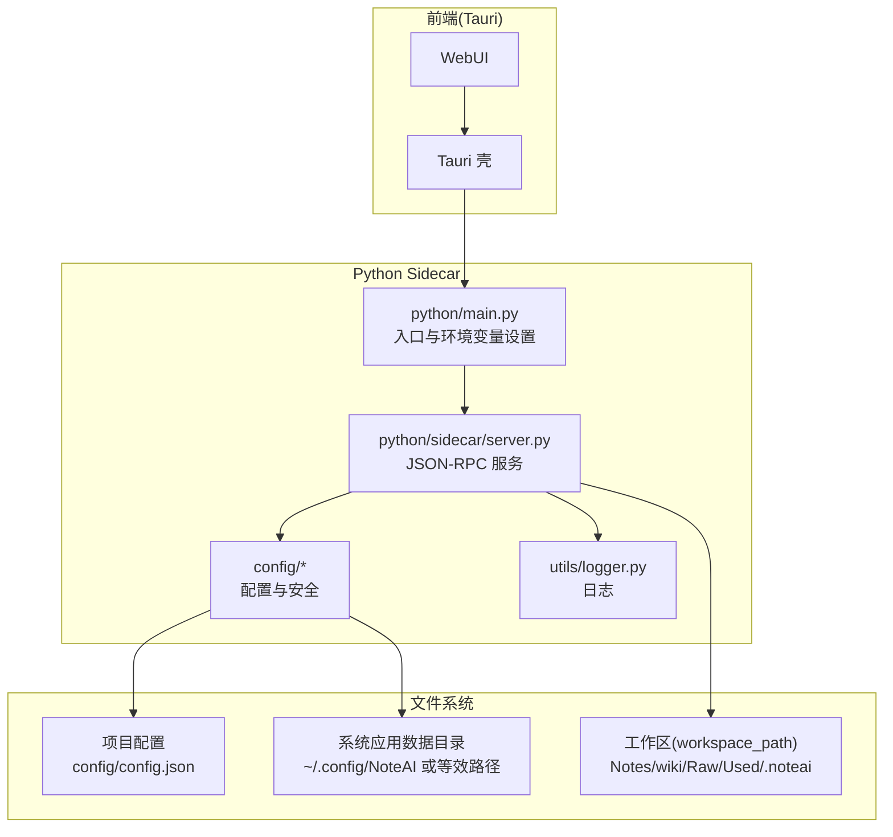
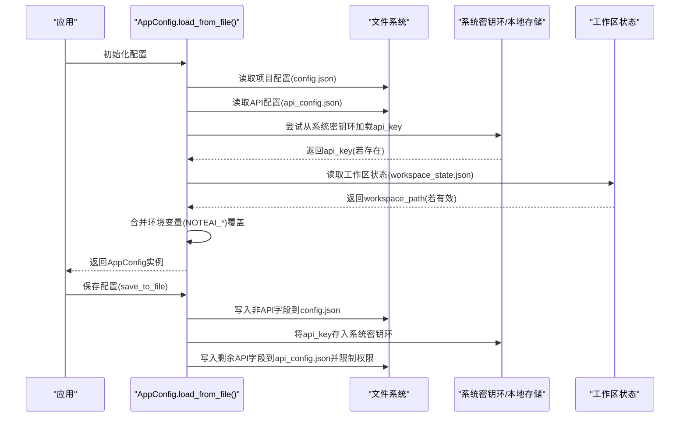
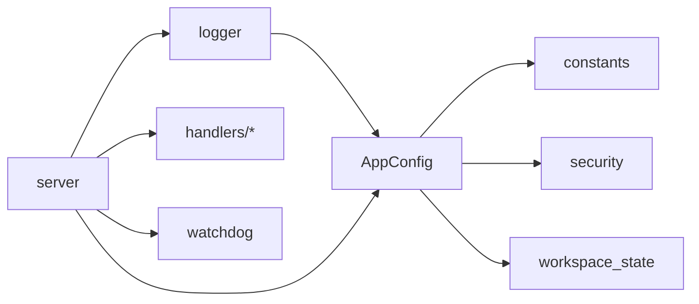

# 配置与部署

<cite>
**本文引用的文件**   
- [config/settings.py](file://config/settings.py)
- [config/app_config.py](file://config/app_config.py)
- [config/constants.py](file://config/constants.py)
- [config/security.py](file://config/security.py)
- [config/config.json.example](file://config/config.json.example)
- [config/workspace_state.py](file://config/workspace_state.py)
- [python/main.py](file://python/main.py)
- [python/sidecar/server.py](file://python/sidecar/server.py)
- [utils/logger.py](file://utils/logger.py)
- [run.py](file://run.py)
- [start.sh](file://start.sh)
</cite>

## 目录
1. [简介](#简介)
2. [项目结构](#项目结构)
3. [核心组件](#核心组件)
4. [架构总览](#架构总览)
5. [详细组件分析](#详细组件分析)
6. [依赖关系分析](#依赖关系分析)
7. [性能考虑](#性能考虑)
8. [故障排查指南](#故障排查指南)
9. [结论](#结论)
10. [附录](#附录)

## 简介
本章节面向 NoteAI 的配置系统与生产/开发部署，覆盖以下主题：
- 应用配置系统：settings.py、app_config.py、环境变量管理、配置文件格式与优先级
- 安全配置最佳实践：API Key 管理、权限控制、数据加密（基于系统密钥环）
- 生产环境部署方案：容器化建议、进程管理、日志收集
- 性能调优参数：内存管理、并发控制、缓存策略
- 跨平台部署指南：Windows、macOS、Linux 的特定路径与注意事项
- 运维方案：监控告警、故障恢复、备份恢复

## 项目结构
NoteAI 采用 Tauri + Python sidecar 的混合架构。前端由 Tauri 壳加载 webui，后端通过 JSON-RPC over stdin/stdout 提供能力。配置集中在 config 包内，运行时状态与敏感信息分别落盘到用户态的系统应用数据目录。

图示来源
- [python/main.py:1-21](file://python/main.py#L1-L21)
- [python/sidecar/server.py:1-120](file://python/sidecar/server.py#L1-L120)
- [config/app_config.py:1-120](file://config/app_config.py#L1-L120)
- [config/constants.py:1-52](file://config/constants.py#L1-L52)
- [utils/logger.py:1-126](file://utils/logger.py#L1-L126)

章节来源
- [run.py:1-175](file://run.py#L1-L175)
- [start.sh:1-82](file://start.sh#L1-L82)

## 核心组件
- 配置模型与加载器：AppConfig 负责定义所有配置项、加载顺序、校验与持久化
- 常量与路径：constants.py 定义项目根、配置路径、系统应用数据目录与工作区默认文件夹
- 安全工具：security.py 提供受限文件权限写入
- 工作区状态：workspace_state.py 维护 workspace_path 等运行期状态，支持原子写入与备份恢复
- 日志：utils/logger.py 提供可旋转的文件日志与控制台输出，支持 NOTEAI_LOG_DIR 覆盖
- 启动脚本：run.py 与 start.sh 负责依赖检查与 Tauri 开发/构建流程

章节来源
- [config/app_config.py:1-396](file://config/app_config.py#L1-L396)
- [config/constants.py:1-52](file://config/constants.py#L1-L52)
- [config/security.py:1-12](file://config/security.py#L1-L12)
- [config/workspace_state.py:1-198](file://config/workspace_state.py#L1-L198)
- [utils/logger.py:1-126](file://utils/logger.py#L1-L126)
- [run.py:1-175](file://run.py#L1-L175)
- [start.sh:1-82](file://start.sh#L1-L82)

## 架构总览
下图展示了配置加载、保存与 API Key 管理的端到端流程，以及环境变量与文件的优先级关系。

图示来源
- [config/app_config.py:212-396](file://config/app_config.py#L212-L396)
- [config/constants.py:1-52](file://config/constants.py#L1-L52)
- [config/workspace_state.py:1-198](file://config/workspace_state.py#L1-L198)

## 详细组件分析

### 配置系统：AppConfig 与 settings
- 配置项分类
  - LLM 相关：api_key、api_base、model_name、temperature、max_tokens、disable_thinking、max_context_tokens
  - 工作区与路径：workspace_path、log_path、NOTES_FOLDER、ABSTRACT_FOLDER、RAW_FOLDER、USED_FOLDER、WORKSPACE_APP_FOLDER、RAG_INDEX_FOLDER
  - 处理与性能：batch_size、timeout、max_retries、max_content_length、max_html_length、max_chunk_length、min_chunk_size
  - 界面与国际化：theme、theme_preference、font_size、accent_color、sidebar_font_family、preview_font_family、typography、window_width、window_height、locale
  - Web/下载/集成：web_ai_assist、web_include_images、conv_ai_assist、web_save_path、download_mode、conv_save_path、integration_source_path、integration_output_path、integration_strategy
  - 自动归档与主题：auto_topic、topic_auto_assign_threshold、topic_list
  - RAG 检索：rag_enabled、rag_hyde_enabled、rag_hyde_threshold、rag_rerank_enabled、rag_rerank_skip_score、rag_dense_weight、rag_top_k、rag_top_k_tags、rag_error_cooldown_seconds
  - 助手与 CLI：assistant_agent_mode、cli_agent_id
- 加载优先级
  - 环境变量 > API 配置(api_config.json) > 项目配置(config.json) > 默认值
  - 工作区路径优先从工作区状态文件恢复，再回退到空
- 校验与容错
  - validate_api_config：校验 api_key、base、model、temperature、max_tokens 范围
  - validate_context_config：校验 max_context_tokens 范围
  - check_content_within_context：估算 token 数，必要时调用 LLM 进行摘要/截断
- 持久化
  - save_to_file：非 API 字段写入项目配置；API Key 写入系统密钥环；其余 API 字段写入系统应用数据目录下的 api_config.json，并限制文件权限为仅所有者可读写
- 线程安全
  - 使用锁保护属性读写与快照导出

章节来源
- [config/app_config.py:28-396](file://config/app_config.py#L28-L396)
- [config/settings.py:1-41](file://config/settings.py#L1-L41)

#### 配置项参考表（节选）
- LLM 与上下文
  - api_key: 字符串，来自系统密钥环或 api_config.json
  - api_base: 字符串，默认 https://api.openai.com/v1
  - model_name: 字符串，默认 gpt-4o
  - temperature: 浮点，范围 0.0-2.0
  - max_tokens: 整数，范围 100-128000
  - max_context_tokens: 整数，范围 1000-1000000
- 工作区与日志
  - workspace_path: 字符串，推荐通过工作区状态文件恢复
  - log_path: 字符串，默认系统应用数据目录/logs
- 处理与性能
  - batch_size: 整数，默认 5
  - timeout: 整数，默认 30
  - max_retries: 整数，默认 3
  - max_content_length/max_html_length/max_chunk_length/min_chunk_size: 整数，用于内容切分与长度限制
- 界面与国际化
  - theme/theme_preference/font_size/accent_color/sidebar_font_family/preview_font_family/window_width/window_height/locale: 字符串/整数字段
- RAG 检索
  - rag_enabled/hyde/rerank/dense_weight/top_k/top_k_tags/error_cooldown_seconds: 布尔/浮点/整数组合

章节来源
- [config/app_config.py:28-120](file://config/app_config.py#L28-L120)
- [config/config.json.example:1-37](file://config/config.json.example#L1-L37)

### 环境变量与配置文件格式
- 环境变量映射（覆盖顺序高于文件）
  - NOTEAI_API_KEY → api_key
  - NOTEAI_API_BASE → api_base
  - NOTEAI_MODEL_NAME → model_name
  - NOTEAI_TEMPERATURE → temperature
  - NOTEAI_MAX_TOKENS → max_tokens
  - NOTEAI_MAX_CONTEXT → max_context_tokens
  - NOTEAI_WORKSPACE_PATH → workspace_path
  - NOTEAI_LOG_DIR → 日志目录覆盖（在日志模块中生效）
- 配置文件格式
  - 项目配置：config/config.json（非 API 字段），示例见 config/config.json.example
  - API 配置：系统应用数据目录/api_config.json（仅非密钥字段），api_key 由系统密钥环管理
- 类型转换
  - temperature 强制 float；max_tokens、max_context_tokens 强制 int；其他保持字符串

章节来源
- [config/app_config.py:261-311](file://config/app_config.py#L261-L311)
- [utils/logger.py:61-79](file://utils/logger.py#L61-L79)
- [config/config.json.example:1-37](file://config/config.json.example#L1-L37)

### 安全配置与 API Key 管理
- 系统密钥环优先
  - 启动时优先从系统密钥环加载 api_key；失败则回退到本地加密存储（仅混淆，不替代系统密钥链）
- 文件权限收紧
  - 保存 API 配置后对 api_config.json 执行 0600 权限限制，避免被其他用户读取
- 工作区状态原子写入与备份
  - 使用临时文件+fsync+移动实现原子写入，并在覆盖前创建 .bak 备份，异常时可恢复

章节来源
- [config/app_config.py:237-249](file://config/app_config.py#L237-L249)
- [config/app_config.py:357-383](file://config/app_config.py#L357-L383)
- [config/security.py:1-12](file://config/security.py#L1-L12)
- [config/workspace_state.py:26-61](file://config/workspace_state.py#L26-L61)
- [config/workspace_state.py:108-126](file://config/workspace_state.py#L108-L126)

### 工作区与路径管理
- 系统应用数据目录
  - macOS: ~/Library/Application Support/NoteAI
  - Windows: %APPDATA%/NoteAI（或用户主目录/AppData/Roaming）
  - Linux: ~/.config/NoteAI
- 关键路径
  - PROJECT_CONFIG_PATH: 项目根/config/config.json
  - WORKSPACE_STATE_FILE: 系统应用数据目录/workspace_state.json
  - API_CONFIG_FILE: 系统应用数据目录/api_config.json
- 工作区初始化
  - setup_workspace_folders 会在工作区内创建 Notes、wiki、Raw、Used、.noteai/logs、.noteai/rag_index 等子目录

章节来源
- [config/constants.py:1-52](file://config/constants.py#L1-L52)
- [config/app_config.py:146-175](file://config/app_config.py#L146-L175)

### 日志系统
- 日志级别与输出
  - 控制台 INFO 级别；文件 DEBUG 级别，按大小轮转，保留最近 5 份
- 日志目录解析顺序
  - NOTEAI_LOG_DIR 环境变量 > config.log_path > 临时目录/NoteAI/logs
- 旧日志清理
  - 超过 30 天的日志文件会被清理

章节来源
- [utils/logger.py:1-126](file://utils/logger.py#L1-L126)

### 启动与进程管理
- 开发模式
  - run.py 检查依赖与 Tauri CLI，随后启动 cargo tauri dev
  - start.sh 封装 uv 依赖同步、RAG 依赖补齐与 Tauri 开发/构建
- Sidecar 进程
  - python/main.py 作为 Tauri 加载的 sidecar 入口，设置 KMP_DUPLICATE_LIB_OK 与 OMP_NUM_THREADS，然后启动 sidecar.server.main()
- 进程间通信
  - 通过 stdin/stdout JSON-RPC 与前端交互，sidecar 内部使用 RpcRouter 分发请求

章节来源
- [run.py:1-175](file://run.py#L1-L175)
- [start.sh:1-82](file://start.sh#L1-L82)
- [python/main.py:1-21](file://python/main.py#L1-L21)
- [python/sidecar/server.py:1-120](file://python/sidecar/server.py#L1-L120)

## 依赖关系分析
- 模块耦合
  - AppConfig 依赖 constants、security、keyring_store、workspace_state
  - logger 依赖 config.config 获取日志目录
  - server 依赖 config、handlers、utils、watchdog 等
- 外部依赖
  - RAG 组件可选：bm25s、fastembed、zvec、FlagEmbedding/torch（macOS 需兼容 libomp）
  - 文件监听：watchdog

图示来源
- [config/app_config.py:1-120](file://config/app_config.py#L1-L120)
- [utils/logger.py:1-60](file://utils/logger.py#L1-L60)
- [python/sidecar/server.py:1-120](file://python/sidecar/server.py#L1-L120)

章节来源
- [config/app_config.py:1-120](file://config/app_config.py#L1-L120)
- [utils/logger.py:1-60](file://utils/logger.py#L1-L60)
- [python/sidecar/server.py:1-120](file://python/sidecar/server.py#L1-L120)

## 性能考虑
- 并发与线程
  - AppConfig 属性读写加锁，避免并发写冲突
  - Sidecar 使用 TTLCache 缓存热点结果，降低重复计算
- 资源与内存
  - 通过 max_content_length、max_html_length、max_chunk_length、min_chunk_size 控制文本处理规模
  - OMP_NUM_THREADS 设置为 4，平衡向量模型与 CPU 占用
- 网络与重试
  - timeout、max_retries 控制外部 API 调用稳定性
- 日志 I/O
  - 轮转日志避免单文件过大，定期清理旧日志减少磁盘压力

章节来源
- [config/app_config.py:100-110](file://config/app_config.py#L100-L110)
- [python/sidecar/server.py:75-79](file://python/sidecar/server.py#L75-L79)
- [config/app_config.py:49-57](file://config/app_config.py#L49-L57)
- [python/main.py:6-8](file://python/main.py#L6-L8)
- [utils/logger.py:81-91](file://utils/logger.py#L81-L91)

## 故障排查指南
- 配置加载失败
  - 现象：警告日志提示加载失败，回退默认配置
  - 排查：确认 config.json 与 api_config.json 语法正确、可读；检查系统密钥环是否可用
- 保存配置失败
  - 现象：无写入权限或系统目录不可写
  - 排查：确保系统应用数据目录可写；检查文件权限
- 工作区状态损坏
  - 现象：无法加载 workspace_state.json
  - 处理：自动尝试从 .json.bak 恢复；如仍失败，清空状态重新选择工作区
- 日志无法写入
  - 现象：无法创建日志目录或写入失败
  - 处理：设置 NOTEAI_LOG_DIR 指向可写目录；检查目标路径权限
- RAG 依赖缺失
  - 现象：启动提示缺少 bm25s/fastembed/zvec/FlagEmbedding
  - 处理：运行 uv sync --extra dev --extra rag 或使用 start.sh 自动补齐

章节来源
- [config/app_config.py:218-236](file://config/app_config.py#L218-L236)
- [config/app_config.py:348-383](file://config/app_config.py#L348-L383)
- [config/workspace_state.py:87-126](file://config/workspace_state.py#L87-L126)
- [utils/logger.py:61-79](file://utils/logger.py#L61-L79)
- [run.py:108-122](file://run.py#L108-L122)

## 结论
NoteAI 的配置系统以 AppConfig 为核心，结合环境变量、项目配置与系统密钥环，实现了灵活且安全的配置管理。配合工作区状态原子写入、受限文件权限与完善的日志体系，可在多平台上稳定运行。通过合理的性能参数与依赖管理，能够兼顾功能完整性与运行效率。

## 附录

### 环境变量清单
- NOTEAI_API_KEY：LLM API Key（优先于文件）
- NOTEAI_API_BASE：LLM API 基础地址
- NOTEAI_MODEL_NAME：模型名称
- NOTEAI_TEMPERATURE：采样温度
- NOTEAI_MAX_TOKENS：最大生成 token 数
- NOTEAI_MAX_CONTEXT：最大上下文 token 数
- NOTEAI_WORKSPACE_PATH：工作区路径（可从工作区状态恢复）
- NOTEAI_LOG_DIR：日志目录覆盖

章节来源
- [config/app_config.py:261-275](file://config/app_config.py#L261-L275)
- [utils/logger.py:61-67](file://utils/logger.py#L61-L67)

### 配置文件位置与格式
- 项目配置：config/config.json（非 API 字段），参考 config/config.json.example
- API 配置：系统应用数据目录/api_config.json（不含 api_key）
- 工作区状态：系统应用数据目录/workspace_state.json

章节来源
- [config/constants.py:5-24](file://config/constants.py#L5-L24)
- [config/config.json.example:1-37](file://config/config.json.example#L1-L37)

### 跨平台部署要点
- macOS
  - 系统应用数据目录：~/Library/Application Support/NoteAI
  - 注意 libomp 冲突：已设置 KMP_DUPLICATE_LIB_OK=TRUE
- Windows
  - 系统应用数据目录：%APPDATA%/NoteAI
  - 建议使用 PowerShell 或 CMD 设置环境变量
- Linux
  - 系统应用数据目录：~/.config/NoteAI
  - 可通过 systemd 或 supervisord 管理 sidecar 进程

章节来源
- [config/constants.py:9-22](file://config/constants.py#L9-L22)
- [python/main.py:6-8](file://python/main.py#L6-L8)

### 容器化与进程管理建议
- 容器化
  - 将项目根与系统应用数据目录挂载为卷，保证配置与日志持久化
  - 通过环境变量注入 API Key 与模型参数，避免将密钥写入镜像
- 进程管理
  - 使用进程管理器（如 systemd、supervisord、PM2 等）托管 python/main.py 侧车进程
  - 配置日志轮转与清理策略，避免磁盘占满
- 监控与告警
  - 采集 noteai.log 中的错误与警告事件，设置阈值告警
  - 关注工作区状态文件是否存在与可读，异常时触发恢复流程

[本节为通用指导，无需代码来源]