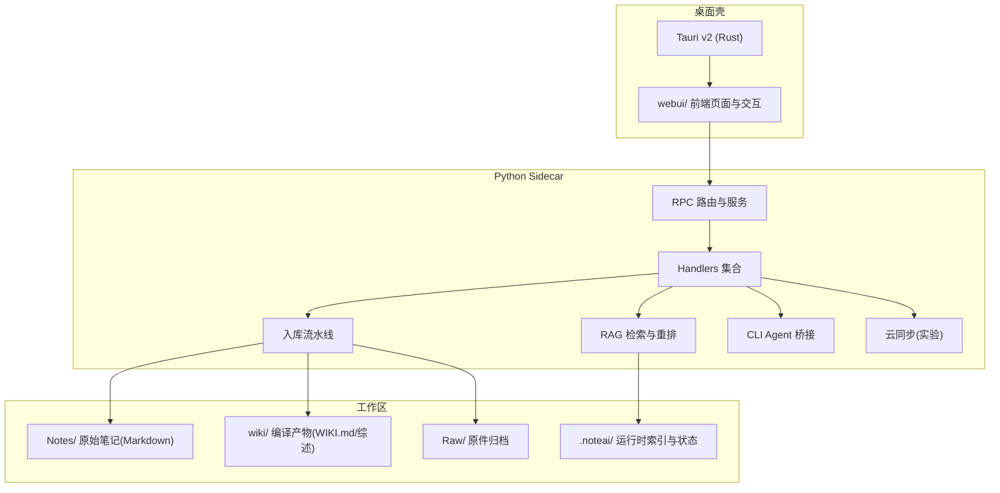
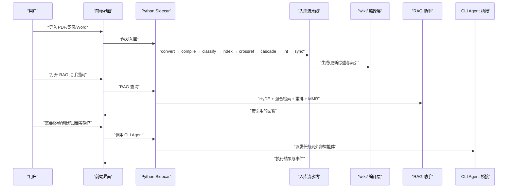
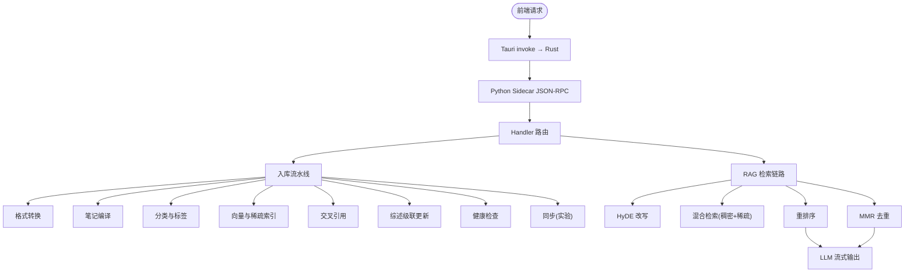

# 产品定位与价值主张

<cite>
**本文引用的文件**
- [README.md](file://README.md)
- [documents/PRD.md](file://documents/PRD.md)
- [AGENTS.md](file://AGENTS.md)
</cite>

## 目录
1. [引言](#引言)
2. [项目结构](#项目结构)
3. [核心组件](#核心组件)
4. [架构总览](#架构总览)
5. [详细组件分析](#详细组件分析)
6. [依赖关系分析](#依赖关系分析)
7. [性能考量](#性能考量)
8. [故障排查指南](#故障排查指南)
9. [结论](#结论)
10. [附录](#附录)

## 引言
NoteAI 是一款 AI 原生的个人知识库桌面应用，围绕“采集 → 整理 → 研究 → 问答”的闭环设计，帮助用户把散落的资料沉淀为可检索、可演进的知识资产。其核心理念是“Stop re-deriving, start compiling”，强调将知识编译进 wiki，持续增值，而非每次从零推导或临时 RAG。灵感来源于 Karpathy LLM Wiki 的设计思想：以“编译”代替“重复推导”，让知识随时间复利增长。

与传统笔记工具（如 Obsidian）和通用 AI 工具（如 Claude）相比，NoteAI 的优势在于：
- 统一工作流：在同一应用中完成采集、整理、研究与问答，避免信息孤岛。
- 本地优先：Tauri v2 + Python sidecar，数据在本地，隐私可控。
- 自动入库流水线：转换、编译、分类、索引、交叉引用、综述生成与健康检查，支持断点续跑。
- 双模式助手：RAG 助手提供基于知识库的问答；CLI Agent 桥接外部智能体执行文件操作。
- 三层知识架构：Notes（原始 Markdown）、wiki（AI 编译层）、Raw（原件归档），职责清晰、可追溯。

面向不同用户群体：
- 知识工作者：减少重复劳动，快速从海量资料中提炼要点并建立主题体系。
- 研究人员：通过综述自动生成与级联更新，保持领域知识的时效性与一致性。
- 学生：降低整理门槛，聚焦学习与思考，同时获得可靠的引用来源。

[本节不直接分析具体代码文件]

## 项目结构
NoteAI 采用 Tauri v2 作为桌面壳，前端使用 HTML/CSS/原生 JS 与 Tiptap 编辑器，后端由 Python sidecar 提供 JSON-RPC 服务，涵盖入库流水线、RAG、CLI Agent 桥接与云同步等能力。仓库根目录 README 提供了功能概览、架构图与工作区布局说明；PRD 明确了产品定位、关键决策与非目标；AGENTS.md 给出了运行边界与约定。

图表来源
- [README.md:155-176](file://README.md#L155-L176)
- [README.md:384-406](file://README.md#L384-L406)
- [AGENTS.md:18-32](file://AGENTS.md#L18-L32)

章节来源
- [README.md:155-203](file://README.md#L155-L203)
- [README.md:384-433](file://README.md#L384-L433)
- [AGENTS.md:18-32](file://AGENTS.md#L18-L32)

## 核心组件
- 三层知识架构：Notes（不可变来源）、wiki（AI 编译层）、Raw（原件归档）。该分层确保事实来源清晰、可追溯，且便于自动化处理。
- 入库流水线：schema → convert → compile → classify → index → crossref → cascade → lint → sync，支持断点续跑与后台异步任务。
- RAG 助手：HyDE + 混合检索（稠密+稀疏）+ 重排序 + MMR，问答模式与助手模式分离，RAG 不做文件操作。
- CLI Agent 桥接：在 vault 内调度外部智能体（Claude Code/OpenCode/Codex/Gemini），自动生成 AGENTS.md，实时事件回传。
- 统一 Inbox：聚合入库状态、待确认项、失败项与健康问题，提供重试与忽略动作。
- 健康度指标：综述覆盖率、均链数、Lint 计数等，帮助评估知识库质量。

章节来源
- [README.md:24-43](file://README.md#L24-L43)
- [README.md:172-176](file://README.md#L172-L176)
- [README.md:113-127](file://README.md#L113-L127)
- [README.md:128-136](file://README.md#L128-L136)
- [README.md:40-43](file://README.md#L40-L43)
- [documents/PRD.md:25-39](file://documents/PRD.md#L25-L39)
- [documents/PRD.md:142-154](file://documents/PRD.md#L142-L154)

## 架构总览
NoteAI 的核心循环是“丢资料 → AI 整理（分类/标签/链接）→ AI 编译（综述/WIKI）→ CLI agent 操作”。三大支柱为整理、编译与 CLI Agent；RAG 定位为辅助检索，不是核心支柱。这一设计确保了知识资产的持续积累与可操作化。

图表来源
- [documents/PRD.md:25-39](file://documents/PRD.md#L25-L39)
- [README.md:172-176](file://README.md#L172-L176)
- [README.md:113-127](file://README.md#L113-L127)
- [README.md:128-136](file://README.md#L128-L136)

章节来源
- [documents/PRD.md:25-39](file://documents/PRD.md#L25-L39)
- [README.md:172-176](file://README.md#L172-L176)

## 详细组件分析

### “Stop re-deriving, start compiling”理念与实践
- 理念来源：Karpathy LLM Wiki 倡导“停止重复推导，开始编译知识”，将知识编译进 wiki，使其随时间复利增长。
- 实践路径：
  - 自动入库流水线将原始资料转换为结构化 Markdown，并生成综述与索引。
  - wiki 作为 AI 编译层，承载主题目录、综述与日志，不建设实体 Wiki。
  - 级联更新机制保证新资料入库时，受影响的综述与索引得到及时维护。
- 价值体现：
  - 减少重复劳动，提升知识复用率。
  - 形成稳定的知识基座，支撑高质量问答与研究。

章节来源
- [README.md:14-16](file://README.md#L14-L16)
- [README.md:243-245](file://README.md#L243-L245)
- [documents/PRD.md:16-21](file://documents/PRD.md#L16-L21)
- [AGENTS.md:32-32](file://AGENTS.md#L32-L32)

### 与传统笔记应用（Obsidian）和 AI 工具（Claude）的区别与优势
- 传统组合痛点：
  - Obsidian 记笔记 + ChatGPT/Claude 查资料 = 两套系统，每次提问从零解释背景，洞见难以回流至库。
- NoteAI 的优势：
  - 统一采集、整理、研究、问答流程，避免信息孤岛。
  - 自动入库流水线与 wiki 编译层，使知识持续增值。
  - RAG 助手基于知识库回答并提供引用，CLI Agent 负责文件操作，职责清晰。

章节来源
- [README.md:18-22](file://README.md#L18-L22)
- [README.md:247-258](file://README.md#L247-L258)
- [documents/PRD.md:19-21](file://documents/PRD.md#L19-L21)

### 为什么需要统一采集、整理、研究、问答流程
- 现有工具链的信息孤岛导致：
  - 每次问答需重新解释上下文，效率低。
  - 对话洞见难以沉淀为可检索的知识资产。
- NoteAI 的统一流程：
  - 采集：PDF/网页/Word 一键导入，自动转 Markdown，原件归档。
  - 整理：AI 建议主题与标签，双向链接发现，待确认项集中处理。
  - 研究：综述自动生成与级联更新，主题体系持续完善。
  - 问答：RAG 助手基于知识库回答，划词检索即时补充证据。

章节来源
- [README.md:24-30](file://README.md#L24-L30)
- [README.md:305-340](file://README.md#L305-L340)
- [documents/PRD.md:142-154](file://documents/PRD.md#L142-L154)

### 面向不同用户群体的独特价值
- 知识工作者：
  - 降低整理成本，快速从资料中提炼要点，构建主题体系。
  - 通过综述与图谱，把握领域全貌与热点。
- 研究人员：
  - 综述自动生成与级联更新，保持领域知识时效性。
  - 引用完整性保障，提高研究可信度。
- 学生：
  - 简化资料管理，专注学习过程。
  - 划词检索与联网补充，提升学习效率。

章节来源
- [README.md:24-30](file://README.md#L24-L30)
- [documents/PRD.md:13-17](file://documents/PRD.md#L13-L17)

### 使用场景与案例
- 场景一：论文阅读与综述生成
  - 导入多篇 PDF → 自动转换与编译 → 二级主题综述自动生成 → 问答助手基于综述与笔记回答。
- 场景二：跨领域知识整合
  - 批量网页下载 → 自动标签与主题建议 → 双向链接发现 → 图谱可视化与合并候选进入 Inbox。
- 场景三：日常研究与写作
  - 划词检索 → 先快速解释 → 再补本地引用或联网证据 → 必要时通过 CLI Agent 移动/归档资料。

章节来源
- [README.md:305-340](file://README.md#L305-L340)
- [documents/PRD.md:102-139](file://documents/PRD.md#L102-L139)

## 依赖关系分析
NoteAI 的依赖关系体现在前后端通信、入库流水线与 RAG 检索链路等方面。前端通过 Tauri invoke 调用 Rust，Rust 启动 Python sidecar，JSON-RPC 分发至各 handler；入库流水线按顺序执行多个阶段；RAG 检索包含 HyDE、混合检索、重排序与 MMR。

图表来源
- [README.md:155-176](file://README.md#L155-L176)
- [README.md:172-176](file://README.md#L172-L176)
- [README.md:113-127](file://README.md#L113-L127)
- [AGENTS.md:30-32](file://AGENTS.md#L30-L32)

章节来源
- [README.md:155-176](file://README.md#L155-L176)
- [AGENTS.md:30-32](file://AGENTS.md#L30-L32)

## 性能考量
- 入库流水线支持断点续跑与后台异步任务，避免阻塞用户操作。
- RAG 检索采用混合策略（稠密+稀疏）与重排序，兼顾召回与精度。
- Chunk 相似度地图仅保留 Top-K 近邻，增量更新，避免全库重算。
- 健康检查与 Lint 提供质量门禁，防止低质内容污染知识库。

章节来源
- [README.md:172-176](file://README.md#L172-L176)
- [README.md:113-127](file://README.md#L113-L127)
- [documents/PRD.md:225-234](file://documents/PRD.md#L225-L234)

## 故障排查指南
- 统一 Inbox：聚合入库失败、综述失败、待确认项与健康问题，支持逐项重试或忽略。
- 转换可靠性：质量门禁、源文件哈希幂等、统一 Raw 归档、长文不截断；扫描型 PDF 提取失败进入 Inbox，不做 OCR。
- RAG 引用完整性：默认进入工作区 RAG，联网仅显式触发；可引用来源连续编号，仅显示实际出现的有效来源。

章节来源
- [documents/PRD.md:142-154](file://documents/PRD.md#L142-L154)
- [documents/PRD.md:155-162](file://documents/PRD.md#L155-L162)
- [documents/PRD.md:84-86](file://documents/PRD.md#L84-L86)

## 结论
NoteAI 以“Stop re-deriving, start compiling”为核心哲学，通过统一的采集、整理、研究与问答流程，解决现有工具链中的信息孤岛问题。其三层知识架构、自动入库流水线与 RAG 助手共同构建了可持续增值的个人知识库。面向知识工作者、研究人员与学生，NoteAI 显著降低了整理成本，提升了知识复用率与研究可信度。未来将继续从“批处理工具”进化为“持续维护的知识编译器”。

[本节不直接分析具体代码文件]

## 附录
- 工作区布局：Notes（原始 Markdown）、wiki（AI 编译层）、Raw（原件归档）、.noteai（运行时）、.ai_memory（用户画像与规则）。
- 技术栈：Tauri v2、HTML/CSS/原生 JS、Tiptap、Python sidecar、zvec + bm25s、fastembed、FlagReranker、PyMuPDF、mammoth、html2text、jieba。
- 开发与环境：uv 管理依赖，pytest 测试，run.py 启动 Tauri dev 模式（含 sidecar）。

章节来源
- [README.md:141-153](file://README.md#L141-L153)
- [README.md:178-189](file://README.md#L178-L189)
- [README.md:190-212](file://README.md#L190-L212)
- [AGENTS.md:32-42](file://AGENTS.md#L32-L42)