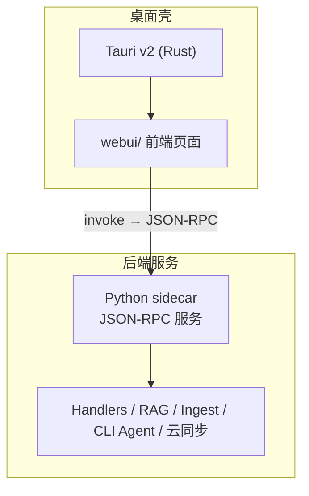
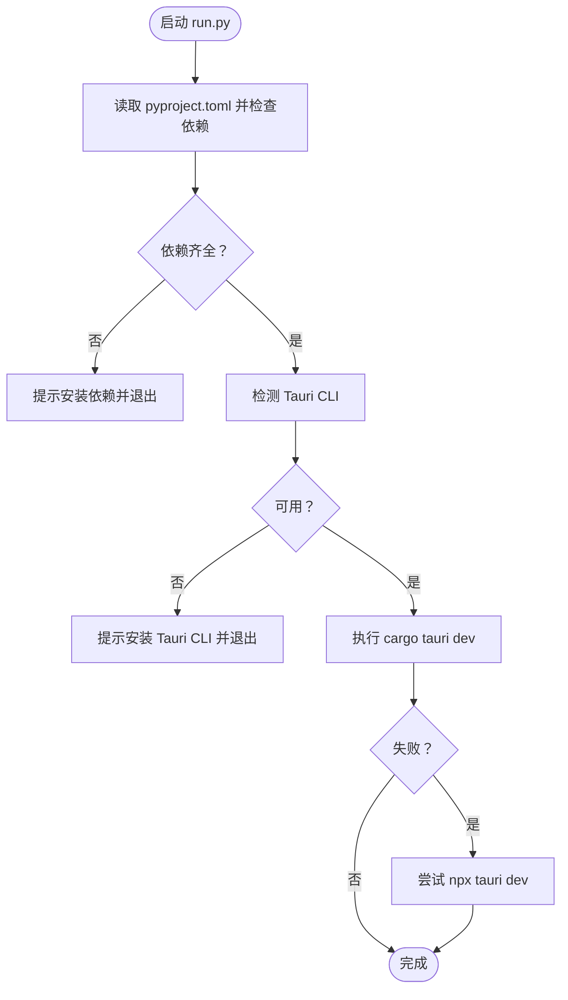
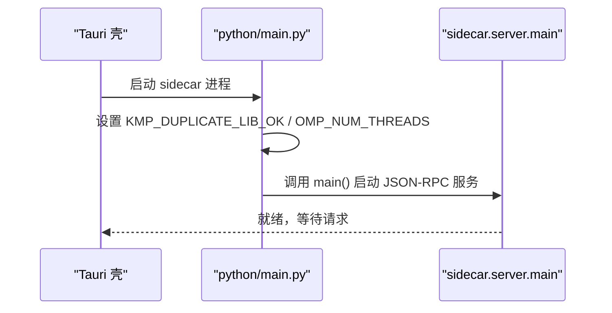
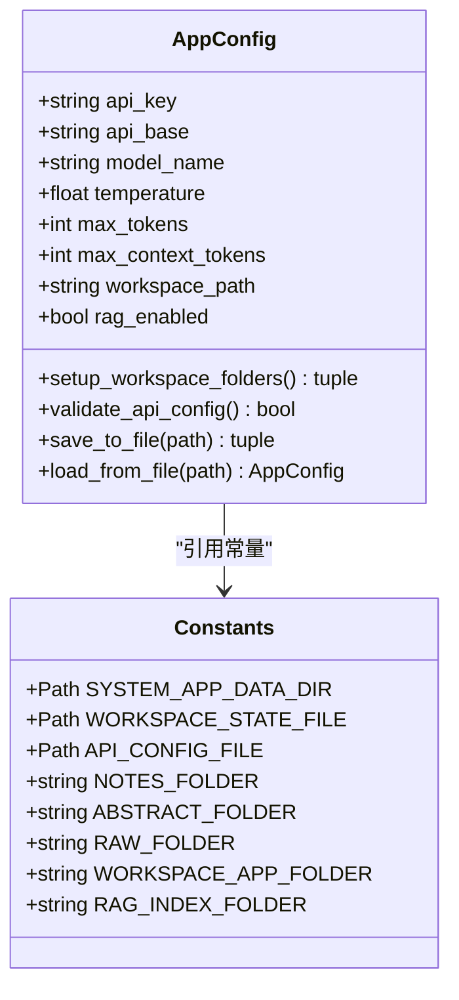
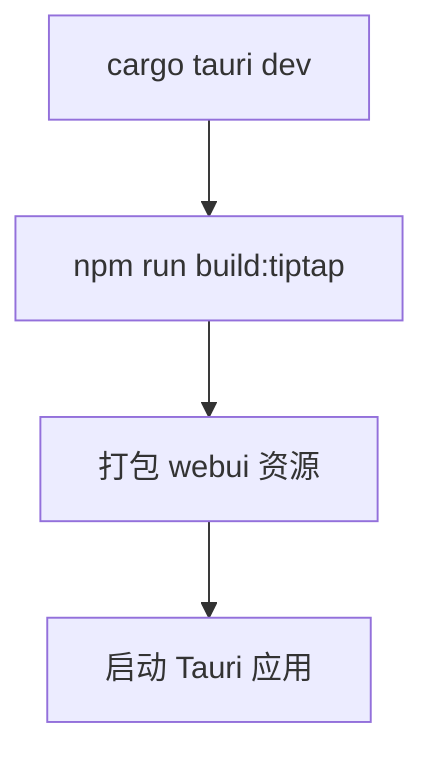
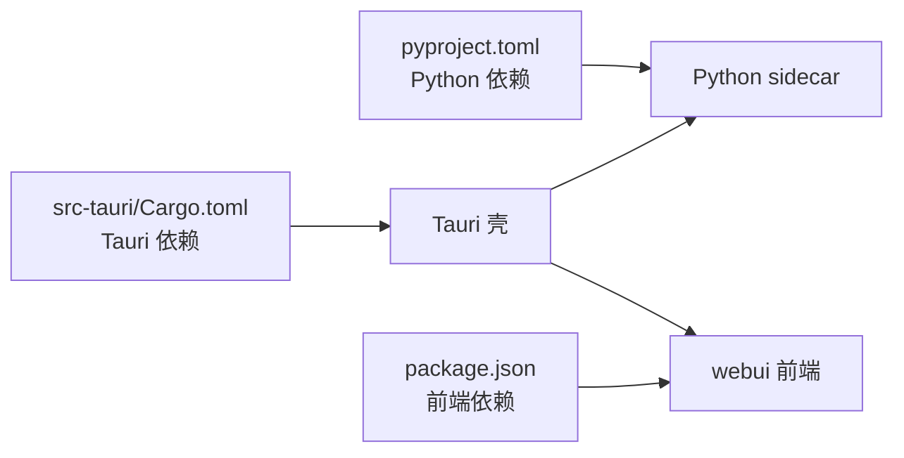

# 快速开始

<cite>
**本文引用的文件**   
- [README.md](file://README.md)
- [pyproject.toml](file://pyproject.toml)
- [package.json](file://package.json)
- [Cargo.toml](file://src-tauri/Cargo.toml)
- [run.py](file://run.py)
- [start.sh](file://start.sh)
- [python/main.py](file://python/main.py)
- [config/app_config.py](file://config/app_config.py)
- [config/constants.py](file://config/constants.py)
- [tauri.conf.json](file://src-tauri/tauri.conf.json)
</cite>

## 目录
1. [简介](#简介)
2. [环境要求](#环境要求)
3. [安装与启动](#安装与启动)
4. [四步上手流程](#四步上手流程)
5. [工作区目录结构](#工作区目录结构)
6. [架构概览](#架构概览)
7. [详细组件分析](#详细组件分析)
8. [依赖关系分析](#依赖关系分析)
9. [性能与体验建议](#性能与体验建议)
10. [常见问题与故障排除](#常见问题与故障排除)
11. [结论](#结论)

## 简介
NoteAI 是一款 AI 原生的个人知识库桌面应用，支持采集资料、编译知识、发现关联，并通过 RAG 助手基于你的工作区进行问答。它采用 Tauri v2（Rust）作为桌面壳，前端为 webui，后端通过 Python sidecar 提供 JSON-RPC 服务，实现本地优先、数据在用户手中的体验。

## 环境要求
- Python 3.10+
- Rust 工具链（用于构建 Tauri）
- Tauri CLI v2（可通过 cargo 或 npm 全局安装）
- uv 包管理器（推荐，用于依赖管理）

说明：
- Python 版本约束由项目配置声明。
- Tauri CLI 会在启动时自动检测，若未找到会提示安装方式。
- uv 用于一键同步开发依赖与可选的 RAG 依赖。

章节来源
- [README.md:273-284](file://README.md#L273-L284)
- [pyproject.toml:1-10](file://pyproject.toml#L1-L10)
- [run.py:125-143](file://run.py#L125-L143)

## 安装与启动
以下命令序列适用于首次克隆并运行开发环境：

- 克隆仓库
  - git clone https://github.com/Miles128/NoteAI.git
  - cd NoteAI

- 安装依赖（使用 uv）
  - uv sync --extra dev --extra rag

- 启动开发模式
  - python run.py

说明：
- run.py 会检查 Python 依赖与 Tauri CLI，随后调用 cargo tauri dev 启动应用（包含 Python sidecar）。
- 首次构建会打包 Tiptap 编辑器资源。

生产/发布构建：
- 使用脚本一键构建
  - bash start.sh --release
- 或直接使用 Tauri 命令
  - cargo tauri build

章节来源
- [README.md:277-284](file://README.md#L277-L284)
- [run.py:146-174](file://run.py#L146-L174)
- [start.sh:75-81](file://start.sh#L75-L81)
- [package.json:10-13](file://package.json#L10-L13)

## 四步上手流程
1. 打开工作区
   - 在应用中选择任意本地文件夹作为工作区。
2. 配置 LLM API Key
   - 进入设置 → 模型，填写 OpenAI 兼容接口的 API Key、Base URL 与模型名。
3. 导入资料
   - 拖入 PDF / DOCX，或使用网页下载、导入文件功能。
4. 使用 RAG 助手
   - 打开侧栏的 RAG 助手，提问或浏览笔记与知识图谱。

章节来源
- [README.md:286-291](file://README.md#L286-L291)

## 工作区目录结构
工作区根目录下常见目录与文件如下：
- Notes/：原始笔记（Markdown，按主题分文件夹）
- wiki/：AI 编译层（WIKI.md、主题综述、日志等）
- Raw/：原件归档（PDF、DOCX、PPTX 等）
- schema.md：工作区 AI 规范（Schema 向导生成）
- .noteai/：运行时数据（rag_index/、ingest 状态、日志等）
- .ai_memory/：用户画像、项目规则

说明：
- 代码中工作区应用目录名为 .noteai/（历史名称），文档中偶见 NoteAI/ 指代同一位置。
- 首次设置工作区后，系统会自动创建必要子目录。

章节来源
- [README.md:370-382](file://README.md#L370-L382)
- [config/constants.py:26-31](file://config/constants.py#L26-L31)
- [config/app_config.py:146-174](file://config/app_config.py#L146-L174)

## 架构概览
NoteAI 采用“Tauri 壳 + Web UI + Python Sidecar”的分层架构。前端通过 Tauri 调用后端能力，Python sidecar 负责 RAG、入库流水线、CLI agent 桥接与云同步等复杂逻辑。

图表来源
- [README.md:384-399](file://README.md#L384-L399)
- [tauri.conf.json:1-47](file://src-tauri/tauri.conf.json#L1-L47)
- [python/main.py:1-21](file://python/main.py#L1-21)

## 详细组件分析

### 启动器与依赖检查（run.py）
- 职责
  - 解析 pyproject.toml 中的依赖列表，校验是否已安装。
  - 检测 Tauri CLI 是否可用（优先 cargo tauri，其次 npx tauri）。
  - 启动 Tauri 开发模式（cargo tauri dev），并在必要时回退到 npx tauri dev。
- 关键点
  - 对缺失依赖给出 uv 同步建议。
  - 当 RAG 组件未被移除且缺少相关包时，提示补齐。

图表来源
- [run.py:44-122](file://run.py#L44-L122)
- [run.py:125-174](file://run.py#L125-L174)

章节来源
- [run.py:44-122](file://run.py#L44-L122)
- [run.py:125-174](file://run.py#L125-L174)

### Python Sidecar 入口（python/main.py）
- 职责
  - 设置必要的运行时环境变量（避免 macOS 上 libomp 冲突、限制线程数）。
  - 初始化路径并将 sidecar.server.main 作为进程入口。
- 关键点
  - 确保 RAG 相关库加载时的稳定性。

图表来源
- [python/main.py:1-21](file://python/main.py#L1-21)

章节来源
- [python/main.py:1-21](file://python/main.py#L1-21)

### 配置与工作区（config/app_config.py, config/constants.py）
- 职责
  - AppConfig 集中管理应用配置（API Key、模型、上下文长度、窗口尺寸、RAG 开关等）。
  - 提供工作区路径验证、目录创建、配置持久化（主配置与 API 配置分离存储）。
  - constants 定义工作区固定目录名与应用数据目录。
- 关键点
  - API Key 优先从系统钥匙串加载，否则回退到加密文件存储。
  - 首次设置工作区时自动创建 Notes/wiki/Raw/.noteai 等目录。

图表来源
- [config/app_config.py:28-100](file://config/app_config.py#L28-L100)
- [config/app_config.py:146-174](file://config/app_config.py#L146-L174)
- [config/app_config.py:212-311](file://config/app_config.py#L212-L311)
- [config/constants.py:9-31](file://config/constants.py#L9-L31)

章节来源
- [config/app_config.py:28-100](file://config/app_config.py#L28-L100)
- [config/app_config.py:146-174](file://config/app_config.py#L146-L174)
- [config/app_config.py:212-311](file://config/app_config.py#L212-L311)
- [config/constants.py:9-31](file://config/constants.py#L9-L31)

### Tauri 前端构建与打包（tauri.conf.json, package.json）
- 职责
  - tauri.conf.json 指定前端资源目录、窗口大小、安全策略、插件与打包资源。
  - package.json 提供构建 Tiptap 编辑器的脚本。
- 关键点
  - beforeDevCommand 在开发前执行前端构建。
  - bundle.resources 将 Python 侧代码打包进应用。

图表来源
- [tauri.conf.json:6-10](file://src-tauri/tauri.conf.json#L6-L10)
- [tauri.conf.json:27-40](file://src-tauri/tauri.conf.json#L27-L40)
- [package.json:10-13](file://package.json#L10-L13)

章节来源
- [tauri.conf.json:6-10](file://src-tauri/tauri.conf.json#L6-L10)
- [tauri.conf.json:27-40](file://src-tauri/tauri.conf.json#L27-L40)
- [package.json:10-13](file://package.json#L10-L13)

## 依赖关系分析
- Python 依赖
  - 核心依赖与可选依赖（dev、rag、cloud_*）在 pyproject.toml 中声明。
  - 推荐使用 uv 同步，以一次性安装开发依赖与 RAG 依赖。
- Rust/Tauri 依赖
  - Cargo.toml 声明了 Tauri v2 及其插件（dialog、shell）、序列化与异步运行时等。
- 前端依赖
  - package.json 声明了 Tiptap 相关依赖与 esbuild 构建工具。

图表来源
- [pyproject.toml:10-58](file://pyproject.toml#L10-L58)
- [Cargo.toml:9-18](file://src-tauri/Cargo.toml#L9-L18)
- [package.json:18-26](file://package.json#L18-L26)

章节来源
- [pyproject.toml:10-58](file://pyproject.toml#L10-L58)
- [Cargo.toml:9-18](file://src-tauri/Cargo.toml#L9-L18)
- [package.json:18-26](file://package.json#L18-L26)

## 性能与体验建议
- 首次启动较慢属于正常现象，因为需要构建前端资源与索引。
- 合理设置最大上下文长度与并发线程数，避免大文档处理时内存压力过大。
- 关闭不必要的实验性功能（如云同步）可减少后台任务开销。
- 使用本地向量检索时，确保磁盘空间充足以容纳 rag_index 数据。

[本节为通用建议，不直接分析具体文件]

## 常见问题与故障排除
- 未找到 Tauri CLI
  - 现象：启动时报错提示安装 Tauri CLI。
  - 解决：安装 cargo tauri 或 npm install -g @tauri-apps/cli，然后重试。
- 缺少 Python 依赖
  - 现象：提示缺少依赖包。
  - 解决：执行 uv sync --extra dev --extra rag，或根据提示手动安装缺失包。
- RAG 组件依赖缺失
  - 现象：检测到 bm25s/fastembed/zvec/FlagEmbedding 缺失。
  - 解决：再次执行 uv sync --extra rag；或在设置中删除 RAG 组件（若不需要向量检索）。
- macOS 上首次 RAG 对话崩溃
  - 现象：libomp 冲突导致进程异常。
  - 解决：sidecar 入口已设置环境变量规避；若仍出现，请重启应用并确保使用官方启动方式。
- 工作区目录不存在或无写入权限
  - 现象：设置工作区失败。
  - 解决：选择有效路径并确保当前用户对目标目录有读写权限。

章节来源
- [run.py:125-143](file://run.py#L125-L143)
- [run.py:102-122](file://run.py#L102-L122)
- [python/main.py:6-8](file://python/main.py#L6-L8)
- [config/app_config.py:146-174](file://config/app_config.py#L146-L174)

## 结论
通过以上步骤，你可以在本地快速搭建 NoteAI 的开发与运行环境，完成工作区初始化、LLM 配置、资料导入与 RAG 助手使用。理解工作区结构与依赖关系有助于后续扩展与问题定位。建议在稳定环境中先完成一次完整的数据入库与问答流程，再逐步启用高级功能。