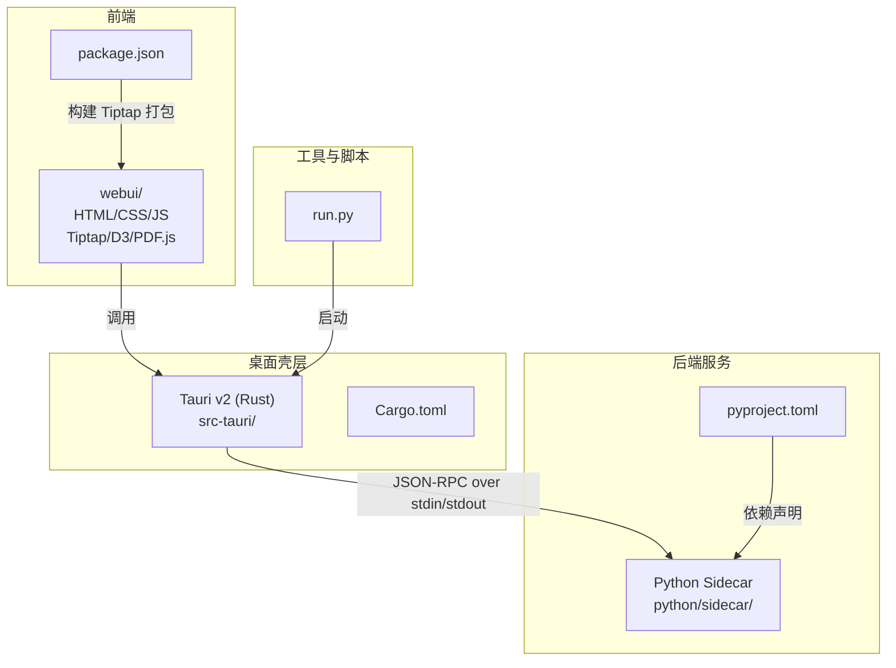
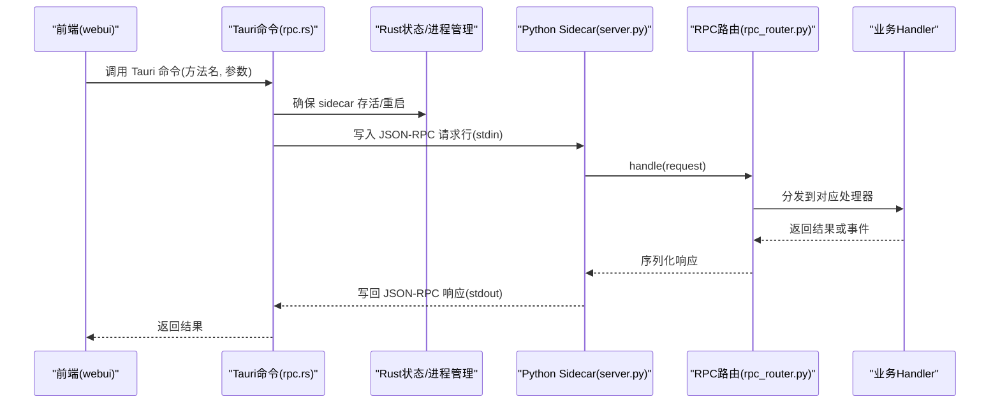
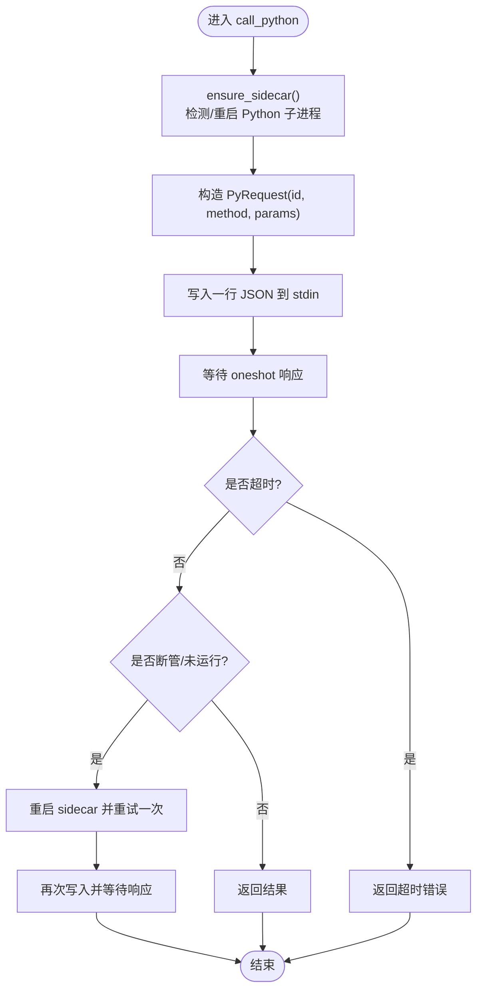
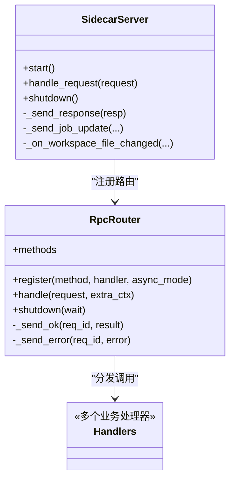
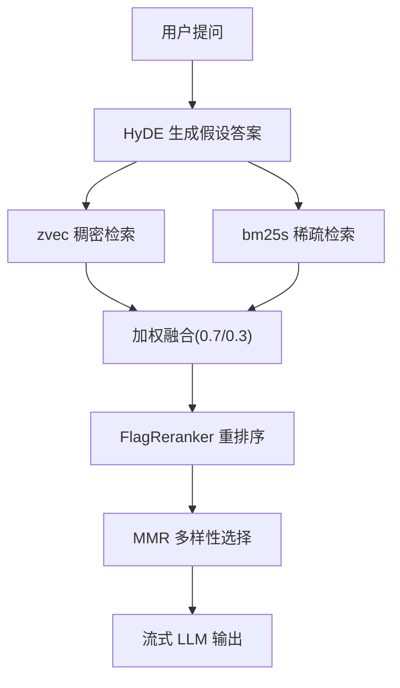
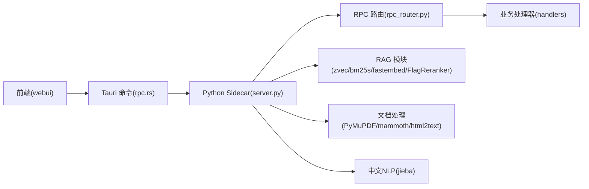

# 技术栈

<cite>
**本文引用的文件**   
- [README.md](file://README.md)
- [pyproject.toml](file://pyproject.toml)
- [Cargo.toml](file://src-tauri/Cargo.toml)
- [package.json](file://package.json)
- [run.py](file://run.py)
- [server.py](file://python/sidecar/server.py)
- [rpc_router.py](file://python/sidecar/rpc_router.py)
- [rpc.rs](file://src-tauri/src/rpc.rs)
</cite>

## 目录
1. [简介](#简介)
2. [项目结构](#项目结构)
3. [核心组件](#核心组件)
4. [架构总览](#架构总览)
5. [详细组件分析](#详细组件分析)
6. [依赖关系分析](#依赖关系分析)
7. [性能考量](#性能考量)
8. [故障排查指南](#故障排查指南)
9. [结论](#结论)
10. [附录](#附录)

## 简介
NoteAI 是一款 AI 原生的个人知识库桌面应用，围绕“采集 → 整理 → 研究 → 问答”的闭环，将本地工作区中的资料自动转换为可检索的知识，并通过 RAG 助手进行基于本地知识的问答与扩展。整体采用 Tauri v2（Rust）作为桌面壳层，前端使用 HTML/CSS/原生 JavaScript 配合 Tiptap、D3、PDF.js；后端以 Python 3.10+ sidecar 提供 JSON-RPC 服务；RAG 链路采用 zvec + bm25s 混合检索、fastembed 向量嵌入与 FlagReranker 重排序；文档处理覆盖 PDF、DOCX、HTML 等格式；中文 NLP 使用 jieba 分词；包管理采用 uv 与 pyproject.toml。

## 项目结构
仓库按功能分层组织：
- src-tauri：Tauri v2 壳层与 Rust 侧进程通信逻辑
- webui：前端资源与脚本（HTML/CSS/JS、编辑器与可视化库）
- python/sidecar：Python 后端服务、RPC 路由、业务处理器与 RAG 模块
- modules：下载、转换、预览等能力
- utils：通用工具（LLM、主题、链接、日志等）
- prompts：提示词模板
- config：配置与常量
- tests：单元测试与集成测试
- scripts：构建与辅助脚本
- run.py：开发启动器（检查依赖并启动 Tauri dev）

图表来源
- [Cargo.toml:1-27](file://src-tauri/Cargo.toml#L1-L27)
- [package.json:1-28](file://package.json#L1-L28)
- [pyproject.toml:1-133](file://pyproject.toml#L1-L133)
- [run.py:1-175](file://run.py#L1-L175)

章节来源
- [README.md:178-203](file://README.md#L178-L203)
- [README.md:408-433](file://README.md#L408-L433)

## 核心组件
- 桌面壳层（Tauri v2 + Rust）
  - 负责加载 webui、管理子进程（Python sidecar）、通过 JSON-RPC 转发请求、白名单校验方法名、超时与断管恢复。
- 前端（HTML/CSS/原生 JS、Tiptap、D3、PDF.js）
  - 四栏布局、所见即所得编辑、知识图谱可视化、PDF/DOCX 预览、与 Tauri 命令交互。
- 后端服务（Python 3.10+、JSON-RPC）
  - 基于 stdin/stdout 的轻量 RPC 路由，线程池并发执行，统一错误码与消息脱敏，注册各业务 Handler。
- RAG 技术栈
  - 混合检索：zvec（稠密）+ bm25s（稀疏），权重组合；fastembed 生成向量；FlagReranker 对候选结果重排序。
- 文档处理
  - PyMuPDF（PDF 解析）、mammoth（DOCX 转 Markdown）、html2text（网页转文本）。
- 中文 NLP
  - jieba 分词用于标签提取与关键词识别。
- 包管理与构建
  - uv 安装依赖，pyproject.toml 声明基础与可选依赖（dev、rag、cloud_*），pytest 运行测试。

章节来源
- [README.md:178-188](file://README.md#L178-L188)
- [README.md:408-418](file://README.md#L408-L418)
- [pyproject.toml:1-59](file://pyproject.toml#L1-L59)
- [pyproject.toml:116-124](file://pyproject.toml#L116-L124)

## 架构总览
NoteAI 采用“前端 + 壳层 + 后端 sidecar”的分层架构。前端通过 Tauri 暴露的命令调用 Rust 侧函数，Rust 侧维护 Python 子进程并通过标准输入输出发送 JSON-RPC 请求，Python 侧路由到具体业务处理器完成工作区操作、RAG 检索、入库流水线等。

图表来源
- [rpc.rs:190-284](file://src-tauri/src/rpc.rs#L190-L284)
- [server.py:570-595](file://python/sidecar/server.py#L570-L595)
- [rpc_router.py:43-106](file://python/sidecar/rpc_router.py#L43-L106)

章节来源
- [README.md:155-170](file://README.md#L155-L170)
- [README.md:384-399](file://README.md#L384-L399)

## 详细组件分析

### 桌面壳层（Tauri v2 + Rust）
- 职责
  - 白名单控制可调用的 Python 方法，避免任意方法暴露。
  - 子进程生命周期管理：检测存活、断管后自动重启、等待就绪。
  - 请求-响应模型：为每个请求分配 id，使用 oneshot channel 等待响应，设置方法级超时。
- 关键实现要点
  - 允许方法列表集中维护，新增方法需在此注册。
  - 针对长耗时方法（如 rag_chat、ingest）提高超时阈值。
  - 管道损坏时触发重启并重试一次调用，提升鲁棒性。

图表来源
- [rpc.rs:173-284](file://src-tauri/src/rpc.rs#L173-L284)

章节来源
- [Cargo.toml:1-27](file://src-tauri/Cargo.toml#L1-L27)
- [rpc.rs:1-172](file://src-tauri/src/rpc.rs#L1-L172)

### 前端（HTML/CSS/原生 JS、Tiptap、D3、PDF.js）
- 职责
  - 呈现四栏布局、笔记编辑与预览、知识图谱可视化、与 Tauri 命令交互。
  - 首次构建会打包 Tiptap 编辑器，减少运行时体积。
- 关键实现要点
  - 使用 esbuild 构建 Tiptap bundle。
  - 通过 Tauri 命令发起后端调用，接收 JSON-RPC 响应更新 UI。

章节来源
- [package.json:10-26](file://package.json#L10-L26)
- [README.md:32-43](file://README.md#L32-L43)

### 后端服务（Python 3.10+、JSON-RPC）
- 职责
  - 监听 stdin 逐行读取 JSON-RPC 请求，路由到 RpcRouter，再分发至各 Handler。
  - 统一错误码与消息脱敏，防止泄露路径信息。
  - 后台任务与缓存：工作区变更监听、自动转换、WIKI 同步、RAG 索引重建提示。
- 关键实现要点
  - RpcRouter 使用线程池执行处理器，避免阻塞主循环。
  - 错误消息中替换工作区与 home 路径，保护隐私。
  - 支持进度事件与作业状态推送。

图表来源
- [server.py:54-125](file://python/sidecar/server.py#L54-L125)
- [rpc_router.py:35-106](file://python/sidecar/rpc_router.py#L35-L106)

章节来源
- [server.py:1-125](file://python/sidecar/server.py#L1-L125)
- [rpc_router.py:1-106](file://python/sidecar/rpc_router.py#L1-L106)

### RAG 技术栈（zvec + bm25s、fastembed、FlagReranker）
- 职责
  - 将文档切块并生成向量（fastembed），同时构建稀疏索引（bm25s），在查询阶段进行稠密与稀疏的加权融合，再由 FlagReranker 精排，最终 MMR 去重与流式 LLM 输出。
- 关键实现要点
  - 混合检索权重：稠密 0.7 + 稀疏 0.3（参考 README 说明）。
  - 索引状态与一致性检查，避免不必要的重建。
  - 模型预热与集合缓存，降低冷启动开销。

图表来源
- [README.md:126-127](file://README.md#L126-L127)
- [README.md:355-356](file://README.md#L355-L356)

章节来源
- [README.md:126-127](file://README.md#L126-L127)
- [README.md:355-356](file://README.md#L355-L356)

### 文档处理（PyMuPDF、mammoth、html2text）
- 职责
  - 将 PDF、DOCX、HTML 等格式转换为 Markdown，便于后续编译与检索。
- 关键实现要点
  - PyMuPDF 用于 PDF 文本与元数据提取。
  - mammoth 用于 DOCX 排版保留与内容抽取。
  - html2text 用于网页结构化转文本。

章节来源
- [pyproject.toml:20-29](file://pyproject.toml#L20-L29)
- [README.md:80-84](file://README.md#L80-L84)

### 中文 NLP（jieba 分词）
- 职责
  - 对中文内容进行分词，结合 TF-IDF 或词频策略生成有区分度的标签。
- 关键实现要点
  - 在标签提取流程中使用 jieba 分词。
  - pytest 过滤 jieba 相关弃用警告。

章节来源
- [pyproject.toml:28](file://pyproject.toml#L28)
- [pyproject.toml:121-124](file://pyproject.toml#L121-L124)

### 包管理与构建（uv、pyproject.toml）
- 职责
  - 使用 uv 安装依赖，pyproject.toml 声明基础依赖与可选依赖（dev、rag、cloud_*）。
  - 定义 pytest 与 mypy 配置，统一代码风格与类型检查。
- 关键实现要点
  - 推荐命令：uv sync --extra dev --extra rag。
  - 可选依赖 rag 包含 FlagEmbedding、bm25s、zvec、fastembed。

章节来源
- [pyproject.toml:1-59](file://pyproject.toml#L1-L59)
- [pyproject.toml:116-133](file://pyproject.toml#L116-L133)
- [README.md:44-53](file://README.md#L44-L53)

## 依赖关系分析
- 壳层与前端
  - Tauri 加载 webui，前端通过 Tauri 命令与 Rust 侧交互。
- 壳层与后端
  - Rust 侧通过 JSON-RPC 与 Python sidecar 通信，白名单限制方法。
- 后端与业务模块
  - server.py 聚合 handlers、RAG、入库流水线、云同步等模块。
- 依赖声明
  - pyproject.toml 统一管理 Python 依赖，uv 负责安装与缓存。

图表来源
- [rpc.rs:1-172](file://src-tauri/src/rpc.rs#L1-172)
- [server.py:1-125](file://python/sidecar/server.py#L1-L125)
- [rpc_router.py:1-106](file://python/sidecar/rpc_router.py#L1-L106)
- [pyproject.toml:1-59](file://pyproject.toml#L1-L59)

章节来源
- [README.md:155-170](file://README.md#L155-L170)
- [README.md:384-399](file://README.md#L384-L399)

## 性能考量
- 并发与线程池
  - RPC 路由使用线程池执行处理器，避免阻塞 stdin 读取循环。
- 超时与重试
  - 针对不同方法设置合理超时，管道损坏自动重启并重试一次。
- 索引与缓存
  - 启动时检查索引状态，避免昂贵重建；集合缓存与模型预热减少冷启动延迟。
- 文件变更节流
  - 工作区变更使用防抖与批量处理，减少频繁 I/O 与重复计算。

章节来源
- [rpc_router.py:43-82](file://python/sidecar/rpc_router.py#L43-L82)
- [rpc.rs:160-188](file://src-tauri/src/rpc.rs#L160-L188)
- [server.py:268-296](file://python/sidecar/server.py#L268-L296)
- [server.py:416-459](file://python/sidecar/server.py#L416-L459)

## 故障排查指南
- 常见错误定位
  - 方法未找到：检查 rpc.rs 白名单是否包含目标方法。
  - 管道损坏或未运行：Rust 侧会自动重启 sidecar，若仍失败请检查 Python 进程状态。
  - 超时：长耗时方法（如 rag_chat、ingest）已提高超时阈值，必要时调整。
- 错误消息脱敏
  - 错误消息中路径被替换为占位符，避免泄露敏感信息。
- 依赖缺失
  - run.py 会在启动前检查依赖，缺失时会给出安装建议。

章节来源
- [rpc.rs:273-284](file://src-tauri/src/rpc.rs#L273-L284)
- [rpc.rs:169-188](file://src-tauri/src/rpc.rs#L169-L188)
- [rpc_router.py:14-32](file://python/sidecar/rpc_router.py#L14-L32)
- [run.py:44-122](file://run.py#L44-L122)

## 结论
NoteAI 的技术栈以 Tauri v2 为壳层，前端轻量且专注交互，Python sidecar 承载复杂业务与 RAG 能力。通过 JSON-RPC 实现前后端解耦，结合混合检索与重排序提升问答质量。文档处理与中文 NLP 满足多格式与中文场景需求，uv 与 pyproject.toml 简化依赖管理。整体架构清晰、可扩展性强，适合持续演进为“持续维护的知识编译器”。

## 附录
- 开发与测试
  - 推荐使用 uv 安装依赖并运行 pytest。
  - 首次构建会打包 Tiptap 编辑器，确保前端资源完整。

章节来源
- [README.md:205-212](file://README.md#L205-L212)
- [README.md:435-442](file://README.md#L435-L442)
- [package.json:10-12](file://package.json#L10-L12)