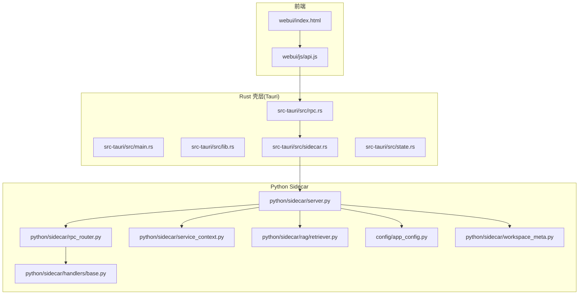
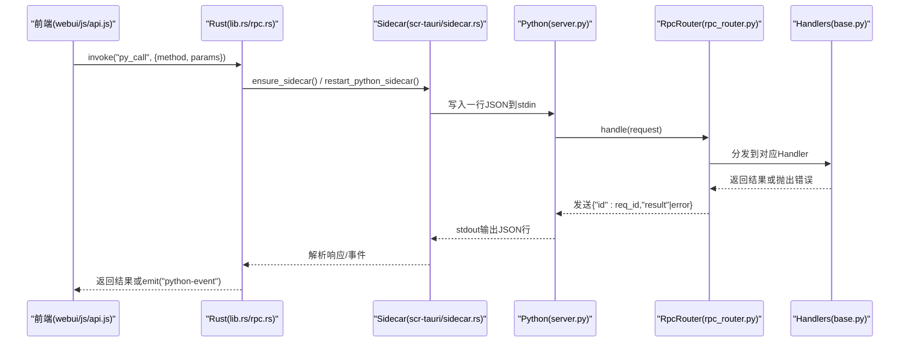
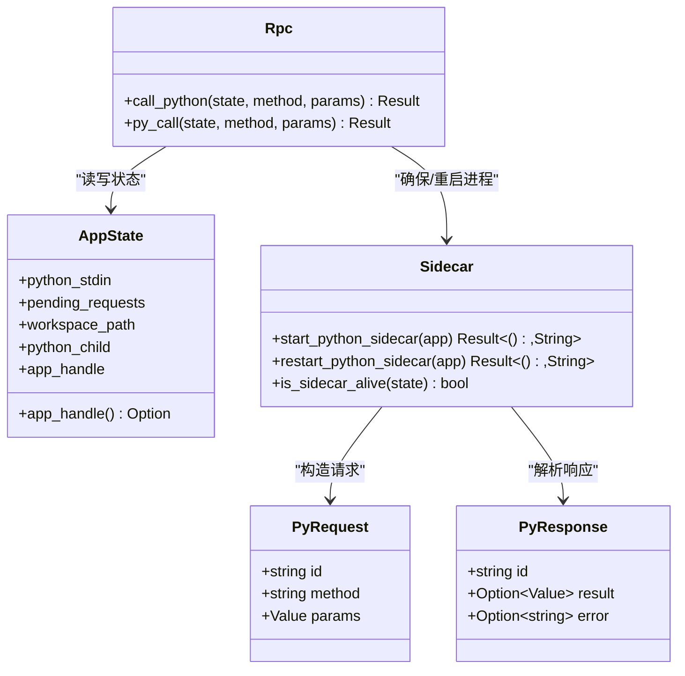
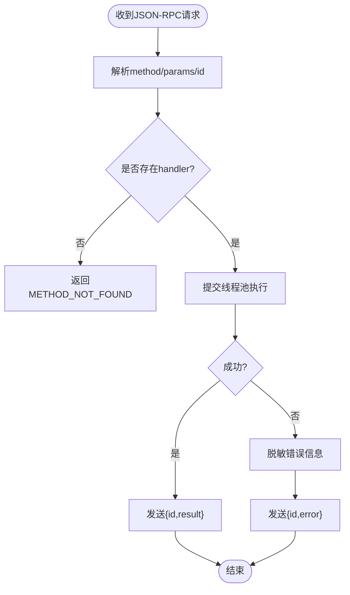
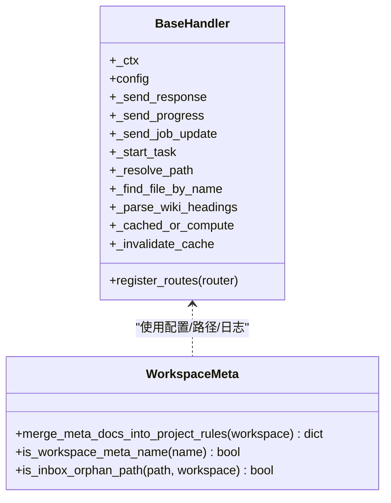
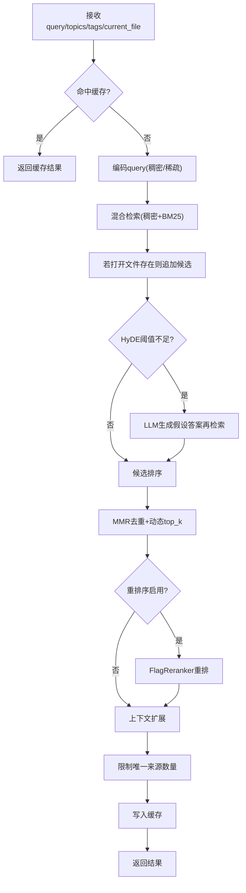
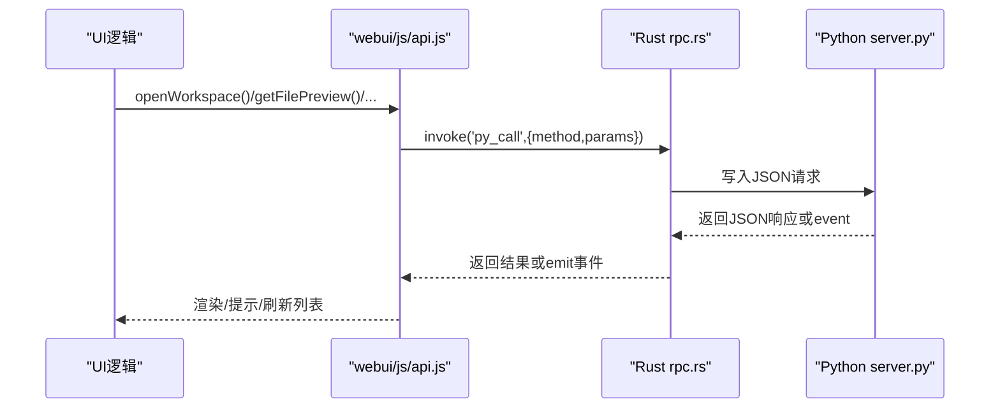
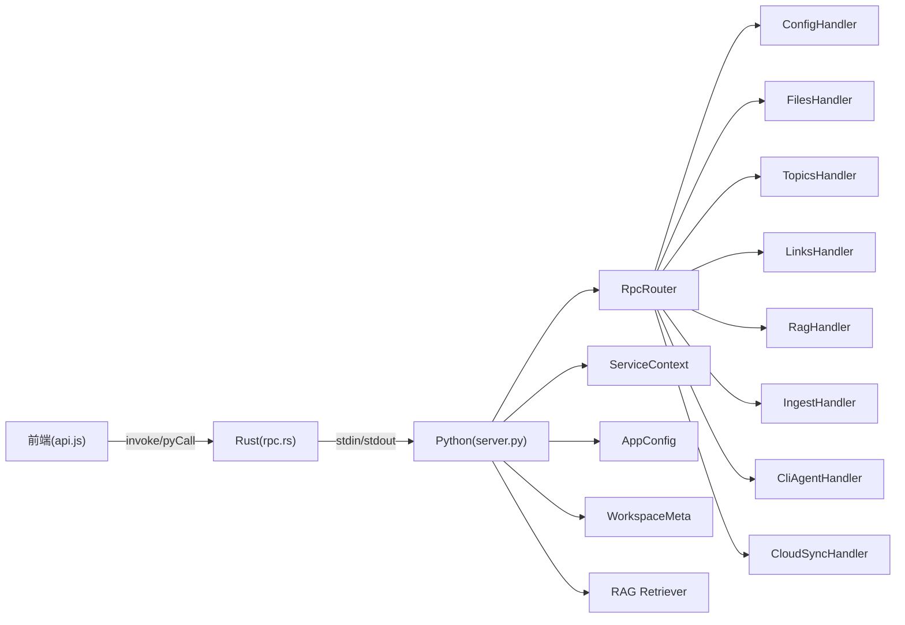

# 架构概览

<cite>
**本文引用的文件**   
- [README.md](file://README.md)
- [main.rs](file://src-tauri/src/main.rs)
- [lib.rs](file://src-tauri/src/lib.rs)
- [sidecar.rs](file://src-tauri/src/sidecar.rs)
- [rpc.rs](file://src-tauri/src/rpc.rs)
- [state.rs](file://src-tauri/src/state.rs)
- [server.py](file://python/sidecar/server.py)
- [rpc_router.py](file://python/sidecar/rpc_router.py)
- [service_context.py](file://python/sidecar/service_context.py)
- [base.py](file://python/sidecar/handlers/base.py)
- [retriever.py](file://python/sidecar/rag/retriever.py)
- [app_config.py](file://config/app_config.py)
- [workspace_meta.py](file://python/sidecar/workspace_meta.py)
- [api.js](file://webui/js/api.js)
- [index.html](file://webui/index.html)
</cite>

## 目录
1. [简介](#简介)
2. [项目结构](#项目结构)
3. [核心组件](#核心组件)
4. [架构总览](#架构总览)
5. [详细组件分析](#详细组件分析)
6. [依赖关系分析](#依赖关系分析)
7. [性能考量](#性能考量)
8. [故障排查指南](#故障排查指南)
9. [结论](#结论)
10. [附录](#附录)

## 简介
NoteAI 是一款 AI 原生的个人知识库桌面应用，采用 Tauri v2（Rust）作为原生壳层，Python sidecar 作为后端服务。前端通过 JSON-RPC 与 Python 进程通信，Rust 负责进程生命周期管理、事件转发与安全边界；Python 侧提供 RPC 路由、领域处理器、RAG 检索、入库流水线、CLI Agent 桥接与云同步等能力。整体设计强调：
- 本地优先：工作区在用户本地磁盘，数据由用户掌控
- 事件驱动：文件系统变更触发自动转换、索引重建与 WIKI 同步
- 可扩展：Handlers 体系与 RpcRouter 解耦，便于新增能力
- 安全隔离：Rust 白名单控制可调用方法，错误信息脱敏

## 项目结构
仓库按“分层 + 功能域”组织：
- src-tauri：Tauri v2 应用入口、命令注册、Sidecar 进程管理与请求转发
- python/sidecar：JSON-RPC 服务端、Handlers、RAG、Ingest、CLI Agent、云同步等
- webui：HTML/CSS/JS 前端，封装 pyCall 与窗口 API
- config：配置加载、持久化与安全策略
- modules/utils/prompts：工具库、提示词模板与业务模块

图表来源
- [lib.rs:10-49](file://src-tauri/src/lib.rs#L10-L49)
- [rpc.rs:273-284](file://src-tauri/src/rpc.rs#L273-L284)
- [sidecar.rs:215-311](file://src-tauri/src/sidecar.rs#L215-L311)
- [server.py:54-125](file://python/sidecar/server.py#L54-L125)
- [rpc_router.py:43-83](file://python/sidecar/rpc_router.py#L43-L83)
- [service_context.py:6-19](file://python/sidecar/service_context.py#L6-L19)
- [base.py:4-106](file://python/sidecar/handlers/base.py#L4-L106)
- [retriever.py:102-195](file://python/sidecar/rag/retriever.py#L102-L195)
- [app_config.py:28-115](file://config/app_config.py#L28-L115)
- [workspace_meta.py:46-98](file://python/sidecar/workspace_meta.py#L46-L98)

章节来源
- [README.md:155-203](file://README.md#L155-L203)
- [lib.rs:10-49](file://src-tauri/src/lib.rs#L10-L49)
- [server.py:54-125](file://python/sidecar/server.py#L54-L125)

## 核心组件
- Rust 壳层
  - 进程管理：启动/重启 Python sidecar，监听 stdout/stderr，处理异常退出与恢复
  - 请求转发：将前端调用包装为 JSON-RPC，维护 pending 请求映射与超时
  - 事件桥接：将 Python 的 event 消息广播到前端
- Python Sidecar
  - 主服务：初始化各 Handler、构建 RpcRouter、启动文件系统监控、后台任务与模型预热
  - RpcRouter：轻量 JSON-RPC 路由器，支持同步/异步执行与线程池调度
  - ServiceContext：依赖注入容器，统一提供配置与日志
  - Handlers：按领域划分（工作区、文件、主题、标签、链接、RAG、Ingest、CLI Agent、云同步等）
  - RAG：混合检索（稠密+稀疏）、重排序、MMR、上下文扩展与缓存
  - 工作区元文档：合并 AGENTS/CLAUDE/GEMINI 到项目规则并清理源文件
- 前端
  - api.js：封装 pyCall、重试、错误翻译、特殊 API（对话框、分页预览）
  - index.html：四栏布局、AI 面板、图谱、设置等界面

章节来源
- [sidecar.rs:215-311](file://src-tauri/src/sidecar.rs#L215-L311)
- [rpc.rs:190-284](file://src-tauri/src/rpc.rs#L190-L284)
- [server.py:54-125](file://python/sidecar/server.py#L54-L125)
- [rpc_router.py:43-83](file://python/sidecar/rpc_router.py#L43-L83)
- [service_context.py:6-19](file://python/sidecar/service_context.py#L6-L19)
- [base.py:4-106](file://python/sidecar/handlers/base.py#L4-L106)
- [retriever.py:102-195](file://python/sidecar/rag/retriever.py#L102-L195)
- [workspace_meta.py:46-98](file://python/sidecar/workspace_meta.py#L46-L98)
- [api.js:61-90](file://webui/js/api.js#L61-L90)
- [index.html:1-800](file://webui/index.html#L1-L800)

## 架构总览
下图展示从前端到 Python 后端的完整调用链与事件通道，以及 Rust 对 Python 进程的守护与恢复机制。

图表来源
- [api.js:61-90](file://webui/js/api.js#L61-L90)
- [lib.rs:39-49](file://src-tauri/src/lib.rs#L39-L49)
- [rpc.rs:273-284](file://src-tauri/src/rpc.rs#L273-L284)
- [sidecar.rs:260-301](file://src-tauri/src/sidecar.rs#L260-L301)
- [server.py:570-590](file://python/sidecar/server.py#L570-L590)
- [rpc_router.py:54-83](file://python/sidecar/rpc_router.py#L54-L83)
- [base.py:4-106](file://python/sidecar/handlers/base.py#L4-L106)

## 详细组件分析

### Rust 壳层：进程与请求转发
- 进程管理
  - 查找 Python 解释器与脚本路径，设置 HF 缓存与线程环境变量
  - 启动子进程，分别读取 stdout/stderr，stdout 解析 JSON 响应或事件
  - 意外退出时清理句柄并通知前端；支持静默重启与排队等待
- 请求转发
  - 白名单校验 method，避免任意方法暴露
  - 为每个请求生成唯一 id，维护 pending_requests 映射
  - 根据 method 动态设置超时，长任务立即返回并通过事件流式推送进度
- 状态共享
  - AppState 持有 stdin、Child、AppHandle 与 pending 映射，供多协程并发访问

图表来源
- [state.rs:9-48](file://src-tauri/src/state.rs#L9-L48)
- [rpc.rs:190-284](file://src-tauri/src/rpc.rs#L190-L284)
- [sidecar.rs:215-311](file://src-tauri/src/sidecar.rs#L215-L311)

章节来源
- [lib.rs:10-49](file://src-tauri/src/lib.rs#L10-L49)
- [rpc.rs:159-188](file://src-tauri/src/rpc.rs#L159-L188)
- [sidecar.rs:26-107](file://src-tauri/src/sidecar.rs#L26-L107)

### Python Sidecar：RPC 与服务上下文
- 主服务 SidecarServer
  - 初始化 WebDownloader、FileConverterManager、FilePreviewer、TopicExtractor 等
  - 构建 RpcRouter 与各 Handler 路由
  - 启动文件系统监控、启动同步与巡检任务、模型预热
  - 统一进度与作业状态上报，支持取消/失败/完成事件
- RpcRouter
  - 基于线程池执行 handler，捕获 NoteAIError 与普通异常
  - 错误信息脱敏（隐藏绝对路径与 home 提示）
- ServiceContext
  - 显式依赖注入 config 与 logger，替代全局导入

图表来源
- [server.py:54-125](file://python/sidecar/server.py#L54-L125)
- [rpc_router.py:43-83](file://python/sidecar/rpc_router.py#L43-L83)
- [service_context.py:6-19](file://python/sidecar/service_context.py#L6-L19)

章节来源
- [server.py:54-125](file://python/sidecar/server.py#L54-L125)
- [rpc_router.py:14-33](file://python/sidecar/rpc_router.py#L14-L33)
- [service_context.py:6-19](file://python/sidecar/service_context.py#L6-L19)

### Handlers 体系与工作区元文档
- BaseHandler 提供通用能力：配置、日志、路径解析、缓存失效、任务调度、Wiki 联动等
- workspace_meta 将 AGENTS/CLAUDE/GEMINI 合并入 .ai_memory/project_rules.md，并移除源文件，保证外部 agent 能读取一致规则

图表来源
- [base.py:4-106](file://python/sidecar/handlers/base.py#L4-L106)
- [workspace_meta.py:46-98](file://python/sidecar/workspace_meta.py#L46-L98)

章节来源
- [base.py:4-106](file://python/sidecar/handlers/base.py#L4-L106)
- [workspace_meta.py:15-34](file://python/sidecar/workspace_meta.py#L15-L34)

### RAG 检索流程
- 查询缓存：相同 query/topics/tags/current_file 的结果 TTL 缓存
- 混合检索：稠密向量 + BM25 稀疏权重，候选集上限控制
- HyDE：当初始检索较弱时，用 LLM 生成假设答案再检索
- MMR 去重与动态 top_k：提升多样性与相关性
- 重排序：FlagReranker 二次打分，失败冷却保护
- 上下文扩展：结合主题与文件上下文，限制唯一来源数量

图表来源
- [retriever.py:102-195](file://python/sidecar/rag/retriever.py#L102-L195)

章节来源
- [retriever.py:47-85](file://python/sidecar/rag/retriever.py#L47-L85)
- [retriever.py:102-195](file://python/sidecar/rag/retriever.py#L102-L195)

### 前端 API 封装与事件
- api.js 提供统一的 pyCall，包含重试、错误翻译、环境检测
- 特殊 API：打开文件夹/文件对话框、工作区设置、文件预览分片读取
- 事件订阅：通过 window.__TAURI__.event 监听 python-event，更新 UI 状态

图表来源
- [api.js:61-90](file://webui/js/api.js#L61-L90)
- [api.js:170-248](file://webui/js/api.js#L170-L248)
- [rpc.rs:273-284](file://src-tauri/src/rpc.rs#L273-L284)
- [server.py:570-590](file://python/sidecar/server.py#L570-L590)

章节来源
- [api.js:61-90](file://webui/js/api.js#L61-L90)
- [api.js:331-460](file://webui/js/api.js#L331-L460)

## 依赖关系分析
- Rust 与 Python 的耦合点
  - 进程标准输入/输出管道
  - JSON-RPC 协议约定（id/method/params/result/error）
  - 事件通道（python-event）
- Python 内部依赖
  - Server 依赖 RpcRouter、ServiceContext、各 Handler、RAG、配置与工作区元文档
  - RAG 依赖 embedder/index/retrieval_policy/context_expand 等模块
- 前端依赖
  - 仅依赖 Tauri 运行时提供的 invoke/event/window API

图表来源
- [rpc.rs:273-284](file://src-tauri/src/rpc.rs#L273-L284)
- [server.py:54-125](file://python/sidecar/server.py#L54-L125)
- [rpc_router.py:43-83](file://python/sidecar/rpc_router.py#L43-L83)
- [service_context.py:6-19](file://python/sidecar/service_context.py#L6-L19)
- [app_config.py:28-115](file://config/app_config.py#L28-L115)
- [workspace_meta.py:46-98](file://python/sidecar/workspace_meta.py#L46-L98)
- [retriever.py:102-195](file://python/sidecar/rag/retriever.py#L102-L195)

章节来源
- [rpc.rs:159-188](file://src-tauri/src/rpc.rs#L159-L188)
- [server.py:54-125](file://python/sidecar/server.py#L54-L125)

## 性能考量
- 并发与线程池
  - RpcRouter 使用固定大小线程池执行 handler，避免阻塞 stdin 读取循环
  - RAG 检索使用独立线程池，降低对主循环影响
- 缓存策略
  - 通用 TTL 缓存用于 RPC 计算结果与全文索引标记
  - RAG 查询结果按 key 缓存，过期时间较短以反映内容更新
- I/O 与防抖
  - 文件系统变更 5s 防抖批量处理，减少频繁重建索引与 Wiki 同步
  - 自动转换与自动分类仅在非忽略目录且受控后缀下触发
- 资源释放
  - 关闭时优雅停止 watcher、线程池与集合缓存，避免僵尸进程与内存泄漏

[本节为通用指导，不直接分析具体文件]

## 故障排查指南
- Python 后端异常
  - 检查 stderr 输出与 Rust 侧日志，关注“Python 后端意外退出”事件
  - 确认 Python 版本与环境变量（HF_ENDPOINT、NO_PROXY、HF_HOME）
- 请求超时
  - 长任务（如 rag_chat、ingest）有更长超时，必要时重试或查看 job 状态
- 权限问题
  - 工作区创建目录失败、保存配置失败会返回明确错误信息
- 事件未到达
  - 确认前端已订阅 python-event，且未被浏览器/沙箱拦截

章节来源
- [sidecar.rs:57-79](file://src-tauri/src/sidecar.rs#L57-L79)
- [rpc.rs:159-188](file://src-tauri/src/rpc.rs#L159-L188)
- [app_config.py:313-383](file://config/app_config.py#L313-L383)

## 结论
NoteAI 的 Tauri v2 + Python sidecar 混合架构在保证数据安全与本地优先的前提下，提供了高扩展性与良好的用户体验。Rust 壳层负责稳定可靠的进程与事件管理，Python 侧以清晰的 RpcRouter + Handlers 体系承载复杂业务，配合文件系统监控与事件驱动的数据流，形成“采集→整理→研究→问答”的闭环。面向开发者，可通过新增 Handler 与注册路由快速扩展能力；面向用户，系统通过本地工作区与严格的方法白名单保障隐私与安全。

[本节为总结性内容，不直接分析具体文件]

## 附录
- 工作区结构与默认目录
  - Notes、wiki、Raw、schema.md、.noteai、.ai_memory
- 技术栈要点
  - 前端：HTML/CSS/JS、Tiptap、D3、PDF.js
  - 后端：Python 3.10+、JSON-RPC、watchdog、zvec/bm25s、FlagReranker
  - 壳层：Tauri v2、Rust、tokio

章节来源
- [README.md:141-153](file://README.md#L141-L153)
- [README.md:178-188](file://README.md#L178-L188)