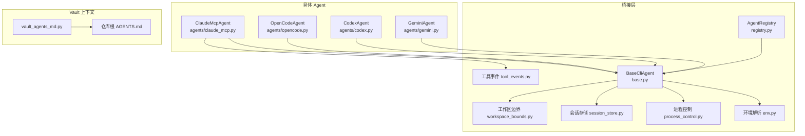
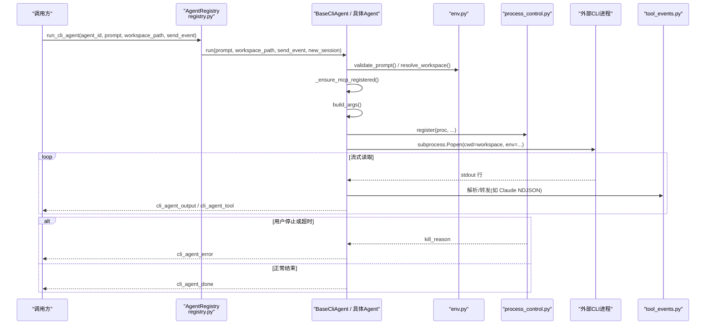
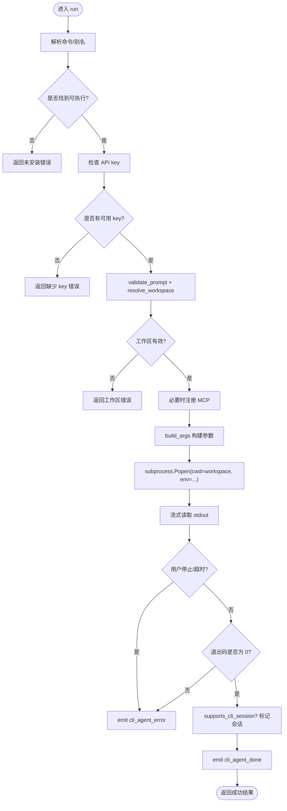
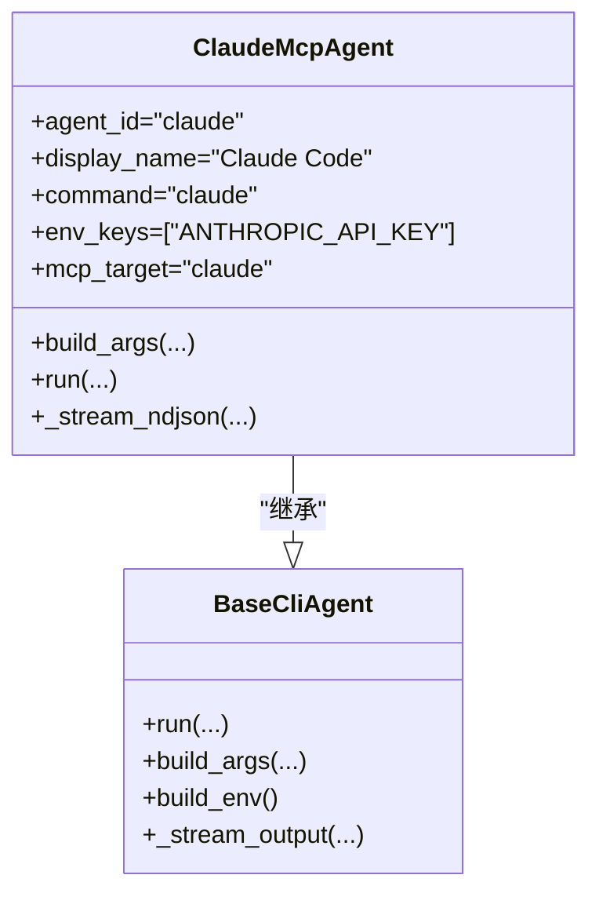
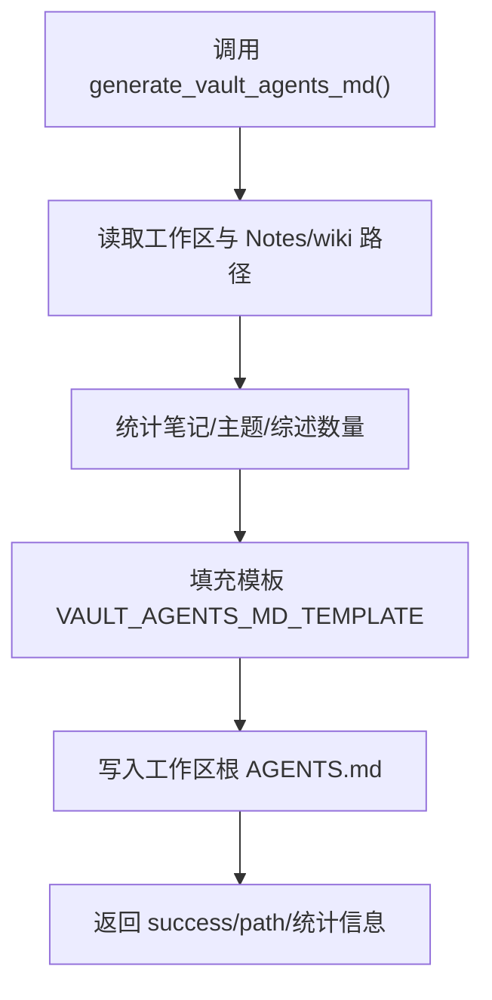
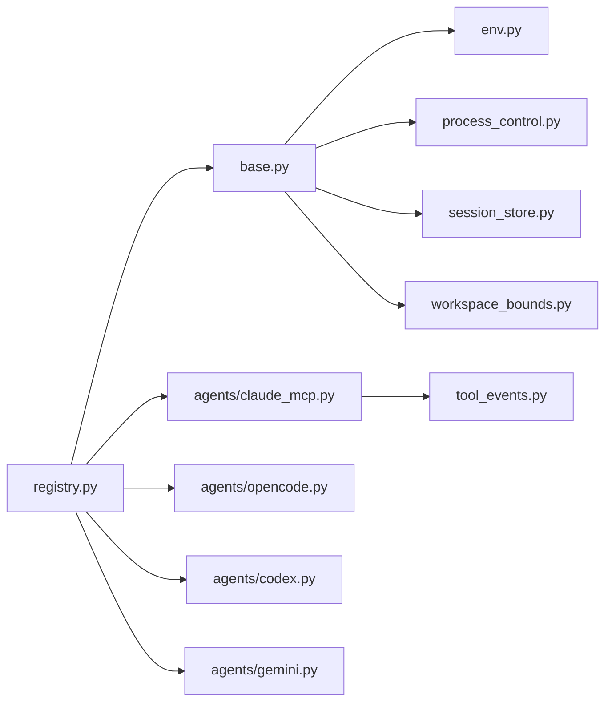
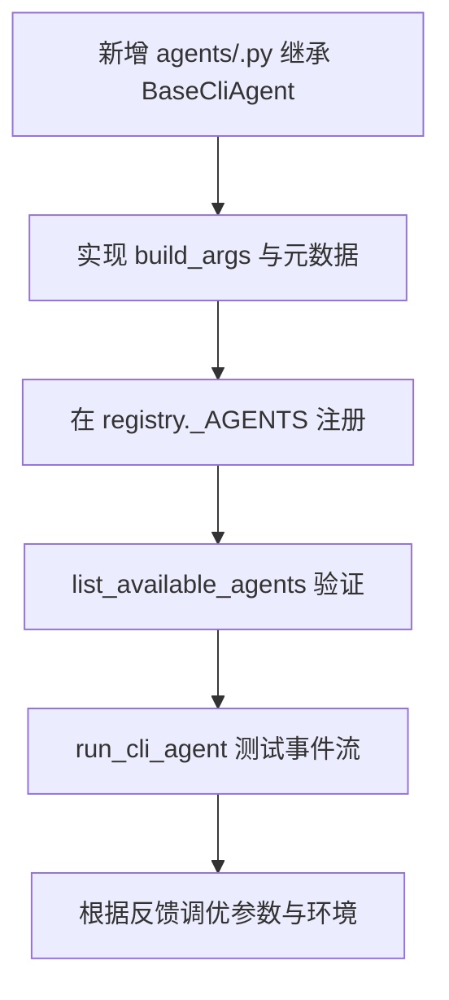

# CLI Agent 桥接

<cite>
**本文引用的文件**   
- [python/sidecar/cli_agent/__init__.py](file://python/sidecar/cli_agent/__init__.py)
- [python/sidecar/cli_agent/base.py](file://python/sidecar/cli_agent/base.py)
- [python/sidecar/cli_agent/registry.py](file://python/sidecar/cli_agent/registry.py)
- [python/sidecar/cli_agent/env.py](file://python/sidecar/cli_agent/env.py)
- [python/sidecar/cli_agent/process_control.py](file://python/sidecar/cli_agent/process_control.py)
- [python/sidecar/cli_agent/session_store.py](file://python/sidecar/cli_agent/session_store.py)
- [python/sidecar/cli_agent/workspace_bounds.py](file://python/sidecar/cli_agent/workspace_bounds.py)
- [python/sidecar/cli_agent/tool_events.py](file://python/sidecar/cli_agent/tool_events.py)
- [python/sidecar/cli_agent/agents/claude_mcp.py](file://python/sidecar/cli_agent/agents/claude_mcp.py)
- [python/sidecar/cli_agent/agents/opencode.py](file://python/sidecar/cli_agent/agents/opencode.py)
- [python/sidecar/cli_agent/agents/codex.py](file://python/sidecar/cli_agent/agents/codex.py)
- [python/sidecar/cli_agent/agents/gemini.py](file://python/sidecar/cli_agent/agents/gemini.py)
- [python/sidecar/vault_agents_md.py](file://python/sidecar/vault_agents_md.py)
- [AGENTS.md](file://AGENTS.md)
</cite>

## 目录
1. [简介](#简介)
2. [项目结构](#项目结构)
3. [核心组件](#核心组件)
4. [架构总览](#架构总览)
5. [详细组件分析](#详细组件分析)
6. [依赖关系分析](#依赖关系分析)
7. [性能与可靠性](#性能与可靠性)
8. [故障排除指南](#故障排除指南)
9. [结论](#结论)
10. [附录：扩展新的 CLI Agent](#附录扩展新的-cli-agent)

## 简介
本文件面向 NoteAI 的 CLI Agent 桥接能力，说明如何以统一接口集成外部 AI 工具（Claude Code、OpenCode、Codex、Gemini 等），并围绕以下目标展开：
- 任务派发机制：以工作区为当前工作目录，向所选 CLI agent 发送提示词并接收响应。
- AGENTS.md 自动生成：描述 vault 结构、主题体系、笔记规范，供外部 agent 读取和理解工作环境。
- 事件流处理：通过 cli_agent_output、cli_agent_done、cli_agent_error 等事件实时展示执行状态和结果。
- Agent 选择器与配置：支持不同外部工具的参数与环境变量配置。
- 实际集成示例与排障指南，以及如何扩展支持新的 CLI agent 类型。

## 项目结构
CLI Agent 桥接位于 Python sidecar 中，采用“抽象基类 + 注册表 + 具体实现”的分层设计：
- 抽象与通用逻辑：base.py、env.py、process_control.py、session_store.py、workspace_bounds.py、tool_events.py
- 注册与对外入口：registry.py、__init__.py
- 具体 Agent 实现：agents/claude_mcp.py、agents/opencode.py、agents/codex.py、agents/gemini.py
- Vault 上下文文档生成：vault_agents_md.py

图表来源
- [python/sidecar/cli_agent/registry.py:1-120](file://python/sidecar/cli_agent/registry.py#L1-L120)
- [python/sidecar/cli_agent/base.py:1-383](file://python/sidecar/cli_agent/base.py#L1-L383)
- [python/sidecar/cli_agent/env.py:1-257](file://python/sidecar/cli_agent/env.py#L1-L257)
- [python/sidecar/cli_agent/process_control.py:1-130](file://python/sidecar/cli_agent/process_control.py#L1-L130)
- [python/sidecar/cli_agent/session_store.py:1-43](file://python/sidecar/cli_agent/session_store.py#L1-L43)
- [python/sidecar/cli_agent/workspace_bounds.py:1-64](file://python/sidecar/cli_agent/workspace_bounds.py#L1-L64)
- [python/sidecar/cli_agent/tool_events.py:1-151](file://python/sidecar/cli_agent/tool_events.py#L1-L151)
- [python/sidecar/cli_agent/agents/claude_mcp.py:1-399](file://python/sidecar/cli_agent/agents/claude_mcp.py#L1-L399)
- [python/sidecar/cli_agent/agents/opencode.py:1-63](file://python/sidecar/cli_agent/agents/opencode.py#L1-L63)
- [python/sidecar/cli_agent/agents/codex.py:1-37](file://python/sidecar/cli_agent/agents/codex.py#L1-L37)
- [python/sidecar/cli_agent/agents/gemini.py:1-39](file://python/sidecar/cli_agent/agents/gemini.py#L1-L39)
- [python/sidecar/vault_agents_md.py:1-194](file://python/sidecar/vault_agents_md.py#L1-L194)
- [AGENTS.md:1-157](file://AGENTS.md#L1-L157)

章节来源
- [python/sidecar/cli_agent/__init__.py:1-29](file://python/sidecar/cli_agent/__init__.py#L1-L29)
- [python/sidecar/cli_agent/registry.py:1-120](file://python/sidecar/cli_agent/registry.py#L1-L120)

## 核心组件
- 抽象基类 BaseCliAgent：封装命令解析、环境变量构建、工作区校验、子进程启动、流式输出、超时与停止控制、MCP 自动注册、会话标记等通用流程；子类仅需实现 build_args 与元数据。
- 注册表 AgentRegistry：集中管理所有支持的 agent，提供 list/run 等统一入口。
- 环境工具 env：登录 shell 环境获取、PATH 合并、API key 查找、prompt 与工作区校验。
- 进程控制 process_control：进程注册、用户停止、超时告警。
- 会话存储 session_store：按 agent+工作区维度维护多轮会话状态。
- 工作区边界 workspace_bounds：注入安全边界提示与特定 agent 的环境限制。
- 工具事件 tool_events：从 Claude NDJSON 流解析 tool_use/tool_result 并转换为结构化 cli_agent_tool 事件。
- 具体 Agent：ClaudeMcpAgent、OpenCodeAgent、CodexAgent、GeminiAgent 分别实现各自 CLI 的参数构造与行为差异。
- Vault 上下文生成 vault_agents_md.py：为工作区生成 AGENTS.md，帮助外部 agent 理解 vault 结构与规范。

章节来源
- [python/sidecar/cli_agent/base.py:1-383](file://python/sidecar/cli_agent/base.py#L1-L383)
- [python/sidecar/cli_agent/registry.py:1-120](file://python/sidecar/cli_agent/registry.py#L1-L120)
- [python/sidecar/cli_agent/env.py:1-257](file://python/sidecar/cli_agent/env.py#L1-L257)
- [python/sidecar/cli_agent/process_control.py:1-130](file://python/sidecar/cli_agent/process_control.py#L1-L130)
- [python/sidecar/cli_agent/session_store.py:1-43](file://python/sidecar/cli_agent/session_store.py#L1-L43)
- [python/sidecar/cli_agent/workspace_bounds.py:1-64](file://python/sidecar/cli_agent/workspace_bounds.py#L1-L64)
- [python/sidecar/cli_agent/tool_events.py:1-151](file://python/sidecar/cli_agent/tool_events.py#L1-L151)
- [python/sidecar/vault_agents_md.py:1-194](file://python/sidecar/vault_agents_md.py#L1-L194)

## 架构总览
下图展示了从调用方到外部 CLI agent 的完整调用链与事件流。

图表来源
- [python/sidecar/cli_agent/registry.py:102-120](file://python/sidecar/cli_agent/registry.py#L102-L120)
- [python/sidecar/cli_agent/base.py:169-331](file://python/sidecar/cli_agent/base.py#L169-L331)
- [python/sidecar/cli_agent/env.py:227-257](file://python/sidecar/cli_agent/env.py#L227-L257)
- [python/sidecar/cli_agent/process_control.py:29-63](file://python/sidecar/cli_agent/process_control.py#L29-L63)
- [python/sidecar/cli_agent/tool_events.py:136-151](file://python/sidecar/cli_agent/tool_events.py#L136-L151)
- [python/sidecar/cli_agent/agents/claude_mcp.py:177-399](file://python/sidecar/cli_agent/agents/claude_mcp.py#L177-L399)

## 详细组件分析

### 抽象基类与统一执行流程（BaseCliAgent）
- 职责
  - 解析命令与别名、检查安装与 API key
  - 校验 prompt 与工作区路径
  - 可选自动注册 MCP server（当 mcp_target 非空）
  - 构建参数 args、环境变量 env、设置 cwd 为工作区
  - 启动子进程、流式读取输出、超时与用户停止控制
  - 发出 cli_agent_start/output/done/error 事件
  - 根据 supports_cli_session 决定是否标记会话
- 关键方法
  - run：统一入口，串联校验、MCP 注册、参数构建、进程生命周期与事件
  - build_args：由子类实现，返回传给 CLI 的参数列表
  - build_env：合并登录 shell 环境与所需 API key
  - _stream_output：逐行读取 stdout，发送 cli_agent_output，并在结束时汇总 output
  - _ensure_mcp_registered：在需要时注册 NoteAI vault MCP server

图表来源
- [python/sidecar/cli_agent/base.py:169-331](file://python/sidecar/cli_agent/base.py#L169-L331)
- [python/sidecar/cli_agent/base.py:332-383](file://python/sidecar/cli_agent/base.py#L332-L383)

章节来源
- [python/sidecar/cli_agent/base.py:1-383](file://python/sidecar/cli_agent/base.py#L1-L383)

### 注册表与对外入口（AgentRegistry）
- 职责
  - 集中声明支持的 agent 类型
  - 提供 list_available_agents 与 run_cli_agent 两个顶层函数
  - 内部缓存实例，避免重复创建
- 关键点
  - 新增 agent 需在 _AGENTS 字典注册
  - run 将请求委派给具体 agent.run，并返回标准化结果

章节来源
- [python/sidecar/cli_agent/registry.py:1-120](file://python/sidecar/cli_agent/registry.py#L1-L120)
- [python/sidecar/cli_agent/__init__.py:1-29](file://python/sidecar/cli_agent/__init__.py#L1-L29)

### 环境解析与安全检查（env.py）
- 登录 shell 环境：通过登录 shell 获取 PATH、NVM、fnm 等，解决 GUI 子进程环境缺失问题
- 命令解析：优先使用登录 shell 的 which/command -v，再回退到常见安装目录扫描
- API key 查找：环境变量 > 登录 shell > config 精确字段 > 主 api_key 兜底（兼容 OpenAI 系列）
- Prompt 与工作区校验：长度、非法字符、以“-”开头防护；工作区存在性与目录性校验

章节来源
- [python/sidecar/cli_agent/env.py:1-257](file://python/sidecar/cli_agent/env.py#L1-L257)

### 进程控制与超时告警（process_control.py）
- 进程注册与清理：全局唯一活跃进程句柄，支持 stop_active 终止
- 超时监控：idle 与 total 双阈值告警，不直接杀进程，仅通知上层
- 用户停止：设置 stop_event 后触发 kill

章节来源
- [python/sidecar/cli_agent/process_control.py:1-130](file://python/sidecar/cli_agent/process_control.py#L1-L130)

### 会话存储（session_store.py）
- 按 agent_id + 工作区绝对路径作为键，记录是否存在“已建立会话”的状态
- 用于 supports_cli_session 的 agent 在连续对话场景下复用上下文

章节来源
- [python/sidecar/cli_agent/session_store.py:1-43](file://python/sidecar/cli_agent/session_store.py#L1-L43)

### 工作区边界与安全（workspace_bounds.py）
- 在 prompt 前注入“工作区安全边界”文本，限定读写范围在当前 vault
- 针对 OpenCode 注入 OPENCODE_CONFIG_CONTENT，强制 external_directory=deny
- 继续会话时追加简短提醒，避免越权访问

章节来源
- [python/sidecar/cli_agent/workspace_bounds.py:1-64](file://python/sidecar/cli_agent/workspace_bounds.py#L1-L64)

### 工具事件解析（tool_events.py）
- 从 Claude NDJSON stream 中识别 content_block_start/delta/stop，拼装 tool_use 输入
- 从 assistant/user 消息中提取 tool_use 与 tool_result，转为 cli_agent_tool 事件
- 统一 emit_tool_events 包装事件类型

章节来源
- [python/sidecar/cli_agent/tool_events.py:1-151](file://python/sidecar/cli_agent/tool_events.py#L1-L151)

### 具体 Agent 实现

#### ClaudeMcpAgent（Claude Code，MCP 模式）
- 特点
  - 通过 --mcp-config 启动 Claude CLI，利用其内置 tool loop
  - 解析 stream-json NDJSON，映射为标准事件（text、tool_use、tool_result、error、done）
  - 自动注册 NoteAI vault MCP server
- 事件流
  - 将 Claude 的 stream_event/content_block_* 转换为 cli_agent_tool 事件
  - 聚合 assistant 文本片段，最终在 cli_agent_done 中返回

图表来源
- [python/sidecar/cli_agent/base.py:53-126](file://python/sidecar/cli_agent/base.py#L53-L126)
- [python/sidecar/cli_agent/agents/claude_mcp.py:27-168](file://python/sidecar/cli_agent/agents/claude_mcp.py#L27-L168)
- [python/sidecar/cli_agent/agents/claude_mcp.py:177-399](file://python/sidecar/cli_agent/agents/claude_mcp.py#L177-L399)

章节来源
- [python/sidecar/cli_agent/agents/claude_mcp.py:1-399](file://python/sidecar/cli_agent/agents/claude_mcp.py#L1-L399)

#### OpenCodeAgent（OpenCode）
- 特点
  - 首次运行注入 NoteAI 工作区上下文（Notes/wiki/Raw 目录说明与 MCP 建议）
  - 支持 continue-session（-c）
  - 通过 OPENCODE_CONFIG_CONTENT 强制外部目录 deny
- 参数构建
  - run --dir <workspace>，可选 --dangerously-skip-permissions，拼接 prompt

章节来源
- [python/sidecar/cli_agent/agents/opencode.py:1-63](file://python/sidecar/cli_agent/agents/opencode.py#L1-L63)
- [python/sidecar/cli_agent/workspace_bounds.py:44-64](file://python/sidecar/cli_agent/workspace_bounds.py#L44-L64)

#### CodexAgent（OpenAI Codex CLI）
- 特点
  - 使用 exec 模式，sandbox workspace-write，-C 指定工作区
  - 支持 resume --last 续跑上次会话
- 参数构建
  - 首条请求直接传 prompt；续跑使用 resume --last

章节来源
- [python/sidecar/cli_agent/agents/codex.py:1-37](file://python/sidecar/cli_agent/agents/codex.py#L1-L37)

#### GeminiAgent（Google Gemini CLI）
- 特点
  - 不支持 CLI 原生会话（supports_cli_session=False）
  - 可选 --mode autonomous 提升自主性
- 参数构建
  - -p 传入带工作区边界的 prompt

章节来源
- [python/sidecar/cli_agent/agents/gemini.py:1-39](file://python/sidecar/cli_agent/agents/gemini.py#L1-L39)

### AGENTS.md 自动生成（Vault 上下文）
- 作用
  - 为当前工作区生成 AGENTS.md，描述 vault 结构、三层知识架构、主题体系、笔记规范与运行时记忆
  - 统计 Notes 数量、主题数、综述数，便于外部 agent 快速了解规模
- 生成位置
  - 工作区根目录下 AGENTS.md
- 内容要点
  - 工作区信息、三层知识架构、主题体系（一级>二级>三级）、frontmatter 规范、综述命名与存放、AI 行为准则、操作建议、统计信息

图表来源
- [python/sidecar/vault_agents_md.py:145-194](file://python/sidecar/vault_agents_md.py#L145-L194)

章节来源
- [python/sidecar/vault_agents_md.py:1-194](file://python/sidecar/vault_agents_md.py#L1-L194)
- [AGENTS.md:1-157](file://AGENTS.md#L1-L157)

## 依赖关系分析
- 模块耦合
  - registry 依赖 agents 下的具体实现与 base 抽象
  - base 依赖 env、process_control、session_store、workspace_bounds、mcp_config_manager
  - claude_mcp 额外依赖 tool_events 进行 NDJSON 解析
- 外部依赖点
  - 外部 CLI 命令（claude、opencode、codex、gemini）
  - 环境变量（各厂商 API key）
  - 文件系统（工作区、AGENTS.md、MCP 配置文件）

图表来源
- [python/sidecar/cli_agent/registry.py:1-120](file://python/sidecar/cli_agent/registry.py#L1-L120)
- [python/sidecar/cli_agent/base.py:1-383](file://python/sidecar/cli_agent/base.py#L1-L383)
- [python/sidecar/cli_agent/agents/claude_mcp.py:1-399](file://python/sidecar/cli_agent/agents/claude_mcp.py#L1-L399)

章节来源
- [python/sidecar/cli_agent/registry.py:1-120](file://python/sidecar/cli_agent/registry.py#L1-L120)
- [python/sidecar/cli_agent/base.py:1-383](file://python/sidecar/cli_agent/base.py#L1-L383)

## 性能与可靠性
- 流式输出：逐行读取 stdout，减少内存占用，提高交互体验
- 超时与空闲告警：idle 与 total 双阈值，避免长时间无响应阻塞
- 会话复用：对支持 CLI 原生会话的 agent，标记会话可减少冷启动开销
- 环境解析优化：登录 shell 环境缓存与 PATH 智能合并，降低命令解析失败率
- 安全边界：工作区边界注入与 OpenCode 外部目录 deny，降低越权风险

[本节为通用指导，无需代码引用]

## 故障排除指南
- 未安装 CLI 命令
  - 现象：返回“未安装”或 FileNotFoundError
  - 排查：确认命令名与别名、PATH、登录 shell 环境；参考 env.resolve_command 与 common_bin_dirs
- API key 缺失
  - 现象：提示需要至少一个 API key
  - 排查：检查环境变量、登录 shell 环境、config 中的对应字段；注意 OpenAI 系列可复用主 api_key
- 工作区无效
  - 现象：提示未设置工作区或路径不存在/不是目录
  - 排查：确保 config.workspace_path 正确且存在
- 权限与越界访问
  - 现象：外部 agent 尝试访问工作区外路径
  - 排查：确认 workspace_bounds 注入生效；OpenCode 需确保 OPENCODE_CONFIG_CONTENT 包含 external_directory=deny
- 超时或被用户停止
  - 现象：收到 cli_agent_timeout_warning 或 cli_agent_error（用户已停止）
  - 排查：适当调整 idle/total 超时；检查外部 CLI 是否卡住
- Claude NDJSON 解析异常
  - 现象：tool_use/tool_result 未正确显示
  - 排查：确认 stream-json 输出格式；检查 tool_events 的解析逻辑

章节来源
- [python/sidecar/cli_agent/env.py:136-198](file://python/sidecar/cli_agent/env.py#L136-L198)
- [python/sidecar/cli_agent/env.py:227-257](file://python/sidecar/cli_agent/env.py#L227-L257)
- [python/sidecar/cli_agent/workspace_bounds.py:29-64](file://python/sidecar/cli_agent/workspace_bounds.py#L29-L64)
- [python/sidecar/cli_agent/process_control.py:65-130](file://python/sidecar/cli_agent/process_control.py#L65-L130)
- [python/sidecar/cli_agent/tool_events.py:28-151](file://python/sidecar/cli_agent/tool_events.py#L28-L151)

## 结论
NoteAI 的 CLI Agent 桥接通过统一的抽象与注册表，屏蔽了不同外部 CLI 的差异，提供了稳定的任务派发、事件流与安全保障。结合 AGENTS.md 自动生成，外部 agent 能够快速理解 vault 结构与规范，从而在受限的工作区内高效完成知识整理与创作任务。

[本节为总结性内容，无需代码引用]

## 附录：扩展新的 CLI Agent
步骤概览
- 新建 Agent 类
  - 在 python/sidecar/cli_agent/agents/ 下新增文件，继承 BaseCliAgent
  - 填写元数据：agent_id、display_name、description、command、aliases、env_keys、mcp_target、supports_cli_session
  - 实现 build_args：根据 prompt、workspace、continue_session 构建参数列表
- 注册新 Agent
  - 在 registry.py 的 _AGENTS 字典中添加条目
- 可选：自定义事件解析
  - 若外部 CLI 有独特输出格式，可在 Agent 内解析并调用 emit_tool_events 或自行发送标准事件
- 测试与验证
  - 使用 list_available_agents 确认发现
  - 使用 run_cli_agent 发起一次最小化请求，观察 cli_agent_output/done/error 事件
  - 验证工作区边界与 API key 注入是否正确

图表来源
- [python/sidecar/cli_agent/registry.py:27-33](file://python/sidecar/cli_agent/registry.py#L27-L33)
- [python/sidecar/cli_agent/base.py:53-126](file://python/sidecar/cli_agent/base.py#L53-L126)

章节来源
- [python/sidecar/cli_agent/registry.py:1-120](file://python/sidecar/cli_agent/registry.py#L1-L120)
- [python/sidecar/cli_agent/base.py:1-383](file://python/sidecar/cli_agent/base.py#L1-L383)