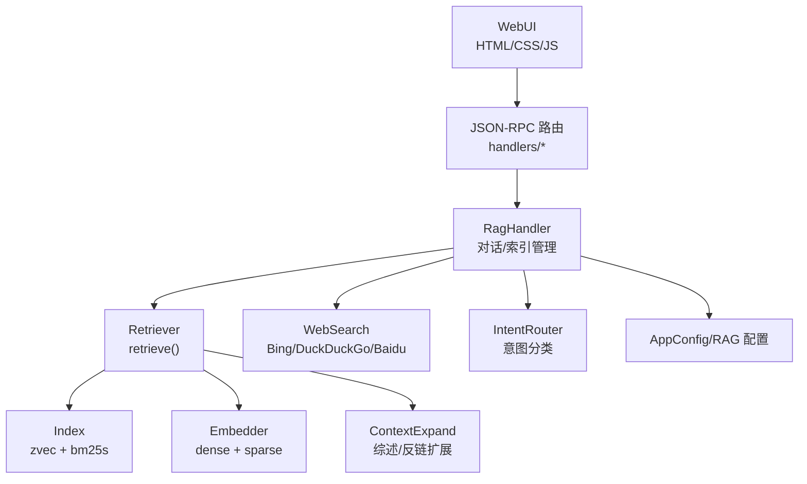
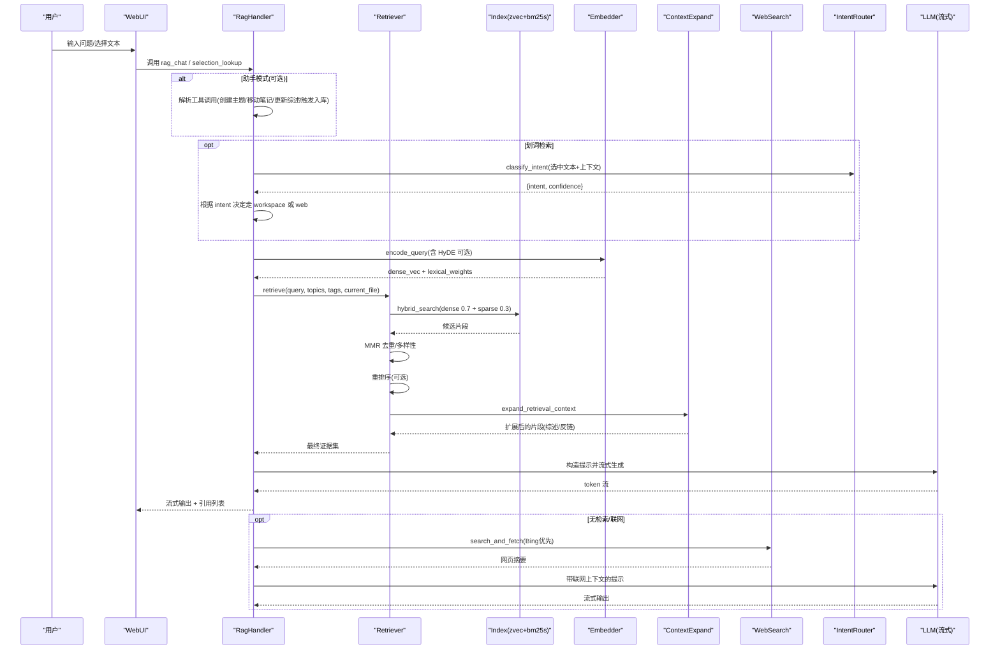
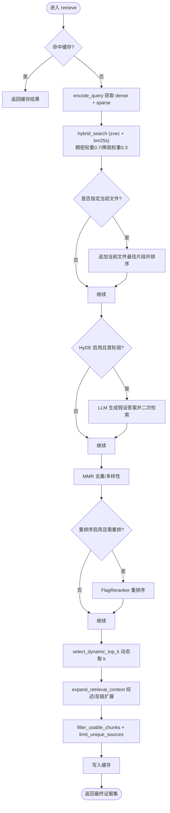
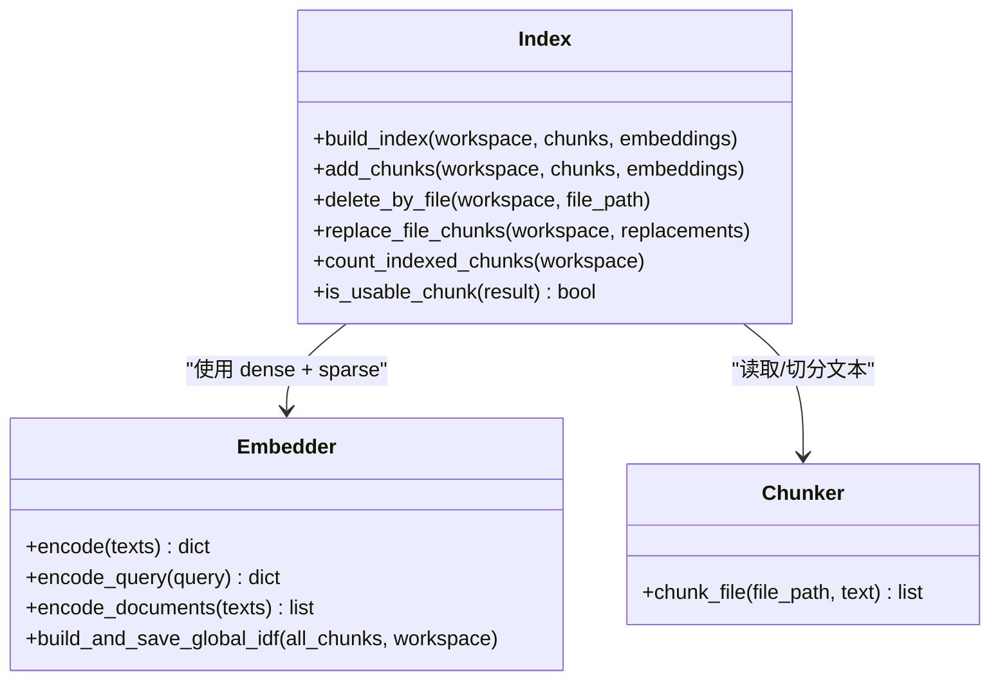
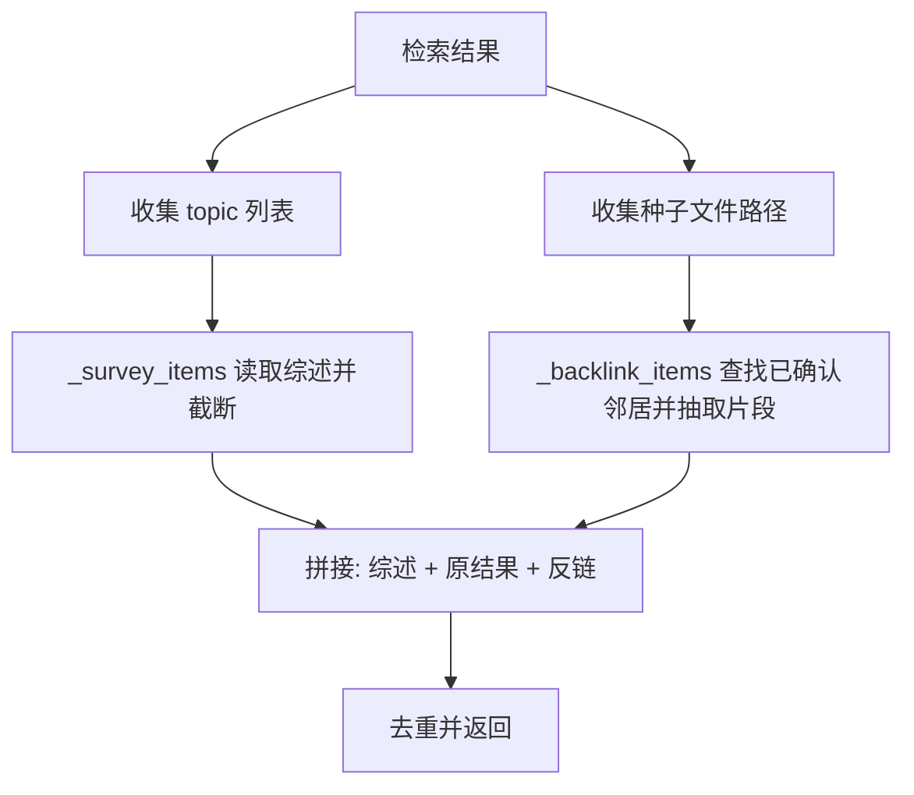
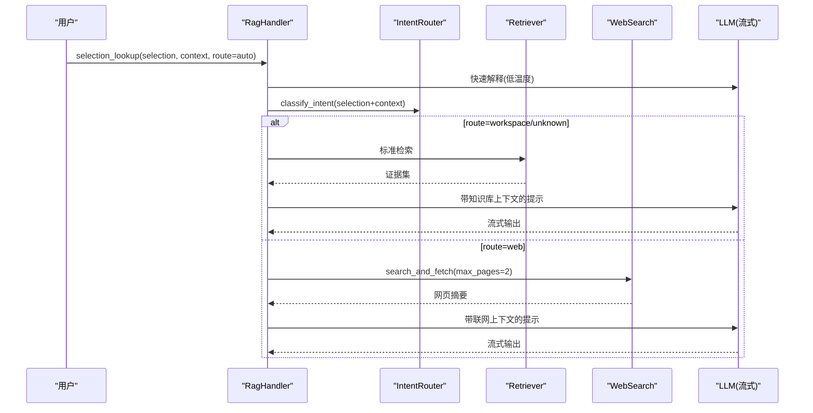
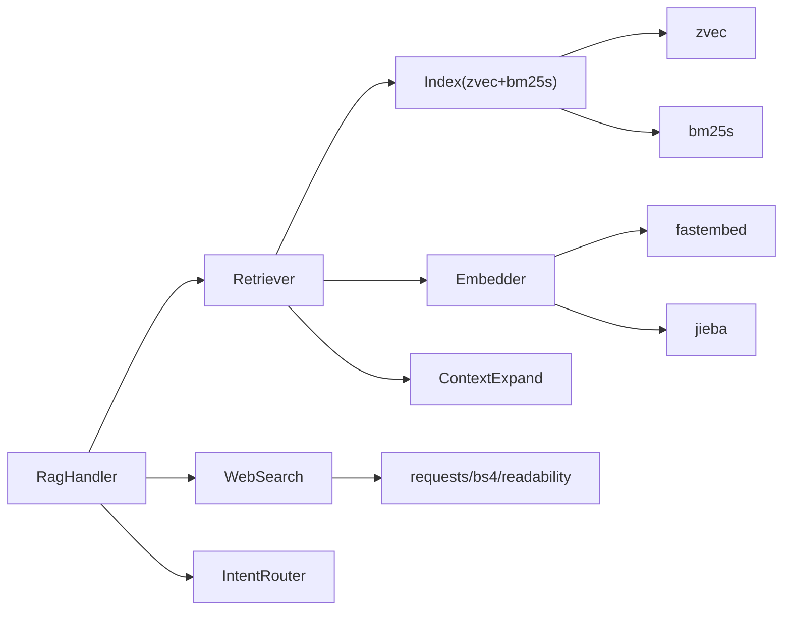

# RAG 智能问答

<cite>
**本文引用的文件**   
- [README.md](file://README.md)
- [rag_handler.py](file://python/sidecar/handlers/rag_handler.py)
- [retriever.py](file://python/sidecar/rag/retriever.py)
- [index.py](file://python/sidecar/rag/index.py)
- [embedder.py](file://python/sidecar/rag/embedder.py)
- [chunker.py](file://python/sidecar/rag/chunker.py)
- [context_expand.py](file://python/sidecar/rag/context_expand.py)
- [web_search.py](file://python/sidecar/rag/web_search.py)
- [intent_router.py](file://python/sidecar/intent_router.py)
- [rag_config.py](file://python/sidecar/rag/rag_config.py)
- [retrieval_policy.py](file://python/sidecar/rag/retrieval_policy.py)
- [app_config.py](file://config/app_config.py)
</cite>

## 目录
1. [简介](#简介)
2. [项目结构](#项目结构)
3. [核心组件](#核心组件)
4. [架构总览](#架构总览)
5. [详细组件分析](#详细组件分析)
6. [依赖关系分析](#依赖关系分析)
7. [性能考量](#性能考量)
8. [故障排查指南](#故障排查指南)
9. [结论](#结论)
10. [附录](#附录)

## 简介
本文件面向 NoteAI 的 RAG 智能问答系统，系统性说明两种运行模式与完整检索链路、上下文扩展机制、划词检索流程、用户画像配置与个性化设置，以及性能优化建议与常见问题解决方案。RAG 助手默认以“问答模式”工作：基于笔记与综述进行智能回答；在“助手模式”下，除问答外还支持创建主题、移动笔记、更新综述、触发入库等主动操作能力。检索链路遵循“提问 → HyDE（假设文档嵌入）→ zvec + bm25s 混合检索（稠密向量权重 0.7 + BM25 稀疏权重 0.3）→ 重排序 → MMR（最大边际相关性）→ LLM 流式输出”。同时提供上下文自动扩展与划词检索（先快速解释，再补充本地引用或 Bing 优先的联网证据）。

## 项目结构
NoteAI 采用 Tauri v2（Rust）+ Python sidecar 的双进程架构。前端通过 JSON-RPC 调用后端服务，RAG 相关逻辑集中在 python/sidecar 下的 handlers 与 rag 模块中。索引由 zvec（稠密向量）与 bm25s（稀疏检索）共同维护，并通过全局 IDF 提升稀疏检索质量。

图表来源
- [rag_handler.py:231-296](file://python/sidecar/handlers/rag_handler.py#L231-L296)
- [retriever.py:102-196](file://python/sidecar/rag/retriever.py#L102-L196)
- [index.py:502-581](file://python/sidecar/rag/index.py#L502-L581)
- [embedder.py:334-384](file://python/sidecar/rag/embedder.py#L334-L384)
- [context_expand.py:147-198](file://python/sidecar/rag/context_expand.py#L147-L198)
- [web_search.py:192-203](file://python/sidecar/rag/web_search.py#L192-L203)
- [intent_router.py:35-99](file://python/sidecar/intent_router.py#L35-L99)
- [app_config.py:86-98](file://config/app_config.py#L86-L98)

章节来源
- [README.md:155-203](file://README.md#L155-L203)

## 核心组件
- RagHandler：对外暴露 RAG 接口（对话、索引构建/重建、状态查询、清理记忆），负责编排检索、LLM 流式输出与结果展示。
- Retriever：实现检索主流程，包括缓存、HyDE、混合检索、MMR、重排序、动态 top-k、上下文扩展。
- Index：维护 zvec 集合与 bm25s 索引，支持全量/增量重建、批量写入、删除、元数据倒排、BM25 重建。
- Embedder：生成稠密向量与稀疏权重，维护全局 IDF，提供 query/document 编码。
- Chunker：按标题层级切分文本为块，保留 topic/tags/section_title 等元信息。
- ContextExpand：基于已确认双向链接与主题综述对检索结果做轻量扩展。
- WebSearch：Bing 优先的联网搜索与页面内容抓取。
- IntentRouter：轻量意图分类（聊天/通用/工作区/联网），用于划词检索路由。
- AppConfig/RAG 配置：集中管理 RAG 开关、HyDE 阈值、重排序开关与跳过分数、稠密权重、top-k 等运行时参数。

章节来源
- [rag_handler.py:231-296](file://python/sidecar/handlers/rag_handler.py#L231-L296)
- [retriever.py:102-196](file://python/sidecar/rag/retriever.py#L102-L196)
- [index.py:502-581](file://python/sidecar/rag/index.py#L502-L581)
- [embedder.py:334-384](file://python/sidecar/rag/embedder.py#L334-L384)
- [chunker.py:11-25](file://python/sidecar/rag/chunker.py#L11-L25)
- [context_expand.py:147-198](file://python/sidecar/rag/context_expand.py#L147-L198)
- [web_search.py:192-203](file://python/sidecar/rag/web_search.py#L192-L203)
- [intent_router.py:35-99](file://python/sidecar/intent_router.py#L35-L99)
- [rag_config.py:1-64](file://python/sidecar/rag/rag_config.py#L1-L64)
- [app_config.py:86-98](file://config/app_config.py#L86-L98)

## 架构总览
下图展示了从用户输入到最终答案的端到端流程，涵盖两种模式与关键子流程。

图表来源
- [rag_handler.py:231-296](file://python/sidecar/handlers/rag_handler.py#L231-L296)
- [retriever.py:102-196](file://python/sidecar/rag/retriever.py#L102-L196)
- [index.py:502-581](file://python/sidecar/rag/index.py#L502-L581)
- [embedder.py:334-384](file://python/sidecar/rag/embedder.py#L334-L384)
- [context_expand.py:147-198](file://python/sidecar/rag/context_expand.py#L147-L198)
- [web_search.py:253-286](file://python/sidecar/rag/web_search.py#L253-L286)
- [intent_router.py:35-99](file://python/sidecar/intent_router.py#L35-L99)

## 详细组件分析

### 检索链路详解（问答模式）
- 入口与缓存：retrieve 使用 TTL 缓存避免重复计算，键包含工作区、查询、主题、标签与当前文件。
- 初始检索：encode_query 得到稠密向量与稀疏权重，hybrid_search 执行 zvec 与 bm25s 混合检索，默认稠密权重 0.7、稀疏权重 0.3。
- 当前文件增强：若打开当前文件，会单独检索该文件的最佳片段作为候选，但不赋予特权，仍参与后续排序。
- HyDE 条件触发：当未启用或首轮检索最强得分低于阈值时，调用 LLM 生成假设性答案，再用其向量与稀疏权重二次检索，合并去重后截断至候选上限。
- MMR 去重：在候选集上执行最大边际相关性，平衡相关性与时序多样性。
- 重排序：若开启且首条得分未超过跳过阈值，则加载 FlagReranker 对候选进行 rerank。
- 动态 top-k：根据查询复杂度与分数分布自适应选取最终引用数量。
- 上下文扩展：将主题综述与已确认反链片段插入结果前后，形成更丰富的上下文。
- 过滤与限源：去除空内容，限制唯一来源数量，保证证据多样。

图表来源
- [retriever.py:102-196](file://python/sidecar/rag/retriever.py#L102-L196)
- [retriever.py:198-227](file://python/sidecar/rag/retriever.py#L198-L227)
- [retriever.py:229-291](file://python/sidecar/rag/retriever.py#L229-L291)
- [retriever.py:293-325](file://python/sidecar/rag/retriever.py#L293-L325)
- [retrieval_policy.py:58-86](file://python/sidecar/rag/retrieval_policy.py#L58-L86)
- [context_expand.py:147-198](file://python/sidecar/rag/context_expand.py#L147-L198)
- [rag_config.py:31-41](file://python/sidecar/rag/rag_config.py#L31-L41)
- [rag_config.py:43-54](file://python/sidecar/rag/rag_config.py#L43-L54)
- [rag_config.py:57-64](file://python/sidecar/rag/rag_config.py#L57-L64)

章节来源
- [retriever.py:102-196](file://python/sidecar/rag/retriever.py#L102-L196)
- [retriever.py:198-227](file://python/sidecar/rag/retriever.py#L198-L227)
- [retriever.py:229-291](file://python/sidecar/rag/retriever.py#L229-L291)
- [retriever.py:293-325](file://python/sidecar/rag/retriever.py#L293-L325)
- [retrieval_policy.py:58-86](file://python/sidecar/rag/retrieval_policy.py#L58-L86)
- [context_expand.py:147-198](file://python/sidecar/rag/context_expand.py#L147-L198)
- [rag_config.py:31-41](file://python/sidecar/rag/rag_config.py#L31-L41)
- [rag_config.py:43-54](file://python/sidecar/rag/rag_config.py#L43-L54)
- [rag_config.py:57-64](file://python/sidecar/rag/rag_config.py#L57-L64)

### 索引与嵌入（zvec + bm25s）
- 索引结构：zvec 存储稠密向量与字段（content/file_path/topic/tags_json/section_title），bm25s 存储稀疏索引，metadata.json 维护 topic/tag/file 倒排。
- 构建流程：分批写入 zvec，原子替换集合文件，随后构建 bm25s 与 metadata，最后更新 manifest。
- 增量更新：对比 manifest 与当前文件 mtime/size，仅处理新增/修改/删除，批量删除后再统一重建 bm25s 与全局 IDF。
- 全局 IDF：在全量重建时计算并持久化，查询阶段优先使用全局 IDF，否则回退到批次内 IDF。

图表来源
- [index.py:502-581](file://python/sidecar/rag/index.py#L502-L581)
- [index.py:596-702](file://python/sidecar/rag/index.py#L596-L702)
- [index.py:704-773](file://python/sidecar/rag/index.py#L704-L773)
- [embedder.py:334-384](file://python/sidecar/rag/embedder.py#L334-L384)
- [embedder.py:258-285](file://python/sidecar/rag/embedder.py#L258-L285)
- [chunker.py:11-25](file://python/sidecar/rag/chunker.py#L11-L25)

章节来源
- [index.py:502-581](file://python/sidecar/rag/index.py#L502-L581)
- [index.py:596-702](file://python/sidecar/rag/index.py#L596-L702)
- [index.py:704-773](file://python/sidecar/rag/index.py#L704-L773)
- [embedder.py:334-384](file://python/sidecar/rag/embedder.py#L334-L384)
- [embedder.py:258-285](file://python/sidecar/rag/embedder.py#L258-L285)
- [chunker.py:11-25](file://python/sidecar/rag/chunker.py#L11-L25)

### 上下文扩展机制
- 主题综述：根据命中片段的 topic 提取对应综述文件，截取前若干字符作为高置信度上下文。
- 反链扩展：基于已确认的双向链接，抽取邻居文件的前若干字符或索引片段，作为辅助背景。
- 顺序与去重：综述前置、原始结果居中、反链后置，整体去重以保证不重复引用。

图表来源
- [context_expand.py:59-101](file://python/sidecar/rag/context_expand.py#L59-L101)
- [context_expand.py:103-145](file://python/sidecar/rag/context_expand.py#L103-L145)
- [context_expand.py:147-198](file://python/sidecar/rag/context_expand.py#L147-L198)

章节来源
- [context_expand.py:59-101](file://python/sidecar/rag/context_expand.py#L59-L101)
- [context_expand.py:103-145](file://python/sidecar/rag/context_expand.py#L103-L145)
- [context_expand.py:147-198](file://python/sidecar/rag/context_expand.py#L147-L198)

### 划词检索流程
- 快速解释：先调用 LLM 对选中文本给出简洁明确的快速解释（非检索结论）。
- 意图路由：根据选中文本与上下文，使用 IntentRouter 判断走工作区还是联网。
- 知识库补充：若判定为工作区，则复用标准检索链路，附加“知识库补充”段落。
- 联网补充：若判定为联网，则调用 Bing 优先的搜索与页面抓取，附加“联网补充”段落。

图表来源
- [rag_handler.py:329-362](file://python/sidecar/handlers/rag_handler.py#L329-L362)
- [intent_router.py:35-99](file://python/sidecar/intent_router.py#L35-L99)
- [web_search.py:253-286](file://python/sidecar/rag/web_search.py#L253-L286)

章节来源
- [rag_handler.py:329-362](file://python/sidecar/handlers/rag_handler.py#L329-L362)
- [intent_router.py:35-99](file://python/sidecar/intent_router.py#L35-L99)
- [web_search.py:253-286](file://python/sidecar/rag/web_search.py#L253-L286)

### 助手模式（Agent Mode）
- 能力扩展：在问答基础上支持创建主题（一级/二级）、移动笔记、更新综述、触发入库整理等主动操作。
- 安全约束：创建二级主题时必须显式指定一级父主题，不做自动猜测。
- 保存策略：优质回答可保存到 Notes/RAG对话/、wiki/ 或追加到主题综述。
- 用户画像：设置 → RAG助手，Markdown 描述背景与偏好，作为提示的一部分帮助模型理解用户。

章节来源
- [README.md:113-127](file://README.md#L113-L127)
- [README.md:342-356](file://README.md#L342-L356)

### 用户画像与个性化设置
- 用户画像：位于工作区 .ai_memory/user_profile.json，RagHandler 在每次对话时加载并注入提示，限定长度以避免上下文膨胀。
- RAG 配置：通过 AppConfig 与 rag_config 控制开关与阈值，如 rag_enabled、rag_hyde_enabled、rag_rerank_enabled、rag_dense_weight、rag_top_k 等。
- 会话历史压缩：仅保留最近若干轮，并对长消息进行关键词摘要，降低上下文开销。

章节来源
- [rag_handler.py:311-328](file://python/sidecar/handlers/rag_handler.py#L311-L328)
- [rag_handler.py:297-310](file://python/sidecar/handlers/rag_handler.py#L297-L310)
- [app_config.py:86-98](file://config/app_config.py#L86-L98)
- [rag_config.py:1-64](file://python/sidecar/rag/rag_config.py#L1-L64)

## 依赖关系分析
- 组件耦合：RagHandler 依赖 Retriever/Index/Embedder/WebSearch/IntentRouter；Retriever 依赖 Index/Embedder/ContextExpand/Policy；Index 依赖 zvec/bm25s；Embedder 依赖 fastembed/jieba。
- 外部依赖：FlagReranker（重排序）、zvec（稠密向量库）、bm25s（稀疏检索）、requests/BeautifulSoup（网页抓取）、readability/markdownify（页面清洗）。
- 潜在循环：模块间通过函数级导入避免启动期循环依赖；索引与 BM25 缓存隔离，减少热路径阻塞。

图表来源
- [rag_handler.py:231-296](file://python/sidecar/handlers/rag_handler.py#L231-L296)
- [retriever.py:102-196](file://python/sidecar/rag/retriever.py#L102-L196)
- [index.py:502-581](file://python/sidecar/rag/index.py#L502-L581)
- [embedder.py:334-384](file://python/sidecar/rag/embedder.py#L334-L384)
- [web_search.py:192-203](file://python/sidecar/rag/web_search.py#L192-L203)
- [intent_router.py:35-99](file://python/sidecar/intent_router.py#L35-L99)

章节来源
- [rag_handler.py:231-296](file://python/sidecar/handlers/rag_handler.py#L231-L296)
- [retriever.py:102-196](file://python/sidecar/rag/retriever.py#L102-L196)
- [index.py:502-581](file://python/sidecar/rag/index.py#L502-L581)
- [embedder.py:334-384](file://python/sidecar/rag/embedder.py#L334-L384)
- [web_search.py:192-203](file://python/sidecar/rag/web_search.py#L192-L203)
- [intent_router.py:35-99](file://python/sidecar/intent_router.py#L35-L99)

## 性能考量
- 索引与检索
  - 使用 zvec 的 HNSW 索引与 bm25s 的本地索引，兼顾召回与速度。
  - 全量/增量重建分离，批量写入与原子替换保障一致性。
  - BM25 检索器与 zvec 集合句柄缓存，避免频繁 IO 与重建。
- 嵌入与稀疏
  - 全局 IDF 持久化，查询阶段优先使用，减少批次内统计开销。
  - ONNX 推理线程数按 CPU 核数自适应，避免过度并行导致抖动。
- 重排序与 HyDE
  - 重排序具备冷却与跳过阈值，避免对强结果重复计算。
  - HyDE 仅在首轮检索较弱时触发，减少不必要的 LLM 调用。
- 上下文与缓存
  - 检索结果 TTL 缓存（5 分钟），相同查询直接命中。
  - 动态 top-k 与唯一来源限制，控制最终上下文规模。

章节来源
- [index.py:287-311](file://python/sidecar/rag/index.py#L287-L311)
- [embedder.py:103-108](file://python/sidecar/rag/embedder.py#L103-L108)
- [embedder.py:258-285](file://python/sidecar/rag/embedder.py#L258-L285)
- [retriever.py:47-85](file://python/sidecar/rag/retriever.py#L47-L85)
- [retriever.py:160-174](file://python/sidecar/rag/retriever.py#L160-L174)
- [retriever.py:38-41](file://python/sidecar/rag/retriever.py#L38-L41)
- [retrieval_policy.py:58-86](file://python/sidecar/rag/retrieval_policy.py#L58-L86)

## 故障排查指南
- 索引被占用
  - 现象：打开集合时报锁错误。
  - 处理：关闭其他 NoteAI 实例，等待 GC 释放句柄，必要时重启进程。
- 重排序不可用
  - 现象：首次加载失败进入冷却期。
  - 处理：检查网络与 HF 镜像，稍后重试；可通过环境变量禁用重排序。
- 嵌入模型加载失败
  - 现象：ONNXRuntimeError 或模型缺失。
  - 处理：自动清理损坏快照并重试；确保 hf-mirror 可达。
- 联网搜索失败
  - 现象：Bing 无结果或超时。
  - 处理：自动回退 DuckDuckGo 与百度；检查代理与超时设置。
- API 配置错误
  - 现象：对话失败并记录冷却状态。
  - 处理：校验 API Key/Base/Model，清除冷却文件后重试。

章节来源
- [index.py:169-190](file://python/sidecar/rag/index.py#L169-L190)
- [retriever.py:47-85](file://python/sidecar/rag/retriever.py#L47-L85)
- [embedder.py:117-165](file://python/sidecar/rag/embedder.py#L117-L165)
- [web_search.py:192-203](file://python/sidecar/rag/web_search.py#L192-L203)
- [rag_handler.py:117-152](file://python/sidecar/handlers/rag_handler.py#L117-L152)
- [rag_handler.py:416-476](file://python/sidecar/handlers/rag_handler.py#L416-L476)

## 结论
NoteAI 的 RAG 智能问答系统在架构上清晰分层、在检索链路上兼顾召回与效率，并通过 HyDE、混合检索、重排序与 MMR 的组合提升答案质量。上下文扩展与划词检索进一步增强了用户体验。配合用户画像与个性化设置，系统可在不同场景下灵活切换工作区检索与联网检索。通过索引与嵌入的性能优化、缓存与动态策略，整体具备良好的可扩展性与稳定性。

## 附录
- 快速开始与功能概览参见 README。
- 配置项参考 AppConfig 与 RAG 配置模块。

章节来源
- [README.md:113-127](file://README.md#L113-L127)
- [README.md:342-356](file://README.md#L342-L356)
- [app_config.py:86-98](file://config/app_config.py#L86-L98)
- [rag_config.py:1-64](file://python/sidecar/rag/rag_config.py#L1-L64)