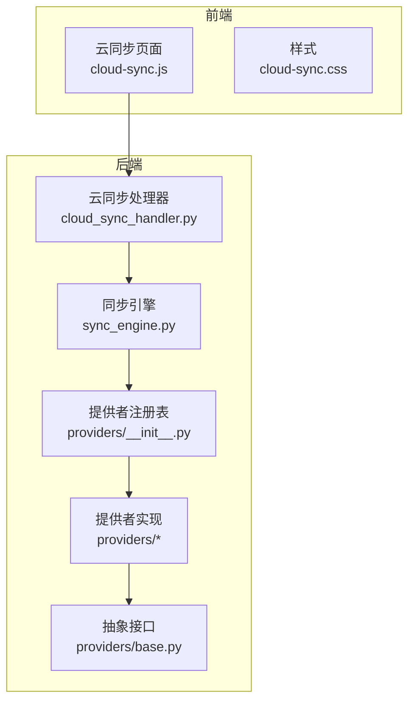
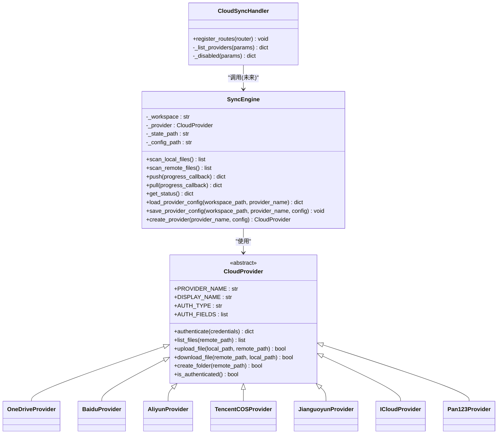
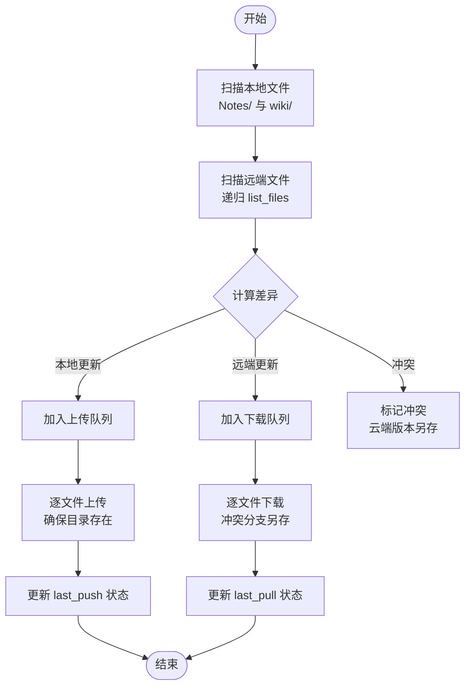
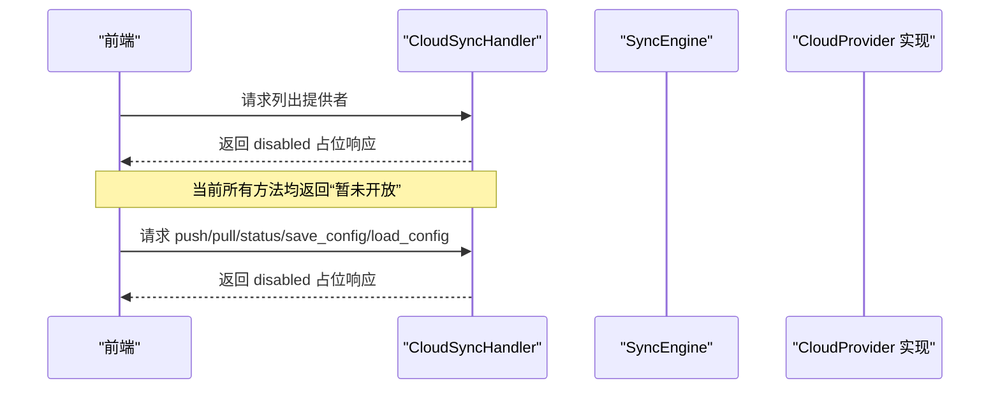
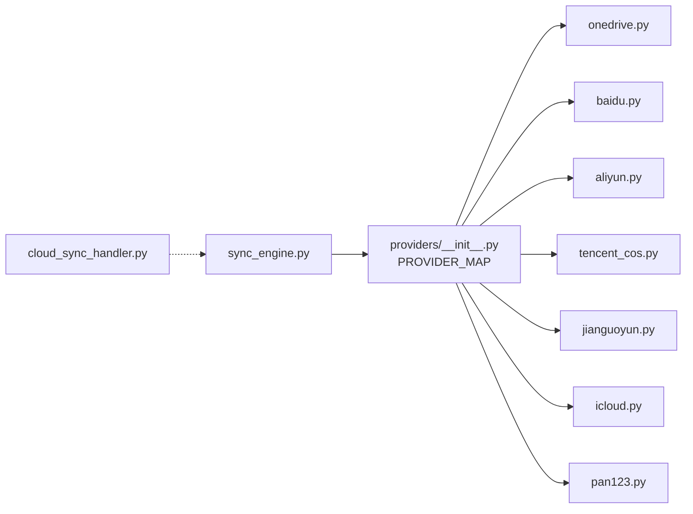

# 云同步服务

<cite>
**本文引用的文件**   
- [sync_engine.py](file://python/sidecar/cloud/sync_engine.py)
- [base.py](file://python/sidecar/cloud/providers/base.py)
- [__init__.py](file://python/sidecar/cloud/providers/__init__.py)
- [aliyun.py](file://python/sidecar/cloud/providers/aliyun.py)
- [baidu.py](file://python/sidecar/cloud/providers/baidu.py)
- [jianguoyun.py](file://python/sidecar/cloud/providers/jianguoyun.py)
- [onedrive.py](file://python/sidecar/cloud/providers/onedrive.py)
- [tencent_cos.py](file://python/sidecar/cloud/providers/tencent_cos.py)
- [icloud.py](file://python/sidecar/cloud/providers/icloud.py)
- [pan123.py](file://python/sidecar/cloud/providers/pan123.py)
- [cloud_sync_handler.py](file://python/sidecar/handlers/cloud_sync_handler.py)
- [cloud_sync.py](file://prompts/cloud_sync.py)
- [cloud-sync.js](file://webui/js/cloud-sync.js)
- [cloud-sync.css](file://webui/css/cloud-sync.css)
</cite>

## 目录
1. [简介](#简介)
2. [项目结构](#项目结构)
3. [核心组件](#核心组件)
4. [架构总览](#架构总览)
5. [详细组件分析](#详细组件分析)
6. [依赖关系分析](#依赖关系分析)
7. [性能与可靠性建议](#性能与可靠性建议)
8. [常见问题排查](#常见问题排查)
9. [结论](#结论)
10. [附录：配置与认证指南](#附录配置与认证指南)

## 简介
NoteAI 的云同步服务提供实验性的多云存储同步能力，当前处于“占位”阶段：后端接口已预留，但功能默认禁用。该文档面向用户与开发者，说明以下要点：
- 如何启用实验性云同步入口（设置 → 界面 → 启用实验功能）
- 支持的云存储提供商及统一抽象层设计
- 增量同步机制、冲突处理策略与数据一致性保障
- 同步引擎的核心能力：双向同步、断点续传现状、错误重试现状
- 各云服务的配置方法与认证流程
- 性能优化建议、常见问题排查与最佳实践

## 项目结构
云同步相关代码主要分布在以下位置：
- 同步引擎与提供者注册：python/sidecar/cloud/sync_engine.py、python/sidecar/cloud/providers/*
- 同步处理器（RPC 入口）：python/sidecar/handlers/cloud_sync_handler.py
- 前端占位页面与样式：webui/js/cloud-sync.js、webui/css/cloud-sync.css
- 提示文案模板：prompts/cloud_sync.py

图表来源
- [cloud_sync_handler.py:1-33](file://python/sidecar/handlers/cloud_sync_handler.py#L1-L33)
- [sync_engine.py:1-342](file://python/sidecar/cloud/sync_engine.py#L1-L342)
- [__init__.py:1-37](file://python/sidecar/cloud/providers/__init__.py#L1-L37)
- [base.py:1-41](file://python/sidecar/cloud/providers/base.py#L1-L41)
- [cloud-sync.js:1-30](file://webui/js/cloud-sync.js#L1-L30)
- [cloud-sync.css:1-150](file://webui/css/cloud-sync.css#L1-L150)

章节来源
- [cloud_sync_handler.py:1-33](file://python/sidecar/handlers/cloud_sync_handler.py#L1-L33)
- [sync_engine.py:1-342](file://python/sidecar/cloud/sync_engine.py#L1-L342)
- [__init__.py:1-37](file://python/sidecar/cloud/providers/__init__.py#L1-L37)
- [base.py:1-41](file://python/sidecar/cloud/providers/base.py#L1-L41)
- [cloud-sync.js:1-30](file://webui/js/cloud-sync.js#L1-L30)
- [cloud-sync.css:1-150](file://webui/css/cloud-sync.css#L1-L150)

## 核心组件
- 抽象接口 CloudProvider：定义统一的认证、列举、上传、下载、创建文件夹、认证状态检查等能力。
- 提供者注册表 PROVIDER_MAP：集中管理所有已实现的云存储提供者类。
- 同步引擎 SyncEngine：负责本地与远端扫描、差异计算、上传/下载、冲突处理、状态持久化与凭据安全存储。
- 云同步处理器 CloudSyncHandler：对外暴露 RPC 路由，当前全部方法返回“未启用”占位响应。
- 前端模块 CloudSyncModule：渲染占位卡片，等待后端开放后接入交互。

章节来源
- [base.py:1-41](file://python/sidecar/cloud/providers/base.py#L1-L41)
- [__init__.py:1-37](file://python/sidecar/cloud/providers/__init__.py#L1-L37)
- [sync_engine.py:1-342](file://python/sidecar/cloud/sync_engine.py#L1-L342)
- [cloud_sync_handler.py:1-33](file://python/sidecar/handlers/cloud_sync_handler.py#L1-L33)
- [cloud-sync.js:1-30](file://webui/js/cloud-sync.js#L1-L30)

## 架构总览
云同步采用“统一抽象 + 多实现 + 引擎编排”的架构：
- 上层通过 SyncEngine 进行工作区扫描与同步决策
- 底层通过 CloudProvider 抽象屏蔽不同云厂商 API 差异
- 处理器作为 RPC 边界，当前仅保留入口并返回禁用消息
- 前端以占位形式展示，待后端开放后逐步接入

图表来源
- [base.py:1-41](file://python/sidecar/cloud/providers/base.py#L1-L41)
- [onedrive.py:1-129](file://python/sidecar/cloud/providers/onedrive.py#L1-L129)
- [baidu.py:1-115](file://python/sidecar/cloud/providers/baidu.py#L1-L115)
- [aliyun.py:1-247](file://python/sidecar/cloud/providers/aliyun.py#L1-L247)
- [tencent_cos.py:1-155](file://python/sidecar/cloud/providers/tencent_cos.py#L1-L155)
- [jianguoyun.py:1-161](file://python/sidecar/cloud/providers/jianguoyun.py#L1-L161)
- [icloud.py:1-86](file://python/sidecar/cloud/providers/icloud.py#L1-L86)
- [pan123.py:1-258](file://python/sidecar/cloud/providers/pan123.py#L1-L258)
- [sync_engine.py:1-342](file://python/sidecar/cloud/sync_engine.py#L1-L342)
- [cloud_sync_handler.py:1-33](file://python/sidecar/handlers/cloud_sync_handler.py#L1-L33)

## 详细组件分析

### 同步引擎（SyncEngine）
- 扫描与差异计算
  - 本地扫描：遍历 Notes/ 与 wiki/ 两个同步根目录，收集相对路径、mtime、size，忽略隐藏文件。
  - 远端扫描：递归调用提供者的 list_files，聚合为相同结构的列表。
  - 差异判定：基于 mtime 比较（允许 1 秒容差），决定上传或下载。
- 上传（push）
  - 自动确保远端目录存在
  - 逐个上传，统计成功/失败/跳过数量，更新 last_push 状态
- 拉取（pull）
  - 分类需要下载的文件与冲突文件
  - 冲突时不覆盖本地，将云端版本保存为带时间戳后缀的文件（如 _cloud_xxx）
  - 更新 last_pull 状态
- 状态与配置
  - 状态文件：.noteai/cloud_sync_state.json
  - 配置合并：.noteai/cloud_sync_config.json，敏感字段从系统钥匙串恢复
  - 凭据安全：敏感键值（password/secret/token/key/credential/auth 等）写入系统钥匙串，JSON 中仅保留占位符
- 提供者工厂
  - 根据 PROVIDER_MAP 动态创建具体提供者实例

图表来源
- [sync_engine.py:62-163](file://python/sidecar/cloud/sync_engine.py#L62-L163)
- [sync_engine.py:165-256](file://python/sidecar/cloud/sync_engine.py#L165-L256)
- [sync_engine.py:258-269](file://python/sidecar/cloud/sync_engine.py#L258-L269)
- [sync_engine.py:271-342](file://python/sidecar/cloud/sync_engine.py#L271-L342)

章节来源
- [sync_engine.py:1-342](file://python/sidecar/cloud/sync_engine.py#L1-L342)

### 抽象接口与提供者实现
- 抽象接口 CloudProvider
  - 统一认证、列举、上传、下载、创建文件夹、认证状态检查
  - 声明式 AUTH_FIELDS 描述 UI 表单字段
- 已实现提供者
  - OneDrive：OAuth 设备流，Graph API，支持 token 过期判断
  - 百度网盘：access_token 鉴权，PCS 上传/下载
  - 阿里云盘：access_token 鉴权，OpenAPI 分步上传/下载
  - 腾讯云 COS：SecretId/Key + Bucket/Region，SDK 封装
  - 坚果云：WebDAV，用户名+应用密码，MKCOL/PUT/GET
  - iCloud：本地路径映射，文件系统直读/写
  - 123云盘：Client ID/Secret 获取 access_token，OpenAPI 操作

图表来源
- [cloud_sync_handler.py:1-33](file://python/sidecar/handlers/cloud_sync_handler.py#L1-L33)

章节来源
- [base.py:1-41](file://python/sidecar/cloud/providers/base.py#L1-L41)
- [onedrive.py:1-129](file://python/sidecar/cloud/providers/onedrive.py#L1-L129)
- [baidu.py:1-115](file://python/sidecar/cloud/providers/baidu.py#L1-L115)
- [aliyun.py:1-247](file://python/sidecar/cloud/providers/aliyun.py#L1-L247)
- [tencent_cos.py:1-155](file://python/sidecar/cloud/providers/tencent_cos.py#L1-L155)
- [jianguoyun.py:1-161](file://python/sidecar/cloud/providers/jianguoyun.py#L1-L161)
- [icloud.py:1-86](file://python/sidecar/cloud/providers/icloud.py#L1-L86)
- [pan123.py:1-258](file://python/sidecar/cloud/providers/pan123.py#L1-L258)

### 前端占位模块
- 渲染占位卡片，显示“云同步暂未开放”的提示
- 尝试调用 cloudSyncListProviders，但不会执行实际动作
- 样式文件定义了占位卡片与后续扩展的卡片样式

章节来源
- [cloud-sync.js:1-30](file://webui/js/cloud-sync.js#L1-L30)
- [cloud-sync.css:1-150](file://webui/css/cloud-sync.css#L1-L150)

### 提示文案模板
- 冲突通知、推送摘要、拉取摘要的文本模板，便于后续集成到 UI 或日志中

章节来源
- [cloud_sync.py:1-27](file://prompts/cloud_sync.py#L1-L27)

## 依赖关系分析
- 提供者注册表集中导入所有实现类，并通过 PROVIDER_MAP 暴露名称到类的映射
- 同步引擎通过 create_provider 按名称选择具体实现
- 处理器目前仅注册路由并返回禁用消息，未直接依赖引擎

图表来源
- [__init__.py:1-37](file://python/sidecar/cloud/providers/__init__.py#L1-L37)
- [sync_engine.py:337-342](file://python/sidecar/cloud/sync_engine.py#L337-L342)
- [cloud_sync_handler.py:1-33](file://python/sidecar/handlers/cloud_sync_handler.py#L1-L33)

章节来源
- [__init__.py:1-37](file://python/sidecar/cloud/providers/__init__.py#L1-L37)
- [sync_engine.py:337-342](file://python/sidecar/cloud/sync_engine.py#L337-L342)
- [cloud_sync_handler.py:1-33](file://python/sidecar/handlers/cloud_sync_handler.py#L1-L33)

## 性能与可靠性建议
- 增量同步
  - 基于 mtime 的差异检测已实现；建议在大规模场景下引入内容哈希（如 MD5/SHA）以减少时间戳漂移导致的误判
- 并发与批处理
  - 当前为串行上传/下载；可考虑对大目录分批并行，结合速率限制避免触发云服务限流
- 断点续传
  - 部分提供者（如阿里云盘）支持分片上传 URL；可在上传前记录进度并在异常时恢复
- 错误重试
  - 当前异常被捕获并计数，未实现指数退避重试；建议增加可配置的重试次数与退避策略
- 网络与超时
  - 合理设置连接与读取超时，避免长时间阻塞；对大文件下载使用流式写入
- 状态持久化
  - 在每次任务完成后持久化状态，支持中断后继续；可增加“进行中”任务清单与失败重试队列

[本节为通用建议，无需源码引用]

## 常见问题排查
- 云同步入口不可用
  - 现象：点击云同步页面仅显示占位提示
  - 原因：处理器所有方法返回“暂未开放”
  - 解决：启用实验功能后由后端逐步开放对应路由
- 认证失败
  - 现象：认证返回失败信息
  - 排查：确认 Access Token / Client ID / Secret / 用户名与应用密码是否正确；检查网络连通性与权限范围
- 上传/下载失败
  - 现象：返回失败计数
  - 排查：检查目标目录是否存在、文件名是否合法、磁盘空间是否充足；查看日志中的警告信息
- 冲突文件过多
  - 现象：大量 _cloud_ 后缀文件
  - 排查：确认两端编辑时间是否一致；必要时手动合并冲突版本
- 凭据丢失
  - 现象：配置文件中敏感字段为空
  - 排查：系统钥匙串是否可用；重新保存配置以恢复凭据

章节来源
- [cloud_sync_handler.py:1-33](file://python/sidecar/handlers/cloud_sync_handler.py#L1-L33)
- [sync_engine.py:119-163](file://python/sidecar/cloud/sync_engine.py#L119-L163)
- [sync_engine.py:216-256](file://python/sidecar/cloud/sync_engine.py#L216-L256)
- [sync_engine.py:271-342](file://python/sidecar/cloud/sync_engine.py#L271-L342)

## 结论
NoteAI 的云同步服务已完成基础架构与多提供者实现，当前处于“占位”阶段。同步引擎具备增量同步、冲突处理与凭据安全存储能力；前端与处理器已预留入口。下一步建议优先开放核心路由、完善错误重试与断点续传，并增强并发与监控能力，以提升用户体验与稳定性。

[本节为总结，无需源码引用]

## 附录：配置与认证指南

### 启用实验性云同步入口
- 路径：设置 → 界面 → 启用实验功能
- 作用：使云同步页面可见，但功能仍可能受后端开关控制

[本节为概念性说明，无需源码引用]

### 支持的云存储提供商
- WebDAV（示例：坚果云）
- 坚果云
- 阿里云盘
- 腾讯云 COS
- OneDrive
- 百度网盘
- iCloud
- 123云盘

章节来源
- [__init__.py:1-37](file://python/sidecar/cloud/providers/__init__.py#L1-L37)

### 各服务配置与认证流程概览
- OneDrive
  - 认证类型：OAuth 设备流
  - 所需字段：Client ID
  - 流程：初始化设备授权 → 浏览器完成授权 → 获取 access_token
  - 参考实现：[onedrive.py:1-129](file://python/sidecar/cloud/providers/onedrive.py#L1-L129)
- 百度网盘
  - 认证类型：access_token
  - 所需字段：Access Token
  - 流程：校验 token → 使用 PCS 上传/下载
  - 参考实现：[baidu.py:1-115](file://python/sidecar/cloud/providers/baidu.py#L1-L115)
- 阿里云盘
  - 认证类型：access_token
  - 所需字段：Access Token
  - 流程：校验 token → 创建/查找根目录 → 分步上传/下载
  - 参考实现：[aliyun.py:1-247](file://python/sidecar/cloud/providers/aliyun.py#L1-L247)
- 腾讯云 COS
  - 认证类型：credentials
  - 所需字段：SecretId、SecretKey、Bucket、Region
  - 流程：构造 SDK 客户端 → head_bucket 验证 → 上传/下载
  - 参考实现：[tencent_cos.py:1-155](file://python/sidecar/cloud/providers/tencent_cos.py#L1-L155)
- 坚果云（WebDAV）
  - 认证类型：credentials
  - 所需字段：用户名、应用密码
  - 流程：PROPFIND 验证 → MKCOL/PUT/GET 操作
  - 参考实现：[jianguoyun.py:1-161](file://python/sidecar/cloud/providers/jianguoyun.py#L1-L161)
- iCloud
  - 认证类型：path
  - 所需字段：本地 iCloud 文件夹路径
  - 流程：验证/创建目录 → 文件系统复制
  - 参考实现：[icloud.py:1-86](file://python/sidecar/cloud/providers/icloud.py#L1-L86)
- 123云盘
  - 认证类型：credentials
  - 所需字段：Client ID、Client Secret
  - 流程：获取 access_token → 创建/查找根目录 → 上传/下载
  - 参考实现：[pan123.py:1-258](file://python/sidecar/cloud/providers/pan123.py#L1-L258)

章节来源
- [onedrive.py:1-129](file://python/sidecar/cloud/providers/onedrive.py#L1-L129)
- [baidu.py:1-115](file://python/sidecar/cloud/providers/baidu.py#L1-L115)
- [aliyun.py:1-247](file://python/sidecar/cloud/providers/aliyun.py#L1-L247)
- [tencent_cos.py:1-155](file://python/sidecar/cloud/providers/tencent_cos.py#L1-L155)
- [jianguoyun.py:1-161](file://python/sidecar/cloud/providers/jianguoyun.py#L1-L161)
- [icloud.py:1-86](file://python/sidecar/cloud/providers/icloud.py#L1-L86)
- [pan123.py:1-258](file://python/sidecar/cloud/providers/pan123.py#L1-L258)

### 同步目录与冲突策略
- 同步目录：Notes/ 与 wiki/
- 冲突策略：当云端文件较新且本地存在同名文件时，云端版本以带时间戳后缀的文件保存，不覆盖本地
- 状态文件：.noteai/cloud_sync_state.json（记录最近一次 push/pull 时间与提供者）
- 配置文件：.noteai/cloud_sync_config.json（敏感字段从系统钥匙串恢复）

章节来源
- [sync_engine.py:12-14](file://python/sidecar/cloud/sync_engine.py#L12-L14)
- [sync_engine.py:165-214](file://python/sidecar/cloud/sync_engine.py#L165-L214)
- [sync_engine.py:258-269](file://python/sidecar/cloud/sync_engine.py#L258-L269)
- [sync_engine.py:271-342](file://python/sidecar/cloud/sync_engine.py#L271-L342)